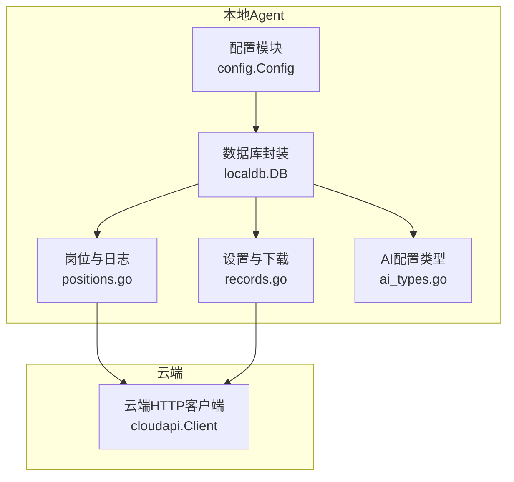
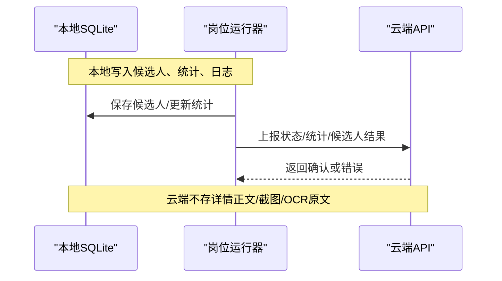
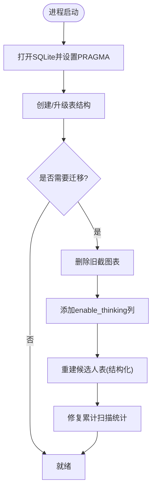
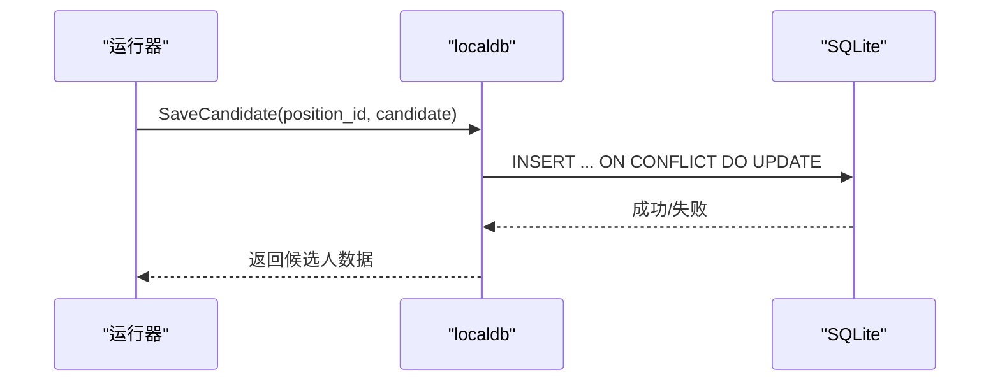
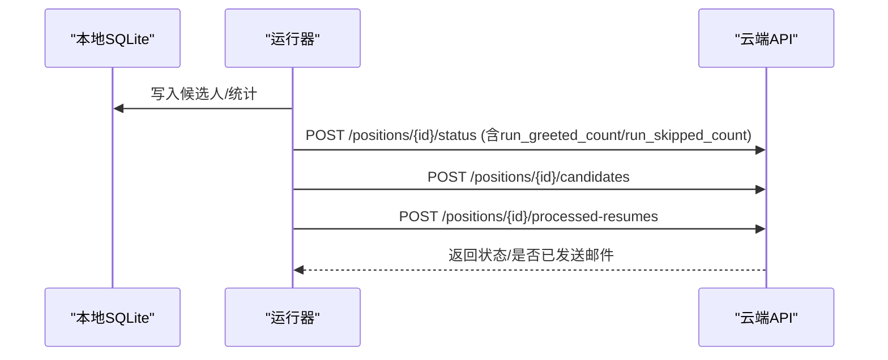
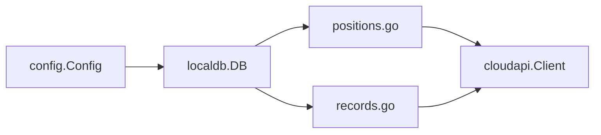
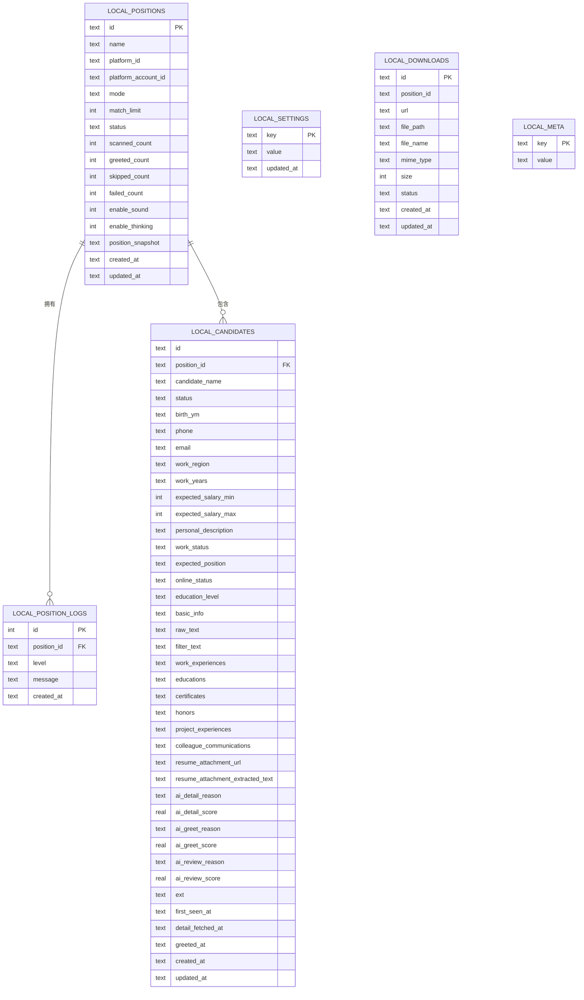

# 本地数据库设计

<cite>
**本文引用的文件**
- [db.go](file://goodhr5/local-agent-go/internal/localdb/db.go)
- [positions.go](file://goodhr5/local-agent-go/internal/localdb/positions.go)
- [records.go](file://goodhr5/local-agent-go/internal/localdb/records.go)
- [ai_types.go](file://goodhr5/local-agent-go/internal/localdb/ai_types.go)
- [config.go](file://goodhr5/local-agent-go/internal/config/config.go)
- [client.go](file://goodhr5/local-agent-go/internal/cloudapi/client.go)
- [cloud-control-local-agent-architecture.md](file://goodhr5/docs/cloud-control-local-agent-architecture.md)
</cite>

## 目录
1. [简介](#简介)
2. [项目结构](#项目结构)
3. [核心组件](#核心组件)
4. [架构总览](#架构总览)
5. [详细组件分析](#详细组件分析)
6. [依赖关系分析](#依赖关系分析)
7. [性能考虑](#性能考虑)
8. [故障排查指南](#故障排查指南)
9. [结论](#结论)
10. [附录](#附录)

## 简介
本文件面向本地 Agent 的 SQLite 数据库设计，覆盖岗位信息表、候选人记录表、AI 处理结果字段、下载与设置等核心表结构；说明本地数据与云端数据的边界、同步机制、持久化策略（WAL、时间格式、JSON 存储）、版本迁移、备份恢复、清理策略与性能优化，并给出与云端一致性保障建议。

## 项目结构
本地 Agent 的 SQLite 相关实现集中在 local-agent-go 的 internal/localdb 包中，配合配置模块与云端客户端完成初始化、运行期读写与云地同步。

图表来源
- [db.go:16-42](file://goodhr5/local-agent-go/internal/localdb/db.go#L16-L42)
- [positions.go:15-33](file://goodhr5/local-agent-go/internal/localdb/positions.go#L15-L33)
- [records.go:14-26](file://goodhr5/local-agent-go/internal/localdb/records.go#L14-L26)
- [ai_types.go:4-16](file://goodhr5/local-agent-go/internal/localdb/ai_types.go#L4-L16)
- [client.go:17-55](file://goodhr5/local-agent-go/internal/cloudapi/client.go#L17-L55)

章节来源
- [db.go:16-42](file://goodhr5/local-agent-go/internal/localdb/db.go#L16-L42)
- [config.go:26-88](file://goodhr5/local-agent-go/internal/config/config.go#L26-L88)

## 核心组件
- 数据库封装：负责打开数据库、创建/升级表结构、设置 PRAGMA、关闭连接。
- 岗位与日志：岗位运行元数据、统计计数、运行日志、快照 JSON。
- 候选人记录：结构化候选人字段、AI 打分与原因、附件与提取文本、时间戳。
- 设置与下载：本地键值设置、下载记录与稳定 ID。
- AI 配置类型：云端下发的 AI 接口参数模型（供上层使用）。

章节来源
- [db.go:62-199](file://goodhr5/local-agent-go/internal/localdb/db.go#L62-L199)
- [positions.go:15-33](file://goodhr5/local-agent-go/internal/localdb/positions.go#L15-L33)
- [records.go:14-26](file://goodhr5/local-agent-go/internal/localdb/records.go#L14-L26)
- [ai_types.go:4-16](file://goodhr5/local-agent-go/internal/localdb/ai_types.go#L4-L16)

## 架构总览
本地 SQLite 作为“执行态”数据中枢：岗位运行、候选人详情、日志、下载记录、设置均落库；云端仅保存任务元信息、统计摘要与配置。本地通过 HTTP 将统计、状态、候选人结果上报云端，形成“本地主存 + 云端摘要”的一致性模式。

图表来源
- [positions.go:317-418](file://goodhr5/local-agent-go/internal/localdb/positions.go#L317-L418)
- [client.go:236-290](file://goodhr5/local-agent-go/internal/cloudapi/client.go#L236-L290)
- [cloud-control-local-agent-architecture.md:94-117](file://goodhr5/docs/cloud-control-local-agent-architecture.md#L94-L117)

## 详细组件分析

### 数据库初始化与版本管理
- 数据目录与文件路径由配置决定，默认位于用户配置目录下的 HRPlus 文件夹，数据库文件名为 goodhr_local_go.db。
- 启动时启用 WAL 模式与外键约束，确保并发写性能与数据完整性。
- 首次运行会一次性创建所有表，并在末尾插入 schema_version=1 标记。
- 后向兼容迁移：
  - 删除旧截图表（不再持久化截图记录）。
  - 为岗位表新增 enable_thinking 字段。
  - 重建 local_candidates 以支持结构化字段。
  - 修复累计扫描统计语义（将跳过与失败计入扫描总数），并通过 meta 标记避免重复执行。

图表来源
- [db.go:22-42](file://goodhr5/local-agent-go/internal/localdb/db.go#L22-L42)
- [db.go:62-199](file://goodhr5/local-agent-go/internal/localdb/db.go#L62-L199)
- [db.go:201-232](file://goodhr5/local-agent-go/internal/localdb/db.go#L201-L232)
- [db.go:234-316](file://goodhr5/local-agent-go/internal/localdb/db.go#L234-L316)

章节来源
- [db.go:22-42](file://goodhr5/local-agent-go/internal/localdb/db.go#L22-L42)
- [db.go:62-199](file://goodhr5/local-agent-go/internal/localdb/db.go#L62-L199)
- [db.go:201-232](file://goodhr5/local-agent-go/internal/localdb/db.go#L201-L232)
- [db.go:234-316](file://goodhr5/local-agent-go/internal/localdb/db.go#L234-L316)
- [config.go:43-88](file://goodhr5/local-agent-go/internal/config/config.go#L43-L88)

### 表结构与数据模型

#### 岗位运行表 local_positions
- 用途：记录本地岗位运行实例、平台与账号、模式、匹配上限、状态、统计计数、声音提示、思考开关、岗位快照、时间戳。
- 关键字段：id、name、platform_id、platform_account_id、mode、match_limit、status、scanned_count、greeted_count、skipped_count、failed_count、enable_sound、enable_thinking、position_snapshot(JSON)、created_at、updated_at。
- 关联：被 local_position_logs、local_candidates 引用。

章节来源
- [db.go:75-92](file://goodhr5/local-agent-go/internal/localdb/db.go#L75-L92)
- [positions.go:15-33](file://goodhr5/local-agent-go/internal/localdb/positions.go#L15-L33)

#### 岗位运行日志表 local_position_logs
- 用途：按岗位维度记录运行日志，支持级别与时间排序。
- 关键字段：自增 id、position_id、level、message、created_at。
- 级联：删除岗位时级联删除日志。

章节来源
- [db.go:94-102](file://goodhr5/local-agent-go/internal/localdb/db.go#L94-L102)
- [positions.go:236-315](file://goodhr5/local-agent-go/internal/localdb/positions.go#L236-L315)

#### 候选人记录表 local_candidates
- 用途：保存打招呼后的候选人结构化信息，包含基础信息、期望薪资、工作区域/年限、教育、在线状态、原始文本、过滤文本、多段结构化数组（工作经历/教育/证书/荣誉/项目/沟通记录）、简历附件链接与提取文本、AI 各阶段评分与原因、扩展字段、关键时间戳。
- 主键：(position_id, id)，外键引用岗位表。
- 特点：与云端 position_candidates 对齐，便于后续统一处理。

章节来源
- [db.go:104-147](file://goodhr5/local-agent-go/internal/localdb/db.go#L104-L147)
- [positions.go:317-418](file://goodhr5/local-agent-go/internal/localdb/positions.go#L317-L418)

#### 设置表 local_settings
- 用途：本机通用设置，键值对形式，值以 JSON 存储，带更新时间。

章节来源
- [db.go:149-157](file://goodhr5/local-agent-go/internal/localdb/db.go#L149-L157)
- [records.go:39-82](file://goodhr5/local-agent-go/internal/localdb/records.go#L39-L82)

#### 下载记录表 local_downloads
- 用途：记录本地下载的文件元信息与状态，支持按岗位筛选。
- 关键字段：id、position_id、url、file_path、file_name、mime_type、size、status、created_at、updated_at。
- 稳定ID：当路径或URL为空时使用随机ID，否则基于路径+URL生成稳定ID。

章节来源
- [db.go:159-181](file://goodhr5/local-agent-go/internal/localdb/db.go#L159-L181)
- [records.go:84-166](file://goodhr5/local-agent-go/internal/localdb/records.go#L84-L166)

#### 元数据表 local_meta
- 用途：保存本地数据库版本与迁移标记（如 schema_version、position_scanned_count_semantics_v2）。

章节来源
- [db.go:69-73](file://goodhr5/local-agent-go/internal/localdb/db.go#L69-L73)
- [db.go:183-199](file://goodhr5/local-agent-go/internal/localdb/db.go#L183-L199)

#### AI 配置类型 AIConfig
- 用途：表示云端下发给本地岗位运行器使用的 AI 接口配置（provider、base_url、api_key、model、temperature、timeout、extra 等）。

章节来源
- [ai_types.go:4-16](file://goodhr5/local-agent-go/internal/localdb/ai_types.go#L4-L16)

### 数据流与处理逻辑

#### 候选人保存流程
- 输入：候选人的结构化字段与时间戳。
- 处理：校验岗位存在性，生成/复用候选人ID，写入或更新 local_candidates。
- 输出：返回合并后的候选人数据。

图表来源
- [positions.go:317-418](file://goodhr5/local-agent-go/internal/localdb/positions.go#L317-L418)

章节来源
- [positions.go:317-418](file://goodhr5/local-agent-go/internal/localdb/positions.go#L317-L418)

#### 岗位统计与日志
- 统计累加：scanned/greeted/skipped/failed 增量更新，自动修正 updated_at。
- 日志写入：限制保留最近 N 条，防止无限增长。

章节来源
- [positions.go:185-221](file://goodhr5/local-agent-go/internal/localdb/positions.go#L185-L221)
- [positions.go:236-278](file://goodhr5/local-agent-go/internal/localdb/positions.go#L236-L278)

#### 设置与下载
- 设置：批量键值写入，冲突时更新 value 与 updated_at。
- 下载：稳定 ID 生成，去重写入，支持按岗位查询。

章节来源
- [records.go:39-82](file://goodhr5/local-agent-go/internal/localdb/records.go#L39-L82)
- [records.go:84-166](file://goodhr5/local-agent-go/internal/localdb/records.go#L84-L166)

### 与云端的数据同步机制
- 同步方向：本地为主，云端为摘要。
- 同步内容：
  - 岗位状态与本次统计：completed/stopped/running，以及本次打招呼与跳过数量。
  - 已处理简历数增量上报。
  - 候选人结果上传至云端简历库。
  - 停止通知与失败通知。
- 不同步内容：候选人详情正文、简历原文、截图、OCR 原文、Cookie、本地浏览器 Profile。

图表来源
- [client.go:236-290](file://goodhr5/local-agent-go/internal/cloudapi/client.go#L236-L290)
- [client.go:292-340](file://goodhr5/local-agent-go/internal/cloudapi/client.go#L292-L340)
- [cloud-control-local-agent-architecture.md:94-117](file://goodhr5/docs/cloud-control-local-agent-architecture.md#L94-L117)

章节来源
- [client.go:236-290](file://goodhr5/local-agent-go/internal/cloudapi/client.go#L236-L290)
- [client.go:292-340](file://goodhr5/local-agent-go/internal/cloudapi/client.go#L292-L340)
- [cloud-control-local-agent-architecture.md:94-117](file://goodhr5/docs/cloud-control-local-agent-architecture.md#L94-L117)

### 本地数据持久化策略
- 存储引擎：SQLite，启用 WAL 模式提升并发写性能。
- 时间格式：UTC RFC3339Nano，保证跨时区一致性与可排序性。
- 复杂字段：使用 JSON 文本存储（岗位快照、设置值、结构化数组等）。
- 加密方式：当前代码未对 SQLite 文件或 JSON 字段进行应用层加密；如需敏感数据保护，可在上层增加加密层或使用加密文件系统。
- 文件路径：数据库文件位于 DataDir/goodhr_local_go.db；其他资源（运行时、日志、OCR、控制台、下载、截图）由配置模块统一管理。

章节来源
- [db.go:22-42](file://goodhr5/local-agent-go/internal/localdb/db.go#L22-L42)
- [db.go:62-67](file://goodhr5/local-agent-go/internal/localdb/db.go#L62-L67)
- [positions.go:635-639](file://goodhr5/local-agent-go/internal/localdb/positions.go#L635-L639)
- [config.go:43-88](file://goodhr5/local-agent-go/internal/config/config.go#L43-L88)

### 本地数据库初始化、版本管理与迁移
- 初始化：Open(cfg) 创建数据目录、打开数据库、执行 migrate()。
- 版本管理：local_meta.schema_version 记录当前 schema 版本；迁移脚本在每次启动时检查并执行必要变更。
- 迁移策略：
  - 删除旧表（如 local_screenshots）。
  - 新增列（如 enable_thinking）。
  - 重建表（如 local_candidates 从 payload 迁移到结构化字段）。
  - 数据修复（累计扫描统计语义修正，使用 meta 标记幂等）。

章节来源
- [db.go:22-42](file://goodhr5/local-agent-go/internal/localdb/db.go#L22-L42)
- [db.go:62-199](file://goodhr5/local-agent-go/internal/localdb/db.go#L62-L199)
- [db.go:201-232](file://goodhr5/local-agent-go/internal/localdb/db.go#L201-L232)
- [db.go:234-316](file://goodhr5/local-agent-go/internal/localdb/db.go#L234-L316)

### 备份与恢复
- 备份：直接复制 goodhr_local_go.db 文件即可；若需热备，建议在低峰期或短暂停止写入后拷贝。
- 恢复：将备份文件放回 DataDir 对应位置，重启本地 Agent 即可加载。
- 注意：WAL 模式下可能存在 .wal/.shm 文件，完整备份应包含主文件与伴随文件。

章节来源
- [db.go:22-42](file://goodhr5/local-agent-go/internal/localdb/db.go#L22-L42)
- [config.go:43-88](file://goodhr5/local-agent-go/internal/config/config.go#L43-L88)

### 清理策略
- 日志清理：每个岗位运行只保留最近 N 条日志（默认 1000），避免无限增长。
- 候选人清理：提供清空全部候选人或删除单个候选人的能力。
- 下载记录：可按岗位查询与更新，建议结合业务周期定期归档或清理。

章节来源
- [positions.go:236-278](file://goodhr5/local-agent-go/internal/localdb/positions.go#L236-L278)
- [positions.go:575-597](file://goodhr5/local-agent-go/internal/localdb/positions.go#L575-L597)
- [records.go:84-166](file://goodhr5/local-agent-go/internal/localdb/records.go#L84-L166)

### 性能优化方案
- 启用 WAL：减少读阻塞，提高并发写性能。
- 合理索引：
  - 候选人列表按 updated_at 倒序，可考虑为 position_id + updated_at 建立复合索引以提升分页与筛选性能。
  - 日志按 position_id + id 排序，已有自增主键与查询条件，通常无需额外索引。
- 批量操作：统计累加使用原子 SQL 更新，避免多次往返。
- 日志限流：限制保留条数，降低 I/O 压力。
- JSON 字段：尽量保持轻量，避免超大对象频繁更新。

章节来源
- [db.go:62-67](file://goodhr5/local-agent-go/internal/localdb/db.go#L62-L67)
- [positions.go:201-221](file://goodhr5/local-agent-go/internal/localdb/positions.go#L201-L221)
- [positions.go:236-278](file://goodhr5/local-agent-go/internal/localdb/positions.go#L236-L278)

### 本地与云端数据一致性保证
- 原则：本地主存，云端摘要。
- 一致性手段：
  - 状态同步：运行结束时上报 completed/stopped/running 及本次统计，云端据此更新任务状态。
  - 统计同步：累计统计通过增量上报，避免重复计算。
  - 候选人同步：本地结构化结果上传云端简历库，云端页面通过 Local Agent API 读取本地详情。
  - 失败通知：运行失败时主动上报，由云端发送邮件提醒。
- 容错：网络异常时，本地数据不受影响；云端不可用时，本地仍可继续运行与落库。

章节来源
- [client.go:236-340](file://goodhr5/local-agent-go/internal/cloudapi/client.go#L236-L340)
- [cloud-control-local-agent-architecture.md:94-117](file://goodhr5/docs/cloud-control-local-agent-architecture.md#L94-L117)

## 依赖关系分析
- 配置依赖：DataDir 决定数据库文件路径与其他资源目录。
- 模块耦合：
  - positions.go 依赖 db.go 提供的连接与迁移能力。
  - records.go 依赖 db.go 的连接与迁移能力。
  - cloudapi.Client 用于与云端交互，独立于 SQLite 但受配置 BaseURL 影响。
- 外部依赖：modernc.org/sqlite 驱动、UUID 生成、标准库 database/sql。

图表来源
- [config.go:26-88](file://goodhr5/local-agent-go/internal/config/config.go#L26-L88)
- [db.go:16-42](file://goodhr5/local-agent-go/internal/localdb/db.go#L16-L42)
- [positions.go:15-33](file://goodhr5/local-agent-go/internal/localdb/positions.go#L15-L33)
- [records.go:14-26](file://goodhr5/local-agent-go/internal/localdb/records.go#L14-L26)
- [client.go:17-55](file://goodhr5/local-agent-go/internal/cloudapi/client.go#L17-L55)

章节来源
- [config.go:26-88](file://goodhr5/local-agent-go/internal/config/config.go#L26-L88)
- [db.go:16-42](file://goodhr5/local-agent-go/internal/localdb/db.go#L16-L42)

## 性能考虑
- WAL 模式与外键约束已在初始化时启用。
- 统计更新采用原子 SQL，减少锁竞争。
- 日志保留上限控制，避免磁盘膨胀。
- 候选人结构化字段以 JSON 存储，建议控制单条大小，必要时拆分大对象。
- 未来可考虑为高频查询字段添加索引（如 position_id + updated_at）。

[本节为通用指导，不直接分析具体文件]

## 故障排查指南
- 数据库无法打开：检查 DataDir 是否存在且可写，确认 SQLite 驱动可用。
- 迁移失败：查看 local_meta 中的迁移标记，确认是否重复执行；必要时回滚并重新执行迁移。
- 候选人保存失败：核对岗位是否存在、JSON 字段是否合法、时间戳格式是否正确。
- 云端同步失败：检查 BaseURL、Token、网络连通性与响应码；关注错误消息翻译后的中文提示。
- 日志过多：调用日志裁剪接口，限制保留条数。

章节来源
- [db.go:22-42](file://goodhr5/local-agent-go/internal/localdb/db.go#L22-L42)
- [db.go:201-232](file://goodhr5/local-agent-go/internal/localdb/db.go#L201-L232)
- [positions.go:236-278](file://goodhr5/local-agent-go/internal/localdb/positions.go#L236-L278)
- [client.go:342-423](file://goodhr5/local-agent-go/internal/cloudapi/client.go#L342-L423)

## 结论
本地 SQLite 数据库以“岗位运行 + 候选人结构化 + 日志 + 设置/下载”为核心，采用 WAL 与 JSON 存储，具备完善的初始化、迁移与清理能力；云端仅保存摘要与配置，候选人详情与媒体资源留在本地。通过状态与统计的增量上报，实现本地与云端的一致性与可观测性。建议在后续迭代中补充索引、加密与更细粒度的备份策略。

[本节为总结，不直接分析具体文件]

## 附录

### 数据模型图（ER）

图表来源
- [db.go:69-181](file://goodhr5/local-agent-go/internal/localdb/db.go#L69-L181)