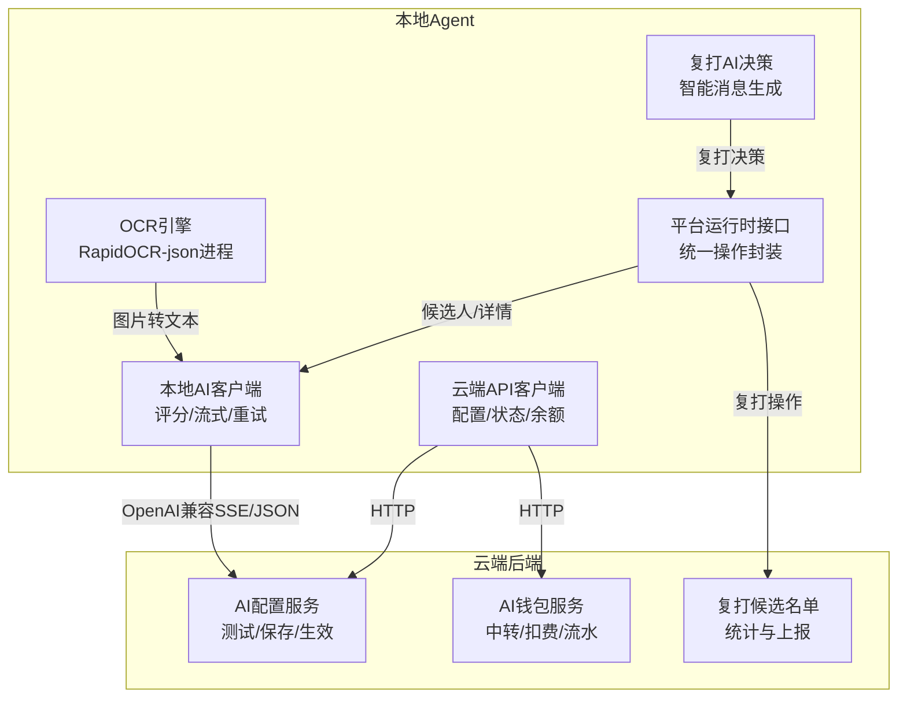
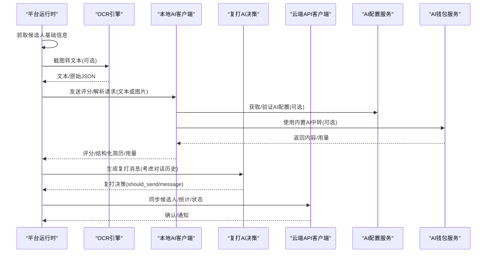
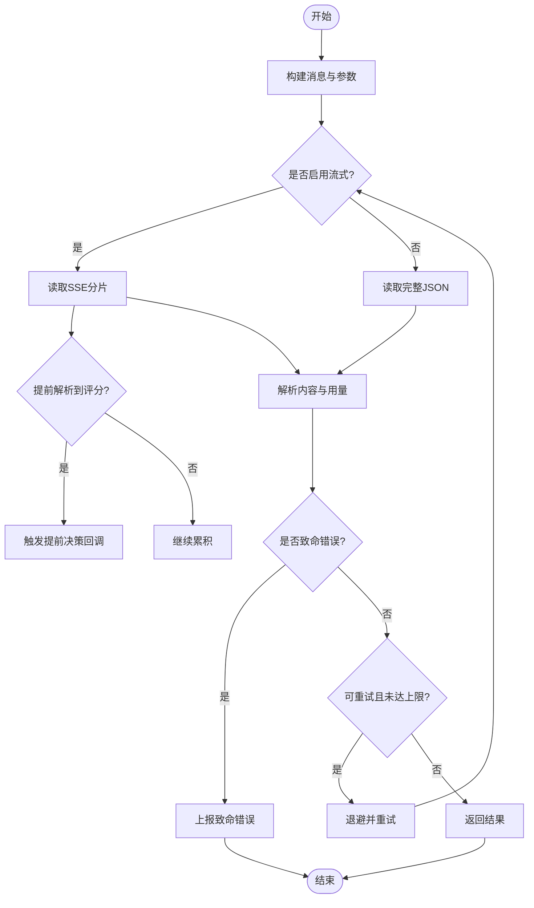
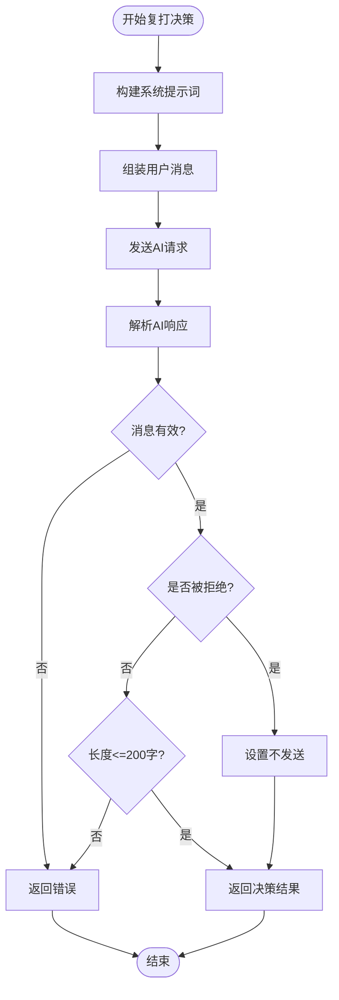
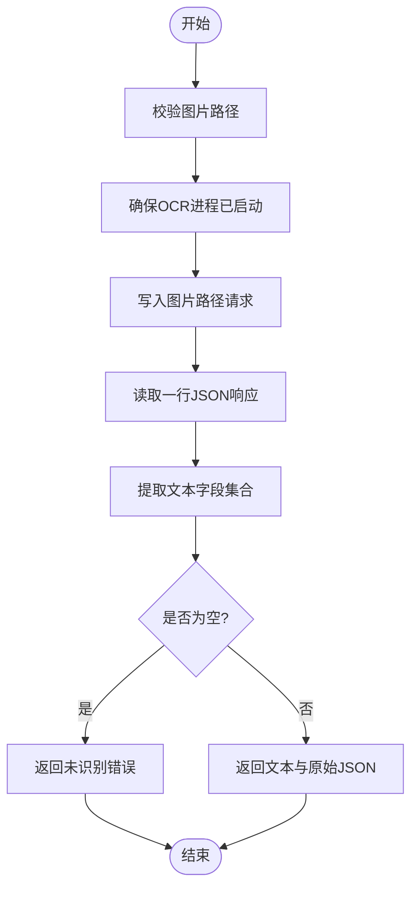
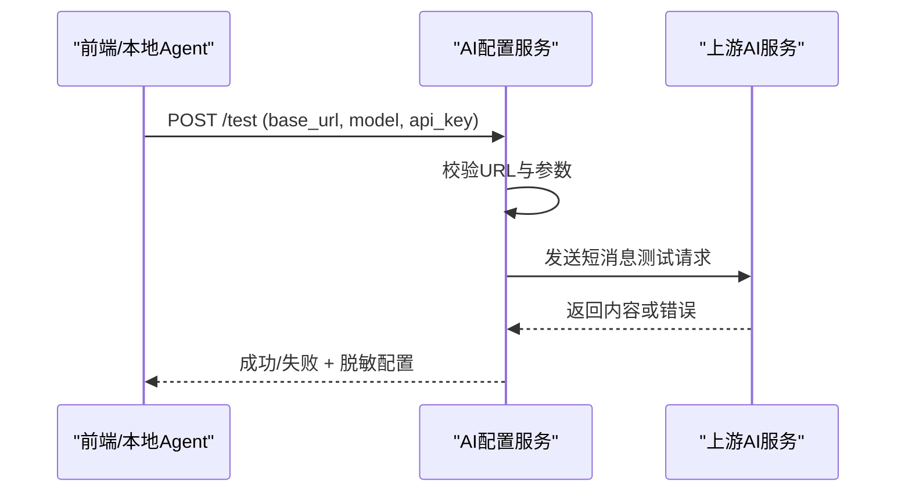
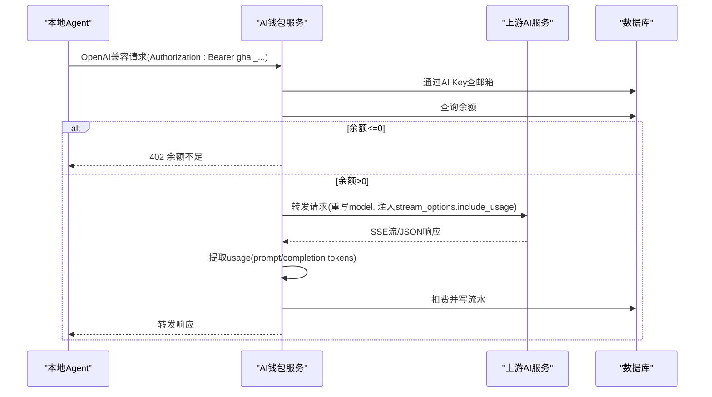
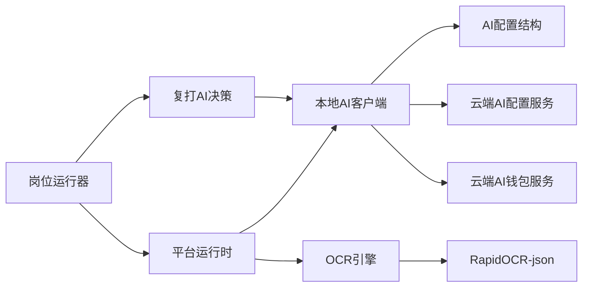

# AI集成

<cite>
**本文引用的文件**
- [local-agent-go/internal/localai/client.go](file://goodhr5/local-agent-go/internal/localai/client.go)
- [local-agent-go/internal/localai/regreet.go](file://goodhr5/local-agent-go/internal/localai/regreet.go)
- [local-agent-go/internal/ocr/engine.go](file://goodhr5/local-agent-go/internal/ocr/engine.go)
- [local-agent-go/internal/cloudapi/client.go](file://goodhr5/local-agent-go/internal/cloudapi/client.go)
- [cloud/backend/internal/httpapi/ai_config.go](file://goodhr5/cloud/backend/internal/httpapi/ai_config.go)
- [cloud/backend/internal/httpapi/ai_wallet.go](file://goodhr5/cloud/backend/internal/httpapi/ai_wallet.go)
- [local-agent-go/internal/platformcore/runtime.go](file://goodhr5/local-agent-go/internal/platformcore/runtime.go)
- [local-agent-go/internal/platformcore/auto_reply.go](file://goodhr5/local-agent-go/internal/platformcore/auto_reply.go)
- [local-agent-go/internal/localdb/ai_types.go](file://goodhr5/local-agent-go/internal/localdb/ai_types.go)
- [local-agent-go/internal/positionrunner/re_greet.go](file://goodhr5/local-agent-go/internal/positionrunner/re_greet.go)
- [local-agent-go/internal/positionrunner/error_policy.go](file://goodhr5/local-agent-go/internal/positionrunner/error_policy.go)
- [local-agent-go/internal/platforms/boss/auto_reply.go](file://goodhr5/local-agent-go/internal/platforms/boss/auto_reply.go)
</cite>

## 更新摘要
**变更内容**
- 新增复打招呼AI决策功能，支持基于聊天历史智能生成复打消息
- 扩展本地AI客户端接口，增加GenerateReGreet方法用于后续场景的智能消息生成
- 完善平台运行时接口，增加复打招呼相关操作方法
- 增强云端API客户端，支持复打候选人名单拉取与结果上报

## 目录
1. [简介](#简介)
2. [项目结构](#项目结构)
3. [核心组件](#核心组件)
4. [架构总览](#架构总览)
5. [详细组件分析](#详细组件分析)
6. [依赖关系分析](#依赖关系分析)
7. [性能与成本优化](#性能与成本优化)
8. [故障排查指南](#故障排查指南)
9. [结论](#结论)
10. [附录](#附录)

## 简介
本文件面向"AI集成"能力，系统性说明本地AI客户端、OCR识别引擎、简历解析处理、云端协作机制、负载均衡与故障转移、配置管理、性能调优与成本控制、错误处理与重试降级等。目标是让具备不同技术背景的读者都能理解并落地使用。

## 项目结构
本项目在本地Agent与云端后端之间形成清晰的职责边界：
- 本地Agent负责浏览器自动化、截图、OCR文本提取、调用OpenAI兼容接口进行评分与结构化解析，并将结果同步到云端。
- 云端后端提供AI配置管理、内置AI钱包与计费、平台配置下发、岗位运行状态同步等能力。
- 平台运行时抽象屏蔽多招聘平台的差异，统一对外暴露候选人列表、详情读取、打招呼等操作。

图示来源
- [local-agent-go/internal/localai/client.go:258-326](file://goodhr5/local-agent-go/internal/localai/client.go#L258-L326)
- [local-agent-go/internal/localai/regreet.go:33-92](file://goodhr5/local-agent-go/internal/localai/regreet.go#L33-L92)
- [local-agent-go/internal/ocr/engine.go:59-97](file://goodhr5/local-agent-go/internal/ocr/engine.go#L59-L97)
- [cloud/backend/internal/httpapi/ai_config.go:47-124](file://goodhr5/cloud/backend/internal/httpapi/ai_config.go#L47-L124)
- [cloud/backend/internal/httpapi/ai_wallet.go:208-307](file://goodhr5/cloud/backend/internal/httpapi/ai_wallet.go#L208-L307)

章节来源
- [local-agent-go/internal/platformcore/runtime.go:10-74](file://goodhr5/local-agent-go/internal/platformcore/runtime.go#L10-L74)
- [local-agent-go/internal/cloudapi/client.go:17-55](file://goodhr5/local-agent-go/internal/cloudapi/client.go#L17-L55)

## 核心组件
- 本地AI客户端：封装OpenAI兼容聊天接口，支持文本与图片输入、SSE流式响应、提前评分回调、思考模式控制、请求重试与退避、结构化简历解析。
- 复打AI决策：专门针对后续场景的AI决策模块，考虑对话历史和候选人上下文，智能判断是否发送复打消息及生成个性化内容。
- OCR引擎：通过常驻进程调用RapidOCR-json，完成截图文字提取，输出标准化文本与原始JSON。
- 云端AI配置服务：提供用户自定义AI配置的测试、保存、生效查询，限制公网HTTPS访问，防止内网探测。
- 云端AI钱包服务：提供内置AI中转、按模型计费、余额查询与流水记录、充值与赠送逻辑。
- 平台运行时：统一抽象各招聘平台的能力（打开入口、滚动、抓取候选人、读取详情、打招呼等）。
- 云端API客户端：负责本地Agent与云端交互，包括平台配置、岗位运行状态、候选人入库、统计同步等。

章节来源
- [local-agent-go/internal/localai/client.go:33-62](file://goodhr5/local-agent-go/internal/localai/client.go#L33-L62)
- [local-agent-go/internal/localai/regreet.go:14-29](file://goodhr5/local-agent-go/internal/localai/regreet.go#L14-L29)
- [local-agent-go/internal/ocr/engine.go:21-37](file://goodhr5/local-agent-go/internal/ocr/engine.go#L21-L37)
- [cloud/backend/internal/httpapi/ai_config.go:22-45](file://goodhr5/cloud/backend/internal/httpapi/ai_config.go#L22-L45)
- [cloud/backend/internal/httpapi/ai_wallet.go:79-97](file://goodhr5/cloud/backend/internal/httpapi/ai_wallet.go#L79-L97)
- [local-agent-go/internal/platformcore/runtime.go:46-74](file://goodhr5/local-agent-go/internal/platformcore/runtime.go#L46-L74)
- [local-agent-go/internal/cloudapi/client.go:17-55](file://goodhr5/local-agent-go/internal/cloudapi/client.go#L17-L55)

## 架构总览
本地Agent通过平台运行时抓取候选人信息，必要时使用OCR从详情页长图中提取文本；随后将岗位要求与候选人信息组装为提示词，调用本地AI客户端进行打分或结构化解析；结果可提前回调用于快速决策；最终将候选人结果与统计同步至云端。云端提供AI配置校验、内置AI中转与计费、岗位状态同步等服务。

图示来源
- [local-agent-go/internal/platformcore/runtime.go:58-67](file://goodhr5/local-agent-go/internal/platformcore/runtime.go#L58-L67)
- [local-agent-go/internal/ocr/engine.go:59-97](file://goodhr5/local-agent-go/internal/ocr/engine.go#L59-L97)
- [local-agent-go/internal/localai/client.go:219-256](file://goodhr5/local-agent-go/internal/localai/client.go#L219-L256)
- [local-agent-go/internal/localai/regreet.go:33-92](file://goodhr5/local-agent-go/internal/localai/regreet.go#L33-L92)
- [cloud/backend/internal/httpapi/ai_config.go:47-124](file://goodhr5/cloud/backend/internal/httpapi/ai_config.go#L47-L124)
- [cloud/backend/internal/httpapi/ai_wallet.go:208-307](file://goodhr5/cloud/backend/internal/httpapi/ai_wallet.go#L208-L307)
- [local-agent-go/internal/cloudapi/client.go:236-340](file://goodhr5/local-agent-go/internal/cloudapi/client.go#L236-L340)

## 详细组件分析

### 本地AI客户端
- 功能要点
  - 支持文本与图片输入，图片以base64 data URL形式传入。
  - 默认启用SSE流式输出，支持提前解析评分JSON并触发回调，降低等待时间。
  - 支持"思考模式"字段透传，仅在显式关闭时才会发送给下游。
  - 请求失败自动重试最多三次，遵循Retry-After策略与指数退避。
  - 结构化简历解析：当允许输出结构化简历时，AI返回的JSON包含候选关键字段，便于入库。
- 关键流程
  - 构建消息：稳定规则与动态变量分离，保证缓存友好。
  - 执行请求：兼容JSON与SSE响应，异常分类为可重试/致命错误。
  - 解析结果：提取score、reason、usage、elapsed_ms，必要时填充resume_data。
- 错误与降级
  - 网络错误、超时、服务端错误分别标记可重试或致命。
  - 致命错误会向上层报告，由岗位运行器决定是否停止任务。

图示来源
- [local-agent-go/internal/localai/client.go:258-326](file://goodhr5/local-agent-go/internal/localai/client.go#L258-L326)
- [local-agent-go/internal/localai/client.go:328-376](file://goodhr5/local-agent-go/internal/localai/client.go#L328-L376)
- [local-agent-go/internal/localai/client.go:470-539](file://goodhr5/local-agent-go/internal/localai/client.go#L470-L539)
- [local-agent-go/internal/localai/client.go:541-602](file://goodhr5/local-agent-go/internal/localai/client.go#L541-L602)

章节来源
- [local-agent-go/internal/localai/client.go:23-31](file://goodhr5/local-agent-go/internal/localai/client.go#L23-L31)
- [local-agent-go/internal/localai/client.go:164-217](file://goodhr5/local-agent-go/internal/localai/client.go#L164-L217)
- [local-agent-go/internal/localai/client.go:219-256](file://goodhr5/local-agent-go/internal/localai/client.go#L219-L256)
- [local-agent-go/internal/localai/client.go:258-326](file://goodhr5/local-agent-go/internal/localai/client.go#L258-L326)
- [local-agent-go/internal/localai/client.go:378-420](file://goodhr5/local-agent-go/internal/localai/client.go#L378-L420)

### 复打AI决策与智能消息生成
**新增** 复打AI决策模块专门为后续场景设计，综合考虑对话历史和候选人上下文，智能判断是否应该发送复打消息以及生成个性化的复打内容。

- 功能要点
  - 智能拒绝检测：分析聊天历史，识别候选人是否明确表达过拒绝意思。
  - 个性化消息生成：基于岗位要求、首次打招呼内容和对话历史，生成简短友好的复打消息。
  - 双重校验机制：确保生成的消息非空且不超过200字，被拒绝时不应发送。
  - 灵活配置支持：支持岗位级复打提示词和跳过拒绝检测模式。
- 关键流程
  - 构建系统提示词：根据是否跳过拒绝检测生成不同的规则说明。
  - 组装用户消息：整合候选人姓名、岗位要求、首次打招呼内容和聊天历史。
  - 复用HTTP/SSE能力：关闭进度回调和提前决策，专注复打决策。
  - 结果校验与清理：验证JSON格式完整性，清理多余空白字符。

图示来源
- [local-agent-go/internal/localai/regreet.go:33-92](file://goodhr5/local-agent-go/internal/localai/regreet.go#L33-L92)
- [local-agent-go/internal/localai/regreet.go:95-115](file://goodhr5/local-agent-go/internal/localai/regreet.go#L95-L115)
- [local-agent-go/internal/localai/regreet.go:118-134](file://goodhr5/local-agent-go/internal/localai/regreet.go#L118-L134)

章节来源
- [local-agent-go/internal/localai/regreet.go:14-29](file://goodhr5/local-agent-go/internal/localai/regreet.go#L14-L29)
- [local-agent-go/internal/localai/regreet.go:33-92](file://goodhr5/local-agent-go/internal/localai/regreet.go#L33-L92)
- [local-agent-go/internal/localai/regreet.go:95-115](file://goodhr5/local-agent-go/internal/localai/regreet.go#L95-L115)
- [local-agent-go/internal/localai/regreet.go:118-134](file://goodhr5/local-agent-go/internal/localai/regreet.go#L118-L134)

### OCR图像识别与文本提取
- 功能要点
  - 通过常驻进程调用RapidOCR-json，避免重复启动开销。
  - 输入为绝对路径的图片文件，输出为合并后的文本与原始JSON。
  - 进程生命周期管理：首次调用时启动，后续复用；异常退出时自动清理并提示日志位置。
  - 模型完整性检查：确保必要的ONNX模型存在。
- 关键流程
  - 校验图片路径与存在性。
  - 确保进程已启动并写入请求行。
  - 读取一行JSON响应，提取text字段集合。
  - 若结果为空，返回"未识别到文字"错误。

图示来源
- [local-agent-go/internal/ocr/engine.go:59-97](file://goodhr5/local-agent-go/internal/ocr/engine.go#L59-L97)
- [local-agent-go/internal/ocr/engine.go:99-146](file://goodhr5/local-agent-go/internal/ocr/engine.go#L99-L146)
- [local-agent-go/internal/ocr/engine.go:148-179](file://goodhr5/local-agent-go/internal/ocr/engine.go#L148-L179)
- [local-agent-go/internal/ocr/engine.go:240-286](file://goodhr5/local-agent-go/internal/ocr/engine.go#L240-L286)
- [local-agent-go/internal/ocr/engine.go:298-326](file://goodhr5/local-agent-go/internal/ocr/engine.go#L298-L326)

章节来源
- [local-agent-go/internal/ocr/engine.go:21-37](file://goodhr5/local-agent-go/internal/ocr/engine.go#L21-L37)
- [local-agent-go/internal/ocr/engine.go:59-97](file://goodhr5/local-agent-go/internal/ocr/engine.go#L59-L97)
- [local-agent-go/internal/ocr/engine.go:99-146](file://goodhr5/local-agent-go/internal/ocr/engine.go#L99-L146)

### 云端AI配置管理与测试
- 功能要点
  - 提供用户自定义AI配置的测试接口，强制公网HTTPS，禁止内网地址与本机地址。
  - 支持保存与读取用户配置，区分公开字段与明文Key（仅特定场景返回）。
  - 规范化chat/completions地址，自动补全/v1前缀。
- 关键流程
  - 校验请求体与URL合法性。
  - 发起一次轻量测试请求，限制超时与重定向次数。
  - 返回测试结果与脱敏后的配置摘要。

图示来源
- [cloud/backend/internal/httpapi/ai_config.go:47-124](file://goodhr5/cloud/backend/internal/httpapi/ai_config.go#L47-L124)
- [cloud/backend/internal/httpapi/ai_config.go:126-169](file://goodhr5/cloud/backend/internal/httpapi/ai_config.go#L126-L169)
- [cloud/backend/internal/httpapi/ai_config.go:171-224](file://goodhr5/cloud/backend/internal/httpapi/ai_config.go#L171-L224)
- [cloud/backend/internal/httpapi/ai_config.go:265-340](file://goodhr5/cloud/backend/internal/httpapi/ai_config.go#L265-L340)
- [cloud/backend/internal/httpapi/ai_config.go:342-397](file://goodhr5/cloud/backend/internal/httpapi/ai_config.go#L342-L397)

章节来源
- [cloud/backend/internal/httpapi/ai_config.go:47-124](file://goodhr5/cloud/backend/internal/httpapi/ai_config.go#L47-L124)
- [cloud/backend/internal/httpapi/ai_config.go:126-169](file://goodhr5/cloud/backend/internal/httpapi/ai_config.go#L126-L169)
- [cloud/backend/internal/httpapi/ai_config.go:171-224](file://goodhr5/cloud/backend/internal/httpapi/ai_config.go#L171-L224)
- [cloud/backend/internal/httpapi/ai_config.go:265-397](file://goodhr5/cloud/backend/internal/httpapi/ai_config.go#L265-L397)

### 云端AI钱包与成本控制
- 功能要点
  - 内置AI中转：将本地Agent的请求转发到上游AI服务，按模型价格扣除用户余额。
  - 余额单位：以0.0001元为单位，支持充值、注册赠送、流水查询。
  - 流式代理：转发SSE流并在分片中提取usage，实现实时扣费。
  - 模型白名单：只允许系统配置的模型ID，防止滥用。
- 关键流程
  - 鉴权：通过用户专属AI Key查找邮箱。
  - 余额检查：余额不足直接拒绝。
  - 转发请求：重写模型ID，必要时注入usage开关。
  - 扣费：根据prompt_tokens与completion_tokens计算费用并写流水。

图示来源
- [cloud/backend/internal/httpapi/ai_wallet.go:208-307](file://goodhr5/cloud/backend/internal/httpapi/ai_wallet.go#L208-L307)
- [cloud/backend/internal/httpapi/ai_wallet.go:309-326](file://goodhr5/cloud/backend/internal/httpapi/ai_wallet.go#L309-L326)
- [cloud/backend/internal/httpapi/ai_wallet.go:417-460](file://goodhr5/cloud/backend/internal/httpapi/ai_wallet.go#L417-L460)
- [cloud/backend/internal/httpapi/ai_wallet.go:697-750](file://goodhr5/cloud/backend/internal/httpapi/ai_wallet.go#L697-L750)
- [cloud/backend/internal/httpapi/ai_wallet.go:761-800](file://goodhr5/cloud/backend/internal/httpapi/ai_wallet.go#L761-L800)

章节来源
- [cloud/backend/internal/httpapi/ai_wallet.go:23-31](file://goodhr5/cloud/backend/internal/httpapi/ai_wallet.go#L23-L31)
- [cloud/backend/internal/httpapi/ai_wallet.go:79-97](file://goodhr5/cloud/backend/internal/httpapi/ai_wallet.go#L79-L97)
- [cloud/backend/internal/httpapi/ai_wallet.go:208-307](file://goodhr5/cloud/backend/internal/httpapi/ai_wallet.go#L208-L307)
- [cloud/backend/internal/httpapi/ai_wallet.go:309-326](file://goodhr5/cloud/backend/internal/httpapi/ai_wallet.go#L309-L326)
- [cloud/backend/internal/httpapi/ai_wallet.go:417-460](file://goodhr5/cloud/backend/internal/httpapi/ai_wallet.go#L417-L460)
- [cloud/backend/internal/httpapi/ai_wallet.go:697-750](file://goodhr5/cloud/backend/internal/httpapi/ai_wallet.go#L697-L750)
- [cloud/backend/internal/httpapi/ai_wallet.go:761-800](file://goodhr5/cloud/backend/internal/httpapi/ai_wallet.go#L761-L800)

### 简历解析与结构化输出
- 功能要点
  - 当岗位配置允许输出结构化简历时，AI返回包含候选人关键字段的JSON，如姓名、电话、邮箱、教育经历、工作经历等。
  - 本地AI客户端在视觉模式下一次性完成详情识别与打招呼评分，并填充resume_data供上层入库。
- 关键流程
  - 构建系统提示词，要求AI按示例格式输出结构化字段。
  - 解析返回内容，提取analysis与resume数据。
  - 将结构化数据存入数据库或同步到云端。

章节来源
- [local-agent-go/internal/localai/client.go:219-256](file://goodhr5/local-agent-go/internal/localai/client.go#L219-L256)
- [local-agent-go/internal/localai/client.go:689-722](file://goodhr5/local-agent-go/internal/localai/client.go#L689-L722)
- [local-agent-go/internal/localai/client.go:724-800](file://goodhr5/local-agent-go/internal/localai/client.go#L724-L800)

### 与云端服务的协作机制
- 配置拉取：本地Agent通过云端API客户端获取平台配置、用户偏好、有效AI配置等。
- 状态同步：岗位运行过程中或结束时，向云端同步状态、统计与候选人结果。
- 认证与会话：云端接口使用Bearer Token保护，本地客户端在请求中携带令牌。
- 复打候选名单：支持拉取符合条件的复打候选人列表，并上报复打结果。

章节来源
- [local-agent-go/internal/cloudapi/client.go:79-126](file://goodhr5/local-agent-go/internal/cloudapi/client.go#L79-L126)
- [local-agent-go/internal/cloudapi/client.go:150-190](file://goodhr5/local-agent-go/internal/cloudapi/client.go#L150-L190)
- [local-agent-go/internal/cloudapi/client.go:236-340](file://goodhr5/local-agent-go/internal/cloudapi/client.go#L236-L340)
- [local-agent-go/internal/cloudapi/client.go:342-383](file://goodhr5/local-agent-go/internal/cloudapi/client.go#L342-L383)
- [local-agent-go/internal/cloudapi/client.go:539-577](file://goodhr5/local-agent-go/internal/cloudapi/client.go#L539-L577)
- [local-agent-go/internal/cloudapi/client.go:581-610](file://goodhr5/local-agent-go/internal/cloudapi/client.go#L581-L610)

## 依赖关系分析
- 本地AI客户端依赖本地数据库中的AI配置结构，用于构造请求参数与超时设置。
- 复打AI决策依赖本地AI客户端的Chat方法进行AI调用。
- OCR引擎依赖外部RapidOCR-json可执行文件与模型文件，需确保安装与完整性。
- 云端AI配置服务依赖认证服务与存储接口，限制公网访问与安全校验。
- 云端AI钱包服务依赖认证、配置、系统与数据库，实现中转与计费闭环。
- 平台运行时作为统一抽象，被岗位运行器调用，屏蔽平台差异。
- 岗位运行器协调复打流程，包括候选人定位、AI决策、消息发送与结果上报。

图示来源
- [local-agent-go/internal/localdb/ai_types.go:4-16](file://goodhr5/local-agent-go/internal/localdb/ai_types.go#L4-L16)
- [local-agent-go/internal/localai/regreet.go:33-92](file://goodhr5/local-agent-go/internal/localai/regreet.go#L33-L92)
- [local-agent-go/internal/ocr/engine.go:240-286](file://goodhr5/local-agent-go/internal/ocr/engine.go#L240-L286)
- [cloud/backend/internal/httpapi/ai_config.go:22-45](file://goodhr5/cloud/backend/internal/httpapi/ai_config.go#L22-L45)
- [cloud/backend/internal/httpapi/ai_wallet.go:79-97](file://goodhr5/cloud/backend/internal/httpapi/ai_wallet.go#L79-L97)
- [local-agent-go/internal/platformcore/runtime.go:46-74](file://goodhr5/local-agent-go/internal/platformcore/runtime.go#L46-L74)
- [local-agent-go/internal/positionrunner/re_greet.go:25-48](file://goodhr5/local-agent-go/internal/positionrunner/re_greet.go#L25-L48)

章节来源
- [local-agent-go/internal/localdb/ai_types.go:4-16](file://goodhr5/local-agent-go/internal/localdb/ai_types.go#L4-L16)
- [local-agent-go/internal/localai/regreet.go:33-92](file://goodhr5/local-agent-go/internal/localai/regreet.go#L33-L92)
- [local-agent-go/internal/ocr/engine.go:240-286](file://goodhr5/local-agent-go/internal/ocr/engine.go#L240-L286)
- [cloud/backend/internal/httpapi/ai_config.go:22-45](file://goodhr5/cloud/backend/internal/httpapi/ai_config.go#L22-L45)
- [cloud/backend/internal/httpapi/ai_wallet.go:79-97](file://goodhr5/cloud/backend/internal/httpapi/ai_wallet.go#L79-L97)
- [local-agent-go/internal/platformcore/runtime.go:46-74](file://goodhr5/local-agent-go/internal/platformcore/runtime.go#L46-L74)
- [local-agent-go/internal/positionrunner/re_greet.go:25-48](file://goodhr5/local-agent-go/internal/positionrunner/re_greet.go#L25-L48)

## 性能与成本优化
- 流式输出与提前决策：默认启用SSE，尽早解析评分并回调，减少端到端延迟。
- 请求重试与退避：对临时错误最多重试三次，尊重Retry-After头，避免雪崩。
- 结构化简历输出：按需开启，减少不必要的字段解析与传输。
- 内置AI中转与计费：通过模型白名单与用量提取，精确扣费，避免资源滥用。
- 并发与连接池：HTTP客户端可配置超时与连接复用，建议在高并发场景下合理设置。
- 复打决策优化：单次AI调用同时完成拒绝检测和消息生成，减少token消耗。
- 成本控制方案
  - 调整温度与最大token限制，降低生成长度。
  - 使用更经济的模型或本地模型替代高成本模型。
  - 结合阈值过滤，减少低匹配候选人的AI调用。
  - 监控用量与余额，设置预警与自动暂停策略。

[本节为通用指导，不直接分析具体文件]

## 故障排查指南
- 常见错误类型
  - AI服务错误：网络错误、超时、4xx/5xx状态码，部分为致命错误需停止任务。
  - OCR错误：组件未安装、模型不完整、进程退出、无输出等。
  - 云端错误：登录态失效、余额不足、配置缺失等。
  - 复打错误：AI决策格式不完整、消息内容为空或超长、候选人拒绝检测失败等。
- 错误处理与重试
  - 本地AI客户端对临时错误进行重试，致命错误向上层报告。
  - 岗位运行器对连续相同错误进行计数，达到阈值自动停止。
  - OCR错误分类为致命时，提示查看日志路径并终止相关流程。
  - 复打决策错误会记录详细原因，包括AI响应格式问题和内容校验失败。
- 降级策略
  - 云端不可用时，本地可继续使用缓存的配置与离线判断。
  - 内置AI不可用或余额不足时，回退到用户自定义AI或跳过该环节。
  - 流式中断时，尝试以非流式方式解析响应。
  - 复打AI决策失败时，跳过该候选人并记录失败原因。

章节来源
- [local-agent-go/internal/localai/client.go:64-100](file://goodhr5/local-agent-go/internal/localai/client.go#L64-L100)
- [local-agent-go/internal/localai/client.go:378-420](file://goodhr5/local-agent-go/internal/localai/client.go#L378-L420)
- [local-agent-go/internal/localai/regreet.go:72-91](file://goodhr5/local-agent-go/internal/localai/regreet.go#L72-L91)
- [local-agent-go/internal/positionrunner/error_policy.go:87-119](file://goodhr5/local-agent-go/internal/positionrunner/error_policy.go#L87-L119)
- [local-agent-go/internal/ocr/engine.go:181-238](file://goodhr5/local-agent-go/internal/ocr/engine.go#L181-L238)
- [local-agent-go/internal/cloudapi/client.go:150-164](file://goodhr5/local-agent-go/internal/cloudapi/client.go#L150-L164)
- [cloud/backend/internal/httpapi/ai_wallet.go:224-232](file://goodhr5/cloud/backend/internal/httpapi/ai_wallet.go#L224-L232)

## 结论
本AI集成方案通过本地AI客户端与OCR引擎协同，结合云端配置与钱包服务，实现了高效、可靠、可控的候选人筛选与简历解析流程。新增的复打AI决策功能进一步增强了后续场景的智能处理能力，能够基于对话历史生成个性化的复打消息。流式输出与提前决策显著降低延迟；重试与退避提升鲁棒性；内置AI中转与计费保障成本可控。建议在大规模部署中结合阈值过滤、模型选择与用量监控，进一步优化性能与成本。

[本节为总结，不直接分析具体文件]

## 附录
- 术语说明
  - 本地AI客户端：本地Agent中调用OpenAI兼容接口的模块。
  - 复打AI决策：专门针对后续场景的AI决策模块，考虑对话历史和候选人上下文。
  - OCR引擎：基于RapidOCR-json的图片文字识别组件。
  - 平台运行时：统一抽象各招聘平台能力的接口层。
  - 云端AI配置服务：提供AI配置的测试、保存与生效查询。
  - 云端AI钱包服务：提供内置AI中转、计费与流水记录。
- 参考路径
  - 本地AI客户端实现：[local-agent-go/internal/localai/client.go](file://goodhr5/local-agent-go/internal/localai/client.go)
  - 复打AI决策实现：[local-agent-go/internal/localai/regreet.go](file://goodhr5/local-agent-go/internal/localai/regreet.go)
  - OCR引擎实现：[local-agent-go/internal/ocr/engine.go](file://goodhr5/local-agent-go/internal/ocr/engine.go)
  - 云端AI配置服务：[cloud/backend/internal/httpapi/ai_config.go](file://goodhr5/cloud/backend/internal/httpapi/ai_config.go)
  - 云端AI钱包服务：[cloud/backend/internal/httpapi/ai_wallet.go](file://goodhr5/cloud/backend/internal/httpapi/ai_wallet.go)
  - 平台运行时接口：[local-agent-go/internal/platformcore/runtime.go](file://goodhr5/local-agent-go/internal/platformcore/runtime.go)
  - 云端API客户端：[local-agent-go/internal/cloudapi/client.go](file://goodhr5/local-agent-go/internal/cloudapi/client.go)
  - AI配置数据结构：[local-agent-go/internal/localdb/ai_types.go](file://goodhr5/local-agent-go/internal/localdb/ai_types.go)
  - 错误处理策略：[local-agent-go/internal/positionrunner/error_policy.go](file://goodhr5/local-agent-go/internal/positionrunner/error_policy.go)
  - 复打流程编排：[local-agent-go/internal/positionrunner/re_greet.go](file://goodhr5/local-agent-go/internal/positionrunner/re_greet.go)
  - 平台复打实现：[local-agent-go/internal/platforms/boss/auto_reply.go](file://goodhr5/local-agent-go/internal/platforms/boss/auto_reply.go)

[本节为附录，不直接分析具体文件]