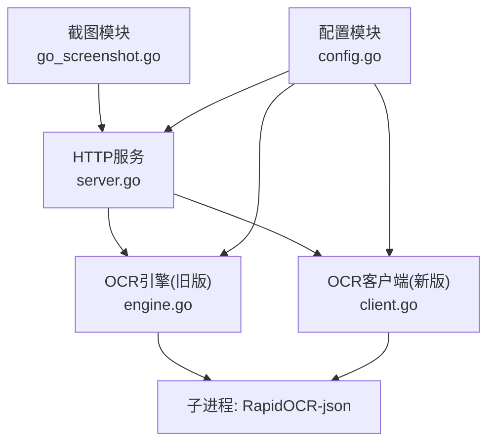
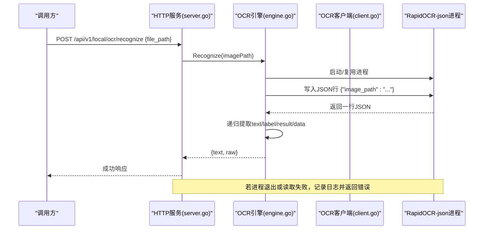
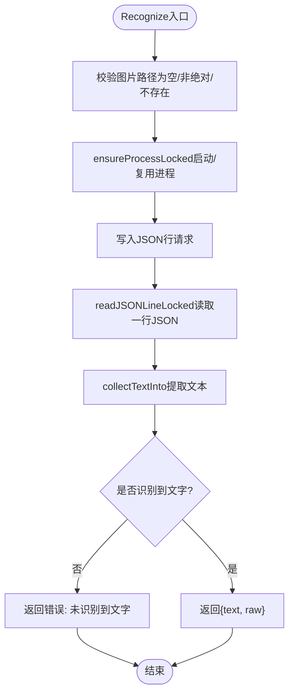
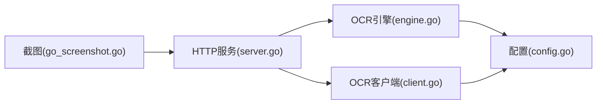

# OCR识别引擎

<cite>
**本文引用的文件**
- [engine.go](file://goodhr5/local-agent-go/internal/ocr/engine.go)
- [command_windows.go](file://goodhr5/local-agent-go/internal/ocr/command_windows.go)
- [command_other.go](file://goodhr5/local-agent-go/internal/ocr/command_other.go)
- [config.go](file://goodhr5/local-agent-go/internal/config/config.go)
- [server.go](file://goodhr5/local-agent-go/internal/app/server.go)
- [client.go](file://goodhr5/local-agent-go-new/internal/integration/ocr/client.go)
- [go_screenshot.go](file://goodhr5/local-agent-go/internal/browser/go_screenshot.go)
</cite>

## 目录
1. [简介](#简介)
2. [项目结构](#项目结构)
3. [核心组件](#核心组件)
4. [架构总览](#架构总览)
5. [详细组件分析](#详细组件分析)
6. [依赖关系分析](#依赖关系分析)
7. [性能与内存管理](#性能与内存管理)
8. [错误处理与重试机制](#错误处理与重试机制)
9. [配置选项与环境变量](#配置选项与环境变量)
10. [多语言与识别精度优化](#多语言与识别精度优化)
11. [批量处理能力](#批量处理能力)
12. [平台兼容性与部署注意事项](#平台兼容性与部署注意事项)
13. [故障排查指南](#故障排查指南)
14. [结论](#结论)

## 简介
本OCR识别引擎通过本地常驻进程调用RapidOCR-json，对截图进行文字识别。其设计目标是：
- 将敏感图片数据保留在本地，仅返回识别文本；
- 以JSON行协议与外部组件通信，便于集成到浏览器控制、岗位运行等流程；
- 提供稳定的错误分类、日志记录、状态查询能力；
- 支持跨平台（Windows与非Windows）的启动参数差异与窗口隐藏。

## 项目结构
OCR相关代码主要分布在以下位置：
- Go旧版实现：local-agent-go/internal/ocr
- Go新版实现：local-agent-go-new/internal/integration/ocr
- HTTP服务暴露：local-agent-go/internal/app/server.go
- 配置与路径：local-agent-go/internal/config/config.go
- 截图生成：local-agent-go/internal/browser/go_screenshot.go

图表来源
- [server.go:484-517](file://goodhr5/local-agent-go/internal/app/server.go#L484-L517)
- [engine.go:21-97](file://goodhr5/local-agent-go/internal/ocr/engine.go#L21-L97)
- [client.go:65-132](file://goodhr5/local-agent-go-new/internal/integration/ocr/client.go#L65-L132)
- [go_screenshot.go:14-86](file://goodhr5/local-agent-go/internal/browser/go_screenshot.go#L14-L86)
- [config.go:26-88](file://goodhr5/local-agent-go/internal/config/config.go#L26-L88)

章节来源
- [server.go:484-517](file://goodhr5/local-agent-go/internal/app/server.go#L484-L517)
- [engine.go:21-97](file://goodhr5/local-agent-go/internal/ocr/engine.go#L21-L97)
- [client.go:65-132](file://goodhr5/local-agent-go-new/internal/integration/ocr/client.go#L65-L132)
- [go_screenshot.go:14-86](file://goodhr5/local-agent-go/internal/browser/go_screenshot.go#L14-L86)
- [config.go:26-88](file://goodhr5/local-agent-go/internal/config/config.go#L26-L88)

## 核心组件
- OCR引擎（旧版）：Engine，负责启动并维护RapidOCR-json常驻进程，发送图片路径请求，读取一行JSON结果，提取文本。
- OCR客户端（新版）：Client，提供更稳定的错误码和解析逻辑，同样基于JSON行协议。
- HTTP接口：/api/v1/local/ocr/status 与 /api/v1/local/ocr/recognize，用于状态查询和图片识别。
- 截图模块：生成PNG截图并保存到本地目录，供OCR使用。
- 配置模块：定义数据目录、运行时目录、OCR目录等路径，确保必要的目录存在。

章节来源
- [engine.go:21-97](file://goodhr5/local-agent-go/internal/ocr/engine.go#L21-L97)
- [client.go:65-132](file://goodhr5/local-agent-go-new/internal/integration/ocr/client.go#L65-L132)
- [server.go:484-517](file://goodhr5/local-agent-go/internal/app/server.go#L484-L517)
- [go_screenshot.go:14-86](file://goodhr5/local-agent-go/internal/browser/go_screenshot.go#L14-L86)
- [config.go:26-88](file://goodhr5/local-agent-go/internal/config/config.go#L26-L88)

## 架构总览
OCR识别的整体流程如下：
- 上层业务或浏览器控制模块生成截图，保存为本地PNG；
- 通过HTTP接口或内部API调用OCR引擎/客户端；
- OCR引擎/客户端校验图片路径，启动或复用RapidOCR-json进程；
- 以JSON行协议发送图片路径，等待一行JSON响应；
- 从JSON中递归提取文本字段，返回结构化结果；
- 异常时记录日志并清理资源。

图表来源
- [server.go:494-517](file://goodhr5/local-agent-go/internal/app/server.go#L494-L517)
- [engine.go:59-97](file://goodhr5/local-agent-go/internal/ocr/engine.go#L59-L97)
- [client.go:102-132](file://goodhr5/local-agent-go-new/internal/integration/ocr/client.go#L102-L132)

## 详细组件分析

### OCR引擎（旧版）
- 进程管理：ensureProcessLocked负责检查并启动RapidOCR-json，创建stdin/stdout管道，后台Wait监听退出；
- 请求协议：向stdin写入{"image_path":"..."}，按行读取JSON；
- 结果解析：collectTextInto递归遍历JSON，收集text、txt、label、data、result字段；
- 错误处理：readJSONLineLocked区分上下文取消、组件退出、EOF等错误，并附带日志路径；
- 平台适配：Windows下隐藏控制台窗口，非Windows无操作；
- 模型检查：modelsReady验证models/ch_PP-OCRv3_det_infer.onnx是否存在；
- 可执行文件查找：优先环境变量GOODHR_OCR_EXECUTABLE，其次OCRDir，最后PATH。

图表来源
- [engine.go:59-97](file://goodhr5/local-agent-go/internal/ocr/engine.go#L59-L97)
- [engine.go:148-179](file://goodhr5/local-agent-go/internal/ocr/engine.go#L148-L179)
- [engine.go:298-325](file://goodhr5/local-agent-go/internal/ocr/engine.go#L298-L325)

章节来源
- [engine.go:21-97](file://goodhr5/local-agent-go/internal/ocr/engine.go#L21-L97)
- [engine.go:99-146](file://goodhr5/local-agent-go/internal/ocr/engine.go#L99-L146)
- [engine.go:148-179](file://goodhr5/local-agent-go/internal/ocr/engine.go#L148-L179)
- [engine.go:202-238](file://goodhr5/local-agent-go/internal/ocr/engine.go#L202-L238)
- [engine.go:240-296](file://goodhr5/local-agent-go/internal/ocr/engine.go#L240-L296)
- [engine.go:298-325](file://goodhr5/local-agent-go/internal/ocr/engine.go#L298-L325)
- [command_windows.go:11-21](file://goodhr5/local-agent-go/internal/ocr/command_windows.go#L11-L21)
- [command_other.go:8-10](file://goodhr5/local-agent-go/internal/ocr/command_other.go#L8-L10)

### OCR客户端（新版）
- 稳定错误码：ErrorUnavailable与ErrorNoText，便于上层区分组件故障与单图无文字；
- 进程管理：ensureProcessLocked与ensureProcessLocked类似，但错误包装为Error；
- 请求协议：使用json.NewEncoder写入{"ImagePath":"..."}，读取一行JSON；
- 结果解析：parseOCRText解析JSON行，提取文本；
- 可执行文件查找：resolveExecutable与findOCRExecutable支持指定根目录递归查找；
- 附加参数：ocrArgs读取GOODHR_OCR_ARGS环境变量。

章节来源
- [client.go:20-63](file://goodhr5/local-agent-go-new/internal/integration/ocr/client.go#L20-L63)
- [client.go:65-132](file://goodhr5/local-agent-go-new/internal/integration/ocr/client.go#L65-L132)
- [client.go:144-181](file://goodhr5/local-agent-go-new/internal/integration/ocr/client.go#L144-L181)
- [client.go:246-292](file://goodhr5/local-agent-go-new/internal/integration/ocr/client.go#L246-L292)

### HTTP服务集成
- 状态接口：GET /api/v1/local/ocr/status，返回installed、path、dir、mode、models_ok；
- 识别接口：POST /api/v1/local/ocr/recognize，接收file_path/path/screenshot_path，返回text与raw；
- 安全校验：validateLocalImagePath限制只能识别GoodHR数据目录内的图片；
- 错误映射：识别失败返回HTTP 400与错误信息。

章节来源
- [server.go:484-517](file://goodhr5/local-agent-go/internal/app/server.go#L484-L517)
- [server.go:519-535](file://goodhr5/local-agent-go/internal/app/server.go#L519-L535)

### 截图生成
- 页面/元素截图：ScreenshotPage与ScreenshotElement，支持full_page与clip；
- 输出格式：PNG，base64解码后写入本地文件；
- 默认目录：未指定时使用系统临时目录下的goodhr-screenshots；
- 文件名策略：safeFilename避免非法名称，否则使用时间戳命名。

章节来源
- [go_screenshot.go:14-86](file://goodhr5/local-agent-go/internal/browser/go_screenshot.go#L14-L86)

## 依赖关系分析
- HTTP服务依赖OCR引擎/客户端；
- OCR引擎/客户端依赖配置模块获取路径；
- 截图模块独立于OCR，但产物被OCR使用；
- 平台差异通过构建标签分离（Windows/非Windows）。

图表来源
- [server.go:484-517](file://goodhr5/local-agent-go/internal/app/server.go#L484-L517)
- [engine.go:21-97](file://goodhr5/local-agent-go/internal/ocr/engine.go#L21-L97)
- [client.go:65-132](file://goodhr5/local-agent-go-new/internal/integration/ocr/client.go#L65-L132)
- [config.go:26-88](file://goodhr5/local-agent-go/internal/config/config.go#L26-L88)
- [go_screenshot.go:14-86](file://goodhr5/local-agent-go/internal/browser/go_screenshot.go#L14-L86)

章节来源
- [server.go:484-517](file://goodhr5/local-agent-go/internal/app/server.go#L484-L517)
- [engine.go:21-97](file://goodhr5/local-agent-go/internal/ocr/engine.go#L21-L97)
- [client.go:65-132](file://goodhr5/local-agent-go-new/internal/integration/ocr/client.go#L65-L132)
- [config.go:26-88](file://goodhr5/local-agent-go/internal/config/config.go#L26-L88)
- [go_screenshot.go:14-86](file://goodhr5/local-agent-go/internal/browser/go_screenshot.go#L14-L86)

## 性能与内存管理
- 常驻进程：OCR引擎/客户端维护单一RapidOCR-json进程，减少启动开销；
- 串行请求：通过互斥锁保证同一时间只有一个OCR请求，避免并发竞争；
- 管道读写：使用bufio.Reader逐行读取JSON，降低内存占用；
- 超时与取消：readJSONLineLocked支持上下文取消，及时终止进程；
- 日志落盘：stderr重定向到logs/ocr.log，便于问题定位；
- 模型检查：启动前验证模型文件完整性，避免无效请求。

[本节为通用性能讨论，不直接分析具体文件]

## 错误处理与重试机制
- 错误分类：
  - 组件不可用：ErrorUnavailable，表示未安装、无法启动或异常退出；
  - 无文字：ErrorNoText，表示当前图片没有识别到文字；
- 错误包装：新实现使用Error类型，包含Code、Message、Cause，并提供IsUnavailable与IsNoText判断；
- 重试建议：
  - 组件不可用：应触发重试或降级策略（如提示用户重新安装OCR组件）；
  - 无文字：可尝试调整截图区域或清晰度后重试；
- 连续错误策略：岗位运行层有连续错误计数与重置逻辑，可用于OCR上游流程的容错控制。

章节来源
- [client.go:20-63](file://goodhr5/local-agent-go-new/internal/integration/ocr/client.go#L20-L63)
- [client.go:102-132](file://goodhr5/local-agent-go-new/internal/integration/ocr/client.go#L102-L132)
- [engine.go:148-179](file://goodhr5/local-agent-go/internal/ocr/engine.go#L148-L179)
- [engine.go:218-238](file://goodhr5/local-agent-go/internal/ocr/engine.go#L218-L238)

## 配置选项与环境变量
- 数据与运行时目录：
  - DataDir、RuntimeDir、LogsDir、OCRDir、ScreenshotsDir由配置模块创建与组织；
- 可执行文件查找：
  - GOODHR_OCR_EXECUTABLE：指定OCR可执行文件路径；
  - PATH：系统PATH中查找RapidOCR-json；
  - OCRDir：运行时目录下的ocr子目录；
- 启动参数：
  - GOODHR_OCR_ARGS：传入额外参数给RapidOCR-json；
- 模型文件：
  - models/ch_PP-OCRv3_det_infer.onnx：检测模型，需存在于可执行文件同级models目录；
- 日志路径：
  - runtime/logs/ocr.log：OCR组件标准错误输出。

章节来源
- [config.go:26-88](file://goodhr5/local-agent-go/internal/config/config.go#L26-L88)
- [engine.go:240-296](file://goodhr5/local-agent-go/internal/ocr/engine.go#L240-L296)
- [client.go:246-292](file://goodhr5/local-agent-go-new/internal/integration/ocr/client.go#L246-L292)

## 多语言与识别精度优化
- 多语言支持：
  - 当前实现聚焦中文检测模型（ch_PP-OCRv3_det_infer.onnx），未显式配置多语言切换；
  - 可通过GOODHR_OCR_ARGS传递RapidOCR-json的多语言参数（如语种设置），具体取决于外部组件支持；
- 识别精度优化：
  - 截图质量：建议使用高分辨率、清晰文本区域截图；
  - 裁剪区域：通过元素截图（clip）聚焦关键文本，减少背景干扰；
  - 预处理：可在截图前进行对比度增强、去噪等操作（由上层业务决定）；
  - 模型选择：如需更高精度，可替换为更高级的RapidOCR-json版本或模型（需保持目录结构一致）。

[本节为通用优化建议，不直接分析具体文件]

## 批量处理能力
- 串行化：当前实现通过互斥锁串行处理OCR请求，适合轻量级批量任务；
- 批处理建议：
  - 上层可缓存多张截图，依次调用Recognize；
  - 结合上下文取消与超时控制，避免长时间阻塞；
  - 对于高并发场景，可考虑多实例或多进程隔离（需评估资源占用）；
- 结果聚合：将多次识别结果合并为结构化数据（如按段落/表格组织）。

[本节为通用批处理建议，不直接分析具体文件]

## 平台兼容性与部署注意事项
- Windows：
  - 隐藏控制台窗口，避免干扰用户界面；
  - 可执行文件名支持RapidOCR-json.exe、RapidOCR_json.exe、rapidocr-json.exe；
- 非Windows：
  - 无需隐藏控制台；
  - 可执行文件名支持RapidOCR-json、RapidOCR_json、rapidocr-json；
- 部署要点：
  - 确保OCR组件已安装且模型文件完整；
  - 配置GOODHR_DATA_DIR或依赖默认路径；
  - 开放必要端口（HTTP服务默认端口见配置）；
  - 监控logs/ocr.log与系统资源使用情况。

章节来源
- [command_windows.go:11-21](file://goodhr5/local-agent-go/internal/ocr/command_windows.go#L11-L21)
- [command_other.go:8-10](file://goodhr5/local-agent-go/internal/ocr/command_other.go#L8-L10)
- [engine.go:280-296](file://goodhr5/local-agent-go/internal/ocr/engine.go#L280-L296)
- [config.go:26-88](file://goodhr5/local-agent-go/internal/config/config.go#L26-L88)

## 故障排查指南
- 常见问题：
  - OCR组件未安装：检查GOODHR_OCR_EXECUTABLE或PATH，确认可执行文件存在；
  - 模型文件不完整：确认models/ch_PP-OCRv3_det_infer.onnx存在；
  - 图片路径无效：确保为绝对路径且在GoodHR数据目录内；
  - 进程异常退出：查看runtime/logs/ocr.log；
- 诊断步骤：
  - 调用/api/v1/local/ocr/status检查installed与models_ok；
  - 使用/api/v1/local/ocr/recognize测试单张图片；
  - 检查HTTP响应中的text与raw字段；
  - 若返回ErrorUnavailable，尝试重启服务或重装OCR组件；
  - 若返回ErrorNoText，调整截图区域或清晰度后重试。

章节来源
- [server.go:484-517](file://goodhr5/local-agent-go/internal/app/server.go#L484-L517)
- [engine.go:202-238](file://goodhr5/local-agent-go/internal/ocr/engine.go#L202-L238)
- [client.go:20-63](file://goodhr5/local-agent-go-new/internal/integration/ocr/client.go#L20-L63)

## 结论
本OCR识别引擎以本地常驻进程方式调用RapidOCR-json，实现了安全的图片文字识别能力。其特点包括：
- 敏感数据不出本机，仅返回文本；
- JSON行协议简化集成；
- 稳定错误分类与日志记录；
- 跨平台适配与可配置性强；
- 适用于招聘自动化、页面信息提取等场景。

在生产环境中，建议结合截图质量优化、错误重试策略与资源监控，以获得更稳定的识别效果与更高的吞吐能力。