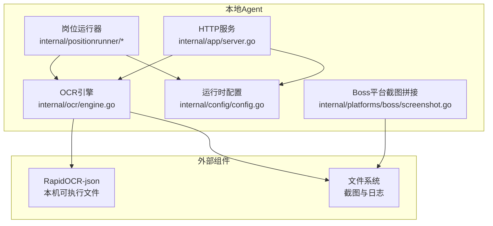
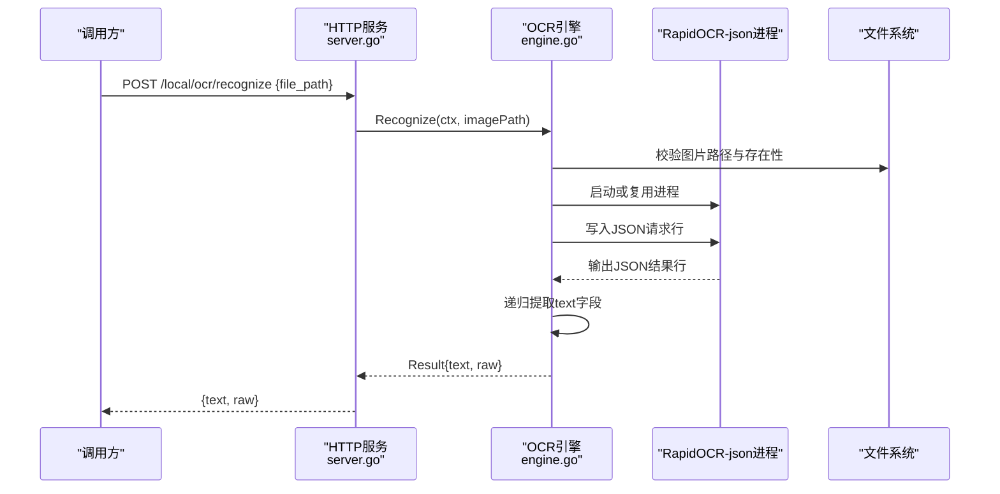
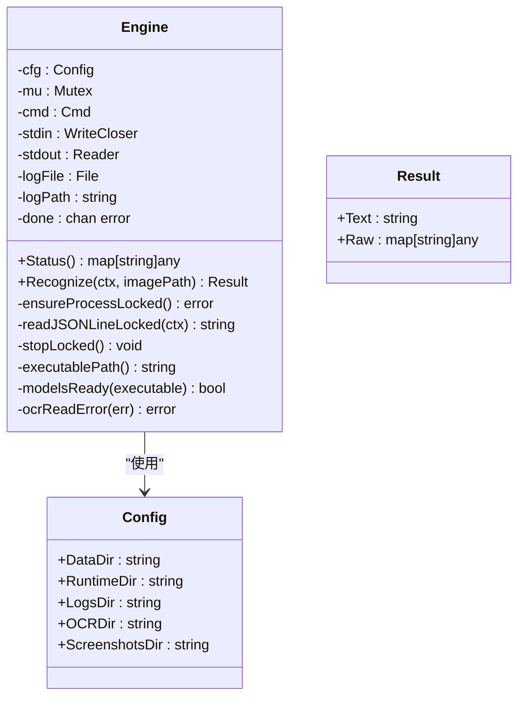
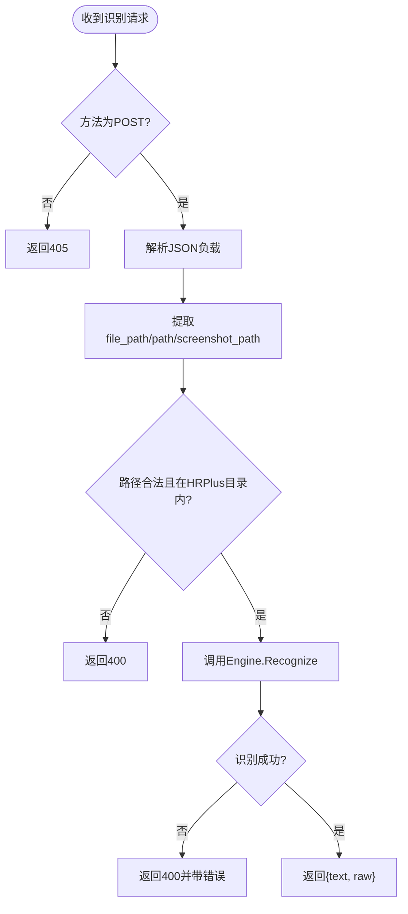
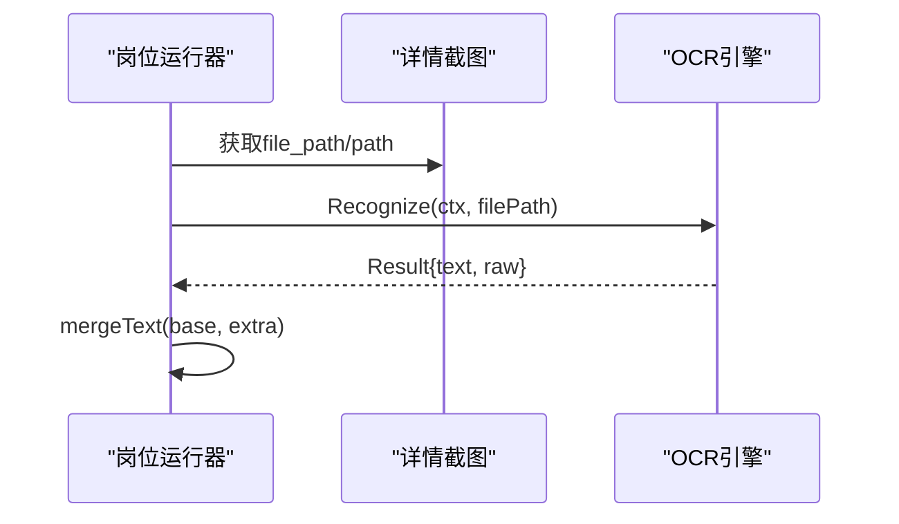
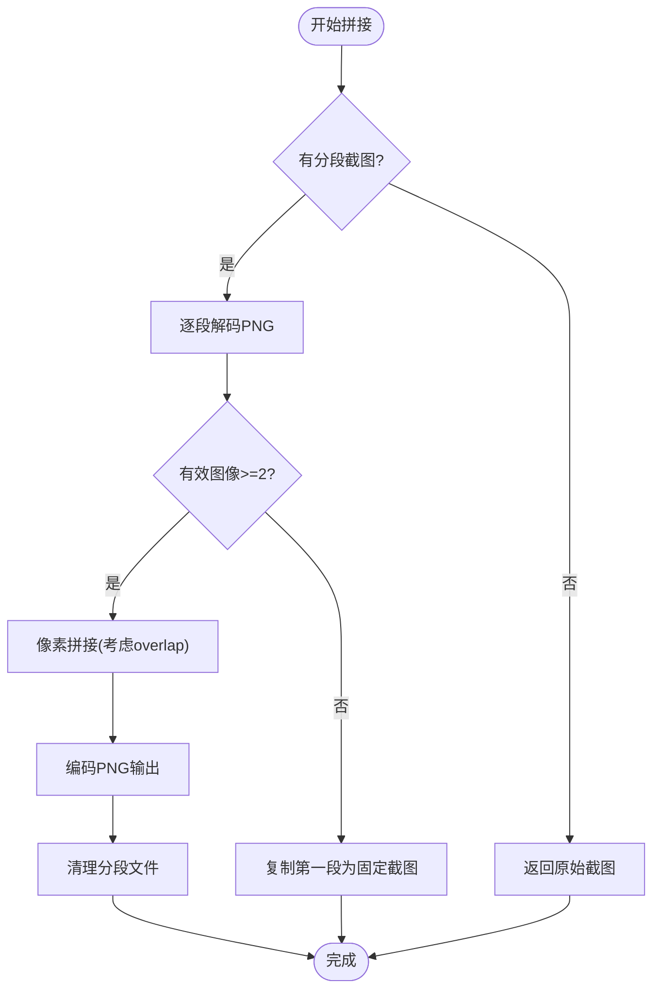
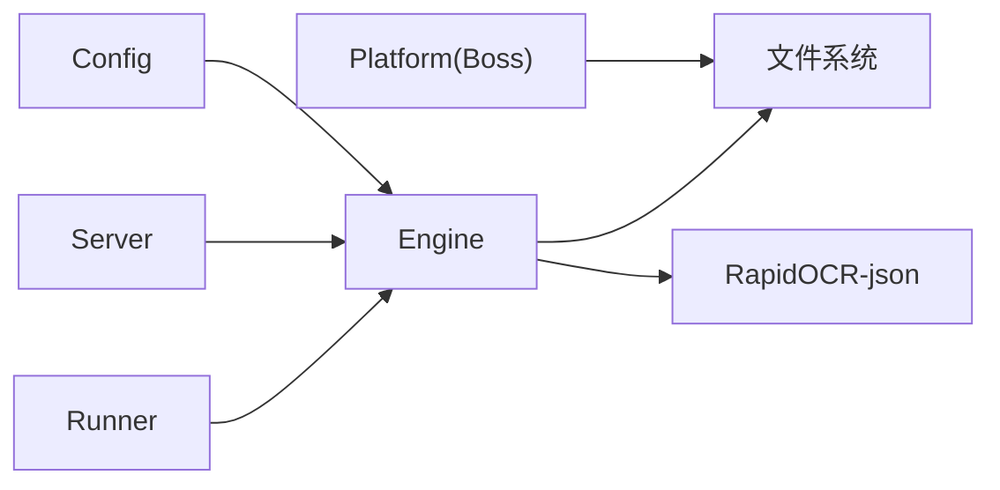

# OCR识别引擎

<cite>
**本文引用的文件**   
- [engine.go](file://goodhr5/local-agent-go/internal/ocr/engine.go)
- [server.go](file://goodhr5/local-agent-go/internal/app/server.go)
- [config.go](file://goodhr5/local-agent-go/internal/config/config.go)
- [detail.go](file://goodhr5/local-agent-go/internal/positionrunner/detail.go)
- [runner.go](file://goodhr5/local-agent-go/internal/positionrunner/runner.go)
- [screenshot.go](file://goodhr5/local-agent-go/internal/platforms/boss/screenshot.go)
</cite>

## 目录
1. [简介](#简介)
2. [项目结构](#项目结构)
3. [核心组件](#核心组件)
4. [架构总览](#架构总览)
5. [详细组件分析](#详细组件分析)
6. [依赖关系分析](#依赖关系分析)
7. [性能与内存管理](#性能与内存管理)
8. [错误处理与重试机制](#错误处理与重试机制)
9. [配置项与环境变量](#配置项与环境变量)
10. [图像格式支持与预处理](#图像格式支持与预处理)
11. [多语言支持说明](#多语言支持说明)
12. [批量处理能力](#批量处理能力)
13. [识别结果处理与质量控制](#识别结果处理与质量控制)
14. [平台兼容性与部署注意事项](#平台兼容性与部署注意事项)
15. [故障排查指南](#故障排查指南)
16. [结论](#结论)

## 简介
本文件面向 HRPlus 本地 Agent 中的 OCR 识别引擎，系统性说明其实现原理、调用方式、配置项、错误处理、性能特征与部署注意事项。OCR 引擎通过启动本机 RapidOCR-json 常驻进程，以 JSON 行协议进行图片文字识别，并将结构化文本结果返回给上层业务模块，用于岗位详情信息抽取等场景。

## 项目结构
OCR 相关代码主要位于 Go 版本本地 Agent 的 `internal/ocr` 包中，并通过 HTTP API 暴露状态查询与识别接口；同时被岗位运行流程在“OCR 模式”下调用，结合截图拼接逻辑完成长图识别。

**图表来源**
- [server.go:590-637](file://goodhr5/local-agent-go/internal/app/server.go#L590-L637)
- [engine.go:21-97](file://goodhr5/local-agent-go/internal/ocr/engine.go#L21-L97)
- [config.go:23-96](file://goodhr5/local-agent-go/internal/config/config.go#L23-L96)
- [screenshot.go:19-168](file://goodhr5/local-agent-go/internal/platforms/boss/screenshot.go#L19-L168)

**章节来源**
- [engine.go:1-326](file://goodhr5/local-agent-go/internal/ocr/engine.go#L1-L326)
- [server.go:590-637](file://goodhr5/local-agent-go/internal/app/server.go#L590-L637)
- [config.go:23-96](file://goodhr5/local-agent-go/internal/config/config.go#L23-L96)
- [screenshot.go:19-168](file://goodhr5/local-agent-go/internal/platforms/boss/screenshot.go#L19-L168)

## 核心组件
- OCR 引擎：负责查找并启动 RapidOCR-json 进程、发送图片路径、读取 JSON 行响应、提取文本、管理进程生命周期与日志。
- HTTP 服务：提供 `/local/ocr/status` 与 `/local/ocr/recognize` 两个接口，封装参数校验与安全限制。
- 岗位运行器：在“OCR 模式”下调用 OCR 引擎识别候选人详情页截图，并与 DOM/AI 模式共同构成详情读取策略。
- 平台截图拼接：Boss 平台将滚动分段截图拼接为长图，便于后续 OCR 识别完整页面内容。
- 配置系统：定义数据目录、运行时目录、OCR 目录、截图目录等路径，确保 OCR 模型与日志落盘位置正确。

**章节来源**
- [engine.go:21-97](file://goodhr5/local-agent-go/internal/ocr/engine.go#L21-L97)
- [server.go:590-637](file://goodhr5/local-agent-go/internal/app/server.go#L590-L637)
- [detail.go:346-361](file://goodhr5/local-agent-go/internal/positionrunner/detail.go#L346-L361)
- [screenshot.go:19-168](file://goodhr5/local-agent-go/internal/platforms/boss/screenshot.go#L19-L168)
- [config.go:23-96](file://goodhr5/local-agent-go/internal/config/config.go#L23-L96)

## 架构总览
OCR 引擎采用“进程外 OCR 组件 + 管道通信”的架构：Go 程序不直接加载 OCR 推理库，而是启动一个独立的 RapidOCR-json 进程，通过标准输入输出交换 JSON 行消息。该设计降低主进程内存压力，隔离崩溃风险，并便于扩展不同 OCR 后端。

**图表来源**
- [server.go:598-618](file://goodhr5/local-agent-go/internal/app/server.go#L598-L618)
- [engine.go:61-97](file://goodhr5/local-agent-go/internal/ocr/engine.go#L61-L97)
- [engine.go:101-145](file://goodhr5/local-agent-go/internal/ocr/engine.go#L101-L145)

## 详细组件分析

### OCR 引擎（Engine）
- 职责
  - 查找 RapidOCR-json 可执行文件，优先环境变量，其次运行目录与 PATH。
  - 检查模型文件是否存在，当前要求包含检测模型 ONNX 文件。
  - 启动并维护一个常驻进程，使用互斥锁保证并发安全。
  - 向进程写入图片路径 JSON 行，阻塞等待一行 JSON 响应。
  - 从响应中递归提取 text/txt/label/data/result 等字段，合并为纯文本。
  - 记录 stderr 到运行时日志目录，便于问题定位。
- 关键数据结构
  - Engine：持有配置、互斥锁、进程句柄、管道、日志文件与退出通道。
  - Result：包含识别文本与原始 JSON。
- 复杂度与行为
  - 每次识别需确保进程已启动；若进程退出则自动重启。
  - 读取响应时按行过滤非 JSON 前缀行，避免噪声干扰。
  - 文本收集采用递归遍历 JSON，时间复杂度与 JSON 节点数线性相关。

**图表来源**
- [engine.go:21-97](file://goodhr5/local-agent-go/internal/ocr/engine.go#L21-L97)
- [config.go:23-96](file://goodhr5/local-agent-go/internal/config/config.go#L23-L96)

**章节来源**
- [engine.go:21-326](file://goodhr5/local-agent-go/internal/ocr/engine.go#L21-L326)

### HTTP 服务集成
- 接口
  - 状态查询：返回 OCR 是否安装、模型是否就绪、工作目录与工作模式。
  - 图片识别：接收 file_path/path/screenshot_path 任一字段，校验绝对路径且必须位于 HRPlus 数据目录或截图目录内，然后调用 OCR 引擎识别。
- 安全限制
  - 仅允许绝对路径。
  - 仅允许 HRPlus 数据目录与截图目录下的图片，防止任意文件读取。
- 错误处理
  - 方法不支持返回 405。
  - 参数缺失或非法返回 400。
  - OCR 识别失败返回 400，并携带错误信息。

**图表来源**
- [server.go:598-637](file://goodhr5/local-agent-go/internal/app/server.go#L598-L637)

**章节来源**
- [server.go:590-637](file://goodhr5/local-agent-go/internal/app/server.go#L590-L637)

### 岗位运行器集成
- 详情读取模式
  - 支持 DOM、OCR、AI 三种模式，由岗位快照的 common_config 或 keyword_config 决定。
  - 当模式为 OCR 时，调用 OCR 引擎识别候选人详情页截图，得到文本后参与后续处理。
- 文本合并
  - 将 OCR 文本与已有文本合并，去重并保留换行结构。

**图表来源**
- [detail.go:346-361](file://goodhr5/local-agent-go/internal/positionrunner/detail.go#L346-L361)
- [detail.go:363-375](file://goodhr5/local-agent-go/internal/positionrunner/detail.go#L363-L375)
- [runner.go:69-69](file://goodhr5/local-agent-go/internal/positionrunner/runner.go#L69-L69)

**章节来源**
- [detail.go:346-415](file://goodhr5/local-agent-go/internal/positionrunner/detail.go#L346-L415)
- [runner.go:69-69](file://goodhr5/local-agent-go/internal/positionrunner/runner.go#L69-L69)

### Boss 平台截图拼接
- 目的
  - 将滚动分段截图拼接成一张长图，提升 OCR 对长页面的识别完整性。
- 流程
  - 读取 Worker 返回的分段截图数组。
  - 解码 PNG 图像，计算重叠区域像素拼接。
  - 写出固定输出文件 detail-latest.png，并清理临时分段。
  - 记录内存与耗时诊断信息，便于性能分析。
- 降级策略
  - 若分段不足或解码失败，回退为复制第一段作为固定截图。

**图表来源**
- [screenshot.go:19-168](file://goodhr5/local-agent-go/internal/platforms/boss/screenshot.go#L19-L168)

**章节来源**
- [screenshot.go:1-200](file://goodhr5/local-agent-go/internal/platforms/boss/screenshot.go#L1-L200)

## 依赖关系分析
- 内部依赖
  - OCR 引擎依赖配置系统确定 OCR 目录、运行时目录与日志目录。
  - HTTP 服务依赖 OCR 引擎提供识别能力。
  - 岗位运行器依赖 OCR 引擎接口，并在 OCR 模式下调用识别。
  - Boss 平台截图拼接依赖文件系统读写 PNG 图像。
- 外部依赖
  - RapidOCR-json 可执行文件及其 models 子目录中的 ONNX 模型。
  - 操作系统提供的进程管理与文件 I/O。

**图表来源**
- [config.go:23-96](file://goodhr5/local-agent-go/internal/config/config.go#L23-L96)
- [engine.go:21-97](file://goodhr5/local-agent-go/internal/ocr/engine.go#L21-L97)
- [server.go:590-637](file://goodhr5/local-agent-go/internal/app/server.go#L590-L637)
- [screenshot.go:19-168](file://goodhr5/local-agent-go/internal/platforms/boss/screenshot.go#L19-L168)

**章节来源**
- [engine.go:21-326](file://goodhr5/local-agent-go/internal/ocr/engine.go#L21-L326)
- [config.go:23-96](file://goodhr5/local-agent-go/internal/config/config.go#L23-L96)
- [server.go:590-637](file://goodhr5/local-agent-go/internal/app/server.go#L590-L637)
- [screenshot.go:19-168](file://goodhr5/local-agent-go/internal/platforms/boss/screenshot.go#L19-L168)

## 性能与内存管理
- 进程常驻
  - 通过启动一次 RapidOCR-json 进程并复用，减少频繁启动开销。
  - 进程退出时自动重启，避免长时间运行的稳定性问题。
- 管道与缓冲
  - 使用 bufio.Reader 读取 JSON 行，避免大量内存分配。
  - 标准输入输出管道串行化请求，配合互斥锁保证线程安全。
- 图像拼接
  - Boss 平台拼接长图时记录内存统计，便于评估峰值内存占用。
  - 解码后立即关闭文件句柄，减少文件描述符泄漏风险。
- 日志与诊断
  - OCR 组件 stderr 输出到运行时日志目录，便于定位崩溃与异常。
  - 拼接流程记录各阶段耗时与内存指标，辅助性能调优。

[本节为通用性能讨论，不直接分析具体文件]

## 错误处理与重试机制
- 输入校验
  - 图片路径为空或非绝对路径直接报错。
  - 图片文件不存在时报错。
  - HTTP 层仅允许 HRPlus 数据目录与截图目录内的图片。
- 进程管理
  - 进程启动失败、管道创建失败、读取失败均返回明确错误。
  - 进程退出时通过 done 通道捕获退出码，并提示查看日志。
- 超时与取消
  - 识别过程支持上下文取消；取消时杀死 OCR 进程并返回错误。
- 重试建议
  - 当前引擎未内置自动重试；可在调用方根据错误类型决定是否重试（如网络或 IO 临时错误）。
  - 对于“OCR 未识别到文字”，可考虑调整截图质量或切换 DOM/AI 模式。

**章节来源**
- [engine.go:61-97](file://goodhr5/local-agent-go/internal/ocr/engine.go#L61-L97)
- [engine.go:101-145](file://goodhr5/local-agent-go/internal/ocr/engine.go#L101-L145)
- [engine.go:148-179](file://goodhr5/local-agent-go/internal/ocr/engine.go#L148-L179)
- [engine.go:181-238](file://goodhr5/local-agent-go/internal/ocr/engine.go#L181-L238)
- [server.go:598-637](file://goodhr5/local-agent-go/internal/app/server.go#L598-L637)

## 配置项与环境变量
- 配置项
  - DataDir：主数据目录。
  - RuntimeDir：运行时目录，OCR 日志存放于 runtime/logs。
  - LogsDir：通用日志目录。
  - OCRDir：OCR 组件目录，RapidOCR-json 与 models 应放置于此。
  - ScreenshotsDir：截图目录，OCR 仅允许识别此目录及 DataDir 下的图片。
- 环境变量
  - GOODHR_DATA_DIR：覆盖默认数据目录。
  - GOODHR_OCR_EXECUTABLE：指定 RapidOCR-json 可执行文件路径。
  - GOODHR_OCR_ARGS：传递给 RapidOCR-json 的额外参数。
  - GOODHR_AUTO_OPEN_CONSOLE：是否自动打开控制台。
- 目录初始化
  - EnsureDirs 会创建 DataDir、RuntimeDir、LogsDir、OCRDir、FrontendDir、ProfilesDir、DownloadsDir、ScreenshotsDir。

**章节来源**
- [config.go:23-96](file://goodhr5/local-agent-go/internal/config/config.go#L23-L96)
- [config.go:98-118](file://goodhr5/local-agent-go/internal/config/config.go#L98-L118)
- [engine.go:240-296](file://goodhr5/local-agent-go/internal/ocr/engine.go#L240-L296)

## 图像格式支持与预处理
- 输入格式
  - OCR 引擎本身只校验图片路径存在性，并不在 Go 层解码或转换图片。
  - 实际支持的图像格式取决于 RapidOCR-json 的能力。
- 预处理
  - Boss 平台会将滚动分段截图拼接为 PNG 长图，统一输出格式，便于 OCR 识别。
  - 拼接过程记录宽高、大小与耗时，有助于判断预处理质量。
- 建议
  - 确保截图清晰、分辨率适中，避免过度压缩导致文字模糊。
  - 长页面建议使用拼接后的长图，提高 OCR 召回率。

**章节来源**
- [engine.go:61-71](file://goodhr5/local-agent-go/internal/ocr/engine.go#L61-L71)
- [screenshot.go:19-168](file://goodhr5/local-agent-go/internal/platforms/boss/screenshot.go#L19-L168)

## 多语言支持说明
- 当前实现未显式设置语言参数；语言支持由 RapidOCR-json 的可执行文件与模型决定。
- 可通过 GOODHR_OCR_ARGS 传入额外参数，以适配不同语言模型或推理选项。
- 如需增强多语言支持，建议在外部组件层面提供语言选择参数，并在调用方根据业务需要动态注入。

**章节来源**
- [engine.go:288-296](file://goodhr5/local-agent-go/internal/ocr/engine.go#L288-L296)

## 批量处理能力
- 并发控制
  - Engine 使用互斥锁串行化识别请求，避免多个请求同时写入同一进程管道。
- 批处理建议
  - 可在调用方实现队列与并发度控制，分批提交图片路径，避免瞬时压力过大。
  - 结合上下文取消与超时，避免长时间阻塞。
- 资源回收
  - 进程退出后自动重启，避免资源泄漏。
  - 日志文件在进程停止时关闭，避免句柄泄漏。

**章节来源**
- [engine.go:21-31](file://goodhr5/local-agent-go/internal/ocr/engine.go#L21-L31)
- [engine.go:72-76](file://goodhr5/local-agent-go/internal/ocr/engine.go#L72-L76)
- [engine.go:181-200](file://goodhr5/local-agent-go/internal/ocr/engine.go#L181-L200)

## 识别结果处理与质量控制
- 结果结构
  - Text：合并后的纯文本。
  - Raw：原始 JSON，便于调试与二次解析。
- 文本提取
  - 递归遍历 JSON，提取 text/txt/label/data/result 字段，忽略其他字段。
  - 去除空白行与多余空格，合并为换行分隔的文本。
- 质量控制
  - 若未识别到文字，返回错误并附带原始 JSON，便于分析。
  - 可在调用方增加置信度阈值（若上游提供），过滤低质量结果。
  - 结合 DOM/AI 模式，形成多策略融合，提高整体准确率。

**章节来源**
- [engine.go:33-37](file://goodhr5/local-agent-go/internal/ocr/engine.go#L33-L37)
- [engine.go:92-96](file://goodhr5/local-agent-go/internal/ocr/engine.go#L92-L96)
- [engine.go:298-325](file://goodhr5/local-agent-go/internal/ocr/engine.go#L298-L325)

## 平台兼容性与部署注意事项
- 平台差异
  - Windows 下可执行文件名包含 .exe，其他平台不带后缀。
  - 可执行文件查找顺序：环境变量 > OCRDir > PATH。
- 模型文件
  - 要求 models 目录下存在 ch_PP-OCRv3_det_infer.onnx。
  - 若模型缺失，Status 会返回 models_ok=false，并提示重新安装 OCR 组件。
- 部署建议
  - 将 RapidOCR-json 与 models 目录放入配置的 OCRDir。
  - 设置 GOODHR_OCR_EXECUTABLE 指向可执行文件，便于跨环境部署。
  - 确保运行时目录可写，以便生成 logs/ocr.log。
  - 在容器环境中，注意挂载数据目录与 OCR 目录，避免镜像重建丢失模型。

**章节来源**
- [engine.go:240-286](file://goodhr5/local-agent-go/internal/ocr/engine.go#L240-L286)
- [engine.go:264-278](file://goodhr5/local-agent-go/internal/ocr/engine.go#L264-L278)
- [config.go:74-96](file://goodhr5/local-agent-go/internal/config/config.go#L74-L96)

## 故障排查指南
- 常见问题
  - “OCR 组件未安装”：检查 GOODHR_OCR_EXECUTABLE 或 OCRDir 是否正确。
  - “OCR 模型文件不完整”：确认 models 目录下存在所需 ONNX 模型。
  - “OCR 组件已退出”：查看 logs/ocr.log，定位崩溃原因。
  - “OCR 未识别到文字”：检查截图清晰度与页面内容，必要时切换 DOM/AI 模式。
- 诊断步骤
  - 调用 /local/ocr/status 检查 installed、path、dir、mode、models_ok。
  - 检查运行时目录 logs/ocr.log 是否有崩溃堆栈或异常输出。
  - 验证图片路径是否在 HRPlus 数据目录或截图目录内。
  - 调整 GOODHR_OCR_ARGS 传入额外参数，观察是否改善识别效果。

**章节来源**
- [engine.go:45-57](file://goodhr5/local-agent-go/internal/ocr/engine.go#L45-L57)
- [engine.go:202-216](file://goodhr5/local-agent-go/internal/ocr/engine.go#L202-L216)
- [engine.go:218-238](file://goodhr5/local-agent-go/internal/ocr/engine.go#L218-L238)
- [server.go:590-637](file://goodhr5/local-agent-go/internal/app/server.go#L590-L637)

## 结论
HRPlus 本地 Agent 的 OCR 识别引擎通过进程外 RapidOCR-json 组件实现稳定、可扩展的文字识别能力。其设计强调安全性（路径白名单）、可观测性（日志与诊断）、可维护性（进程隔离与自动重启）。在实际使用中，建议结合 Boss 平台的长图拼接、岗位运行器的多模式策略，以及合理的配置与环境变量，以获得更高的识别准确率与系统稳定性。