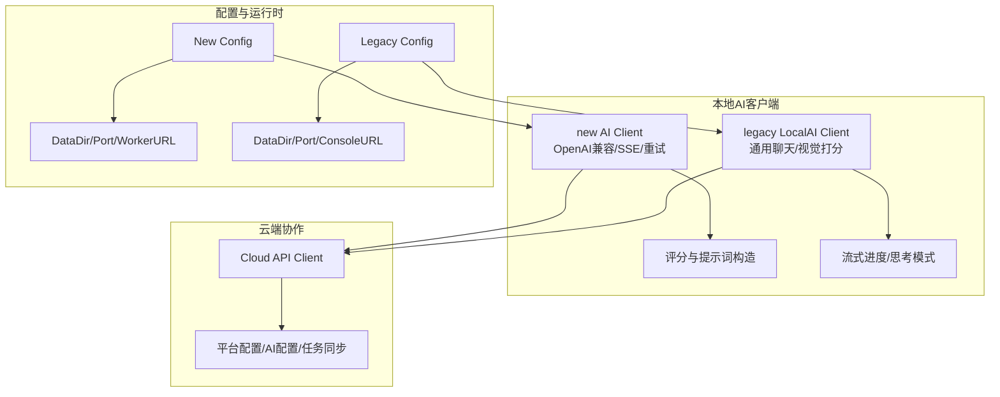
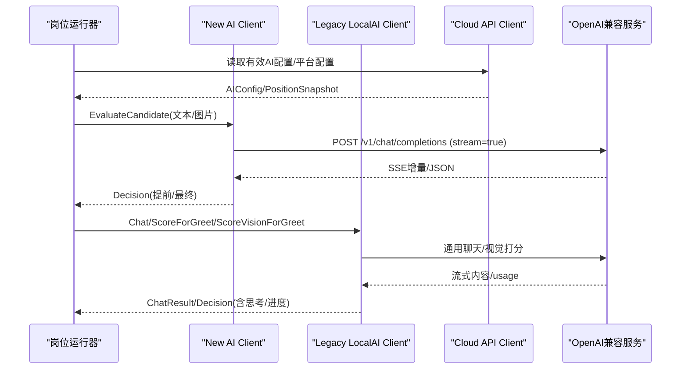
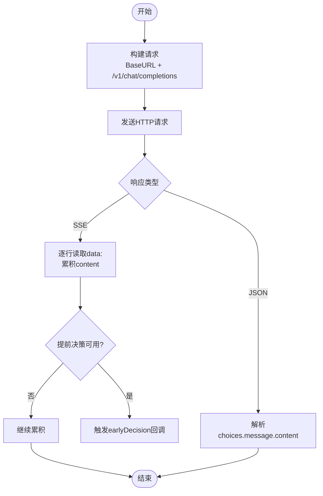
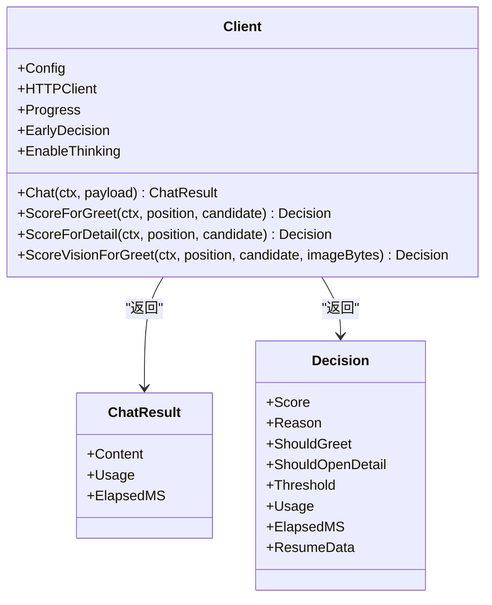
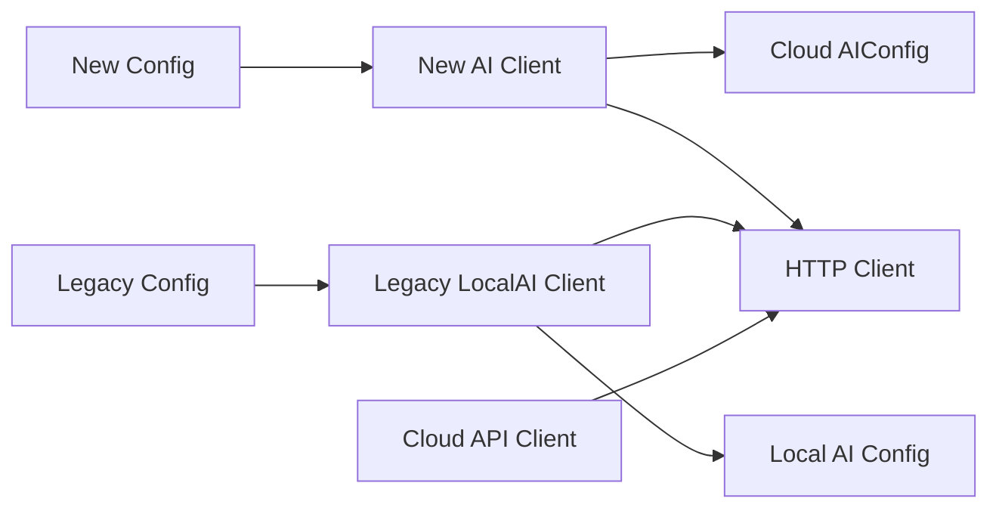

# 本地AI客户端

<cite>
**本文引用的文件**
- [client.go](file://goodhr5/local-agent-go-new/internal/integration/ai/client.go)
- [client_test.go](file://goodhr5/local-agent-go-new/internal/integration/ai/client_test.go)
- [client.go](file://goodhr5/local-agent-go/internal/localai/client.go)
- [client.go](file://goodhr5/local-agent-go/internal/cloudapi/client.go)
- [config.go](file://goodhr5/local-agent-go/internal/config/config.go)
- [config.go](file://goodhr5/local-agent-go-new/internal/config/config.go)
- [cloud-control-local-agent-architecture.md](file://docs/cloud-control-local-agent-architecture.md)
</cite>

## 目录
1. [简介](#简介)
2. [项目结构](#项目结构)
3. [核心组件](#核心组件)
4. [架构总览](#架构总览)
5. [详细组件分析](#详细组件分析)
6. [依赖关系分析](#依赖关系分析)
7. [性能与可靠性](#性能与可靠性)
8. [故障排查指南](#故障排查指南)
9. [结论](#结论)
10. [附录：API调用示例与最佳实践](#附录api调用示例与最佳实践)

## 简介
本文件面向“本地AI客户端”的实现，聚焦以下目标：
- OpenAI兼容接口的实现原理：HTTP请求构建、SSE流式响应处理、错误重试机制。
- 评分算法：打招呼评分与详情评分的阈值判断与提示词策略。
- 流式输出与提前决策提取、思考模式支持。
- 配置管理、超时控制、缓存策略。
- API调用示例、错误处理方案、性能优化建议。
- 与云端AI服务的协作机制与故障转移策略。

## 项目结构
本地AI能力由两套Go实现共同支撑：
- 新本地程序（local-agent-go-new）：提供OpenAI兼容客户端、流式解析、提前决策、结构化简历输出等能力。
- 旧本地程序（local-agent-go）：提供本地AI客户端封装、通用聊天接口、视觉打分、流式进度回调、思考模式显示等能力。
- 云端通信：通过cloudapi访问云端配置、任务状态、订阅校验等。
- 配置管理：新旧版本各自维护启动参数、数据目录、端口、云端地址等。

图表来源
- [client.go:22-25](file://goodhr5/local-agent-go-new/internal/integration/ai/client.go#L22-L25)
- [client.go:34-40](file://goodhr5/local-agent-go/internal/localai/client.go#L34-L40)
- [client.go:17-21](file://goodhr5/local-agent-go/internal/cloudapi/client.go#L17-L21)
- [config.go:31-50](file://goodhr5/local-agent-go-new/internal/config/config.go#L31-L50)
- [config.go:27-41](file://goodhr5/local-agent-go/internal/config/config.go#L27-L41)

章节来源
- [client.go:22-25](file://goodhr5/local-agent-go-new/internal/integration/ai/client.go#L22-L25)
- [client.go:34-40](file://goodhr5/local-agent-go/internal/localai/client.go#L34-L40)
- [client.go:17-21](file://goodhr5/local-agent-go/internal/cloudapi/client.go#L17-L21)
- [config.go:31-50](file://goodhr5/local-agent-go-new/internal/config/config.go#L31-L50)
- [config.go:27-41](file://goodhr5/local-agent-go/internal/config/config.go#L27-L41)

## 核心组件
- OpenAI兼容客户端（新版本）
  - 负责构建chat/completions请求、SSE流式读取、提前决策提取、结构化简历输出、临时错误重试。
- 本地AI客户端（旧版本）
  - 封装通用聊天、视觉打分、流式进度回调、思考模式显示、提前评分提取。
- 云端API客户端
  - 获取平台配置、用户AI配置、岗位运行信息、订阅状态、统计同步、失败通知等。
- 配置模块
  - 管理监听地址、端口、数据目录、云端地址、控制台地址、Worker入口等。

章节来源
- [client.go:22-25](file://goodhr5/local-agent-go-new/internal/integration/ai/client.go#L22-L25)
- [client.go:34-40](file://goodhr5/local-agent-go/internal/localai/client.go#L34-L40)
- [client.go:17-21](file://goodhr5/local-agent-go/internal/cloudapi/client.go#L17-L21)
- [config.go:31-50](file://goodhr5/local-agent-go-new/internal/config/config.go#L31-L50)
- [config.go:27-41](file://goodhr5/local-agent-go/internal/config/config.go#L27-L41)

## 架构总览
本地AI客户端通过OpenAI兼容接口与云端或本地大模型服务交互；同时从云端拉取AI配置、平台配置、岗位信息等元数据，结合本地候选人数据执行评分与回复生成。

图表来源
- [client.go:236-268](file://goodhr5/local-agent-go-new/internal/integration/ai/client.go#L236-L268)
- [client.go:271-303](file://goodhr5/local-agent-go-new/internal/integration/ai/client.go#L271-L303)
- [client.go:318-352](file://goodhr5/local-agent-go-new/internal/integration/ai/client.go#L318-L352)
- [client.go:258-326](file://goodhr5/local-agent-go/internal/localai/client.go#L258-L326)
- [client.go:328-376](file://goodhr5/local-agent-go/internal/localai/client.go#L328-L376)
- [client.go:192-212](file://goodhr5/local-agent-go/internal/cloudapi/client.go#L192-L212)

## 详细组件分析

### OpenAI兼容客户端（新版本）
- HTTP请求构建
  - 统一拼接BaseURL至/v1/chat/completions，设置Authorization与Accept头，默认开启流式。
  - 支持显式关闭思考模式时发送enable_thinking=false，开启时不传该字段以兼容旧版。
- 流式响应处理
  - 按行扫描data:分片，累积delta.content，并在完整JSON片段出现时尝试提前提取评分。
  - 兼容非标准Content-Type的SSE响应体回退解析。
- 错误重试机制
  - 对网络错误、5xx、429等可重试错误最多重试3次，遵循Retry-After退避。
  - 致命错误（鉴权失败、配额不足、模型不存在等）直接停止岗位任务。
- 评分算法
  - 打招呼评分：优先使用岗位自定义提示词，未填写则回退到全局系统提示词，再回退到默认提示词。
  - 详情评分：基于候选人基础信息判断是否值得打开详情，阈值来自岗位或全局配置。
  - 结构化简历：当岗位允许输出结构化简历时，可在流式过程中先返回提前决策，最终通道再返回结构化数据。
- 思考模式支持
  - 根据岗位开关决定是否发送enable_thinking，从而控制服务端是否返回思考内容。

图表来源
- [client.go:236-268](file://goodhr5/local-agent-go-new/internal/integration/ai/client.go#L236-L268)
- [client.go:271-303](file://goodhr5/local-agent-go-new/internal/integration/ai/client.go#L271-L303)
- [client.go:318-352](file://goodhr5/local-agent-go-new/internal/integration/ai/client.go#L318-L352)

章节来源
- [client.go:236-268](file://goodhr5/local-agent-go-new/internal/integration/ai/client.go#L236-L268)
- [client.go:271-303](file://goodhr5/local-agent-go-new/internal/integration/ai/client.go#L271-L303)
- [client.go:318-352](file://goodhr5/local-agent-go-new/internal/integration/ai/client.go#L318-L352)
- [client.go:404-495](file://goodhr5/local-agent-go-new/internal/integration/ai/client.go#L404-L495)
- [client_test.go:19-47](file://goodhr5/local-agent-go-new/internal/integration/ai/client_test.go#L19-L47)
- [client_test.go:150-195](file://goodhr5/local-agent-go-new/internal/integration/ai/client_test.go#L150-L195)
- [client_test.go:197-233](file://goodhr5/local-agent-go-new/internal/integration/ai/client_test.go#L197-L233)

### 本地AI客户端（旧版本）
- 通用聊天接口
  - 默认开启流式输出，支持temperature、extra透传、enable_thinking控制。
  - 自动合并Extra配置，保证向后兼容。
- 流式进度与思考模式
  - 实时推送progress回调，区分正文与reasoning_content，便于前端展示思考过程。
  - 支持从流式分片中提取usage统计。
- 视觉打分
  - 将候选人的详情截图以base64图片形式传入，一次性完成识别与打分，并可选输出结构化简历字段。
- 提前评分提取
  - 在累计流式文本中查找闭合JSON对象，提取score与reason，用于提前决策。
- 错误重试
  - 对临时错误进行指数退避重试，尊重Retry-After。

图表来源
- [client.go:34-62](file://goodhr5/local-agent-go/internal/localai/client.go#L34-L62)
- [client.go:258-326](file://goodhr5/local-agent-go/internal/localai/client.go#L258-L326)
- [client.go:164-256](file://goodhr5/local-agent-go/internal/localai/client.go#L164-L256)

章节来源
- [client.go:258-326](file://goodhr5/local-agent-go/internal/localai/client.go#L258-L326)
- [client.go:328-376](file://goodhr5/local-agent-go/internal/localai/client.go#L328-L376)
- [client.go:470-539](file://goodhr5/local-agent-go/internal/localai/client.go#L470-L539)
- [client.go:541-627](file://goodhr5/local-agent-go/internal/localai/client.go#L541-L627)
- [client.go:689-712](file://goodhr5/local-agent-go/internal/localai/client.go#L689-L712)

### 云端API客户端
- 功能范围
  - 获取本地控制台地址、平台配置、订阅状态、登录态校验、岗位运行详情、有效AI配置、用户偏好、候选人保存、统计同步、停止任务、失败通知等。
- 认证与错误
  - 使用Bearer Token，统一解析云端返回消息，翻译常见英文错误为中文。
- 超时控制
  - HTTP客户端默认15秒超时，适合轻量级配置与状态查询。

章节来源
- [client.go:17-21](file://goodhr5/local-agent-go/internal/cloudapi/client.go#L17-L21)
- [client.go:46-55](file://goodhr5/local-agent-go/internal/cloudapi/client.go#L46-L55)
- [client.go:192-212](file://goodhr5/local-agent-go/internal/cloudapi/client.go#L192-L212)
- [client.go:342-383](file://goodhr5/local-agent-go/internal/cloudapi/client.go#L342-L383)
- [client.go:401-423](file://goodhr5/local-agent-go/internal/cloudapi/client.go#L401-L423)
- [client.go:458-496](file://goodhr5/local-agent-go/internal/cloudapi/client.go#L458-L496)

### 配置管理
- 新本地程序配置
  - 管理Host/Port、WorkerHost/Port、CloudURL、ConsoleURL、数据目录、数据库路径、Node路径、OCR可执行文件、自动打开控制台等。
  - 支持环境变量覆盖，确保开发/生产环境一致。
- 旧本地程序配置
  - 管理Host/Port、数据目录、运行时目录、日志目录、OCR目录、前端目录、配置文件目录、下载目录、截图目录、控制台清单URL、云端API基址、自动打开控制台等。
  - 自动创建必要目录，提供默认下载目录。

章节来源
- [config.go:31-50](file://goodhr5/local-agent-go-new/internal/config/config.go#L31-L50)
- [config.go:52-90](file://goodhr5/local-agent-go-new/internal/config/config.go#L52-L90)
- [config.go:137-157](file://goodhr5/local-agent-go-new/internal/config/config.go#L137-L157)
- [config.go:27-41](file://goodhr5/local-agent-go/internal/config/config.go#L27-L41)
- [config.go:43-88](file://goodhr5/local-agent-go/internal/config/config.go#L43-L88)
- [config.go:99-111](file://goodhr5/local-agent-go/internal/config/config.go#L99-L111)

## 依赖关系分析
- 新AI客户端依赖云端配置（AIConfig、PositionSnapshot），并通过HTTP与OpenAI兼容服务交互。
- 旧LocalAI客户端依赖本地AI配置（BaseURL/APIKey/Model/Temperature），并可选择性启用流式进度与提前决策。
- 云端API客户端依赖云端BaseURL与Token，用于获取配置与同步状态。
- 配置模块为两者提供运行时参数与环境变量覆盖。

图表来源
- [client.go:22-25](file://goodhr5/local-agent-go-new/internal/integration/ai/client.go#L22-L25)
- [client.go:34-40](file://goodhr5/local-agent-go/internal/localai/client.go#L34-L40)
- [client.go:17-21](file://goodhr5/local-agent-go/internal/cloudapi/client.go#L17-L21)
- [config.go:31-50](file://goodhr5/local-agent-go-new/internal/config/config.go#L31-L50)
- [config.go:27-41](file://goodhr5/local-agent-go/internal/config/config.go#L27-L41)

章节来源
- [client.go:22-25](file://goodhr5/local-agent-go-new/internal/integration/ai/client.go#L22-L25)
- [client.go:34-40](file://goodhr5/local-agent-go/internal/localai/client.go#L34-L40)
- [client.go:17-21](file://goodhr5/local-agent-go/internal/cloudapi/client.go#L17-L21)
- [config.go:31-50](file://goodhr5/local-agent-go-new/internal/config/config.go#L31-L50)
- [config.go:27-41](file://goodhr5/local-agent-go/internal/config/config.go#L27-L41)

## 性能与可靠性
- 超时控制
  - 新AI客户端HTTP默认180秒超时，适合长流式响应。
  - 旧LocalAI客户端使用配置的Timeout，默认180秒。
  - 云端API客户端默认15秒超时，适合轻量查询。
- 重试机制
  - 临时错误（网络异常、5xx、429）最多重试3次，遵循Retry-After退避。
  - 致命错误（鉴权失败、配额不足、模型不存在）立即停止岗位任务。
- 流式处理
  - 按行扫描SSE，避免整包内存占用；限制读取大小防止过大响应。
  - 提前决策在首个完整JSON出现时触发，降低端到端延迟。
- 思考模式
  - 通过enable_thinking控制是否返回reasoning_content，减少不必要传输。
- 缓存策略
  - 代码未实现应用层缓存；建议在岗位运行器层对相同输入（岗位要求+候选人摘要）做短期缓存以减少重复请求。
- 并发与资源
  - 每个请求独立http.Client实例，避免共享状态；注意连接复用与池化以提升吞吐。

章节来源
- [client.go:90-92](file://goodhr5/local-agent-go-new/internal/integration/ai/client.go#L90-L92)
- [client.go:102-115](file://goodhr5/local-agent-go/internal/localai/client.go#L102-L115)
- [client.go:46-55](file://goodhr5/local-agent-go/internal/cloudapi/client.go#L46-L55)
- [client.go:236-268](file://goodhr5/local-agent-go-new/internal/integration/ai/client.go#L236-L268)
- [client.go:311-326](file://goodhr5/local-agent-go/internal/localai/client.go#L311-L326)
- [client.go:318-352](file://goodhr5/local-agent-go-new/internal/integration/ai/client.go#L318-L352)
- [client.go:470-539](file://goodhr5/local-agent-go/internal/localai/client.go#L470-L539)

## 故障排查指南
- 常见问题定位
  - 鉴权失败：检查BaseURL、APIKey、Model是否配置正确；致命错误会停止岗位任务。
  - 配额不足/余额不足：400/422且包含quota/balance关键词，属于致命错误。
  - 模型不存在：400/422且包含model/not found，属于致命错误。
  - 流式中断：读取SSE时发生错误，标记为致命错误。
  - 云端会话过期：云端返回Unauthorized/Forbidden，需重新登录。
- 调试建议
  - 启用旧LocalAI的Progress回调，观察流式内容与思考内容。
  - 检查Retry-After头部，确认重试间隔是否符合预期。
  - 验证请求体是否包含enable_thinking字段，确保与服务端行为一致。
- 恢复策略
  - 临时错误：等待退避后重试。
  - 致命错误：记录错误原因，停止岗位任务，提示用户修复配置。

章节来源
- [client.go:354-374](file://goodhr5/local-agent-go-new/internal/integration/ai/client.go#L354-L374)
- [client.go:376-402](file://goodhr5/local-agent-go-new/internal/integration/ai/client.go#L376-L402)
- [client.go:378-420](file://goodhr5/local-agent-go/internal/localai/client.go#L378-L420)
- [client.go:150-164](file://goodhr5/local-agent-go/internal/cloudapi/client.go#L150-L164)
- [client.go:498-541](file://goodhr5/local-agent-go/internal/cloudapi/client.go#L498-L541)

## 结论
本地AI客户端通过OpenAI兼容接口实现了高可用的文本与视觉评分能力，具备流式响应、提前决策、思考模式、错误重试与配置管理等关键特性。新旧两套实现互补：新版本强调结构化输出与提前决策，旧版本强调通用聊天与可视化进度。与云端协作清晰，职责边界明确，便于扩展与维护。

## 附录：API调用示例与最佳实践
- 打招呼评分
  - 输入：岗位快照（含岗位要求）、候选人基础信息。
  - 输出：Decision（score、reason、should_greet）。
  - 建议：设置合理的greet_score_threshold，优先使用岗位自定义提示词。
- 详情评分
  - 输入：岗位快照、候选人基础信息。
  - 输出：Decision（score、reason、should_open_detail）。
  - 建议：设置detail_score_threshold，避免过多无效详情打开。
- 视觉打分
  - 输入：岗位快照、候选人基础信息、详情截图（base64）。
  - 输出：Decision（score、reason、detail_text、resume_data）。
  - 建议：仅在有OCR/截图能力时使用，提升准确率。
- 通用聊天
  - 输入：messages、temperature、stream、enable_thinking。
  - 输出：ChatResult（content、usage、elapsed_ms）。
  - 建议：默认开启流式，按需关闭enable_thinking以减少传输。
- 云端协作
  - 获取有效AI配置：/api/config/effective-ai?reveal_api_key=1。
  - 同步岗位状态：/api/positions/{id}/status。
  - 保存候选人：/api/positions/{id}/candidates。
  - 失败通知：/api/fail-notice。
- 最佳实践
  - 合理设置超时与重试，避免长时间阻塞。
  - 使用提前决策快速反馈，提升用户体验。
  - 结构化简历输出时，分离提前决策与最终结果通道。
  - 对相同输入做短期缓存，减少重复请求。
  - 监控usage与耗时，优化提示词与模型选择。

章节来源
- [client.go:108-148](file://goodhr5/local-agent-go-new/internal/integration/ai/client.go#L108-L148)
- [client.go:150-193](file://goodhr5/local-agent-go-new/internal/integration/ai/client.go#L150-L193)
- [client.go:195-217](file://goodhr5/local-agent-go-new/internal/integration/ai/client.go#L195-L217)
- [client.go:164-256](file://goodhr5/local-agent-go/internal/localai/client.go#L164-L256)
- [client.go:258-326](file://goodhr5/local-agent-go/internal/localai/client.go#L258-L326)
- [client.go:192-212](file://goodhr5/local-agent-go/internal/cloudapi/client.go#L192-L212)
- [client.go:309-340](file://goodhr5/local-agent-go/internal/cloudapi/client.go#L309-L340)
- [client.go:236-251](file://goodhr5/local-agent-go/internal/cloudapi/client.go#L236-L251)
- [client.go:498-541](file://goodhr5/local-agent-go/internal/cloudapi/client.go#L498-L541)