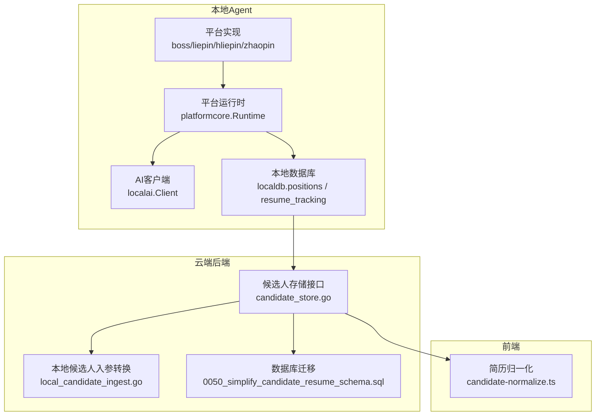
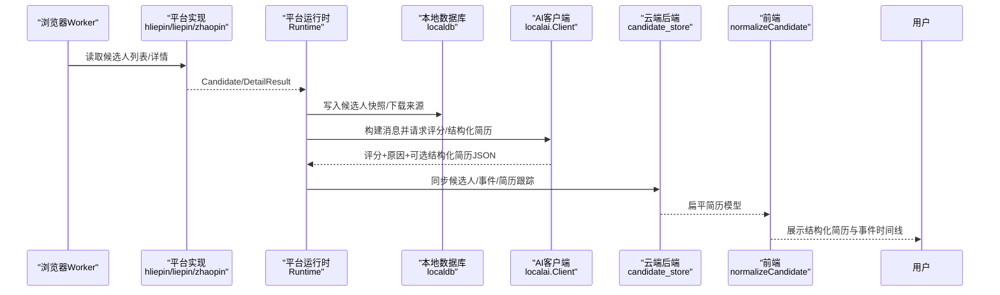
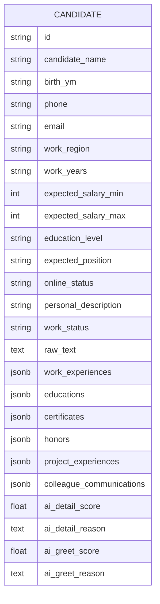
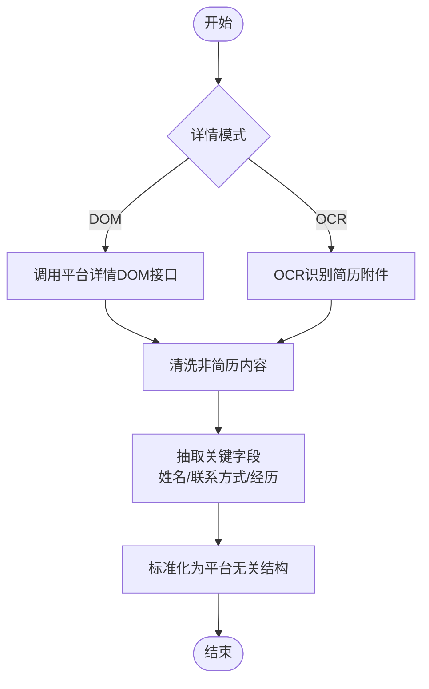
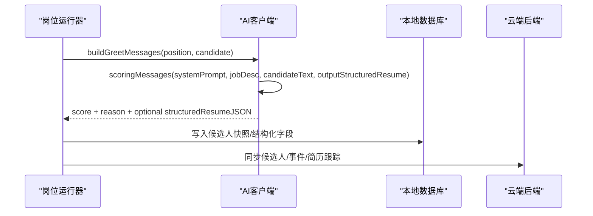
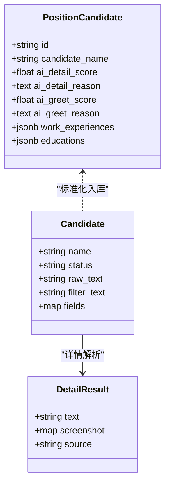
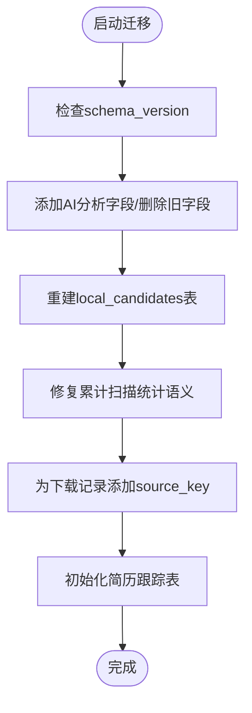
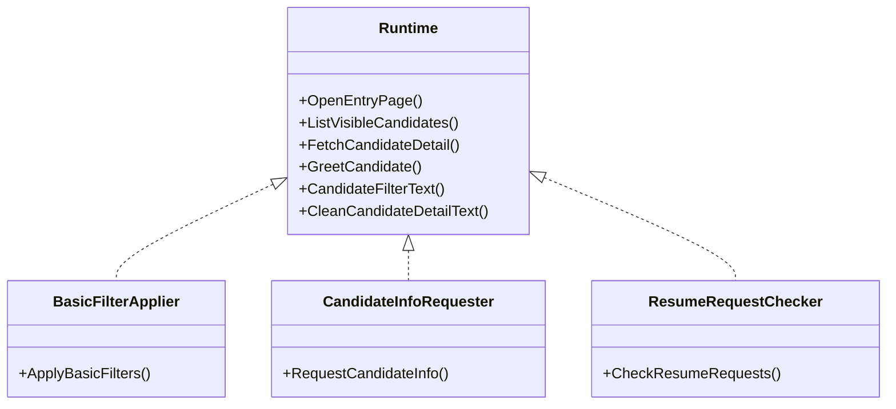
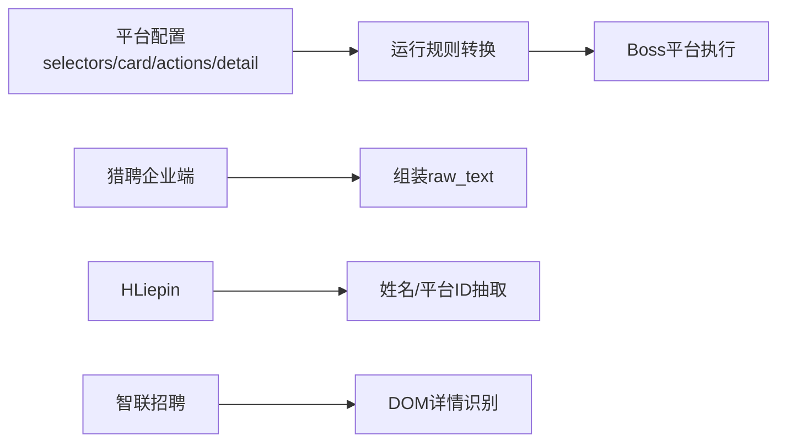
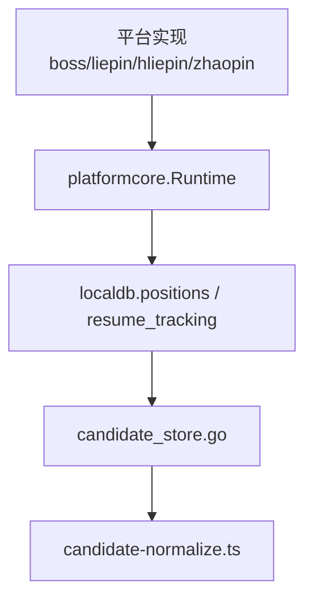

# 简历解析处理

<cite>
**本文引用的文件**   
- [简历模型.json](file://goodhr5/简历模型.json)
- [candidate-normalize.ts](file://goodhr5/cloud/frontend-next/lib/candidate-normalize.ts)
- [candidate-store.go](file://goodhr5/cloud/backend/internal/httpapi/candidate_store.go)
- [local_candidate_ingest.go](file://goodhr5/cloud/backend/internal/httpapi/local_candidate_ingest.go)
- [0050_simplify_candidate_resume_schema.sql](file://goodhr5/cloud/backend/db/migrations/0050_simplify_candidate_resume_schema.sql)
- [client.go](file://goodhr5/local-agent-go/internal/localai/client.go)
- [positions.go](file://goodhr5/local-agent-go/internal/localdb/positions.go)
- [resume_tracking.go](file://goodhr5/local-agent-go/internal/localdb/resume_tracking.go)
- [runtime.go](file://goodhr5/local-agent-go/internal/platformcore/runtime.go)
- [hliepin_candidate.go](file://goodhr5/local-agent-go/internal/platforms/hliepin/candidate.go)
- [liepin_runtime.go](file://goodhr5/local-agent-go/internal/platforms/liepin/runtime.go)
- [zhaopin_detail.go](file://goodhr5/local-agent-go/internal/platforms/zhaopin/detail.go)
</cite>

## 目录
1. [引言](#引言)
2. [项目结构](#项目结构)
3. [核心组件](#核心组件)
4. [架构总览](#架构总览)
5. [详细组件分析](#详细组件分析)
6. [依赖关系分析](#依赖关系分析)
7. [性能与可扩展性](#性能与可扩展性)
8. [故障排查指南](#故障排查指南)
9. [结论](#结论)
10. [附录：字段映射与平台适配](#附录字段映射与平台适配)

## 引言
本文件面向 GoodHR 的“简历解析处理”子系统，系统性说明以下主题：
- 简历数据结构定义、字段映射规则与数据验证机制
- 结构化简历生成与非结构化文本解析流程
- 信息抽取算法与 AI 集成工作流（候选人生成、匹配评分计算）
- 简历存储格式、版本兼容性与数据迁移策略
- 简历处理配置、自定义字段支持与扩展机制
- 多招聘平台简历格式的适配方案与标准化处理流程

该文档既适合后端与前端开发者，也适合产品与运营人员理解系统如何从不同平台抓取候选人信息、解析简历、打分并入库。

## 项目结构
GoodHR 在简历解析方面采用“本地 Agent + 云端后端 + 前端展示”的分层架构：
- 本地 Agent 负责浏览器自动化、平台适配、OCR/DOM 详情提取、AI 调用与本地持久化
- 云端后端提供候选人主体、触达上下文、事件流水与简历跟踪的统一接口
- 前端将后端返回的新版扁平简历模型归一化为 UI 展示结构

图表来源
- [runtime.go:54-82](file://goodhr5/local-agent-go/internal/platformcore/runtime.go#L54-L82)
- [hliepin_candidate.go:48-62](file://goodhr5/local-agent-go/internal/platforms/hliepin/candidate.go#L48-L62)
- [client.go:689-721](file://goodhr5/local-agent-go/internal/localai/client.go#L689-L721)
- [positions.go:750-778](file://goodhr5/local-agent-go/internal/localdb/positions.go#L750-L778)
- [candidate_store.go:12-65](file://goodhr5/cloud/backend/internal/httpapi/candidate_store.go#L12-L65)
- [local_candidate_ingest.go:69-84](file://goodhr5/cloud/backend/internal/httpapi/local_candidate_ingest.go#L69-L84)
- [0050_simplify_candidate_resume_schema.sql:1-13](file://goodhr5/cloud/backend/db/migrations/0050_simplify_candidate_resume_schema.sql#L1-L13)
- [candidate-normalize.ts:76-142](file://goodhr5/cloud/frontend-next/lib/candidate-normalize.ts#L76-L142)

章节来源
- [runtime.go:54-82](file://goodhr5/local-agent-go/internal/platformcore/runtime.go#L54-L82)
- [candidate_store.go:12-65](file://goodhr5/cloud/backend/internal/httpapi/candidate_store.go#L12-L65)
- [candidate-normalize.ts:76-142](file://goodhr5/cloud/frontend-next/lib/candidate-normalize.ts#L76-L142)

## 核心组件
本节聚焦简历解析的关键对象与职责边界：
- 平台运行时 Runtime：统一抽象各平台的候选人列表、详情、打招呼、索要简历等能力
- 平台实现：Boss、猎聘、智联、HLiepin 等平台的具体适配
- AI 客户端：构建提示词、调用大模型、解析结构化输出与评分
- 本地数据库：候选人快照、岗位运行记录、下载来源、简历跟踪状态
- 云端候选人存储：候选人主体、触达上下文、事件流水、内存与 PG 实现
- 前端简历归一化：把后端扁平模型转换为 UI 友好结构

章节来源
- [runtime.go:20-82](file://goodhr5/local-agent-go/internal/platformcore/runtime.go#L20-L82)
- [client.go:689-721](file://goodhr5/local-agent-go/internal/localai/client.go#L689-L721)
- [positions.go:750-778](file://goodhr5/local-agent-go/internal/localdb/positions.go#L750-L778)
- [candidate_store.go:12-167](file://goodhr5/cloud/backend/internal/httpapi/candidate_store.go#L12-L167)
- [candidate-normalize.ts:36-142](file://goodhr5/cloud/frontend-next/lib/candidate-normalize.ts#L36-L142)

## 架构总览
下图展示一次“候选人详情解析 + AI 评分 + 结构化简历生成 + 入库”的典型流程：

图表来源
- [hliepin_candidate.go:48-62](file://goodhr5/local-agent-go/internal/platforms/hliepin/candidate.go#L48-L62)
- [zhaopin_detail.go:13-30](file://goodhr5/local-agent-go/internal/platforms/zhaopin/detail.go#L13-L30)
- [runtime.go:54-82](file://goodhr5/local-agent-go/internal/platformcore/runtime.go#L54-L82)
- [positions.go:750-778](file://goodhr5/local-agent-go/internal/localdb/positions.go#L750-L778)
- [client.go:689-721](file://goodhr5/local-agent-go/internal/localai/client.go#L689-L721)
- [candidate_store.go:156-167](file://goodhr5/cloud/backend/internal/httpapi/candidate_store.go#L156-L167)
- [candidate-normalize.ts:76-142](file://goodhr5/cloud/frontend-next/lib/candidate-normalize.ts#L76-L142)

## 详细组件分析

### 简历数据结构定义与字段映射
系统采用“新版扁平简历模型”，基础字段扁平化，经历类字段以 JSONB 存储，AI 两次分析与原文单独保存。

- 基础字段包括姓名、出生年月、电话、邮箱、工作地区、工作年限、期望薪资区间、学历、期望岗位、在线状态、个人描述、工作状态、原始文本等
- 经历数组包括工作经历、教育经历、证书、荣誉、项目经历、同事沟通记录
- AI 分析包含“详情评分”和“打招呼评分”，分别对应两轮判断
- 前端将后端字段映射为展示结构，如年龄推导、薪资文本拼接、经历摘要行、事件标签中文显示

图表来源
- [简历模型.json:1-84](file://goodhr5/简历模型.json#L1-L84)
- [0050_simplify_candidate_resume_schema.sql:1-13](file://goodhr5/cloud/backend/db/migrations/0050_simplify_candidate_resume_schema.sql#L1-L13)
- [candidate-normalize.ts:76-142](file://goodhr5/cloud/frontend-next/lib/candidate-normalize.ts#L76-L142)

章节来源
- [简历模型.json:1-84](file://goodhr5/简历模型.json#L1-L84)
- [0050_simplify_candidate_resume_schema.sql:1-13](file://goodhr5/cloud/backend/db/migrations/0050_simplify_candidate_resume_schema.sql#L1-L13)
- [candidate-normalize.ts:76-142](file://goodhr5/cloud/frontend-next/lib/candidate-normalize.ts#L76-L142)

### 非结构化文本解析与信息抽取
平台侧通过 DOM 或 OCR 获取候选人详情，再清洗为稳定文本：
- 猎聘企业端：按 fields 组装 raw_text，过滤活跃状态等瞬态标记
- HLiepin：从卡片文本中提取姓名、平台候选人 ID、raw_text/filter_text
- 智联招聘：仅支持 DOM 详情识别，构造 payload 后调用 Worker 接口

图表来源
- [liepin_runtime.go:19-28](file://goodhr5/local-agent-go/internal/platforms/liepin/runtime.go#L19-L28)
- [hliepin_candidate.go:48-62](file://goodhr5/local-agent-go/internal/platforms/hliepin/candidate.go#L48-L62)
- [zhaopin_detail.go:13-30](file://goodhr5/local-agent-go/internal/platforms/zhaopin/detail.go#L13-L30)

章节来源
- [liepin_runtime.go:19-28](file://goodhr5/local-agent-go/internal/platforms/liepin/runtime.go#L19-L28)
- [hliepin_candidate.go:48-62](file://goodhr5/local-agent-go/internal/platforms/hliepin/candidate.go#L48-L62)
- [zhaopin_detail.go:13-30](file://goodhr5/local-agent-go/internal/platforms/zhaopin/detail.go#L13-L30)

### 结构化简历生成与AI集成工作流
AI 客户端根据岗位快照与候选人信息构建消息，支持两种输出：
- 仅分析结果：analysis.score 与 analysis.reason
- 结构化简历：允许 AI 输出可入库的简历字段，由开关控制

图表来源
- [client.go:689-721](file://goodhr5/local-agent-go/internal/localai/client.go#L689-L721)
- [positions.go:750-778](file://goodhr5/local-agent-go/internal/localdb/positions.go#L750-L778)
- [candidate_store.go:156-167](file://goodhr5/cloud/backend/internal/httpapi/candidate_store.go#L156-L167)

章节来源
- [client.go:689-721](file://goodhr5/local-agent-go/internal/localai/client.go#L689-L721)
- [positions.go:750-778](file://goodhr5/local-agent-go/internal/localdb/positions.go#L750-L778)

### 候选人生成与匹配评分计算
- 候选人生成：平台实现从列表页抽取候选人基本信息，组装 Candidate 对象
- 匹配评分：AI 基于岗位描述与候选人原始文本进行打分，支持两轮评分（详情与打招呼）
- 评分与原因同时落库，便于审计与回溯

图表来源
- [runtime.go:20-36](file://goodhr5/local-agent-go/internal/platformcore/runtime.go#L20-L36)
- [candidate_store.go:12-65](file://goodhr5/cloud/backend/internal/httpapi/candidate_store.go#L12-L65)

章节来源
- [runtime.go:20-36](file://goodhr5/local-agent-go/internal/platformcore/runtime.go#L20-L36)
- [candidate_store.go:12-65](file://goodhr5/cloud/backend/internal/httpapi/candidate_store.go#L12-L65)

### 简历存储格式、版本兼容与数据迁移
- 云端表结构简化：新增 AI 两次分析字段，删除旧字段，收敛为标准简历模型
- 本地数据库迁移：修复累计扫描统计语义、重建候选人表以支持结构化字段、增加下载来源摘要
- 简历跟踪：使用 revision 与 synced 字段保证幂等与顺序，避免低阶段进度覆盖高阶段事实

图表来源
- [0050_simplify_candidate_resume_schema.sql:1-13](file://goodhr5/cloud/backend/db/migrations/0050_simplify_candidate_resume_schema.sql#L1-L13)
- [resume_tracking.go:37-60](file://goodhr5/local-agent-go/internal/localdb/resume_tracking.go#L37-L60)
- [resume_tracking.go:58-102](file://goodhr5/local-agent-go/internal/localdb/resume_tracking.go#L58-L102)

章节来源
- [0050_simplify_candidate_resume_schema.sql:1-13](file://goodhr5/cloud/backend/db/migrations/0050_simplify_candidate_resume_schema.sql#L1-L13)
- [resume_tracking.go:37-60](file://goodhr5/local-agent-go/internal/localdb/resume_tracking.go#L37-L60)
- [resume_tracking.go:58-102](file://goodhr5/local-agent-go/internal/localdb/resume_tracking.go#L58-L102)

### 简历处理配置、自定义字段与扩展机制
- 岗位运行时支持“关键词筛选”与“AI筛选”两种模式
- 平台配置通过 selectors/card/actions/detail 等键值驱动浏览器行为
- 平台运行时接口可扩展：BasicFilterApplier、CandidateInfoRequester、ResumeRequestChecker、PositionSearchPreparer、DirectPositionSelector、PositionSelectionSkipper、DetailAnalysisScroller

图表来源
- [runtime.go:54-127](file://goodhr5/local-agent-go/internal/platformcore/runtime.go#L54-L127)

章节来源
- [runtime.go:54-127](file://goodhr5/local-agent-go/internal/platformcore/runtime.go#L54-L127)

### 多平台适配方案与标准化流程
- Boss：通过 worker-node 将云端平台配置转换为运行规则，驱动选择器与动作
- 猎聘企业端：fields 组装 raw_text，age 多源回退
- HLiepin：从卡片文本提取姓名与平台ID，过滤瞬态标记
- 智联招聘：仅支持 DOM 详情识别，构造 payload 调用 Worker

图表来源
- [index.js:4708-4732](file://goodhr5/local-agent-go/worker-node/src/index.js#L4708-L4732)
- [liepin_runtime.go:19-28](file://goodhr5/local-agent-go/internal/platforms/liepin/runtime.go#L19-L28)
- [hliepin_candidate.go:48-62](file://goodhr5/local-agent-go/internal/platforms/hliepin/candidate.go#L48-L62)
- [zhaopin_detail.go:13-30](file://goodhr5/local-agent-go/internal/platforms/zhaopin/detail.go#L13-L30)

章节来源
- [index.js:4708-4732](file://goodhr5/local-agent-go/worker-node/src/index.js#L4708-L4732)
- [liepin_runtime.go:19-28](file://goodhr5/local-agent-go/internal/platforms/liepin/runtime.go#L19-L28)
- [hliepin_candidate.go:48-62](file://goodhr5/local-agent-go/internal/platforms/hliepin/candidate.go#L48-L62)
- [zhaopin_detail.go:13-30](file://goodhr5/local-agent-go/internal/platforms/zhaopin/detail.go#L13-L30)

## 依赖关系分析
- 平台实现依赖 platformcore.Runtime 提供的统一接口
- 本地数据库依赖 positions.go 与 resume_tracking.go 进行候选人快照与进度持久化
- 云端后端通过 candidate_store.go 暴露候选人主体、触达上下文与事件流水
- 前端通过 candidate-normalize.ts 将后端扁平模型转为 UI 展示结构

图表来源
- [runtime.go:54-82](file://goodhr5/local-agent-go/internal/platformcore/runtime.go#L54-L82)
- [positions.go:750-778](file://goodhr5/local-agent-go/internal/localdb/positions.go#L750-L778)
- [resume_tracking.go:37-60](file://goodhr5/local-agent-go/internal/localdb/resume_tracking.go#L37-L60)
- [candidate_store.go:156-167](file://goodhr5/cloud/backend/internal/httpapi/candidate_store.go#L156-L167)
- [candidate-normalize.ts:76-142](file://goodhr5/cloud/frontend-next/lib/candidate-normalize.ts#L76-L142)

章节来源
- [runtime.go:54-82](file://goodhr5/local-agent-go/internal/platformcore/runtime.go#L54-L82)
- [positions.go:750-778](file://goodhr5/local-agent-go/internal/localdb/positions.go#L750-L778)
- [resume_tracking.go:37-60](file://goodhr5/local-agent-go/internal/localdb/resume_tracking.go#L37-L60)
- [candidate_store.go:156-167](file://goodhr5/cloud/backend/internal/httpapi/candidate_store.go#L156-L167)
- [candidate-normalize.ts:76-142](file://goodhr5/cloud/frontend-next/lib/candidate-normalize.ts#L76-L142)

## 性能与可扩展性
- 平台侧优先使用 DOM 详情以减少 OCR 成本；仅在必要时启用 OCR
- 本地数据库对简历跟踪使用 revision 与 synced 字段，减少重复同步与冲突
- 前端对经历摘要与薪资文本进行轻量计算，避免后端复杂格式化
- 平台运行时接口可扩展，便于新增平台或增强能力而不改动主流程

[本节为通用指导，不直接分析具体文件]

## 故障排查指南
- 简历进度异常：检查 resume_state、resume_error、resume_updated_at 是否一致；确认低阶段进度不会覆盖高阶段事实
- 平台详情为空：核对 selector 与 card_item 配置；查看平台日志中 URL 与 max_items
- AI 评分缺失：检查岗位是否开启 AI 模式；确认 stablePrompt 与 outputStructuredResume 开关
- 数据迁移失败：检查 schema_version 与迁移标记；确认 local_candidates 重建与 scanned_count 修复

章节来源
- [candidate-normalize.ts:76-142](file://goodhr5/cloud/frontend-next/lib/candidate-normalize.ts#L76-L142)
- [hliepin_candidate.go:48-62](file://goodhr5/local-agent-go/internal/platforms/hliepin/candidate.go#L48-L62)
- [client.go:689-721](file://goodhr5/local-agent-go/internal/localai/client.go#L689-L721)
- [resume_tracking.go:58-102](file://goodhr5/local-agent-go/internal/localdb/resume_tracking.go#L58-L102)

## 结论
GoodHR 的简历解析处理系统通过平台运行时统一抽象、AI 驱动的评分与结构化简历生成、以及稳健的本地与云端存储设计，实现了跨平台简历数据的标准化与可追溯。系统在版本演进中保持了良好的兼容性，并通过可扩展接口支持未来平台与能力的接入。

[本节为总结性内容，不直接分析具体文件]

## 附录：字段映射与平台适配
- 前端 normalizeCandidate 将后端字段映射为展示结构，包括年龄推导、薪资文本、经历摘要、事件标签
- 本地候选人入参转换 local_candidate_ingest.go 将平台无关输入映射到 PositionCandidate 字段
- 平台实现负责 raw_text/filter_text 的组装与清洗，确保后续 AI 与结构化解析稳定

章节来源
- [candidate-normalize.ts:76-142](file://goodhr5/cloud/frontend-next/lib/candidate-normalize.ts#L76-L142)
- [local_candidate_ingest.go:69-84](file://goodhr5/cloud/backend/internal/httpapi/local_candidate_ingest.go#L69-L84)
- [hliepin_candidate.go:48-62](file://goodhr5/local-agent-go/internal/platforms/hliepin/candidate.go#L48-L62)