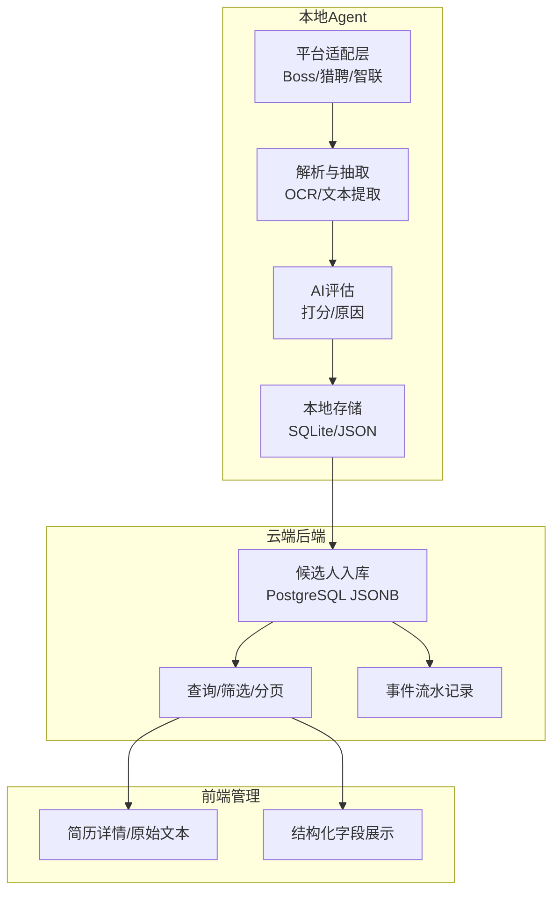
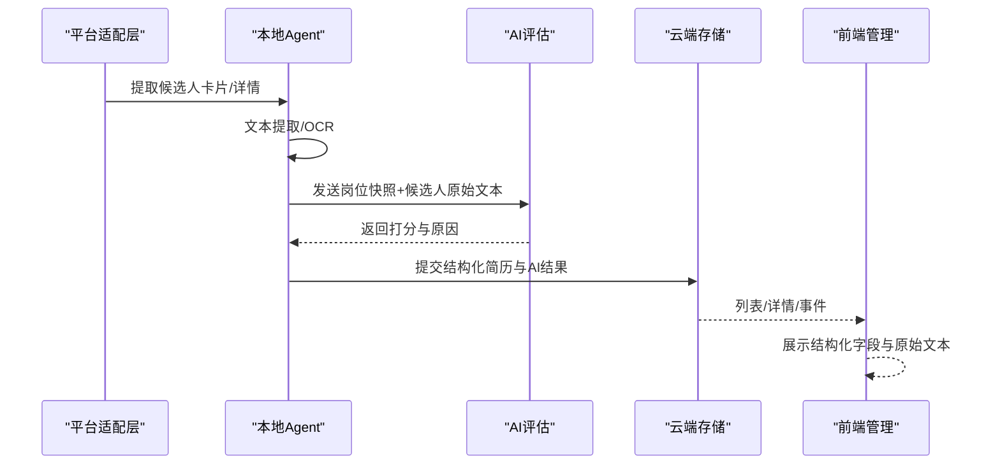
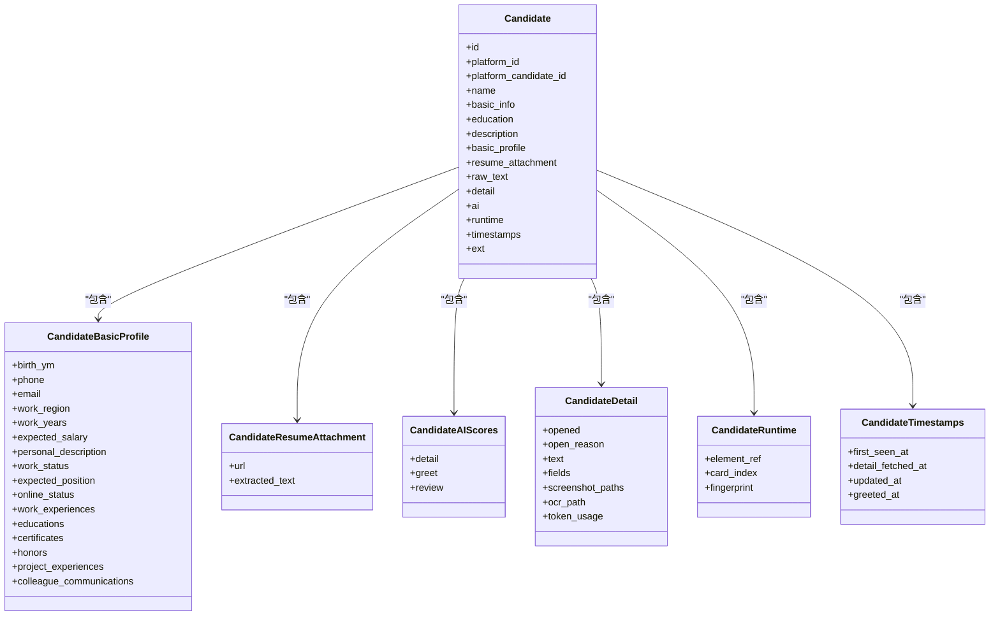
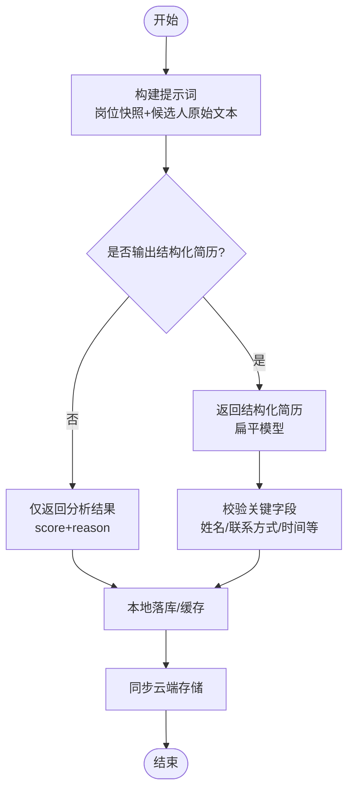
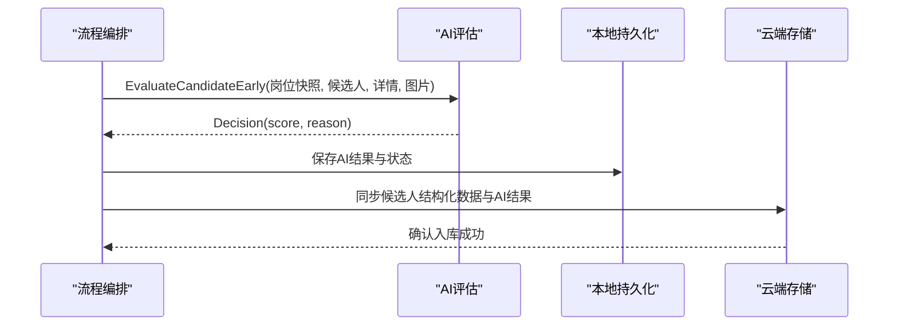
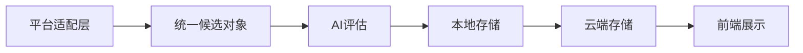

# 简历解析处理

<cite>
**本文引用的文件**
- [简历模型.json](file://goodhr5/简历模型.json)
- [candidate.go](file://goodhr5/cloud/backend/internal/httpapi/candidate.go)
- [candidate_store_pg.go](file://goodhr5/cloud/backend/internal/httpapi/candidate_store_pg.go)
- [0016_task_candidates.sql](file://goodhr5/cloud/backend/db/migrations/0016_task_candidates.sql)
- [local_candidate_ingest.go](file://goodhr5/cloud/backend/internal/httpapi/local_candidate_ingest.go)
- [candidate-normalize.ts](file://goodhr5/cloud/frontend-next/lib/candidate-normalize.ts)
- [client.go](file://goodhr5/local-agent-go/internal/localai/client.go)
- [persistence.go](file://goodhr5/local-agent-go/internal/positionrunner/persistence.go)
- [positions.go](file://goodhr5/local-agent-go/internal/localdb/positions.go)
- [db.go](file://goodhr5/local-agent-go/internal/localdb/db.go)
- [flow.go](file://goodhr5/local-agent-go/internal/flow/greeting/flow.go)
- [candidate.go（Boss）](file://goodhr5/local-agent-go/internal/platforms/boss/candidate.go)
- [candidate.go（猎聘）](file://goodhr5/local-agent-go/internal/platforms/liepin/candidate.go)
- [candidate.go（智联）](file://goodhr5/local-agent-go/internal/platforms/zhaopin/candidate.go)
</cite>

## 目录
1. [简介](#简介)
2. [项目结构](#项目结构)
3. [核心组件](#核心组件)
4. [架构总览](#架构总览)
5. [详细组件分析](#详细组件分析)
6. [依赖关系分析](#依赖关系分析)
7. [性能考虑](#性能考虑)
8. [故障排查指南](#故障排查指南)
9. [结论](#结论)
10. [附录](#附录)

## 简介
本文件面向招聘平台中的“简历解析与处理”子系统，系统性说明：
- 简历数据结构定义、字段映射规则与数据验证机制
- 结构化简历生成与非结构化文本解析流程
- 信息抽取算法与AI集成工作流
- 候选人生成、匹配评分计算与阈值决策
- 简历存储格式、版本兼容性与数据迁移策略
- 简历处理配置、自定义字段支持与扩展机制
- 多招聘平台简历格式的适配方案与标准化处理流程

## 项目结构
系统由本地Agent（负责抓取、解析、AI评估）、云端后端（候选人主体、触达上下文、事件流水存储与查询）、前端管理界面（展示与操作）三部分组成。简历数据在本地Agent侧完成非结构化到结构化转换，并通过统一接口同步至云端；云端以JSONB字段持久化结构化简历，并提供筛选、检索与管理能力。

图表来源
- [candidate.go（Boss）:13-49](file://goodhr5/local-agent-go/internal/platforms/boss/candidate.go#L13-L49)
- [candidate.go（猎聘）:13-44](file://goodhr5/local-agent-go/internal/platforms/liepin/candidate.go#L13-L44)
- [candidate.go（智联）:13-50](file://goodhr5/local-agent-go/internal/platforms/zhaopin/candidate.go#L13-L50)
- [client.go:689-729](file://goodhr5/local-agent-go/internal/localai/client.go#L689-L729)
- [candidate_store_pg.go:24-161](file://goodhr5/cloud/backend/internal/httpapi/candidate_store_pg.go#L24-L161)

章节来源
- [candidate.go（Boss）:13-49](file://goodhr5/local-agent-go/internal/platforms/boss/candidate.go#L13-L49)
- [candidate.go（猎聘）:13-44](file://goodhr5/local-agent-go/internal/platforms/liepin/candidate.go#L13-L44)
- [candidate.go（智联）:13-50](file://goodhr5/local-agent-go/internal/platforms/zhaopin/candidate.go#L13-L50)
- [candidate_store_pg.go:24-161](file://goodhr5/cloud/backend/internal/httpapi/candidate_store_pg.go#L24-L161)

## 核心组件
- 简历数据模型：统一的扁平化简历结构，包含基础信息、教育、工作经历、证书、荣誉、项目经验、沟通记录、原始文本与AI评分等。
- 平台适配层：各招聘平台（Boss、猎聘、智联）将页面元素提取为统一候选对象，并生成去重指纹。
- AI评估：基于岗位快照与候选人原始文本，输出打招呼/详情阶段评分与原因，支持视觉识别与结构化简历输出开关。
- 云端存储：使用PostgreSQL的JSONB字段保存结构化简历数组与AI结果，提供增删改查与事件流水。
- 前端展示：将云端返回的结构化简历渲染为可读视图，并保留原始文本与完整接口数据查看入口。

章节来源
- [简历模型.json:1-84](file://goodhr5/简历模型.json#L1-L84)
- [candidate.go:12-143](file://goodhr5/cloud/backend/internal/httpapi/candidate.go#L12-L143)
- [client.go:689-829](file://goodhr5/local-agent-go/internal/localai/client.go#L689-L829)
- [candidate_store_pg.go:24-161](file://goodhr5/cloud/backend/internal/httpapi/candidate_store_pg.go#L24-L161)
- [candidate-normalize.ts:55-82](file://goodhr5/cloud/frontend-next/lib/candidate-normalize.ts#L55-L82)

## 架构总览
简历从平台页面抓取后，经本地Agent进行文本提取与AI评估，形成结构化简历并落库；云端通过统一存储层持久化，并提供查询与事件追踪；前端管理端展示结构化字段与原始文本，支持人工复核与备注。

图表来源
- [candidate.go（Boss）:13-49](file://goodhr5/local-agent-go/internal/platforms/boss/candidate.go#L13-L49)
- [client.go:689-729](file://goodhr5/local-agent-go/internal/localai/client.go#L689-L729)
- [candidate_store_pg.go:24-161](file://goodhr5/cloud/backend/internal/httpapi/candidate_store_pg.go#L24-L161)
- [candidate-normalize.ts:55-82](file://goodhr5/cloud/frontend-next/lib/candidate-normalize.ts#L55-L82)

## 详细组件分析

### 简历数据结构定义与字段映射
- 扁平化简历模型包含：姓名、出生年月、电话、邮箱、工作地区、工作年限、期望薪资区间、学历、期望岗位、在线状态、个人描述、工作状态、工作经历、教育经历、证书、荣誉、项目经验、同事沟通记录、原始文本、AI评分与原因。
- 云端Go结构体定义了候选人基本资料、附件、AI评分、详情、运行态与时间戳等，便于统一序列化与传输。
- 前端normalize函数将云端返回的扁平模型转换为UI所需结构，包括年龄推导、薪资文本拼接、工作/教育经历映射等。

图表来源
- [candidate.go:61-143](file://goodhr5/cloud/backend/internal/httpapi/candidate.go#L61-L143)

章节来源
- [简历模型.json:1-84](file://goodhr5/简历模型.json#L1-L84)
- [candidate.go:61-143](file://goodhr5/cloud/backend/internal/httpapi/candidate.go#L61-L143)
- [candidate-normalize.ts:55-82](file://goodhr5/cloud/frontend-next/lib/candidate-normalize.ts#L55-L82)

### 数据验证机制
- 云端入库时，JSONB字段用于存储数组型结构化数据（工作经历、教育经历、证书、荣誉、项目经验、沟通记录），并在扫描时反序列化为目标结构，空值或空数组安全处理。
- 唯一性键由平台ID与平台候选人ID组成；若缺失平台ID，则回退到姓名、电话、邮箱、地区、年限、基础信息的稳定组合，避免重复入库。
- 前端normalize对字符串字段做空值保护，确保展示稳定性。

章节来源
- [candidate_store_pg.go:24-161](file://goodhr5/cloud/backend/internal/httpapi/candidate_store_pg.go#L24-L161)
- [candidate_store_pg.go:675-683](file://goodhr5/cloud/backend/internal/httpapi/candidate_store_pg.go#L675-L683)
- [candidate-normalize.ts:55-82](file://goodhr5/cloud/frontend-next/lib/candidate-normalize.ts#L55-L82)

### 结构化简历生成与非结构化文本解析
- 本地AI客户端根据岗位快照与候选人原始文本构建提示词，支持两种输出模式：仅分析结果或附带结构化简历示例；当岗位配置开启“输出结构化简历”时，AI会返回完整的扁平化简历结构。
- 视觉识别提示词可被用户自定义覆盖，保证在不同平台页面差异下的稳定抽取。
- 平台适配层将页面元素提取为统一候选对象，并生成filter_text/raw_text供后续AI评估使用。

图表来源
- [client.go:724-829](file://goodhr5/local-agent-go/internal/localai/client.go#L724-L829)
- [candidate.go（Boss）:70-86](file://goodhr5/local-agent-go/internal/platforms/boss/candidate.go#L70-L86)
- [candidate.go（猎聘）:57-71](file://goodhr5/local-agent-go/internal/platforms/liepin/candidate.go#L57-L71)
- [candidate.go（智联）:71-85](file://goodhr5/local-agent-go/internal/platforms/zhaopin/candidate.go#L71-L85)

章节来源
- [client.go:689-829](file://goodhr5/local-agent-go/internal/localai/client.go#L689-L829)
- [candidate.go（Boss）:13-49](file://goodhr5/local-agent-go/internal/platforms/boss/candidate.go#L13-L49)
- [candidate.go（猎聘）:13-44](file://goodhr5/local-agent-go/internal/platforms/liepin/candidate.go#L13-L44)
- [candidate.go（智联）:13-50](file://goodhr5/local-agent-go/internal/platforms/zhaopin/candidate.go#L13-L50)

### 信息抽取算法
- 平台适配层通过页面选择器提取候选人卡片与详情，构造fields与raw_text；不同平台实现各自的滚动与可见性控制逻辑。
- 去重指纹基于姓名与年龄生成，结合平台前缀，确保跨页/跨会话的去重一致性。
- 对于Boss与智联，复用统一的候选人提取接口；猎聘通过通用页面元素查找接口获取卡片字段。

章节来源
- [candidate.go（Boss）:13-49](file://goodhr5/local-agent-go/internal/platforms/boss/candidate.go#L13-L49)
- [candidate.go（猎聘）:13-44](file://goodhr5/local-agent-go/internal/platforms/liepin/candidate.go#L13-L44)
- [candidate.go（智联）:13-50](file://goodhr5/local-agent-go/internal/platforms/zhaopin/candidate.go#L13-L50)

### AI集成工作流程与候选人生成
- 本地Agent在流程中调用AI评估，支持早期评估（vision或文本），并根据超时与错误上报失败状态。
- 评估完成后，将两次真实AI分析结果组装为嵌套结构（ai.detail与ai.greet），便于云端展示与审计。
- 云端接收本地同步的数据，写入候选人主体与事件流水，更新触达上下文时间戳。

图表来源
- [flow.go:471-509](file://goodhr5/local-agent-go/internal/flow/greeting/flow.go#L471-L509)
- [persistence.go:106-119](file://goodhr5/local-agent-go/internal/positionrunner/persistence.go#L106-L119)
- [candidate_store_pg.go:24-161](file://goodhr5/cloud/backend/internal/httpapi/candidate_store_pg.go#L24-L161)

章节来源
- [flow.go:471-509](file://goodhr5/local-agent-go/internal/flow/greeting/flow.go#L471-L509)
- [persistence.go:106-119](file://goodhr5/local-agent-go/internal/positionrunner/persistence.go#L106-L119)
- [candidate_store_pg.go:24-161](file://goodhr5/cloud/backend/internal/httpapi/candidate_store_pg.go#L24-L161)

### 匹配评分计算与阈值决策
- 打招呼评分阈值默认来自岗位AI配置的greet_score_threshold；请求动作（索要电话/微信/简历）的阈值可单独配置，未设置时回退到打招呼阈值。
- 决策逻辑比较候选人ai_greet_score与阈值，严格大于才允许执行对应动作。
- 云端事件流水记录每次AI评估的输入输出、模型与token用量，便于审计与调优。

章节来源
- [candidate.go（Boss）:78-109](file://goodhr5/local-agent-go/internal/positionrunner/candidate.go#L78-L109)
- [candidate_store_pg.go:232-293](file://goodhr5/cloud/backend/internal/httpapi/candidate_store_pg.go#L232-L293)

### 简历存储格式、版本兼容性与数据迁移
- 云端使用JSONB字段存储结构化数组（工作经历、教育经历、证书、荣誉、项目经验、沟通记录），支持灵活扩展与向后兼容。
- 迁移脚本升级岗位AI提示词为评分模式，确保历史数据与新逻辑一致。
- 本地数据库表结构包含AI评分、原始文本、附件提取文本等字段，与云端保持一致的语义。

章节来源
- [0016_task_candidates.sql:31-46](file://goodhr5/cloud/backend/db/migrations/0016_task_candidates.sql#L31-L46)
- [0019_upgrade_position_ai_prompts_to_score_mode.sql:9-22](file://goodhr5/cloud/backend/db/migrations/0019_upgrade_position_ai_prompts_to_score_mode.sql#L9-L22)
- [db.go:265-298](file://goodhr5/local-agent-go/internal/localdb/db.go#L265-L298)
- [positions.go:382-405](file://goodhr5/local-agent-go/internal/localdb/positions.go#L382-L405)

### 简历处理配置、自定义字段支持与扩展机制
- 岗位AI配置支持自定义视觉提示词、打招呼/过滤/点击提示词，以及是否输出结构化简历的开关。
- 平台适配层通过配置模板与选择器适配不同平台页面结构，新增平台只需实现候选对象提取与指纹生成。
- 前端normalize函数可按需扩展字段映射，保持展示层与数据层的解耦。

章节来源
- [client.go:807-829](file://goodhr5/local-agent-go/internal/localai/client.go#L807-L829)
- [candidate.go（Boss）:13-49](file://goodhr5/local-agent-go/internal/platforms/boss/candidate.go#L13-L49)
- [candidate.go（猎聘）:13-44](file://goodhr5/local-agent-go/internal/platforms/liepin/candidate.go#L13-L44)
- [candidate.go（智联）:13-50](file://goodhr5/local-agent-go/internal/platforms/zhaopin/candidate.go#L13-L50)
- [candidate-normalize.ts:55-82](file://goodhr5/cloud/frontend-next/lib/candidate-normalize.ts#L55-L82)

### 多平台简历格式适配与标准化流程
- Boss/智联复用统一候选人提取接口，猎聘通过通用页面元素查找接口；三者均输出统一候选对象，包含name/candidate_name、raw_text、filter_text、platform_id、card_index、element_ref、fields等。
- 去重指纹按平台前缀+姓名+年龄生成，避免跨平台重复。
- 标准化流程：平台提取→统一对象→AI评估→结构化简历→云端存储→前端展示。

章节来源
- [candidate.go（Boss）:13-49](file://goodhr5/local-agent-go/internal/platforms/boss/candidate.go#L13-L49)
- [candidate.go（猎聘）:13-44](file://goodhr5/local-agent-go/internal/platforms/liepin/candidate.go#L13-L44)
- [candidate.go（智联）:13-50](file://goodhr5/local-agent-go/internal/platforms/zhaopin/candidate.go#L13-L50)

## 依赖关系分析
- 平台适配层依赖页面选择器与执行器，产出统一候选对象。
- AI评估依赖岗位快照与候选人原始文本，输出结构化结果或仅分析结果。
- 云端存储依赖PostgreSQL JSONB字段，提供高效查询与扩展能力。
- 前端依赖标准化JSON结构，进行字段映射与展示。

图表来源
- [candidate.go（Boss）:13-49](file://goodhr5/local-agent-go/internal/platforms/boss/candidate.go#L13-L49)
- [client.go:689-729](file://goodhr5/local-agent-go/internal/localai/client.go#L689-L729)
- [candidate_store_pg.go:24-161](file://goodhr5/cloud/backend/internal/httpapi/candidate_store_pg.go#L24-L161)
- [candidate-normalize.ts:55-82](file://goodhr5/cloud/frontend-next/lib/candidate-normalize.ts#L55-L82)

章节来源
- [candidate.go（Boss）:13-49](file://goodhr5/local-agent-go/internal/platforms/boss/candidate.go#L13-L49)
- [client.go:689-729](file://goodhr5/local-agent-go/internal/localai/client.go#L689-L729)
- [candidate_store_pg.go:24-161](file://goodhr5/cloud/backend/internal/httpapi/candidate_store_pg.go#L24-L161)
- [candidate-normalize.ts:55-82](file://goodhr5/cloud/frontend-next/lib/candidate-normalize.ts#L55-L82)

## 性能考虑
- 结构化简历输出会增加Token消耗，建议仅在必要时开启“输出结构化简历”。
- JSONB字段适合高频读取与灵活扩展，但需注意索引与查询复杂度，合理设计筛选条件。
- AI评估应设置超时与重试策略，避免阻塞主流程。
- 平台适配层批量提取候选人时，记录耗时与日志，便于性能监控与优化。

## 故障排查指南
- AI评估失败：检查超时、网络与模型可用性，查看事件流水中的错误信息与模型名称。
- 结构化简历为空：确认岗位配置是否开启“输出结构化简历”，并检查提示词与平台页面选择器。
- 重复候选人：检查去重指纹生成逻辑，确保姓名与年龄字段有效。
- 前端展示异常：核对normalize函数的字段映射，确保云端返回结构与前端预期一致。

章节来源
- [flow.go:471-509](file://goodhr5/local-agent-go/internal/flow/greeting/flow.go#L471-L509)
- [candidate_store_pg.go:232-293](file://goodhr5/cloud/backend/internal/httpapi/candidate_store_pg.go#L232-L293)
- [candidate.go（Boss）:76-86](file://goodhr5/local-agent-go/internal/platforms/boss/candidate.go#L76-L86)
- [candidate-normalize.ts:55-82](file://goodhr5/cloud/frontend-next/lib/candidate-normalize.ts#L55-L82)

## 结论
本系统通过平台适配层、AI评估与云端存储的协同，实现了从非结构化页面到结构化简历的端到端处理。JSONB存储与迁移脚本保障了数据兼容性与可扩展性；前端标准化展示提升了用户体验。未来可进一步优化AI提示词、提升抽取准确率与性能。

## 附录
- 结构化简历示例参考：[简历模型.json:1-84](file://goodhr5/简历模型.json#L1-L84)
- 云端候选人结构体定义：[candidate.go:61-143](file://goodhr5/cloud/backend/internal/httpapi/candidate.go#L61-L143)
- 本地AI提示词与结构化输出：[client.go:724-829](file://goodhr5/local-agent-go/internal/localai/client.go#L724-L829)
- 云端存储与事件流水：[candidate_store_pg.go:24-293](file://goodhr5/cloud/backend/internal/httpapi/candidate_store_pg.go#L24-L293)
- 前端字段映射：[candidate-normalize.ts:55-82](file://goodhr5/cloud/frontend-next/lib/candidate-normalize.ts#L55-L82)