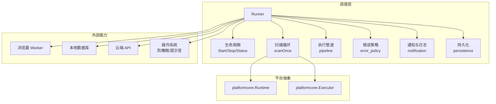
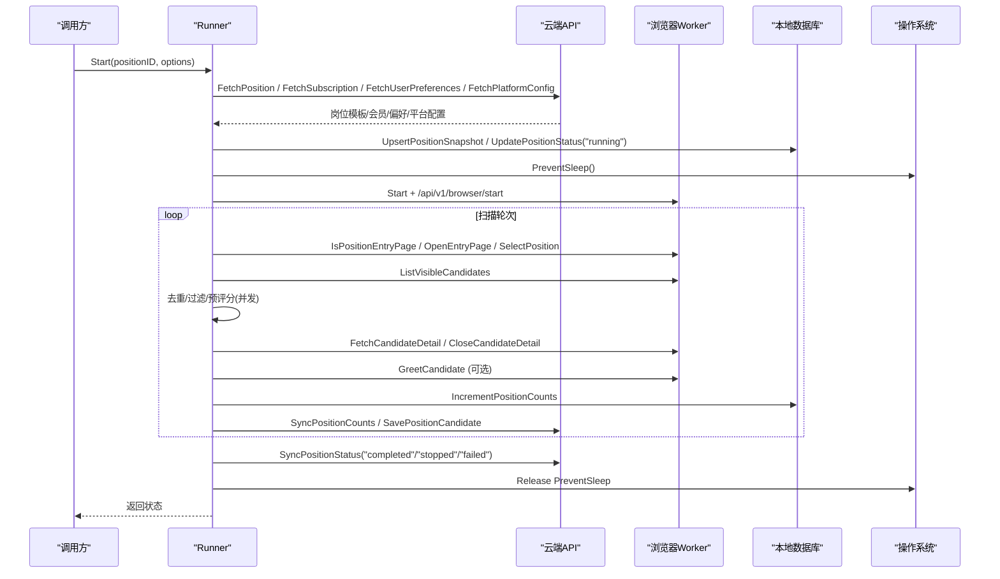
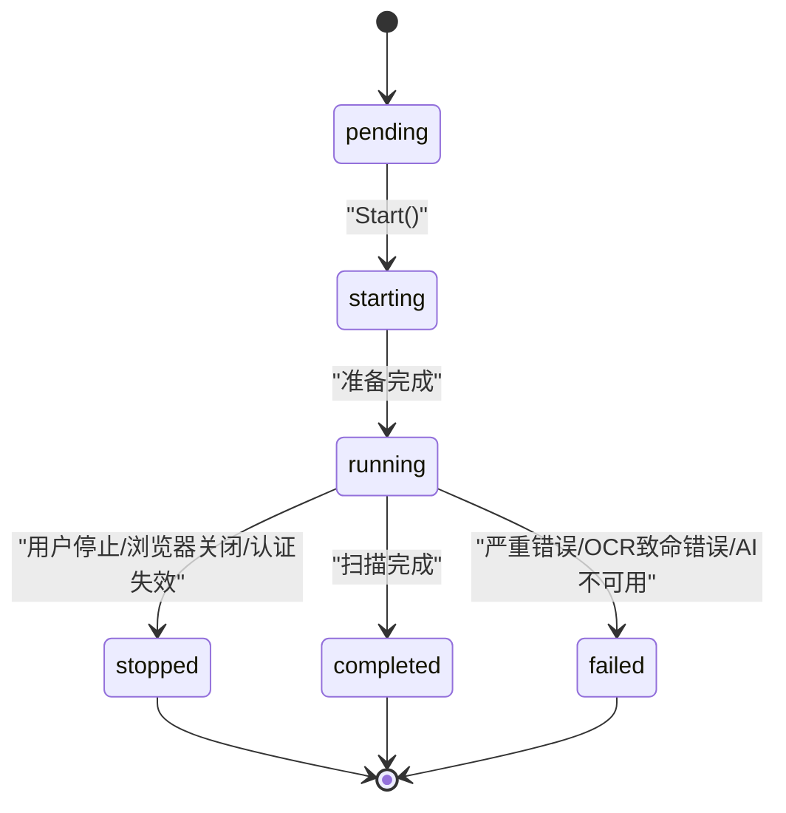
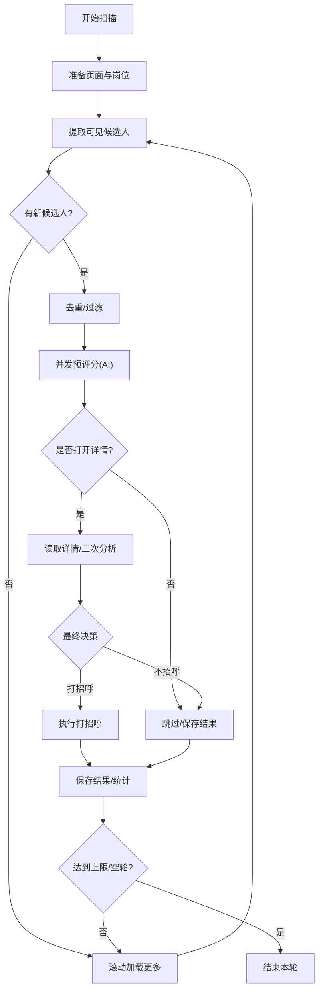
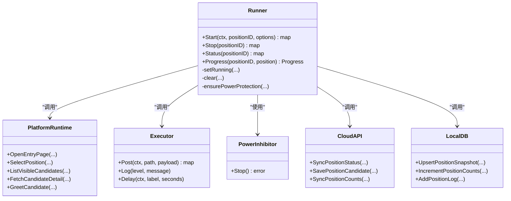

# 任务调度

<cite>
**本文引用的文件**
- [runner.go](file://goodhr5/local-agent-go/internal/positionrunner/runner.go)
- [lifecycle.go](file://goodhr5/local-agent-go/internal/positionrunner/lifecycle.go)
- [scan.go](file://goodhr5/local-agent-go/internal/positionrunner/scan.go)
- [pipeline.go](file://goodhr5/local-agent-go/internal/positionrunner/pipeline.go)
- [error_policy.go](file://goodhr5/local-agent-go/internal/positionrunner/error_policy.go)
- [persistence.go](file://goodhr5/local-agent-go/internal/positionrunner/persistence.go)
- [notification.go](file://goodhr5/local-agent-go/internal/positionrunner/notification.go)
- [runtime.go](file://goodhr5/local-agent-go/internal/platformcore/runtime.go)
- [inhibitor.go](file://goodhr5/local-agent-go/internal/power/inhibitor.go)
- [inhibitor_windows.go](file://goodhr5/local-agent-go/internal/power/inhibitor_windows.go)
</cite>

## 目录
1. [简介](#简介)
2. [项目结构](#项目结构)
3. [核心组件](#核心组件)
4. [架构总览](#架构总览)
5. [详细组件分析](#详细组件分析)
6. [依赖关系分析](#依赖关系分析)
7. [性能与并发特性](#性能与并发特性)
8. [故障处理与重试机制](#故障处理与重试机制)
9. [电源管理与休眠抑制](#电源管理与休眠抑制)
10. [监控、日志与统计](#监控日志与统计)
11. [配置管理与动态调整](#配置管理与动态调整)
12. [排错指南](#排错指南)
13. [结论](#结论)

## 简介
本系统是一个面向招聘平台的本地岗位运行调度器，负责“岗位运行”的启动、执行、停止、状态同步与结果持久化。其核心能力包括：
- 岗位运行生命周期管理：启动、扫描、详情读取、AI 评分、打招呼、完成/失败/停止等状态流转。
- 执行管道设计：候选人列表提取、去重、预评分、详情增强、最终决策、结果落库。
- 并发控制：按批候选人的 AI 预评分并发池，主流程顺序消费保证页面顺序一致性。
- 资源管理：浏览器 Worker 生命周期、下载目录、截图目录、音频提示音、云端会话保活。
- 电源管理：跨平台防睡眠抑制，检测休眠恢复并安全中止运行。
- 监控与统计：进度上报、云端状态同步、本地日志、失败通知、统计增量持久化。
- 配置管理：从云端拉取个人偏好与 AI 配置，运行时覆盖启动参数，支持热更新运行选项。

## 项目结构
调度器位于 local-agent-go 的 positionrunner 包，围绕 Runner 组织职责拆分：
- runner.go：Runner 定义、常量、工具函数、随机延时、滚动距离、概率打开详情等通用逻辑。
- lifecycle.go：Start/Stop/Status/Progress 等生命周期控制、运行锁、用户停止标记、电源保护。
- scan.go：一轮扫描主循环，页面准备、岗位切换、候选人提取、队列处理、滚动加载。
- pipeline.go：候选人看详情评分的并发工作池、超时封装、流水线入队。
- error_policy.go：候选人级错误追踪、连续错误阈值触发停止、OCR 致命错误识别。
- persistence.go：统计增量持久化、云端同步、候选人结果入库、云端配置快照构建。
- notification.go：本地日志写入、提示音播放、云端状态同步与失败邮件通知。
- platformcore/runtime.go：平台运行时统一接口（Executor/Runtime/可选扩展）。
- power/inhibitor*.go：跨平台防睡眠抑制实现。

图表来源
- [runner.go:71-86](file://goodhr5/local-agent-go/internal/positionrunner/runner.go#L71-L86)
- [lifecycle.go:15-79](file://goodhr5/local-agent-go/internal/positionrunner/lifecycle.go#L15-L79)
- [scan.go:17-462](file://goodhr5/local-agent-go/internal/positionrunner/scan.go#L17-L462)
- [pipeline.go:14-150](file://goodhr5/local-agent-go/internal/positionrunner/pipeline.go#L14-L150)
- [error_policy.go:1-119](file://goodhr5/local-agent-go/internal/positionrunner/error_policy.go#L1-L119)
- [persistence.go:14-389](file://goodhr5/local-agent-go/internal/positionrunner/persistence.go#L14-L389)
- [notification.go:21-243](file://goodhr5/local-agent-go/internal/positionrunner/notification.go#L21-L243)
- [runtime.go:10-111](file://goodhr5/local-agent-go/internal/platformcore/runtime.go#L10-L111)

章节来源
- [runner.go:71-86](file://goodhr5/local-agent-go/internal/positionrunner/runner.go#L71-L86)
- [lifecycle.go:15-79](file://goodhr5/local-agent-go/internal/positionrunner/lifecycle.go#L15-L79)
- [scan.go:17-462](file://goodhr5/local-agent-go/internal/positionrunner/scan.go#L17-L462)
- [pipeline.go:14-150](file://goodhr5/local-agent-go/internal/positionrunner/pipeline.go#L14-L150)
- [error_policy.go:1-119](file://goodhr5/local-agent-go/internal/positionrunner/error_policy.go#L1-L119)
- [persistence.go:14-389](file://goodhr5/local-agent-go/internal/positionrunner/persistence.go#L14-L389)
- [notification.go:21-243](file://goodhr5/local-agent-go/internal/positionrunner/notification.go#L21-L243)
- [runtime.go:10-111](file://goodhr5/local-agent-go/internal/platformcore/runtime.go#L10-L111)

## 核心组件
- Runner：持有本地数据库、浏览器 Worker、OCR、路径、云端基地址、运行中 map、用户停止标记、电源保护句柄；提供 Start/Stop/Status/Progress 等入口。
- 平台运行时 Runtime：统一抽象平台操作（打开入口页、切换岗位、提取候选人、滚动、读取详情、关闭详情、打招呼、筛选文本、指纹、清理详情文本等）。
- Executor：平台调用浏览器 Worker 的统一执行器，支持 Post、Log、Delay。
- 错误策略：候选人级错误追踪，连续相同错误达到阈值自动停止岗位运行。
- 持久化：统计增量持久化到本地并同步云端；候选人结果异步或同步入库；云端配置快照构建。
- 通知：本地日志写入、提示音播放、云端状态同步、失败邮件通知。
- 电源管理：跨平台防睡眠抑制，检测休眠恢复后取消运行。

章节来源
- [runner.go:71-86](file://goodhr5/local-agent-go/internal/positionrunner/runner.go#L71-L86)
- [runtime.go:10-111](file://goodhr5/local-agent-go/internal/platformcore/runtime.go#L10-L111)
- [error_policy.go:1-119](file://goodhr5/local-agent-go/internal/positionrunner/error_policy.go#L1-L119)
- [persistence.go:14-389](file://goodhr5/local-agent-go/internal/positionrunner/persistence.go#L14-L389)
- [notification.go:21-243](file://goodhr5/local-agent-go/internal/positionrunner/notification.go#L21-L243)

## 架构总览
调度器以 Runner 为中心，协调平台运行时、浏览器 Worker、云端 API、本地数据库和操作系统能力。启动时拉取云端配置（岗位模板、个人偏好、AI 配置），进入后台运行；扫描循环按轮次提取候选人，进行去重、预评分、详情增强、最终决策、打招呼与结果保存；完成后同步云端状态并结束。

图表来源
- [lifecycle.go:15-79](file://goodhr5/local-agent-go/internal/positionrunner/lifecycle.go#L15-L79)
- [scan.go:17-462](file://goodhr5/local-agent-go/internal/positionrunner/scan.go#L17-L462)
- [persistence.go:206-276](file://goodhr5/local-agent-go/internal/positionrunner/persistence.go#L206-L276)
- [notification.go:163-243](file://goodhr5/local-agent-go/internal/positionrunner/notification.go#L163-L243)

## 详细组件分析

### 生命周期与状态机
- 状态：pending、starting、running、completed、failed、stopped。
- 关键方法：
  - Start：校验 token、拉取云端配置、创建运行锁、开启防睡眠、更新进度为 starting/running、后台 goroutine 执行 runPosition。
  - runPosition：执行 scanOnce，根据错误类型决定 stopped/completed/failed，并同步云端状态。
  - Stop：标记用户停止，等待当前候选人处理完成，超时则强制停止；保持浏览器打开。
  - Status/Progress：返回位置状态、运行标志、进度、日志与分析快照。
- 运行锁与用户停止：
  - running map 记录每个 positionID 的 cancel、progress、options、analysis、runGreeted、pendingDetailClose 等。
  - userStopped map 标记用户主动停止，用于跳过后续页面操作。
- 电源保护：
  - ensurePowerProtection 在首次启动时创建防睡眠句柄，并启动 sleepMonitor 检测时间断层。
  - releasePowerProtectionIfIdle 在所有运行结束后释放句柄。

图表来源
- [lifecycle.go:15-79](file://goodhr5/local-agent-go/internal/positionrunner/lifecycle.go#L15-L79)
- [lifecycle.go:81-139](file://goodhr5/local-agent-go/internal/positionrunner/lifecycle.go#L81-L139)
- [lifecycle.go:141-193](file://goodhr5/local-agent-go/internal/positionrunner/lifecycle.go#L141-L193)
- [lifecycle.go:370-459](file://goodhr5/local-agent-go/internal/positionrunner/lifecycle.go#L370-L459)

章节来源
- [lifecycle.go:15-193](file://goodhr5/local-agent-go/internal/positionrunner/lifecycle.go#L15-L193)
- [lifecycle.go:370-459](file://goodhr5/local-agent-go/internal/positionrunner/lifecycle.go#L370-L459)

### 执行管道与并发控制
- 扫描循环 scanOnce：
  - 准备平台运行时与浏览器，确认入口页与岗位。
  - 提取可见候选人，去重后加入队列。
  - 对每批候选人进行预评分（AI 模式）与详情增强，最终决定是否打招呼与保存。
  - 滚动加载更多候选人，直到空轮次数达到上限或达到打招呼上限。
- 并发预评分：
  - startCandidateDetailWorkers：按并发数启动 worker，从 aiJobs 通道消费候选人，调用 withOperationTimeout 执行 AI 预评分，将结果写入 resultCh。
  - feedCandidatePipeline：按页面顺序将候选人送入 aiJobs，保证主流程顺序消费 resultCh。
- 超时与异常：
  - withOperationTimeout：为单个候选人关键操作加超时、捕获 panic、记录耗时与错误。
- 队列与优先级：
  - 队列基于页面顺序，无显式优先级字段；可通过“是否值得看详情”的预评分结果间接影响处理路径。
  - 通过 detailOpenProbability 与 shouldOpenDetailByProbability 控制是否打开详情。

图表来源
- [scan.go:17-462](file://goodhr5/local-agent-go/internal/positionrunner/scan.go#L17-L462)
- [pipeline.go:14-150](file://goodhr5/local-agent-go/internal/positionrunner/pipeline.go#L14-L150)

章节来源
- [scan.go:17-462](file://goodhr5/local-agent-go/internal/positionrunner/scan.go#L17-L462)
- [pipeline.go:14-150](file://goodhr5/local-agent-go/internal/positionrunner/pipeline.go#L14-L150)

### 错误处理与重试机制
- 候选人级错误追踪：
  - consecutiveOperationErrorTracker：记录同一平台环节连续出现的相同错误，归一化错误文本（去除数字与空白）。
  - stopAfterCandidateOperationError：当连续相同错误达到阈值（默认 3）时，返回错误并停止岗位运行。
- 致命错误识别：
  - isBrowserClosedPositionError：识别浏览器关闭相关错误，直接停止。
  - isFatalOCRError：识别 OCR 组件未安装/损坏/退出等致命错误。
- 重试与回退：
  - 云端状态同步与统计同步使用 withOperationTimeout 包裹，并在失败时记录警告；完成邮件同步最多重试 3 次。
  - 登录态校验 ensureCloudSessionActive：若认证失效，停止并通知云端。

章节来源
- [error_policy.go:1-119](file://goodhr5/local-agent-go/internal/positionrunner/error_policy.go#L1-L119)
- [notification.go:163-243](file://goodhr5/local-agent-go/internal/positionrunner/notification.go#L163-L243)
- [scan.go:464-493](file://goodhr5/local-agent-go/internal/positionrunner/scan.go#L464-L493)

### 资源管理与浏览器 Worker
- 浏览器启动：
  - worker.Start 启动 Worker，/api/v1/browser/start 传入 humanize、user_data_dir、downloads_path。
  - 固定视口尺寸由 positionBrowserViewport 提供。
- 下载目录：
  - browserDownloadDir 优先读取本地设置，否则使用默认目录。
- 详情容器管理：
  - pendingDetailClose 保存当前可能仍打开的候选人详情清理动作，确保结束时关闭。
- 平台运行时：
  - 通过 platformcore.Runtime 抽象平台差异，支持基础筛选、搜索准备、直接选择岗位、详情滚动等可选能力。

章节来源
- [scan.go:35-70](file://goodhr5/local-agent-go/internal/positionrunner/scan.go#L35-L70)
- [scan.go:662-675](file://goodhr5/local-agent-go/internal/positionrunner/scan.go#L662-L675)
- [runtime.go:46-111](file://goodhr5/local-agent-go/internal/platformcore/runtime.go#L46-L111)

### 任务优先级与队列管理
- 优先级：
  - 无显式优先级字段；通过“是否值得看详情”的预评分结果决定后续路径。
  - 打开详情概率 detailOpenProbability 可配置，避免旧运行突然不打开详情。
- 队列管理：
  - 基于页面顺序的队列，先提取再处理；去重使用 seen map。
  - 并发预评分通过通道 aiJobs 与 resultCh 解耦生产与消费，保证顺序性。

章节来源
- [scan.go:178-203](file://goodhr5/local-agent-go/internal/positionrunner/scan.go#L178-L203)
- [pipeline.go:91-150](file://goodhr5/local-agent-go/internal/positionrunner/pipeline.go#L91-L150)
- [runner.go:374-400](file://goodhr5/local-agent-go/internal/positionrunner/runner.go#L374-L400)

### 失败重试与告警
- 失败重试：
  - 云端状态同步与统计同步使用超时与重试；完成邮件同步最多 3 次。
- 告警：
  - 失败时播放提示音（如果启用）、发送邮件通知、记录本地日志。
  - 检测到电脑休眠恢复后，取消所有运行并记录失败原因。

章节来源
- [notification.go:163-243](file://goodhr5/local-agent-go/internal/positionrunner/notification.go#L163-L243)
- [lifecycle.go:419-459](file://goodhr5/local-agent-go/internal/positionrunner/lifecycle.go#L419-L459)

## 依赖关系分析
- Runner 依赖：
  - localdb：岗位运行记录、日志、设置、统计增量。
  - browser.Worker：浏览器自动化与页面操作。
  - cloudapi：云端配置、状态同步、结果入库、统计同步。
  - platformcore.Runtime/Executor：平台抽象与执行器。
  - power.Inhibitor：防睡眠抑制。
- 耦合与内聚：
  - 平台运行时通过接口隔离平台差异，提高内聚性。
  - 错误策略独立于主流程，便于复用与测试。
  - 持久化与通知解耦，分别负责数据同步与用户反馈。

图表来源
- [runner.go:71-86](file://goodhr5/local-agent-go/internal/positionrunner/runner.go#L71-L86)
- [runtime.go:10-111](file://goodhr5/local-agent-go/internal/platformcore/runtime.go#L10-L111)
- [inhibitor.go:4-15](file://goodhr5/local-agent-go/internal/power/inhibitor.go#L4-L15)
- [persistence.go:14-70](file://goodhr5/local-agent-go/internal/positionrunner/persistence.go#L14-L70)
- [notification.go:21-36](file://goodhr5/local-agent-go/internal/positionrunner/notification.go#L21-L36)

章节来源
- [runner.go:71-86](file://goodhr5/local-agent-go/internal/positionrunner/runner.go#L71-L86)
- [runtime.go:10-111](file://goodhr5/local-agent-go/internal/platformcore/runtime.go#L10-L111)
- [inhibitor.go:4-15](file://goodhr5/local-agent-go/internal/power/inhibitor.go#L4-L15)
- [persistence.go:14-70](file://goodhr5/local-agent-go/internal/positionrunner/persistence.go#L14-L70)
- [notification.go:21-36](file://goodhr5/local-agent-go/internal/positionrunner/notification.go#L21-L36)

## 性能与并发特性
- 并发预评分：
  - candidatePipelineConcurrency 根据批次大小限制并发数，默认最大 5。
  - 使用通道 aiJobs 与 resultCh 解耦生产与消费，避免阻塞主流程。
- 超时控制：
  - withOperationTimeout 为每个候选人关键操作设置超时，防止长时间阻塞。
  - 全局候选人处理超时 candidateTotalTimeout，避免单候选人拖慢整体。
- 随机延时与抖动：
  - delayRandomRange、randomScrollDistance、detailOpenProbability 模拟人工操作，降低被反爬风险。
- 统计与 IO：
  - 统计增量持久化与云端同步使用超时与重试，减少网络波动影响。
  - 候选人结果入库异步等待图片详情 AI 完整输出，避免阻塞主流程。

章节来源
- [pipeline.go:49-150](file://goodhr5/local-agent-go/internal/positionrunner/pipeline.go#L49-L150)
- [scan.go:217-233](file://goodhr5/local-agent-go/internal/positionrunner/scan.go#L217-L233)
- [runner.go:420-447](file://goodhr5/local-agent-go/internal/positionrunner/runner.go#L420-L447)
- [persistence.go:121-154](file://goodhr5/local-agent-go/internal/positionrunner/persistence.go#L121-L154)

## 故障处理与重试机制
- 候选人级错误：
  - 连续相同错误达到阈值自动停止，避免无效循环。
- 致命错误：
  - 浏览器关闭、OCR 组件问题、AI 不可用等直接停止并通知。
- 重试策略：
  - 云端状态同步与统计同步使用超时与重试；完成邮件同步最多 3 次。
- 登录态校验：
  - 定期验证 token，失效时停止并通知云端。

章节来源
- [error_policy.go:1-119](file://goodhr5/local-agent-go/internal/positionrunner/error_policy.go#L1-L119)
- [notification.go:163-243](file://goodhr5/local-agent-go/internal/positionrunner/notification.go#L163-L243)
- [scan.go:464-493](file://goodhr5/local-agent-go/internal/positionrunner/scan.go#L464-L493)

## 电源管理与休眠抑制
- 防睡眠抑制：
  - Windows 使用 SetThreadExecutionState 阻止系统自动睡眠。
  - 其他平台提供 noopInhibitor 占位实现。
- 休眠恢复检测：
  - monitorSleepResume 定时检测时间断层，超过阈值认为发生休眠恢复，取消所有运行并记录失败原因。
- 资源释放：
  - releasePowerProtectionIfIdle 在所有运行结束后释放防睡眠句柄。

章节来源
- [lifecycle.go:370-459](file://goodhr5/local-agent-go/internal/positionrunner/lifecycle.go#L370-L459)
- [inhibitor.go:4-15](file://goodhr5/local-agent-go/internal/power/inhibitor.go#L4-L15)
- [inhibitor_windows.go:25-59](file://goodhr5/local-agent-go/internal/power/inhibitor_windows.go#L25-L59)

## 监控、日志与统计
- 进度上报：
  - updateProgress 更新 stage、message、total_rounds、updated_at。
- 本地日志：
  - positionLog 写入 level 与 message，供前端查询。
- 云端统计：
  - syncPositionCounts 同步扫描、打招呼、跳过、失败数量。
  - syncProcessedResumeCount 同步已处理简历数。
- 结果入库：
  - saveCandidateResult 组装 payload 并调用云端接口保存。
- 失败通知：
  - sendPositionFailNotification 发送邮件通知，包含本次打招呼数量。

章节来源
- [lifecycle.go:495-531](file://goodhr5/local-agent-go/internal/positionrunner/lifecycle.go#L495-L531)
- [notification.go:21-36](file://goodhr5/local-agent-go/internal/positionrunner/notification.go#L21-L36)
- [persistence.go:14-70](file://goodhr5/local-agent-go/internal/positionrunner/persistence.go#L14-L70)
- [persistence.go:72-169](file://goodhr5/local-agent-go/internal/positionrunner/persistence.go#L72-L169)
- [notification.go:163-243](file://goodhr5/local-agent-go/internal/positionrunner/notification.go#L163-L243)

## 配置管理与动态调整
- 云端配置快照：
  - buildPositionRuntimeSnapshot 拉取会员状态、个人偏好、AI 配置、平台配置，构建 PositionRuntimeSnapshot。
- 动态覆盖：
  - applyCloudPreferences 使用云端个人配置覆盖启动参数（滚动延时、查看详情延时、打开详情概率、休息策略等）。
- 运行选项热更新：
  - updateRunOptions 在运行中更新 StartOptions，影响后续行为。
- AI 配置校验：
  - validateAIConfig 确保 BaseURL、APIKey、Model 非空。

章节来源
- [persistence.go:206-276](file://goodhr5/local-agent-go/internal/positionrunner/persistence.go#L206-L276)
- [persistence.go:318-382](file://goodhr5/local-agent-go/internal/positionrunner/persistence.go#L318-L382)
- [lifecycle.go:474-482](file://goodhr5/local-agent-go/internal/positionrunner/lifecycle.go#L474-L482)

## 排错指南
- 常见问题：
  - 浏览器未启动或关闭：isBrowserClosedPositionError 识别并停止。
  - OCR 组件问题：isFatalOCRError 识别并停止。
  - 登录态失效：ensureCloudSessionActive 停止并通知。
  - 连续错误：consecutiveOperationErrorTracker 达到阈值自动停止。
- 调试建议：
  - 查看本地日志 positionLog 输出。
  - 检查云端状态同步与统计同步是否成功。
  - 确认防睡眠抑制是否生效，避免系统休眠导致中断。

章节来源
- [error_policy.go:1-119](file://goodhr5/local-agent-go/internal/positionrunner/error_policy.go#L1-L119)
- [notification.go:21-36](file://goodhr5/local-agent-go/internal/positionrunner/notification.go#L21-L36)
- [scan.go:464-493](file://goodhr5/local-agent-go/internal/positionrunner/scan.go#L464-L493)

## 结论
该任务调度系统以 Runner 为核心，结合平台运行时抽象、执行管道、错误策略、持久化与通知机制，实现了稳定的岗位运行生命周期管理。通过并发预评分、超时控制、随机延时与抖动，提升了鲁棒性与反爬能力。电源管理与休眠恢复检测保障了长时间运行的稳定性。配置管理与动态调整支持云端下发个性化策略，满足多样化业务需求。整体设计清晰、职责分明，具备良好的可扩展性与可维护性。