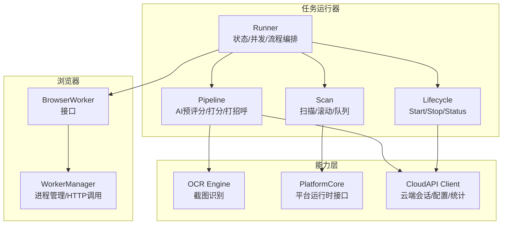
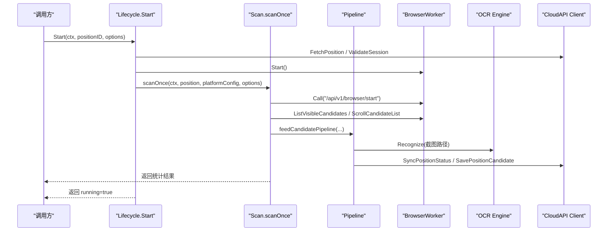
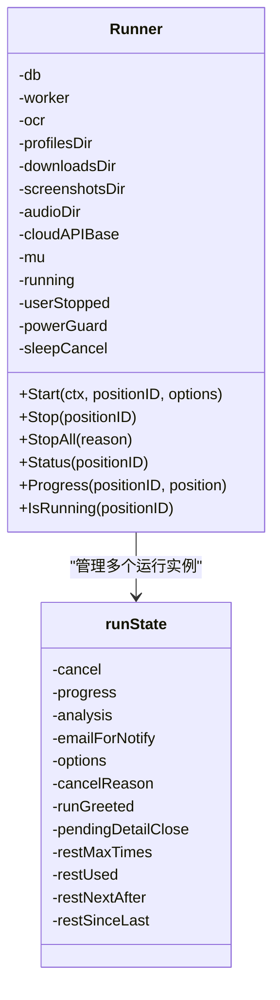
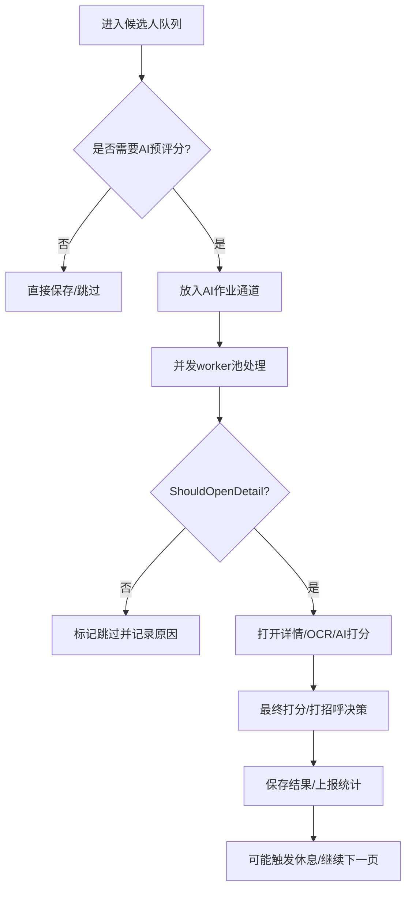
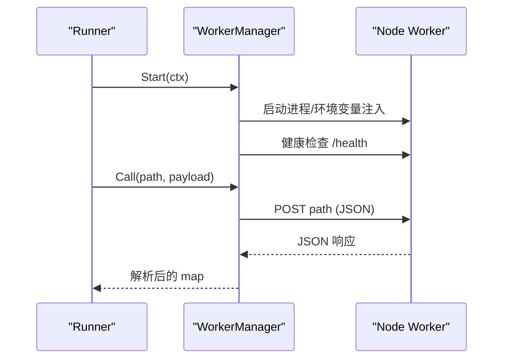
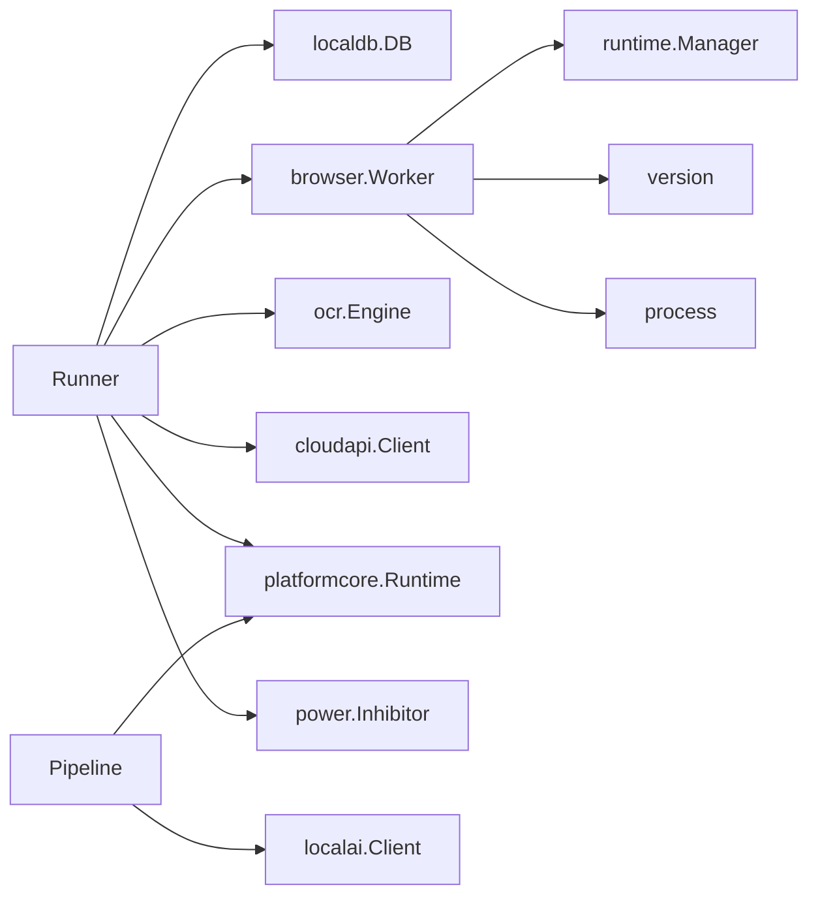

# 任务运行器核心

<cite>
**本文引用的文件**
- [runner.go](file://goodhr5/local-agent-go/internal/positionrunner/runner.go)
- [lifecycle.go](file://goodhr5/local-agent-go/internal/positionrunner/lifecycle.go)
- [pipeline.go](file://goodhr5/local-agent-go/internal/positionrunner/pipeline.go)
- [scan.go](file://goodhr5/local-agent-go/internal/positionrunner/scan.go)
- [worker.go](file://goodhr5/local-agent-go/internal/browser/worker.go)
- [engine.go](file://goodhr5/local-agent-go/internal/ocr/engine.go)
- [client.go](file://goodhr5/local-agent-go/internal/cloudapi/client.go)
- [runtime.go](file://goodhr5/local-agent-go/internal/platformcore/runtime.go)
</cite>

## 目录
1. [简介](#简介)
2. [项目结构](#项目结构)
3. [核心组件](#核心组件)
4. [架构总览](#架构总览)
5. [详细组件分析](#详细组件分析)
6. [依赖关系分析](#依赖关系分析)
7. [性能考量](#性能考量)
8. [故障排查指南](#故障排查指南)
9. [结论](#结论)
10. [附录](#附录)

## 简介
本文件聚焦“任务运行器核心”，围绕 Runner 结构体、runState 生命周期管理、并发控制机制，以及 BrowserWorker 抽象、OCR 识别集成与云端 API 通信进行系统化说明。文档同时覆盖启动参数 StartOptions、随机延时模拟、滚动距离计算、任务监控、日志记录与错误处理等关键特性，帮助读者快速理解并正确使用该子系统。

## 项目结构
任务运行器位于本地 Agent 的 positionrunner 包中，负责岗位运行的启动、停止、进度追踪、并发流水线执行以及与浏览器 Worker、OCR、云端 API 的协作。浏览器控制由 browser 包提供 Node Worker 进程管理与 HTTP 调用；OCR 通过独立进程实现截图文字识别；云端通信由 cloudapi 客户端完成；平台适配通过 platformcore 统一接口解耦。

图表来源
- [runner.go:71-86](file://goodhr5/local-agent-go/internal/positionrunner/runner.go#L71-L86)
- [lifecycle.go:15-79](file://goodhr5/local-agent-go/internal/positionrunner/lifecycle.go#L15-L79)
- [scan.go:17-462](file://goodhr5/local-agent-go/internal/positionrunner/scan.go#L17-L462)
- [pipeline.go:14-150](file://goodhr5/local-agent-go/internal/positionrunner/pipeline.go#L14-L150)
- [worker.go:27-701](file://goodhr5/local-agent-go/internal/browser/worker.go#L27-L701)
- [engine.go:21-326](file://goodhr5/local-agent-go/internal/ocr/engine.go#L21-L326)
- [client.go:17-542](file://goodhr5/local-agent-go/internal/cloudapi/client.go#L17-L542)
- [runtime.go:10-111](file://goodhr5/local-agent-go/internal/platformcore/runtime.go#L10-L111)

章节来源
- [runner.go:1-731](file://goodhr5/local-agent-go/internal/positionrunner/runner.go#L1-L731)
- [lifecycle.go:1-624](file://goodhr5/local-agent-go/internal/positionrunner/lifecycle.go#L1-L624)
- [scan.go:1-785](file://goodhr5/local-agent-go/internal/positionrunner/scan.go#L1-L785)
- [pipeline.go:1-150](file://goodhr5/local-agent-go/internal/positionrunner/pipeline.go#L1-L150)
- [worker.go:1-701](file://goodhr5/local-agent-go/internal/browser/worker.go#L1-L701)
- [engine.go:1-326](file://goodhr5/local-agent-go/internal/ocr/engine.go#L1-L326)
- [client.go:1-542](file://goodhr5/local-agent-go/internal/cloudapi/client.go#L1-L542)
- [runtime.go:1-111](file://goodhr5/local-agent-go/internal/platformcore/runtime.go#L1-L111)

## 核心组件
- Runner：岗位运行器的核心，持有数据库、浏览器 Worker、OCR、云端地址、运行锁、用户停止标记、防睡眠保护等，负责启动、停止、状态查询、进度与分析结果更新。
- runState：单个岗位运行的上下文句柄，包含取消函数、进度、分析状态、邮箱通知、启动参数、本次打招呼计数、详情关闭回调、休息状态等。
- BrowserWorker：抽象浏览器 Worker 能力（启动、调用），由 WorkerManager 实现，封装 Node 进程生命周期与 HTTP 调用。
- OCR Engine：本地 OCR 进程封装，支持截图文字识别、进程常驻、日志输出。
- CloudAPI Client：云端会话校验、配置获取、状态同步、统计上报、失败通知等。
- PlatformCore Runtime：平台运行时统一接口，定义页面跳转、岗位切换、候选人提取、滚动、详情读取、打招呼等能力。

章节来源
- [runner.go:60-86](file://goodhr5/local-agent-go/internal/positionrunner/runner.go#L60-L86)
- [runner.go:88-137](file://goodhr5/local-agent-go/internal/positionrunner/runner.go#L88-L137)
- [worker.go:27-701](file://goodhr5/local-agent-go/internal/browser/worker.go#L27-L701)
- [engine.go:21-326](file://goodhr5/local-agent-go/internal/ocr/engine.go#L21-L326)
- [client.go:17-542](file://goodhr5/local-agent-go/internal/cloudapi/client.go#L17-L542)
- [runtime.go:10-111](file://goodhr5/local-agent-go/internal/platformcore/runtime.go#L10-L111)

## 架构总览
任务运行器以 Runner 为中心，按职责拆分到 lifecycle、scan、pipeline 三个模块：
- lifecycle 负责启动、停止、状态、进度、分析快照、防睡眠保护、用户停止信号。
- scan 负责页面准备、岗位确认、候选人提取、滚动加载、列表过滤、统计持久化。
- pipeline 负责候选人并发处理池、超时包装、AI 预评分与最终打分、打招呼决策。

图表来源
- [lifecycle.go:15-79](file://goodhr5/local-agent-go/internal/positionrunner/lifecycle.go#L15-L79)
- [scan.go:17-462](file://goodhr5/local-agent-go/internal/positionrunner/scan.go#L17-L462)
- [pipeline.go:49-150](file://goodhr5/local-agent-go/internal/positionrunner/pipeline.go#L49-L150)
- [worker.go:78-332](file://goodhr5/local-agent-go/internal/browser/worker.go#L78-L332)
- [engine.go:59-97](file://goodhr5/local-agent-go/internal/ocr/engine.go#L59-L97)
- [client.go:150-340](file://goodhr5/local-agent-go/internal/cloudapi/client.go#L150-L340)

## 详细组件分析

### Runner 与 runState：生命周期与并发控制
- Runner 维护 running map 与 userStopped 标志，使用互斥锁保证并发安全。每个岗位运行对应一个 runState，包含 cancel 上下文、Progress、analysis、options、本次打招呼计数、详情关闭回调、休息状态等。
- 启动时创建 context.WithCancel，设置运行锁，开启防睡眠保护，构建 PositionRuntimeSnapshot，写入数据库状态为 running，并后台协程执行 runPosition。
- 停止时先标记用户停止，等待当前候选人处理完成（优雅退出），若超时则强制取消并清理资源。
- 进度与分析状态通过 updateProgress/updateAnalysis 原子更新，Status/Progress 方法对外暴露当前状态。

图表来源
- [runner.go:71-103](file://goodhr5/local-agent-go/internal/positionrunner/runner.go#L71-L103)
- [lifecycle.go:461-624](file://goodhr5/local-agent-go/internal/positionrunner/lifecycle.go#L461-L624)

章节来源
- [runner.go:71-137](file://goodhr5/local-agent-go/internal/positionrunner/runner.go#L71-L137)
- [lifecycle.go:15-79](file://goodhr5/local-agent-go/internal/positionrunner/lifecycle.go#L15-L79)
- [lifecycle.go:141-193](file://goodhr5/local-agent-go/internal/positionrunner/lifecycle.go#L141-L193)
- [lifecycle.go:195-241](file://goodhr5/local-agent-go/internal/positionrunner/lifecycle.go#L195-L241)
- [lifecycle.go:461-624](file://goodhr5/local-agent-go/internal/positionrunner/lifecycle.go#L461-L624)

### 任务启动参数 StartOptions：高级特性
- 基础参数：CloudAPIBase、Token、AIConfig、EnableGreet、GreetDelayMin/Max、GreetRetries、ScanRounds、MaxItems、ScrollDistance、PageReadyDelay。
- 模拟人工操作延时：ScrollDelayMin/Max、ListViewDelayMin/Max、DetailViewDelayMin/Max、DetailOpenProbability、DetailOpenDelayMin/Max、DetailCloseDelayMin/Max、GreetBeforeDelayMin/Max。
- 摸鱼休息：RestAfterCandidatesMin/Max、RestTimesMin/Max、RestDurationMin/Max。
- 提示音与通知：EnableSound、EmailForNotify。
- 随机滚动距离：randomScrollDistance 基于 base 值加抖动，避免固定步长被反爬检测。
- 打开详情概率：detailOpenProbability 结合个人配置与默认值，shouldOpenDetailByProbability 做随机判定。

章节来源
- [runner.go:173-210](file://goodhr5/local-agent-go/internal/positionrunner/runner.go#L173-L210)
- [runner.go:362-447](file://goodhr5/local-agent-go/internal/positionrunner/runner.go#L362-L447)
- [runner.go:402-435](file://goodhr5/local-agent-go/internal/positionrunner/runner.go#L402-L435)

### 进度追踪与分析状态
- Progress 包含阶段、消息、轮次、总轮次、更新时间，用于前端展示与状态同步。
- positionAnalysisStatus 表示控制台置顶小窗的结构化分析结果，包括类型、阶段、候选姓名、是否接受、原因、关键词匹配等。
- updateProgress/updateAnalysis 在并发安全下更新状态，analysisSnapshot 返回副本避免竞态。

章节来源
- [runner.go:105-128](file://goodhr5/local-agent-go/internal/positionrunner/runner.go#L105-L128)
- [lifecycle.go:495-547](file://goodhr5/local-agent-go/internal/positionrunner/lifecycle.go#L495-L547)

### 并发控制机制
- 候选人处理采用管道模型：feedCandidatePipeline 将候选人送入 AI 预评分队列，startCandidateDetailWorkers 启动并发 worker 池，按页顺序消费结果，保持页面顺序一致性。
- withOperationTimeout 为每个关键操作加超时、异常捕获与耗时日志，防止长时间阻塞。
- candidatePipelineConcurrency 根据候选人数量动态决定并发度，上限为默认值。
- 运行级并发：Runner 内部使用互斥锁保护 running/userStopped 等共享状态。

图表来源
- [pipeline.go:49-150](file://goodhr5/local-agent-go/internal/positionrunner/pipeline.go#L49-L150)
- [scan.go:217-434](file://goodhr5/local-agent-go/internal/positionrunner/scan.go#L217-L434)

章节来源
- [pipeline.go:14-150](file://goodhr5/local-agent-go/internal/positionrunner/pipeline.go#L14-L150)
- [scan.go:217-434](file://goodhr5/local-agent-go/internal/positionrunner/scan.go#L217-L434)

### BrowserWorker 接口与实现
- BrowserWorker 接口定义 Start 与 Call，屏蔽底层 Node Worker 细节。
- WorkerManager 负责 Node 进程生命周期管理：启动、健康检查、端口复用、重启、日志输出、兼容版本校验、自动重试。
- Call/CALLGet 对 Worker HTTP 接口进行 JSON 编解码与错误归一化，遇到可重启错误自动重启并重试。

图表来源
- [worker.go:78-332](file://goodhr5/local-agent-go/internal/browser/worker.go#L78-L332)
- [worker.go:353-364](file://goodhr5/local-agent-go/internal/browser/worker.go#L353-L364)

章节来源
- [worker.go:27-701](file://goodhr5/local-agent-go/internal/browser/worker.go#L27-L701)

### OCR 识别集成
- OCR Engine 封装 RapidOCR-json 进程，支持图片路径校验、模型文件检查、进程常驻、输入输出管道、超时取消、日志输出。
- Recognize 发送图片路径，读取一行 JSON 结果，提取文本字段，未识别到文字时返回错误。
- 错误处理包含进程退出、EOF、读取失败等场景，并附带日志路径便于排查。

章节来源
- [engine.go:21-326](file://goodhr5/local-agent-go/internal/ocr/engine.go#L21-L326)

### 云端 API 通信
- CloudAPI Client 提供会话校验、平台配置获取、会员状态、岗位详情、有效 AI 配置、用户偏好、候选人保存、已处理简历数上报、统计同步、停止通知、失败邮件通知等。
- 所有认证请求通过 Bearer Token 传递，错误信息翻译为中文，便于前端展示。
- 启动与运行过程中会同步 running/completed/stopped 状态，并在失败时发送邮件通知。

章节来源
- [client.go:17-542](file://goodhr5/local-agent-go/internal/cloudapi/client.go#L17-L542)
- [lifecycle.go:71-79](file://goodhr5/local-agent-go/internal/positionrunner/lifecycle.go#L71-L79)
- [scan.go:464-493](file://goodhr5/local-agent-go/internal/positionrunner/scan.go#L464-L493)

### 平台运行时抽象
- PlatformCore Runtime 定义统一的平台能力接口，包括入口页打开、准备、判断、岗位切换、候选人提取、滚动、详情读取、关闭、打招呼、筛选文本、指纹、详情文本清理等。
- 可选扩展接口：基础筛选应用、打招呼后索要信息、岗位搜索准备、直接岗位选择策略、跳过岗位选择策略、详情滚动能力。
- Runner 通过 executor 适配器调用平台实现，并将日志写入岗位运行日志。

章节来源
- [runtime.go:10-111](file://goodhr5/local-agent-go/internal/platformcore/runtime.go#L10-L111)
- [runner.go:145-171](file://goodhr5/local-agent-go/internal/positionrunner/runner.go#L145-L171)

## 依赖关系分析
- Runner 依赖：localdb（岗位与日志）、browser.Worker（浏览器控制）、ocr.Engine（截图识别）、cloudapi.Client（云端通信）、platformcore.Runtime（平台适配）、power.Inhibitor（防睡眠）。
- WorkerManager 依赖：runtime.Manager（运行组件安装与路径）、version（版本兼容）、process（进程树终止）。
- Pipeline 依赖：localai.Client（AI 打分）、platformcore.Runtime（详情页滚动/分析）。
- Scan 依赖：platforms.RuntimeFor（平台运行时注册）、cloudapi.PlatformConfig（平台配置）。

图表来源
- [runner.go:71-86](file://goodhr5/local-agent-go/internal/positionrunner/runner.go#L71-L86)
- [worker.go:35-48](file://goodhr5/local-agent-go/internal/browser/worker.go#L35-L48)
- [pipeline.go:118-131](file://goodhr5/local-agent-go/internal/positionrunner/pipeline.go#L118-L131)
- [scan.go:17-35](file://goodhr5/local-agent-go/internal/positionrunner/scan.go#L17-L35)

章节来源
- [runner.go:71-86](file://goodhr5/local-agent-go/internal/positionrunner/runner.go#L71-L86)
- [worker.go:35-48](file://goodhr5/local-agent-go/internal/browser/worker.go#L35-L48)
- [pipeline.go:118-131](file://goodhr5/local-agent-go/internal/positionrunner/pipeline.go#L118-L131)
- [scan.go:17-35](file://goodhr5/local-agent-go/internal/positionrunner/scan.go#L17-L35)

## 性能考量
- 并发度控制：候选人处理池根据批次大小动态调整并发，上限为默认值，避免过度并发导致平台限流或资源耗尽。
- 超时保护：withOperationTimeout 为每个关键步骤设置超时，防止单候选人卡死影响整体吞吐。
- 滚动优化：randomScrollDistance 引入抖动，减少固定模式被检测的概率；pageReadyDelay 确保页面稳定后再提取。
- 网络与进程：WorkerManager 自动重启与重试，OCR 进程常驻减少启动开销；云端请求带超时与错误归一化。
- 统计持久化：增量保存避免重复累计，降低数据库压力。

[本节为通用性能建议，不直接分析具体文件]

## 故障排查指南
- 启动失败：检查云端配置、登录态、浏览器 Worker 是否就绪；查看 Worker 日志与最近日志摘要。
- 浏览器关闭：isBrowserClosedPositionError 识别常见错误关键字，自动结束并通知。
- 账号失效：ValidateSession 返回 AuthExpiredError 时立即停止并通知。
- OCR 失败：检查模型文件完整性、进程退出码、日志路径；必要时重启 OCR 进程。
- 停止等待超时：Stop 优雅等待当前候选人完成后停止，若超时则强制取消并记录日志。
- 防睡眠保护：检测到系统休眠恢复后取消运行，避免长时间无心跳导致的异常。

章节来源
- [lifecycle.go:313-359](file://goodhr5/local-agent-go/internal/positionrunner/lifecycle.go#L313-L359)
- [lifecycle.go:370-459](file://goodhr5/local-agent-go/internal/positionrunner/lifecycle.go#L370-L459)
- [worker.go:334-364](file://goodhr5/local-agent-go/internal/browser/worker.go#L334-L364)
- [engine.go:218-238](file://goodhr5/local-agent-go/internal/ocr/engine.go#L218-L238)

## 结论
任务运行器核心通过 Runner 统一管理岗位运行生命周期，结合 runState 精细跟踪单个运行实例的状态与进度；通过 BrowserWorker 抽象与 WorkerManager 实现稳定的浏览器控制；借助 OCR Engine 与 CloudAPI Client 完成截图识别与云端协同；利用 PlatformCore Runtime 解耦多平台差异。并发控制、随机延时、滚动距离抖动、超时保护与完善的日志与错误处理共同保障了高可用与鲁棒性。

[本节为总结性内容，不直接分析具体文件]

## 附录
- 关键常量与默认值：扫描轮次、滚动距离、并发度、超时时间等，可在 runner.go 中查阅。
- 启动参数详解：StartOptions 各字段含义与默认行为，参考 runner.go 中的结构与相关函数。
- 平台适配要点：不同平台的 Runtime 实现需遵循 platformcore 接口约定，确保页面与岗位切换逻辑正确。

[本节为补充说明，不直接分析具体文件]