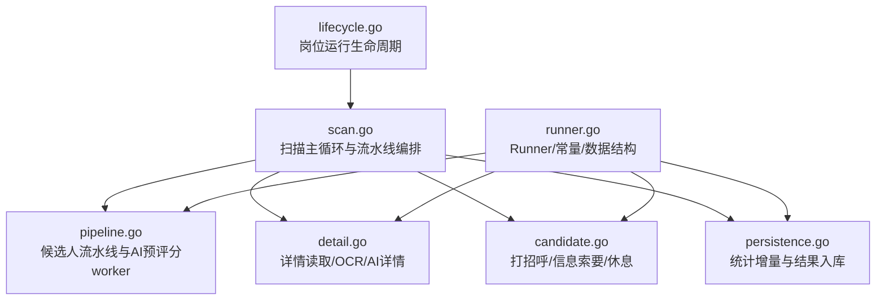
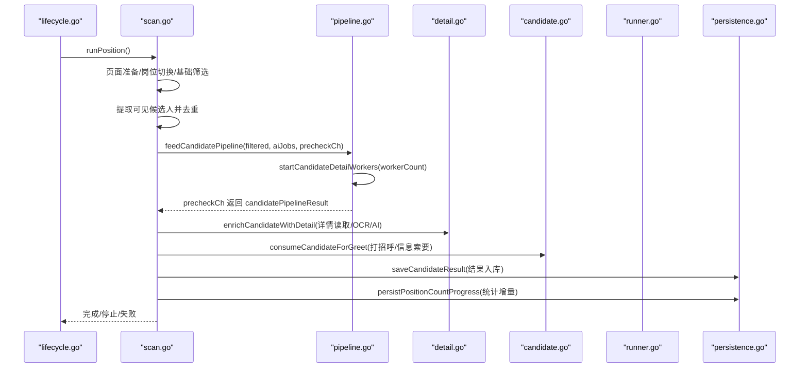
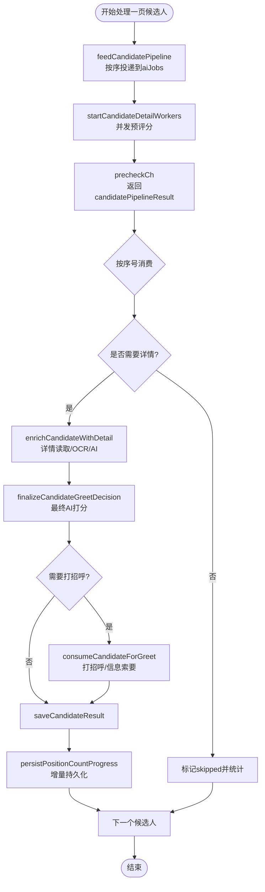
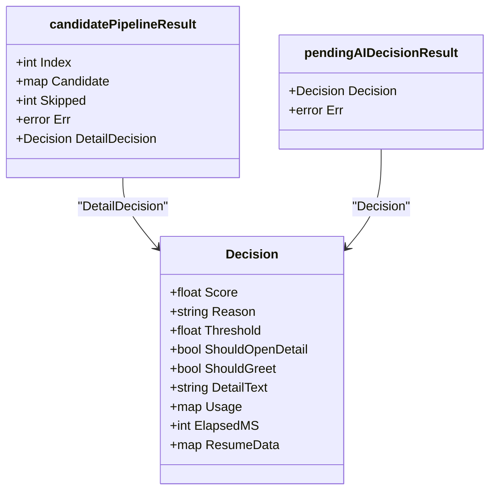
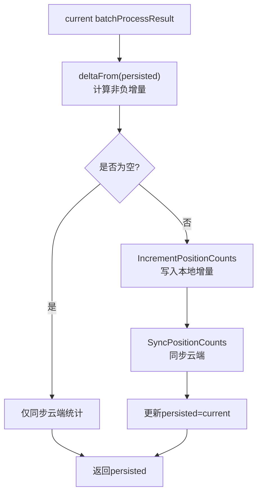
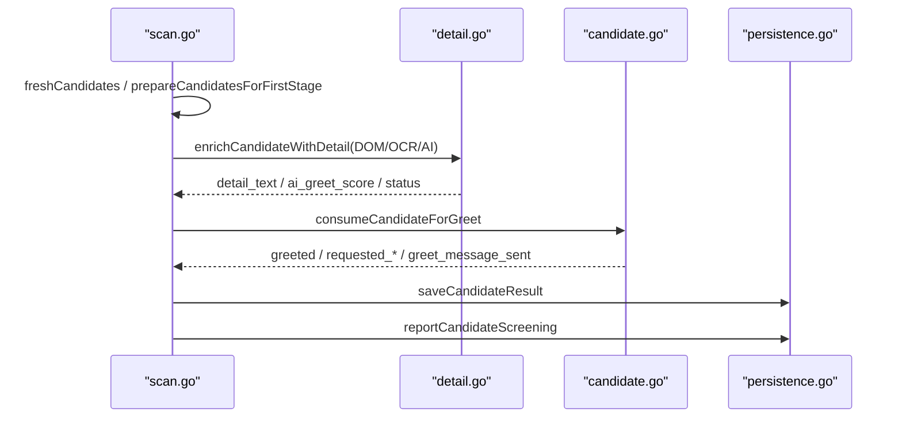
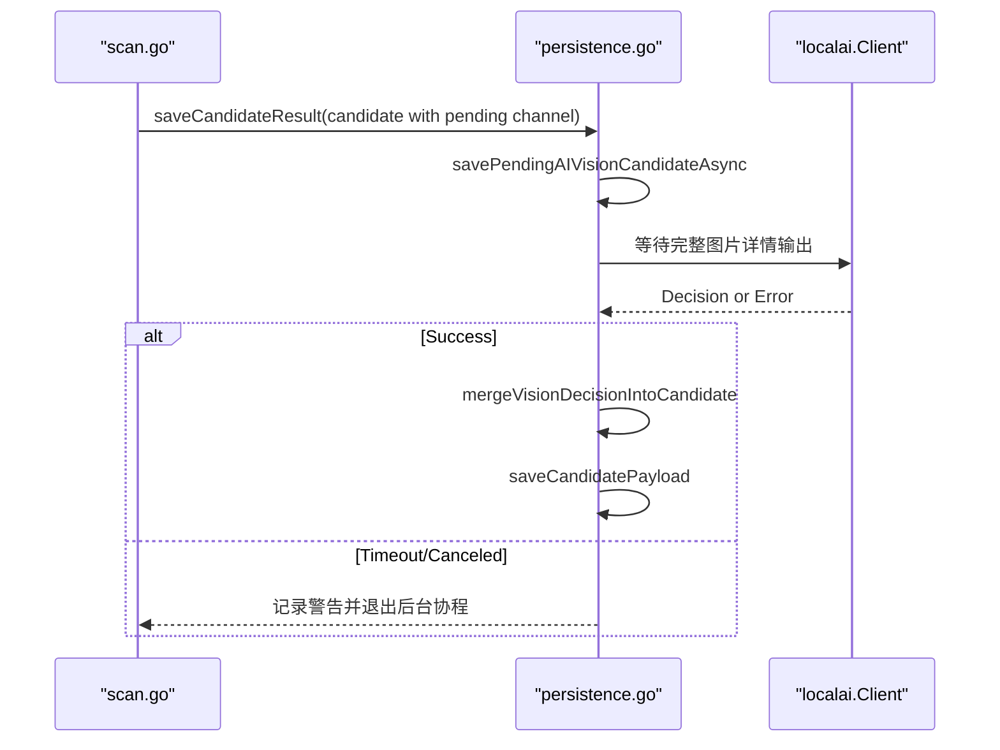
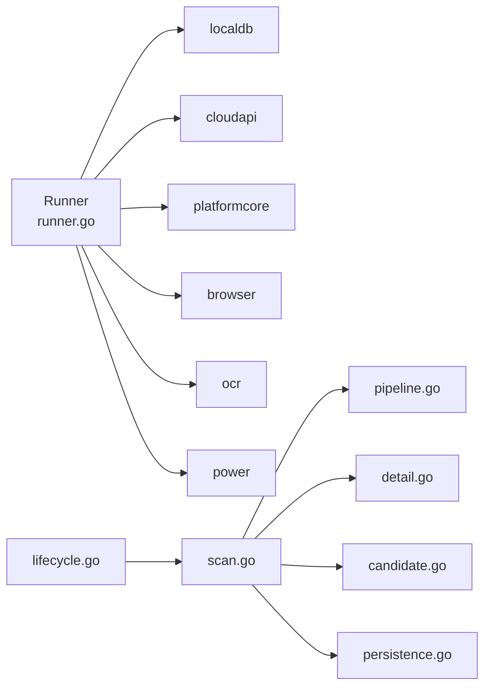

# 执行管道

<cite>
**本文引用的文件**   
- [pipeline.go](file://goodhr5/local-agent-go/internal/positionrunner/pipeline.go)
- [runner.go](file://goodhr5/local-agent-go/internal/positionrunner/runner.go)
- [scan.go](file://goodhr5/local-agent-go/internal/positionrunner/scan.go)
- [detail.go](file://goodhr5/local-agent-go/internal/positionrunner/detail.go)
- [candidate.go](file://goodhr5/local-agent-go/internal/positionrunner/candidate.go)
- [lifecycle.go](file://goodhr5/local-agent-go/internal/positionrunner/lifecycle.go)
- [persistence.go](file://goodhr5/local-agent-go/internal/positionrunner/persistence.go)
</cite>

## 目录
1. [引言](#引言)
2. [项目结构](#项目结构)
3. [核心组件](#核心组件)
4. [架构总览](#架构总览)
5. [详细组件分析](#详细组件分析)
6. [依赖关系分析](#依赖关系分析)
7. [性能与内存管理](#性能与内存管理)
8. [故障排查指南](#故障排查指南)
9. [结论](#结论)

## 引言
本文面向“候选人处理流水线”的执行管道，系统性说明本地岗位运行中候选人的扫描、筛选、详情读取、AI 匹配、自动打招呼、结果聚合与持久化等关键流程。重点解释以下设计点：
- 并行处理：基于通道与 worker 池的“是否值得看详情”预评分并发模型。
- 错误处理：操作级超时、上下文取消、连续失败熔断、浏览器关闭检测、岗位运行停止语义。
- 结果聚合：`batchProcessResult` 统计增量与去重保存机制。
- 异步 AI 决策：`pendingAIDecisionResult` 用于等待图片详情 AI 完整输出后再落库。
- 阶段实现：候选人筛选、简历解析（DOM/OCR/AI）、AI 匹配打分、自动打招呼与信息索要。
- 关键技术：并发度控制、超时控制、模拟人工行为、休息策略、云端同步与幂等增量更新。

## 项目结构
执行管道位于本地 Agent 的岗位运行模块中，按职责拆分为多个文件：
- `lifecycle.go`：岗位运行生命周期、启动/停止、状态与进度。
- `scan.go`：一轮扫描主循环、页面准备、候选人提取、流水线编排。
- `pipeline.go`：候选人流水线、AI 预评分 worker 池、并发度计算。
- `detail.go`：候选人详情读取、截图 OCR、AI 图片详情、详情滚动与关闭。
- `candidate.go`：自动打招呼、信息索要、模拟休息、候选人过滤与日志名称。
- `runner.go`：Runner 结构体、常量、通用工具、核心数据结构定义。
- `persistence.go`：统计增量持久化、云端同步、候选人结果入库、异步 AI 决策合并。

**图表来源**
- [lifecycle.go:17-123](file://goodhr5/local-agent-go/internal/positionrunner/lifecycle.go#L17-L123)
- [scan.go:17-476](file://goodhr5/local-agent-go/internal/positionrunner/scan.go#L17-L476)
- [pipeline.go:14-143](file://goodhr5/local-agent-go/internal/positionrunner/pipeline.go#L14-L143)
- [detail.go:17-415](file://goodhr5/local-agent-go/internal/positionrunner/detail.go#L17-L415)
- [candidate.go:21-467](file://goodhr5/local-agent-go/internal/positionrunner/candidate.go#L21-L467)
- [runner.go:72-301](file://goodhr5/local-agent-go/internal/positionrunner/runner.go#L72-L301)
- [persistence.go:49-173](file://goodhr5/local-agent-go/internal/positionrunner/persistence.go#L49-L173)

**章节来源**
- [lifecycle.go:17-123](file://goodhr5/local-agent-go/internal/positionrunner/lifecycle.go#L17-L123)
- [scan.go:17-476](file://goodhr5/local-agent-go/internal/positionrunner/scan.go#L17-L476)
- [pipeline.go:14-143](file://goodhr5/local-agent-go/internal/positionrunner/pipeline.go#L14-L143)
- [detail.go:17-415](file://goodhr5/local-agent-go/internal/positionrunner/detail.go#L17-L415)
- [candidate.go:21-467](file://goodhr5/local-agent-go/internal/positionrunner/candidate.go#L21-L467)
- [runner.go:72-301](file://goodhr5/local-agent-go/internal/positionrunner/runner.go#L72-L301)
- [persistence.go:49-173](file://goodhr5/local-agent-go/internal/positionrunner/persistence.go#L49-L173)

## 核心组件
- Runner：岗位运行运行器，持有数据库、浏览器 Worker、OCR、配置、运行状态与并发控制。
- batchProcessResult：一批候选人的统计结果，包含扫描、保存、跳过、打招呼、失败计数，并提供增量计算与空值判断。
- candidatePipelineResult：单个候选人在流水线中的处理结果，携带索引、候选人数据、跳过计数、错误与详情决策。
- pendingAIDecisionResult：后台等待完整 AI 图片详情输出的结果，包含最终决策与错误。
- StartOptions：岗位运行启动参数，含任务类型、AI 配置、模拟人工延时、休息策略、提示音与通知邮箱等。
- Progress：岗位运行进度对象，包含阶段、消息、轮次与更新时间。

这些结构共同支撑了“扫描→筛选→详情→AI→打招呼→保存→统计”的端到端流水线。

**章节来源**
- [runner.go:72-301](file://goodhr5/local-agent-go/internal/positionrunner/runner.go#L72-L301)
- [runner.go:261-301](file://goodhr5/local-agent-go/internal/positionrunner/runner.go#L261-L301)
- [runner.go:186-228](file://goodhr5/local-agent-go/internal/positionrunner/runner.go#L186-L228)
- [runner.go:114-121](file://goodhr5/local-agent-go/internal/positionrunner/runner.go#L114-L121)

## 架构总览
执行管道以 Runner 为中心，围绕 scanOnce 展开多阶段处理；pipeline 负责将候选人送入并发 worker 进行“是否值得看详情”的预评分；detail 负责详情读取与 AI/OCR 解析；candidate 负责打招呼与信息索要；persistence 负责统计增量与结果入库。

**图表来源**
- [lifecycle.go:125-203](file://goodhr5/local-agent-go/internal/positionrunner/lifecycle.go#L125-L203)
- [scan.go:102-476](file://goodhr5/local-agent-go/internal/positionrunner/scan.go#L102-L476)
- [pipeline.go:49-143](file://goodhr5/local-agent-go/internal/positionrunner/pipeline.go#L49-L143)
- [detail.go:88-279](file://goodhr5/local-agent-go/internal/positionrunner/detail.go#L88-L279)
- [candidate.go:21-106](file://goodhr5/local-agent-go/internal/positionrunner/candidate.go#L21-L106)
- [persistence.go:49-173](file://goodhr5/local-agent-go/internal/positionrunner/persistence.go#L49-L173)

## 详细组件分析

### 候选人处理流水线（并行处理、错误处理、结果聚合）
- 并发模型：
  - `feedCandidatePipeline` 按页面顺序把候选人送入 `aiJobs` 通道，由 `startCandidateDetailWorkers` 启动固定数量的 worker 并发执行“是否值得看详情”的预评分。
  - 主循环通过 `precheckCh` 接收结果，使用 `pending` 映射保证按序号消费，维持页面顺序一致性。
- 错误处理：
  - 每个候选人的关键操作通过 `withOperationTimeout` 包裹，支持超时、异常捕获与耗时日志。
  - 对严重错误（如浏览器关闭、AI 持续不可用）会触发岗位运行立即停止或优雅停止。
- 结果聚合：
  - 每处理一个候选人，累计到 `batchResult` 和 `totalResult`，并通过 `flushPositionCounts` 调用 `persistPositionCountProgress` 做增量持久化。

**图表来源**
- [scan.go:227-451](file://goodhr5/local-agent-go/internal/positionrunner/scan.go#L227-L451)
- [pipeline.go:49-143](file://goodhr5/local-agent-go/internal/positionrunner/pipeline.go#L49-L143)
- [detail.go:122-279](file://goodhr5/local-agent-go/internal/positionrunner/detail.go#L122-L279)
- [candidate.go:21-106](file://goodhr5/local-agent-go/internal/positionrunner/candidate.go#L21-L106)
- [persistence.go:49-173](file://goodhr5/local-agent-go/internal/positionrunner/persistence.go#L49-L173)

**章节来源**
- [scan.go:227-451](file://goodhr5/local-agent-go/internal/positionrunner/scan.go#L227-L451)
- [pipeline.go:49-143](file://goodhr5/local-agent-go/internal/positionrunner/pipeline.go#L49-L143)
- [runner.go:14-47](file://goodhr5/local-agent-go/internal/positionrunner/runner.go#L14-L47)

### candidatePipelineResult 与 pendingAIDecisionResult
- candidatePipelineResult：
  - 字段包括 Index、Candidate、Skipped、Err、DetailDecision。
  - 用于在流水线中传递单个候选人的处理结果，保持页面顺序消费的同时允许后台并发预评分。
- pendingAIDecisionResult：
  - 字段包括 Decision 与 Err。
  - 用于等待图片详情 AI 的完整输出；当详情模式为 AI 且需要完整结构化输出时，先异步等待，再合并到候选人结果并入库。

**图表来源**
- [runner.go:288-301](file://goodhr5/local-agent-go/internal/positionrunner/runner.go#L288-L301)
- [persistence.go:121-154](file://goodhr5/local-agent-go/internal/positionrunner/persistence.go#L121-L154)

**章节来源**
- [runner.go:288-301](file://goodhr5/local-agent-go/internal/positionrunner/runner.go#L288-L301)
- [persistence.go:121-154](file://goodhr5/local-agent-go/internal/positionrunner/persistence.go#L121-L154)

### 批量处理 batchProcessResult 的统计逻辑与增量更新
- 统计字段：Scanned、Saved、Skipped、Greeted、Failed。
- 增量计算：
  - `deltaFrom(persisted)` 计算当前统计相对已落库统计的非负增量，避免重复记账。
  - `empty()` 判断是否没有任何需要保存的数量。
- 持久化：
  - `persistPositionCountProgress` 根据增量写入本地数据库，并同步云端统计。
  - 每次候选人处理后都会调用 flushPositionCounts，确保即使中途停止也能保存已完成统计。

**图表来源**
- [runner.go:261-286](file://goodhr5/local-agent-go/internal/positionrunner/runner.go#L261-L286)
- [persistence.go:49-70](file://goodhr5/local-agent-go/internal/positionrunner/persistence.go#L49-L70)

**章节来源**
- [runner.go:261-286](file://goodhr5/local-agent-go/internal/positionrunner/runner.go#L261-L286)
- [persistence.go:49-70](file://goodhr5/local-agent-go/internal/positionrunner/persistence.go#L49-L70)

### 候选人筛选、简历解析、AI 匹配、自动打招呼
- 候选人筛选：
  - `freshCandidates` 去重，`prepareCandidatesForFirstStage` 应用关键词过滤或设置初始状态。
- 简历解析：
  - DOM 模式直接取文本；OCR 模式识别截图文本；AI 模式调用图片详情评分并生成结构化结果。
  - 详情读取支持滚动浏览、截图路径挂载、文本清洗与合并。
- AI 匹配：
  - 预评分决定“是否值得看详情”，最终打分决定是否打招呼。
  - 支持概率打开详情、随机抖动、超时控制与错误分类。
- 自动打招呼：
  - 打招呼前模拟人工点击延时，带重试与超时。
  - 支持信息索要（手机号、微信、简历），部分平台需待回复后统一索要。
  - 打招呼成功后记录问候语与索要项，并上报扫描记录供自动回复分流。

**图表来源**
- [candidate.go:386-467](file://goodhr5/local-agent-go/internal/positionrunner/candidate.go#L386-L467)
- [detail.go:88-279](file://goodhr5/local-agent-go/internal/positionrunner/detail.go#L88-L279)
- [candidate.go:21-106](file://goodhr5/local-agent-go/internal/positionrunner/candidate.go#L21-L106)
- [scan.go:438-440](file://goodhr5/local-agent-go/internal/positionrunner/scan.go#L438-L440)

**章节来源**
- [candidate.go:386-467](file://goodhr5/local-agent-go/internal/positionrunner/candidate.go#L386-L467)
- [detail.go:88-279](file://goodhr5/local-agent-go/internal/positionrunner/detail.go#L88-L279)
- [candidate.go:21-106](file://goodhr5/local-agent-go/internal/positionrunner/candidate.go#L21-L106)
- [scan.go:438-440](file://goodhr5/local-agent-go/internal/positionrunner/scan.go#L438-L440)

### 异步 AI 决策处理流程
- 当详情模式为 AI 且需要完整结构化输出时，系统会在候选人结果上挂起一个通道 `pendingAIVisionDecisionKey`，后台协程等待完整 AI 输出。
- 若成功收到决策，则合并到候选人 payload 并异步入库；若超时或被取消，则记录警告并放弃该候选人的完整输出。

**图表来源**
- [persistence.go:121-154](file://goodhr5/local-agent-go/internal/positionrunner/persistence.go#L121-L154)
- [persistence.go:175-197](file://goodhr5/local-agent-go/internal/positionrunner/persistence.go#L175-L197)

**章节来源**
- [persistence.go:121-154](file://goodhr5/local-agent-go/internal/positionrunner/persistence.go#L121-L154)
- [persistence.go:175-197](file://goodhr5/local-agent-go/internal/positionrunner/persistence.go#L175-L197)

## 依赖关系分析
- Runner 依赖：
  - localdb：本地数据库读写、统计增量、岗位快照。
  - cloudapi：云端会话校验、统计同步、候选人结果入库。
  - platformcore：平台运行时抽象（列表、详情、打招呼、基础筛选等）。
  - browser：浏览器 Worker 管理与调用。
  - ocr：OCR 识别详情截图。
  - power：防睡眠保护。
- 内部耦合：
  - lifecycle 与 scan 强耦合：生命周期驱动扫描主循环。
  - scan 与 pipeline/detail/candidate/persistence 协作：扫描编排各阶段。
  - runner 提供通用工具与数据结构，被其他文件广泛引用。

**图表来源**
- [runner.go:72-89](file://goodhr5/local-agent-go/internal/positionrunner/runner.go#L72-L89)
- [lifecycle.go:17-123](file://goodhr5/local-agent-go/internal/positionrunner/lifecycle.go#L17-L123)
- [scan.go:17-476](file://goodhr5/local-agent-go/internal/positionrunner/scan.go#L17-L476)

**章节来源**
- [runner.go:72-89](file://goodhr5/local-agent-go/internal/positionrunner/runner.go#L72-L89)
- [lifecycle.go:17-123](file://goodhr5/local-agent-go/internal/positionrunner/lifecycle.go#L17-L123)
- [scan.go:17-476](file://goodhr5/local-agent-go/internal/positionrunner/scan.go#L17-L476)

## 性能与内存管理
- 并发控制：
  - `candidatePipelineConcurrency` 根据候选人数量动态调整 worker 数，默认上限为 5，避免过度并发导致资源争用。
  - 通道缓冲大小等于待处理候选人数量，减少阻塞。
- 超时控制：
  - 所有关键操作均通过 `withOperationTimeout` 包裹，支持上下文取消与超时错误分类。
  - 不同阶段有不同超时：AI 预评分、详情读取、OCR、打招呼、信息索要、云端同步等。
- 内存管理：
  - 候选人结果使用 map[string]any，避免复杂结构体开销；仅在必要时克隆 payload 给云端。
  - 详情截图路径挂载到候选人结果，不再额外写本地截图记录表，降低存储压力。
  - 后台协程等待 AI 完整输出时使用定时器与上下文取消，防止泄漏。
- 模拟人工行为：
  - 滚动距离随机抖动、查看详情前后延时、打招呼前延时、摸鱼休息策略，降低平台风控风险。
- 云端同步：
  - 统计增量幂等写入，避免重复累计；云端统计同步失败仅记录警告，不阻断主流程。

**章节来源**
- [pipeline.go:133-143](file://goodhr5/local-agent-go/internal/positionrunner/pipeline.go#L133-L143)
- [runner.go:14-47](file://goodhr5/local-agent-go/internal/positionrunner/runner.go#L14-L47)
- [detail.go:331-344](file://goodhr5/local-agent-go/internal/positionrunner/detail.go#L331-L344)
- [persistence.go:49-70](file://goodhr5/local-agent-go/internal/positionrunner/persistence.go#L49-L70)
- [candidate.go:189-209](file://goodhr5/local-agent-go/internal/positionrunner/candidate.go#L189-L209)
- [candidate.go:211-384](file://goodhr5/local-agent-go/internal/positionrunner/candidate.go#L211-L384)

## 故障排查指南
- 常见问题定位：
  - 浏览器未启动或已关闭：`isBrowserClosedPositionError` 检测关键字，触发岗位运行自动结束。
  - 候选人详情没找到：`isFatalCandidateDetailError` 返回致命错误，停止岗位运行。
  - AI 持续不可用：最终打分阶段检测到持续错误，停止岗位运行。
  - 账号在其他地方登录：云端会话校验失败，停止岗位运行并发送邮件通知。
- 日志与进度：
  - 所有关键步骤均有 positionLog 记录，包含阶段、候选人姓名、耗时与错误。
  - Progress 实时更新阶段与消息，前端可展示“正在处理候选人队列”“模拟休息中”等状态。
- 恢复与收尾：
  - 用户停止岗位运行后，浏览器保持打开，后台继续检查待索要名单中候选人是否已回复。
  - 岗位运行收尾时补关可能仍打开的候选人详情，确保页面状态一致。

**章节来源**
- [lifecycle.go:410-440](file://goodhr5/local-agent-go/internal/positionrunner/lifecycle.go#L410-L440)
- [lifecycle.go:471-531](file://goodhr5/local-agent-go/internal/positionrunner/lifecycle.go#L471-L531)
- [detail.go:316-329](file://goodhr5/local-agent-go/internal/positionrunner/detail.go#L316-L329)
- [scan.go:478-507](file://goodhr5/local-agent-go/internal/positionrunner/scan.go#L478-L507)

## 结论
本执行管道以 Runner 为核心，通过 scan 主循环编排候选人处理流水线，结合 pipeline 的并发预评分、detail 的多模态详情解析、candidate 的打招呼与信息索要、以及 persistence 的增量统计与异步 AI 决策合并，实现了高可靠、高性能、可观测的候选人自动化处理流程。其设计充分考虑了平台风控、资源限制与错误恢复，适合在生产环境中稳定运行。