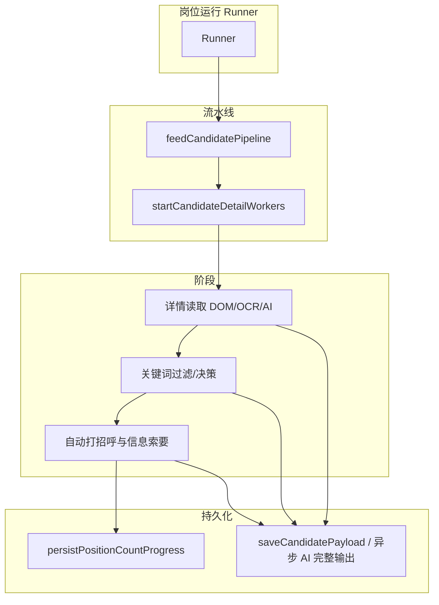
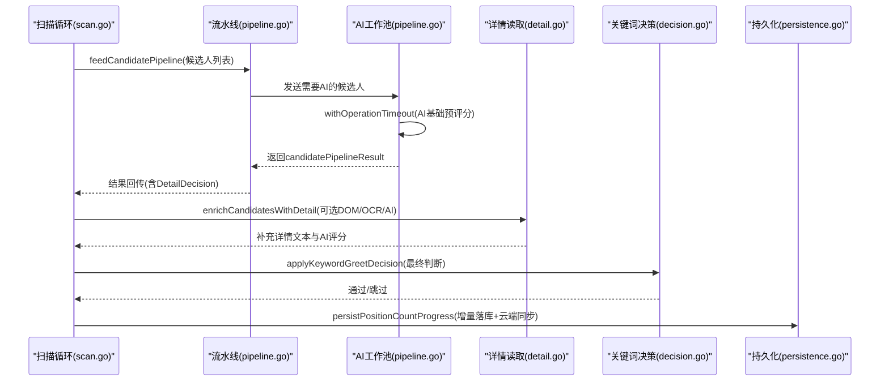
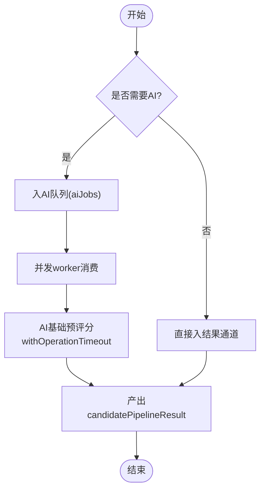
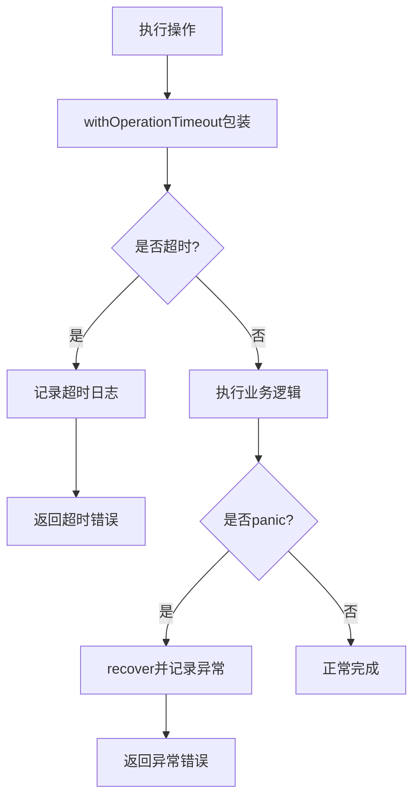
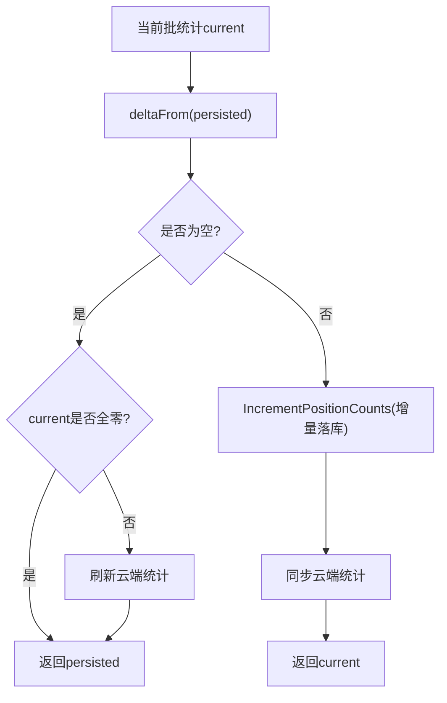
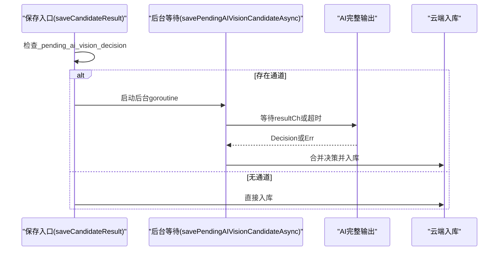
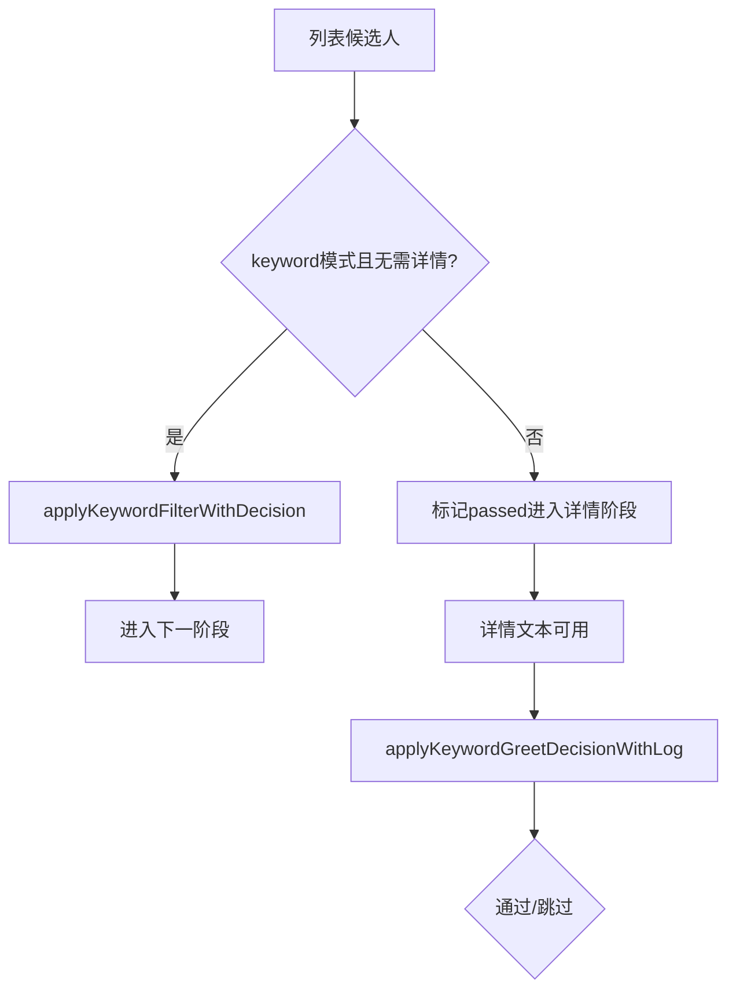
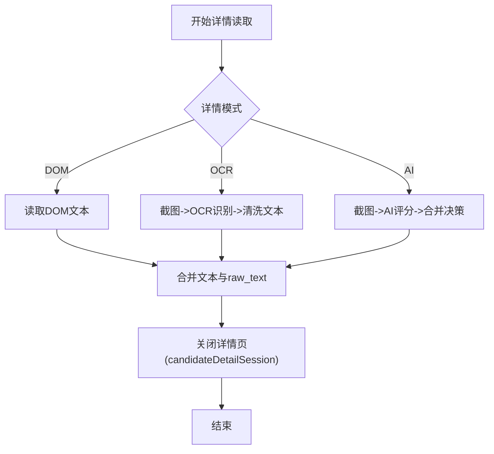
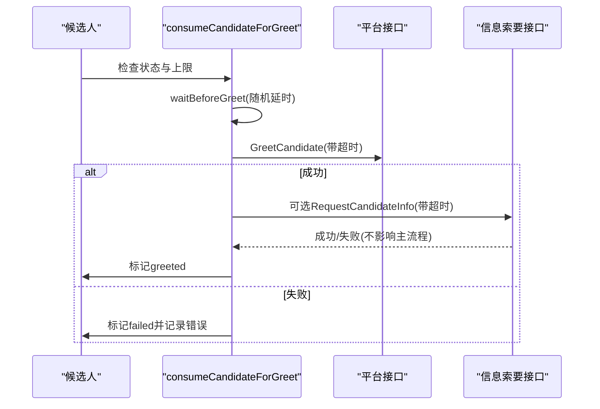
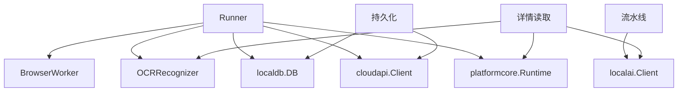

# 执行管道

<cite>
**本文引用的文件**
- [pipeline.go](file://goodhr5/local-agent-go/internal/positionrunner/pipeline.go)
- [runner.go](file://goodhr5/local-agent-go/internal/positionrunner/runner.go)
- [detail.go](file://goodhr5/local-agent-go/internal/positionrunner/detail.go)
- [candidate.go](file://goodhr5/local-agent-go/internal/positionrunner/candidate.go)
- [persistence.go](file://goodhr5/local-agent-go/internal/positionrunner/persistence.go)
- [decision.go](file://goodhr5/local-agent-go/internal/positionrunner/decision.go)
- [scan.go](file://goodhr5/local-agent-go/internal/positionrunner/scan.go)
- [client.go](file://goodhr5/local-agent-go/internal/localai/client.go)
</cite>

## 目录
1. [简介](#简介)
2. [项目结构](#项目结构)
3. [核心组件](#核心组件)
4. [架构总览](#架构总览)
5. [详细组件分析](#详细组件分析)
6. [依赖关系分析](#依赖关系分析)
7. [性能与内存优化](#性能与内存优化)
8. [故障排查指南](#故障排查指南)
9. [结论](#结论)

## 简介
本文件面向候选人处理流水线的实现，系统性说明并行处理、错误处理、结果聚合、批量统计与增量更新机制。重点覆盖以下数据结构与流程：
- candidatePipelineResult：单个候选人的流水线处理结果
- pendingAIDecisionResult：异步等待完整 AI 输出的结果
- batchProcessResult：一批候选人的统计结果及增量计算
并解释筛选、详情读取（DOM/OCR/AI）、AI 匹配、自动打招呼等阶段的实现与交互。同时给出超时控制、并发度控制、内存管理与重试策略等关键技术点。

## 项目结构
候选人处理流水线位于本地岗位运行模块 positionrunner，按职责拆分为多个文件：
- pipeline.go：流水线编排、并发工作池、AI 客户端创建、操作超时封装
- runner.go：常量、统计结构体、工具函数、全局运行时配置
- detail.go：候选人详情读取、截图 OCR、AI 图片详情评分、详情关闭管理
- candidate.go：打招呼执行、信息索要、休息模拟、关键词初筛
- persistence.go：统计增量持久化、云端同步、异步 AI 完整输出入库
- decision.go：关键词过滤与最终打招呼决策
- scan.go：扫描页内候选人、调用流水线、保存结果、统计落库
- localai/client.go：AI 评分接口（基础预评分、详情评分）

图表来源
- [pipeline.go:49-116](file://goodhr5/local-agent-go/internal/positionrunner/pipeline.go#L49-L116)
- [detail.go:88-120](file://goodhr5/local-agent-go/internal/positionrunner/detail.go#L88-L120)
- [candidate.go:16-76](file://goodhr5/local-agent-go/internal/positionrunner/candidate.go#L16-L76)
- [persistence.go:49-84](file://goodhr5/local-agent-go/internal/positionrunner/persistence.go#L49-L84)
- [scan.go:275-435](file://goodhr5/local-agent-go/internal/positionrunner/scan.go#L275-L435)

章节来源
- [pipeline.go:1-150](file://goodhr5/local-agent-go/internal/positionrunner/pipeline.go#L1-L150)
- [runner.go:243-283](file://goodhr5/local-agent-go/internal/positionrunner/runner.go#L243-L283)
- [detail.go:1-120](file://goodhr5/local-agent-go/internal/positionrunner/detail.go#L1-L120)
- [candidate.go:16-76](file://goodhr5/local-agent-go/internal/positionrunner/candidate.go#L16-L76)
- [persistence.go:49-169](file://goodhr5/local-agent-go/internal/positionrunner/persistence.go#L49-L169)
- [scan.go:275-435](file://goodhr5/local-agent-go/internal/positionrunner/scan.go#L275-L435)

## 核心组件
- 批量统计 batchProcessResult：包含 Scanned、Saved、Skipped、Greeted、Failed；提供 deltaFrom 计算非负增量与 empty 判断是否可跳过落库。
- 异步 AI 结果 pendingAIDecisionResult：承载完整 AI 输出或错误，用于后台等待后合并到候选人数据并入库。
- 单候选人结果 candidatePipelineResult：携带 Index、Candidate、Skipped、Err、DetailDecision，贯穿流水线并发处理。
- 关键词匹配状态 keywordMatchState：记录关键词、排除词、命中情况、文本与 And 模式，用于列表阶段与详情阶段决策。

章节来源
- [runner.go:243-293](file://goodhr5/local-agent-go/internal/positionrunner/runner.go#L243-L293)
- [decision.go:321-341](file://goodhr5/local-agent-go/internal/positionrunner/decision.go#L321-L341)

## 架构总览
候选人处理流水线采用“生产者-消费者”的通道模型：
- feedCandidatePipeline：按页面顺序将候选人送入 AI 队列或直接进入结果通道
- startCandidateDetailWorkers：启动固定数量的 worker 并发消费 AI 队列，对每个候选人进行基础预评分
- withOperationTimeout：为关键操作加超时、异常捕获与耗时日志
- 详情读取 enrichCandidatesWithDetail：支持 DOM/OCR/AI 三种模式，必要时开启后台滚动与截图识别
- 关键词过滤与最终决策：在列表阶段做初步过滤，在详情阶段做最终判断
- 自动打招呼与信息索要：带重试、随机延时、上限控制
- 统计持久化与云端同步：基于 persistPositionCountProgress 仅写入增量，避免重复记账

图表来源
- [pipeline.go:49-116](file://goodhr5/local-agent-go/internal/positionrunner/pipeline.go#L49-L116)
- [detail.go:88-120](file://goodhr5/local-agent-go/internal/positionrunner/detail.go#L88-L120)
- [decision.go:343-362](file://goodhr5/local-agent-go/internal/positionrunner/decision.go#L343-L362)
- [persistence.go:49-70](file://goodhr5/local-agent-go/internal/positionrunner/persistence.go#L49-L70)
- [scan.go:275-435](file://goodhr5/local-agent-go/internal/positionrunner/scan.go#L275-L435)

## 详细组件分析

### 并行处理与流水线编排
- 并发度控制：candidatePipelineConcurrency 根据批次大小动态决定并发数，默认上限为 defaultCandidatePipelineConcurrency
- 工作池：startCandidateDetailWorkers 启动 workerCount 个 goroutine，从 aiJobs 通道消费候选人，调用 scoreCandidateForDetail 完成基础预评分
- 输入供给：feedCandidatePipeline 按顺序投递，若不需要 AI 或候选人状态不允许继续，则直接放入 resultCh
- 超时封装：withOperationTimeout 为每个操作设置超时、记录耗时、捕获 panic 和上下文取消

图表来源
- [pipeline.go:49-116](file://goodhr5/local-agent-go/internal/positionrunner/pipeline.go#L49-L116)
- [pipeline.go:14-47](file://goodhr5/local-agent-go/internal/positionrunner/pipeline.go#L14-L47)
- [runner.go:133-143](file://goodhr5/local-agent-go/internal/positionrunner/runner.go#L133-L143)

章节来源
- [pipeline.go:14-116](file://goodhr5/local-agent-go/internal/positionrunner/pipeline.go#L14-L116)
- [runner.go:133-143](file://goodhr5/local-agent-go/internal/positionrunner/runner.go#L133-L143)

### 错误处理与超时控制
- 操作级超时：withOperationTimeout 统一封装各阶段操作的超时、异常捕获与日志
- 上下文取消：sleepWithContext 支持被 ctx.Done 中断，避免阻塞
- 浏览器/平台错误分类：detail.go 中区分致命错误与非致命错误，必要时中止运行或继续后续候选人
- 重试机制：tryGreet 支持多次重试与间隔等待

图表来源
- [pipeline.go:14-47](file://goodhr5/local-agent-go/internal/positionrunner/pipeline.go#L14-L47)
- [runner.go:295-309](file://goodhr5/local-agent-go/internal/positionrunner/runner.go#L295-L309)
- [candidate.go:111-135](file://goodhr5/local-agent-go/internal/positionrunner/candidate.go#L111-L135)

章节来源
- [pipeline.go:14-47](file://goodhr5/local-agent-go/internal/positionrunner/pipeline.go#L14-L47)
- [runner.go:295-309](file://goodhr5/local-agent-go/internal/positionrunner/runner.go#L295-L309)
- [candidate.go:111-135](file://goodhr5/local-agent-go/internal/positionrunner/candidate.go#L111-L135)

### 结果聚合与批量统计
- batchProcessResult：维护扫描、保存、跳过、打招呼、失败计数
- 增量计算：deltaFrom 计算当前统计相对已落库统计的非负增量，避免重复记账
- 持久化：persistPositionCountProgress 仅在存在增量时写入数据库并同步云端；若无增量但 current 非空，则刷新云端统计
- 云端同步：syncPositionCounts 与 syncProcessedResumeCount 分别同步岗位运行统计与已处理简历数

图表来源
- [runner.go:252-268](file://goodhr5/local-agent-go/internal/positionrunner/runner.go#L252-L268)
- [persistence.go:49-70](file://goodhr5/local-agent-go/internal/positionrunner/persistence.go#L49-L70)

章节来源
- [runner.go:243-268](file://goodhr5/local-agent-go/internal/positionrunner/runner.go#L243-L268)
- [persistence.go:49-70](file://goodhr5/local-agent-go/internal/positionrunner/persistence.go#L49-L70)

### 异步 AI 决策处理（pendingAIDecisionResult）
- 场景：当详情模式为 AI 且需要完整图片详情输出时，先快速返回部分结果，后台等待完整 AI 输出
- 机制：savePendingAIVisionCandidateAsync 检测候选人数据中的 _pending_ai_vision_decision 通道，后台 goroutine 等待结果或超时，合并决策并入库
- 超时保护：pendingAIVisionOutputTimeout 限制等待时长，避免无限挂起

图表来源
- [persistence.go:72-154](file://goodhr5/local-agent-go/internal/positionrunner/persistence.go#L72-L154)
- [runner.go:270-283](file://goodhr5/local-agent-go/internal/positionrunner/runner.go#L270-L283)

章节来源
- [persistence.go:72-154](file://goodhr5/local-agent-go/internal/positionrunner/persistence.go#L72-L154)
- [runner.go:270-283](file://goodhr5/local-agent-go/internal/positionrunner/runner.go#L270-L283)

### 候选人筛选与关键词决策
- 列表阶段：prepareCandidatesForFirstStage 在 keyword 模式且无需详情时直接应用关键词过滤；否则标记 passed 进入下一阶段
- 详情阶段：applyKeywordGreetDecisionWithLog 使用详情文本再次判断，排除命中排除词或未满足 And 模式的关键词集合
- 可视化：updateKeywordAnalysis 将匹配状态推送至控制台置顶小窗

图表来源
- [candidate.go:299-324](file://goodhr5/local-agent-go/internal/positionrunner/candidate.go#L299-L324)
- [decision.go:343-362](file://goodhr5/local-agent-go/internal/positionrunner/decision.go#L343-L362)
- [decision.go:444-492](file://goodhr5/local-agent-go/internal/positionrunner/decision.go#L444-L492)

章节来源
- [candidate.go:299-324](file://goodhr5/local-agent-go/internal/positionrunner/candidate.go#L299-L324)
- [decision.go:343-362](file://goodhr5/local-agent-go/internal/positionrunner/decision.go#L343-L362)
- [decision.go:444-492](file://goodhr5/local-agent-go/internal/positionrunner/decision.go#L444-L492)

### 简历解析与详情读取（DOM/OCR/AI）
- DOM 模式：直接获取详情文本
- OCR 模式：截图后调用本地 OCR 识别，清洗文本并合并
- AI 模式：截图后调用 AI 图片详情评分，决定是否打招呼，并合并结构化字段与使用量信息
- 详情关闭：candidateDetailSession 确保唯一关闭动作，异常路径也会尝试关闭详情页

图表来源
- [detail.go:88-120](file://goodhr5/local-agent-go/internal/positionrunner/detail.go#L88-L120)
- [detail.go:122-279](file://goodhr5/local-agent-go/internal/positionrunner/detail.go#L122-L279)
- [detail.go:17-39](file://goodhr5/local-agent-go/internal/positionrunner/detail.go#L17-L39)

章节来源
- [detail.go:88-279](file://goodhr5/local-agent-go/internal/positionrunner/detail.go#L88-L279)
- [detail.go:17-39](file://goodhr5/local-agent-go/internal/positionrunner/detail.go#L17-L39)

### 自动打招呼与信息索要
- 条件：状态为 passed/ai_passed/detail_fetched，且未达到岗位运行打招呼上限
- 行为：等待前延时、调用平台打招呼接口、可选索要信息（电话/微信/简历），成功则标记 greeted
- 重试：tryGreet 支持多次重试与间隔等待
- 声音提示：EnableSound 时播放成功提示音

图表来源
- [candidate.go:16-76](file://goodhr5/local-agent-go/internal/positionrunner/candidate.go#L16-L76)
- [candidate.go:111-135](file://goodhr5/local-agent-go/internal/positionrunner/candidate.go#L111-L135)

章节来源
- [candidate.go:16-76](file://goodhr5/local-agent-go/internal/positionrunner/candidate.go#L16-L76)
- [candidate.go:111-135](file://goodhr5/local-agent-go/internal/positionrunner/candidate.go#L111-L135)

### 扫描循环与结果保存
- 扫描循环：scan.go 中遍历候选人，逐个处理，累计 batchResult 与 totalResult
- 保存条件：shouldSaveCandidateResult 判断状态是否有效才保存
- 超时处理：候选人处理总超时时标记 failed 并记录错误
- 统计落库：flushPositionCounts 调用 persistPositionCountProgress 写入增量

章节来源
- [scan.go:275-435](file://goodhr5/local-agent-go/internal/positionrunner/scan.go#L275-L435)

## 依赖关系分析
- Runner 依赖 BrowserWorker、OCRRecognizer、localdb、cloudapi、platformcore、power 等能力
- 流水线依赖 AI 客户端（localai.Client）与平台运行时（platformcore.Runtime）
- 详情读取依赖平台详情接口与 OCR/AI 服务
- 持久化依赖本地数据库与云端 API

图表来源
- [runner.go:71-86](file://goodhr5/local-agent-go/internal/positionrunner/runner.go#L71-L86)
- [pipeline.go:118-131](file://goodhr5/local-agent-go/internal/positionrunner/pipeline.go#L118-L131)
- [detail.go:88-120](file://goodhr5/local-agent-go/internal/positionrunner/detail.go#L88-L120)
- [persistence.go:28-70](file://goodhr5/local-agent-go/internal/positionrunner/persistence.go#L28-L70)

章节来源
- [runner.go:71-86](file://goodhr5/local-agent-go/internal/positionrunner/runner.go#L71-L86)
- [pipeline.go:118-131](file://goodhr5/local-agent-go/internal/positionrunner/pipeline.go#L118-L131)
- [detail.go:88-120](file://goodhr5/local-agent-go/internal/positionrunner/detail.go#L88-L120)
- [persistence.go:28-70](file://goodhr5/local-agent-go/internal/positionrunner/persistence.go#L28-L70)

## 性能与内存优化
- 并发度控制：candidatePipelineConcurrency 限制最大并发，避免资源争用
- 超时控制：统一 via withOperationTimeout，防止长尾任务拖垮整体吞吐
- 增量持久化：deltaFrom 仅写入新增计数，减少数据库写放大
- 异步处理：pendingAIVisionCandidateAsync 后台等待完整 AI 输出，不阻塞主流程
- 随机延时：scroll、list/detail/greet 前随机等待，降低平台风控风险
- 内存管理：通道限流（aiJobs/resultCh）、goroutine 数量可控、避免持有大对象引用
- 重试与退避：tryGreet 支持有限重试与短间隔等待，提升鲁棒性

[本节为通用指导，不直接分析具体文件]

## 故障排查指南
- 超时问题：检查 withOperationTimeout 包裹的操作与对应超时配置（如 greetActionTimeout、aiDetailTimeout）
- 浏览器异常：detail.go 中 isBrowserClosedPositionError 会中止运行；确认浏览器进程状态
- OCR/AI 不可用：recognizeDetailScreenshot 与 AI 评分失败会记录警告；检查 OCR 组件与 AI 配置
- 统计重复：persistPositionCountProgress 依赖 persisted 跟踪已落库值；确保传入正确的 persisted
- 打招呼失败：tryGreet 重试次数与间隔可调；查看平台接口返回与错误类型

章节来源
- [pipeline.go:14-47](file://goodhr5/local-agent-go/internal/positionrunner/pipeline.go#L14-L47)
- [detail.go:122-168](file://goodhr5/local-agent-go/internal/positionrunner/detail.go#L122-L168)
- [persistence.go:49-70](file://goodhr5/local-agent-go/internal/positionrunner/persistence.go#L49-L70)
- [candidate.go:111-135](file://goodhr5/local-agent-go/internal/positionrunner/candidate.go#L111-L135)

## 结论
候选人处理流水线通过通道与并发工作池实现高吞吐与可控资源占用，结合统一的超时封装与错误分类保障稳定性。批量统计采用增量持久化避免重复记账，异步 AI 完整输出机制在不阻塞主流程的前提下保证数据完整性。关键词过滤分两阶段执行，兼顾效率与准确性。自动打招呼与信息索要在重试、延时与上限控制下稳健运行。整体设计在性能、可靠性与可观测性之间取得良好平衡。