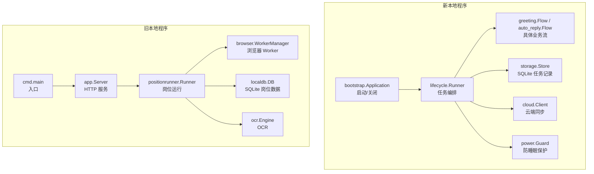
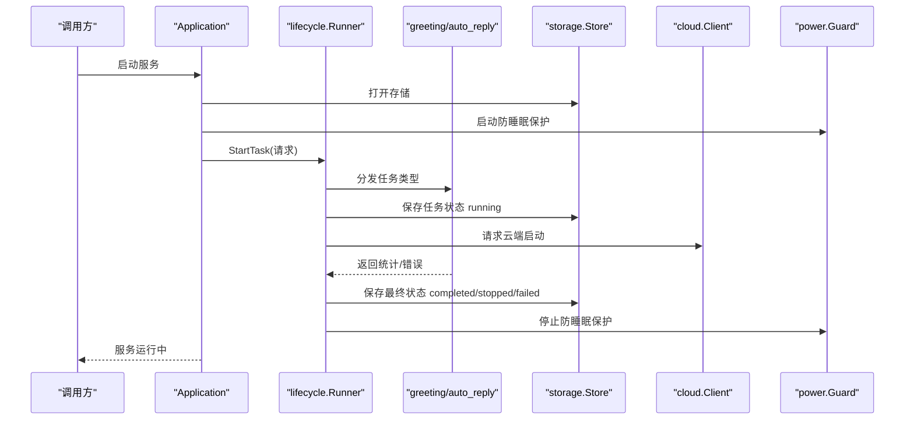
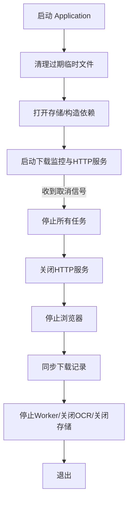
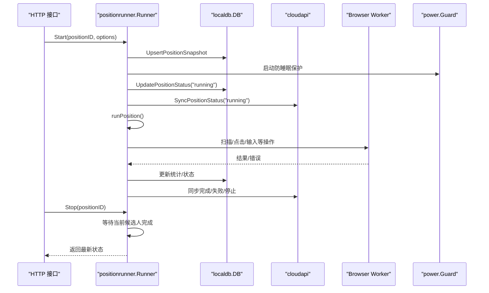
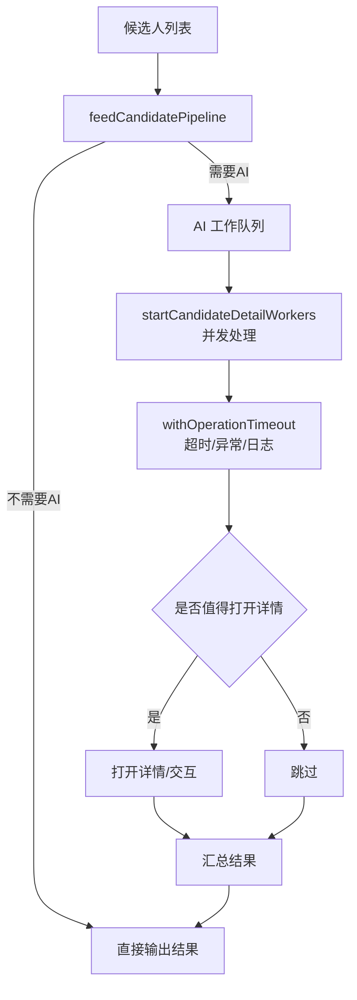
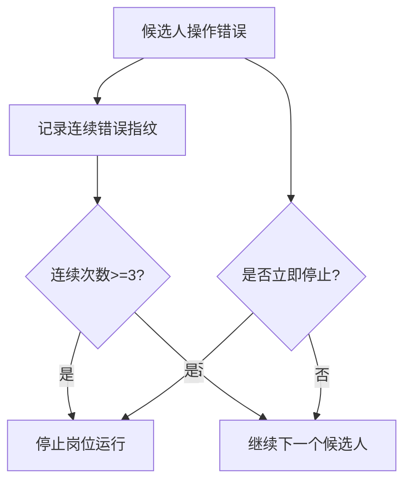
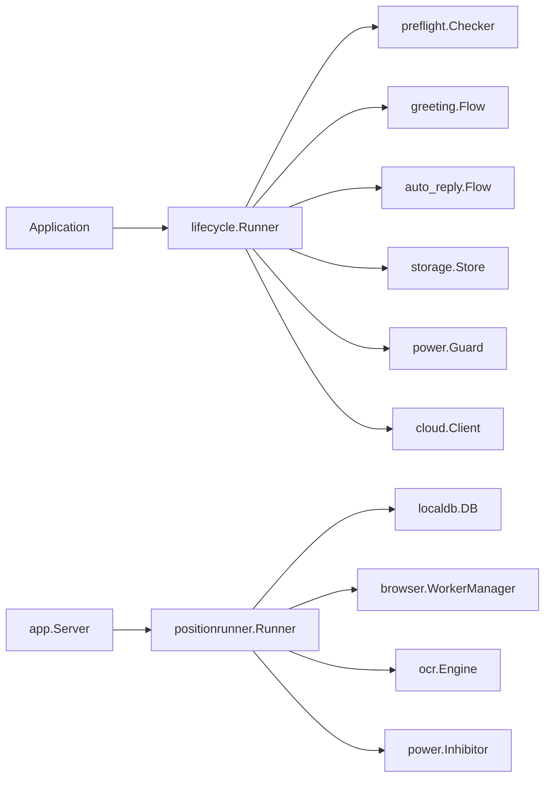

# 生命周期管理

<cite>
**本文引用的文件**
- [application.go](file://goodhr5/local-agent-go/internal/bootstrap/application.go)
- [runner.go](file://goodhr5/local-agent-go/internal/flow/lifecycle/runner.go)
- [main.go](file://goodhr5/local-agent-go/cmd/goodhr-local-agent/main.go)
- [server.go](file://goodhr5/local-agent-go/internal/app/server.go)
- [lifecycle.go](file://goodhr5/local-agent-go/internal/positionrunner/lifecycle.go)
- [runner.go](file://goodhr5/local-agent-go/internal/positionrunner/runner.go)
- [pipeline.go](file://goodhr5/local-agent-go/internal/positionrunner/pipeline.go)
- [error_policy.go](file://goodhr5/local-agent-go/internal/positionrunner/error_policy.go)
- [inhibitor.go](file://goodhr5/local-agent-go/internal/power/inhibitor.go)
</cite>

## 目录
1. [简介](#简介)
2. [项目结构](#项目结构)
3. [核心组件](#核心组件)
4. [架构总览](#架构总览)
5. [详细组件分析](#详细组件分析)
6. [依赖关系分析](#依赖关系分析)
7. [性能考量](#性能考量)
8. [故障排查指南](#故障排查指南)
9. [结论](#结论)
10. [附录](#附录)

## 简介
本文件聚焦 GoodHR 本地代理的生命周期管理，覆盖任务从启动到结束的完整生命周期：初始化、准备、执行、清理；上下文与取消机制；优雅关闭流程；状态转换、错误恢复与重试策略；资源清理、文件操作、数据库同步；异常处理策略、监控指标与健康检查。文档同时覆盖两套实现：新版 Go 程序（local-agent-go）的任务编排器 Runner，以及旧版 Go 程序（local-agent-go）的岗位运行 Runner。

## 项目结构
- 新本地程序（local-agent-go）
  - 引导与应用装配：负责清理临时文件、打开存储、启动浏览器进程、构建运行时管理器、云客户端、OCR、通知、预检查、问候与自动回复流程、下载监控、更新器、HTTP 服务，并在退出时按顺序关闭各资源。
  - 任务生命周期 Runner：统一入口 StartTask，完成预检查、获取唯一浏览器会话、持久化任务、请求云端启动、开启防睡眠保护、后台运行并兜底 panic，最终保存任务状态并释放资源。
- 旧本地程序（local-agent-go）
  - 主程序入口：解析参数、可选重启旧实例、初始化配置与日志、创建 HTTP 服务并启动。
  - HTTP 服务：注册健康检查、运行时安装/确保、浏览器与页面控制、岗位运行接口等路由。
  - 岗位运行 Runner：Start/Stop/StopAll、进度与状态、防睡眠保护、休眠恢复检测、失败通知、并发流水线与超时控制、错误策略。



**图表来源**
- [application.go:48-108](file://goodhr5/local-agent-go/internal/bootstrap/application.go#L48-L108)
- [runner.go:70-140](file://goodhr5/local-agent-go/internal/flow/lifecycle/runner.go#L70-L140)
- [server.go:87-168](file://goodhr5/local-agent-go/internal/app/server.go#L87-L168)
- [lifecycle.go:15-79](file://goodhr5/local-agent-go/internal/positionrunner/lifecycle.go#L15-L79)

**章节来源**
- [application.go:48-181](file://goodhr5/local-agent-go/internal/bootstrap/application.go#L48-L181)
- [runner.go:70-140](file://goodhr5/local-agent-go/internal/flow/lifecycle/runner.go#L70-L140)
- [main.go:18-62](file://goodhr5/local-agent-go/cmd/goodhr-local-agent/main.go#L18-L62)
- [server.go:87-168](file://goodhr5/local-agent-go/internal/app/server.go#L87-L168)

## 核心组件
- Application（新）：组装依赖、启动下载监控与 HTTP 服务、在上下文取消后按序停止任务、关闭浏览器、同步下载记录、停止 Worker、关闭 OCR 和 SQLite。
- lifecycle.Runner（新）：StartTask 预检查、锁、持久化、云端启动、防睡眠保护、后台 run、统一 finish 收尾、StopTask/StopAll、休眠恢复中断。
- positionrunner.Runner（旧）：Start/Stop/StopAll、runPosition 主循环、进度与状态、防睡眠保护、休眠恢复检测、失败通知、并发流水线、错误策略。
- app.Server（旧）：健康检查、运行时安装/确保、浏览器与页面控制、岗位运行接口。
- power.Inhibitor/Guard：跨平台防睡眠保护接口与实现。

**章节来源**
- [application.go:48-181](file://goodhr5/local-agent-go/internal/bootstrap/application.go#L48-L181)
- [runner.go:70-140](file://goodhr5/local-agent-go/internal/flow/lifecycle/runner.go#L70-L140)
- [lifecycle.go:15-193](file://goodhr5/local-agent-go/internal/positionrunner/lifecycle.go#L15-L193)
- [server.go:170-191](file://goodhr5/local-agent-go/internal/app/server.go#L170-L191)
- [inhibitor.go:1-15](file://goodhr5/local-agent-go/internal/power/inhibitor.go#L1-L15)

## 架构总览
新程序的“应用级”生命周期由 bootstrap.Application 管理，内部通过 lifecycle.Runner 调度 greeting/auto_reply 两类任务，使用 storage.Store 持久化任务，cloud.Client 同步状态，power.Guard 防止系统休眠，notification.Notifier 播放提示音或发送通知。旧程序的“岗位级”生命周期由 positionrunner.Runner 管理，结合 browser.WorkerManager 驱动浏览器，localdb.DB 持久化岗位数据，ocr.Engine 提供识别能力，并通过 cloudapi 同步云端。



**图表来源**
- [application.go:128-181](file://goodhr5/local-agent-go/internal/bootstrap/application.go#L128-L181)
- [runner.go:80-140](file://goodhr5/local-agent-go/internal/flow/lifecycle/runner.go#L80-L140)
- [runner.go:243-312](file://goodhr5/local-agent-go/internal/flow/lifecycle/runner.go#L243-L312)

**章节来源**
- [application.go:128-181](file://goodhr5/local-agent-go/internal/bootstrap/application.go#L128-L181)
- [runner.go:80-140](file://goodhr5/local-agent-go/internal/flow/lifecycle/runner.go#L80-L140)
- [runner.go:243-312](file://goodhr5/local-agent-go/internal/flow/lifecycle/runner.go#L243-L312)

## 详细组件分析

### 新程序：Application 生命周期
- 初始化阶段
  - 清理过期临时文件（截图、下载、更新包）。
  - 打开 SQLite 存储、构造浏览器客户端与进程、运行时管理器、云客户端、设备 ID、AI/OCR 客户端、配置文件管理器、电源保护、通知器、任务日志器。
  - 构建预检查器、问候流程、自动回复流程、下载监控、应用更新器、HTTP 服务。
- 运行阶段
  - 启动下载监控协程。
  - 启动 HTTP 服务。
  - 可选自动打开控制台。
- 关闭阶段（上下文取消或错误）
  - 停止所有任务（带超时）。
  - 关闭 HTTP 服务（带超时）。
  - 停止浏览器（带超时）。
  - 最后同步下载记录（带超时）。
  - 停止 Worker、关闭 OCR、关闭 SQLite。



**图表来源**
- [application.go:111-181](file://goodhr5/local-agent-go/internal/bootstrap/application.go#L111-L181)

**章节来源**
- [application.go:111-181](file://goodhr5/local-agent-go/internal/bootstrap/application.go#L111-L181)

### 新程序：lifecycle.Runner 任务编排
- 启动前检查
  - 执行预检查步骤，失败则保存失败状态并通知。
- 运行锁与会话
  - 保证同一时间仅一个任务占用唯一浏览器会话。
  - 获取 Profile 锁，避免多任务争用。
- 持久化与云端同步
  - 保存任务为 running，请求云端启动。
- 后台执行
  - 根据 task_type 分发 greeting 或 auto_reply 流程。
  - 捕获 panic 并转为任务失败。
- 结束收尾
  - 根据错误和用户停止标记决定最终状态（completed/stopped/failed）。
  - 保存任务、释放 Profile、停止防睡眠保护、关闭 done channel。
- 停止与休眠恢复
  - StopTask/StopAll 安全停止，等待当前候选人处理完再停。
  - monitorSleepResume 检测时间断层，设置中断原因并取消任务。

```mermaid
classDiagram
class Runner {
+StartTask(ctx, request) StartResult
+StopTask(ctx, taskID) TaskRun
+StopAll(ctx) void
+TaskStatus(ctx, taskID) TaskSnapshot
+PositionStatus(ctx, positionID) TaskSnapshot
-run(ctx, active) void
-finish(active, stats, err) void
-monitorSleepResume(ctx, active) void
}
class ActiveTask {
+prepared PreparedTask
+state TaskRun
+cancel CancelFunc
+done chan struct{}
+stop chan struct{}
+stopped bool
+interrupt error
}
Runner --> ActiveTask : "管理多个"
```

**图表来源**
- [runner.go:44-78](file://goodhr5/local-agent-go/internal/flow/lifecycle/runner.go#L44-L78)
- [runner.go:80-140](file://goodhr5/local-agent-go/internal/flow/lifecycle/runner.go#L80-L140)
- [runner.go:165-241](file://goodhr5/local-agent-go/internal/flow/lifecycle/runner.go#L165-L241)
- [runner.go:243-312](file://goodhr5/local-agent-go/internal/flow/lifecycle/runner.go#L243-L312)
- [runner.go:314-349](file://goodhr5/local-agent-go/internal/flow/lifecycle/runner.go#L314-L349)

**章节来源**
- [runner.go:80-140](file://goodhr5/local-agent-go/internal/flow/lifecycle/runner.go#L80-L140)
- [runner.go:165-241](file://goodhr5/local-agent-go/internal/flow/lifecycle/runner.go#L165-L241)
- [runner.go:243-312](file://goodhr5/local-agent-go/internal/flow/lifecycle/runner.go#L243-L312)
- [runner.go:314-349](file://goodhr5/local-agent-go/internal/flow/lifecycle/runner.go#L314-L349)

### 旧程序：positionrunner.Runner 岗位运行
- 启动
  - 校验参数、拉取云端岗位快照、写入本地、创建运行锁、开启防睡眠保护、构建运行时快照、更新状态为 running、同步云端、后台执行 runPosition。
- 执行
  - 扫描一次（scanOnce），处理候选人详情、打招呼、跳过、失败计数。
  - 支持用户停止：等待当前候选人处理完成后再停。
  - 支持浏览器关闭、认证过期等错误分支。
- 停止
  - Stop/StopAll 标记用户停止、写状态、必要时强制取消。
- 进度与状态
  - Progress/Status/IsRunning 提供查询。
- 防睡眠与休眠恢复
  - ensurePowerProtection 启动防睡眠保护。
  - monitorSleepResume 检测时间断层，取消运行中的岗位运行。
- 失败通知
  - failStart 记录失败、播放提示音、发送邮件通知。



**图表来源**
- [lifecycle.go:15-79](file://goodhr5/local-agent-go/internal/positionrunner/lifecycle.go#L15-L79)
- [lifecycle.go:81-139](file://goodhr5/local-agent-go/internal/positionrunner/lifecycle.go#L81-L139)
- [lifecycle.go:141-193](file://goodhr5/local-agent-go/internal/positionrunner/lifecycle.go#L141-L193)
- [lifecycle.go:370-459](file://goodhr5/local-agent-go/internal/positionrunner/lifecycle.go#L370-L459)

**章节来源**
- [lifecycle.go:15-193](file://goodhr5/local-agent-go/internal/positionrunner/lifecycle.go#L15-L193)
- [lifecycle.go:370-459](file://goodhr5/local-agent-go/internal/positionrunner/lifecycle.go#L370-L459)

### 旧程序：并发流水线与超时控制
- withOperationTimeout：为单个候选人的关键操作加超时、异常捕获与耗时日志。
- startCandidateDetailWorkers：并发处理池，对候选人进行 AI 预评分与决策。
- feedCandidatePipeline：将候选人送入 AI 队列或直通结果队列。
- pipelineAIClient：按需创建 AI 客户端，启用思考模式。



**图表来源**
- [pipeline.go:14-150](file://goodhr5/local-agent-go/internal/positionrunner/pipeline.go#L14-L150)

**章节来源**
- [pipeline.go:14-150](file://goodhr5/local-agent-go/internal/positionrunner/pipeline.go#L14-L150)

### 错误恢复与重试策略
- 候选人级错误
  - candidateOperationError 包装错误，consecutiveOperationErrorTracker 记录同一环节连续相同错误次数。
  - stopAfterCandidateOperationError：达到阈值（如连续 3 次）则停止整个岗位运行。
- 立即停止的错误
  - shouldStopPositionImmediately：包含位置级停止错误或浏览器已关闭错误。
- OCR 致命错误
  - isFatalOCRError：未配置、未安装、模型不完整、进程不可用等。
- 浏览器关闭错误
  - isBrowserClosedPositionError：关键字匹配判断。



**图表来源**
- [error_policy.go:15-119](file://goodhr5/local-agent-go/internal/positionrunner/error_policy.go#L15-L119)
- [lifecycle.go:338-359](file://goodhr5/local-agent-go/internal/positionrunner/lifecycle.go#L338-L359)

**章节来源**
- [error_policy.go:15-119](file://goodhr5/local-agent-go/internal/positionrunner/error_policy.go#L15-L119)
- [lifecycle.go:338-359](file://goodhr5/local-agent-go/internal/positionrunner/lifecycle.go#L338-L359)

### 上下文管理与取消机制
- 新程序
  - StartTask 使用 context.WithCancel 创建运行上下文，StopTask/StopAll 关闭 stop channel 并 cancel 上下文。
  - monitorSleepResume 检测到时间断层时设置 interrupt 并 cancel。
  - finish 统一根据 interrupted/canceled/auth expired 决定最终状态。
- 旧程序
  - Start 创建 runCtx，Stop/StopAll 标记用户停止并 cancel。
  - monitorSleepResume 检测时间断层后 cancel 运行中的岗位运行。
  - runPosition 对 context.Canceled 做分支处理，更新状态并同步云端。

**章节来源**
- [runner.go:80-140](file://goodhr5/local-agent-go/internal/flow/lifecycle/runner.go#L80-L140)
- [runner.go:165-241](file://goodhr5/local-agent-go/internal/flow/lifecycle/runner.go#L165-L241)
- [runner.go:314-349](file://goodhr5/local-agent-go/internal/flow/lifecycle/runner.go#L314-L349)
- [lifecycle.go:15-79](file://goodhr5/local-agent-go/internal/positionrunner/lifecycle.go#L15-L79)
- [lifecycle.go:141-193](file://goodhr5/local-agent-go/internal/positionrunner/lifecycle.go#L141-L193)
- [lifecycle.go:419-459](file://goodhr5/local-agent-go/internal/positionrunner/lifecycle.go#L419-L459)

### 优雅关闭流程
- 新程序
  - Run 在 ctx.Done 或 server 错误时触发关闭序列：StopAll（带超时）、Shutdown 服务器（带超时）、StopBrowser（带超时）、Sync 下载记录（带超时）、StopWorker、Close OCR、Close SQLite。
- 旧程序
  - Stop/StopAll 标记用户停止、写状态、必要时强制取消；runPosition 在 defer 中清理运行锁与 pending 详情关闭动作。

**章节来源**
- [application.go:128-181](file://goodhr5/local-agent-go/internal/bootstrap/application.go#L128-L181)
- [runner.go:221-241](file://goodhr5/local-agent-go/internal/flow/lifecycle/runner.go#L221-L241)
- [lifecycle.go:141-193](file://goodhr5/local-agent-go/internal/positionrunner/lifecycle.go#L141-L193)
- [lifecycle.go:573-624](file://goodhr5/local-agent-go/internal/positionrunner/lifecycle.go#L573-L624)

### 资源清理、文件操作、数据库同步
- 资源清理
  - 新程序：清理过期截图、下载、更新包；关闭浏览器、Worker、OCR、SQLite。
  - 旧程序：清理运行锁、pending 详情关闭动作。
- 文件操作
  - 新程序：清理临时文件、保存下载记录。
  - 旧程序：截图路径校验、本地图片识别限制。
- 数据库同步
  - 新程序：SaveTask 保存任务状态；notifyFinished 同步云端统计。
  - 旧程序：UpdatePositionStatus、ListPositionLogs、AddPositionLog、ClearPositionLogs、SyncPositionStatus/SyncSummary/SyncCompletedSummary。

**章节来源**
- [application.go:111-181](file://goodhr5/local-agent-go/internal/bootstrap/application.go#L111-L181)
- [runner.go:280-312](file://goodhr5/local-agent-go/internal/flow/lifecycle/runner.go#L280-L312)
- [server.go:374-406](file://goodhr5/local-agent-go/internal/app/server.go#L374-L406)
- [lifecycle.go:65-79](file://goodhr5/local-agent-go/internal/positionrunner/lifecycle.go#L65-L79)

### 异常处理策略
- 新程序
  - 统一兜住 panic，转为任务失败；finish 根据错误类型设置状态码与消息；logNotification 记录不影响最终状态的通知错误。
- 旧程序
  - withOperationTimeout 捕获异常与超时；error_policy 定义立即停止与连续错误停止；failStart 记录失败并通知。

**章节来源**
- [runner.go:243-278](file://goodhr5/local-agent-go/internal/flow/lifecycle/runner.go#L243-L278)
- [runner.go:280-312](file://goodhr5/local-agent-go/internal/flow/lifecycle/runner.go#L280-L312)
- [pipeline.go:14-47](file://goodhr5/local-agent-go/internal/positionrunner/pipeline.go#L14-L47)
- [error_policy.go:87-119](file://goodhr5/local-agent-go/internal/positionrunner/error_policy.go#L87-L119)
- [lifecycle.go:313-336](file://goodhr5/local-agent-go/internal/positionrunner/lifecycle.go#L313-L336)

### 监控指标收集与健康检查
- 健康检查
  - 旧程序 /health 返回版本、端口、目录、运行时状态、OCR 状态等。
- 指标收集
  - 新程序：finish 中统计 Processed/Succeeded/Skipped/Failed，并同步云端；lifecycle 记录步骤日志。
  - 旧程序：runPosition 记录扫描/打招呼/跳过/失败计数；Progress 提供阶段与消息。

**章节来源**
- [server.go:170-191](file://goodhr5/local-agent-go/internal/app/server.go#L170-L191)
- [runner.go:359-398](file://goodhr5/local-agent-go/internal/flow/lifecycle/runner.go#L359-L398)
- [lifecycle.go:125-139](file://goodhr5/local-agent-go/internal/positionrunner/lifecycle.go#L125-L139)

## 依赖关系分析
- 新程序
  - Application 依赖 lifecycle.Runner、runtime.Manager、browser client/process、storage.Store、downloadflow.Monitor、cloud.Client、device、updater、api.Server。
  - lifecycle.Runner 依赖 preflight.Checker、greeting/auto_reply Flow、storage.Store、profile.Manager、power.Guard、cloud.Client、notification.Notifier。
- 旧程序
  - app.Server 依赖 runtime.Manager、browser.WorkerManager、ocr.Engine、localdb.DB、positionrunner.Runner。
  - positionrunner.Runner 依赖 localdb.DB、browser.WorkerManager、ocr.Engine、power.Inhibitor、cloudapi。



**图表来源**
- [application.go:48-108](file://goodhr5/local-agent-go/internal/bootstrap/application.go#L48-L108)
- [runner.go:70-78](file://goodhr5/local-agent-go/internal/flow/lifecycle/runner.go#L70-L78)
- [server.go:45-63](file://goodhr5/local-agent-go/internal/app/server.go#L45-L63)
- [runner.go:71-86](file://goodhr5/local-agent-go/internal/positionrunner/runner.go#L71-L86)

**章节来源**
- [application.go:48-108](file://goodhr5/local-agent-go/internal/bootstrap/application.go#L48-L108)
- [runner.go:70-78](file://goodhr5/local-agent-go/internal/flow/lifecycle/runner.go#L70-L78)
- [server.go:45-63](file://goodhr5/local-agent-go/internal/app/server.go#L45-L63)
- [runner.go:71-86](file://goodhr5/local-agent-go/internal/positionrunner/runner.go#L71-L86)

## 性能考量
- 并发流水线：候选人详情页评分采用并发工作池，默认并发数可调，避免串行瓶颈。
- 超时控制：关键操作设置超时，防止长时间阻塞。
- 随机延时：模拟人工操作的滚动、停留、点击等延时范围随机化，降低被反爬检测风险。
- 防睡眠保护：运行期间阻止系统休眠，减少中断导致的失败。
- 资源关闭超时：服务器、浏览器、下载同步等关闭均设置超时，避免优雅关闭卡死。

[本节为通用指导，不直接分析具体文件]

## 故障排查指南
- 启动失败
  - 新程序：预检查失败会保存失败状态并通知；云端启动拒绝会记录错误码与消息。
  - 旧程序：Start 参数校验失败、云端拉取失败、数据库写入失败等均有明确日志与状态更新。
- 运行中停止
  - 新程序：StopTask/StopAll 安全停止，等待当前候选人处理完；休眠恢复会中断任务。
  - 旧程序：Stop/StopAll 标记用户停止，等待当前候选人完成；浏览器关闭会自动结束。
- 错误分类
  - 候选人级错误：连续相同错误达到阈值停止岗位运行。
  - 立即停止错误：位置级停止或浏览器关闭。
  - OCR 致命错误：组件未配置/未安装/模型不完整/进程不可用。
- 健康检查
  - 旧程序 /health 返回服务状态、版本、端口、目录、运行时与 OCR 状态，便于外部探针探测。

**章节来源**
- [runner.go:80-140](file://goodhr5/local-agent-go/internal/flow/lifecycle/runner.go#L80-L140)
- [runner.go:165-241](file://goodhr5/local-agent-go/internal/flow/lifecycle/runner.go#L165-L241)
- [lifecycle.go:141-193](file://goodhr5/local-agent-go/internal/positionrunner/lifecycle.go#L141-L193)
- [error_policy.go:87-119](file://goodhr5/local-agent-go/internal/positionrunner/error_policy.go#L87-L119)
- [server.go:170-191](file://goodhr5/local-agent-go/internal/app/server.go#L170-L191)

## 结论
GoodHR 本地代理通过分层生命周期管理实现了稳健的任务编排与资源治理：新程序以 Application 为中心，统一装配与优雅关闭；lifecycle.Runner 负责任务预检查、并发执行、状态持久化与云端同步；旧程序以 positionrunner.Runner 为核心，提供岗位运行的完整生命周期、并发流水线、错误策略与防睡眠保护。两者均强调上下文取消、优雅关闭、错误恢复与健康检查，确保在复杂环境下稳定运行。

[本节为总结性内容，不直接分析具体文件]

## 附录
- 关键常量与默认值
  - 扫描轮次、每轮最大项数、滚动距离、并发数、超时时间等默认值用于控制行为边界。
- 状态机
  - 任务状态：pending -> running -> completed/stopped/failed。
  - 岗位运行状态：pending -> running -> completed/stopped/failed。

[本节为补充信息，不直接分析具体文件]