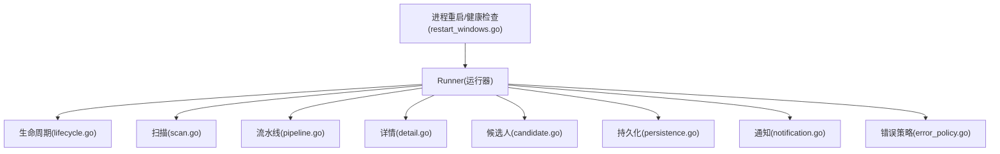
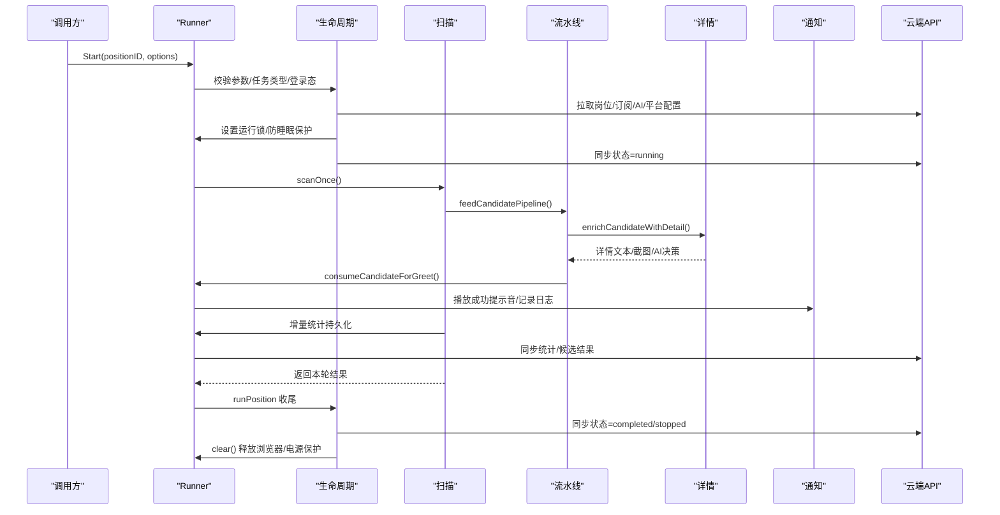
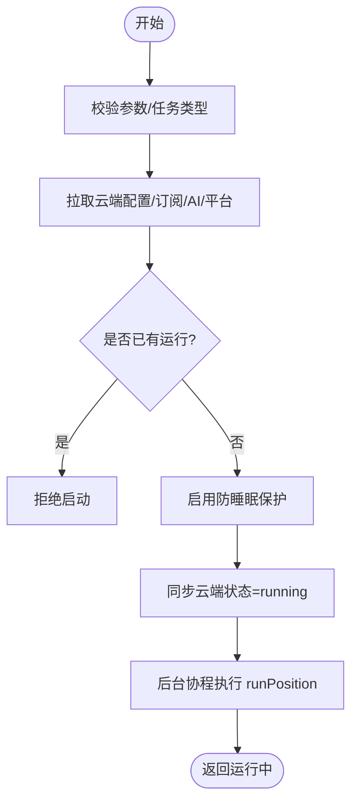
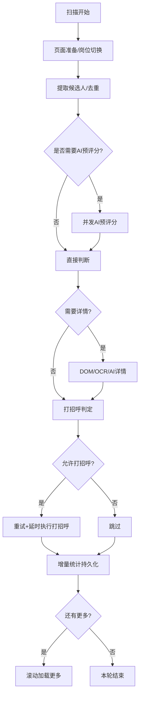
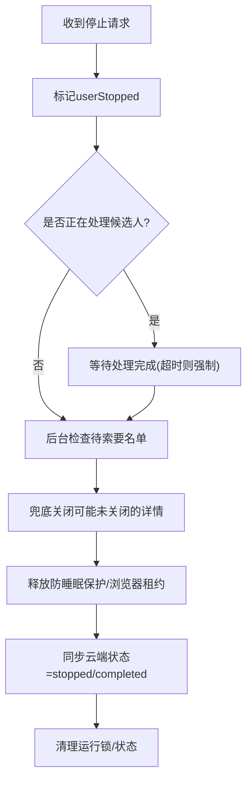
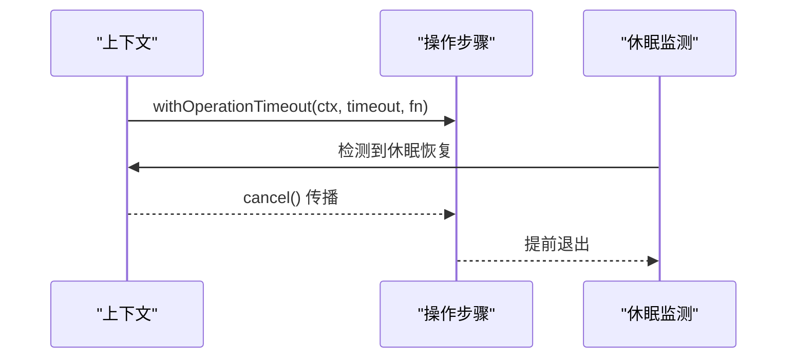
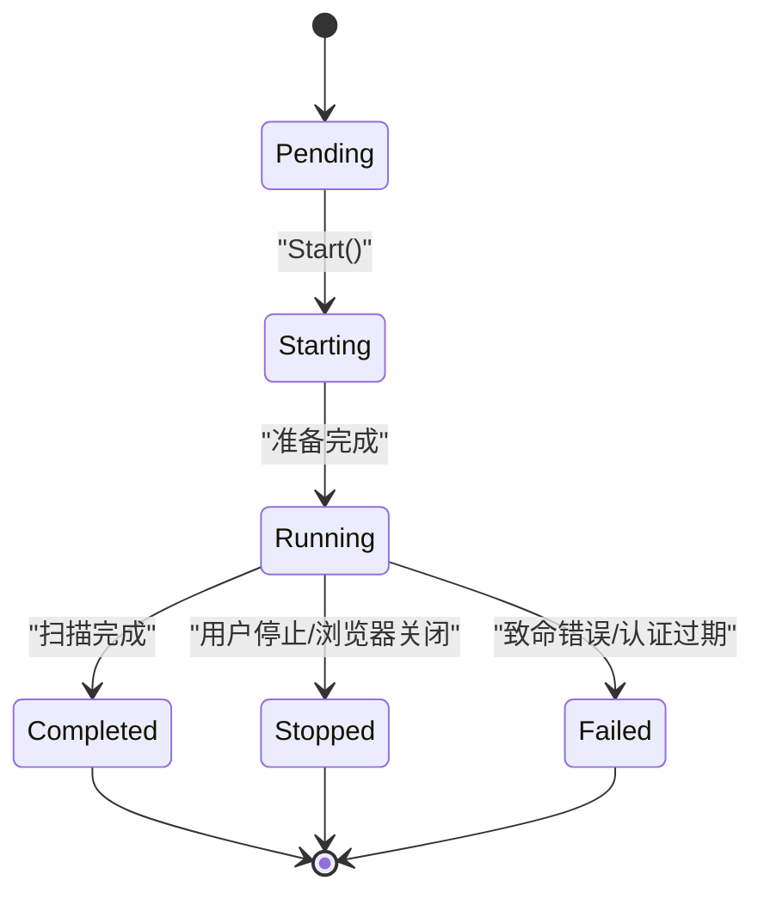
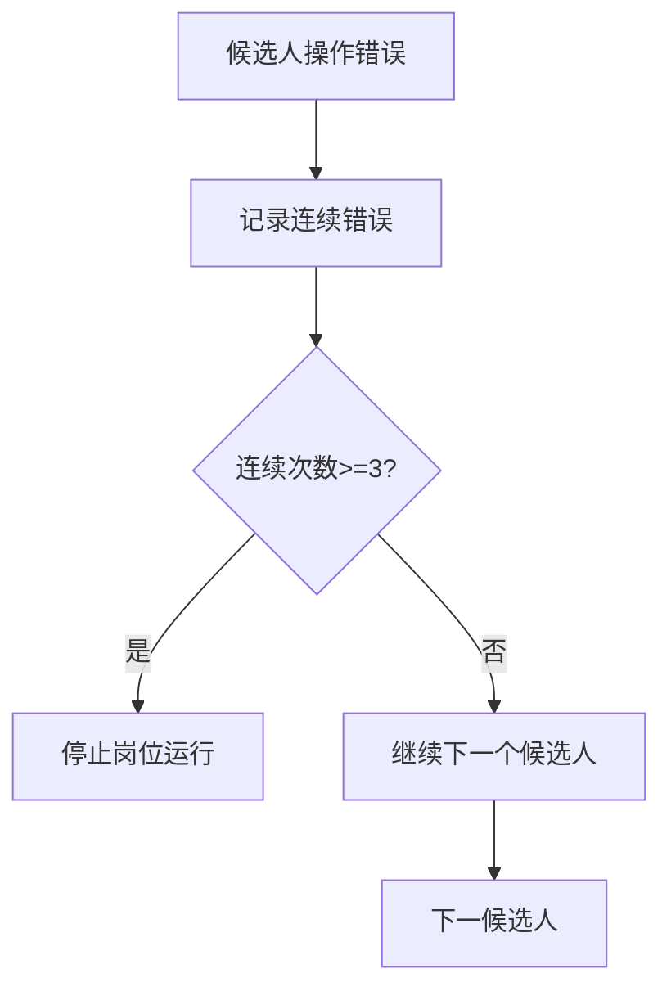
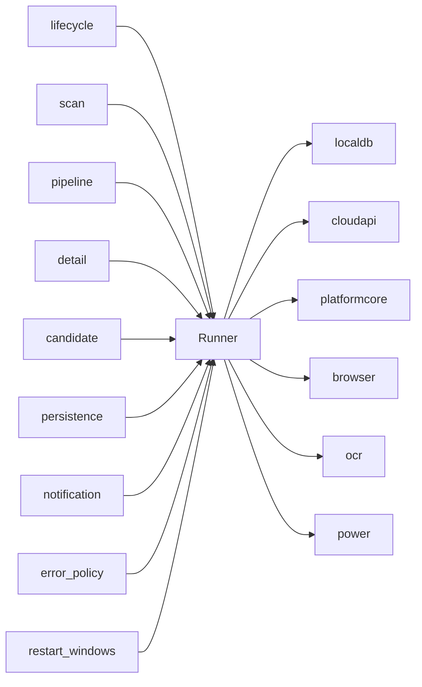

# 生命周期管理

<cite>
**本文引用的文件**
- [lifecycle.go](file://goodhr5/local-agent-go/internal/positionrunner/lifecycle.go)
- [runner.go](file://goodhr5/local-agent-go/internal/positionrunner/runner.go)
- [pipeline.go](file://goodhr5/local-agent-go/internal/positionrunner/pipeline.go)
- [scan.go](file://goodhr5/local-agent-go/internal/positionrunner/scan.go)
- [detail.go](file://goodhr5/local-agent-go/internal/positionrunner/detail.go)
- [candidate.go](file://goodhr5/local-agent-go/internal/positionrunner/candidate.go)
- [persistence.go](file://goodhr5/local-agent-go/internal/positionrunner/persistence.go)
- [notification.go](file://goodhr5/local-agent-go/internal/positionrunner/notification.go)
- [error_policy.go](file://goodhr5/local-agent-go/internal/positionrunner/error_policy.go)
- [restart_windows.go](file://goodhr5/local-agent-go/internal/process/restart_windows.go)
</cite>

## 目录
1. [简介](#简介)
2. [项目结构](#项目结构)
3. [核心组件](#核心组件)
4. [架构总览](#架构总览)
5. [详细组件分析](#详细组件分析)
6. [依赖关系分析](#依赖关系分析)
7. [性能考量](#性能考量)
8. [故障排查指南](#故障排查指南)
9. [结论](#结论)
10. [附录](#附录)

## 简介
本文件聚焦于本地岗位运行“生命周期管理”的完整实现，覆盖从启动、准备、执行到清理的全流程。重点说明上下文与取消机制、优雅关闭、任务状态转换、错误恢复与重试、资源清理（浏览器、详情页、防睡眠保护）、云端同步、通知与监控指标、健康检查等。目标是帮助读者在不深入代码细节的情况下，理解并维护该系统的稳定性与可观测性。

## 项目结构
本地岗位运行生命周期由 positionrunner 包承担，围绕 Runner 对象组织：
- 生命周期编排：启动、停止、状态查询、进度更新、并发控制、电源保护
- 扫描与流水线：候选人提取、AI 预评分、详情读取、打招呼、统计落库
- 持久化与同步：增量统计、云端候选结果上报、云端状态同步
- 通知与告警：提示音、失败邮件、完成邮件
- 错误策略：连续错误检测、致命错误快速失败
- 健康检查：进程重启器对本地服务健康端点的校验

图表来源
- [lifecycle.go:17-123](file://goodhr5/local-agent-go/internal/positionrunner/lifecycle.go#L17-L123)
- [scan.go:17-476](file://goodhr5/local-agent-go/internal/positionrunner/scan.go#L17-L476)
- [pipeline.go:14-150](file://goodhr5/local-agent-go/internal/positionrunner/pipeline.go#L14-L150)
- [detail.go:17-415](file://goodhr5/local-agent-go/internal/positionrunner/detail.go#L17-L415)
- [candidate.go:21-467](file://goodhr5/local-agent-go/internal/positionrunner/candidate.go#L21-L467)
- [persistence.go:14-402](file://goodhr5/local-agent-go/internal/positionrunner/persistence.go#L14-L402)
- [notification.go:21-243](file://goodhr5/local-agent-go/internal/positionrunner/notification.go#L21-L243)
- [error_policy.go:13-119](file://goodhr5/local-agent-go/internal/positionrunner/error_policy.go#L13-L119)
- [restart_windows.go:84-117](file://goodhr5/local-agent-go/internal/process/restart_windows.go#L84-L117)

章节来源
- [runner.go:72-146](file://goodhr5/local-agent-go/internal/positionrunner/runner.go#L72-L146)
- [lifecycle.go:17-123](file://goodhr5/local-agent-go/internal/positionrunner/lifecycle.go#L17-L123)

## 核心组件
- Runner：集中持有数据库、浏览器 Worker、OCR、配置、运行态（running map、userStopped、browserLease、powerGuard）
- 生命周期：Start/Stop/Status/Progress、并发锁、取消、防睡眠保护、云端状态同步
- 扫描：页面准备、岗位切换、候选人提取、滚动加载、流水线消费
- 流水线：AI 预评分、并发工作池、超时封装、结果聚合
- 详情：DOM/OCR/AI 详情读取、截图处理、详情滚动辅助、详情关闭保障
- 候选人：打招呼、索要信息、模拟休息、待索要名单
- 持久化：增量统计、云端候选结果上报、云端统计同步、个人偏好与 AI 配置拉取
- 通知：日志、提示音、失败/完成邮件、云端状态同步
- 错误策略：连续错误计数、立即停止条件、OCR 致命错误识别
- 健康检查：进程重启器调用 /health 验证本地服务可用性

章节来源
- [runner.go:72-146](file://goodhr5/local-agent-go/internal/positionrunner/runner.go#L72-L146)
- [lifecycle.go:17-123](file://goodhr5/local-agent-go/internal/positionrunner/lifecycle.go#L17-L123)
- [scan.go:17-476](file://goodhr5/local-agent-go/internal/positionrunner/scan.go#L17-L476)
- [pipeline.go:14-150](file://goodhr5/local-agent-go/internal/positionrunner/pipeline.go#L14-L150)
- [detail.go:17-415](file://goodhr5/local-agent-go/internal/positionrunner/detail.go#L17-L415)
- [candidate.go:21-467](file://goodhr5/local-agent-go/internal/positionrunner/candidate.go#L21-L467)
- [persistence.go:14-402](file://goodhr5/local-agent-go/internal/positionrunner/persistence.go#L14-L402)
- [notification.go:21-243](file://goodhr5/local-agent-go/internal/positionrunner/notification.go#L21-L243)
- [error_policy.go:13-119](file://goodhr5/local-agent-go/internal/positionrunner/error_policy.go#L13-L119)
- [restart_windows.go:84-117](file://goodhr5/local-agent-go/internal/process/restart_windows.go#L84-L117)

## 架构总览
下图展示一次岗位运行的端到端生命周期，包括启动准备、执行阶段、收尾清理与云端同步。

图表来源
- [lifecycle.go:17-123](file://goodhr5/local-agent-go/internal/positionrunner/lifecycle.go#L17-L123)
- [scan.go:17-476](file://goodhr5/local-agent-go/internal/positionrunner/scan.go#L17-L476)
- [pipeline.go:49-150](file://goodhr5/local-agent-go/internal/positionrunner/pipeline.go#L49-L150)
- [detail.go:122-279](file://goodhr5/local-agent-go/internal/positionrunner/detail.go#L122-L279)
- [candidate.go:21-106](file://goodhr5/local-agent-go/internal/positionrunner/candidate.go#L21-L106)
- [persistence.go:72-173](file://goodhr5/local-agent-go/internal/positionrunner/persistence.go#L72-L173)
- [notification.go:163-243](file://goodhr5/local-agent-go/internal/positionrunner/notification.go#L163-L243)

## 详细组件分析

### 启动与准备阶段
- 参数校验与任务类型归一化：支持 greeting/auto_reply，默认打招呼；多选时串行调度
- 云端数据拉取：岗位快照、订阅校验、用户偏好、AI 配置、平台配置
- 运行锁与防睡眠保护：确保同一时间仅一个岗位运行；防止系统休眠中断
- 云端状态同步：进入后台运行前同步 running；纯自动回复需明确许可
- 进度与日志：starting -> running，记录关键里程碑

图表来源
- [lifecycle.go:17-123](file://goodhr5/local-agent-go/internal/positionrunner/lifecycle.go#L17-L123)
- [runner.go:23-46](file://goodhr5/local-agent-go/internal/positionrunner/runner.go#L23-L46)
- [persistence.go:210-288](file://goodhr5/local-agent-go/internal/positionrunner/persistence.go#L210-L288)

章节来源
- [lifecycle.go:17-123](file://goodhr5/local-agent-go/internal/positionrunner/lifecycle.go#L17-L123)
- [runner.go:23-46](file://goodhr5/local-agent-go/internal/positionrunner/runner.go#L23-L46)
- [persistence.go:210-288](file://goodhr5/local-agent-go/internal/positionrunner/persistence.go#L210-L288)

### 执行阶段：扫描、流水线、详情、打招呼
- 页面准备：打开浏览器、确认入口页、应用搜索条件与基础筛选
- 候选人提取：读取可见候选人、去重、滚动加载更多
- 流水线：AI 预评分（可选），按顺序消费，保持页面顺序一致性
- 详情读取：DOM/OCR/AI 三种模式；截图保存；OCR/AI 失败分级处理
- 打招呼与索要：重试、随机延时、达到上限停止；需要时加入待索要名单
- 统计持久化：增量写入本地，并同步云端统计与候选结果

图表来源
- [scan.go:17-476](file://goodhr5/local-agent-go/internal/positionrunner/scan.go#L17-L476)
- [pipeline.go:49-150](file://goodhr5/local-agent-go/internal/positionrunner/pipeline.go#L49-L150)
- [detail.go:122-279](file://goodhr5/local-agent-go/internal/positionrunner/detail.go#L122-L279)
- [candidate.go:21-106](file://goodhr5/local-agent-go/internal/positionrunner/candidate.go#L21-L106)
- [persistence.go:14-173](file://goodhr5/local-agent-go/internal/positionrunner/persistence.go#L14-L173)

章节来源
- [scan.go:17-476](file://goodhr5/local-agent-go/internal/positionrunner/scan.go#L17-L476)
- [pipeline.go:49-150](file://goodhr5/local-agent-go/internal/positionrunner/pipeline.go#L49-L150)
- [detail.go:122-279](file://goodhr5/local-agent-go/internal/positionrunner/detail.go#L122-L279)
- [candidate.go:21-106](file://goodhr5/local-agent-go/internal/positionrunner/candidate.go#L21-L106)
- [persistence.go:14-173](file://goodhr5/local-agent-go/internal/positionrunner/persistence.go#L14-L173)

### 收尾与清理阶段
- 用户停止：标记 userStopped，等待当前候选人处理完成，必要时强制取消
- 浏览器与详情关闭：确保详情页关闭；兜底在退出时再次尝试关闭
- 防睡眠保护释放：无运行且无浏览器占用时释放
- 云端同步：stopped/completed 状态同步，完成邮件发送
- 后台异步：待索要名单检查、统计最终刷新

图表来源
- [lifecycle.go:205-262](file://goodhr5/local-agent-go/internal/positionrunner/lifecycle.go#L205-L262)
- [detail.go:316-329](file://goodhr5/local-agent-go/internal/positionrunner/detail.go#L316-L329)
- [notification.go:181-243](file://goodhr5/local-agent-go/internal/positionrunner/notification.go#L181-L243)

章节来源
- [lifecycle.go:205-262](file://goodhr5/local-agent-go/internal/positionrunner/lifecycle.go#L205-L262)
- [detail.go:316-329](file://goodhr5/local-agent-go/internal/positionrunner/detail.go#L316-L329)
- [notification.go:181-243](file://goodhr5/local-agent-go/internal/positionrunner/notification.go#L181-L243)

### 上下文管理与取消机制
- 全局运行上下文：runPosition 使用独立 context，支持取消传播
- 操作级超时：withOperationTimeout 为每个关键步骤加超时与异常捕获
- 睡眠/休眠恢复检测：monitorSleepResume 发现时间断层后取消运行
- 用户停止与系统取消：markUserStopped/markedAndCancel，区分用户主动停止与系统原因

图表来源
- [pipeline.go:14-47](file://goodhr5/local-agent-go/internal/positionrunner/pipeline.go#L14-L47)
- [lifecycle.go:491-531](file://goodhr5/local-agent-go/internal/positionrunner/lifecycle.go#L491-L531)
- [lifecycle.go:678-708](file://goodhr5/local-agent-go/internal/positionrunner/lifecycle.go#L678-L708)

章节来源
- [pipeline.go:14-47](file://goodhr5/local-agent-go/internal/positionrunner/pipeline.go#L14-L47)
- [lifecycle.go:491-531](file://goodhr5/local-agent-go/internal/positionrunner/lifecycle.go#L491-L531)
- [lifecycle.go:678-708](file://goodhr5/local-agent-go/internal/positionrunner/lifecycle.go#L678-L708)

### 任务状态转换与进度
- 状态机：pending -> starting -> running -> completed/stopped/failed
- 进度字段：stage/message/round/total_rounds/updated_at
- 终止阶段：completed/failed/stopped 视为终态
- 状态查询：Status/Progress/IsRunning 提供运行时视图

图表来源
- [runner.go:477-505](file://goodhr5/local-agent-go/internal/positionrunner/runner.go#L477-L505)
- [lifecycle.go:264-341](file://goodhr5/local-agent-go/internal/positionrunner/lifecycle.go#L264-L341)

章节来源
- [runner.go:477-505](file://goodhr5/local-agent-go/internal/positionrunner/runner.go#L477-L505)
- [lifecycle.go:264-341](file://goodhr5/local-agent-go/internal/positionrunner/lifecycle.go#L264-L341)

### 错误恢复与重试机制
- 候选人级错误：candidateOperationError 包装，记录操作名与底层错误
- 连续错误检测：consecutiveOperationErrorTracker 按操作维度累计相同错误指纹
- 立即停止条件：localai.IsPositionStoppingError、浏览器关闭、OCR 致命错误
- 打招呼重试：tryGreet 支持多次重试与短间隔退避
- 云端同步重试：完成邮件同步最多三次，失败记录警告

图表来源
- [error_policy.go:37-99](file://goodhr5/local-agent-go/internal/positionrunner/error_policy.go#L37-L99)
- [candidate.go:163-187](file://goodhr5/local-agent-go/internal/positionrunner/candidate.go#L163-L187)
- [notification.go:193-243](file://goodhr5/local-agent-go/internal/positionrunner/notification.go#L193-L243)

章节来源
- [error_policy.go:37-99](file://goodhr5/local-agent-go/internal/positionrunner/error_policy.go#L37-L99)
- [candidate.go:163-187](file://goodhr5/local-agent-go/internal/positionrunner/candidate.go#L163-L187)
- [notification.go:193-243](file://goodhr5/local-agent-go/internal/positionrunner/notification.go#L193-L243)

### 资源清理与文件操作
- 浏览器租约：browserLease 引用计数，主任务与收尾任务共享，全部退出才释放
- 详情关闭：candidateDetailSession 保证唯一关闭动作；兜底 closePendingCandidateDetail
- 下载目录：browserDownloadDir 优先使用设置项，否则回退默认
- 截图与 OCR：详情截图路径挂入候选人结果；OCR 失败分级处理

章节来源
- [lifecycle.go:718-763](file://goodhr5/local-agent-go/internal/positionrunner/lifecycle.go#L718-L763)
- [detail.go:17-39](file://goodhr5/local-agent-go/internal/positionrunner/detail.go#L17-L39)
- [detail.go:316-329](file://goodhr5/local-agent-go/internal/positionrunner/detail.go#L316-L329)
- [scan.go:676-689](file://goodhr5/local-agent-go/internal/positionrunner/scan.go#L676-L689)
- [detail.go:331-361](file://goodhr5/local-agent-go/internal/positionrunner/detail.go#L331-L361)

### 数据库同步与云端交互
- 增量统计：persistPositionCountProgress 计算差值并落库，再同步云端
- 候选结果：saveCandidatePayload 携带 run_id 归组事件；支持图片详情 AI 异步合并
- 云端状态：notifyCloudPositionStopped/Completed 带重试与日志
- 会话保活：ensureCloudSessionActive 周期性校验 token

章节来源
- [persistence.go:14-173](file://goodhr5/local-agent-go/internal/positionrunner/persistence.go#L14-L173)
- [notification.go:181-243](file://goodhr5/local-agent-go/internal/positionrunner/notification.go#L181-L243)
- [scan.go:478-507](file://goodhr5/local-agent-go/internal/positionrunner/scan.go#L478-L507)

### 异常处理策略
- 操作超时：withOperationTimeout 统一超时与耗时日志
- 浏览器关闭：isBrowserClosedPositionError 快速失败
- OCR 致命错误：isFatalOCRError 阻止继续运行
- 认证过期：AuthExpiredError 触发停止并通知

章节来源
- [pipeline.go:14-47](file://goodhr5/local-agent-go/internal/positionrunner/pipeline.go#L14-L47)
- [lifecycle.go:410-431](file://goodhr5/local-agent-go/internal/positionrunner/lifecycle.go#L410-L431)
- [error_policy.go:106-119](file://goodhr5/local-agent-go/internal/positionrunner/error_policy.go#L106-L119)
- [scan.go:478-507](file://goodhr5/local-agent-go/internal/positionrunner/scan.go#L478-L507)

### 监控指标收集与健康检查
- 运行指标：Progress.stage/message/round/total_rounds/updated_at
- 统计指标：scanned/greeted/skipped/failed 增量与累计
- 健康检查：verifyHRPlusHealth 调用 /health 校验本地服务状态

章节来源
- [runner.go:114-121](file://goodhr5/local-agent-go/internal/positionrunner/runner.go#L114-L121)
- [runner.go:477-505](file://goodhr5/local-agent-go/internal/positionrunner/runner.go#L477-L505)
- [restart_windows.go:84-117](file://goodhr5/local-agent-go/internal/process/restart_windows.go#L84-L117)

## 依赖关系分析
- Runner 依赖 localdb、cloudapi、platformcore、browser、ocr、power
- lifecycle 编排 runner 的各阶段，协调 scanner、pipeline、detail、candidate
- persistence 负责与 cloudapi 和 localdb 的数据同步
- notification 负责日志、提示音、邮件与云端状态同步
- error_policy 提供错误分类与停止策略
- restart_windows 通过 HTTP 健康检查保障进程可用性

图表来源
- [runner.go:72-146](file://goodhr5/local-agent-go/internal/positionrunner/runner.go#L72-L146)
- [lifecycle.go:17-123](file://goodhr5/local-agent-go/internal/positionrunner/lifecycle.go#L17-L123)
- [scan.go:17-476](file://goodhr5/local-agent-go/internal/positionrunner/scan.go#L17-L476)
- [pipeline.go:14-150](file://goodhr5/local-agent-go/internal/positionrunner/pipeline.go#L14-L150)
- [detail.go:17-415](file://goodhr5/local-agent-go/internal/positionrunner/detail.go#L17-L415)
- [candidate.go:21-467](file://goodhr5/local-agent-go/internal/positionrunner/candidate.go#L21-L467)
- [persistence.go:14-402](file://goodhr5/local-agent-go/internal/positionrunner/persistence.go#L14-L402)
- [notification.go:21-243](file://goodhr5/local-agent-go/internal/positionrunner/notification.go#L21-L243)
- [error_policy.go:13-119](file://goodhr5/local-agent-go/internal/positionrunner/error_policy.go#L13-L119)
- [restart_windows.go:84-117](file://goodhr5/local-agent-go/internal/process/restart_windows.go#L84-L117)

章节来源
- [runner.go:72-146](file://goodhr5/local-agent-go/internal/positionrunner/runner.go#L72-L146)
- [lifecycle.go:17-123](file://goodhr5/local-agent-go/internal/positionrunner/lifecycle.go#L17-L123)

## 性能考量
- 并发控制：候选人流水线 workerCount 限制，避免过度并发导致平台限流或资源争用
- 超时控制：各阶段操作设置合理超时，防止长时间阻塞
- 随机延时：模拟人工操作，降低被反爬检测风险
- 增量持久化：减少频繁写库与网络开销，批量提交统计
- 详情滚动：在 AI 分析期间后台滚动，提升体验且不阻塞主流程

[本节为通用指导，不直接分析具体文件]

## 故障排查指南
- 浏览器相关错误：检查 isBrowserClosedPositionError 关键词，确认浏览器进程状态
- OCR 不可用：查看 isFatalOCRError 列表，确认组件安装与模型完整性
- 认证过期：ensureCloudSessionActive 失败时重新登录
- 连续错误：观察 consecutiveOperationErrorTracker 计数，定位平台环节问题
- 健康检查失败：verifyHRPlusHealth 返回非 200 或缺少字段，检查本地服务端口与版本信息

章节来源
- [lifecycle.go:410-431](file://goodhr5/local-agent-go/internal/positionrunner/lifecycle.go#L410-L431)
- [error_policy.go:106-119](file://goodhr5/local-agent-go/internal/positionrunner/error_policy.go#L106-L119)
- [scan.go:478-507](file://goodhr5/local-agent-go/internal/positionrunner/scan.go#L478-L507)
- [restart_windows.go:84-117](file://goodhr5/local-agent-go/internal/process/restart_windows.go#L84-L117)

## 结论
本生命周期管理以 Runner 为核心，结合生命周期编排、扫描流水线、详情处理、持久化同步与通知告警，实现了稳健的岗位运行闭环。通过上下文与取消机制、错误恢复与重试、资源清理与云端同步，系统在复杂环境下具备高可用性与可观测性。健康检查与监控指标进一步保障了运维效率与用户体验。

[本节为总结性内容，不直接分析具体文件]

## 附录
- 术语
  - 岗位运行：指针对某个招聘平台的自动化浏览与交互流程
  - 候选人：平台上的求职者信息
  - 打招呼：向候选人发送问候或消息
  - 详情读取：获取候选人详细信息，支持 DOM/OCR/AI
  - 云端同步：将本地状态与统计数据上报至云端
- 最佳实践
  - 合理设置超时与重试，避免过度消耗资源
  - 使用增量持久化减少写放大
  - 关注连续错误计数，及时止损
  - 定期验证健康检查端点，确保服务可用

[本节为补充说明，不直接分析具体文件]