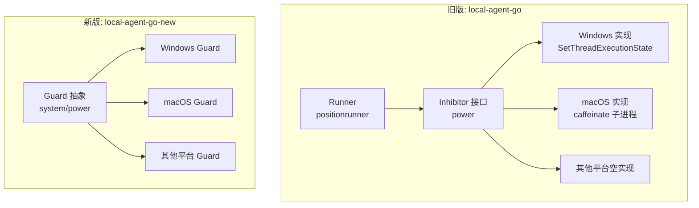
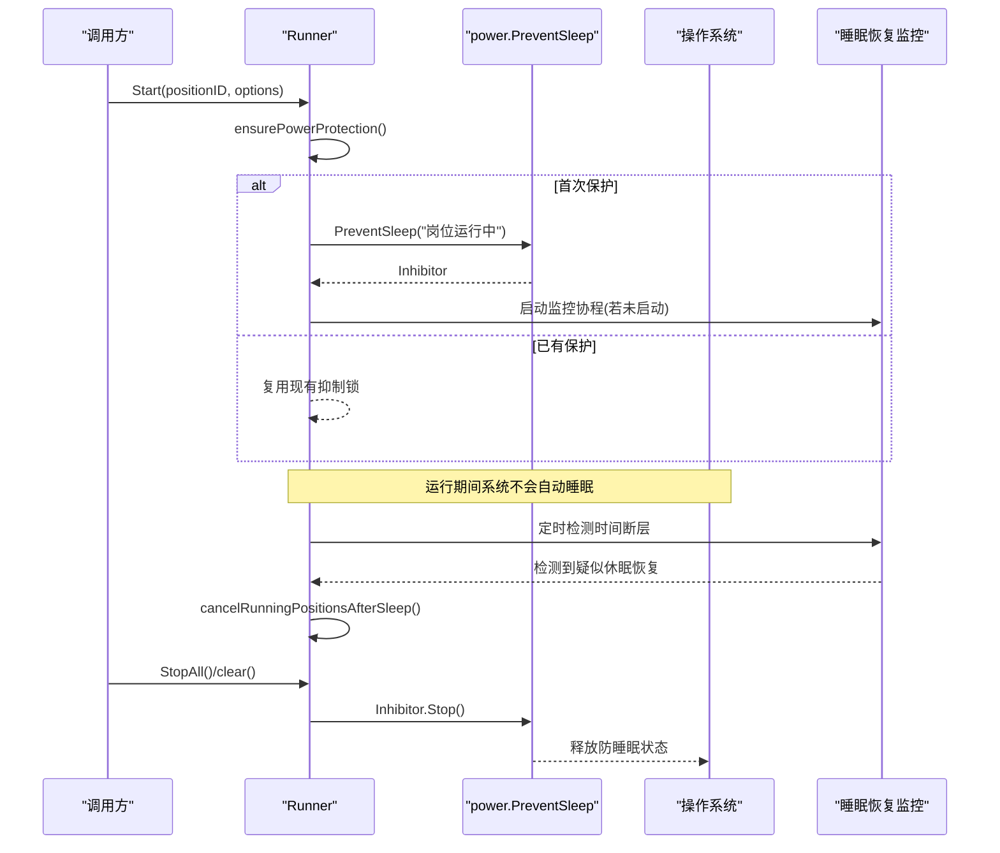
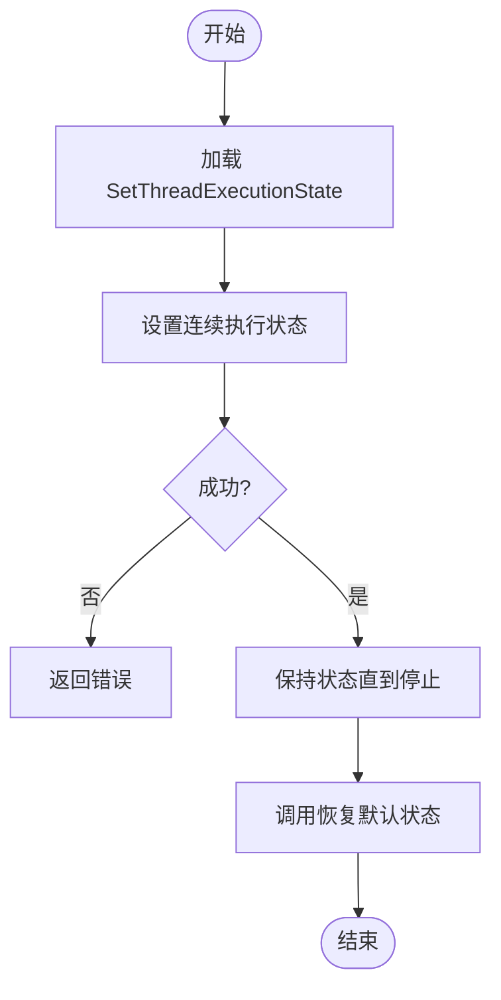
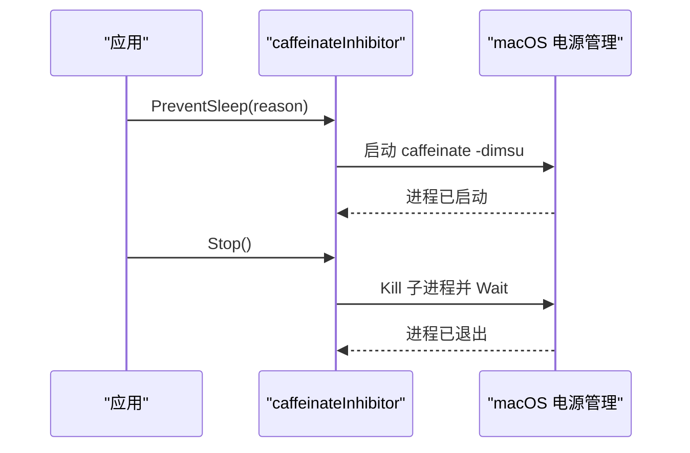
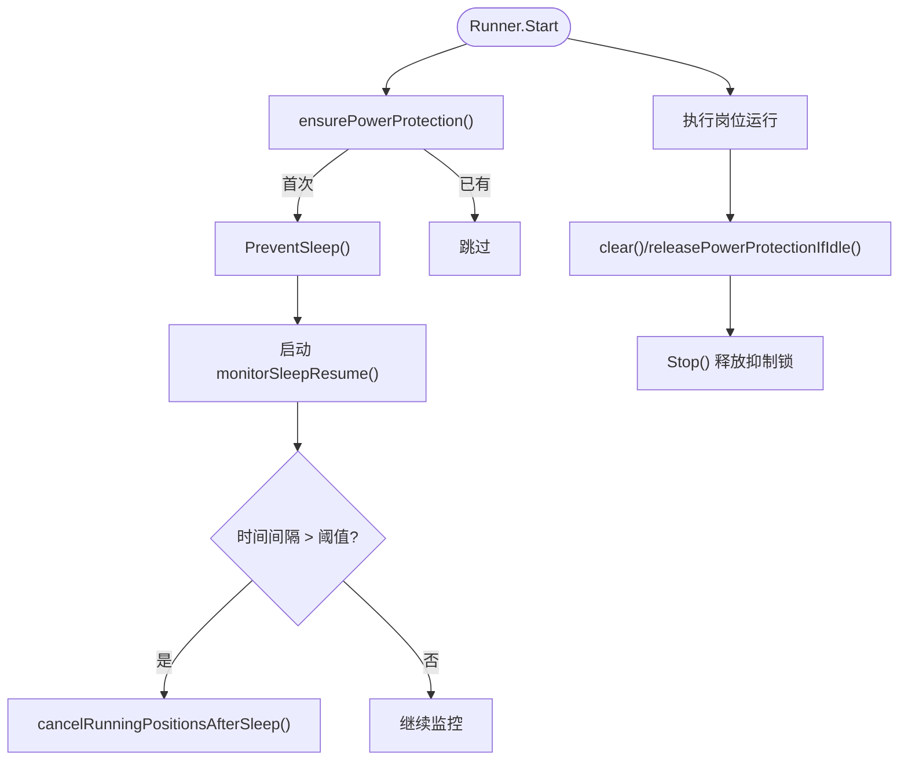
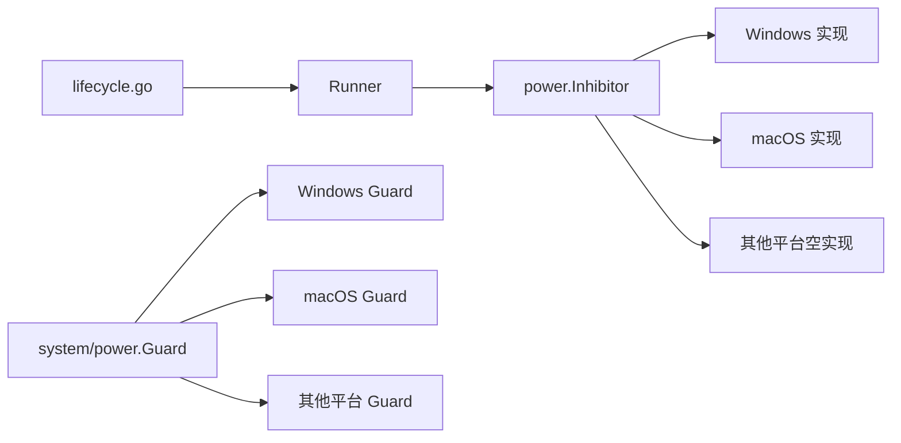

# 电源管理

<cite>
**本文引用的文件**
- [inhibitor.go](file://goodhr5/local-agent-go/internal/power/inhibitor.go)
- [inhibitor_windows.go](file://goodhr5/local-agent-go/internal/power/inhibitor_windows.go)
- [inhibitor_darwin.go](file://goodhr5/local-agent-go/internal/power/inhibitor_darwin.go)
- [inhibitor_other.go](file://goodhr5/local-agent-go/internal/power/inhibitor_other.go)
- [runner.go](file://goodhr5/local-agent-go/internal/positionrunner/runner.go)
- [lifecycle.go](file://goodhr5/local-agent-go/internal/positionrunner/lifecycle.go)
- [guard.go](file://goodhr5/local-agent-go-new/internal/system/power/guard.go)
- [guard_windows.go](file://goodhr5/local-agent-go-new/internal/system/power/guard_windows.go)
- [guard_other.go](file://goodhr5/local-agent-go-new/internal/system/power/guard_other.go)
</cite>

## 目录
1. [简介](#简介)
2. [项目结构](#项目结构)
3. [核心组件](#核心组件)
4. [架构总览](#架构总览)
5. [详细组件分析](#详细组件分析)
6. [依赖关系分析](#依赖关系分析)
7. [性能与资源考量](#性能与资源考量)
8. [故障排查指南](#故障排查指南)
9. [结论](#结论)
10. [附录](#附录)

## 简介
本文件聚焦于本地岗位运行器的“电源管理”能力，目标是：在任务执行期间防止系统进入睡眠或休眠，确保长时间运行的自动化流程稳定完成。文档涵盖跨平台抽象、不同操作系统的具体实现差异、抑制锁管理、电源事件监听与恢复处理、以及电池模式下的行为建议与用户电源设置尊重策略。

## 项目结构
电源管理在代码库中分为两套实现：
- 旧版 local-agent-go：通过 power.Inhibitor 接口与 PreventSleep(reason) 工厂函数提供跨平台防睡眠能力，并在 positionrunner 的生命周期中启用/释放。
- 新版 local-agent-go-new：通过 system/power.Guard 提供更显式的可用性与生命周期管理（Available/Start/Stop），便于上层统一调用。



图表来源
- [runner.go:71-86](file://goodhr5/local-agent-go/internal/positionrunner/runner.go#L71-L86)
- [inhibitor.go:1-15](file://goodhr5/local-agent-go/internal/power/inhibitor.go#L1-L15)
- [inhibitor_windows.go:1-59](file://goodhr5/local-agent-go/internal/power/inhibitor_windows.go#L1-L59)
- [inhibitor_darwin.go:1-38](file://goodhr5/local-agent-go/internal/power/inhibitor_darwin.go#L1-L38)
- [inhibitor_other.go:1-11](file://goodhr5/local-agent-go/internal/power/inhibitor_other.go#L1-L11)
- [guard.go:1-51](file://goodhr5/local-agent-go-new/internal/system/power/guard.go#L1-L51)
- [guard_windows.go:1-77](file://goodhr5/local-agent-go-new/internal/system/power/guard_windows.go#L1-L77)
- [guard_other.go:1-23](file://goodhr5/local-agent-go-new/internal/system/power/guard_other.go#L1-L23)

章节来源
- [runner.go:71-86](file://goodhr5/local-agent-go/internal/positionrunner/runner.go#L71-L86)
- [lifecycle.go:370-417](file://goodhr5/local-agent-go/internal/positionrunner/lifecycle.go#L370-L417)
- [inhibitor.go:1-15](file://goodhr5/local-agent-go/internal/power/inhibitor.go#L1-L15)
- [inhibitor_windows.go:1-59](file://goodhr5/local-agent-go/internal/power/inhibitor_windows.go#L1-L59)
- [inhibitor_darwin.go:1-38](file://goodhr5/local-agent-go/internal/power/inhibitor_darwin.go#L1-L38)
- [inhibitor_other.go:1-11](file://goodhr5/local-agent-go/internal/power/inhibitor_other.go#L1-L11)
- [guard.go:1-51](file://goodhr5/local-agent-go-new/internal/system/power/guard.go#L1-L51)
- [guard_windows.go:1-77](file://goodhr5/local-agent-go-new/internal/system/power/guard_windows.go#L1-L77)
- [guard_other.go:1-23](file://goodhr5/local-agent-go-new/internal/system/power/guard_other.go#L1-L23)

## 核心组件
- Inhibitor 接口：定义可释放的防睡眠句柄，统一 Stop() 语义，屏蔽平台差异。
- Windows 实现：使用 SetThreadExecutionState 在固定线程上设置持续执行状态，阻止系统自动睡眠；Stop 时恢复默认状态。
- macOS 实现：启动 caffeinate -dimsu 子进程保持系统唤醒；Stop 时终止子进程并等待退出。
- 其他平台：返回空实现，不改变系统电源行为。
- Runner 集成：在岗位运行启动时申请抑制锁，运行结束后释放；同时启动睡眠恢复监控协程，检测时间断层并取消运行。
- 新版 Guard：提供 Available/Start/Stop 三态管理，便于上层先检查能力再启用保护。

章节来源
- [inhibitor.go:1-15](file://goodhr5/local-agent-go/internal/power/inhibitor.go#L1-L15)
- [inhibitor_windows.go:1-59](file://goodhr5/local-agent-go/internal/power/inhibitor_windows.go#L1-L59)
- [inhibitor_darwin.go:1-38](file://goodhr5/local-agent-go/internal/power/inhibitor_darwin.go#L1-L38)
- [inhibitor_other.go:1-11](file://goodhr5/local-agent-go/internal/power/inhibitor_other.go#L1-L11)
- [runner.go:71-86](file://goodhr5/local-agent-go/internal/positionrunner/runner.go#L71-L86)
- [lifecycle.go:370-417](file://goodhr5/local-agent-go/internal/positionrunner/lifecycle.go#L370-L417)
- [guard.go:1-51](file://goodhr5/local-agent-go-new/internal/system/power/guard.go#L1-L51)
- [guard_windows.go:1-77](file://goodhr5/local-agent-go-new/internal/system/power/guard_windows.go#L1-L77)
- [guard_other.go:1-23](file://goodhr5/local-agent-go-new/internal/system/power/guard_other.go#L1-L23)

## 架构总览
下图展示从岗位运行启动到电源抑制激活、运行中监控、结束释放的完整流程。



图表来源
- [lifecycle.go:17-79](file://goodhr5/local-agent-go/internal/positionrunner/lifecycle.go#L17-L79)
- [lifecycle.go:370-417](file://goodhr5/local-agent-go/internal/positionrunner/lifecycle.go#L370-L417)
- [lifecycle.go:419-459](file://goodhr5/local-agent-go/internal/positionrunner/lifecycle.go#L419-L459)
- [inhibitor_windows.go:25-59](file://goodhr5/local-agent-go/internal/power/inhibitor_windows.go#L25-L59)
- [inhibitor_darwin.go:16-38](file://goodhr5/local-agent-go/internal/power/inhibitor_darwin.go#L16-L38)

## 详细组件分析

### 跨平台抽象：Inhibitor 接口
- 目标：为上层提供统一的“可释放防睡眠句柄”，屏蔽平台差异。
- 关键方法：Stop() 用于释放抑制锁。
- 空实现：noopInhibitor 用于不支持的平台，保证调用安全且无副作用。

```mermaid
classDiagram
class Inhibitor {
+Stop() error
}
class noopInhibitor {
+Stop() error
}
class windowsInhibitor {
-done chan struct{}
-once sync.Once
+Stop() error
}
class caffeinateInhibitor {
-cmd *exec.Cmd
-once sync.Once
+Stop() error
}
Inhibitor <|.. noopInhibitor
Inhibitor <|.. windowsInhibitor
Inhibitor <|.. caffeinateInhibitor
```

图表来源
- [inhibitor.go:1-15](file://goodhr5/local-agent-go/internal/power/inhibitor.go#L1-L15)
- [inhibitor_windows.go:20-59](file://goodhr5/local-agent-go/internal/power/inhibitor_windows.go#L20-L59)
- [inhibitor_darwin.go:11-38](file://goodhr5/local-agent-go/internal/power/inhibitor_darwin.go#L11-L38)
- [inhibitor_other.go:1-11](file://goodhr5/local-agent-go/internal/power/inhibitor_other.go#L1-L11)

章节来源
- [inhibitor.go:1-15](file://goodhr5/local-agent-go/internal/power/inhibitor.go#L1-L15)
- [inhibitor_windows.go:1-59](file://goodhr5/local-agent-go/internal/power/inhibitor_windows.go#L1-L59)
- [inhibitor_darwin.go:1-38](file://goodhr5/local-agent-go/internal/power/inhibitor_darwin.go#L1-L38)
- [inhibitor_other.go:1-11](file://goodhr5/local-agent-go/internal/power/inhibitor_other.go#L1-L11)

### Windows 电源抑制实现
- 机制：通过 kernel32.dll 的 SetThreadExecutionState 设置连续系统/显示/远离模式要求，阻止自动睡眠。
- 线程安全：在固定系统线程上设置状态，避免多线程干扰；Stop 时恢复默认状态。
- 错误处理：初始化失败直接返回错误；停止时使用 once 保证幂等。



图表来源
- [inhibitor_windows.go:25-59](file://goodhr5/local-agent-go/internal/power/inhibitor_windows.go#L25-L59)

章节来源
- [inhibitor_windows.go:1-59](file://goodhr5/local-agent-go/internal/power/inhibitor_windows.go#L1-L59)

### macOS 电源抑制实现
- 机制：启动 caffeinate -dimsu 子进程，使系统保持唤醒（显示器、内存、磁盘、系统）。
- 生命周期：Start 启动子进程；Stop 终止并等待子进程退出，确保资源释放。
- 错误处理：启动失败返回错误；重复停止安全。



图表来源
- [inhibitor_darwin.go:16-38](file://goodhr5/local-agent-go/internal/power/inhibitor_darwin.go#L16-L38)

章节来源
- [inhibitor_darwin.go:1-38](file://goodhr5/local-agent-go/internal/power/inhibitor_darwin.go#L1-L38)

### 其他平台空实现
- 行为：返回 noopInhibitor，Stop 无操作，不影响系统电源行为。
- 适用场景：尚未适配的系统，保证调用方逻辑一致。

章节来源
- [inhibitor_other.go:1-11](file://goodhr5/local-agent-go/internal/power/inhibitor_other.go#L1-L11)

### Runner 中的电源保护集成
- 启动阶段：ensurePowerProtection 负责首次获取抑制锁，若失败仅记录警告但不阻断运行；成功后启动睡眠恢复监控协程。
- 运行阶段：monitorSleepResume 定时检测时间间隔，超过阈值视为可能休眠恢复，触发取消所有运行中的岗位运行。
- 结束阶段：releasePowerProtectionIfIdle 在所有运行结束时释放抑制锁并关闭监控协程。



图表来源
- [lifecycle.go:370-417](file://goodhr5/local-agent-go/internal/positionrunner/lifecycle.go#L370-L417)
- [lifecycle.go:419-459](file://goodhr5/local-agent-go/internal/positionrunner/lifecycle.go#L419-L459)

章节来源
- [lifecycle.go:370-417](file://goodhr5/local-agent-go/internal/positionrunner/lifecycle.go#L370-L417)
- [lifecycle.go:419-459](file://goodhr5/local-agent-go/internal/positionrunner/lifecycle.go#L419-L459)
- [runner.go:71-86](file://goodhr5/local-agent-go/internal/positionrunner/runner.go#L71-L86)

### 新版 Guard 抽象（local-agent-go-new）
- 设计：提供 Available/Start/Stop 三态管理，便于上层先探测能力再启用保护。
- Windows：封装 SetThreadExecutionState，支持幂等启动与停止。
- macOS：封装 caffeinate 子进程管理，支持幂等启动与停止。
- 其他平台：明确返回不可用错误，避免静默失败。

章节来源
- [guard.go:1-51](file://goodhr5/local-agent-go-new/internal/system/power/guard.go#L1-L51)
- [guard_windows.go:1-77](file://goodhr5/local-agent-go-new/internal/system/power/guard_windows.go#L1-L77)
- [guard_other.go:1-23](file://goodhr5/local-agent-go-new/internal/system/power/guard_other.go#L1-L23)

## 依赖关系分析
- Runner 依赖 power.Inhibitor 抽象，具体实现由构建标签决定。
- lifecycle.go 协调抑制锁生命周期与睡眠恢复监控。
- 新版 Guard 独立于 Runner，可作为通用电源保护模块被上层复用。



图表来源
- [runner.go:71-86](file://goodhr5/local-agent-go/internal/positionrunner/runner.go#L71-L86)
- [lifecycle.go:370-417](file://goodhr5/local-agent-go/internal/positionrunner/lifecycle.go#L370-L417)
- [inhibitor.go:1-15](file://goodhr5/local-agent-go/internal/power/inhibitor.go#L1-L15)
- [guard.go:1-51](file://goodhr5/local-agent-go-new/internal/system/power/guard.go#L1-L51)

章节来源
- [runner.go:71-86](file://goodhr5/local-agent-go/internal/positionrunner/runner.go#L71-L86)
- [lifecycle.go:370-417](file://goodhr5/local-agent-go/internal/positionrunner/lifecycle.go#L370-L417)
- [inhibitor.go:1-15](file://goodhr5/local-agent-go/internal/power/inhibitor.go#L1-L15)
- [guard.go:1-51](file://goodhr5/local-agent-go-new/internal/system/power/guard.go#L1-L51)

## 性能与资源考量
- Windows 实现：在固定系统线程上设置执行状态，避免频繁 API 调用；Stop 时立即恢复默认状态，减少资源占用。
- macOS 实现：启动单个 caffeinate 子进程，开销极低；Stop 时及时终止并等待退出，避免僵尸进程。
- 监控协程：以固定间隔轮询时间差，CPU 占用极低；发现异常后批量取消运行，降低后续开销。
- 幂等性：多次 Stop 或重复启动均安全，避免竞态条件导致的资源泄漏。

[本节为通用指导，无需特定文件引用]

## 故障排查指南
- 启动失败：
  - Windows：SetThreadExecutionState 调用失败会返回错误；检查权限与系统版本。
  - macOS：caffeinate 不可用或启动失败会返回错误；确认 PATH 中包含 caffeinate。
- 抑制锁未释放：
  - 检查 releasePowerProtectionIfIdle 是否在所有运行结束时被调用。
  - 确认 clear/markUserStoppedAndCancel 路径正确释放 powerGuard。
- 休眠恢复导致任务中断：
  - 查看 monitorSleepResume 日志，确认时间断层检测是否触发。
  - 根据 cancelReason 判断是否为系统休眠导致的中断。
- 多实例冲突：
  - ensurePowerProtection 内部有互斥保护，避免重复获取抑制锁；若出现异常，检查并发入口。

章节来源
- [inhibitor_windows.go:25-59](file://goodhr5/local-agent-go/internal/power/inhibitor_windows.go#L25-L59)
- [inhibitor_darwin.go:16-38](file://goodhr5/local-agent-go/internal/power/inhibitor_darwin.go#L16-L38)
- [lifecycle.go:370-417](file://goodhr5/local-agent-go/internal/positionrunner/lifecycle.go#L370-L417)
- [lifecycle.go:419-459](file://goodhr5/local-agent-go/internal/positionrunner/lifecycle.go#L419-L459)

## 结论
该电源管理方案通过跨平台抽象与平台特定实现，为长时间运行的岗位任务提供了可靠的防睡眠保护。Runner 在启动时申请抑制锁，运行中监控休眠恢复，结束时释放资源，形成完整的生命周期闭环。新版 Guard 进一步提升了能力探测与生命周期管理的清晰度。建议在电池模式下结合用户电源设置进行策略调整，例如降低刷新频率或暂停非关键任务，以平衡稳定性与能耗。

[本节为总结性内容，无需特定文件引用]

## 附录
- 电池模式下的行为建议：
  - 可在上层根据系统电源状态（如电池供电）动态调整任务策略，例如降低扫描频率、缩短详情打开时长或暂停非关键步骤。
  - 尊重用户电源设置：当用户设置为“节能模式”或“息屏即休眠”时，应提示风险并允许用户选择继续或暂停。
- 电源事件监听与状态同步：
  - 当前实现通过时间断层检测近似感知休眠恢复；如需更精确的事件驱动，可在上层扩展系统电源事件监听（如 Windows PBT_APMSUSPEND、macOS NSWorkspaceDidWakeNotification）。
  - 状态同步：在恢复后可尝试重新连接浏览器 Worker、校验页面状态并恢复任务进度。

[本节为概念性内容，无需特定文件引用]