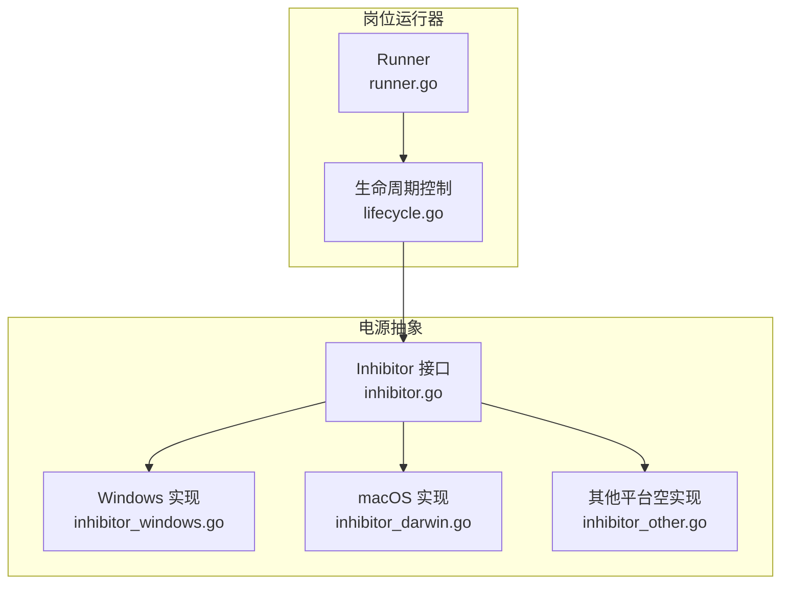
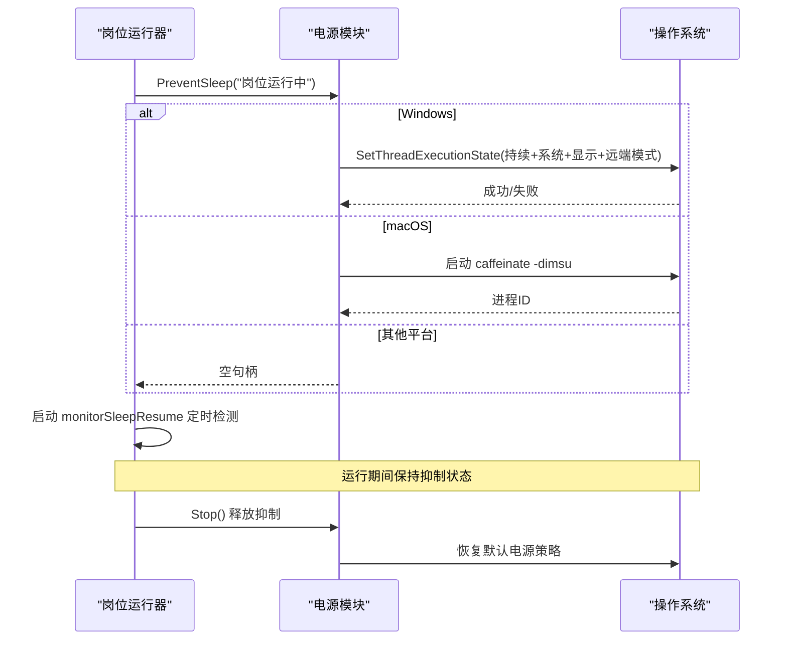
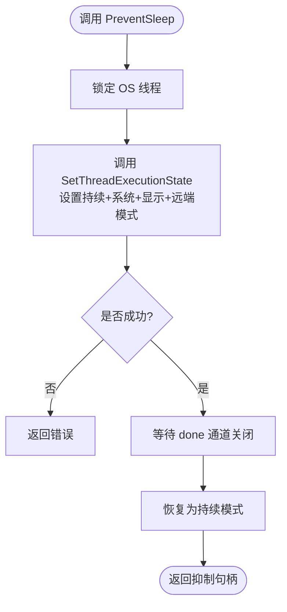
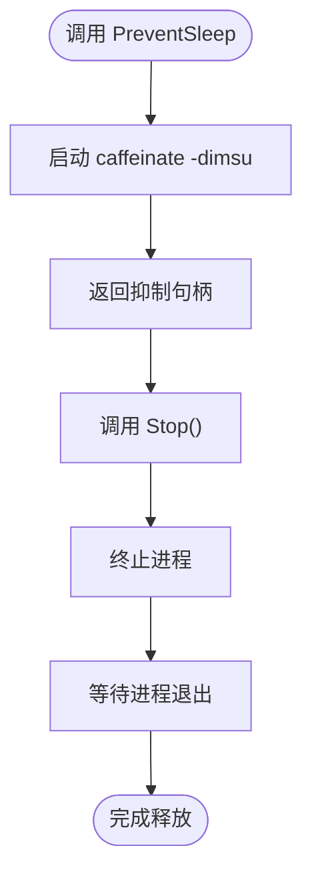
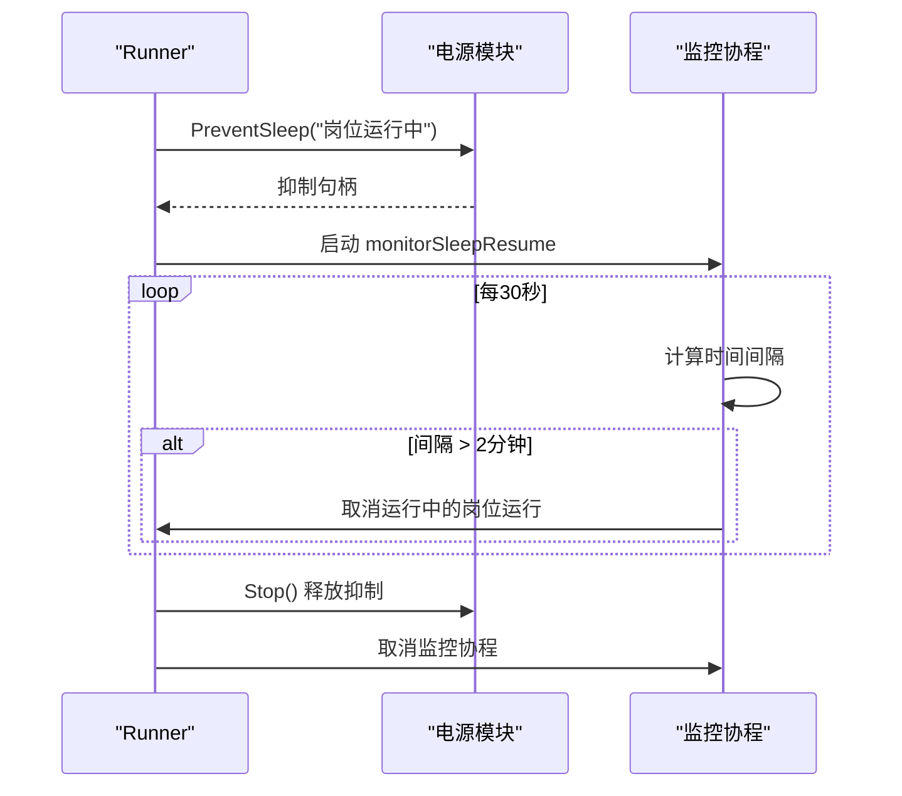
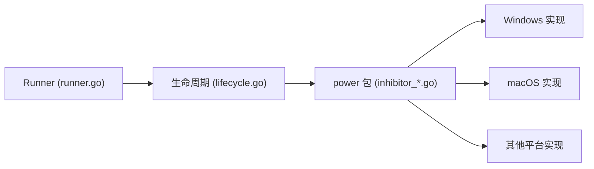

# 电源管理

<cite>
**本文引用的文件**
- [inhibitor.go](file://goodhr5/local-agent-go/internal/power/inhibitor.go)
- [inhibitor_windows.go](file://goodhr5/local-agent-go/internal/power/inhibitor_windows.go)
- [inhibitor_darwin.go](file://goodhr5/local-agent-go/internal/power/inhibitor_darwin.go)
- [inhibitor_other.go](file://goodhr5/local-agent-go/internal/power/inhibitor_other.go)
- [runner.go](file://goodhr5/local-agent-go/internal/positionrunner/runner.go)
- [lifecycle.go](file://goodhr5/local-agent-go/internal/positionrunner/lifecycle.go)
</cite>

## 目录
1. [简介](#简介)
2. [项目结构](#项目结构)
3. [核心组件](#核心组件)
4. [架构总览](#架构总览)
5. [详细组件分析](#详细组件分析)
6. [依赖关系分析](#依赖关系分析)
7. [性能与可靠性](#性能与可靠性)
8. [故障排查指南](#故障排查指南)
9. [结论](#结论)
10. [附录](#附录)

## 简介
本文件聚焦本地岗位运行器的电源管理方案，重点说明系统休眠抑制机制，确保在任务执行期间电脑不会进入睡眠或关闭显示器。文档覆盖跨平台（Windows、macOS、Linux）实现差异、Inhibitor 接口的抽象设计、电源状态检测与恢复处理、抑制锁的生命周期管理，以及长时间运行任务的电源保护策略。同时给出事件监听、状态同步与故障恢复的实践建议。

## 项目结构
电源管理相关代码位于 local-agent-go 的 internal 目录下：
- power 包：提供跨平台的防睡眠能力抽象与具体实现
- positionrunner 包：岗位运行器，负责启动/停止流程，并在运行期间申请并释放防睡眠保护



图表来源
- [runner.go:72-89](file://goodhr5/local-agent-go/internal/positionrunner/runner.go#L72-L89)
- [lifecycle.go:442-509](file://goodhr5/local-agent-go/internal/positionrunner/lifecycle.go#L442-L509)
- [inhibitor.go:4-14](file://goodhr5/local-agent-go/internal/power/inhibitor.go#L4-L14)
- [inhibitor_windows.go:20-58](file://goodhr5/local-agent-go/internal/power/inhibitor_windows.go#L20-L58)
- [inhibitor_darwin.go:11-37](file://goodhr5/local-agent-go/internal/power/inhibitor_darwin.go#L11-L37)
- [inhibitor_other.go:6-10](file://goodhr5/local-agent-go/internal/power/inhibitor_other.go#L6-L10)

章节来源
- [runner.go:72-89](file://goodhr5/local-agent-go/internal/positionrunner/runner.go#L72-L89)
- [lifecycle.go:442-509](file://goodhr5/local-agent-go/internal/positionrunner/lifecycle.go#L442-L509)

## 核心组件
- Inhibitor 接口：定义可释放的防睡眠句柄，统一 Stop() 语义
- Windows 实现：通过 SetThreadExecutionState 阻止系统自动睡眠与关闭显示器
- macOS 实现：通过 caffeinate 进程阻止系统自动睡眠与关闭显示器
- Linux/其他平台：返回空实现，不改变系统电源行为
- Runner 集成：在岗位运行启动时申请抑制锁，运行结束或空闲时释放；同时监控睡眠/唤醒以做安全恢复

章节来源
- [inhibitor.go:4-14](file://goodhr5/local-agent-go/internal/power/inhibitor.go#L4-L14)
- [inhibitor_windows.go:20-58](file://goodhr5/local-agent-go/internal/power/inhibitor_windows.go#L20-L58)
- [inhibitor_darwin.go:11-37](file://goodhr5/local-agent-go/internal/power/inhibitor_darwin.go#L11-L37)
- [inhibitor_other.go:6-10](file://goodhr5/local-agent-go/internal/power/inhibitor_other.go#L6-L10)
- [lifecycle.go:442-509](file://goodhr5/local-agent-go/internal/positionrunner/lifecycle.go#L442-L509)

## 架构总览
岗位运行器在启动阶段调用 ensurePowerProtection，尝试获取一个 Inhibitor 实例；成功后启动后台协程 monitorSleepResume，周期性检测时间断层以识别可能的睡眠/休眠恢复。当所有运行任务结束且无浏览器占用时，releasePowerProtectionIfIdle 会释放抑制锁并取消监控协程。



图表来源
- [lifecycle.go:442-509](file://goodhr5/local-agent-go/internal/positionrunner/lifecycle.go#L442-L509)
- [inhibitor_windows.go:25-58](file://goodhr5/local-agent-go/internal/power/inhibitor_windows.go#L25-L58)
- [inhibitor_darwin.go:16-37](file://goodhr5/local-agent-go/internal/power/inhibitor_darwin.go#L16-L37)
- [inhibitor_other.go:6-10](file://goodhr5/local-agent-go/internal/power/inhibitor_other.go#L6-L10)

## 详细组件分析

### Inhibitor 接口与空实现
- 接口仅暴露 Stop() 方法，用于释放抑制资源
- 空实现 noopInhibitor 用于未适配平台，保证调用方无需分支处理

```mermaid
classDiagram
class Inhibitor {
+Stop() error
}
class windowsInhibitor {
-done chan struct{}
-once sync.Once
+Stop() error
}
class caffeinateInhibitor {
-cmd *exec.Cmd
-once sync.Once
+Stop() error
}
class noopInhibitor {
+Stop() error
}
Inhibitor <|.. windowsInhibitor
Inhibitor <|.. caffeinateInhibitor
Inhibitor <|.. noopInhibitor
```

图表来源
- [inhibitor.go:4-14](file://goodhr5/local-agent-go/internal/power/inhibitor.go#L4-L14)
- [inhibitor_windows.go:20-58](file://goodhr5/local-agent-go/internal/power/inhibitor_windows.go#L20-L58)
- [inhibitor_darwin.go:11-37](file://goodhr5/local-agent-go/internal/power/inhibitor_darwin.go#L11-L37)
- [inhibitor_other.go:6-10](file://goodhr5/local-agent-go/internal/power/inhibitor_other.go#L6-L10)

章节来源
- [inhibitor.go:4-14](file://goodhr5/local-agent-go/internal/power/inhibitor.go#L4-L14)

### Windows 防睡眠实现
- 使用 kernel32.dll 的 SetThreadExecutionState，设置持续标志与系统/显示/远端模式，阻止自动睡眠和关闭显示器
- 在专用线程中锁定 OS 线程并调用 API，完成后等待退出信号再恢复为持续模式
- Stop() 通过关闭 done 通道触发恢复逻辑，使用 once 保证只恢复一次



图表来源
- [inhibitor_windows.go:25-58](file://goodhr5/local-agent-go/internal/power/inhibitor_windows.go#L25-L58)

章节来源
- [inhibitor_windows.go:25-58](file://goodhr5/local-agent-go/internal/power/inhibitor_windows.go#L25-L58)

### macOS 防睡眠实现
- 通过启动 caffeinate -dimsu 进程阻止系统自动睡眠与关闭显示器
- Stop() 终止进程并等待退出，使用 once 防止重复释放



图表来源
- [inhibitor_darwin.go:16-37](file://goodhr5/local-agent-go/internal/power/inhibitor_darwin.go#L16-L37)

章节来源
- [inhibitor_darwin.go:16-37](file://goodhr5/local-agent-go/internal/power/inhibitor_darwin.go#L16-L37)

### Linux/其他平台
- 返回空句柄，不改变系统电源策略
- 适用于尚未适配或未启用抑制的平台

章节来源
- [inhibitor_other.go:6-10](file://goodhr5/local-agent-go/internal/power/inhibitor_other.go#L6-L10)

### 岗位运行器中的电源保护集成
- 启动阶段：ensurePowerProtection 申请抑制锁，若失败记录警告但不阻断运行
- 运行期：monitorSleepResume 每 30 秒检查时间间隔，超过阈值（2 分钟）视为可能睡眠/休眠恢复，取消正在运行的岗位运行并记录原因
- 结束阶段：clear/releasePowerProtectionIfIdle 在所有任务结束且无浏览器占用时释放抑制锁并取消监控



图表来源
- [lifecycle.go:442-509](file://goodhr5/local-agent-go/internal/positionrunner/lifecycle.go#L442-L509)
- [runner.go:45-46](file://goodhr5/local-agent-go/internal/positionrunner/runner.go#L45-L46)

章节来源
- [lifecycle.go:442-509](file://goodhr5/local-agent-go/internal/positionrunner/lifecycle.go#L442-L509)
- [runner.go:45-46](file://goodhr5/local-agent-go/internal/positionrunner/runner.go#L45-L46)

## 依赖关系分析
- Runner 依赖 power 包提供的 PreventSleep 与 Inhibitor 接口
- lifecycle.go 在启动流程中调用 ensurePowerProtection，并在清理流程中释放
- 不同平台通过构建标签选择对应实现，避免运行时分支



图表来源
- [runner.go:72-89](file://goodhr5/local-agent-go/internal/positionrunner/runner.go#L72-L89)
- [lifecycle.go:442-509](file://goodhr5/local-agent-go/internal/positionrunner/lifecycle.go#L442-L509)
- [inhibitor_windows.go:20-58](file://goodhr5/local-agent-go/internal/power/inhibitor_windows.go#L20-L58)
- [inhibitor_darwin.go:11-37](file://goodhr5/local-agent-go/internal/power/inhibitor_darwin.go#L11-L37)
- [inhibitor_other.go:6-10](file://goodhr5/local-agent-go/internal/power/inhibitor_other.go#L6-L10)

章节来源
- [runner.go:72-89](file://goodhr5/local-agent-go/internal/positionrunner/runner.go#L72-L89)
- [lifecycle.go:442-509](file://goodhr5/local-agent-go/internal/positionrunner/lifecycle.go#L442-L509)

## 性能与可靠性
- 低开销：仅在启动时调用一次系统 API 或启动子进程；监控协程使用固定间隔轮询，CPU 占用极低
- 幂等释放：使用 sync.Once 确保 Stop() 只生效一次，避免重复释放导致异常
- 健壮性：抑制失败不影响岗位运行主流程，仅记录警告；运行结束后确保释放抑制锁
- 恢复安全：检测到睡眠/休眠后主动取消运行，避免在不可信状态下继续操作浏览器或网络

[本节为通用指导，不直接分析具体文件]

## 故障排查指南
- 抑制失败（Windows）
  - 现象：日志出现“SetThreadExecutionState 失败”
  - 排查：确认权限与系统策略允许修改线程执行状态；检查是否有其他进程冲突
  - 影响：岗位运行仍可继续，但可能进入睡眠
- 抑制失败（macOS）
  - 现象：caffeinate 启动失败
  - 排查：确认系统存在 caffeinate 命令；检查用户权限与沙箱限制
  - 影响：同 Windows，岗位运行仍可继续
- 未释放抑制锁
  - 现象：任务结束后仍阻止睡眠
  - 排查：确认 clear/releasePowerProtectionIfIdle 被调用；检查是否存在未退出的浏览器占用
- 睡眠恢复误判
  - 现象：长时间无操作后被取消
  - 排查：调整 sleepMonitorInterval 与 sleepResumeThreshold 的权衡；结合业务场景评估阈值合理性

章节来源
- [inhibitor_windows.go:25-58](file://goodhr5/local-agent-go/internal/power/inhibitor_windows.go#L25-L58)
- [inhibitor_darwin.go:16-37](file://goodhr5/local-agent-go/internal/power/inhibitor_darwin.go#L16-L37)
- [lifecycle.go:471-509](file://goodhr5/local-agent-go/internal/positionrunner/lifecycle.go#L471-L509)

## 结论
该电源管理方案通过统一的 Inhibitor 接口屏蔽了跨平台差异，在岗位运行期间有效防止系统自动睡眠与关闭显示器；同时通过睡眠恢复检测保障任务安全性。建议在后续版本中补充电池模式下的行为调整、更细粒度的电源事件监听与状态同步，以提升用户体验与可靠性。

[本节为总结，不直接分析具体文件]

## 附录

### 跨平台实现差异对照
- Windows：SetThreadExecutionState 设置持续标志与系统/显示/远端模式，阻止睡眠与息屏
- macOS：启动 caffeinate -dimsu 进程阻止睡眠与息屏
- Linux/其他：空实现，不改变系统电源策略

章节来源
- [inhibitor_windows.go:25-58](file://goodhr5/local-agent-go/internal/power/inhibitor_windows.go#L25-L58)
- [inhibitor_darwin.go:16-37](file://goodhr5/local-agent-go/internal/power/inhibitor_darwin.go#L16-L37)
- [inhibitor_other.go:6-10](file://goodhr5/local-agent-go/internal/power/inhibitor_other.go#L6-L10)

### 长时间运行任务的电源保护
- 启动即申请抑制锁，确保扫描、打招呼、详情处理等长耗时环节不被中断
- 运行结束后统一释放，避免长期占用系统电源策略

章节来源
- [lifecycle.go:442-509](file://goodhr5/local-agent-go/internal/positionrunner/lifecycle.go#L442-L509)

### 电池模式下的行为调整（建议）
- 当前实现未区分交流电/电池模式；可在未来引入电源状态检测，在电池模式下降低刷新频率或放宽抑制强度
- 可结合系统通知或托盘提示告知用户当前电源策略

[本节为扩展建议，不直接分析具体文件]

### 用户电源设置尊重（建议）
- 当前实现优先保证任务连续性；未来可增加配置项，允许用户选择“尊重系统省电策略”
- 在用户明确设置下，可缩短抑制时长或仅在关键阶段抑制

[本节为扩展建议，不直接分析具体文件]

### 电源事件监听与状态同步（建议）
- 可订阅系统电源事件（如 AC/DC 切换、屏幕开关），动态调整抑制策略
- 将电源状态与岗位运行进度同步到前端，便于用户理解当前行为

[本节为扩展建议，不直接分析具体文件]