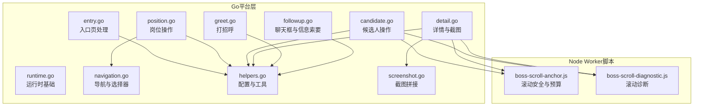
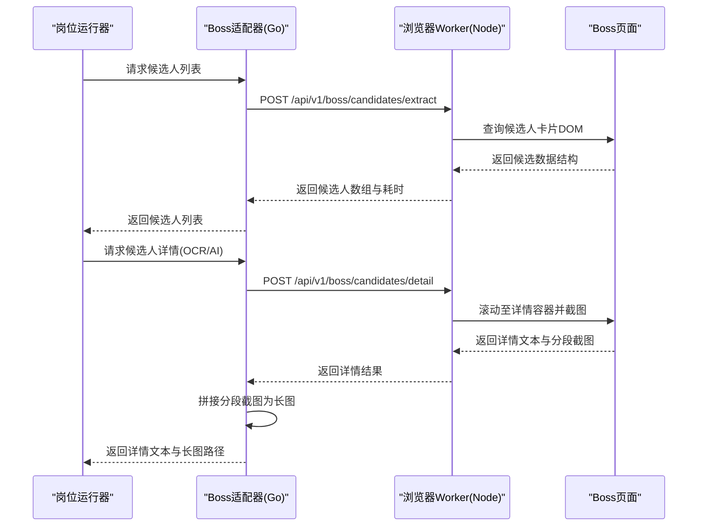
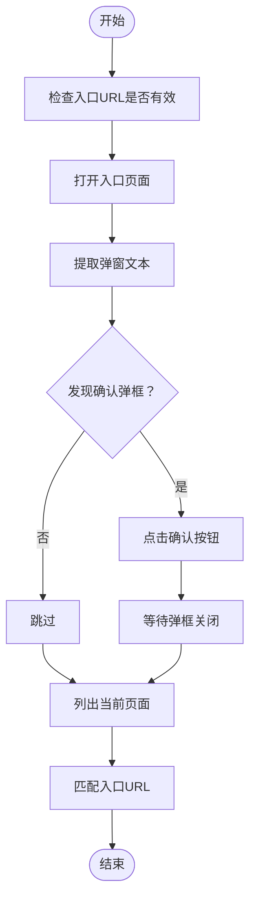
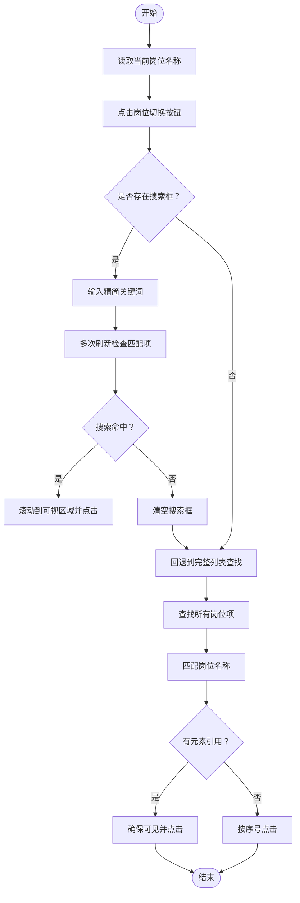
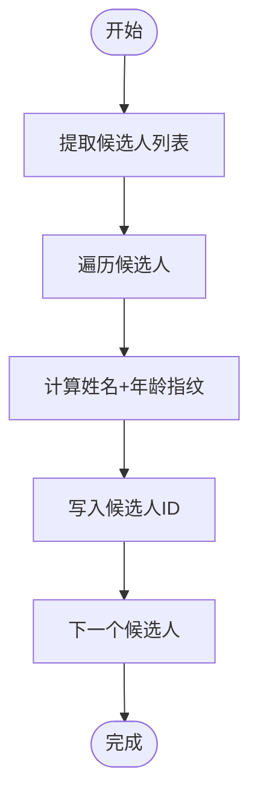
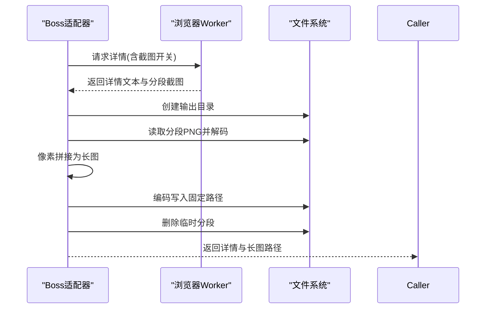
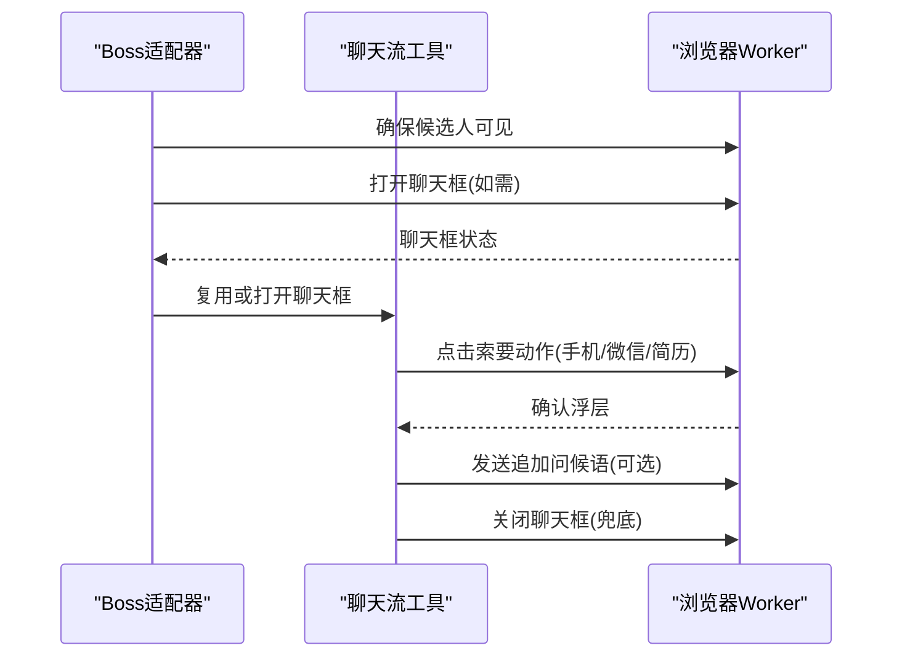
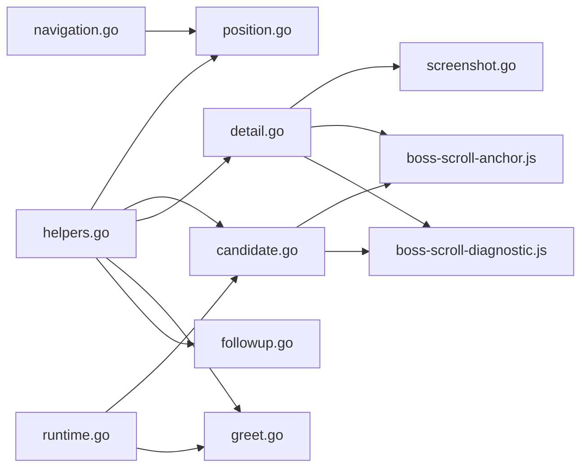

# Boss直聘适配器

<cite>
**本文引用的文件**   
- [entry.go](file://goodhr5/local-agent-go/internal/platforms/boss/entry.go)
- [runtime.go](file://goodhr5/local-agent-go/internal/platforms/boss/runtime.go)
- [navigation.go](file://goodhr5/local-agent-go/internal/platforms/boss/navigation.go)
- [position.go](file://goodhr5/local-agent-go/internal/platforms/boss/position.go)
- [candidate.go](file://goodhr5/local-agent-go/internal/platforms/boss/candidate.go)
- [detail.go](file://goodhr5/local-agent-go/internal/platforms/boss/detail.go)
- [greet.go](file://goodhr5/local-agent-go/internal/platforms/boss/greet.go)
- [helpers.go](file://goodhr5/local-agent-go/internal/platforms/boss/helpers.go)
- [followup.go](file://goodhr5/local-agent-go/internal/platforms/boss/followup.go)
- [screenshot.go](file://goodhr5/local-agent-go/internal/platforms/boss/screenshot.go)
- [boss-scroll-anchor.js](file://goodhr5/local-agent-go/worker-node/src/boss-scroll-anchor.js)
- [boss-scroll-diagnostic.js](file://goodhr5/local-agent-go/worker-node/src/boss-scroll-diagnostic.js)
</cite>

## 目录
1. [简介](#简介)
2. [项目结构](#项目结构)
3. [核心组件](#核心组件)
4. [架构总览](#架构总览)
5. [详细组件分析](#详细组件分析)
6. [依赖关系分析](#依赖关系分析)
7. [性能与反爬策略](#性能与反爬策略)
8. [故障排查指南](#故障排查指南)
9. [结论](#结论)
10. [附录：配置项与调试建议](#附录配置项与调试建议)

## 简介
本文件面向Boss直聘平台适配器的实现，系统性解析其页面结构特点、DOM元素定位策略、用户交互模拟方法，以及岗位搜索、候选人列表获取、简历详情解析、自动问候、聊天框信息索要等核心流程。文档同时覆盖Boss直聘特有的反爬虫应对、页面加载等待策略、异常处理方案、特殊配置选项、性能优化技巧、调试方法与数据同步要点。

## 项目结构
Boss直聘适配器位于本地Agent的“平台实现”模块中，Go侧负责编排业务逻辑与Worker通信，Node侧提供浏览器端滚动安全判断与诊断能力。关键文件职责如下：
- entry.go：入口页打开、确认弹框处理、入口页判定
- runtime.go：运行时基础能力、候选人可见性通用参数、年龄提取与ID规范化
- navigation.go：入口页匹配、岗位名称规范化、搜索关键词生成、列表项选择器合并
- position.go：当前岗位读取、岗位切换（搜索优先+回退滚动查找）
- candidate.go：候选人列表提取、滚动、可见性保证、筛选文本与指纹
- detail.go：候选人详情提取、截图拼接、详情关闭与文本清洗
- greet.go：打招呼流程
- followup.go：打招呼后聊天框复用与信息索要流程
- helpers.go：云端配置到Worker协议转换、通用工具函数
- screenshot.go：分段截图拼接为长图、临时文件清理
- boss-scroll-anchor.js：滚动锚点安全区判断、自适应滚轮距离、滚动预算扩展
- boss-scroll-diagnostic.js：滚动失败诊断汇总与中文结论

**图表来源** 
- [entry.go:12-72](file://goodhr5/local-agent-go/internal/platforms/boss/entry.go#L12-L72)
- [runtime.go:11-63](file://goodhr5/local-agent-go/internal/platforms/boss/runtime.go#L11-L63)
- [navigation.go:12-161](file://goodhr5/local-agent-go/internal/platforms/boss/navigation.go#L12-L161)
- [position.go:12-199](file://goodhr5/local-agent-go/internal/platforms/boss/position.go#L12-L199)
- [candidate.go:13-86](file://goodhr5/local-agent-go/internal/platforms/boss/candidate.go#L13-L86)
- [detail.go:14-107](file://goodhr5/local-agent-go/internal/platforms/boss/detail.go#L14-L107)
- [greet.go:11-23](file://goodhr5/local-agent-go/internal/platforms/boss/greet.go#L11-L23)
- [followup.go:16-116](file://goodhr5/local-agent-go/internal/platforms/boss/followup.go#L16-L116)
- [helpers.go:112-180](file://goodhr5/local-agent-go/internal/platforms/boss/helpers.go#L112-L180)
- [screenshot.go:19-167](file://goodhr5/local-agent-go/internal/platforms/boss/screenshot.go#L19-L167)
- [boss-scroll-anchor.js:14-170](file://goodhr5/local-agent-go/worker-node/src/boss-scroll-anchor.js#L14-L170)
- [boss-scroll-diagnostic.js:86-250](file://goodhr5/local-agent-go/worker-node/src/boss-scroll-diagnostic.js#L86-L250)

**章节来源**
- [entry.go:12-72](file://goodhr5/local-agent-go/internal/platforms/boss/entry.go#L12-L72)
- [runtime.go:11-63](file://goodhr5/local-agent-go/internal/platforms/boss/runtime.go#L11-L63)
- [navigation.go:12-161](file://goodhr5/local-agent-go/internal/platforms/boss/navigation.go#L12-L161)
- [position.go:12-199](file://goodhr5/local-agent-go/internal/platforms/boss/position.go#L12-L199)
- [candidate.go:13-86](file://goodhr5/local-agent-go/internal/platforms/boss/candidate.go#L13-L86)
- [detail.go:14-107](file://goodhr5/local-agent-go/internal/platforms/boss/detail.go#L14-L107)
- [greet.go:11-23](file://goodhr5/local-agent-go/internal/platforms/boss/greet.go#L11-L23)
- [followup.go:16-116](file://goodhr5/local-agent-go/internal/platforms/boss/followup.go#L16-L116)
- [helpers.go:112-180](file://goodhr5/local-agent-go/internal/platforms/boss/helpers.go#L112-L180)
- [screenshot.go:19-167](file://goodhr5/local-agent-go/internal/platforms/boss/screenshot.go#L19-L167)
- [boss-scroll-anchor.js:14-170](file://goodhr5/local-agent-go/worker-node/src/boss-scroll-anchor.js#L14-L170)
- [boss-scroll-diagnostic.js:86-250](file://goodhr5/local-agent-go/worker-node/src/boss-scroll-diagnostic.js#L86-L250)

## 核心组件
- 入口与导航
  - 入口页打开与确认弹框处理：通过Worker接口提取弹窗文本并点击确认按钮，随后延迟等待关闭。
  - 入口页判定：列出当前页面，匹配配置中的入口URL或前缀。
  - 岗位名称规范化与搜索关键词生成：去除括号说明、统一空格，提高搜索命中率。
- 岗位操作
  - 当前岗位读取：按配置选择器提取文本，为空时记录详细日志并报错。
  - 岗位切换：优先使用岗位搜索框输入精简关键词；若不可用则回退到完整列表滚动查找；支持元素引用点击与序号回退。
- 候选人操作
  - 候选人列表提取：调用Worker专用接口，返回结构化卡片数据，附带耗时统计。
  - 候选人滚动与可见性保证：小步滚轮滚动，结合安全边距与自适应步长，确保卡片完全进入可视区域。
  - 候选人指纹：基于姓名与年龄生成稳定ID，用于去重。
- 详情解析
  - 详情提取：根据模式（DOM/OCR/AI）触发不同Worker路径，附带截图与滚动参数。
  - 截图拼接：将分段截图纵向拼接为长图，输出固定路径，清理临时分段。
  - 详情关闭：通过快捷键关闭详情面板。
- 打招呼与信息索要
  - 打招呼：先确保候选人可见，再调用打招呼接口。
  - 聊天框复用与信息索要：打招呼后优先复用已打开聊天框，否则主动打开；支持手机号、微信、简历三类动作与追加问候语发送。

**章节来源**
- [entry.go:12-72](file://goodhr5/local-agent-go/internal/platforms/boss/entry.go#L12-L72)
- [navigation.go:12-161](file://goodhr5/local-agent-go/internal/platforms/boss/navigation.go#L12-L161)
- [position.go:12-199](file://goodhr5/local-agent-go/internal/platforms/boss/position.go#L12-L199)
- [candidate.go:13-86](file://goodhr5/local-agent-go/internal/platforms/boss/candidate.go#L13-L86)
- [detail.go:14-107](file://goodhr5/local-agent-go/internal/platforms/boss/detail.go#L14-L107)
- [greet.go:11-23](file://goodhr5/local-agent-go/internal/platforms/boss/greet.go#L11-L23)
- [followup.go:16-116](file://goodhr5/local-agent-go/internal/platforms/boss/followup.go#L16-L116)

## 架构总览
Boss直聘适配器采用“Go编排 + Node Worker执行”的分层架构。Go侧负责业务编排、配置解析与日志记录；Node侧在浏览器环境中执行DOM查询、滚动、截图与诊断。两者通过统一的Worker API进行通信。

**图表来源**
- [candidate.go:15-48](file://goodhr5/local-agent-go/internal/platforms/boss/candidate.go#L15-L48)
- [detail.go:16-63](file://goodhr5/local-agent-go/internal/platforms/boss/detail.go#L16-L63)
- [screenshot.go:19-167](file://goodhr5/local-agent-go/internal/platforms/boss/screenshot.go#L19-L167)

## 详细组件分析

### 入口与导航组件
- 入口页打开与确认弹框
  - 打开入口页：校验配置URL，调用Worker打开页面。
  - 确认弹框：提取弹窗体文本，若存在则点击确认按钮，延迟等待关闭。
- 入口页判定
  - 列出当前页面，取默认页并与配置入口URL进行匹配（精确/前缀/包含）。
- 岗位名称规范化与搜索关键词
  - 去除中英文括号说明，统一空格，生成适合Boss搜索框的精简关键词。
- 列表项选择器合并
  - 合并列表容器与列表项的配置，支持父类与目标类叠加，提升定位稳定性。

**图表来源**
- [entry.go:14-52](file://goodhr5/local-agent-go/internal/platforms/boss/entry.go#L14-L52)
- [entry.go:57-71](file://goodhr5/local-agent-go/internal/platforms/boss/entry.go#L57-L71)
- [navigation.go:14-38](file://goodhr5/local-agent-go/internal/platforms/boss/navigation.go#L14-L38)
- [navigation.go:55-71](file://goodhr5/local-agent-go/internal/platforms/boss/navigation.go#L55-L71)
- [navigation.go:79-93](file://goodhr5/local-agent-go/internal/platforms/boss/navigation.go#L79-L93)
- [navigation.go:95-122](file://goodhr5/local-agent-go/internal/platforms/boss/navigation.go#L95-L122)

**章节来源**
- [entry.go:14-71](file://goodhr5/local-agent-go/internal/platforms/boss/entry.go#L14-L71)
- [navigation.go:14-122](file://goodhr5/local-agent-go/internal/platforms/boss/navigation.go#L14-L122)

### 岗位操作组件
- 当前岗位读取
  - 按配置选择器提取文本，为空时记录详细诊断日志并返回错误。
- 岗位切换
  - 优先通过岗位搜索框输入精简关键词，多次刷新检查匹配项；未命中则清空搜索框并回退到完整列表滚动查找。
  - 找到匹配项后，尝试滚动到可视区域并点击；若无元素引用则按序号点击。
  - 滚动参数包括距离、等待时间、最大尝试次数、视口边距与仅垂直滚动。

**图表来源**
- [position.go:14-29](file://goodhr5/local-agent-go/internal/platforms/boss/position.go#L14-L29)
- [position.go:34-118](file://goodhr5/local-agent-go/internal/platforms/boss/position.go#L34-L118)
- [position.go:121-199](file://goodhr5/local-agent-go/internal/platforms/boss/position.go#L121-L199)

**章节来源**
- [position.go:14-199](file://goodhr5/local-agent-go/internal/platforms/boss/position.go#L14-L199)

### 候选人操作组件
- 候选人列表提取
  - 调用Worker专用接口，返回候选人数组与耗时统计；对每个候选人计算指纹并写入ID字段。
- 候选人滚动与可见性保证
  - 使用小步滚轮滚动，结合安全边距与自适应步长，确保卡片完全进入可视区域。
  - 滚动预算根据初始剩余距离动态扩展，避免远距离目标提前耗尽重试。
- 候选人指纹
  - 基于姓名与年龄生成稳定ID，用于跨任务去重。

**图表来源**
- [candidate.go:15-48](file://goodhr5/local-agent-go/internal/platforms/boss/candidate.go#L15-L48)
- [candidate.go:76-86](file://goodhr5/local-agent-go/internal/platforms/boss/candidate.go#L76-L86)
- [boss-scroll-anchor.js:124-170](file://goodhr5/local-agent-go/worker-node/src/boss-scroll-anchor.js#L124-L170)

**章节来源**
- [candidate.go:15-86](file://goodhr5/local-agent-go/internal/platforms/boss/candidate.go#L15-L86)
- [boss-scroll-anchor.js:14-170](file://goodhr5/local-agent-go/worker-node/src/boss-scroll-anchor.js#L14-L170)

### 详情解析组件
- 详情提取
  - 根据模式（DOM/OCR/AI）决定是否启用截图；传递候选人索引、元素引用、滚动参数与截图目录。
  - 返回详情文本与截图信息；若截图为空则记录警告。
- 截图拼接
  - 将分段截图纵向拼接为长图，输出固定路径；单分段直接复制；多分段像素级拼接并清理临时文件。
- 详情关闭
  - 通过快捷键关闭详情面板，记录日志。

**图表来源**
- [detail.go:16-63](file://goodhr5/local-agent-go/internal/platforms/boss/detail.go#L16-L63)
- [screenshot.go:19-167](file://goodhr5/local-agent-go/internal/platforms/boss/screenshot.go#L19-L167)

**章节来源**
- [detail.go:16-107](file://goodhr5/local-agent-go/internal/platforms/boss/detail.go#L16-L107)
- [screenshot.go:19-167](file://goodhr5/local-agent-go/internal/platforms/boss/screenshot.go#L19-L167)

### 打招呼与信息索要组件
- 打招呼
  - 先确保候选人可见，再调用打招呼接口。
- 聊天框复用与信息索要
  - 打招呼后聊天框通常自动打开，先短轮询复用；否则主动打开聊天框。
  - 支持手机号、微信、简历三类动作与确认浮层；可追加发送问候语。
  - 兜底关闭聊天框，防止残留。

**图表来源**
- [greet.go:13-22](file://goodhr5/local-agent-go/internal/platforms/boss/greet.go#L13-L22)
- [followup.go:45-116](file://goodhr5/local-agent-go/internal/platforms/boss/followup.go#L45-L116)

**章节来源**
- [greet.go:13-22](file://goodhr5/local-agent-go/internal/platforms/boss/greet.go#L13-L22)
- [followup.go:45-116](file://goodhr5/local-agent-go/internal/platforms/boss/followup.go#L45-L116)

## 依赖关系分析
- Go层内部依赖
  - helpers.go提供配置分区读取、元素定位转换与通用工具函数，被其他模块广泛复用。
  - runtime.go提供候选人可见性通用参数与年龄提取逻辑，供candidate.go与greet.go复用。
  - navigation.go提供入口页匹配与岗位名称规范化，被position.go与entry.go复用。
  - screenshot.go依赖文件系统与图像库，被detail.go调用。
- Node层依赖
  - boss-scroll-anchor.js提供滚动安全判断、自适应步长与滚动预算扩展，被Go层通过Worker接口间接使用。
  - boss-scroll-diagnostic.js汇总滚动轨迹并生成诊断结论，辅助定位滚动失败原因。

**图表来源**
- [helpers.go:112-180](file://goodhr5/local-agent-go/internal/platforms/boss/helpers.go#L112-L180)
- [runtime.go:21-63](file://goodhr5/local-agent-go/internal/platforms/boss/runtime.go#L21-L63)
- [navigation.go:12-161](file://goodhr5/local-agent-go/internal/platforms/boss/navigation.go#L12-L161)
- [screenshot.go:19-167](file://goodhr5/local-agent-go/internal/platforms/boss/screenshot.go#L19-L167)
- [boss-scroll-anchor.js:14-170](file://goodhr5/local-agent-go/worker-node/src/boss-scroll-anchor.js#L14-L170)
- [boss-scroll-diagnostic.js:86-250](file://goodhr5/local-agent-go/worker-node/src/boss-scroll-diagnostic.js#L86-L250)

**章节来源**
- [helpers.go:112-180](file://goodhr5/local-agent-go/internal/platforms/boss/helpers.go#L112-L180)
- [runtime.go:21-63](file://goodhr5/local-agent-go/internal/platforms/boss/runtime.go#L21-L63)
- [navigation.go:12-161](file://goodhr5/local-agent-go/internal/platforms/boss/navigation.go#L12-L161)
- [screenshot.go:19-167](file://goodhr5/local-agent-go/internal/platforms/boss/screenshot.go#L19-L167)
- [boss-scroll-anchor.js:14-170](file://goodhr5/local-agent-go/worker-node/src/boss-scroll-anchor.js#L14-L170)
- [boss-scroll-diagnostic.js:86-250](file://goodhr5/local-agent-go/worker-node/src/boss-scroll-diagnostic.js#L86-L250)

## 性能与反爬策略
- 页面加载等待策略
  - 入口弹框确认后延迟等待关闭，避免后续操作误触。
  - 岗位搜索结果刷新采用多次轮询与短暂延迟，提升匹配成功率。
- 滚动与可见性优化
  - 小步滚轮滚动，结合安全边距与自适应步长，减少无效滚动与越界抖动。
  - 滚动预算根据初始剩余距离动态扩展，避免远距离目标提前耗尽重试。
- 反爬虫应对
  - 通过Worker接口执行DOM操作与截图，降低直接HTTP请求风险。
  - 使用稳定的选择器与父类/目标类组合，增强抗变更能力。
  - 详情文本清洗移除平台附加内容，避免干扰下游AI处理。
- 性能特性
  - 候选人列表提取返回耗时统计，便于监控与调优。
  - 截图拼接过程记录内存与耗时，便于定位瓶颈。

[本节为通用指导，不直接分析具体文件]

## 故障排查指南
- 候选人滚动定位失败
  - 查看滚动诊断结论代码与中文解释，重点关注“滚轮无效”“方向振荡”“目标未接近”“目标不可测”。
  - 核对视口来源、DPR、可视缩放、滚动容器与滚轮落点。
  - 调整滚动距离、最大尝试次数与安全边距，必要时扩大滚动预算。
- 详情截图缺失或拼接失败
  - 检查分段截图路径是否存在、文件大小与解码是否成功。
  - 确认输出目录权限与磁盘空间，观察拼接过程中的内存分配与编码写入日志。
- 岗位搜索未命中
  - 检查岗位名称规范化与搜索关键词生成是否正确。
  - 确认搜索框是否可用，必要时回退到完整列表查找。
- 聊天框未打开或信息索要失败
  - 确认打招呼后聊天框是否自动打开，必要时主动打开。
  - 核对三类动作的选择器与确认浮层选择器是否匹配。

**章节来源**
- [boss-scroll-diagnostic.js:86-250](file://goodhr5/local-agent-go/worker-node/src/boss-scroll-diagnostic.js#L86-L250)
- [screenshot.go:19-167](file://goodhr5/local-agent-go/internal/platforms/boss/screenshot.go#L19-L167)
- [position.go:121-199](file://goodhr5/local-agent-go/internal/platforms/boss/position.go#L121-L199)
- [followup.go:45-116](file://goodhr5/local-agent-go/internal/platforms/boss/followup.go#L45-L116)

## 结论
Boss直聘适配器通过Go编排与Node Worker执行的协作，实现了从入口页处理、岗位搜索与切换、候选人列表提取与可见性保证、详情解析与截图拼接，到打招呼与信息索要的完整自动化流程。其设计强调稳定性与可观测性：通过稳定的选择器组合、滚动安全判断与诊断、详细的日志与耗时统计，有效应对Boss直聘的反爬机制与页面变化。在实际使用中，建议结合配置项与调试方法持续优化滚动参数与选择器，以提升成功率与性能。

[本节为总结性内容，不直接分析具体文件]

## 附录：配置项与调试建议
- 配置项要点
  - 入口页配置：包含URL与匹配规则（精确/前缀/包含），用于打开与判定入口页。
  - 岗位配置：包含当前岗位选择器、切换按钮、列表容器、列表项、列表项文字、搜索框等。
  - 候选人配置：包含卡片字段定位、可见性参数（距离、等待时间、尝试次数、最大距离、视口边距）。
  - 详情配置：包含截图开关、滚动参数、截图目录与文件名。
  - 聊天框配置：包含全局聊天框、姓名、关闭按钮、输入框、发送按钮与三类动作的选择器。
- 调试建议
  - 启用Worker日志与岗位运行日志，关注耗时统计与诊断结论。
  - 针对滚动问题，优先检查视口来源、DPR、可视缩放与滚动容器。
  - 针对截图问题，检查分段截图路径、文件大小与解码日志。
  - 针对岗位搜索问题，检查岗位名称规范化与搜索关键词生成。
  - 针对聊天框问题，核对选择器与确认浮层选择器，必要时主动打开聊天框。

**章节来源**
- [navigation.go:14-38](file://goodhr5/local-agent-go/internal/platforms/boss/navigation.go#L14-L38)
- [position.go:34-118](file://goodhr5/local-agent-go/internal/platforms/boss/position.go#L34-L118)
- [candidate.go:15-48](file://goodhr5/local-agent-go/internal/platforms/boss/candidate.go#L15-L48)
- [detail.go:16-63](file://goodhr5/local-agent-go/internal/platforms/boss/detail.go#L16-L63)
- [followup.go:16-31](file://goodhr5/local-agent-go/internal/platforms/boss/followup.go#L16-L31)