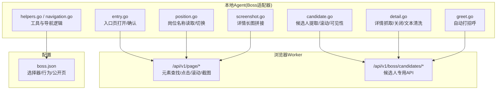
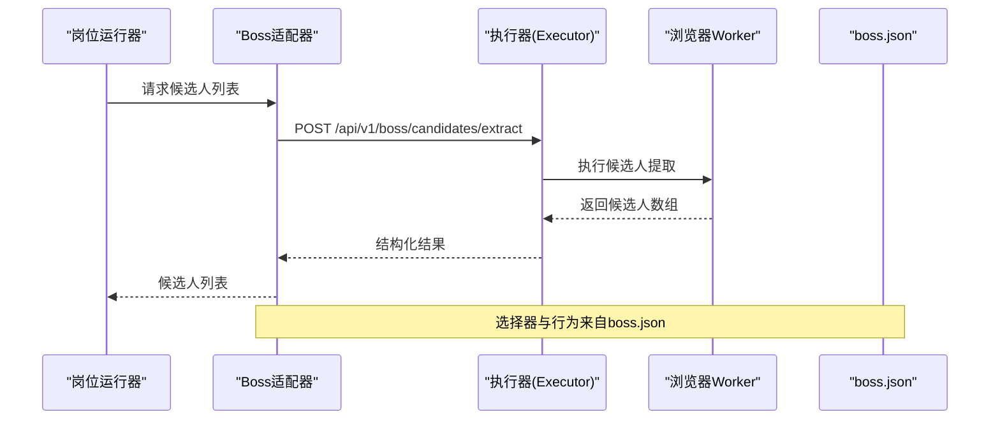
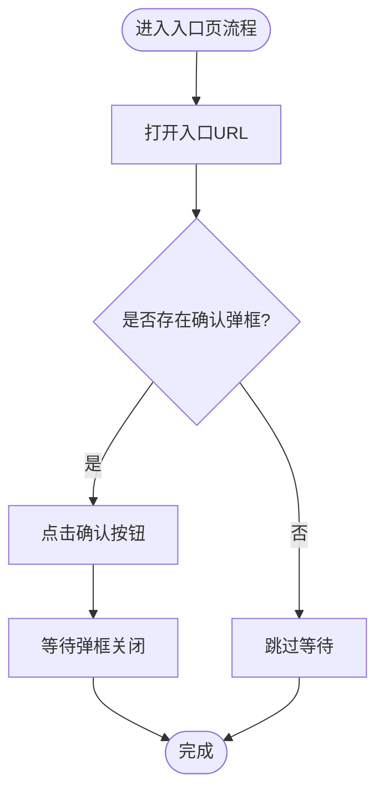
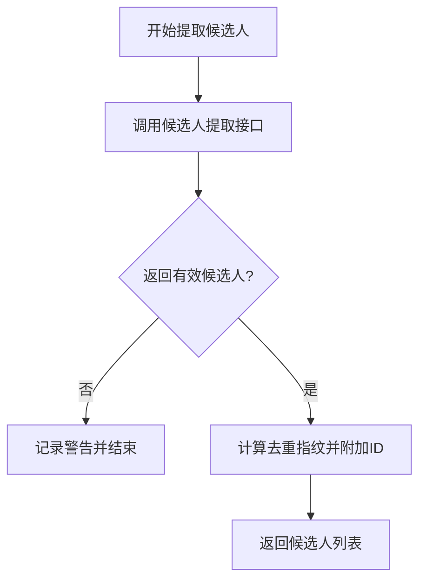
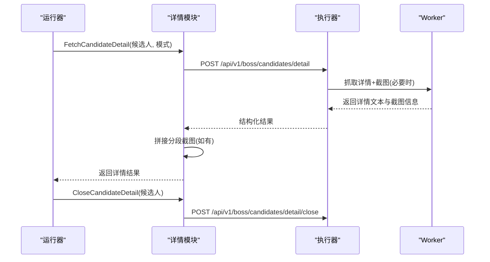
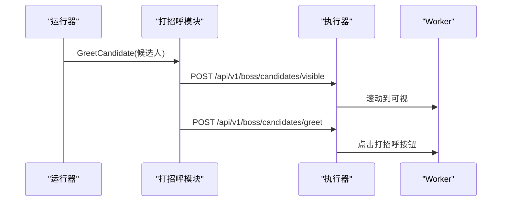
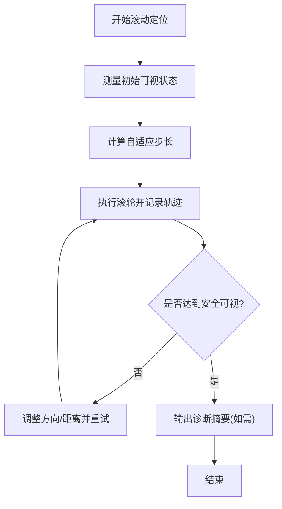
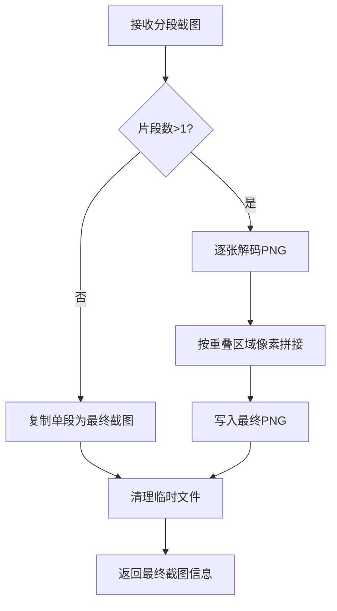
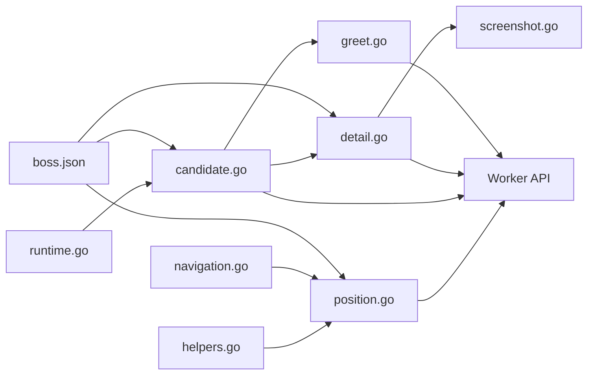

# Boss直聘适配器

<cite>
**本文引用的文件**
- [entry.go](file://goodhr5/local-agent-go/internal/platforms/boss/entry.go)
- [runtime.go](file://goodhr5/local-agent-go/internal/platforms/boss/runtime.go)
- [position.go](file://goodhr5/local-agent-go/internal/platforms/boss/position.go)
- [candidate.go](file://goodhr5/local-agent-go/internal/platforms/boss/candidate.go)
- [detail.go](file://goodhr5/local-agent-go/internal/platforms/boss/detail.go)
- [greet.go](file://goodhr5/local-agent-go/internal/platforms/boss/greet.go)
- [helpers.go](file://goodhr5/local-agent-go/internal/platforms/boss/helpers.go)
- [navigation.go](file://goodhr5/local-agent-go/internal/platforms/boss/navigation.go)
- [followup.go](file://goodhr5/local-agent-go/internal/platforms/boss/followup.go)
- [screenshot.go](file://goodhr5/local-agent-go/internal/platforms/boss/screenshot.go)
- [boss.json](file://goodhr5/cloud/backend/boss.json)
- [boss-scroll-anchor.js](file://goodhr5/local-agent-go/worker-node/src/boss-scroll-anchor.js)
- [boss-scroll-diagnostic.js](file://goodhr5/local-agent-go/worker-node/src/boss-scroll-diagnostic.js)
</cite>

## 目录
1. [简介](#简介)
2. [项目结构](#项目结构)
3. [核心组件](#核心组件)
4. [架构总览](#架构总览)
5. [详细组件分析](#详细组件分析)
6. [依赖关系分析](#依赖关系分析)
7. [性能考虑](#性能考虑)
8. [故障排查指南](#故障排查指南)
9. [结论](#结论)
10. [附录](#附录)

## 简介
本文件为Boss直聘平台适配器的完整技术文档，聚焦以下目标：
- 解析Boss直聘页面结构与DOM定位策略
- 说明用户交互模拟方法（点击、滚动、输入、关闭弹窗等）
- 详解岗位搜索、候选人列表获取、简历详情解析、自动打招呼等核心流程
- 总结Boss特有的反爬与加载等待策略、异常处理方案
- 给出Boss平台特殊配置项、性能优化技巧与调试方法
- 说明与本地Worker执行器及云端配置的交互方式与数据同步策略

## 项目结构
Boss直聘适配位于本地Agent的“平台实现”层，采用Go语言编写，通过统一的执行器接口调用浏览器Worker提供的HTTP API完成页面操作。关键目录与职责：
- internal/platforms/boss：Boss平台运行时实现，包含入口页、岗位切换、候选人提取、详情抓取、打招呼、截图拼接等能力
- worker-node/src：Boss相关的浏览器端脚本，负责滚动锚点安全判断、自适应滚轮距离、滚动失败诊断等
- cloud/backend/boss.json：Boss平台的页面选择器、行为开关、公开登录页等配置



图表来源
- [entry.go:14-53](file://goodhr5/local-agent-go/internal/platforms/boss/entry.go#L14-L53)
- [position.go:14-119](file://goodhr5/local-agent-go/internal/platforms/boss/position.go#L14-L119)
- [candidate.go:15-68](file://goodhr5/local-agent-go/internal/platforms/boss/candidate.go#L15-L68)
- [detail.go:16-64](file://goodhr5/local-agent-go/internal/platforms/boss/detail.go#L16-L64)
- [greet.go:13-22](file://goodhr5/local-agent-go/internal/platforms/boss/greet.go#L13-L22)
- [screenshot.go:21-168](file://goodhr5/local-agent-go/internal/platforms/boss/screenshot.go#L21-L168)
- [boss.json:1-195](file://goodhr5/cloud/backend/boss.json#L1-L195)

章节来源
- [entry.go:14-53](file://goodhr5/local-agent-go/internal/platforms/boss/entry.go#L14-L53)
- [position.go:14-119](file://goodhr5/local-agent-go/internal/platforms/boss/position.go#L14-L119)
- [candidate.go:15-68](file://goodhr5/local-agent-go/internal/platforms/boss/candidate.go#L15-L68)
- [detail.go:16-64](file://goodhr5/local-agent-go/internal/platforms/boss/detail.go#L16-L64)
- [greet.go:13-22](file://goodhr5/local-agent-go/internal/platforms/boss/greet.go#L13-L22)
- [screenshot.go:21-168](file://goodhr5/local-agent-go/internal/platforms/boss/screenshot.go#L21-L168)
- [boss.json:1-195](file://goodhr5/cloud/backend/boss.json#L1-L195)

## 核心组件
- 入口页管理：打开入口、处理确认弹窗、校验当前是否仍在入口页
- 岗位管理：读取当前岗位名、通过搜索或列表切换岗位
- 候选人管理：提取可见候选人、滚动列表、确保卡片可见、生成去重指纹
- 详情管理：抓取候选人详情（支持OCR/AI/结构模式）、关闭详情、清洗无关文本
- 打招呼：将候选人滚动至可视区域并触发打招呼按钮
- 截图拼接：将分段详情截图按重叠区域纵向拼接为长图
- 辅助工具：统一元素协议转换、日志格式化、页面匹配、岗位名规范化

章节来源
- [entry.go:14-72](file://goodhr5/local-agent-go/internal/platforms/boss/entry.go#L14-L72)
- [position.go:14-199](file://goodhr5/local-agent-go/internal/platforms/boss/position.go#L14-L199)
- [candidate.go:15-87](file://goodhr5/local-agent-go/internal/platforms/boss/candidate.go#L15-L87)
- [detail.go:16-108](file://goodhr5/local-agent-go/internal/platforms/boss/detail.go#L16-L108)
- [greet.go:13-22](file://goodhr5/local-agent-go/internal/platforms/boss/greet.go#L13-L22)
- [screenshot.go:21-374](file://goodhr5/local-agent-go/internal/platforms/boss/screenshot.go#L21-L374)
- [helpers.go:9-207](file://goodhr5/local-agent-go/internal/platforms/boss/helpers.go#L9-L207)
- [navigation.go:12-162](file://goodhr5/local-agent-go/internal/platforms/boss/navigation.go#L12-L162)

## 架构总览
Boss适配器采用“Go运行时 + Worker HTTP API + 平台配置”的分层架构：
- Go运行时负责业务编排、参数组装、错误处理与日志输出
- Worker提供稳定的页面操作API（元素查找、点击、滚动、截图、候选人专用接口）
- boss.json定义选择器、行为开关、公开页与入口页匹配规则



图表来源
- [candidate.go:15-48](file://goodhr5/local-agent-go/internal/platforms/boss/candidate.go#L15-L48)
- [boss.json:26-69](file://goodhr5/cloud/backend/boss.json#L26-L69)

章节来源
- [candidate.go:15-48](file://goodhr5/local-agent-go/internal/platforms/boss/candidate.go#L15-L48)
- [boss.json:26-69](file://goodhr5/cloud/backend/boss.json#L26-L69)

## 详细组件分析

### 入口页与确认弹窗处理
- 打开入口页：校验入口URL并通过执行器打开页面
- 准备入口页：检测并点击确认弹框（如存在），随后短暂延迟等待关闭
- 判断是否在入口页：获取当前默认页面URL并与配置中的入口匹配



图表来源
- [entry.go:14-53](file://goodhr5/local-agent-go/internal/platforms/boss/entry.go#L14-L53)
- [entry.go:55-72](file://goodhr5/local-agent-go/internal/platforms/boss/entry.go#L55-L72)

章节来源
- [entry.go:14-53](file://goodhr5/local-agent-go/internal/platforms/boss/entry.go#L14-L53)
- [entry.go:55-72](file://goodhr5/local-agent-go/internal/platforms/boss/entry.go#L55-L72)

### 岗位搜索与切换
- 读取当前岗位名：从配置的选择器中提取文本
- 切换岗位：优先尝试通过岗位搜索框输入关键词匹配；若不可用则回退到滚动列表逐项查找并点击
- 搜索框策略：清理括号说明、截取前缀，多次刷新后匹配；未命中时清空并回退

```mermaid
sequenceDiagram
participant R as "运行器"
participant P as "岗位模块"
participant E as "执行器"
participant W as "Worker"
R->>P : SelectPosition(目标岗位)
P->>E : 点击岗位切换按钮
E->>W : 展开岗位列表
alt 存在搜索框
P->>E : 输入搜索关键词
E->>W : 刷新搜索结果
loop 最多4次
E->>W : 查找匹配岗位项
W-->>E : 返回候选项
end
opt 找到匹配
E->>W : 滚动到可视并点击
else 未找到
E->>W : 清空搜索框
P->>E : 回退到列表滚动查找
end
else 无搜索框
P->>E : 遍历列表查找并点击
end
```

图表来源
- [position.go:32-119](file://goodhr5/local-agent-go/internal/platforms/boss/position.go#L32-L119)
- [position.go:121-199](file://goodhr5/local-agent-go/internal/platforms/boss/position.go#L121-L199)
- [navigation.go:73-93](file://goodhr5/local-agent-go/internal/platforms/boss/navigation.go#L73-L93)

章节来源
- [position.go:32-119](file://goodhr5/local-agent-go/internal/platforms/boss/position.go#L32-L119)
- [position.go:121-199](file://goodhr5/local-agent-go/internal/platforms/boss/position.go#L121-L199)
- [navigation.go:73-93](file://goodhr5/local-agent-go/internal/platforms/boss/navigation.go#L73-L93)

### 候选人列表获取与可见性保证
- 提取候选人：调用专用接口批量提取，附带平台配置与最大数量限制
- 滚动列表：按距离滚动以加载更多候选人
- 确保可见：使用小步滚轮滚动到指定候选人卡片，结合安全边距与自适应步长
- 去重指纹：基于姓名与年龄生成稳定ID，避免重复处理



图表来源
- [candidate.go:15-48](file://goodhr5/local-agent-go/internal/platforms/boss/candidate.go#L15-L48)
- [candidate.go:51-68](file://goodhr5/local-agent-go/internal/platforms/boss/candidate.go#L51-L68)
- [runtime.go:19-34](file://goodhr5/local-agent-go/internal/platforms/boss/runtime.go#L19-L34)

章节来源
- [candidate.go:15-48](file://goodhr5/local-agent-go/internal/platforms/boss/candidate.go#L15-L48)
- [candidate.go:51-68](file://goodhr5/local-agent-go/internal/platforms/boss/candidate.go#L51-L68)
- [runtime.go:19-34](file://goodhr5/local-agent-go/internal/platforms/boss/runtime.go#L19-L34)

### 简历详情解析与关闭
- 抓取详情：根据模式（DOM/OCR/AI）调用详情接口，携带截图与滚动参数
- 截图拼接：对分段截图进行像素级纵向拼接，输出固定长图
- 关闭详情：通过按键或按钮关闭候选人详情弹窗
- 文本清洗：去除平台附加内容（如“牛人分析器”）



图表来源
- [detail.go:16-64](file://goodhr5/local-agent-go/internal/platforms/boss/detail.go#L16-L64)
- [detail.go:66-108](file://goodhr5/local-agent-go/internal/platforms/boss/detail.go#L66-L108)
- [screenshot.go:21-168](file://goodhr5/local-agent-go/internal/platforms/boss/screenshot.go#L21-L168)

章节来源
- [detail.go:16-64](file://goodhr5/local-agent-go/internal/platforms/boss/detail.go#L16-L64)
- [detail.go:66-108](file://goodhr5/local-agent-go/internal/platforms/boss/detail.go#L66-L108)
- [screenshot.go:21-168](file://goodhr5/local-agent-go/internal/platforms/boss/screenshot.go#L21-L168)

### 自动打招呼
- 先确保候选人卡片可见（小步滚动+安全边距）
- 再调用打招呼专用接口触发按钮点击



图表来源
- [greet.go:13-22](file://goodhr5/local-agent-go/internal/platforms/boss/greet.go#L13-L22)
- [candidate.go:61-68](file://goodhr5/local-agent-go/internal/platforms/boss/candidate.go#L61-L68)

章节来源
- [greet.go:13-22](file://goodhr5/local-agent-go/internal/platforms/boss/greet.go#L13-L22)
- [candidate.go:61-68](file://goodhr5/local-agent-go/internal/platforms/boss/candidate.go#L61-L68)

### 页面加载等待与反爬虫应对
- 加载等待：在关键步骤使用显式延迟（如弹框关闭、搜索结果刷新、滚动后等待）
- 反爬应对：
  - 小步滚轮与自适应步长，避免快速连续滚动触发风控
  - 安全边距检查，确保鼠标移动发生在安全区域内
  - 失败诊断：汇总滚动轨迹、方向切换、无效滚动次数，输出中文结论便于定位
- 页面匹配：支持前缀/包含/精确匹配入口页，兼容不同路由形态



图表来源
- [boss-scroll-anchor.js:15-171](file://goodhr5/local-agent-go/worker-node/src/boss-scroll-anchor.js#L15-L171)
- [boss-scroll-diagnostic.js:68-252](file://goodhr5/local-agent-go/worker-node/src/boss-scroll-diagnostic.js#L68-L252)
- [position.go:42-43](file://goodhr5/local-agent-go/internal/platforms/boss/position.go#L42-L43)
- [position.go:139-142](file://goodhr5/local-agent-go/internal/platforms/boss/position.go#L139-L142)

章节来源
- [boss-scroll-anchor.js:15-171](file://goodhr5/local-agent-go/worker-node/src/boss-scroll-anchor.js#L15-L171)
- [boss-scroll-diagnostic.js:68-252](file://goodhr5/local-agent-go/worker-node/src/boss-scroll-diagnostic.js#L68-L252)
- [position.go:42-43](file://goodhr5/local-agent-go/internal/platforms/boss/position.go#L42-L43)
- [position.go:139-142](file://goodhr5/local-agent-go/internal/platforms/boss/position.go#L139-L142)

### 截图拼接算法与性能
- 分段截图：Worker按可滚动容器分段截图，返回片段元数据
- 拼接策略：按预期重叠区域寻找最佳对齐位置，逐张合并为RGBA图像并写入PNG
- 降级策略：仅一段或解码失败时直接复制单段作为最终截图
- 资源清理：删除临时分段文件，保留最终长图



图表来源
- [screenshot.go:21-168](file://goodhr5/local-agent-go/internal/platforms/boss/screenshot.go#L21-L168)
- [screenshot.go:170-235](file://goodhr5/local-agent-go/internal/platforms/boss/screenshot.go#L170-L235)
- [screenshot.go:237-331](file://goodhr5/local-agent-go/internal/platforms/boss/screenshot.go#L237-L331)

章节来源
- [screenshot.go:21-168](file://goodhr5/local-agent-go/internal/platforms/boss/screenshot.go#L21-L168)
- [screenshot.go:170-235](file://goodhr5/local-agent-go/internal/platforms/boss/screenshot.go#L170-L235)
- [screenshot.go:237-331](file://goodhr5/local-agent-go/internal/platforms/boss/screenshot.go#L237-L331)

## 依赖关系分析
- 内部依赖：
  - helpers.go：统一元素协议转换、日志格式化、字段提取
  - navigation.go：入口页匹配、岗位名规范化、列表项元素合并
  - runtime.go：候选人可见性通用参数、年龄提取、ID规范化
- 外部依赖：
  - 执行器Executor：封装浏览器Worker的HTTP API
  - 平台配置boss.json：选择器、行为开关、公开页、入口页匹配规则



图表来源
- [helpers.go:112-160](file://goodhr5/local-agent-go/internal/platforms/boss/helpers.go#L112-L160)
- [navigation.go:12-71](file://goodhr5/local-agent-go/internal/platforms/boss/navigation.go#L12-L71)
- [runtime.go:19-61](file://goodhr5/local-agent-go/internal/platforms/boss/runtime.go#L19-L61)
- [position.go:32-119](file://goodhr5/local-agent-go/internal/platforms/boss/position.go#L32-L119)
- [candidate.go:15-68](file://goodhr5/local-agent-go/internal/platforms/boss/candidate.go#L15-L68)
- [detail.go:16-64](file://goodhr5/local-agent-go/internal/platforms/boss/detail.go#L16-L64)
- [greet.go:13-22](file://goodhr5/local-agent-go/internal/platforms/boss/greet.go#L13-L22)
- [boss.json:1-195](file://goodhr5/cloud/backend/boss.json#L1-L195)

章节来源
- [helpers.go:112-160](file://goodhr5/local-agent-go/internal/platforms/boss/helpers.go#L112-L160)
- [navigation.go:12-71](file://goodhr5/local-agent-go/internal/platforms/boss/navigation.go#L12-L71)
- [runtime.go:19-61](file://goodhr5/local-agent-go/internal/platforms/boss/runtime.go#L19-L61)
- [position.go:32-119](file://goodhr5/local-agent-go/internal/platforms/boss/position.go#L32-L119)
- [candidate.go:15-68](file://goodhr5/local-agent-go/internal/platforms/boss/candidate.go#L15-L68)
- [detail.go:16-64](file://goodhr5/local-agent-go/internal/platforms/boss/detail.go#L16-L64)
- [greet.go:13-22](file://goodhr5/local-agent-go/internal/platforms/boss/greet.go#L13-L22)
- [boss.json:1-195](file://goodhr5/cloud/backend/boss.json#L1-L195)

## 性能考虑
- 滚动效率：
  - 使用自适应滚轮距离与扩大重试预算，减少远距离目标的滚动耗时
  - 小步滚动与安全边距检查，降低无效滚动与风控风险
- 截图拼接：
  - 仅在多段情况下进行像素拼接，单段直接复制以提升速度
  - 及时清理临时分段文件，释放磁盘与内存
- 网络与并发：
  - 批量提取候选人，减少多次往返
  - 关键路径添加合理延迟，避免竞态与抖动

[本节为通用指导，不直接分析具体文件]

## 故障排查指南
- 常见问题定位：
  - 候选人滚动失败：查看滚动诊断信息（方向切换、无效滚动、目标不可测等）
  - 详情页截图为空：检查分段截图返回与文件路径，确认Worker截图逻辑
  - 岗位搜索未命中：确认搜索关键词规范化与刷新次数，必要时回退到列表查找
- 调试建议：
  - 启用截图调试信息，关注分段数量与滚动容器状态
  - 查看Worker日志中的逐次滚动轨迹与视口信息
  - 核对boss.json中选择器是否与当前页面结构一致

章节来源
- [boss-scroll-diagnostic.js:68-252](file://goodhr5/local-agent-go/worker-node/src/boss-scroll-diagnostic.js#L68-L252)
- [detail.go:44-62](file://goodhr5/local-agent-go/internal/platforms/boss/detail.go#L44-L62)
- [position.go:121-199](file://goodhr5/local-agent-go/internal/platforms/boss/position.go#L121-L199)
- [boss.json:26-94](file://goodhr5/cloud/backend/boss.json#L26-L94)

## 结论
Boss直聘适配器通过清晰的模块化设计与稳健的Worker API调用，实现了岗位搜索、候选人提取、详情抓取与自动打招呼等核心功能。借助自适应滚动、安全边距检查与滚动失败诊断，有效应对Boss的反爬机制与页面动态变化。配合boss.json的配置化选择器与行为开关，可在平台UI变更时快速调整，保障长期稳定性与可维护性。

[本节为总结，不直接分析具体文件]

## 附录

### Boss平台特殊配置选项（来自boss.json）
- 认证与入口页：pages、entry_url、login_url_prefixes、logged_in_url_prefix/contains
- 候选人卡片：item、fields、scroll
- 详情页：content、closeBtn、openTarget、messageItem
- 动作按钮：greetBtn、phoneBtn、resumeBtn、wechatBtn、confirmBtn、continueBtn
- 行为：nextPageBtn、supportsPaging、needsDetailPage、nextPageDisabledClass
- 岗位列表：item、list、current、itemText、switchBtn、clickTarget
- 公开页：public.pages（用于登录引导）

章节来源
- [boss.json:1-195](file://goodhr5/cloud/backend/boss.json#L1-L195)

### 与Worker的交互方式与数据同步策略
- 页面操作：/api/v1/page/*（查找、点击、滚动、截图、文本提取）
- 候选人专用：/api/v1/boss/candidates/*（提取、滚动、可见性、打招呼、详情）
- 数据同步：
  - 平台配置由boss.json注入，Go侧通过elementPayload转换为Worker统一协议
  - 候选人去重指纹由Go侧生成，Worker返回结构化数据供上层持久化
  - 截图分段由Worker生成，Go侧拼接并清理临时文件，最终输出长图

章节来源
- [helpers.go:132-160](file://goodhr5/local-agent-go/internal/platforms/boss/helpers.go#L132-L160)
- [candidate.go:15-48](file://goodhr5/local-agent-go/internal/platforms/boss/candidate.go#L15-L48)
- [detail.go:16-64](file://goodhr5/local-agent-go/internal/platforms/boss/detail.go#L16-L64)
- [screenshot.go:21-168](file://goodhr5/local-agent-go/internal/platforms/boss/screenshot.go#L21-L168)