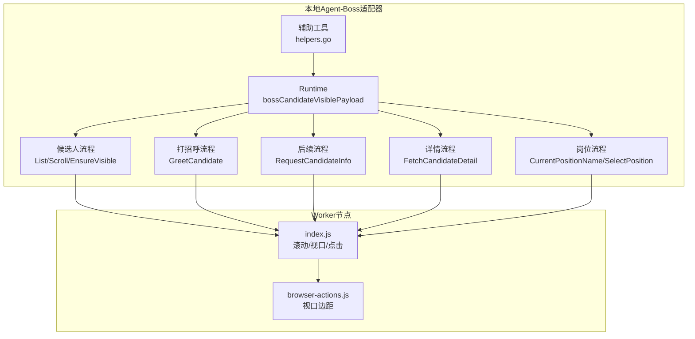
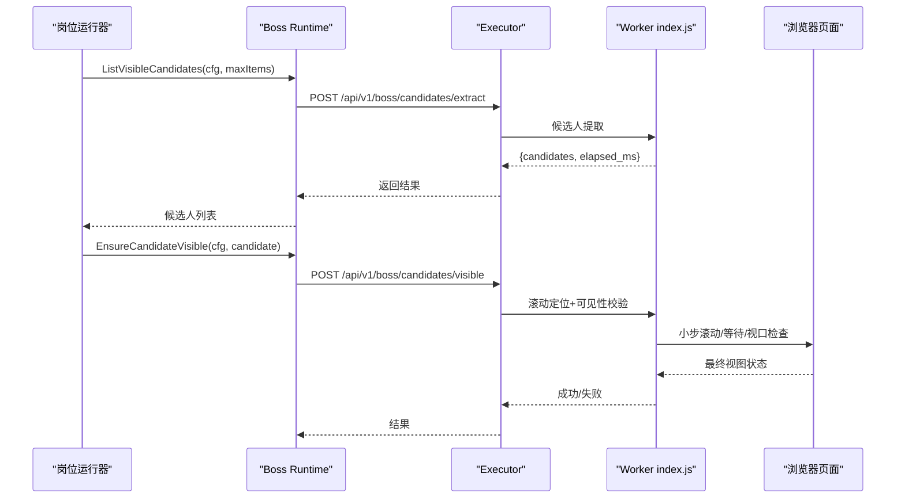
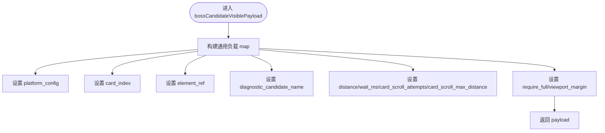
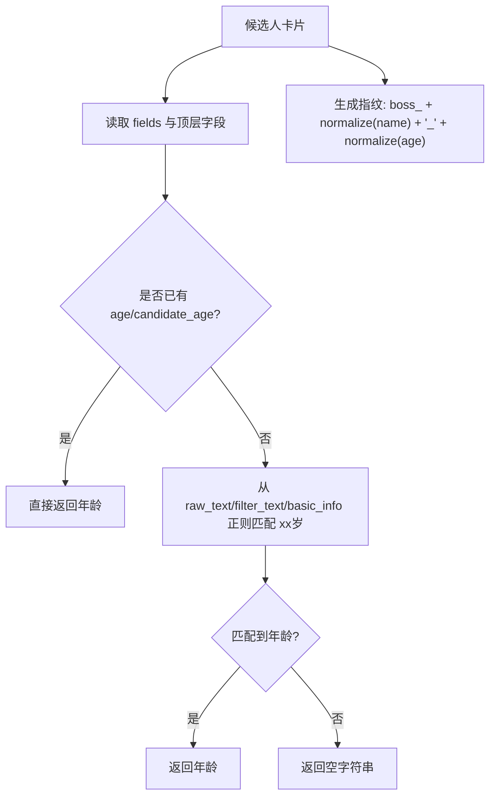
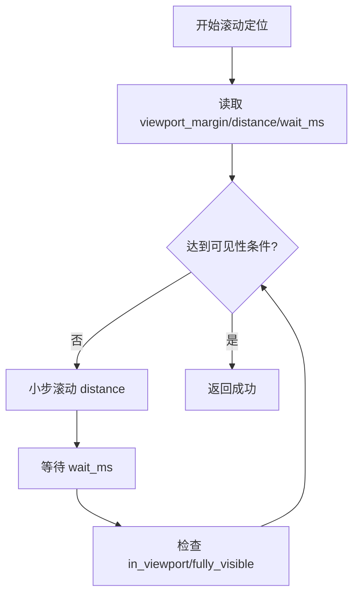
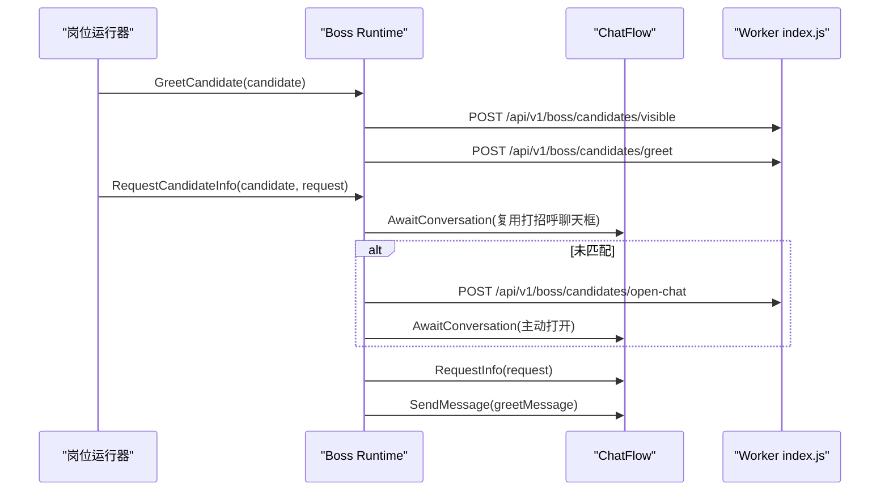
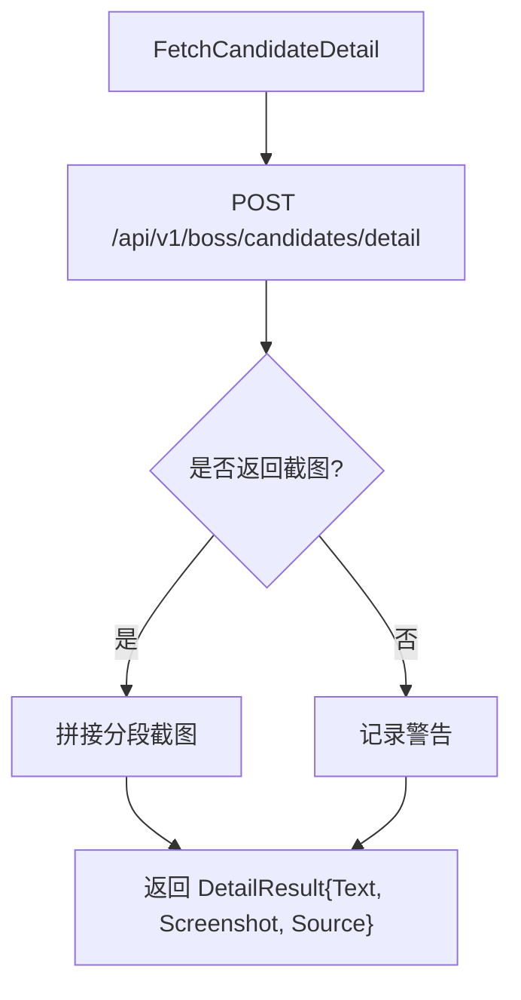
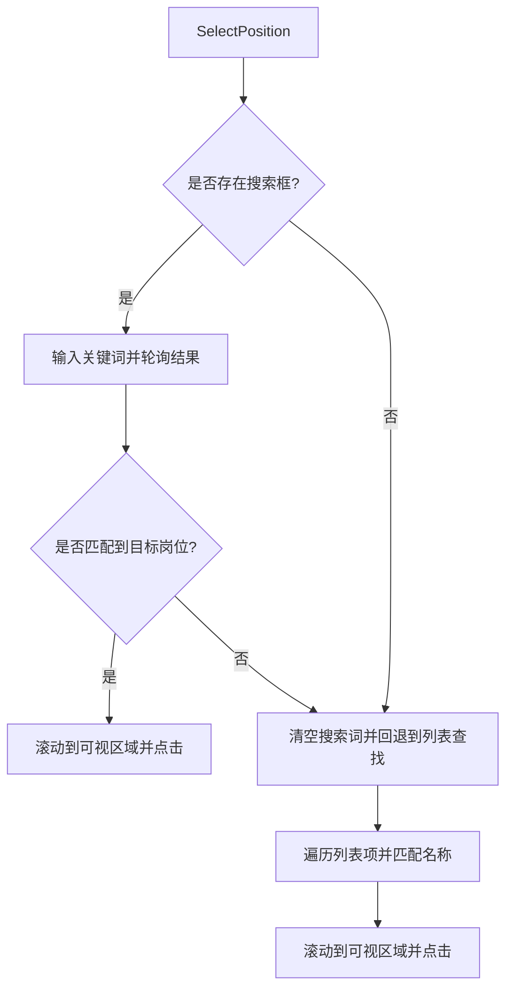
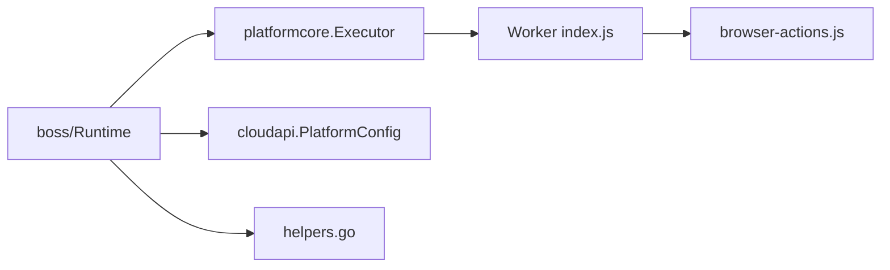

# Boss运行时环境

<cite>
**本文引用的文件**   
- [runtime.go](file://goodhr5/local-agent-go/internal/platforms/boss/runtime.go)
- [candidate.go](file://goodhr5/local-agent-go/internal/platforms/boss/candidate.go)
- [greet.go](file://goodhr5/local-agent-go/internal/platforms/boss/greet.go)
- [followup.go](file://goodhr5/local-agent-go/internal/platforms/boss/followup.go)
- [detail.go](file://goodhr5/local-agent-go/internal/platforms/boss/detail.go)
- [position.go](file://goodhr5/local-agent-go/internal/platforms/boss/position.go)
- [helpers.go](file://goodhr5/local-agent-go/internal/platforms/boss/helpers.go)
- [index.js](file://goodhr5/local-agent-go/worker-node/src/index.js)
- [browser-actions.js](file://goodhr5/local-agent-go/worker-node/src/browser-actions.js)
</cite>

## 目录
1. [引言](#引言)
2. [项目结构](#项目结构)
3. [核心组件](#核心组件)
4. [架构总览](#架构总览)
5. [详细组件分析](#详细组件分析)
6. [依赖关系分析](#依赖关系分析)
7. [性能与调优](#性能与调优)
8. [错误处理与诊断](#错误处理与诊断)
9. [云端通信与数据同步](#云端通信与数据同步)
10. [结论](#结论)

## 引言
本文聚焦Boss直聘平台的本地运行时环境，围绕初始化、配置管理、候选人可见性检测、候选人生成策略、滚动定位算法、年龄提取与ID规范化、诊断信息收集、平台特有配置项、性能参数、错误处理策略，以及与云端API的通信和数据同步机制进行系统化说明。文档以代码级实现为依据，帮助开发者快速理解Boss运行时的行为边界与扩展点。

## 项目结构
Boss平台运行时位于本地Agent的Boss适配器中，负责将平台操作委托给统一的执行器接口，并通过HTTP调用Worker提供的内部API完成浏览器端动作。关键文件职责如下：
- runtime.go：定义Boss运行时类型、候选人可见性通用负载构造、年龄提取与ID规范化。
- candidate.go：候选人列表提取、滚动、可见性保证、筛选文本与指纹生成。
- greet.go：打招呼流程，先确保可见再发起打招呼请求。
- followup.go：打招呼后聊天框复用与索要信息流程。
- detail.go：候选人详情提取、截图拼接、详情关闭。
- position.go：当前岗位读取、岗位切换（搜索或列表）。
- helpers.go：通用工具函数、元素选择器转换、日志摘要等。
- worker-node/src/index.js 与 browser-actions.js：Worker侧滚动、视口安全边距、点击等底层能力。

图表来源
- [runtime.go:11-36](file://goodhr5/local-agent-go/internal/platforms/boss/runtime.go#L11-L36)
- [candidate.go:13-86](file://goodhr5/local-agent-go/internal/platforms/boss/candidate.go#L13-L86)
- [greet.go:11-23](file://goodhr5/local-agent-go/internal/platforms/boss/greet.go#L11-L23)
- [followup.go:16-116](file://goodhr5/local-agent-go/internal/platforms/boss/followup.go#L16-L116)
- [detail.go:14-107](file://goodhr5/local-agent-go/internal/platforms/boss/detail.go#L14-L107)
- [position.go:12-199](file://goodhr5/local-agent-go/internal/platforms/boss/position.go#L12-L199)
- [helpers.go:9-206](file://goodhr5/local-agent-go/internal/platforms/boss/helpers.go#L9-L206)
- [index.js:859-2201](file://goodhr5/local-agent-go/worker-node/src/index.js#L859-L2201)
- [browser-actions.js:616-616](file://goodhr5/local-agent-go/worker-node/src/browser-actions.js#L616-L616)

章节来源
- [runtime.go:1-64](file://goodhr5/local-agent-go/internal/platforms/boss/runtime.go#L1-L64)
- [candidate.go:1-87](file://goodhr5/local-agent-go/internal/platforms/boss/candidate.go#L1-L87)
- [greet.go:1-24](file://goodhr5/local-agent-go/internal/platforms/boss/greet.go#L1-L24)
- [followup.go:1-117](file://goodhr5/local-agent-go/internal/platforms/boss/followup.go#L1-L117)
- [detail.go:1-108](file://goodhr5/local-agent-go/internal/platforms/boss/detail.go#L1-L108)
- [position.go:1-200](file://goodhr5/local-agent-go/internal/platforms/boss/position.go#L1-L200)
- [helpers.go:1-207](file://goodhr5/local-agent-go/internal/platforms/boss/helpers.go#L1-L207)

## 核心组件
- Runtime：Boss平台运行时入口，封装候选人可见性负载、年龄提取、ID规范化等能力。
- 候选人流程：提供候选人列表提取、滚动、可见性保证、筛选文本与指纹生成。
- 打招呼流程：先确保候选人可见，再发起打招呼请求。
- 后续流程：在已确认身份的聊天框内按岗位配置索要信息并发送追加问候语。
- 详情流程：提取候选人详情文本与截图，支持OCR/AI模式，自动拼接长图。
- 岗位流程：读取当前岗位名称，支持通过搜索框或列表切换目标岗位。
- 辅助工具：统一解析Worker响应、元素选择器协议转换、日志摘要等。

章节来源
- [runtime.go:11-64](file://goodhr5/local-agent-go/internal/platforms/boss/runtime.go#L11-L64)
- [candidate.go:13-86](file://goodhr5/local-agent-go/internal/platforms/boss/candidate.go#L13-L86)
- [greet.go:11-23](file://goodhr5/local-agent-go/internal/platforms/boss/greet.go#L11-L23)
- [followup.go:45-116](file://goodhr5/local-agent-go/internal/platforms/boss/followup.go#L45-L116)
- [detail.go:14-107](file://goodhr5/local-agent-go/internal/platforms/boss/detail.go#L14-L107)
- [position.go:12-199](file://goodhr5/local-agent-go/internal/platforms/boss/position.go#L12-L199)
- [helpers.go:9-206](file://goodhr5/local-agent-go/internal/platforms/boss/helpers.go#L9-L206)

## 架构总览
Boss运行时采用“Go适配器 + Worker节点”的分层架构：
- Go侧Runtime通过platformcore.Executor统一调用Worker API，传递平台配置与业务参数。
- Worker侧index.js与browser-actions.js实现浏览器端的滚动、点击、视口检查、截图等能力。
- 平台配置cloudapi.PlatformConfig由云端下发，包含选择器与行为规则，Go侧将其透传至Worker。

图表来源
- [candidate.go:15-48](file://goodhr5/local-agent-go/internal/platforms/boss/candidate.go#L15-L48)
- [candidate.go:61-68](file://goodhr5/local-agent-go/internal/platforms/boss/candidate.go#L61-L68)
- [index.js:859-2201](file://goodhr5/local-agent-go/worker-node/src/index.js#L859-L2201)

## 详细组件分析

### bossCandidateVisiblePayload函数与候选人可见性检测
- 作用：构造Boss候选人可见性检测的通用负载，包含平台配置、卡片序号、元素引用、诊断名称以及滚动与视口相关参数。
- 关键参数：
  - platform_config：平台配置，透传给Worker用于选择器与行为控制。
  - card_index：候选人卡片序号，用于定位与日志。
  - element_ref：元素引用，辅助Worker快速定位目标。
  - diagnostic_candidate_name：诊断名称，便于日志检索。
  - distance：单次滚动距离。
  - wait_ms：滚动后等待时间。
  - card_scroll_attempts：外层滚动轮数。
  - card_scroll_max_distance：单步最大滚动距离。
  - require_full：是否要求完整可见。
  - viewport_margin：视口安全边距。

图表来源
- [runtime.go:21-36](file://goodhr5/local-agent-go/internal/platforms/boss/runtime.go#L21-L36)

章节来源
- [runtime.go:21-36](file://goodhr5/local-agent-go/internal/platforms/boss/runtime.go#L21-L36)

### 候选人生成策略与去重指纹
- 候选人列表提取：通过POST /api/v1/boss/candidates/extract获取候选人卡片，记录find_elapsed_ms、convert_elapsed_ms、elapsed_ms等耗时指标。
- 指纹生成：使用姓名与年龄组合生成稳定ID，前缀为boss_，并对姓名与年龄分别做规范化处理。
- 年龄提取：优先从结构化字段读取age或candidate_age；若缺失则从raw_text/filter_text/basic_info中用正则匹配“xx岁”。

图表来源
- [runtime.go:38-63](file://goodhr5/local-agent-go/internal/platforms/boss/runtime.go#L38-L63)
- [candidate.go:76-86](file://goodhr5/local-agent-go/internal/platforms/boss/candidate.go#L76-L86)

章节来源
- [candidate.go:15-48](file://goodhr5/local-agent-go/internal/platforms/boss/candidate.go#L15-L48)
- [runtime.go:38-63](file://goodhr5/local-agent-go/internal/platforms/boss/runtime.go#L38-L63)

### 滚动定位算法与视口安全边距
- 可见性保证：EnsureCandidateVisible调用POST /api/v1/boss/candidates/visible，传入distance、wait_ms、card_scroll_attempts、card_scroll_max_distance、require_full、viewport_margin等参数。
- Worker侧滚动：index.js根据payload中的viewport_margin计算安全边距，结合distance与wait_ms进行小步滚动与等待，直至满足in_viewport与fully_visible条件。
- 视口边距：不同场景下viewport_margin取值不同，例如候选人可见性检测默认0，详情提取默认80，岗位点击默认24或40。

图表来源
- [candidate.go:61-68](file://goodhr5/local-agent-go/internal/platforms/boss/candidate.go#L61-L68)
- [index.js:859-2201](file://goodhr5/local-agent-go/worker-node/src/index.js#L859-L2201)
- [browser-actions.js:616-616](file://goodhr5/local-agent-go/worker-node/src/browser-actions.js#L616-L616)

章节来源
- [candidate.go:61-68](file://goodhr5/local-agent-go/internal/platforms/boss/candidate.go#L61-L68)
- [detail.go:20-37](file://goodhr5/local-agent-go/internal/platforms/boss/detail.go#L20-L37)
- [position.go:92-116](file://goodhr5/local-agent-go/internal/platforms/boss/position.go#L92-L116)
- [index.js:859-2201](file://goodhr5/local-agent-go/worker-node/src/index.js#L859-L2201)

### 打招呼与后续信息索要流程
- 打招呼：GreetCandidate先调用可见性检测，再调用POST /api/v1/boss/candidates/greet。
- 后续信息索要：RequestCandidateInfo优先复用打招呼后自动打开的聊天框，否则主动打开聊天框；随后按岗位配置索要手机号、微信、简历，并可发送追加问候语。
- 聊天框选择器：全局聊天框、姓名、关闭按钮、输入框、发送按钮均有明确选择器定义。

图表来源
- [greet.go:11-23](file://goodhr5/local-agent-go/internal/platforms/boss/greet.go#L11-L23)
- [followup.go:45-116](file://goodhr5/local-agent-go/internal/platforms/boss/followup.go#L45-L116)

章节来源
- [greet.go:11-23](file://goodhr5/local-agent-go/internal/platforms/boss/greet.go#L11-L23)
- [followup.go:16-116](file://goodhr5/local-agent-go/internal/platforms/boss/followup.go#L16-L116)

### 候选人详情提取与截图拼接
- 详情提取：FetchCandidateDetail调用POST /api/v1/boss/candidates/detail，支持ocr/ai模式，开启截图与滚动调试。
- 截图处理：Worker返回分段截图时进行拼接，输出parts_count、scrollable_container等信息；若无截图则记录警告。
- 详情关闭：CloseCandidateDetail通过POST /api/v1/boss/candidates/detail/close模拟Escape键关闭详情窗口。

图表来源
- [detail.go:14-64](file://goodhr5/local-agent-go/internal/platforms/boss/detail.go#L14-L64)
- [detail.go:90-107](file://goodhr5/local-agent-go/internal/platforms/boss/detail.go#L90-L107)

章节来源
- [detail.go:14-107](file://goodhr5/local-agent-go/internal/platforms/boss/detail.go#L14-L107)

### 岗位读取与切换逻辑
- 当前岗位读取：CurrentPositionName通过平台配置的current选择器提取文本，若为空则报错。
- 岗位切换：SelectPosition优先尝试搜索框输入关键词，若不可用则回退到列表滚动查找；找到匹配项后滚动到可视区域并点击。
- 选择器转换：platformElement与elementPayload将云端配置转换为Worker统一元素协议，支持target_classes、parent_classes、find_attempts、find_interval_ms等字段。

图表来源
- [position.go:32-119](file://goodhr5/local-agent-go/internal/platforms/boss/position.go#L32-L119)
- [position.go:121-199](file://goodhr5/local-agent-go/internal/platforms/boss/position.go#L121-L199)
- [helpers.go:112-160](file://goodhr5/local-agent-go/internal/platforms/boss/helpers.go#L112-L160)

章节来源
- [position.go:12-199](file://goodhr5/local-agent-go/internal/platforms/boss/position.go#L12-L199)
- [helpers.go:112-160](file://goodhr5/local-agent-go/internal/platforms/boss/helpers.go#L112-L160)

## 依赖关系分析
- Runtime依赖platformcore.Executor进行HTTP调用，依赖cloudapi.PlatformConfig作为平台配置源。
- Worker侧index.js与browser-actions.js提供滚动、点击、视口检查等底层能力。
- helpers.go提供通用工具函数，降低各模块对原始map结构的耦合度。

图表来源
- [runtime.go:1-19](file://goodhr5/local-agent-go/internal/platforms/boss/runtime.go#L1-L19)
- [helpers.go:9-206](file://goodhr5/local-agent-go/internal/platforms/boss/helpers.go#L9-L206)
- [index.js:859-2201](file://goodhr5/local-agent-go/worker-node/src/index.js#L859-L2201)
- [browser-actions.js:616-616](file://goodhr5/local-agent-go/worker-node/src/browser-actions.js#L616-L616)

章节来源
- [runtime.go:1-19](file://goodhr5/local-agent-go/internal/platforms/boss/runtime.go#L1-L19)
- [helpers.go:9-206](file://goodhr5/local-agent-go/internal/platforms/boss/helpers.go#L9-L206)

## 性能与调优
- 滚动参数：
  - distance：单次滚动距离，影响滚动速度与稳定性。
  - wait_ms：滚动后等待时间，避免DOM未渲染完成。
  - card_scroll_attempts：外层滚动轮数，控制重试次数。
  - card_scroll_max_distance：单步最大滚动距离，限制单次滚动幅度。
- 视口安全边距：
  - viewport_margin：不同场景取值不同，候选人可见性检测默认0，详情提取默认80，岗位点击默认24或40。
- 超时与重试：
  - detail_ready_timeout：详情就绪超时时间。
  - find_attempts/find_interval_ms：元素查找重试次数与间隔。
- 日志与诊断：
  - diagnostic_candidate_name、diagnostic_trace_id、_screenshot_debug、_scroll_debug等字段用于追踪问题。

章节来源
- [runtime.go:21-36](file://goodhr5/local-agent-go/internal/platforms/boss/runtime.go#L21-L36)
- [detail.go:20-37](file://goodhr5/local-agent-go/internal/platforms/boss/detail.go#L20-L37)
- [position.go:92-116](file://goodhr5/local-agent-go/internal/platforms/boss/position.go#L92-L116)
- [helpers.go:112-160](file://goodhr5/local-agent-go/internal/platforms/boss/helpers.go#L112-L160)

## 错误处理与诊断
- 候选人提取失败：记录elapsed时间与错误信息，返回错误给调用方。
- 详情提取失败：包装错误并附带traceID，便于跨进程追踪。
- 聊天框收尾失败：在defer中关闭聊天框，若失败则记录warning并可能覆盖resultErr。
- 岗位未找到：返回明确错误提示，建议核对岗位模板名称与Boss直聘岗位名称一致性。
- 诊断信息：
  - diagnostic_candidate_name：候选人诊断名。
  - diagnostic_trace_id：详情提取追踪编号。
  - _screenshot_debug/_scroll_debug：截图与滚动调试信息。

章节来源
- [candidate.go:15-48](file://goodhr5/local-agent-go/internal/platforms/boss/candidate.go#L15-L48)
- [detail.go:38-41](file://goodhr5/local-agent-go/internal/platforms/boss/detail.go#L38-L41)
- [followup.go:54-66](file://goodhr5/local-agent-go/internal/platforms/boss/followup.go#L54-L66)
- [position.go:118-118](file://goodhr5/local-agent-go/internal/platforms/boss/position.go#L118-L118)

## 云端通信与数据同步
- 通信方式：Runtime通过Executor.Post调用Worker内部API，如/api/v1/boss/candidates/extract、/api/v1/boss/candidates/visible、/api/v1/boss/candidates/greet、/api/v1/boss/candidates/detail等。
- 数据同步：
  - 候选人列表：Worker返回candidates数组与耗时统计，Go侧整理并附加id指纹。
  - 详情数据：Worker返回detail_text与screenshot，Go侧进行截图拼接与清理。
  - 平台配置：cloudapi.PlatformConfig透传到Worker，用于选择器与行为控制。
- 诊断与可观测性：
  - 日志记录：各阶段记录info/warning/error级别日志，包含耗时、名称、traceID等。
  - 调试字段：_screenshot_debug、_scroll_debug、diagnostic_trace_id等辅助定位问题。

章节来源
- [candidate.go:15-48](file://goodhr5/local-agent-go/internal/platforms/boss/candidate.go#L15-L48)
- [detail.go:14-64](file://goodhr5/local-agent-go/internal/platforms/boss/detail.go#L14-L64)
- [helpers.go:75-99](file://goodhr5/local-agent-go/internal/platforms/boss/helpers.go#L75-L99)

## 结论
Boss运行时环境通过Go适配器与Worker节点的协作，实现了候选人可见性检测、滚动定位、打招呼与信息索要、详情提取与截图拼接、岗位切换等核心功能。其设计强调平台配置的可移植性、滚动参数的可调优性、错误处理的健壮性与诊断信息的完备性。开发者可基于现有接口扩展新的平台行为，同时保持与Worker侧能力的解耦。