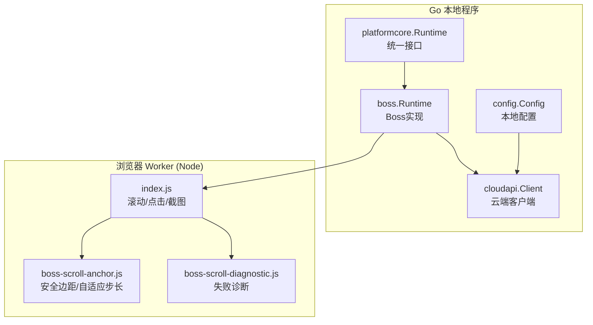
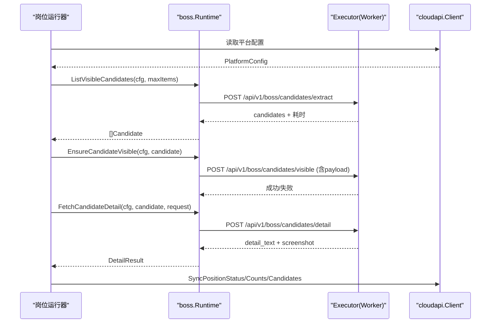
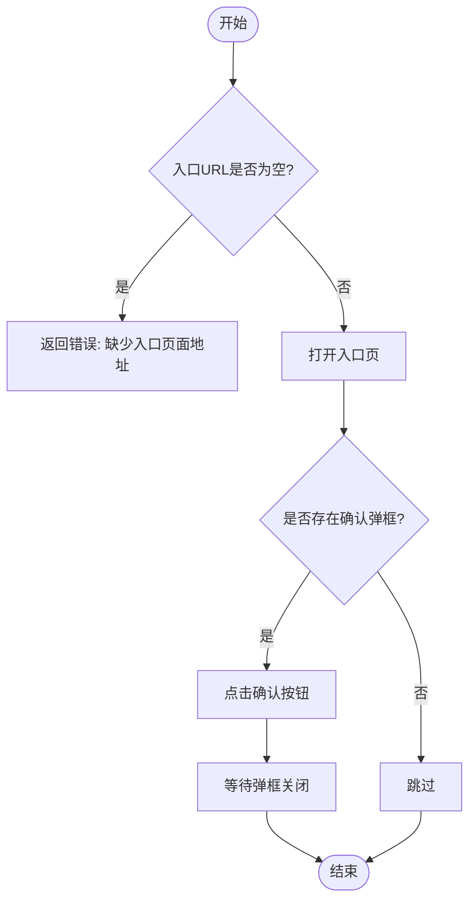
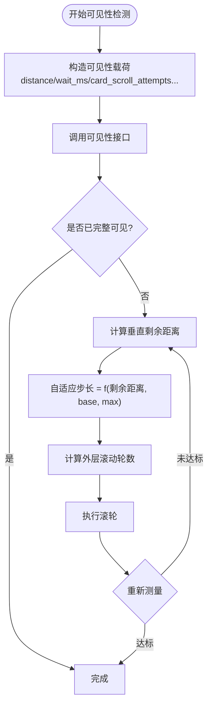
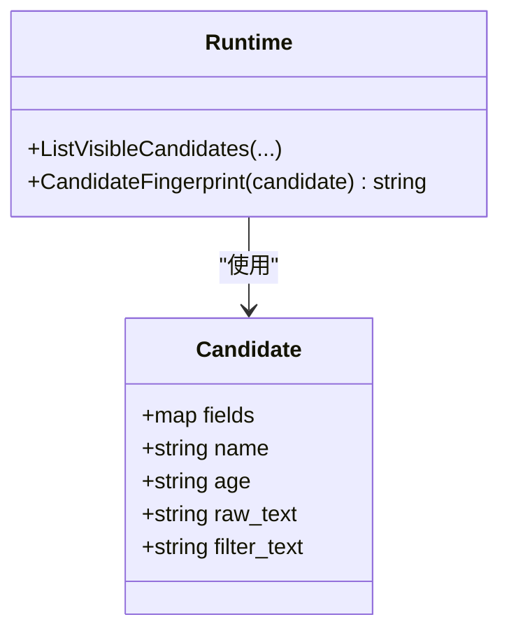
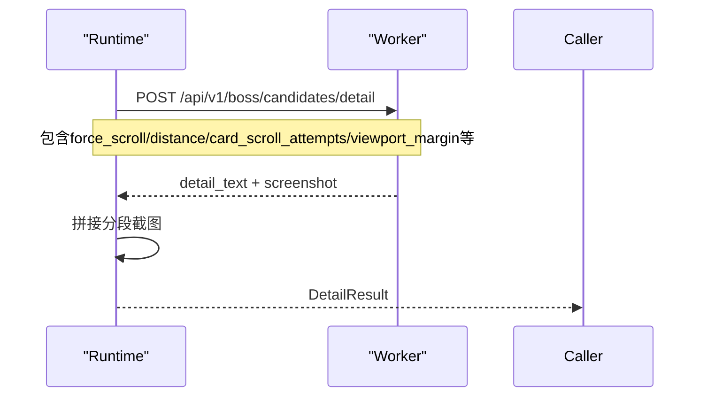
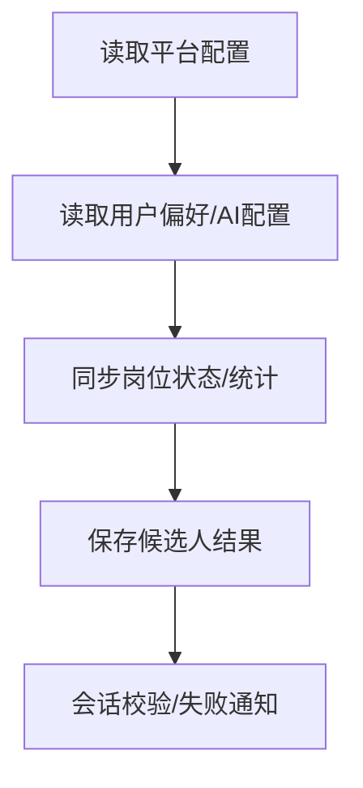
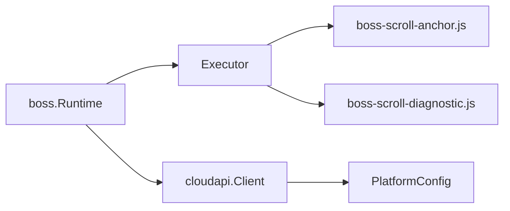

# Boss运行时环境

<cite>
**本文引用的文件**
- [runtime.go](file://goodhr5/local-agent-go/internal/platforms/boss/runtime.go)
- [candidate.go](file://goodhr5/local-agent-go/internal/platforms/boss/candidate.go)
- [entry.go](file://goodhr5/local-agent-go/internal/platforms/boss/entry.go)
- [detail.go](file://goodhr5/local-agent-go/internal/platforms/boss/detail.go)
- [helpers.go](file://goodhr5/local-agent-go/internal/platforms/boss/helpers.go)
- [runtime.go](file://goodhr5/local-agent-go/internal/platformcore/runtime.go)
- [config.go](file://goodhr5/local-agent-go/internal/config/config.go)
- [client.go](file://goodhr5/local-agent-go/internal/cloudapi/client.go)
- [boss-scroll-anchor.js](file://goodhr5/local-agent-go/worker-node/src/boss-scroll-anchor.js)
- [boss-scroll-diagnostic.js](file://goodhr5/local-agent-go/worker-node/src/boss-scroll-diagnostic.js)
- [index.js](file://goodhr5/local-agent-go/worker-node/src/index.js)
</cite>

## 目录
1. [简介](#简介)
2. [项目结构](#项目结构)
3. [核心组件](#核心组件)
4. [架构总览](#架构总览)
5. [详细组件分析](#详细组件分析)
6. [依赖关系分析](#依赖关系分析)
7. [性能与调优](#性能与调优)
8. [故障排查指南](#故障排查指南)
9. [结论](#结论)
10. [附录](#附录)

## 简介
本文件面向Boss直聘平台的本地运行时，系统性说明初始化流程、配置管理、候选人可见性检测、滚动定位算法、年龄提取与ID规范化、诊断信息收集、云端API通信与数据同步机制。文档以代码为依据，提供可追溯的源码路径与图示，帮助读者从高层到细节全面理解Boss平台运行时的设计与实现。

## 项目结构
Boss平台运行时由Go侧的平台实现与Node侧浏览器Worker共同组成：
- Go侧负责编排调用、参数构造、日志记录、云端配置读取与状态同步。
- Node侧负责页面交互、滚动定位、截图拼接、失败诊断等浏览器端能力。

**图表来源**
- [runtime.go:47-74](file://goodhr5/local-agent-go/internal/platformcore/runtime.go#L47-L74)
- [client.go:79-126](file://goodhr5/local-agent-go/internal/cloudapi/client.go#L79-L126)
- [config.go:27-88](file://goodhr5/local-agent-go/internal/config/config.go#L27-L88)
- [index.js:1615-1650](file://goodhr5/local-agent-go/worker-node/src/index.js#L1615-L1650)

**章节来源**
- [runtime.go:47-74](file://goodhr5/local-agent-go/internal/platformcore/runtime.go#L47-L74)
- [config.go:27-88](file://goodhr5/local-agent-go/internal/config/config.go#L27-L88)
- [client.go:79-126](file://goodhr5/local-agent-go/internal/cloudapi/client.go#L79-L126)

## 核心组件
- 平台运行时接口：定义岗位打开、候选列表、详情、打招呼、筛选等统一能力。
- Boss运行时实现：封装Boss平台特有的可见性检测、滚动策略、指纹生成、文本清理等。
- 云端客户端：负责读取平台配置、用户偏好、AI配置，以及岗位状态、统计、候选人结果同步。
- 本地配置：管理监听地址、端口、数据目录、云端API基址等。
- 浏览器Worker：执行页面滚动、元素定位、截图、诊断等。

**章节来源**
- [runtime.go:47-111](file://goodhr5/local-agent-go/internal/platformcore/runtime.go#L47-L111)
- [candidate.go:13-87](file://goodhr5/local-agent-go/internal/platforms/boss/candidate.go#L13-L87)
- [client.go:17-55](file://goodhr5/local-agent-go/internal/cloudapi/client.go#L17-L55)
- [config.go:27-88](file://goodhr5/local-agent-go/internal/config/config.go#L27-L88)

## 架构总览
Boss运行时通过Executor向浏览器Worker发起POST请求，完成候选人提取、滚动、可见性判定、详情抓取等操作；同时通过cloudapi.Client与云端进行配置拉取与状态同步。

**图表来源**
- [candidate.go:15-48](file://goodhr5/local-agent-go/internal/platforms/boss/candidate.go#L15-L48)
- [detail.go:16-63](file://goodhr5/local-agent-go/internal/platforms/boss/detail.go#L16-L63)
- [client.go:309-340](file://goodhr5/local-agent-go/internal/cloudapi/client.go#L309-L340)

## 详细组件分析

### 初始化与入口处理
- 打开入口页：校验并打开配置的入口URL，若为空则返回错误。
- 入口页准备：检测并自动点击确认弹框，提升首次进入成功率。
- 入口页判断：遍历当前页面列表，判断是否仍停留在岗位运行入口页。

**图表来源**
- [entry.go:12-53](file://goodhr5/local-agent-go/internal/platforms/boss/entry.go#L12-L53)

**章节来源**
- [entry.go:12-73](file://goodhr5/local-agent-go/internal/platforms/boss/entry.go#L12-L73)

### 候选人可见性检测与滚动定位
- 可见性载荷：bossCandidateVisiblePayload集中传递平台配置、卡片索引、元素引用、诊断名称、滚动距离、等待时间、尝试次数、最大滚动距离、要求完整可见、视口边距等。
- 滚动预算与步长：根据初始可视状态计算自适应滚轮步长与外层滚动轮数，避免固定小步长导致重试耗尽。
- 安全边距：确保目标卡片完全处于上下安全区域内，防止横向留白误判为危险区域。
- 失败诊断：汇总每次滚动的容器状态、目标位移、无效滚动次数、方向切换等，输出中文诊断结论。

**图表来源**
- [runtime.go:19-34](file://goodhr5/local-agent-go/internal/platforms/boss/runtime.go#L19-L34)
- [boss-scroll-anchor.js:124-170](file://goodhr5/local-agent-go/worker-node/src/boss-scroll-anchor.js#L124-L170)
- [boss-scroll-anchor.js:20-94](file://goodhr5/local-agent-go/worker-node/src/boss-scroll-anchor.js#L20-L94)

**章节来源**
- [runtime.go:19-34](file://goodhr5/local-agent-go/internal/platforms/boss/runtime.go#L19-L34)
- [boss-scroll-anchor.js:20-170](file://goodhr5/local-agent-go/worker-node/src/boss-scroll-anchor.js#L20-L170)
- [boss-scroll-diagnostic.js:85-251](file://goodhr5/local-agent-go/worker-node/src/boss-scroll-diagnostic.js#L85-L251)

### 候选人提取与去重指纹
- 候选人提取：调用Worker接口获取候选人列表，解析found_count、耗时等信息，并为每个候选人补充稳定ID。
- 去重指纹：基于姓名与年龄生成稳定ID，用于跨批次去重。
- 年龄提取：优先读取结构化字段，缺失时从原始文本中用正则提取“xx岁”。
- ID规范化：去除空白字符，保证指纹稳定性。

**图表来源**
- [candidate.go:15-48](file://goodhr5/local-agent-go/internal/platforms/boss/candidate.go#L15-L48)
- [candidate.go:76-86](file://goodhr5/local-agent-go/internal/platforms/boss/candidate.go#L76-L86)
- [runtime.go:36-55](file://goodhr5/local-agent-go/internal/platforms/boss/runtime.go#L36-L55)

**章节来源**
- [candidate.go:15-87](file://goodhr5/local-agent-go/internal/platforms/boss/candidate.go#L15-L87)
- [runtime.go:36-61](file://goodhr5/local-agent-go/internal/platforms/boss/runtime.go#L36-L61)
- [helpers.go:101-110](file://goodhr5/local-agent-go/internal/platforms/boss/helpers.go#L101-L110)

### 详情抓取与截图拼接
- 详情抓取：携带position_id、card_index、element_ref、截图开关、滚动参数、视口边距、截图目录与文件名、追踪ID等。
- 截图处理：当需要OCR或AI模式时开启截图；对分段截图进行拼接，记录分段数量与可滚动容器标志。
- 文本清理：移除平台附加内容（如“牛人分析器”），仅保留简历相关文本。

**图表来源**
- [detail.go:16-63](file://goodhr5/local-agent-go/internal/platforms/boss/detail.go#L16-L63)

**章节来源**
- [detail.go:16-108](file://goodhr5/local-agent-go/internal/platforms/boss/detail.go#L16-L108)

### 与云端API的通信与数据同步
- 平台配置：按平台ID拉取配置，支持JSON字符串或对象格式，自动补全id字段。
- 用户偏好与AI配置：读取最终生效的AI配置与用户个人配置。
- 状态与统计：同步岗位运行状态、本次打招呼和跳过计数、累计统计。
- 候选人结果：将本地候选人结果保存到云端简历库。
- 会话校验：验证登录态，过期时返回明确错误提示。

**图表来源**
- [client.go:79-126](file://goodhr5/local-agent-go/internal/cloudapi/client.go#L79-L126)
- [client.go:192-234](file://goodhr5/local-agent-go/internal/cloudapi/client.go#L192-L234)
- [client.go:236-340](file://goodhr5/local-agent-go/internal/cloudapi/client.go#L236-L340)
- [client.go:498-541](file://goodhr5/local-agent-go/internal/cloudapi/client.go#L498-L541)

**章节来源**
- [client.go:79-541](file://goodhr5/local-agent-go/internal/cloudapi/client.go#L79-L541)

## 依赖关系分析
- boss.Runtime依赖platformcore.Executor与cloudapi.PlatformConfig，通过Executor与Worker交互，通过PlatformConfig获取选择器与行为规则。
- Worker脚本依赖boss-scroll-anchor与boss-scroll-diagnostic模块，分别负责安全边距计算与失败诊断。
- 云端客户端依赖HTTP基础能力，统一处理超时、JSON解析、错误消息翻译。

**图表来源**
- [runtime.go:47-74](file://goodhr5/local-agent-go/internal/platformcore/runtime.go#L47-L74)
- [client.go:79-126](file://goodhr5/local-agent-go/internal/cloudapi/client.go#L79-L126)
- [boss-scroll-anchor.js:20-170](file://goodhr5/local-agent-go/worker-node/src/boss-scroll-anchor.js#L20-L170)
- [boss-scroll-diagnostic.js:85-251](file://goodhr5/local-agent-go/worker-node/src/boss-scroll-diagnostic.js#L85-L251)

**章节来源**
- [runtime.go:47-111](file://goodhr5/local-agent-go/internal/platformcore/runtime.go#L47-L111)
- [client.go:79-126](file://goodhr5/local-agent-go/internal/cloudapi/client.go#L79-L126)

## 性能与调优
- 滚动参数调优
  - distance：单次滚轮距离，默认120px，过大可能导致越界，过小增加重试次数。
  - wait_ms：滚动后等待时间，影响页面渲染与布局稳定。
  - card_scroll_attempts：外层滚动轮数，默认18次，远距离目标会动态扩大。
  - card_scroll_max_distance：单步最大滚动距离，默认600px，限制极端情况下的过度滚动。
  - viewport_margin：安全边距，详情抓取建议80px，可见性检测可为0。
- 自适应策略
  - 自适应步长：根据剩余距离按比例放大，接近目标时回退基础步长，减少无效滚动。
  - 滚动预算：根据初始剩余距离与最大步长估算所需轮数，上限封顶防止无限滚动。
- 截图与OCR
  - 仅在ocr或ai模式下启用截图，避免不必要的IO开销。
  - 分段截图拼接可减少单次截图大小，提高稳定性。
- 云端通信
  - 合理设置超时与重试，避免频繁网络请求阻塞主流程。
  - 批量同步统计与候选人结果，降低请求频率。

[本节为通用指导，不直接分析具体文件]

## 故障排查指南
- 常见滚动问题诊断
  - wheel-not-effective：滚轮执行但页面基本未移动，检查鼠标停靠位置与滚动容器。
  - retry-distance-insufficient：方向正确且目标在接近，但总距离不足，需增大距离或轮数。
  - direction-oscillation：滚动方向多次切换，目标可能在边界附近来回越界。
  - target-not-approaching：滚动后目标未接近，可能滚错容器或目标定位不正确。
  - target-not-measurable：无法读取目标卡片位置，检查选择器或元素可见性。
- 日志与追踪
  - 使用diagnostic_trace_id关联详情抓取过程。
  - 查看browser-worker.log中的逐次坐标与滚动轨迹。
- 云端错误
  - 登录态失效：提示“账号已在其他地方登录，请重新登录”。
  - 会员过期：提示“会员已过期，请先续费”。
  - 平台配置缺失：提示“云端没有找到平台配置”。

**章节来源**
- [boss-scroll-diagnostic.js:68-83](file://goodhr5/local-agent-go/worker-node/src/boss-scroll-diagnostic.js#L68-L83)
- [boss-scroll-diagnostic.js:85-251](file://goodhr5/local-agent-go/worker-node/src/boss-scroll-diagnostic.js#L85-L251)
- [client.go:30-41](file://goodhr5/local-agent-go/internal/cloudapi/client.go#L30-L41)
- [client.go:481-496](file://goodhr5/local-agent-go/internal/cloudapi/client.go#L481-L496)

## 结论
Boss平台运行时通过清晰的接口抽象与模块化实现，将Go侧的编排与Node侧的浏览器能力解耦。候选人可见性检测与滚动定位采用自适应策略与安全边距控制，结合完善的失败诊断体系，显著提升鲁棒性与可维护性。云端通信覆盖配置、状态、统计与结果同步，形成完整的闭环。通过合理的参数调优与错误处理策略，可在复杂页面环境下稳定运行。

[本节为总结，不直接分析具体文件]

## 附录

### bossCandidateVisiblePayload参数设计说明
- platform_config：平台配置，包含选择器与行为规则。
- card_index：候选人卡片序号，用于定位与日志。
- element_ref：元素引用，辅助Worker快速定位目标。
- diagnostic_candidate_name：诊断名称，便于日志检索。
- distance：单次滚动距离。
- wait_ms：滚动后等待时间。
- card_scroll_attempts：外层滚动轮数。
- card_scroll_max_distance：单步最大滚动距离。
- require_full：是否要求完整可见。
- viewport_margin：视口安全边距。

**章节来源**
- [runtime.go:19-34](file://goodhr5/local-agent-go/internal/platforms/boss/runtime.go#L19-L34)

### 年龄提取逻辑与ID规范化
- 年龄提取：优先读取结构化字段（age、candidate_age、fields.age等），缺失时从raw_text/filter_text/basic_info中用正则匹配“xx岁”。
- ID规范化：去除空白字符，保证指纹稳定。
- 指纹生成：boss_姓名_年龄，用于跨批次去重。

**章节来源**
- [runtime.go:36-61](file://goodhr5/local-agent-go/internal/platforms/boss/runtime.go#L36-L61)
- [candidate.go:76-86](file://goodhr5/local-agent-go/internal/platforms/boss/candidate.go#L76-L86)
- [helpers.go:101-110](file://goodhr5/local-agent-go/internal/platforms/boss/helpers.go#L101-L110)

### 滚动定位算法要点
- 安全边距：确保卡片上下边距在安全区域内，避免误判。
- 自适应步长：根据剩余距离按比例放大，接近目标时回退基础步长。
- 滚动预算：根据初始剩余距离与最大步长估算轮数，上限封顶。
- 失败诊断：汇总轨迹，输出中文结论，辅助定位问题。

**章节来源**
- [boss-scroll-anchor.js:20-170](file://goodhr5/local-agent-go/worker-node/src/boss-scroll-anchor.js#L20-L170)
- [boss-scroll-diagnostic.js:85-251](file://goodhr5/local-agent-go/worker-node/src/boss-scroll-diagnostic.js#L85-L251)

### Boss平台特有运行时配置选项
- 入口页配置：必须提供有效的入口URL。
- 岗位选择器：current、switchBtn、list等选择器需在云端配置中正确填写。
- 滚动容器：scroll_containers需指向实际可滚动容器。
- 候选人卡片：candidate_card选择器需准确。
- 字段定位：card.fields需映射各字段选择器。

**章节来源**
- [entry.go:12-73](file://goodhr5/local-agent-go/internal/platforms/boss/entry.go#L12-L73)
- [helpers.go:112-180](file://goodhr5/local-agent-go/internal/platforms/boss/helpers.go#L112-L180)

### 错误处理策略
- 入口页为空：立即返回错误，避免后续流程无效执行。
- 云端配置缺失：明确提示并中止运行。
- 滚动失败：输出诊断结论，记录逐次轨迹，便于复盘。
- 云端会话失效：提示重新登录，阻断后续操作。

**章节来源**
- [entry.go:12-21](file://goodhr5/local-agent-go/internal/platforms/boss/entry.go#L12-L21)
- [client.go:79-126](file://goodhr5/local-agent-go/internal/cloudapi/client.go#L79-L126)
- [boss-scroll-diagnostic.js:68-83](file://goodhr5/local-agent-go/worker-node/src/boss-scroll-diagnostic.js#L68-L83)