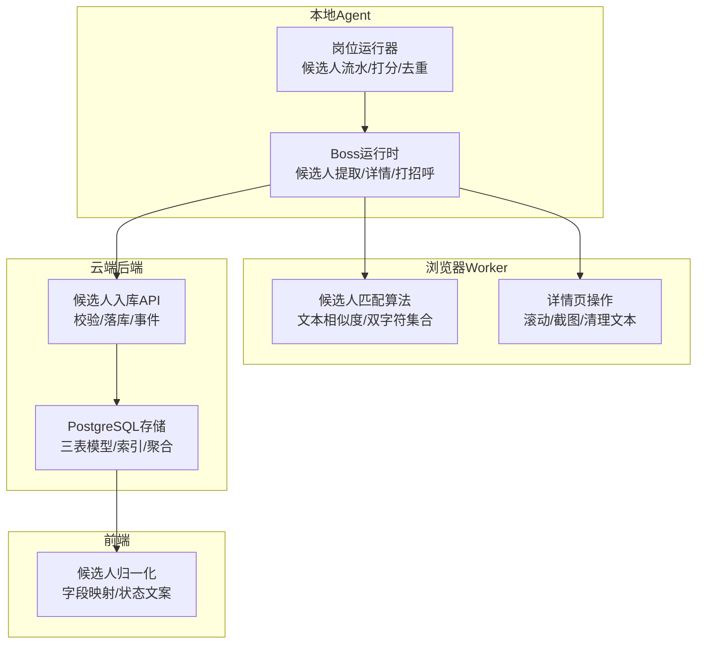
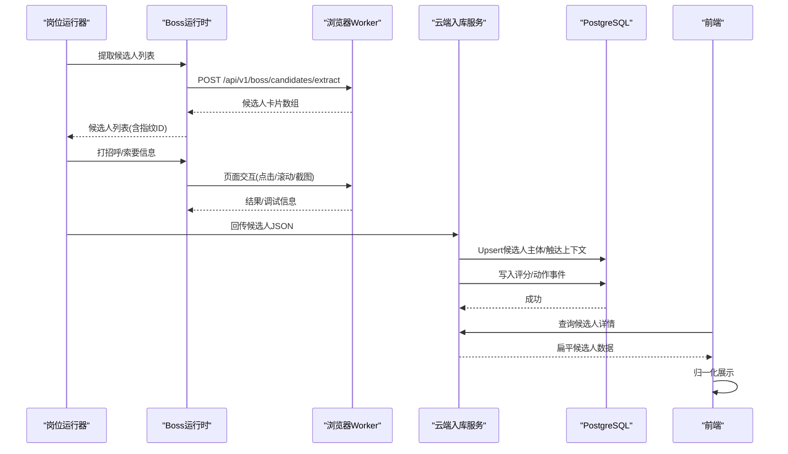
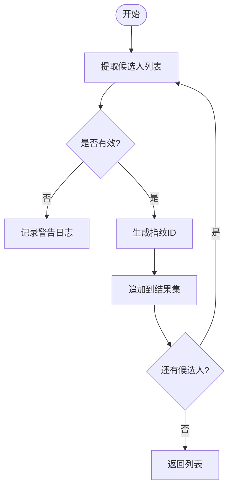
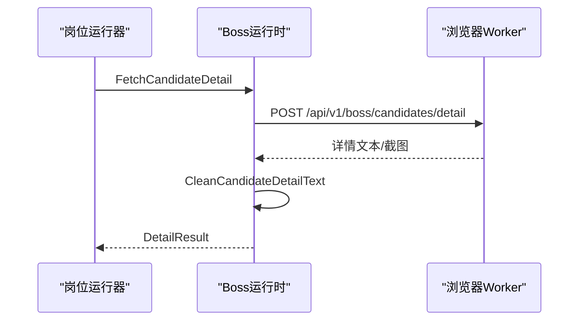
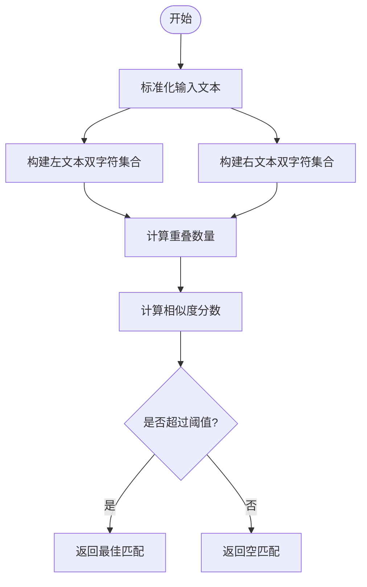
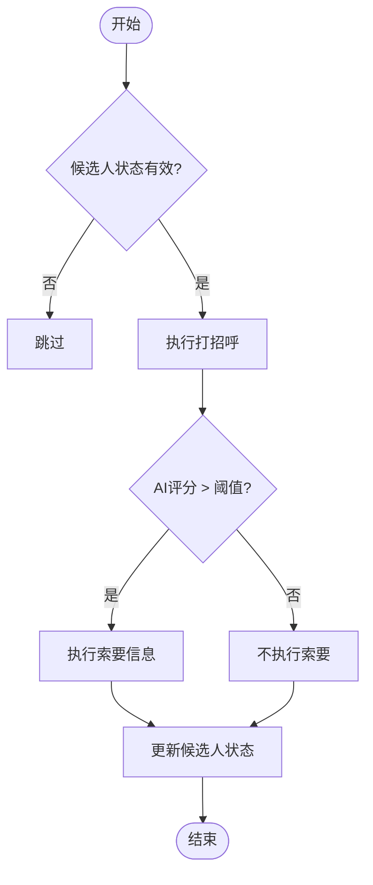
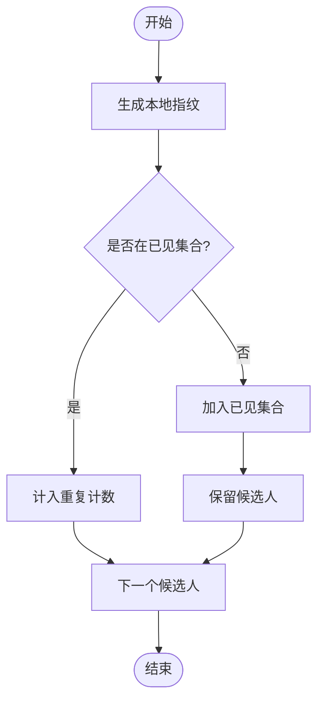
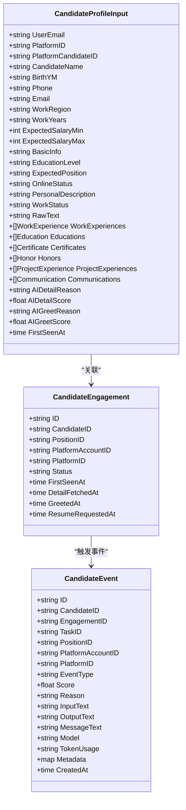
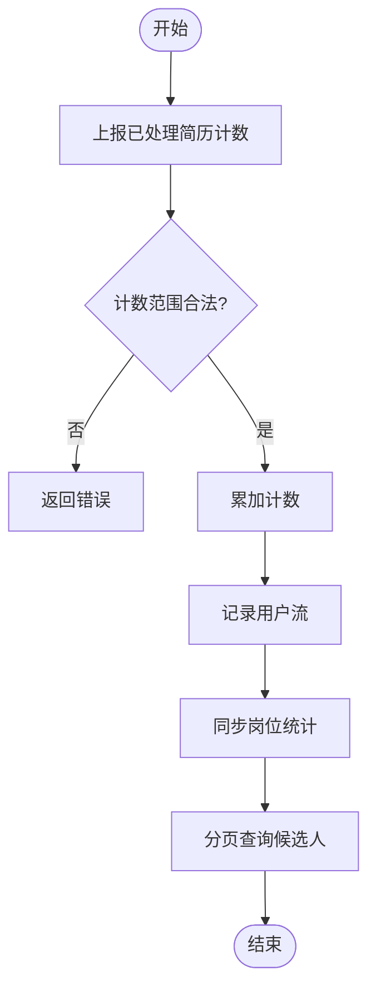
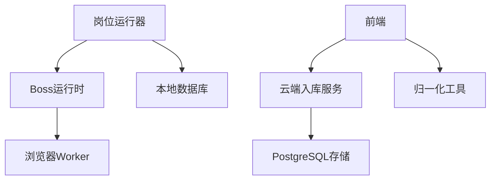

# 候选人数据处理

<cite>
**本文引用的文件 **
- [candidate.go](file://goodhr5/local-agent-go/internal/platforms/boss/candidate.go)
- [detail.go](file://goodhr5/local-agent-go/internal/platforms/boss/detail.go)
- [helpers.go](file://goodhr5/local-agent-go/internal/platforms/boss/helpers.go)
- [runtime.go](file://goodhr5/local-agent-go/internal/platforms/boss/runtime.go)
- [candidate.go](file://goodhr5/local-agent-go/internal/positionrunner/candidate.go)
- [candidate-match.js](file://goodhr5/local-agent-go/worker-node/src/candidate-match.js)
- [local_candidate_ingest.go](file://goodhr5/cloud/backend/internal/httpapi/local_candidate_ingest.go)
- [candidate_store_pg.go](file://goodhr5/cloud/backend/internal/httpapi/candidate_store_pg.go)
- [candidate-normalize.ts](file://goodhr5/cloud/frontend-next/lib/candidate-normalize.ts)
</cite>

## 目录
1. [引言](#引言)
2. [项目结构](#项目结构)
3. [核心组件](#核心组件)
4. [架构总览](#架构总览)
5. [详细组件分析](#详细组件分析)
6. [依赖关系分析](#依赖关系分析)
7. [性能与稳定性](#性能与稳定性)
8. [故障排查指南](#故障排查指南)
9. [结论](#结论)

## 引言
本文件面向Boss直聘候选人数据处理的完整链路，覆盖候选人卡片解析、简历信息提取、数据结构标准化、评分与匹配度计算、去重策略、数据验证与批量处理，以及本地到云端的同步机制和数据持久化策略。文档以代码为依据，重点解释Boss平台在本地Agent中的运行时实现、Worker侧的DOM匹配与文本相似度算法、云端入库与存储模型，以及前端展示归一化过程。

## 项目结构
Boss直聘候选人数据处理涉及三层：
- 本地Agent（Go）：封装Boss平台运行时能力，负责调用浏览器Worker执行页面操作、提取候选人列表和详情、生成去重指纹、发起打招呼与信息索要。
- Worker（Node.js）：运行在浏览器环境中，负责DOM定位、滚动、截图、候选人卡片文本相似度匹配等。
- 云端后端（Go）：接收本地回传的候选人JSON，写入候选人主体、触达上下文与事件流水，并提供查询接口。
- 前端（Next.js）：将云端返回的扁平候选人数据转换为统一展示模型。

**图表来源**
- [candidate.go:15-48](file://goodhr5/local-agent-go/internal/platforms/boss/candidate.go#L15-L48)
- [detail.go:16-63](file://goodhr5/local-agent-go/internal/platforms/boss/detail.go#L16-L63)
- [candidate-match.js:8-79](file://goodhr5/local-agent-go/worker-node/src/candidate-match.js#L8-L79)
- [local_candidate_ingest.go:25-127](file://goodhr5/cloud/backend/internal/httpapi/local_candidate_ingest.go#L25-L127)
- [candidate_store_pg.go:24-160](file://goodhr5/cloud/backend/internal/httpapi/candidate_store_pg.go#L24-L160)
- [candidate-normalize.ts:77-141](file://goodhr5/cloud/frontend-next/lib/candidate-normalize.ts#L77-L141)

**章节来源**
- [candidate.go:15-48](file://goodhr5/local-agent-go/internal/platforms/boss/candidate.go#L15-L48)
- [detail.go:16-63](file://goodhr5/local-agent-go/internal/platforms/boss/detail.go#L16-L63)
- [candidate-match.js:8-79](file://goodhr5/local-agent-go/worker-node/src/candidate-match.js#L8-L79)
- [local_candidate_ingest.go:25-127](file://goodhr5/cloud/backend/internal/httpapi/local_candidate_ingest.go#L25-L127)
- [candidate_store_pg.go:24-160](file://goodhr5/cloud/backend/internal/httpapi/candidate_store_pg.go#L24-L160)
- [candidate-normalize.ts:77-141](file://goodhr5/cloud/frontend-next/lib/candidate-normalize.ts#L77-L141)

## 核心组件
- Boss平台运行时：提供候选人列表提取、滚动、可见性保证、详情读取、关闭详情、筛选文本、去重指纹、年龄提取等能力。
- 岗位运行器：消费候选人队列，执行打招呼、信息索要、模拟休息、去重过滤、状态推进、日志记录。
- Worker侧匹配算法：对候选人卡片文本进行标准化、双字符相似度计算、最佳匹配选择。
- 云端入库服务：校验请求、保存候选人主体与触达上下文、记录评分与动作事件、更新统计。
- PostgreSQL存储：候选人主体、触达上下文、事件流水三表模型；支持Upsert、分页查询、条件筛选。
- 前端归一化：将云端扁平数据转换为展示模型，包括经历、教育、证书、荣誉、项目、沟通、AI评分、备注、事件、时间戳等。

**章节来源**
- [runtime.go:11-63](file://goodhr5/local-agent-go/internal/platforms/boss/runtime.go#L11-L63)
- [candidate.go:21-161](file://goodhr5/local-agent-go/internal/positionrunner/candidate.go#L21-L161)
- [candidate-match.js:8-79](file://goodhr5/local-agent-go/worker-node/src/candidate-match.js#L8-L79)
- [local_candidate_ingest.go:25-127](file://goodhr5/cloud/backend/internal/httpapi/local_candidate_ingest.go#L25-L127)
- [candidate_store_pg.go:24-160](file://goodhr5/cloud/backend/internal/httpapi/candidate_store_pg.go#L24-L160)
- [candidate-normalize.ts:77-141](file://goodhr5/cloud/frontend-next/lib/candidate-normalize.ts#L77-L141)

## 架构总览
候选人数据处理的主流程如下：
1. 本地Boss运行时从浏览器Worker获取候选人列表，并附加稳定ID（指纹）。
2. 岗位运行器按顺序消费候选人，执行打招呼与信息索要，必要时进入详情阶段。
3. 详情阶段通过Worker滚动、截图、清理非简历内容，得到结构化文本。
4. 云端入库服务接收候选人JSON，校验并写入候选人主体与触达上下文，记录评分与动作事件。
5. 前端读取云端数据，归一化为统一展示模型。

**图表来源**
- [candidate.go:15-48](file://goodhr5/local-agent-go/internal/platforms/boss/candidate.go#L15-L48)
- [detail.go:16-63](file://goodhr5/local-agent-go/internal/platforms/boss/detail.go#L16-L63)
- [local_candidate_ingest.go:25-127](file://goodhr5/cloud/backend/internal/httpapi/local_candidate_ingest.go#L25-L127)
- [candidate_store_pg.go:24-160](file://goodhr5/cloud/backend/internal/httpapi/candidate_store_pg.go#L24-L160)
- [candidate-normalize.ts:77-141](file://goodhr5/cloud/frontend-next/lib/candidate-normalize.ts#L77-L141)

## 详细组件分析

### Boss平台运行时与候选人卡片解析
- 候选人列表提取：通过POST调用Worker接口，返回包含found_count、find_elapsed_ms、convert_elapsed_ms、elapsed_ms等指标的数据，便于性能监控。
- 滚动与可见性：提供滚动候选人列表与确保候选人卡片可见的方法，参数包括距离、等待毫秒数、滚动尝试次数、最大滚动距离、视口边距等。
- 筛选文本与指纹：优先使用结构化字段，缺失时回退到原始文本；指纹由姓名与年龄组成，用于去重。
- 年龄提取：优先读取结构化age字段，否则从raw_text/filter_text/basic_info中用正则匹配“xx岁”。

**图表来源**
- [candidate.go:15-48](file://goodhr5/local-agent-go/internal/platforms/boss/candidate.go#L15-L48)
- [runtime.go:38-63](file://goodhr5/local-agent-go/internal/platforms/boss/runtime.go#L38-L63)
- [helpers.go:101-110](file://goodhr5/local-agent-go/internal/platforms/boss/helpers.go#L101-L110)

**章节来源**
- [candidate.go:15-48](file://goodhr5/local-agent-go/internal/platforms/boss/candidate.go#L15-L48)
- [runtime.go:38-63](file://goodhr5/local-agent-go/internal/platforms/boss/runtime.go#L38-L63)
- [helpers.go:101-110](file://goodhr5/local-agent-go/internal/platforms/boss/helpers.go#L101-L110)

### 候选人详情提取与文本清洗
- 详情读取：根据岗位ID、平台配置、候选人卡片索引与元素引用，调用Worker接口获取详情文本与截图。
- 截图拼接：若返回分段截图，则进行拼接；记录分段数量与可滚动容器标志。
- 文本清洗：去除平台附加内容（如“牛人分析器”），保留简历相关文本。

**图表来源**
- [detail.go:16-63](file://goodhr5/local-agent-go/internal/platforms/boss/detail.go#L16-L63)

**章节来源**
- [detail.go:16-63](file://goodhr5/local-agent-go/internal/platforms/boss/detail.go#L16-L63)

### 候选人匹配度与相似度算法
- 文本标准化：转小写，仅保留中英文与数字。
- 双字符相似度：计算两段文本的双字符集合重叠率，结合包含关系与姓名权重得出相似度分数。
- 最佳匹配：遍历当前页面所有候选人卡片文本，选择最高分且阈值不低于0.45的匹配项。

**图表来源**
- [candidate-match.js:8-79](file://goodhr5/local-agent-go/worker-node/src/candidate-match.js#L8-L79)

**章节来源**
- [candidate-match.js:8-79](file://goodhr5/local-agent-go/worker-node/src/candidate-match.js#L8-L79)

### 候选人评分与匹配决策
- AI评分：候选人携带ai_detail_score与ai_greet_score，分别对应详情分析与打招呼判断。
- 索要信息阈值：岗位配置request_score_threshold，只有当最终AI评分严格大于该阈值时才允许索要信息。
- 打招呼重试：带超时与重试机制，失败时记录错误并继续后续候选人。

**图表来源**
- [candidate.go:21-161](file://goodhr5/local-agent-go/internal/positionrunner/candidate.go#L21-L161)

**章节来源**
- [candidate.go:21-161](file://goodhr5/local-agent-go/internal/positionrunner/candidate.go#L21-L161)

### 去重策略
- 本地指纹：Boss运行时基于姓名与年龄生成稳定ID，格式为boss_姓名_年龄。
- 主流程去重：岗位运行器维护已见候选人ID集合，过滤重复项并统计重复数量。
- 云端唯一键：候选人主体Upsert使用tenant_id、source_platform_id、source_platform_candidate_id作为冲突目标，兜底键由姓名、电话、邮箱、工作区域、工作年限、简介拼接而成。

**图表来源**
- [candidate.go:76-86](file://goodhr5/local-agent-go/internal/platforms/boss/candidate.go#L76-L86)
- [candidate.go:386-404](file://goodhr5/local-agent-go/internal/positionrunner/candidate.go#L386-L404)
- [candidate_store_pg.go:753-761](file://goodhr5/cloud/backend/internal/httpapi/candidate_store_pg.go#L753-L761)

**章节来源**
- [candidate.go:76-86](file://goodhr5/local-agent-go/internal/platforms/boss/candidate.go#L76-L86)
- [candidate.go:386-404](file://goodhr5/local-agent-go/internal/positionrunner/candidate.go#L386-L404)
- [candidate_store_pg.go:753-761](file://goodhr5/cloud/backend/internal/httpapi/candidate_store_pg.go#L753-L761)

### 数据验证与格式转换
- 云端入库校验：方法校验、租户权限、岗位存在性、JSON体合法性、计数范围限制。
- 字段映射：候选人JSON字段映射到候选人主体与触达上下文，包括基本信息、工作经历、教育背景、证书、荣誉、项目经验、同事沟通、AI评分与原因、时间戳等。
- 前端归一化：将云端扁平数据转换为展示模型，包括经历行摘要、时间范围、薪资文本、年龄估算、事件标签、状态文案等。

**图表来源**
- [local_candidate_ingest.go:25-127](file://goodhr5/cloud/backend/internal/httpapi/local_candidate_ingest.go#L25-L127)
- [candidate_store_pg.go:24-160](file://goodhr5/cloud/backend/internal/httpapi/candidate_store_pg.go#L24-L160)
- [candidate_store_pg.go:232-295](file://goodhr5/cloud/backend/internal/httpapi/candidate_store_pg.go#L232-L295)

**章节来源**
- [local_candidate_ingest.go:25-127](file://goodhr5/cloud/backend/internal/httpapi/local_candidate_ingest.go#L25-L127)
- [candidate_store_pg.go:24-160](file://goodhr5/cloud/backend/internal/httpapi/candidate_store_pg.go#L24-L160)
- [candidate_store_pg.go:232-295](file://goodhr5/cloud/backend/internal/httpapi/candidate_store_pg.go#L232-L295)
- [candidate-normalize.ts:77-141](file://goodhr5/cloud/frontend-next/lib/candidate-normalize.ts#L77-L141)

### 批量处理方法
- 批量新增已处理简历计数：本地程序上报本次去重后新增的已处理简历数量，云端累加并记录用户流。
- 岗位累计统计同步：本地程序同步扫描、跳过、失败计数，云端更新岗位统计并记录用户流。
- 候选人列表分页查询：云端支持按团队、岗位、状态、关键词分页查询候选人，并聚合最近触达与备注。

**图表来源**
- [local_candidate_ingest.go:137-232](file://goodhr5/cloud/backend/internal/httpapi/local_candidate_ingest.go#L137-L232)
- [candidate_store_pg.go:374-407](file://goodhr5/cloud/backend/internal/httpapi/candidate_store_pg.go#L374-L407)

**章节来源**
- [local_candidate_ingest.go:137-232](file://goodhr5/cloud/backend/internal/httpapi/local_candidate_ingest.go#L137-L232)
- [candidate_store_pg.go:374-407](file://goodhr5/cloud/backend/internal/httpapi/candidate_store_pg.go#L374-L407)

## 依赖关系分析
- 本地Boss运行时依赖平台配置与Worker接口，提供统一的候选人处理能力。
- 岗位运行器依赖Boss运行时与数据库，管理候选人生命周期与业务规则。
- 云端入库服务依赖候选人存储与岗位存储，负责数据一致性与审计。
- 前端依赖云端API与归一化工具，提供一致的展示体验。

**图表来源**
- [runtime.go:11-63](file://goodhr5/local-agent-go/internal/platforms/boss/runtime.go#L11-L63)
- [candidate.go:21-161](file://goodhr5/local-agent-go/internal/positionrunner/candidate.go#L21-L161)
- [local_candidate_ingest.go:25-127](file://goodhr5/cloud/backend/internal/httpapi/local_candidate_ingest.go#L25-L127)
- [candidate-normalize.ts:77-141](file://goodhr5/cloud/frontend-next/lib/candidate-normalize.ts#L77-L141)

**章节来源**
- [runtime.go:11-63](file://goodhr5/local-agent-go/internal/platforms/boss/runtime.go#L11-L63)
- [candidate.go:21-161](file://goodhr5/local-agent-go/internal/positionrunner/candidate.go#L21-L161)
- [local_candidate_ingest.go:25-127](file://goodhr5/cloud/backend/internal/httpapi/local_candidate_ingest.go#L25-L127)
- [candidate-normalize.ts:77-141](file://goodhr5/cloud/frontend-next/lib/candidate-normalize.ts#L77-L141)

## 性能与稳定性
- 候选人提取性能指标：found_count、find_elapsed_ms、convert_elapsed_ms、elapsed_ms，便于监控与优化。
- 滚动与截图优化：分段截图与可滚动容器检测，减少单次渲染压力。
- 重试与超时：打招呼与信息索要带重试与超时，避免阻塞主流程。
- 模拟休息：在长时间运行中插入随机休息窗口，提升稳定性与拟真度。
- 数据库事务与超时：候选人主体、触达上下文、事件写入均设置超时，防止长事务。

**章节来源**
- [candidate.go:15-48](file://goodhr5/local-agent-go/internal/platforms/boss/candidate.go#L15-L48)
- [detail.go:43-63](file://goodhr5/local-agent-go/internal/platforms/boss/detail.go#L43-L63)
- [candidate.go:163-187](file://goodhr5/local-agent-go/internal/positionrunner/candidate.go#L163-L187)
- [candidate.go:211-289](file://goodhr5/local-agent-go/internal/positionrunner/candidate.go#L211-L289)
- [candidate_store_pg.go:24-160](file://goodhr5/cloud/backend/internal/httpapi/candidate_store_pg.go#L24-L160)

## 故障排查指南
- 候选人提取失败：检查Worker接口返回与日志，确认platform_config与max_items参数正确。
- 详情读取失败：核对card_index、element_ref、截图目录与文件名，查看_screenshot_debug输出。
- 打招呼失败：查看重试次数与超时设置，确认平台是否实现CandidateInfoRequester接口。
- 云端入库失败：检查租户权限、岗位存在性、JSON体合法性，查看writeCandidateIngestLog日志。
- 前端展示异常：确认normalizeCandidate与normalizeEvent函数是否正确映射字段。

**章节来源**
- [candidate.go:15-48](file://goodhr5/local-agent-go/internal/platforms/boss/candidate.go#L15-L48)
- [detail.go:16-63](file://goodhr5/local-agent-go/internal/platforms/boss/detail.go#L16-L63)
- [local_candidate_ingest.go:25-127](file://goodhr5/cloud/backend/internal/httpapi/local_candidate_ingest.go#L25-L127)
- [candidate-normalize.ts:77-141](file://goodhr5/cloud/frontend-next/lib/candidate-normalize.ts#L77-L141)

## 结论
Boss直聘候选人数据处理链路通过本地Agent、浏览器Worker、云端后端与前端的协同，实现了从DOM解析、简历提取、评分匹配、去重过滤到数据持久化与展示的完整闭环。系统在性能监控、重试机制、模拟休息、事务超时等方面提供了稳定性保障，并通过结构化字段与文本清洗提升了数据质量。未来可进一步优化DOM定位策略、相似度算法与数据库查询性能，以提升整体吞吐与准确率。