# 候选人数据处理

<cite>
**本文引用的文件**
- [candidate.go](file://goodhr5/local-agent-go/internal/platforms/boss/candidate.go)
- [detail.go](file://goodhr5/local-agent-go/internal/platforms/boss/detail.go)
- [entry.go](file://goodhr5/local-agent-go/internal/platforms/boss/entry.go)
- [helpers.go](file://goodhr5/local-agent-go/internal/platforms/boss/helpers.go)
- [runtime.go](file://goodhr5/local-agent-go/internal/platformcore/runtime.go)
- [local_candidate_ingest.go](file://goodhr5/cloud/backend/internal/httpapi/local_candidate_ingest.go)
- [candidate_service.go](file://goodhr5/cloud/backend/internal/httpapi/candidate_service.go)
- [candidate_store.go](file://goodhr5/cloud/backend/internal/httpapi/candidate_store.go)
- [boss.json](file://goodhr5/cloud/backend/boss.json)
- [candidate-normalize.ts](file://goodhr5/cloud/frontend-next/lib/candidate-normalize.ts)
</cite>

## 目录
1. [简介](#简介)
2. [项目结构](#项目结构)
3. [核心组件](#核心组件)
4. [架构总览](#架构总览)
5. [详细组件分析](#详细组件分析)
6. [依赖关系分析](#依赖关系分析)
7. [性能考量](#性能考量)
8. [故障排查指南](#故障排查指南)
9. [结论](#结论)
10. [附录](#附录)

## 简介
本文件聚焦 Boss 直聘候选人数据处理的完整链路：从浏览器端候选人卡片解析、简历详情提取，到本地标准化与云端入库、评分事件记录、前端展示标准化。文档覆盖 DOM 结构特点、字段映射规则、数据清洗算法、去重策略、匹配度与评分计算、批量处理、以及本地与云端的同步机制和数据持久化策略。

## 项目结构
Boss 直聘候选人数据处理涉及三层：
- 本地 Agent（Go）：通过平台运行时接口调用浏览器 Worker，完成页面滚动、卡片提取、详情抓取、文本清洗、指纹生成等。
- 云端后端（Go）：接收本地回传的候选人 JSON，进行字段校验、落库、关联岗位触达上下文、保存 AI 评分事件、统计计数。
- 前端（Next.js）：将后端返回的扁平候选人模型转换为 UI 友好的标准化结构，并渲染列表与详情。

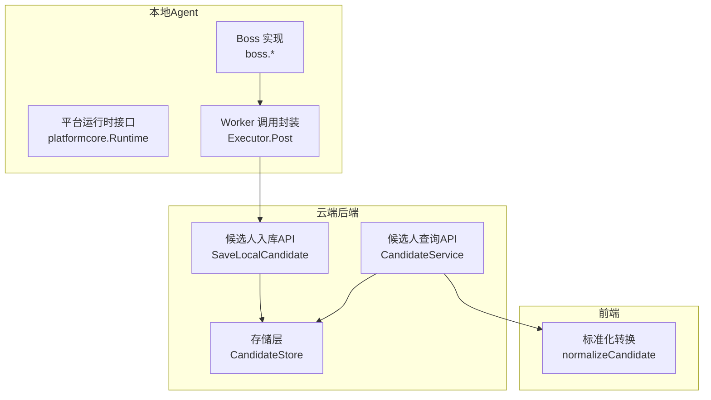

图表来源
- [runtime.go:46-74](file://goodhr5/local-agent-go/internal/platformcore/runtime.go#L46-L74)
- [candidate.go:15-48](file://goodhr5/local-agent-go/internal/platforms/boss/candidate.go#L15-L48)
- [detail.go:16-63](file://goodhr5/local-agent-go/internal/platforms/boss/detail.go#L16-L63)
- [local_candidate_ingest.go:25-123](file://goodhr5/cloud/backend/internal/httpapi/local_candidate_ingest.go#L25-L123)
- [candidate_service.go:31-76](file://goodhr5/cloud/backend/internal/httpapi/candidate_service.go#L31-L76)
- [candidate-store.go:147-156](file://goodhr5/cloud/backend/internal/httpapi/candidate_store.go#L147-L156)
- [candidate-normalize.ts:56-112](file://goodhr5/cloud/frontend-next/lib/candidate-normalize.ts#L56-L112)

章节来源
- [runtime.go:46-74](file://goodhr5/local-agent-go/internal/platformcore/runtime.go#L46-L74)
- [candidate.go:15-48](file://goodhr5/local-agent-go/internal/platforms/boss/candidate.go#L15-L48)
- [detail.go:16-63](file://goodhr5/local-agent-go/internal/platforms/boss/detail.go#L16-L63)
- [local_candidate_ingest.go:25-123](file://goodhr5/cloud/backend/internal/httpapi/local_candidate_ingest.go#L25-L123)
- [candidate_service.go:31-76](file://goodhr5/cloud/backend/internal/httpapi/candidate_service.go#L31-L76)
- [candidate_store.go:147-156](file://goodhr5/cloud/backend/internal/httpapi/candidate_store.go#L147-L156)
- [candidate-normalize.ts:56-112](file://goodhr5/cloud/frontend-next/lib/candidate-normalize.ts#L56-L112)

## 核心组件
- 平台运行时接口：定义统一的候选人提取、详情读取、关闭详情、筛选文本、去重指纹等能力。
- Boss 平台实现：负责调用 Worker 接口获取候选人列表、滚动列表、定位可见卡片、提取详情、清理详情文本、生成去重指纹。
- 云端入库服务：接收本地回传 JSON，映射为统一候选人主体与触达上下文，保存 AI 评分事件，更新岗位统计。
- 候选人查询服务：提供团队维度候选人列表、详情、备注等 API。
- 存储层：内存实现用于开发期，支持候选人主体、触达上下文、事件流水的增删改查。
- 前端标准化：将后端扁平模型转为 UI 友好结构，包含年龄、薪资、经历摘要、状态文案等。

章节来源
- [runtime.go:20-74](file://goodhr5/local-agent-go/internal/platformcore/runtime.go#L20-L74)
- [candidate.go:15-86](file://goodhr5/local-agent-go/internal/platforms/boss/candidate.go#L15-L86)
- [detail.go:16-107](file://goodhr5/local-agent-go/internal/platforms/boss/detail.go#L16-L107)
- [local_candidate_ingest.go:25-123](file://goodhr5/cloud/backend/internal/httpapi/local_candidate_ingest.go#L25-L123)
- [candidate_service.go:31-216](file://goodhr5/cloud/backend/internal/httpapi/candidate_service.go#L31-L216)
- [candidate_store.go:147-156](file://goodhr5/cloud/backend/internal/httpapi/candidate_store.go#L147-L156)
- [candidate-normalize.ts:56-112](file://goodhr5/cloud/frontend-next/lib/candidate-normalize.ts#L56-L112)

## 架构总览
下图展示了从浏览器端到云端入库再到前端展示的完整流程，包括卡片提取、详情抓取、文本清洗、指纹去重、入库、评分事件记录、查询与标准化。

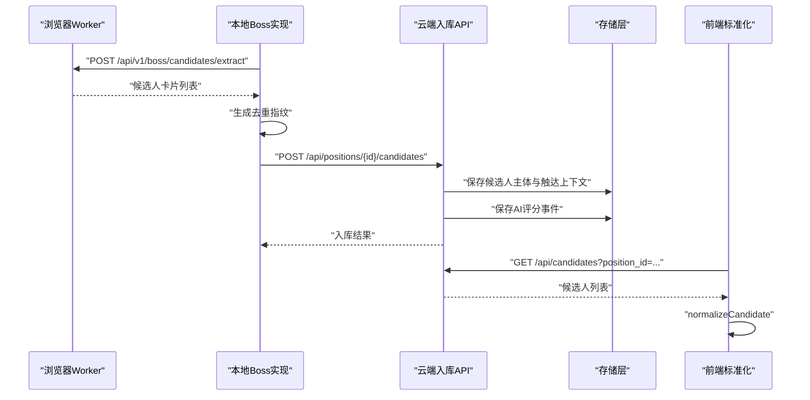

图表来源
- [candidate.go:15-48](file://goodhr5/local-agent-go/internal/platforms/boss/candidate.go#L15-L48)
- [detail.go:16-63](file://goodhr5/local-agent-go/internal/platforms/boss/detail.go#L16-L63)
- [local_candidate_ingest.go:25-123](file://goodhr5/cloud/backend/internal/httpapi/local_candidate_ingest.go#L25-L123)
- [candidate_service.go:31-76](file://goodhr5/cloud/backend/internal/httpapi/candidate_service.go#L31-L76)
- [candidate-normalize.ts:56-112](file://goodhr5/cloud/frontend-next/lib/candidate-normalize.ts#L56-L112)

## 详细组件分析

### Boss 候选人卡片提取与滚动
- 列表提取：通过执行器 POST 到本地 Worker 的候选人提取接口，返回候选人数组；日志记录查找耗时、转换耗时与总数。
- 滚动加载：通过滚动接口增加可视区域，以获取更多候选人。
- 可见性保证：确保目标候选人卡片进入视口后再进行详情操作。

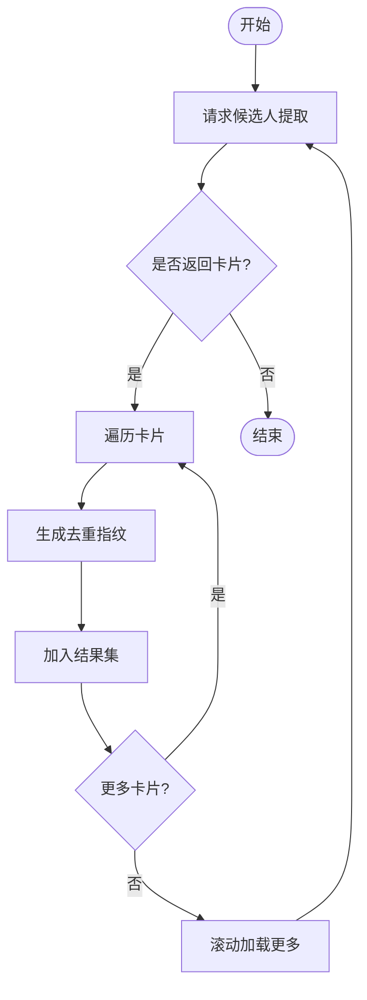

图表来源
- [candidate.go:15-48](file://goodhr5/local-agent-go/internal/platforms/boss/candidate.go#L15-L48)
- [candidate.go:51-58](file://goodhr5/local-agent-go/internal/platforms/boss/candidate.go#L51-L58)
- [candidate.go:61-67](file://goodhr5/local-agent-go/internal/platforms/boss/candidate.go#L61-L67)

章节来源
- [candidate.go:15-86](file://goodhr5/local-agent-go/internal/platforms/boss/candidate.go#L15-L86)

### Boss 详情页抓取与文本清洗
- 详情抓取：根据候选人卡片索引与元素引用，调用 Worker 详情接口，支持截图与分段拼接。
- 文本清洗：移除平台附加内容标记（如“牛人分析器”），保留纯简历文本。
- 关闭详情：通过按键或选择器关闭弹窗，避免阻塞后续操作。

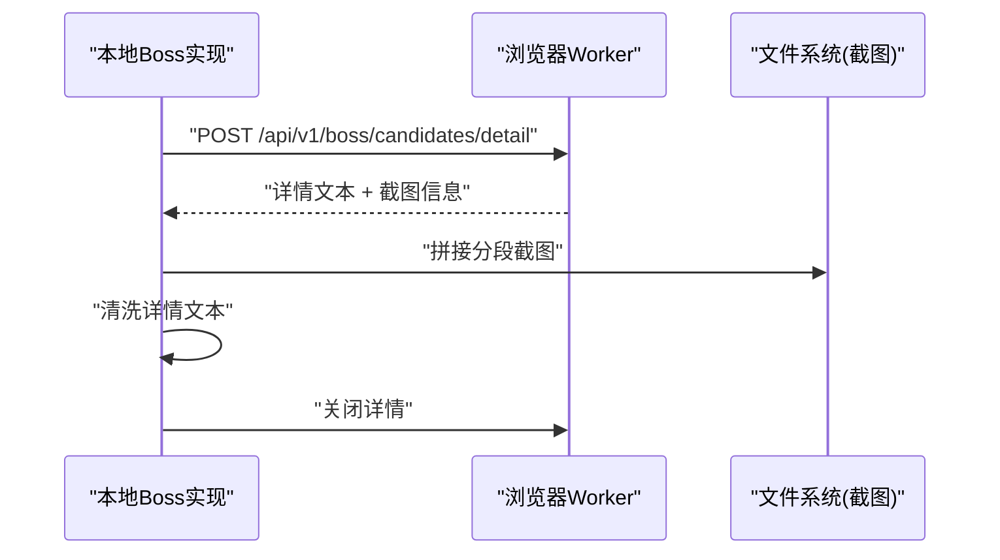

图表来源
- [detail.go:16-63](file://goodhr5/local-agent-go/internal/platforms/boss/detail.go#L16-L63)
- [detail.go:72-87](file://goodhr5/local-agent-go/internal/platforms/boss/detail.go#L72-L87)
- [detail.go:90-107](file://goodhr5/local-agent-go/internal/platforms/boss/detail.go#L90-L107)

章节来源
- [detail.go:16-107](file://goodhr5/local-agent-go/internal/platforms/boss/detail.go#L16-L107)

### 字段映射与 DOM 结构特点
- 卡片容器：使用父类与目标类组合定位候选人卡片节点，支持多候选选择器以提升鲁棒性。
- 字段定位：姓名、基本信息、教育、学校、描述等通过 target_classes 指定，便于适配不同页面结构。
- 详情内容：简历正文通过 #resume 定位，关闭按钮支持多种选择器。
- 行为配置：是否需要详情页、是否支持分页等通过 behavior 控制。

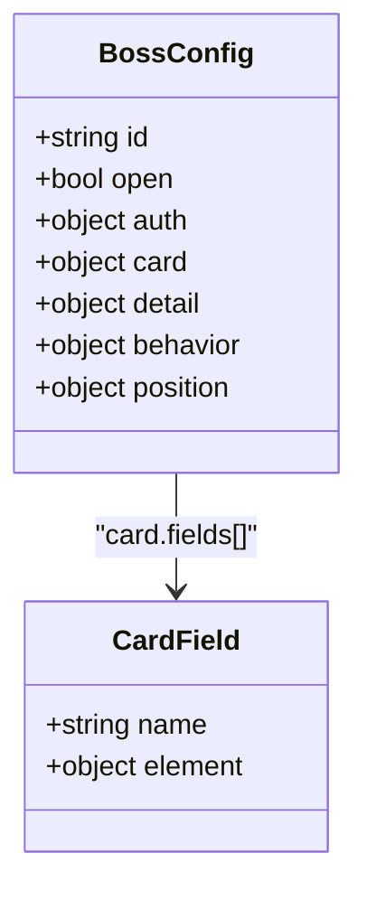

图表来源
- [boss.json:26-69](file://goodhr5/cloud/backend/boss.json#L26-L69)
- [boss.json:72-94](file://goodhr5/cloud/backend/boss.json#L72-L94)
- [boss.json:156-161](file://goodhr5/cloud/backend/boss.json#L156-L161)

章节来源
- [boss.json:26-94](file://goodhr5/cloud/backend/boss.json#L26-L94)
- [boss.json:156-161](file://goodhr5/cloud/backend/boss.json#L156-L161)

### 数据清洗与标准化
- 本地清洗：移除平台附加标记，确保详情文本纯净。
- 云端入库：将本地 JSON 映射为标准化的候选人主体与触达上下文，填充时间戳、状态、AI 评分与原因。
- 前端标准化：将后端扁平模型转换为 UI 友好结构，计算年龄、薪资文本、经历摘要、状态文案等。

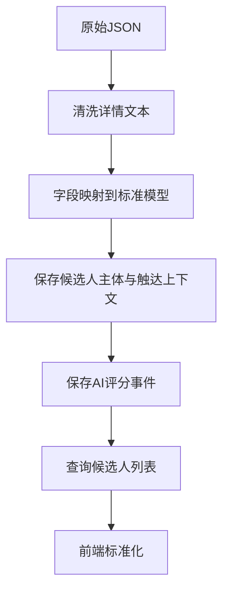

图表来源
- [detail.go:72-87](file://goodhr5/local-agent-go/internal/platforms/boss/detail.go#L72-L87)
- [local_candidate_ingest.go:61-113](file://goodhr5/cloud/backend/internal/httpapi/local_candidate_ingest.go#L61-L113)
- [candidate-normalize.ts:56-112](file://goodhr5/cloud/frontend-next/lib/candidate-normalize.ts#L56-L112)

章节来源
- [detail.go:72-87](file://goodhr5/local-agent-go/internal/platforms/boss/detail.go#L72-L87)
- [local_candidate_ingest.go:61-113](file://goodhr5/cloud/backend/internal/httpapi/local_candidate_ingest.go#L61-L113)
- [candidate-normalize.ts:56-112](file://goodhr5/cloud/frontend-next/lib/candidate-normalize.ts#L56-L112)

### 候选人评分计算与匹配度分析
- 评分来源：本地在详情或打招呼阶段产生 AI 评分与原因，随候选人 JSON 回传至云端。
- 事件记录：云端保存 detail_analysis 与 greet_analysis 两类事件，附带输入输出文本与元数据。
- 展示映射：前端将 ai.detail 与 ai.greet 映射为首次分析与二次分析，并提供分数与理由。

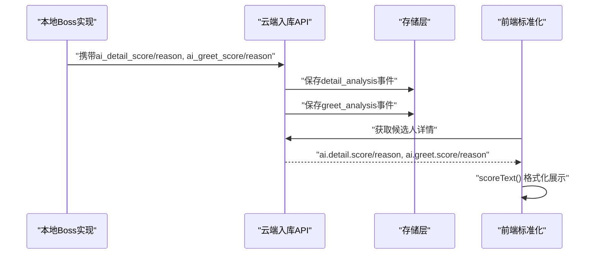

图表来源
- [local_candidate_ingest.go:231-262](file://goodhr5/cloud/backend/internal/httpapi/local_candidate_ingest.go#L231-L262)
- [candidate_service.go:252-294](file://goodhr5/cloud/backend/internal/httpapi/candidate_service.go#L252-L294)
- [candidate-normalize.ts:99-100](file://goodhr5/cloud/frontend-next/lib/candidate-normalize.ts#L99-L100)
- [candidate-normalize.ts:119-123](file://goodhr5/cloud/frontend-next/lib/candidate-normalize.ts#L119-L123)

章节来源
- [local_candidate_ingest.go:231-262](file://goodhr5/cloud/backend/internal/httpapi/local_candidate_ingest.go#L231-L262)
- [candidate_service.go:252-294](file://goodhr5/cloud/backend/internal/httpapi/candidate_service.go#L252-L294)
- [candidate-normalize.ts:99-100](file://goodhr5/cloud/frontend-next/lib/candidate-normalize.ts#L99-L100)
- [candidate-normalize.ts:119-123](file://goodhr5/cloud/frontend-next/lib/candidate-normalize.ts#L119-L123)

### 去重策略
- 指纹生成：基于候选人姓名与年龄生成稳定 ID，前缀标识平台（boss_）。
- 归一化：对姓名与年龄部分进行规范化处理，减少空格与格式差异导致的重复。
- 应用时机：在整理候选人时计算指纹并写入 id 字段，便于后续去重与追踪。

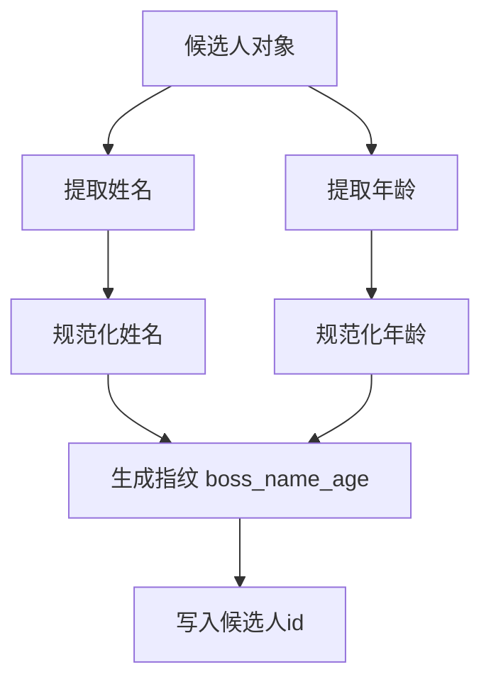

图表来源
- [candidate.go:76-86](file://goodhr5/local-agent-go/internal/platforms/boss/candidate.go#L76-L86)
- [helpers.go:188-192](file://goodhr5/local-agent-go/internal/platforms/boss/helpers.go#L188-L192)

章节来源
- [candidate.go:76-86](file://goodhr5/local-agent-go/internal/platforms/boss/candidate.go#L76-L86)
- [helpers.go:188-192](file://goodhr5/local-agent-go/internal/platforms/boss/helpers.go#L188-L192)

### 数据验证、格式转换与批量处理
- 数据验证：云端入库时对 JSON 体进行类型检查与长度限制（如备注不超过1000字）。
- 格式转换：将字符串、整数、浮点数、数组等字段安全转换为标准模型；空值或缺失字段采用默认值。
- 批量处理：支持累计已处理简历数量与岗位统计同步，提升吞吐与可观测性。

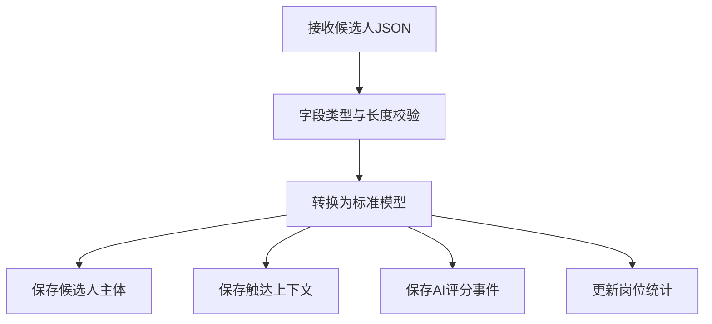

图表来源
- [local_candidate_ingest.go:25-123](file://goodhr5/cloud/backend/internal/httpapi/local_candidate_ingest.go#L25-L123)
- [local_candidate_ingest.go:134-185](file://goodhr5/cloud/backend/internal/httpapi/local_candidate_ingest.go#L134-L185)
- [local_candidate_ingest.go:187-229](file://goodhr5/cloud/backend/internal/httpapi/local_candidate_ingest.go#L187-L229)

章节来源
- [local_candidate_ingest.go:25-123](file://goodhr5/cloud/backend/internal/httpapi/local_candidate_ingest.go#L25-L123)
- [local_candidate_ingest.go:134-185](file://goodhr5/cloud/backend/internal/httpapi/local_candidate_ingest.go#L134-L185)
- [local_candidate_ingest.go:187-229](file://goodhr5/cloud/backend/internal/httpapi/local_candidate_ingest.go#L187-L229)

### 与本地数据库的同步机制与数据持久化策略
- 同步入口：本地程序通过 HTTP 将候选人 JSON 推送至云端入库接口。
- 持久化：云端将候选人主体、触达上下文、事件流水保存到存储层（开发期为内存实现，生产环境可替换为数据库实现）。
- 状态更新：根据候选人状态设置详情读取时间与打招呼时间，并更新岗位扫描、跳过、失败计数。

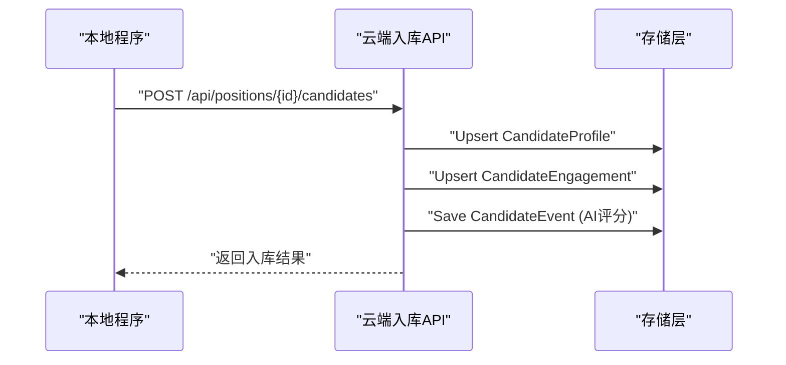

图表来源
- [local_candidate_ingest.go:25-123](file://goodhr5/cloud/backend/internal/httpapi/local_candidate_ingest.go#L25-L123)
- [candidate_store.go:147-156](file://goodhr5/cloud/backend/internal/httpapi/candidate_store.go#L147-L156)

章节来源
- [local_candidate_ingest.go:25-123](file://goodhr5/cloud/backend/internal/httpapi/local_candidate_ingest.go#L25-L123)
- [candidate_store.go:147-156](file://goodhr5/cloud/backend/internal/httpapi/candidate_store.go#L147-L156)

## 依赖关系分析
- 本地 Boss 实现依赖 platformcore.Runtime 接口与 Executor，屏蔽底层浏览器交互细节。
- 云端入库服务依赖 CandidateStore 接口，解耦存储实现，便于开发与生产切换。
- 前端标准化依赖后端返回的扁平模型，提供统一的展示结构。

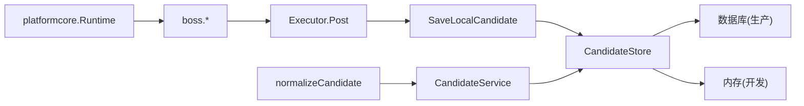

图表来源
- [runtime.go:46-74](file://goodhr5/local-agent-go/internal/platformcore/runtime.go#L46-L74)
- [candidate.go:15-48](file://goodhr5/local-agent-go/internal/platforms/boss/candidate.go#L15-L48)
- [local_candidate_ingest.go:25-123](file://goodhr5/cloud/backend/internal/httpapi/local_candidate_ingest.go#L25-L123)
- [candidate_store.go:147-156](file://goodhr5/cloud/backend/internal/httpapi/candidate_store.go#L147-L156)
- [candidate_service.go:31-76](file://goodhr5/cloud/backend/internal/httpapi/candidate_service.go#L31-L76)
- [candidate-normalize.ts:56-112](file://goodhr5/cloud/frontend-next/lib/candidate-normalize.ts#L56-L112)

章节来源
- [runtime.go:46-74](file://goodhr5/local-agent-go/internal/platformcore/runtime.go#L46-L74)
- [candidate.go:15-48](file://goodhr5/local-agent-go/internal/platforms/boss/candidate.go#L15-L48)
- [local_candidate_ingest.go:25-123](file://goodhr5/cloud/backend/internal/httpapi/local_candidate_ingest.go#L25-L123)
- [candidate_store.go:147-156](file://goodhr5/cloud/backend/internal/httpapi/candidate_store.go#L147-L156)
- [candidate_service.go:31-76](file://goodhr5/cloud/backend/internal/httpapi/candidate_service.go#L31-L76)
- [candidate-normalize.ts:56-112](file://goodhr5/cloud/frontend-next/lib/candidate-normalize.ts#L56-L112)

## 性能考量
- 滚动与分页：通过小步滚动与最大距离限制，避免一次性加载过多导致卡顿。
- 截图拼接：详情截图分段完成后拼接，减少单次传输体积。
- 日志与耗时：关键步骤记录耗时与数量，便于定位瓶颈。
- 批量统计：支持累计已处理简历与岗位统计同步，降低频繁写库压力。

[本节为通用指导，不直接分析具体文件]

## 故障排查指南
- 入口页弹框：若入口页出现确认弹框，需点击确认按钮后继续流程。
- 详情抓取失败：检查详情接口返回与截图调试信息，必要时调整滚动参数与超时。
- 入库失败：检查 JSON 体合法性、字段类型与长度限制，查看入库日志中的错误原因。
- 查询权限：非管理员仅能查看本人创建的候选人；清空简历库需管理员权限。

章节来源
- [entry.go:23-53](file://goodhr5/local-agent-go/internal/platforms/boss/entry.go#L23-L53)
- [detail.go:16-63](file://goodhr5/local-agent-go/internal/platforms/boss/detail.go#L16-L63)
- [local_candidate_ingest.go:25-123](file://goodhr5/cloud/backend/internal/httpapi/local_candidate_ingest.go#L25-L123)
- [candidate_service.go:78-108](file://goodhr5/cloud/backend/internal/httpapi/candidate_service.go#L78-L108)

## 结论
Boss 直聘候选人数据处理通过本地 Agent 与云端后端协作，实现了从页面解析、详情提取、文本清洗、指纹去重、入库持久化到前端标准化的完整闭环。系统具备较强的鲁棒性与可观测性，支持评分事件记录与批量统计，便于在生产环境中稳定运行与持续优化。

[本节为总结，不直接分析具体文件]

## 附录
- 平台配置示例：boss.json 定义了卡片容器、字段定位、详情内容与行为开关，便于适配不同页面结构。
- 前端标准化函数：normalizeCandidate 提供年龄、薪资、经历摘要、状态文案等展示逻辑。

章节来源
- [boss.json:26-94](file://goodhr5/cloud/backend/boss.json#L26-L94)
- [candidate-normalize.ts:56-112](file://goodhr5/cloud/frontend-next/lib/candidate-normalize.ts#L56-L112)