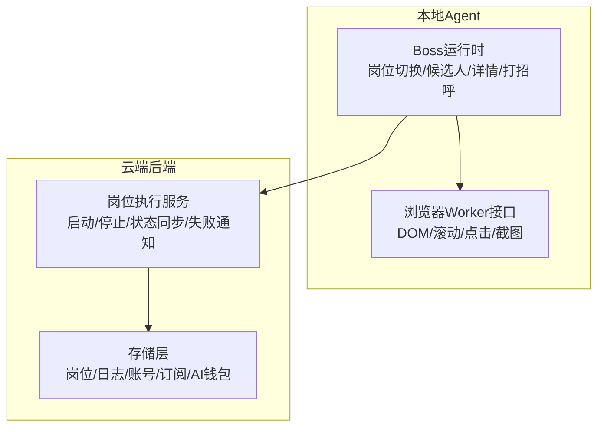
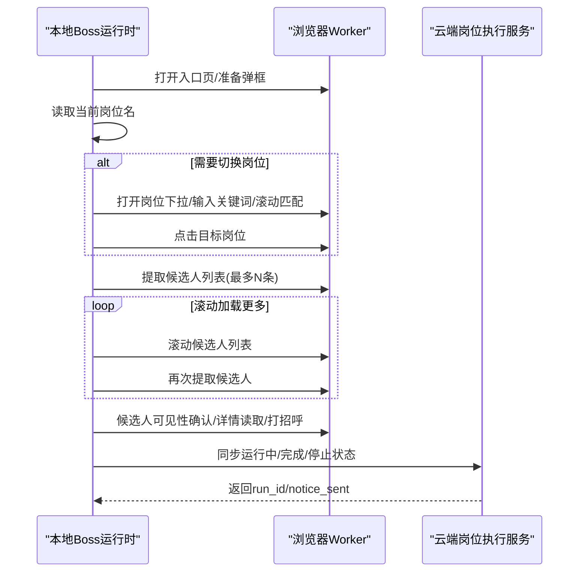
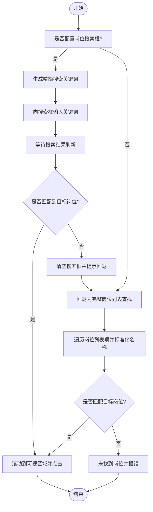
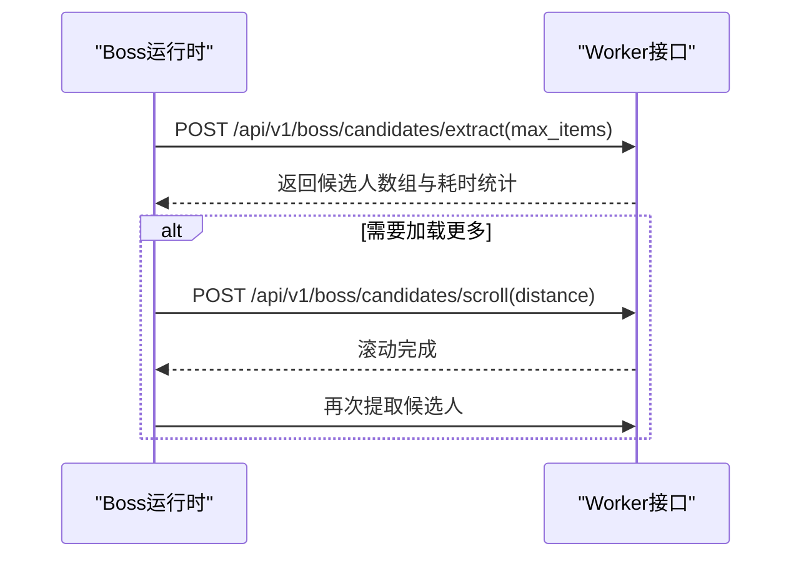
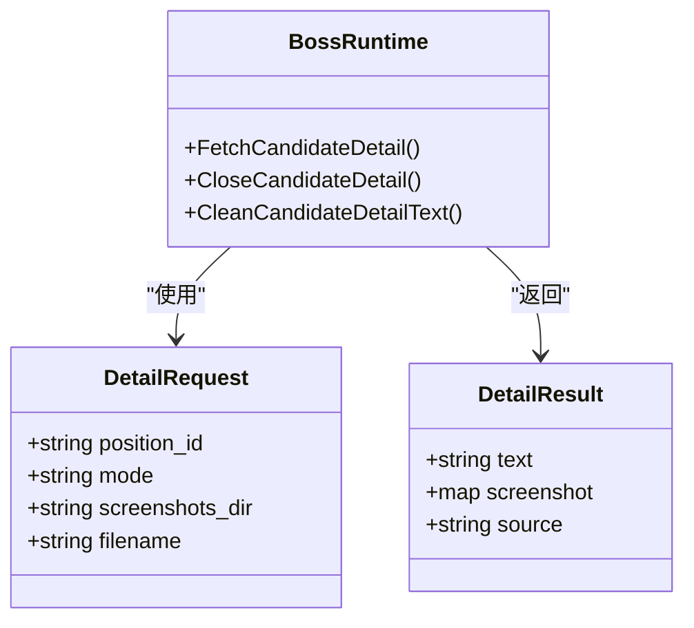
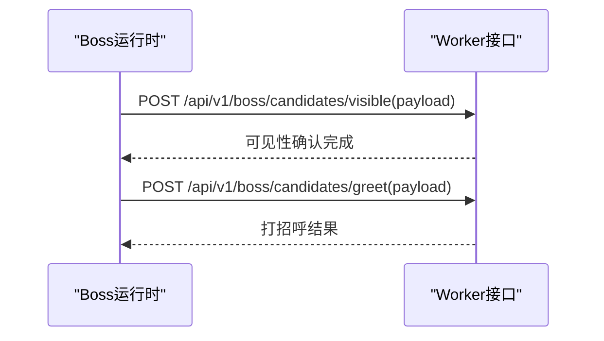
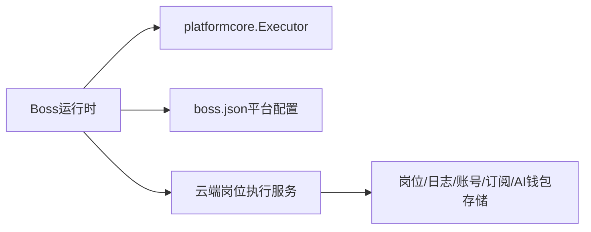
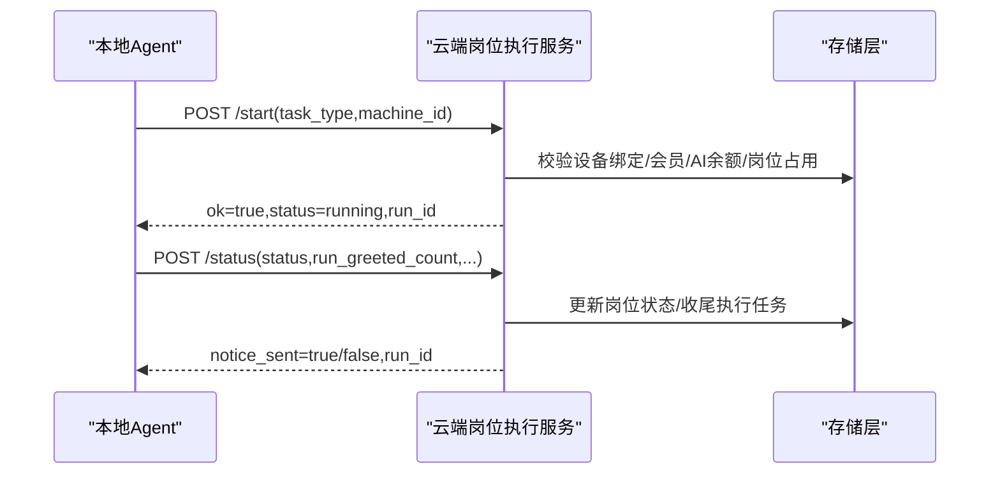

# 岗位搜索与管理

<cite>
**本文引用的文件**   
- [position.go](file://goodhr5/local-agent-go/internal/platforms/boss/position.go)
- [runtime.go](file://goodhr5/local-agent-go/internal/platforms/boss/runtime.go)
- [navigation.go](file://goodhr5/local-agent-go/internal/platforms/boss/navigation.go)
- [helpers.go](file://goodhr5/local-agent-go/internal/platforms/boss/helpers.go)
- [entry.go](file://goodhr5/local-agent-go/internal/platforms/boss/entry.go)
- [candidate.go](file://goodhr5/local-agent-go/internal/platforms/boss/candidate.go)
- [detail.go](file://goodhr5/local-agent-go/internal/platforms/boss/detail.go)
- [greet.go](file://goodhr5/local-agent-go/internal/platforms/boss/greet.go)
- [runtime.go](file://goodhr5/local-agent-go/internal/platformcore/runtime.go)
- [position_execution.go](file://goodhr5/cloud/backend/internal/httpapi/position_execution.go)
- [boss.json](file://goodhr5/cloud/backend/boss.json)
</cite>

## 目录
1. [引言](#引言)
2. [项目结构](#项目结构)
3. [核心组件](#核心组件)
4. [架构总览](#架构总览)
5. [详细组件分析](#详细组件分析)
6. [依赖关系分析](#依赖关系分析)
7. [性能与优化](#性能与优化)
8. [反爬虫与稳定性策略](#反爬虫与稳定性策略)
9. [云端同步与数据转换](#云端同步与数据转换)
10. [故障排查指南](#故障排查指南)
11. [结论](#结论)

## 引言
本文件聚焦 Boss 直聘岗位的“搜索、切换、列表提取、详情读取、打招呼”等关键能力，并结合云端后端的状态机与权限校验，形成从本地浏览器自动化到云端任务编排的完整链路。文档重点覆盖：
- 岗位列表获取与滚动加载机制
- 搜索条件构建与岗位名称匹配算法
- 分页与可见性控制（Boss 不支持服务端分页，采用滚动加载）
- Boss 特有的数据结构、筛选字段映射与去重指纹
- 反爬虫应对、页面等待、异常重试与回退策略
- 云端岗位运行状态同步、AI 余额校验与通知
- 与云端平台配置的同步机制及选择器/定位协议转换

## 项目结构
Boss 直聘相关代码主要分布在两个子系统：
- 本地 Agent 平台实现：负责浏览器操作、DOM 解析、截图、滚动、点击、输入等动作，并通过统一执行器调用 Worker 接口。
- 云端后端服务：负责岗位启动许可、设备绑定校验、会员与 AI 余额检查、运行状态同步、失败通知与邮件提醒。

图表来源
- [runtime.go:54-82](file://goodhr5/local-agent-go/internal/platformcore/runtime.go#L54-L82)
- [position_execution.go:21-51](file://goodhr5/cloud/backend/internal/httpapi/position_execution.go#L21-L51)

章节来源
- [runtime.go:54-82](file://goodhr5/local-agent-go/internal/platformcore/runtime.go#L54-L82)
- [position_execution.go:21-51](file://goodhr5/cloud/backend/internal/httpapi/position_execution.go#L21-L51)

## 核心组件
- Boss 平台运行时 Runtime：封装岗位切换、候选人列表提取、详情读取、打招呼等能力，通过 platformcore.Executor 调用浏览器 Worker。
- 平台通用接口 Runtime：定义跨平台统一的运行时契约，包括入口页处理、岗位选择、候选人可见性、滚动、详情、打招呼、筛选文本与指纹等。
- 云端岗位执行服务 PositionExecutionService：接收本地程序发起的启动、停止、状态同步、失败通知，完成权限校验、资源占用、会员与 AI 余额检查，并持久化状态与发送通知。
- Boss 平台配置 boss.json：定义登录态判断、入口页、卡片字段、详情页、行为开关、岗位下拉框选择器等。

章节来源
- [runtime.go:54-82](file://goodhr5/local-agent-go/internal/platformcore/runtime.go#L54-L82)
- [position_execution.go:21-51](file://goodhr5/cloud/backend/internal/httpapi/position_execution.go#L21-L51)
- [boss.json:1-195](file://goodhr5/cloud/backend/boss.json#L1-L195)

## 架构总览
Boss 直聘岗位搜索与管理的关键流程如下：
- 本地 Runtime 打开入口页并准备页面；
- 根据云端配置读取当前岗位名，若不一致则尝试通过搜索框或列表滚动切换岗位；
- 进入推荐牛人页面后，按最大数量提取当前可见候选人，必要时滚动加载更多；
- 对每个候选人执行可见性确认、详情读取（DOM/OCR/AI）、打招呼；
- 将运行状态、计数与错误上报云端，云端校验设备绑定、会员与 AI 余额，更新岗位状态并发送邮件通知。

图表来源
- [entry.go:12-53](file://goodhr5/local-agent-go/internal/platforms/boss/entry.go#L12-L53)
- [position.go:14-119](file://goodhr5/local-agent-go/internal/platforms/boss/position.go#L14-L119)
- [candidate.go:15-59](file://goodhr5/local-agent-go/internal/platforms/boss/candidate.go#L15-L59)
- [detail.go:16-64](file://goodhr5/local-agent-go/internal/platforms/boss/detail.go#L16-L64)
- [greet.go:13-23](file://goodhr5/local-agent-go/internal/platforms/boss/greet.go#L13-L23)
- [position_execution.go:169-276](file://goodhr5/cloud/backend/internal/httpapi/position_execution.go#L169-L276)

## 详细组件分析

### 岗位切换与搜索
Boss 岗位切换支持两条路径：
- 搜索框优先：构造精简关键词，输入搜索框，多次刷新结果并匹配岗位名称，命中后滚动到可视区域并点击。
- 列表回退：当搜索框不可用或未命中时，遍历岗位列表项，标准化名称后匹配，滚动到可视区域并点击。

图表来源
- [position.go:32-119](file://goodhr5/local-agent-go/internal/platforms/boss/position.go#L32-L119)
- [position.go:121-199](file://goodhr5/local-agent-go/internal/platforms/boss/position.go#L121-L199)
- [navigation.go:73-93](file://goodhr5/local-agent-go/internal/platforms/boss/navigation.go#L73-L93)

章节来源
- [position.go:32-119](file://goodhr5/local-agent-go/internal/platforms/boss/position.go#L32-L119)
- [position.go:121-199](file://goodhr5/local-agent-go/internal/platforms/boss/position.go#L121-L199)
- [navigation.go:73-93](file://goodhr5/local-agent-go/internal/platforms/boss/navigation.go#L73-L93)

### 候选人列表提取与滚动加载
Boss 不支持服务端分页，采用滚动加载。本地 Runtime 调用 Worker 接口提取当前可见候选人，并记录各阶段耗时；如需更多数据，循环滚动列表容器后再提取。

图表来源
- [candidate.go:15-59](file://goodhr5/local-agent-go/internal/platforms/boss/candidate.go#L15-L59)

章节来源
- [candidate.go:15-59](file://goodhr5/local-agent-go/internal/platforms/boss/candidate.go#L15-L59)

### 候选人详情读取与清理
详情读取支持 DOM、OCR、AI 三种模式，Worker 返回结构化文本与可选截图；Boss 运行时负责拼接长图、过滤平台附加内容（如“牛人分析器”），并输出统一 DetailResult。

图表来源
- [detail.go:16-88](file://goodhr5/local-agent-go/internal/platforms/boss/detail.go#L16-L88)
- [runtime.go:23-36](file://goodhr5/local-agent-go/internal/platformcore/runtime.go#L23-L36)

章节来源
- [detail.go:16-88](file://goodhr5/local-agent-go/internal/platforms/boss/detail.go#L16-L88)
- [runtime.go:23-36](file://goodhr5/local-agent-go/internal/platformcore/runtime.go#L23-L36)

### 候选人可见性与打招呼
为保证点击稳定，Boss 在决策前会先将候选人卡片滚动至可视区域，再执行打招呼。可见性参数由统一函数组装，包含平台配置、卡片索引、元素引用、滚动参数与视口边距等。

图表来源
- [greet.go:13-23](file://goodhr5/local-agent-go/internal/platforms/boss/greet.go#L13-L23)
- [runtime.go:21-36](file://goodhr5/local-agent-go/internal/platforms/boss/runtime.go#L21-L36)

章节来源
- [greet.go:13-23](file://goodhr5/local-agent-go/internal/platforms/boss/greet.go#L13-L23)
- [runtime.go:21-36](file://goodhr5/local-agent-go/internal/platforms/boss/runtime.go#L21-L36)

### 入口页与页面匹配
Boss 入口页逻辑：
- 打开入口 URL；
- 检测并关闭可能出现的确认弹框；
- 判断当前页面是否为岗位运行入口页（URL 匹配规则支持 prefix/contains/exact）。

章节来源
- [entry.go:12-72](file://goodhr5/local-agent-go/internal/platforms/boss/entry.go#L12-L72)
- [navigation.go:12-71](file://goodhr5/local-agent-go/internal/platforms/boss/navigation.go#L12-L71)

### 平台配置与定位协议
Boss 平台配置 boss.json 定义了：
- 登录态判断与入口页；
- 候选人卡片字段定位（姓名、基本信息、学历、学校、描述等）；
- 详情页内容与关闭按钮；
- 行为开关（是否需要详情页、是否支持分页等）；
- 岗位下拉框的选择器（列表、当前、切换按钮、搜索框等）。

本地 helpers 将云端配置中的 target_classes/parent_classes/find_attempts/find_interval_ms 等字段转换为 Worker 统一元素协议，保证跨平台一致性。

章节来源
- [boss.json:1-195](file://goodhr5/cloud/backend/boss.json#L1-L195)
- [helpers.go:112-160](file://goodhr5/local-agent-go/internal/platforms/boss/helpers.go#L112-L160)

## 依赖关系分析
- 本地 Runtime 依赖 platformcore.Executor 抽象，屏蔽底层浏览器 Worker 差异。
- 云端 PositionExecutionService 依赖多个存储与服务（岗位、日志、账号、订阅、AI钱包、邮件、用户流等），提供原子化的启动许可与状态同步。
- Boss 平台配置 boss.json 驱动 UI 选择器与行为开关，变更无需改动代码。

图表来源
- [runtime.go:54-82](file://goodhr5/local-agent-go/internal/platformcore/runtime.go#L54-L82)
- [position_execution.go:21-51](file://goodhr5/cloud/backend/internal/httpapi/position_execution.go#L21-L51)
- [boss.json:1-195](file://goodhr5/cloud/backend/boss.json#L1-L195)

章节来源
- [runtime.go:54-82](file://goodhr5/local-agent-go/internal/platformcore/runtime.go#L54-L82)
- [position_execution.go:21-51](file://goodhr5/cloud/backend/internal/httpapi/position_execution.go#L21-L51)
- [boss.json:1-195](file://goodhr5/cloud/backend/boss.json#L1-L195)

## 性能与优化
- 候选人提取耗时统计：Worker 返回 find_elapsed_ms、convert_elapsed_ms、elapsed_ms，便于监控 DOM 查找与数据转换瓶颈。
- 滚动加载优化：按需滚动，避免一次性拉取过多数据导致内存压力；滚动距离与次数可配置。
- 详情截图分段：Worker 返回 parts_count 与 scrollable_container 信息，Boss 运行时进行拼接，减少大图传输开销。
- 日志摘要：使用 previewFieldValue 限制日志长度，避免日志膨胀影响 IO。

章节来源
- [candidate.go:15-48](file://goodhr5/local-agent-go/internal/platforms/boss/candidate.go#L15-L48)
- [detail.go:43-63](file://goodhr5/local-agent-go/internal/platforms/boss/detail.go#L43-L63)
- [helpers.go:38-48](file://goodhr5/local-agent-go/internal/platforms/boss/helpers.go#L38-L48)
- [helpers.go:194-206](file://goodhr5/local-agent-go/internal/platforms/boss/helpers.go#L194-L206)

## 反爬虫与稳定性策略
- 页面等待与延时：多处显式 Delay，确保 DOM 渲染、弹窗关闭、搜索结果刷新完成。
- 滚动到可视区域：点击前 ensure-visible，设置 viewport_margin、require_full、vertical_only 等参数，提升点击成功率。
- 多轮重试与回退：岗位搜索框未命中时自动回退到完整列表；搜索框不可用时直接走列表匹配。
- 规范化比较：岗位名称与候选人名/年龄均做规范化处理，去除空白与括号说明，降低误判。
- 调试追踪：详情读取增加 traceID 与截图调试信息，便于定位滚动与分段问题。

章节来源
- [position.go:42-119](file://goodhr5/local-agent-go/internal/platforms/boss/position.go#L42-L119)
- [position.go:121-199](file://goodhr5/local-agent-go/internal/platforms/boss/position.go#L121-L199)
- [navigation.go:73-93](file://goodhr5/local-agent-go/internal/platforms/boss/navigation.go#L73-L93)
- [detail.go:16-64](file://goodhr5/local-agent-go/internal/platforms/boss/detail.go#L16-L64)

## 云端同步与数据转换
- 启动许可：本地请求 Start，云端校验设备绑定、岗位归属、会员与 AI 余额，通过后写入 running 并创建执行任务记录。
- 状态同步：本地周期性同步 running/completed/stopped，云端根据状态变化决定是否发送邮件通知，并收尾执行任务记录。
- 失败通知：本地上报失败原因，云端归类为统一原因码（如会员过期、AI 配置无效、未登录、缺少运行时等），并记录用户流程事件。
- 数据转换：云端岗位公共配置中的 mode_default 与 detail_mode 决定是否需要 AI；PositionExecutionService 安全读取这些字段以决定是否允许启动。

图表来源
- [position_execution.go:55-96](file://goodhr5/cloud/backend/internal/httpapi/position_execution.go#L55-L96)
- [position_execution.go:169-276](file://goodhr5/cloud/backend/internal/httpapi/position_execution.go#L169-L276)
- [position_execution.go:340-361](file://goodhr5/cloud/backend/internal/httpapi/position_execution.go#L340-L361)

章节来源
- [position_execution.go:55-96](file://goodhr5/cloud/backend/internal/httpapi/position_execution.go#L55-L96)
- [position_execution.go:169-276](file://goodhr5/cloud/backend/internal/httpapi/position_execution.go#L169-L276)
- [position_execution.go:340-361](file://goodhr5/cloud/backend/internal/httpapi/position_execution.go#L340-L361)

## 故障排查指南
- 岗位未找到或名称不一致：检查岗位模板名称是否与 Boss 展示名称一致；确认岗位下拉框选择器是否正确。
- 搜索框不可用：系统会自动回退到完整列表匹配；若仍失败，检查岗位列表容器与项选择器。
- 候选人提取为空：检查候选人卡片容器与字段选择器；查看 Worker 返回的 found_count 与耗时统计。
- 详情截图为空或分段异常：关注截图调试信息与 parts_count；确认滚动容器与视口边距配置。
- 云端启动失败：常见原因为设备未绑定、会员到期、AI 余额不足、岗位已在运行；根据错误码与消息定位。

章节来源
- [position.go:14-119](file://goodhr5/local-agent-go/internal/platforms/boss/position.go#L14-L119)
- [candidate.go:15-48](file://goodhr5/local-agent-go/internal/platforms/boss/candidate.go#L15-L48)
- [detail.go:43-63](file://goodhr5/local-agent-go/internal/platforms/boss/detail.go#L43-L63)
- [position_execution.go:279-337](file://goodhr5/cloud/backend/internal/httpapi/position_execution.go#L279-L337)

## 结论
Boss 直聘岗位搜索与管理在本系统中通过“本地浏览器自动化 + 云端状态机”的方式实现：本地 Runtime 负责页面交互与数据抽取，云端服务负责权限校验、资源管理与通知。通过配置驱动的 UI 选择器、稳健的回退与重试策略、详细的耗时与调试信息，系统在复杂反爬环境下仍能保持较高的稳定性与可观测性。后续优化可围绕滚动策略精细化、缓存候选人与详情、以及更细粒度的性能埋点展开。