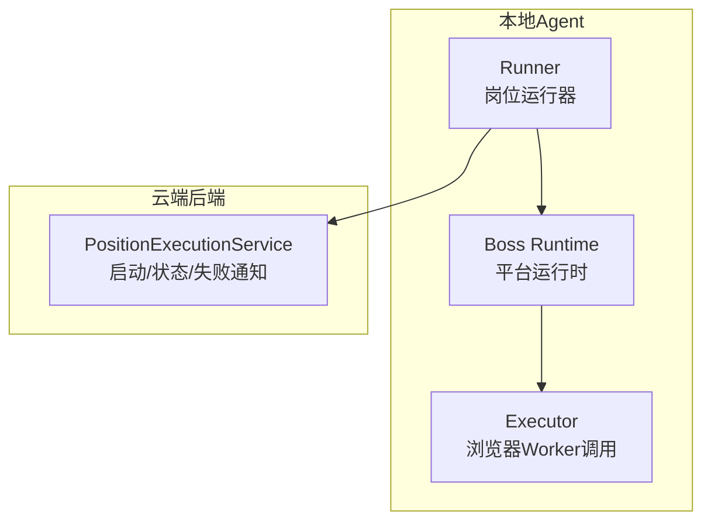
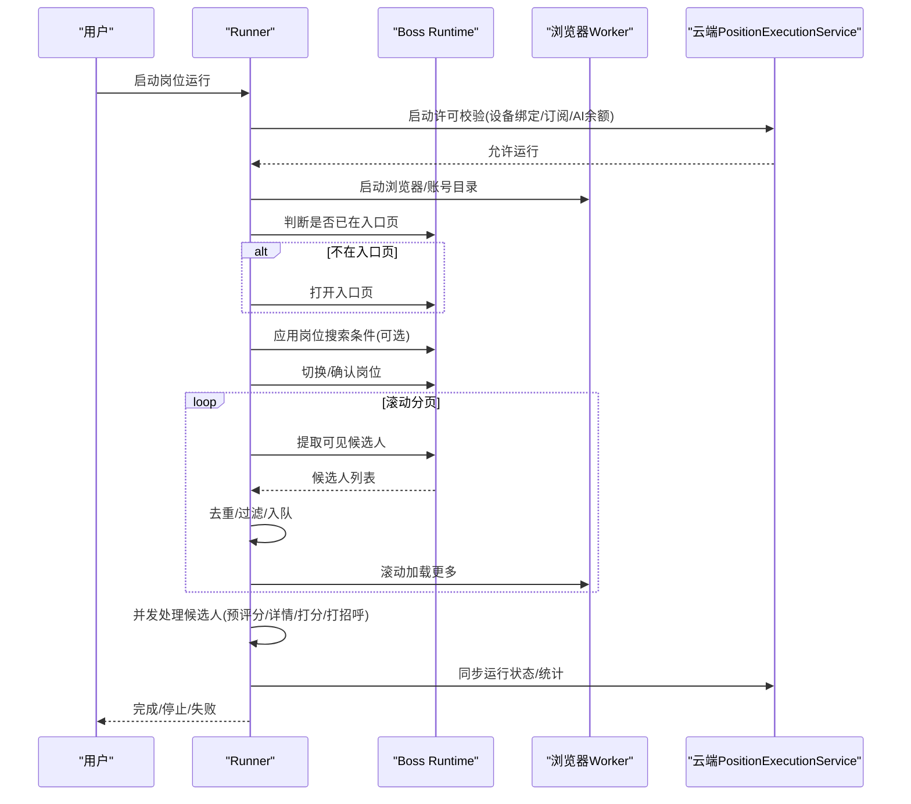
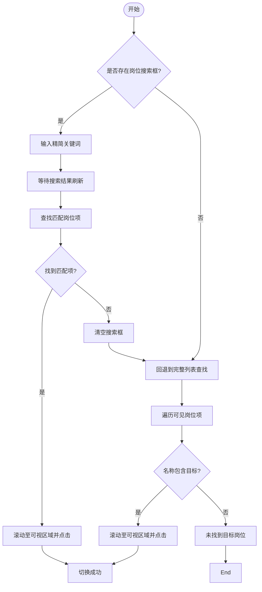
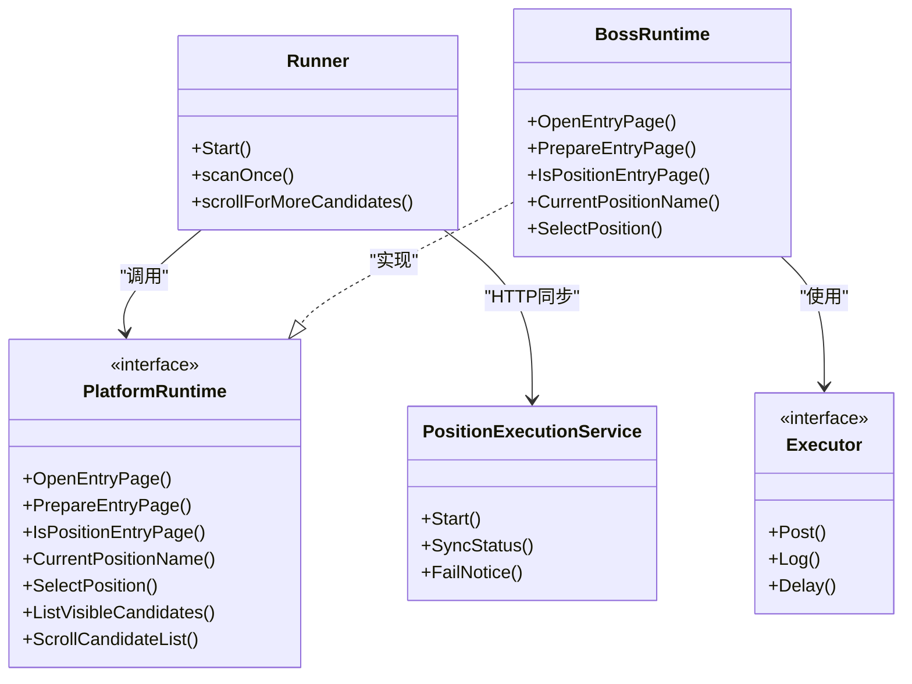

# 岗位搜索与管理

<cite>
**本文引用的文件**
- [position.go](file://goodhr5/local-agent-go/internal/platforms/boss/position.go)
- [runtime.go](file://goodhr5/local-agent-go/internal/platforms/boss/runtime.go)
- [entry.go](file://goodhr5/local-agent-go/internal/platforms/boss/entry.go)
- [navigation.go](file://goodhr5/local-agent-go/internal/platforms/boss/navigation.go)
- [helpers.go](file://goodhr5/local-agent-go/internal/platforms/boss/helpers.go)
- [runner.go](file://goodhr5/local-agent-go/internal/positionrunner/runner.go)
- [scan.go](file://goodhr5/local-agent-go/internal/positionrunner/scan.go)
- [runtime.go](file://goodhr5/local-agent-go/internal/platformcore/runtime.go)
- [position_execution.go](file://goodhr5/cloud/backend/internal/httpapi/position_execution.go)
</cite>

## 目录
1. [简介](#简介)
2. [项目结构](#项目结构)
3. [核心组件](#核心组件)
4. [架构总览](#架构总览)
5. [详细组件分析](#详细组件分析)
6. [依赖关系分析](#依赖关系分析)
7. [性能与优化](#性能与优化)
8. [故障排查指南](#故障排查指南)
9. [结论](#结论)
10. [附录](#附录)

## 简介
本文件聚焦 Boss 直聘平台的“岗位搜索与管理”能力，覆盖以下关键主题：
- 岗位列表获取、搜索条件构建、分页滚动机制
- Boss 特有的数据结构、筛选条件映射、搜索结果解析策略
- 反爬虫策略应对、页面加载等待、异常重试机制
- 搜索优化技巧、缓存策略、性能监控方法
- 与云端岗位配置的同步机制和数据转换规则

该能力由本地 Agent 的岗位运行器（Runner）驱动，通过平台运行时接口与 Boss 浏览器 Worker 交互，完成入口页准备、岗位选择、候选人提取、详情处理与打招呼等流程；同时与云端后端进行状态同步与权限校验。

## 项目结构
围绕 Boss 岗位搜索与管理的关键代码分布在如下模块：
- 平台运行时实现（Boss）：负责打开入口页、切换岗位、读取当前岗位、辅助工具与导航逻辑
- 岗位运行器（Runner）：编排整体扫描流程、等待页面稳定、滚动加载更多、并发处理候选人、统计与持久化
- 平台统一接口（platformcore）：定义 Executor、Runtime、可选扩展能力（基础筛选、岗位搜索准备、直接切换等）
- 云端后端（httpapi）：提供启动许可、状态同步、失败通知等接口，保障账号绑定、订阅与 AI 余额等前置条件

图表来源
- [scan.go:17-182](file://goodhr5/local-agent-go/internal/positionrunner/scan.go#L17-L182)
- [runtime.go:46-74](file://goodhr5/local-agent-go/internal/platformcore/runtime.go#L46-L74)
- [position_execution.go:49-91](file://goodhr5/cloud/backend/internal/httpapi/position_execution.go#L49-L91)

章节来源
- [scan.go:17-182](file://goodhr5/local-agent-go/internal/positionrunner/scan.go#L17-L182)
- [runtime.go:46-74](file://goodhr5/local-agent-go/internal/platformcore/runtime.go#L46-L74)
- [position_execution.go:49-91](file://goodhr5/cloud/backend/internal/httpapi/position_execution.go#L49-L91)

## 核心组件
- Runner（岗位运行器）：负责启动浏览器、确认入口页、应用岗位搜索条件、切换岗位、提取候选人、滚动分页、并发处理候选人、保存结果与统计、与云端同步状态
- Boss Runtime（Boss 平台运行时）：实现入口页打开、弹框处理、当前岗位读取、岗位选择（支持搜索框优先或列表匹配）、辅助工具函数
- platformcore 接口：抽象出 Executor、Runtime、BasicFilterApplier、PositionSearchPreparer、DirectPositionSelector 等能力，使不同平台可插拔
- 云端 PositionExecutionService：校验设备绑定、订阅与AI余额、原子占用岗位名额、接收状态同步与失败通知并发送邮件提醒

章节来源
- [runner.go:71-216](file://goodhr5/local-agent-go/internal/positionrunner/runner.go#L71-L216)
- [position.go:12-119](file://goodhr5/local-agent-go/internal/platforms/boss/position.go#L12-L119)
- [runtime.go:46-111](file://goodhr5/local-agent-go/internal/platformcore/runtime.go#L46-L111)
- [position_execution.go:49-275](file://goodhr5/cloud/backend/internal/httpapi/position_execution.go#L49-L275)

## 架构总览
下图展示一次完整的 Boss 岗位扫描流程，从 Runner 启动到云端状态同步：

图表来源
- [scan.go:17-182](file://goodhr5/local-agent-go/internal/positionrunner/scan.go#L17-L182)
- [scan.go:495-510](file://goodhr5/local-agent-go/internal/positionrunner/scan.go#L495-L510)
- [position_execution.go:49-91](file://goodhr5/cloud/backend/internal/httpapi/position_execution.go#L49-L91)

## 详细组件分析

### Boss 岗位选择与搜索
- 当前岗位读取：通过配置定位元素提取文本，若为空则记录诊断信息并返回错误
- 岗位切换策略：
  - 优先尝试通过“岗位搜索框”输入精简关键词查找并点击匹配项
  - 若搜索框不可用或未匹配成功，回退为遍历可见岗位列表，滚动至目标项后点击
- 关键词生成：去除括号说明、清理多余空格，提高匹配成功率
- 元素定位：使用统一的元素协议（target_classes/parent_classes/find_attempts 等），兼容多种配置风格

图表来源
- [position.go:32-119](file://goodhr5/local-agent-go/internal/platforms/boss/position.go#L32-L119)
- [position.go:121-199](file://goodhr5/local-agent-go/internal/platforms/boss/position.go#L121-L199)
- [navigation.go:73-93](file://goodhr5/local-agent-go/internal/platforms/boss/navigation.go#L73-L93)

章节来源
- [position.go:12-119](file://goodhr5/local-agent-go/internal/platforms/boss/position.go#L12-L119)
- [position.go:121-199](file://goodhr5/local-agent-go/internal/platforms/boss/position.go#L121-L199)
- [navigation.go:73-93](file://goodhr5/local-agent-go/internal/platforms/boss/navigation.go#L73-L93)

### 入口页准备与页面判定
- 打开入口页：校验入口URL非空，调用浏览器打开
- 入口页准备：检测并关闭可能出现的确认弹框
- 页面判定：读取当前页面列表，判断是否匹配入口配置（支持前缀/包含/精确匹配）

章节来源
- [entry.go:12-73](file://goodhr5/local-agent-go/internal/platforms/boss/entry.go#L12-L73)
- [navigation.go:12-71](file://goodhr5/local-agent-go/internal/platforms/boss/navigation.go#L12-L71)

### 候选人提取与分页滚动
- 每轮扫描：
  - 等待页面稳定（PageReadyDelay）
  - 提取当前可见候选人（最多 maxItems）
  - 去重并加入队列
  - 若无新候选人，滚动一定距离继续加载，达到连续空轮次上限则停止
- 滚动参数：带随机抖动的滚动距离，避免固定模式触发反爬
- 可见性保证：在打分前确保候选人卡片滚动到可视区域

章节来源
- [scan.go:17-182](file://goodhr5/local-agent-go/internal/positionrunner/scan.go#L17-L182)
- [scan.go:495-510](file://goodhr5/local-agent-go/internal/positionrunner/scan.go#L495-L510)
- [scan.go:512-526](file://goodhr5/local-agent-go/internal/positionrunner/scan.go#L512-L526)

### 平台接口与扩展能力
- 基础能力：打开入口页、准备入口页、判断入口页、读取当前岗位、切换岗位、提取候选人、滚动列表、读取详情、关闭详情、打招呼、候选人类指纹与筛选文本
- 可选扩展：
  - BasicFilterApplier：应用平台基础筛选条件
  - PositionSearchPreparer：首次确认岗位前应用岗位搜索条件
  - DirectPositionSelector：跳过读取当前岗位，直接切换目标岗位
  - DetailAnalysisScroller：AI 分析期间滚动候选人详情

章节来源
- [runtime.go:46-111](file://goodhr5/local-agent-go/internal/platformcore/runtime.go#L46-L111)

### 云端同步与数据转换
- 启动许可：校验设备绑定、订阅权限、AI 余额，原子占用岗位名额
- 状态同步：接收 running/completed/stopped 状态，更新岗位状态并发送通知邮件
- 失败通知：根据错误消息归类原因，写入用户流程事件并发送邮件提醒
- 数据转换：Runner 将本地统计增量转换为云端期望字段，保持幂等与不重复累计

章节来源
- [position_execution.go:49-275](file://goodhr5/cloud/backend/internal/httpapi/position_execution.go#L49-L275)
- [position_execution.go:311-406](file://goodhr5/cloud/backend/internal/httpapi/position_execution.go#L311-L406)

## 依赖关系分析
- Runner 依赖 platformcore.Runtime 抽象，Boss Runtime 实现具体平台行为
- Boss Runtime 依赖统一的 Executor 调用浏览器 Worker，使用 helpers 中的通用工具函数
- Runner 与云端 PositionExecutionService 通过 HTTP 接口通信，进行启动许可、状态同步与失败通知
- 平台配置（PlatformConfig）贯穿全流程，用于元素定位、入口页匹配、筛选条件等

图表来源
- [scan.go:17-182](file://goodhr5/local-agent-go/internal/positionrunner/scan.go#L17-L182)
- [runtime.go:46-111](file://goodhr5/local-agent-go/internal/platformcore/runtime.go#L46-L111)
- [position_execution.go:49-275](file://goodhr5/cloud/backend/internal/httpapi/position_execution.go#L49-L275)

章节来源
- [scan.go:17-182](file://goodhr5/local-agent-go/internal/positionrunner/scan.go#L17-L182)
- [runtime.go:46-111](file://goodhr5/local-agent-go/internal/platformcore/runtime.go#L46-L111)
- [position_execution.go:49-275](file://goodhr5/cloud/backend/internal/httpapi/position_execution.go#L49-L275)

## 性能与优化
- 分页与滚动
  - 使用带随机抖动的滚动距离，降低被反爬识别的概率
  - 设置 PageReadyDelay 等待页面稳定，减少无效提取
  - 连续空轮次上限控制，避免无限滚动
- 并发与超时
  - 候选人处理采用并发预评分与主流程顺序消费，提升吞吐
  - 为候选人处理设置总超时，防止长时间阻塞
- 日志与监控
  - 关键步骤均输出日志（岗位切换、滚动、提取、打分、打招呼、失败原因）
  - 云端记录用户流程事件，便于追踪失败原因与运营指标
- 缓存策略建议
  - 对岗位列表项与详情页内容做短期内存缓存，减少重复 DOM 操作
  - 对云端状态同步做幂等处理，避免重复累计统计
- 反爬虫策略应对
  - 模拟人工操作延时（滚动、点击、查看详情前后延时）
  - 随机化滚动距离与停留时间
  - 失败时快速回退（如搜索框不可用回退到列表匹配）

[本节为通用指导，不直接分析具体文件]

## 故障排查指南
- 入口页问题
  - 检查入口URL配置是否正确
  - 查看是否出现弹框需要确认
  - 确认当前页面是否匹配入口配置（前缀/包含/精确）
- 岗位切换失败
  - 检查岗位名称是否与平台显示一致（规范化比较）
  - 若搜索框不可用，查看是否回退到列表匹配
  - 关注滚动至可视区域的尝试次数与最终可见性
- 候选人提取为空
  - 检查页面是否已加载稳定
  - 查看滚动是否生效，是否有新候选人加载
  - 确认去重逻辑是否误判重复
- 云端同步失败
  - 检查设备绑定是否完成
  - 检查订阅与AI余额是否满足要求
  - 查看失败通知是否成功发送邮件

章节来源
- [entry.go:23-73](file://goodhr5/local-agent-go/internal/platforms/boss/entry.go#L23-L73)
- [position.go:32-119](file://goodhr5/local-agent-go/internal/platforms/boss/position.go#L32-L119)
- [scan.go:591-660](file://goodhr5/local-agent-go/internal/positionrunner/scan.go#L591-L660)
- [position_execution.go:215-275](file://goodhr5/cloud/backend/internal/httpapi/position_execution.go#L215-L275)

## 结论
Boss 直聘岗位搜索与管理功能通过 Runner 编排、Boss Runtime 实现与 platformcore 抽象，形成了高内聚、低耦合的平台适配体系。其特点包括：
- 灵活的岗位选择策略（搜索框优先、列表回退）
- 稳健的分页滚动与去重机制
- 完善的异常重试与回退路径
- 与云端的强一致性状态同步与权限校验
- 丰富的日志与监控能力，便于问题定位与性能优化

建议在后续迭代中持续优化：
- 精细化反爬策略（更自然的交互节奏）
- 增强缓存与重试机制（减少网络与DOM开销）
- 完善错误分类与告警（更快定位问题）

[本节为总结性内容，不直接分析具体文件]

## 附录
- 关键配置项参考
  - 平台配置（PlatformConfig）：入口页、岗位元素定位、筛选条件等
  - Runner 启动参数：扫描轮次、滚动距离、详情页打开概率、延时范围等
- 常用接口
  - 浏览器 Worker：/api/v1/page/open、/api/v1/page/click、/api/v1/page/find-elements、/api/v1/page/list-click-by-index、/api/v1/page/ensure-visible、/api/v1/page/type
  - 云端接口：/start、/status、/stop、/fail_notice

[本节为补充信息，不直接分析具体文件]