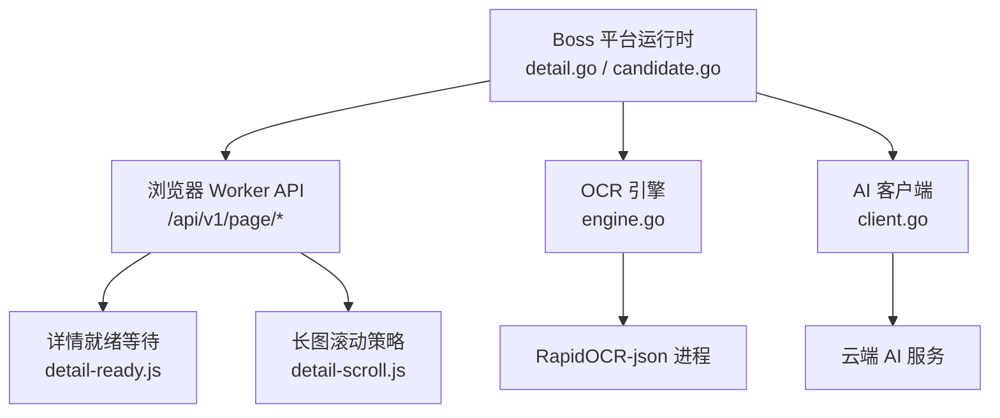
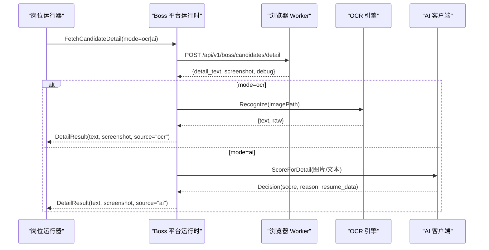
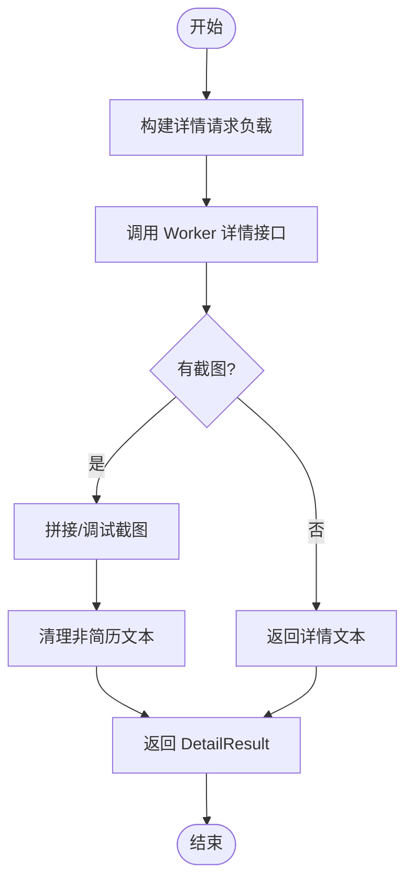
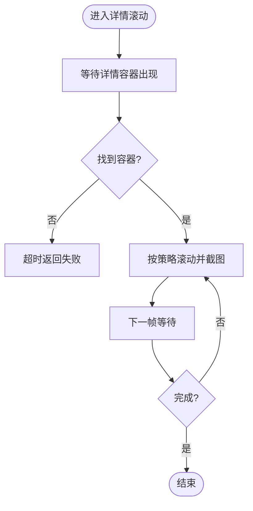
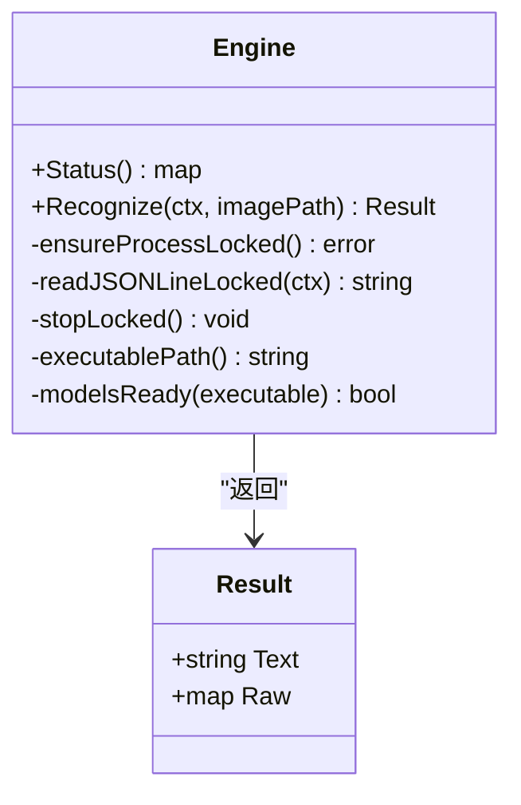
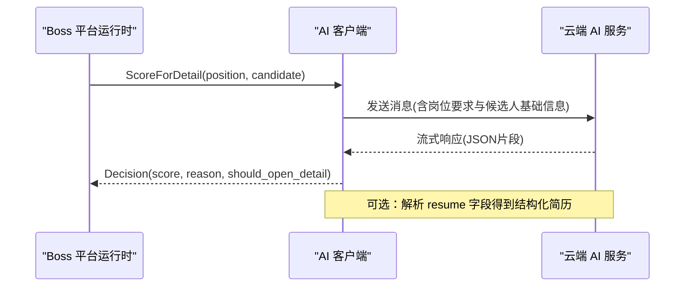
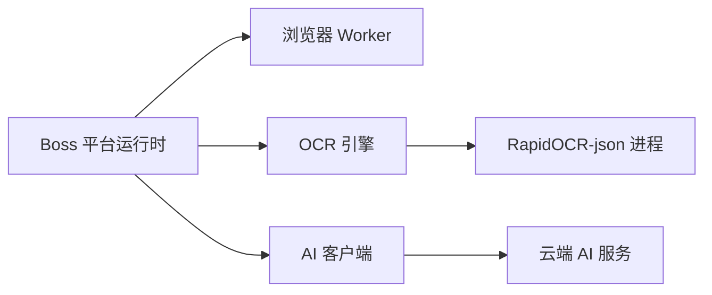
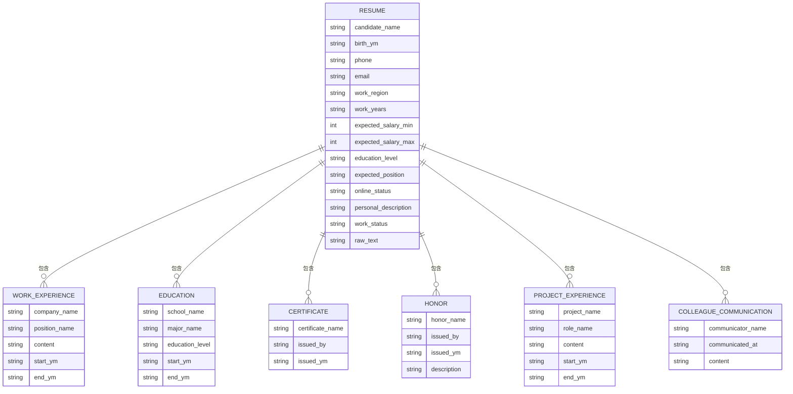

# 简历详情解析

<cite>
**本文引用的文件**
- [detail.go](file://goodhr5/local-agent-go/internal/platforms/boss/detail.go)
- [candidate.go](file://goodhr5/local-agent-go/internal/platforms/boss/candidate.go)
- [runtime.go](file://goodhr5/local-agent-go/internal/platformcore/runtime.go)
- [helpers.go](file://goodhr5/local-agent-go/internal/platforms/boss/helpers.go)
- [entry.go](file://goodhr5/local-agent-go/internal/platforms/boss/entry.go)
- [navigation.go](file://goodhr5/local-agent-go/internal/platforms/boss/navigation.go)
- [engine.go](file://goodhr5/local-agent-go/internal/ocr/engine.go)
- [client.go](file://goodhr5/local-agent-go/internal/localai/client.go)
- [detail-ready.js](file://goodhr5/local-agent-go/worker-node/src/detail-ready.js)
- [detail-scroll.js](file://goodhr5/local-agent-go/worker-node/src/detail-scroll.js)
- [profile-process.js](file://goodhr5/local-agent-go/worker-node/src/profile-process.js)
- [简历模型.json](file://goodhr5/简历模型.json)
</cite>

## 目录
1. [简介](#简介)
2. [项目结构](#项目结构)
3. [核心组件](#核心组件)
4. [架构总览](#架构总览)
5. [详细组件分析](#详细组件分析)
6. [依赖关系分析](#依赖关系分析)
7. [性能考量](#性能考量)
8. [故障排查指南](#故障排查指南)
9. [结论](#结论)
10. [附录](#附录)

## 简介
本文件聚焦 Boss 直聘简历详情解析能力，覆盖从页面访问、HTML/截图抓取、结构化数据提取到 OCR/AI 集成的完整链路。文档重点说明：
- Boss 简历页布局特点与关键信息定位策略
- 工作经历、技能标签、教育背景、项目经验的解析路径
- 内容质量评估、敏感信息过滤与隐私保护机制
- 与本地 AI 服务及 OCR 引擎的集成方式与优化策略

## 项目结构
Boss 简历详情解析由“平台运行时 + 浏览器 Worker + OCR + AI”四部分协作完成：
- 平台运行时（Go）：封装 Boss 平台能力，负责调用浏览器 Worker 接口、组装请求参数、清理非简历文本、关闭详情页等。
- 浏览器 Worker（Node.js）：负责页面等待、滚动、截图、DOM 提取、元素定位与可见性检测。
- OCR 引擎（Go）：启动本地 RapidOCR-json 进程，对截图进行文字识别并返回结构化文本。
- AI 客户端（Go）：调用云端 OpenAI 兼容接口，基于图片/文本进行评分、原因输出与结构化简历解析。

**图示来源**
- [detail.go:14-64](file://goodhr5/local-agent-go/internal/platforms/boss/detail.go#L14-L64)
- [detail-ready.js:9-52](file://goodhr5/local-agent-go/worker-node/src/detail-ready.js#L9-L52)
- [detail-scroll.js:15-38](file://goodhr5/local-agent-go/worker-node/src/detail-scroll.js#L15-L38)
- [engine.go:59-97](file://goodhr5/local-agent-go/internal/ocr/engine.go#L59-L97)
- [client.go:164-200](file://goodhr5/local-agent-go/internal/localai/client.go#L164-L200)

**章节来源**
- [detail.go:14-64](file://goodhr5/local-agent-go/internal/platforms/boss/detail.go#L14-L64)
- [runtime.go:23-36](file://goodhr5/local-agent-go/internal/platformcore/runtime.go#L23-L36)

## 核心组件
- Boss 平台运行时
  - 打开入口页、处理弹框、判断当前页面是否岗位入口
  - 列表候选人提取、滚动、确保候选卡片可见
  - 读取候选人详情（支持 DOM/OCR/AI 三种模式）、清理非简历文本、关闭详情
- 浏览器 Worker
  - 等待详情容器出现（轮询超时控制）
  - 统一滚动节奏与方向判定（避免无效滚动）
  - 截图拼接与调试信息输出
- OCR 引擎
  - 管理 RapidOCR-json 常驻进程
  - 校验模型完整性、错误日志记录、结果文本收集
- AI 客户端
  - 计算打招呼/查看详情评分
  - 解析视觉输入的结构化简历 JSON（含 analysis 分数与 resume 字段）
  - 流式进度与提前决策回调

**章节来源**
- [entry.go:12-73](file://goodhr5/local-agent-go/internal/platforms/boss/entry.go#L12-L73)
- [candidate.go:13-87](file://goodhr5/local-agent-go/internal/platforms/boss/candidate.go#L13-L87)
- [detail.go:14-108](file://goodhr5/local-agent-go/internal/platforms/boss/detail.go#L14-L108)
- [detail-ready.js:9-52](file://goodhr5/local-agent-go/worker-node/src/detail-ready.js#L9-L52)
- [detail-scroll.js:15-38](file://goodhr5/local-agent-go/worker-node/src/detail-scroll.js#L15-L38)
- [engine.go:59-97](file://goodhr5/local-agent-go/internal/ocr/engine.go#L59-L97)
- [client.go:164-200](file://goodhr5/local-agent-go/internal/localai/client.go#L164-L200)

## 架构总览
Boss 简历详情解析采用“平台运行时驱动 + 浏览器 Worker 执行 + OCR/AI 增强”的分层架构。平台运行时通过统一的 Executor 接口调用浏览器 Worker 的页面操作与数据提取能力；当需要更鲁棒的解析时，可启用截图+OCR 或截图+AI 的模式。

**图示来源**
- [detail.go:14-64](file://goodhr5/local-agent-go/internal/platforms/boss/detail.go#L14-L64)
- [engine.go:59-97](file://goodhr5/local-agent-go/internal/ocr/engine.go#L59-L97)
- [client.go:164-200](file://goodhr5/local-agent-go/internal/localai/client.go#L164-L200)

## 详细组件分析

### Boss 平台运行时：详情读取与清理
- 详情读取流程
  - 构造请求负载：包含岗位 ID、平台配置、候选卡片索引、元素引用、截图开关、滚动参数、视口边距、截图目录与文件名、追踪编号等。
  - 调用浏览器 Worker 的详情提取接口，获取详情文本与截图信息。
  - 若返回截图，则进行分段统计与拼接调试，必要时合并长图。
  - 返回统一结果对象，包含文本、截图与来源模式。
- 文本清理
  - 去除平台附加内容（如“牛人分析器”），仅保留简历相关文本。
- 详情关闭
  - 通过发送 Escape 键关闭详情弹窗，并记录日志。

**图示来源**
- [detail.go:14-64](file://goodhr5/local-agent-go/internal/platforms/boss/detail.go#L14-L64)
- [detail.go:72-88](file://goodhr5/local-agent-go/internal/platforms/boss/detail.go#L72-L88)
- [detail.go:90-108](file://goodhr5/local-agent-go/internal/platforms/boss/detail.go#L90-L108)

**章节来源**
- [detail.go:14-108](file://goodhr5/local-agent-go/internal/platforms/boss/detail.go#L14-L108)

### 浏览器 Worker：详情就绪与滚动策略
- 详情就绪等待
  - 以固定间隔轮询详情容器可见性，超时后返回失败原因。
  - 提供 attempts、elapsed_ms、matched_selector 等诊断信息。
- 滚动策略
  - 统一捕获等待时长与初始捕获等待时长。
  - 根据可滚动方向智能调整滚轮距离，避免无效滚动。

**图示来源**
- [detail-ready.js:9-52](file://goodhr5/local-agent-go/worker-node/src/detail-ready.js#L9-L52)
- [detail-scroll.js:15-38](file://goodhr5/local-agent-go/worker-node/src/detail-scroll.js#L15-L38)

**章节来源**
- [detail-ready.js:9-52](file://goodhr5/local-agent-go/worker-node/src/detail-ready.js#L9-L52)
- [detail-scroll.js:15-38](file://goodhr5/local-agent-go/worker-node/src/detail-scroll.js#L15-L38)

### OCR 引擎：截图文字识别
- 进程管理
  - 维护 RapidOCR-json 常驻进程，自动重启异常退出的进程。
  - 校验模型文件完整性，缺失时提示重新安装。
- 识别流程
  - 接收图片绝对路径，写入标准输入，读取一行 JSON 响应。
  - 递归收集 text/txt/label/data/result 字段，拼接为纯文本。
  - 无文本时返回原始 JSON，便于上层调试。
- 日志与错误
  - 将 OCR 组件 stderr 重定向至日志文件，便于问题定位。
  - 区分组件退出、EOF、读取失败等错误类型。

**图示来源**
- [engine.go:21-97](file://goodhr5/local-agent-go/internal/ocr/engine.go#L21-L97)
- [engine.go:240-326](file://goodhr5/local-agent-go/internal/ocr/engine.go#L240-L326)

**章节来源**
- [engine.go:59-97](file://goodhr5/local-agent-go/internal/ocr/engine.go#L59-L97)
- [engine.go:240-326](file://goodhr5/local-agent-go/internal/ocr/engine.go#L240-L326)

### AI 客户端：评分与结构化简历解析
- 评分与决策
  - 计算“查看详情评分”和“打招呼评分”，结合阈值决定动作。
  - 支持流式进度与提前决策回调，提升交互体验。
- 结构化简历解析
  - 解析视觉输入的 JSON，优先从 analysis 取本次评分与原因。
  - 兼容旧版顶层 score/reason，并提取 resume 字段作为结构化简历数据。
- 默认提示词
  - 内置打招呼与详情评分提示词，约束输出格式与长度。

**图示来源**
- [client.go:164-200](file://goodhr5/local-agent-go/internal/localai/client.go#L164-L200)
- [client.go:873-914](file://goodhr5/local-agent-go/internal/localai/client.go#L873-L914)

**章节来源**
- [client.go:164-200](file://goodhr5/local-agent-go/internal/localai/client.go#L164-L200)
- [client.go:873-914](file://goodhr5/local-agent-go/internal/localai/client.go#L873-L914)

### 入口页与导航辅助
- 入口页打开与弹框处理
  - 打开配置中的入口 URL，检测并点击确认弹框。
- 页面匹配与岗位搜索
  - 判断当前页面是否为岗位入口，支持前缀/包含/精确匹配。
  - 规范化岗位名称，生成精简关键词用于搜索框。

**章节来源**
- [entry.go:12-73](file://goodhr5/local-agent-go/internal/platforms/boss/entry.go#L12-L73)
- [navigation.go:12-93](file://goodhr5/local-agent-go/internal/platforms/boss/navigation.go#L12-L93)

### 候选人列表与去重
- 列表提取与滚动
  - 提取当前可见候选人卡片，支持滚动加载更多。
  - 记录查找与转换耗时，便于性能监控。
- 去重指纹
  - 基于姓名与年龄生成稳定 ID，避免重复处理。

**章节来源**
- [candidate.go:13-87](file://goodhr5/local-agent-go/internal/platforms/boss/candidate.go#L13-L87)

## 依赖关系分析
- 平台运行时依赖浏览器 Worker 的页面操作与数据提取接口。
- OCR 引擎依赖本地 RapidOCR-json 进程与模型文件。
- AI 客户端依赖云端 OpenAI 兼容接口与超时配置。
- 浏览器 Worker 提供详情就绪等待与滚动策略，保障截图与 DOM 提取的稳定性。

**图示来源**
- [runtime.go:10-36](file://goodhr5/local-agent-go/internal/platformcore/runtime.go#L10-L36)
- [engine.go:240-286](file://goodhr5/local-agent-go/internal/ocr/engine.go#L240-L286)
- [client.go:23-31](file://goodhr5/local-agent-go/internal/localai/client.go#L23-L31)

**章节来源**
- [runtime.go:10-36](file://goodhr5/local-agent-go/internal/platformcore/runtime.go#L10-L36)
- [engine.go:240-286](file://goodhr5/local-agent-go/internal/ocr/engine.go#L240-L286)
- [client.go:23-31](file://goodhr5/local-agent-go/internal/localai/client.go#L23-L31)

## 性能考量
- 详情就绪等待与滚动
  - 使用固定轮询间隔与最小等待下限，避免频繁查询与无效滚动。
  - 根据可滚动方向动态调整滚轮距离，减少多余操作。
- OCR 进程复用
  - 常驻进程降低启动开销，异常退出自动重启，提升吞吐。
- AI 流式与提前决策
  - 流式响应支持早期评分，缩短端到端延迟。
  - 合理设置超时与温度参数，平衡质量与速度。

[本节为通用指导，不直接分析具体文件]

## 故障排查指南
- OCR 组件未安装或模型不完整
  - 检查可执行文件路径与模型文件是否存在，查看 OCR 日志文件。
- 详情容器未出现
  - 确认详情就绪等待超时与轮询间隔，检查页面加载状态与选择器匹配。
- AI 服务请求失败
  - 检查网络连通性与服务端状态码，关注 ServiceError 的 Fatal 标志决定是否停止任务。
- 浏览器进程残留
  - 在 Windows 上清理占用 Profile 的浏览器进程树，避免端口或资源冲突。

**章节来源**
- [engine.go:202-238](file://goodhr5/local-agent-go/internal/ocr/engine.go#L202-L238)
- [detail-ready.js:9-52](file://goodhr5/local-agent-go/worker-node/src/detail-ready.js#L9-L52)
- [client.go:64-100](file://goodhr5/local-agent-go/internal/localai/client.go#L64-L100)
- [profile-process.js:13-65](file://goodhr5/local-agent-go/worker-node/src/profile-process.js#L13-L65)

## 结论
Boss 简历详情解析通过平台运行时、浏览器 Worker、OCR 与 AI 的协同，实现了高鲁棒性的页面访问、内容抓取与结构化提取。结合滚动策略、就绪等待与进程管理，系统在复杂页面场景下保持稳定；AI 与 OCR 的引入进一步提升了信息抽取质量与可用性。建议在生产环境中持续监控耗时、错误率与资源占用，并根据业务需求调优阈值与提示词。

[本节为总结性内容，不直接分析具体文件]

## 附录

### 简历数据结构与字段说明
以下为结构化简历模型的典型字段示例，涵盖基本信息、工作、教育、证书、荣誉、项目经验与沟通记录等。实际解析结果可能因平台与模式不同而有所差异。

**图示来源**
- [简历模型.json:1-84](file://goodhr5/简历模型.json#L1-L84)

**章节来源**
- [简历模型.json:1-84](file://goodhr5/简历模型.json#L1-L84)