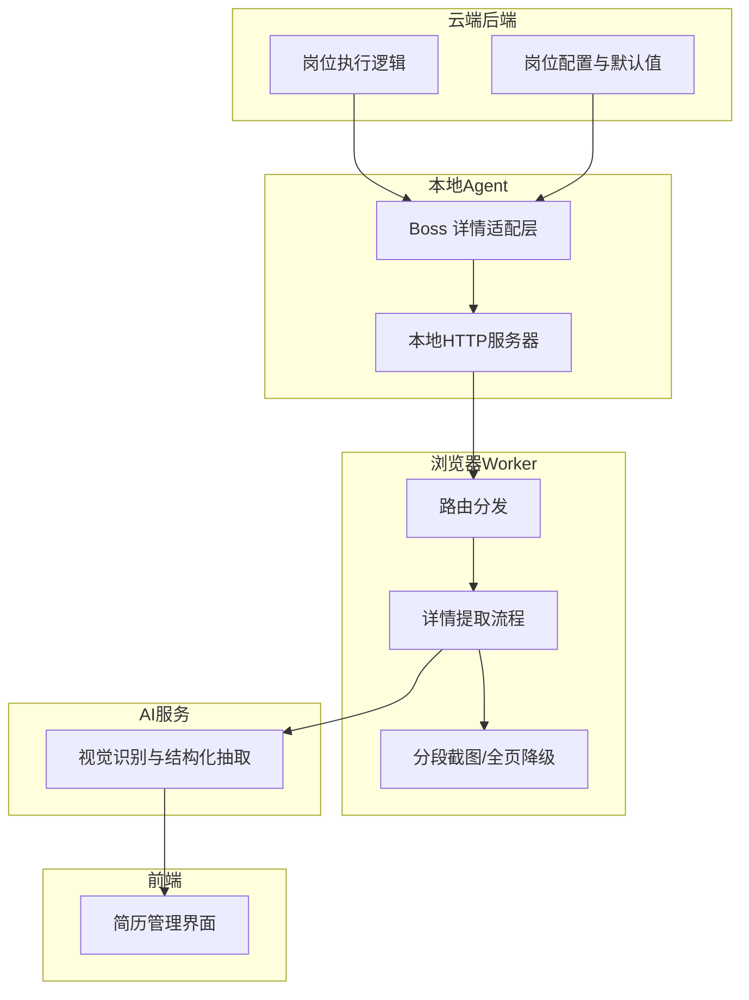
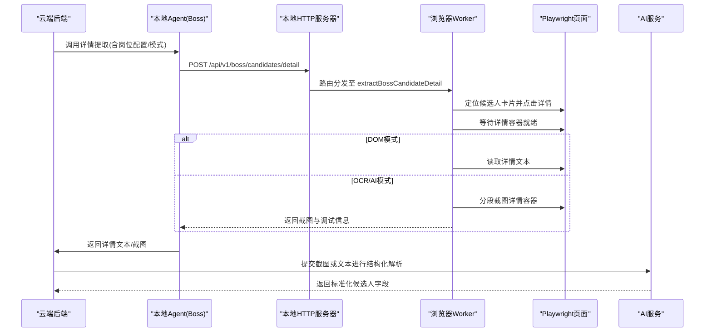
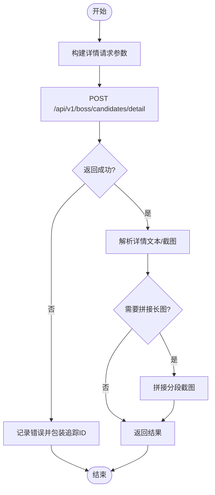
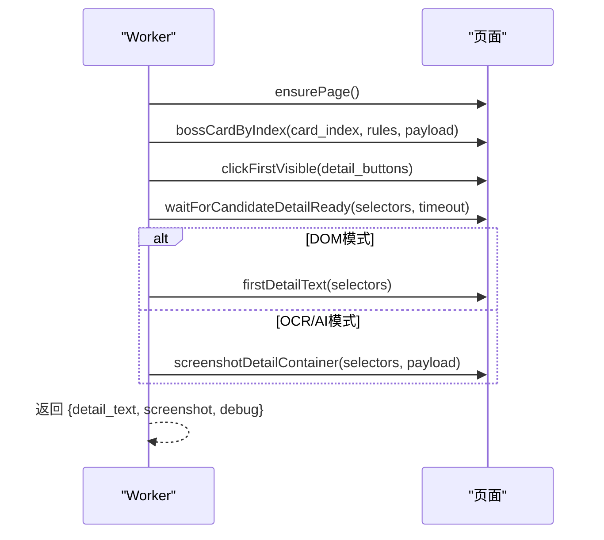
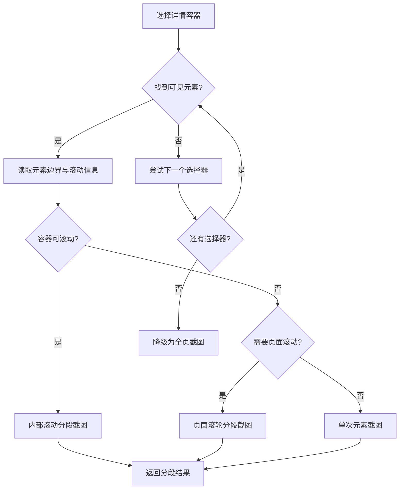
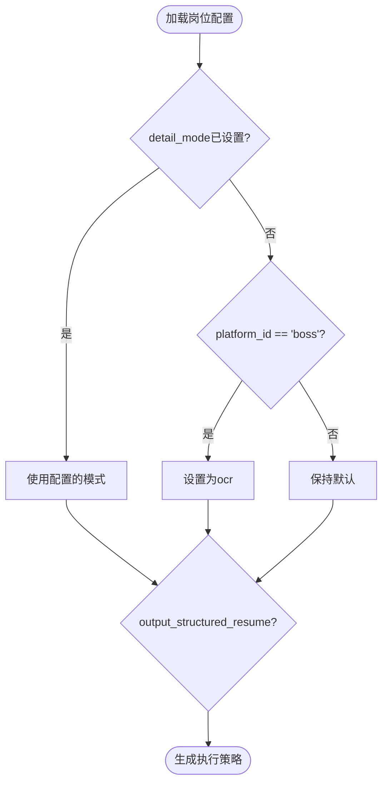
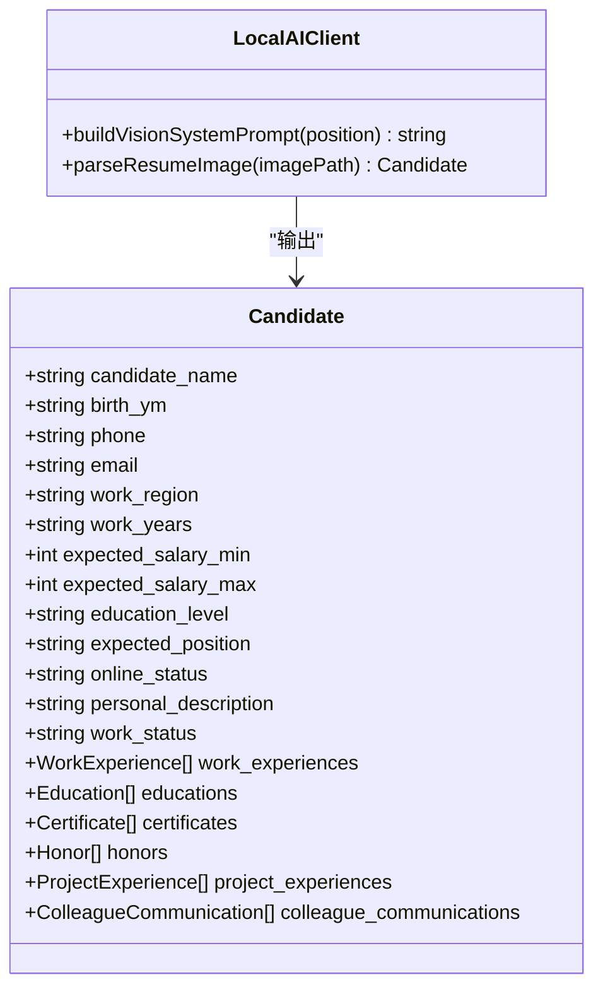
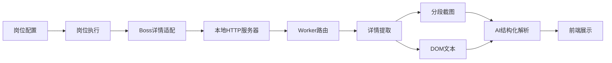

# 简历详情解析

<cite>
**本文引用的文件**
- [detail.go](file://goodhr5/local-agent-go/internal/platforms/boss/detail.go)
- [index.js](file://goodhr5/local-agent-go/worker-node/src/index.js)
- [position_execution.go](file://goodhr5/cloud/backend/internal/httpapi/position_execution.go)
- [position.go](file://goodhr5/cloud/backend/internal/httpapi/position.go)
- [0037_boss_detail_content_resume_only.sql](file://goodhr5/cloud/backend/db/migrations/0037_boss_detail_content_resume_only.sql)
- [0060_position_structured_resume_switch.sql](file://goodhr5/cloud/backend/db/migrations/0060_position_structured_resume_switch.sql)
- [client.go](file://goodhr5/local-agent-go/internal/localai/client.go)
- [auto_reply.go](file://goodhr5/local-agent-go/internal/platforms/boss/auto_reply.go)
- [server.go](file://goodhr5/local-agent-go/internal/app/server.go)
- [go_controller.go](file://goodhr5/local-agent-go/internal/browser/go_controller.go)
- [page.tsx](file://goodhr5/cloud/frontend-next/app/admin/resumes/page.tsx)
</cite>

## 目录
1. [简介](#简介)
2. [项目结构](#项目结构)
3. [核心组件](#核心组件)
4. [架构总览](#架构总览)
5. [详细组件分析](#详细组件分析)
6. [依赖关系分析](#依赖关系分析)
7. [性能与稳定性](#性能与稳定性)
8. [故障排查指南](#故障排查指南)
9. [结论](#结论)
10. [附录](#附录)

## 简介
本文件面向 Boss 直聘简历详情页的自动化解析能力，覆盖从页面访问、HTML/截图抓取、结构化数据提取到质量评估与隐私保护的全链路。系统通过本地 Agent 驱动浏览器 Worker 完成页面操作与内容采集，结合 OCR 与 AI 服务进行智能解析，最终输出标准化的候选人信息（工作经历、技能标签、教育背景、项目经验等），并提供可配置的质量评分与敏感信息过滤策略。

## 项目结构
Boss 直聘简历详情解析涉及以下关键模块：
- 云端后端：岗位配置与执行策略（DOM/OCR/AI）、默认模式修正、结构化输出开关
- 本地 Agent：平台适配层（Boss）封装调用、日志与截图拼接
- 浏览器 Worker：基于 Playwright 的页面定位、滚动、截图、文本提取与路由分发
- AI 客户端：视觉识别提示词构建、结构化字段抽取模板
- 前端管理：展示候选人的 AI 评分、经历摘要与进度标记

**图示来源**
- [position_execution.go:343-360](file://goodhr5/cloud/backend/internal/httpapi/position_execution.go#L343-L360)
- [position.go:435-443](file://goodhr5/cloud/backend/internal/httpapi/position.go#L435-L443)
- [detail.go:14-64](file://goodhr5/local-agent-go/internal/platforms/boss/detail.go#L14-L64)
- [index.js:6859-6892](file://goodhr5/local-agent-go/worker-node/src/index.js#L6859-L6892)
- [index.js:1898-2105](file://goodhr5/local-agent-go/worker-node/src/index.js#L1898-L2105)
- [index.js:2900-3350](file://goodhr5/local-agent-go/worker-node/src/index.js#L2900-L3350)
- [client.go:728-809](file://goodhr5/local-agent-go/internal/localai/client.go#L728-L809)
- [page.tsx:392-455](file://goodhr5/cloud/frontend-next/app/admin/resumes/page.tsx#L392-L455)

**章节来源**
- [position_execution.go:343-360](file://goodhr5/cloud/backend/internal/httpapi/position_execution.go#L343-L360)
- [position.go:435-443](file://goodhr5/cloud/backend/internal/httpapi/position.go#L435-L443)
- [detail.go:14-64](file://goodhr5/local-agent-go/internal/platforms/boss/detail.go#L14-L64)
- [index.js:6859-6892](file://goodhr5/local-agent-go/worker-node/src/index.js#L6859-L6892)
- [index.js:1898-2105](file://goodhr5/local-agent-go/worker-node/src/index.js#L1898-L2105)
- [index.js:2900-3350](file://goodhr5/local-agent-go/worker-node/src/index.js#L2900-L3350)
- [client.go:728-809](file://goodhr5/local-agent-go/internal/localai/client.go#L728-L809)
- [page.tsx:392-455](file://goodhr5/cloud/frontend-next/app/admin/resumes/page.tsx#L392-L455)

## 核心组件
- 岗位执行与配置：决定详情解析模式（DOM/OCR/AI）、是否输出结构化简历、Boss 平台默认模式修正
- Boss 详情适配层：封装详情打开、关闭、文本清理、截图拼接与诊断日志
- 浏览器 Worker：提供详情提取、可见性等待、分段截图、降级策略与错误诊断
- AI 客户端：构建视觉提示词、输出标准化候选人字段（工作、教育、证书、荣誉、项目等）
- 前端管理：展示 AI 评分、经历摘要、进度标记与错误信息

**章节来源**
- [position_execution.go:343-360](file://goodhr5/cloud/backend/internal/httpapi/position_execution.go#L343-L360)
- [position.go:435-443](file://goodhr5/cloud/backend/internal/httpapi/position.go#L435-L443)
- [detail.go:14-64](file://goodhr5/local-agent-go/internal/platforms/boss/detail.go#L14-L64)
- [index.js:1898-2105](file://goodhr5/local-agent-go/worker-node/src/index.js#L1898-L2105)
- [index.js:2900-3350](file://goodhr5/local-agent-go/worker-node/src/index.js#L2900-L3350)
- [client.go:728-809](file://goodhr5/local-agent-go/internal/localai/client.go#L728-L809)
- [page.tsx:392-455](file://goodhr5/cloud/frontend-next/app/admin/resumes/page.tsx#L392-L455)

## 架构总览
下图展示了从云端触发到本地浏览器 Worker 执行详情提取，再到 AI 结构化输出的完整链路。

**图示来源**
- [position_execution.go:343-360](file://goodhr5/cloud/backend/internal/httpapi/position_execution.go#L343-L360)
- [detail.go:14-64](file://goodhr5/local-agent-go/internal/platforms/boss/detail.go#L14-L64)
- [server.go:168-170](file://goodhr5/local-agent-go/internal/app/server.go#L168-L170)
- [index.js:6859-6892](file://goodhr5/local-agent-go/worker-node/src/index.js#L6859-L6892)
- [index.js:1898-2105](file://goodhr5/local-agent-go/worker-node/src/index.js#L1898-L2105)
- [index.js:2900-3350](file://goodhr5/local-agent-go/worker-node/src/index.js#L2900-L3350)
- [client.go:728-809](file://goodhr5/local-agent-go/internal/localai/client.go#L728-L809)

## 详细组件分析

### Boss 详情适配层（Go）
- 职责：封装详情提取请求参数（位置ID、平台配置、截图开关、滚动参数、超时、视口边距、截图目录等），处理返回结果中的文本与截图，记录诊断日志，必要时拼接长图；提供详情关闭与文本清洗方法。
- 关键点：
  - 根据模式决定是否开启截图（OCR/AI）
  - 支持多段截图与滚动容器检测
  - 清理平台附加内容（如“牛人分析器”）
  - 统一追踪编号便于问题定位

**图示来源**
- [detail.go:14-64](file://goodhr5/local-agent-go/internal/platforms/boss/detail.go#L14-L64)
- [detail.go:72-88](file://goodhr5/local-agent-go/internal/platforms/boss/detail.go#L72-L88)
- [detail.go:90-108](file://goodhr5/local-agent-go/internal/platforms/boss/detail.go#L90-L108)

**章节来源**
- [detail.go:14-64](file://goodhr5/local-agent-go/internal/platforms/boss/detail.go#L14-L64)
- [detail.go:72-88](file://goodhr5/local-agent-go/internal/platforms/boss/detail.go#L72-L88)
- [detail.go:90-108](file://goodhr5/local-agent-go/internal/platforms/boss/detail.go#L90-L108)

### 浏览器 Worker 详情提取流程（Node）
- 路由注册：将详情接口映射到具体处理器
- 详情提取步骤：
  - 获取当前页面
  - 按序号定位候选人卡片并滚动至可视区域
  - 点击详情按钮或回退到卡片点击
  - 轮询等待详情容器就绪（带超时与诊断）
  - 读取详情文本（DOM模式）
  - 可选分段截图（OCR/AI模式），失败时降级为全页截图
  - 返回文本、截图与调试信息
- 关闭详情：支持按键关闭或特定平台回退

**图示来源**
- [index.js:6859-6892](file://goodhr5/local-agent-go/worker-node/src/index.js#L6859-L6892)
- [index.js:1898-2105](file://goodhr5/local-agent-go/worker-node/src/index.js#L1898-L2105)
- [index.js:2900-3350](file://goodhr5/local-agent-go/worker-node/src/index.js#L2900-L3350)
- [index.js:2168-2188](file://goodhr5/local-agent-go/worker-node/src/index.js#L2168-L2188)

**章节来源**
- [index.js:1898-2105](file://goodhr5/local-agent-go/worker-node/src/index.js#L1898-L2105)
- [index.js:2900-3350](file://goodhr5/local-agent-go/worker-node/src/index.js#L2900-L3350)
- [index.js:2168-2188](file://goodhr5/local-agent-go/worker-node/src/index.js#L2168-L2188)

### 分段截图与降级策略
- 选择器遍历：依次尝试多个详情容器选择器，记录每个元素可见性、边界、滚动信息与视口大小
- 分段截图：
  - 若容器自身可滚动，则按内部滚动分段截图
  - 否则判断是否需要页面滚轮分段截图
  - 不需要滚动时执行单次元素截图
- 降级：当所有候选元素失败时，回退为全页截图
- 诊断：每一步均记录详细调试信息，便于定位问题

**图示来源**
- [index.js:2900-3350](file://goodhr5/local-agent-go/worker-node/src/index.js#L2900-L3350)

**章节来源**
- [index.js:2900-3350](file://goodhr5/local-agent-go/worker-node/src/index.js#L2900-L3350)

### 岗位配置与默认模式修正
- 默认模式：对 Boss 平台，若未显式设置 detail_mode，则强制使用 OCR 模式，以提升复杂页面解析稳定性
- 结构化输出：岗位可配置 output_structured_resume 开关，控制是否输出结构化简历字段
- 迁移脚本：确保默认值与平台差异在数据库层面生效

**图示来源**
- [position.go:435-443](file://goodhr5/cloud/backend/internal/httpapi/position.go#L435-L443)
- [position_execution.go:343-360](file://goodhr5/cloud/backend/internal/httpapi/position_execution.go#L343-L360)
- [0060_position_structured_resume_switch.sql:5-9](file://goodhr5/cloud/backend/db/migrations/0060_position_structured_resume_switch.sql#L5-L9)

**章节来源**
- [position.go:435-443](file://goodhr5/cloud/backend/internal/httpapi/position.go#L435-L443)
- [position_execution.go:343-360](file://goodhr5/cloud/backend/internal/httpapi/position_execution.go#L343-L360)
- [0060_position_structured_resume_switch.sql:5-9](file://goodhr5/cloud/backend/db/migrations/0060_position_structured_resume_switch.sql#L5-L9)

### AI 集成与结构化解析
- 视觉提示词：根据岗位快照构建稳定规则，指导模型识别简历关键区域
- 结构化字段：输出包含姓名、出生年月、联系方式、工作地区、工作年限、期望薪资、教育水平、期望职位、在线状态、个人描述、工作状态、工作经历、教育背景、证书、荣誉、项目经验、同事沟通记录等
- 质量评估：返回 analysis.score 与 reason，用于后续筛选与排序
- 在线简历截图：自动打开弹层、截图、关闭弹层后交由 AI 评分

**图示来源**
- [client.go:728-809](file://goodhr5/local-agent-go/internal/localai/client.go#L728-L809)
- [auto_reply.go:669-693](file://goodhr5/local-agent-go/internal/platforms/boss/auto_reply.go#L669-L693)

**章节来源**
- [client.go:728-809](file://goodhr5/local-agent-go/internal/localai/client.go#L728-L809)
- [auto_reply.go:669-693](file://goodhr5/local-agent-go/internal/platforms/boss/auto_reply.go#L669-L693)

### 前端展示与质量评估
- 展示项：候选人头像、基础信息、期望职位、拥有者行、经历摘要、AI 首次/二次评分及原因、进度标记、备注预览
- 进度标记：看详情、打招呼、要简历等动作完成状态
- 错误与时间：显示简历解析错误与更新时间

**章节来源**
- [page.tsx:392-455](file://goodhr5/cloud/frontend-next/app/admin/resumes/page.tsx#L392-L455)

## 依赖关系分析
- 云端后端依赖岗位配置与迁移脚本，决定详情模式与结构化输出
- 本地 Agent 依赖平台适配层与 HTTP 服务器，转发详情请求
- 浏览器 Worker 依赖路由与页面操作能力，实现详情定位、截图与文本提取
- AI 客户端依赖视觉提示词与结构化解析，产出标准化字段
- 前端依赖后端数据，展示评分与经历摘要

**图示来源**
- [position.go:435-443](file://goodhr5/cloud/backend/internal/httpapi/position.go#L435-L443)
- [position_execution.go:343-360](file://goodhr5/cloud/backend/internal/httpapi/position_execution.go#L343-L360)
- [detail.go:14-64](file://goodhr5/local-agent-go/internal/platforms/boss/detail.go#L14-L64)
- [server.go:168-170](file://goodhr5/local-agent-go/internal/app/server.go#L168-L170)
- [index.js:6859-6892](file://goodhr5/local-agent-go/worker-node/src/index.js#L6859-L6892)
- [index.js:1898-2105](file://goodhr5/local-agent-go/worker-node/src/index.js#L1898-L2105)
- [client.go:728-809](file://goodhr5/local-agent-go/internal/localai/client.go#L728-L809)
- [page.tsx:392-455](file://goodhr5/cloud/frontend-next/app/admin/resumes/page.tsx#L392-L455)

**章节来源**
- [position.go:435-443](file://goodhr5/cloud/backend/internal/httpapi/position.go#L435-L443)
- [position_execution.go:343-360](file://goodhr5/cloud/backend/internal/httpapi/position_execution.go#L343-L360)
- [detail.go:14-64](file://goodhr5/local-agent-go/internal/platforms/boss/detail.go#L14-L64)
- [server.go:168-170](file://goodhr5/local-agent-go/internal/app/server.go#L168-L170)
- [index.js:6859-6892](file://goodhr5/local-agent-go/worker-node/src/index.js#L6859-L6892)
- [index.js:1898-2105](file://goodhr5/local-agent-go/worker-node/src/index.js#L1898-L2105)
- [client.go:728-809](file://goodhr5/local-agent-go/internal/localai/client.go#L728-L809)
- [page.tsx:392-455](file://goodhr5/cloud/frontend-next/app/admin/resumes/page.tsx#L392-L455)

## 性能与稳定性
- 详情容器轮询：采用短间隔轮询与超时控制，避免长时间阻塞
- 分段截图：优先容器内滚动分段，其次页面滚轮分段，最后单次元素截图，提升成功率与速度
- 降级策略：当候选元素全部失败时回退为全页截图，保障基本可用性
- 诊断日志：全流程记录耗时、选择器匹配、元素边界、滚动信息与视口大小，便于定位瓶颈
- 连接断开处理：Worker 侧记录调用方提前断开的情况，并在后台继续完成处理后通知

**章节来源**
- [index.js:1898-2105](file://goodhr5/local-agent-go/worker-node/src/index.js#L1898-L2105)
- [index.js:2900-3350](file://goodhr5/local-agent-go/worker-node/src/index.js#L2900-L3350)
- [index.js:6895-7038](file://goodhr5/local-agent-go/worker-node/src/index.js#L6895-L7038)

## 故障排查指南
- 详情容器未找到：检查选择器列表与页面结构变化，查看诊断日志中的 matched_selector 与 attempts
- 截图失败：确认元素可见性与边界，检查滚动信息；若容器不可滚动，验证页面滚动分段是否启用
- 连接超时：关注 Worker 侧 client_disconnected 字段，必要时调整超时与重试策略
- 模式不生效：确认岗位配置的 detail_mode 与 platform_id，Boss 平台默认会强制 OCR
- 结构化输出未启用：检查 output_structured_resume 开关与迁移脚本是否应用

**章节来源**
- [index.js:1898-2105](file://goodhr5/local-agent-go/worker-node/src/index.js#L1898-L2105)
- [index.js:2900-3350](file://goodhr5/local-agent-go/worker-node/src/index.js#L2900-L3350)
- [position.go:435-443](file://goodhr5/cloud/backend/internal/httpapi/position.go#L435-L443)
- [0037_boss_detail_content_resume_only.sql:13-13](file://goodhr5/cloud/backend/db/migrations/0037_boss_detail_content_resume_only.sql#L13-L13)

## 结论
本方案通过云端配置驱动、本地 Agent 适配与浏览器 Worker 的稳健页面操作，实现了 Boss 直聘简历详情页的高效解析。结合 OCR 与 AI 服务，系统能够输出结构化候选人信息并进行质量评估。分段截图与降级策略提升了复杂页面的成功率，完善的诊断日志与错误处理保障了稳定性与可维护性。

## 附录
- 相关接口路径：
  - 详情提取：/api/v1/boss/candidates/detail
  - 详情关闭：/api/v1/boss/candidates/detail/close
- 关键配置项：
  - detail_mode：dom/ocr/ai（Boss 平台默认 ocr）
  - output_structured_resume：是否输出结构化简历字段
- 迁移脚本：
  - 0037_boss_detail_content_resume_only.sql：限制 Boss 详情内容范围
  - 0060_position_structured_resume_switch.sql：新增结构化输出开关默认值

**章节来源**
- [server.go:168-170](file://goodhr5/local-agent-go/internal/app/server.go#L168-L170)
- [go_controller.go:327-329](file://goodhr5/local-agent-go/internal/browser/go_controller.go#L327-L329)
- [0037_boss_detail_content_resume_only.sql:13-13](file://goodhr5/cloud/backend/db/migrations/0037_boss_detail_content_resume_only.sql#L13-L13)
- [0060_position_structured_resume_switch.sql:5-9](file://goodhr5/cloud/backend/db/migrations/0060_position_structured_resume_switch.sql#L5-L9)