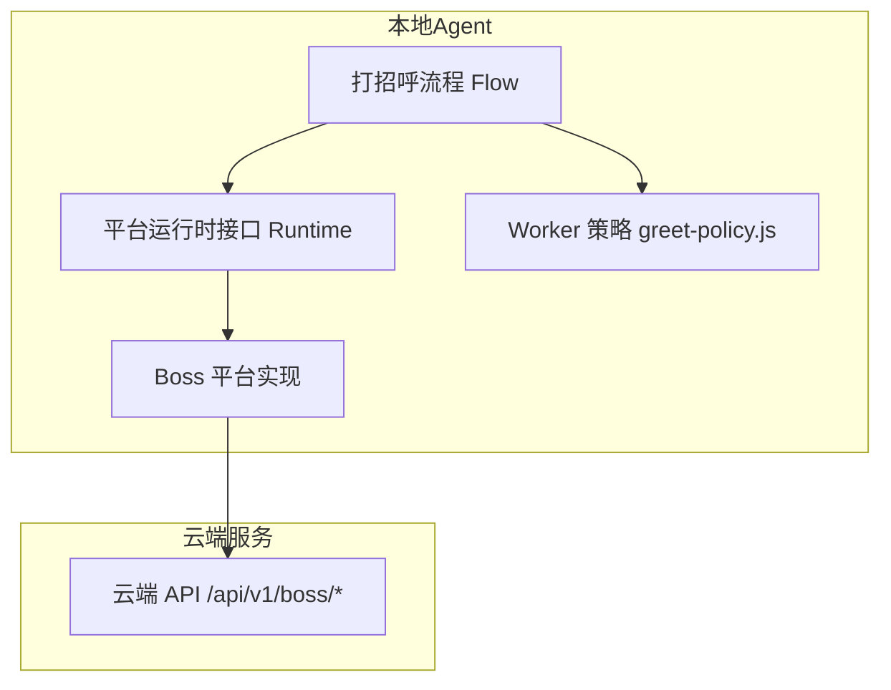
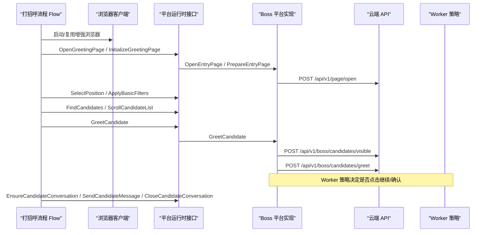
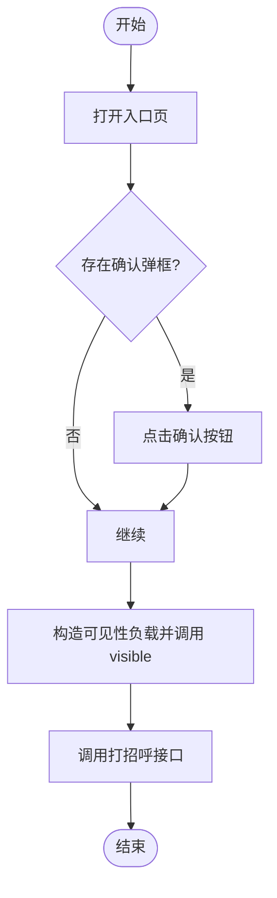
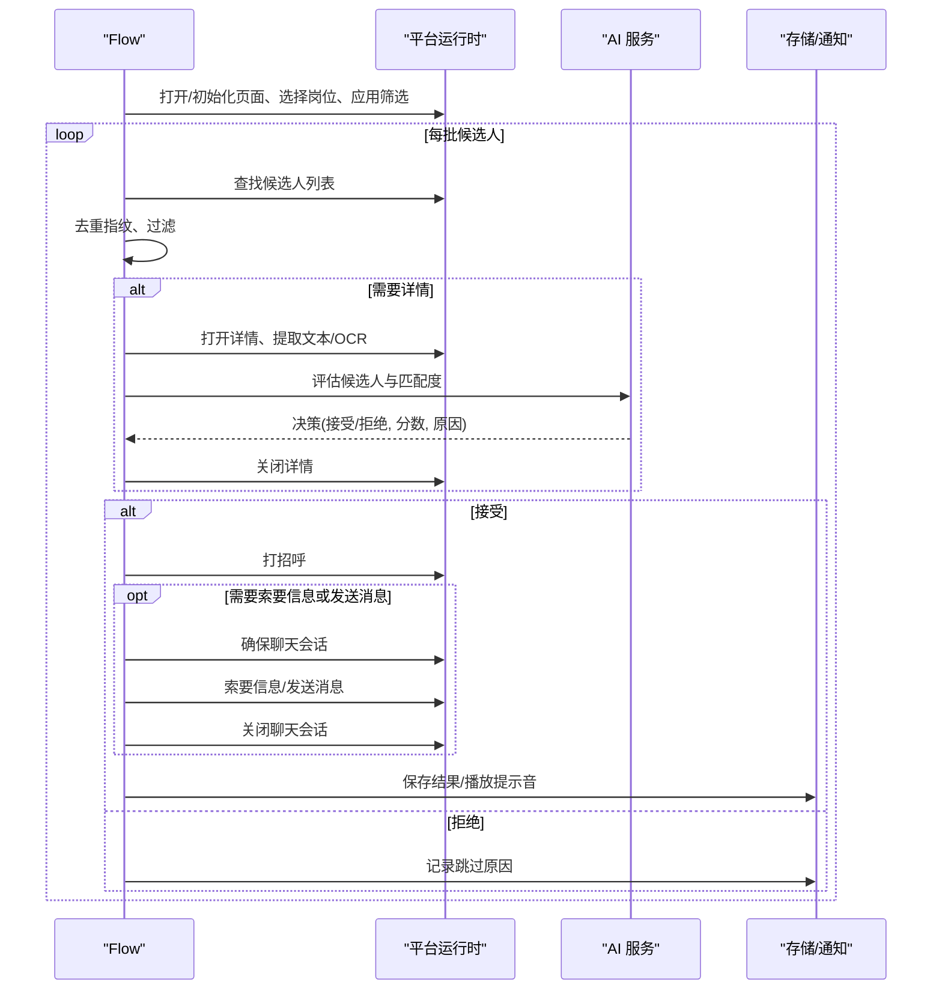
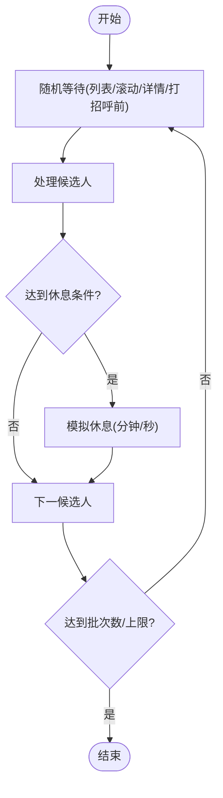
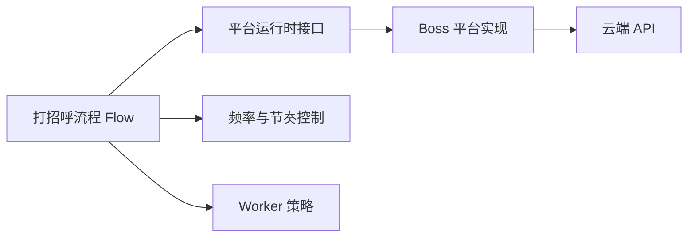

# 自动问候系统

<cite>
**本文引用的文件**
- [greet.go](file://goodhr5/local-agent-go/internal/platforms/boss/greet.go)
- [entry.go](file://goodhr5/local-agent-go/internal/platforms/boss/entry.go)
- [helpers.go](file://goodhr5/local-agent-go/internal/platforms/boss/helpers.go)
- [runtime.go](file://goodhr5/local-agent-go/internal/platforms/boss/runtime.go)
- [runtime.go](file://goodhr5/local-agent-go/internal/platformcore/runtime.go)
- [flow.go](file://goodhr5/local-agent-go/internal/flow/greeting/flow.go)
- [policy.go](file://goodhr5/local-agent-go/internal/flow/greeting/policy.go)
- [pacing.go](file://goodhr5/local-agent-go/internal/flow/greeting/pacing.go)
- [greet-policy.js](file://goodhr5/local-agent-go/worker-node/src/greet-policy.js)
</cite>

## 目录
1. [简介](#简介)
2. [项目结构](#项目结构)
3. [核心组件](#核心组件)
4. [架构总览](#架构总览)
5. [详细组件分析](#详细组件分析)
6. [依赖关系分析](#依赖关系分析)
7. [性能与频率控制](#性能与频率控制)
8. [故障排查与异常恢复](#故障排查与异常恢复)
9. [结论](#结论)
10. [附录](#附录)

## 简介
本文件面向 Boss 直聘自动问候系统，系统化说明问候语生成、发送时机控制、对话状态管理、聊天界面操作模拟（输入框定位与发送按钮点击）、个性化模板与上下文感知、频率限制控制、效果追踪、回复监听、异常恢复机制，以及与 AI 服务的集成方式、智能对话策略和用户体验优化方案。文档基于仓库中 Boss 平台实现与新的打招呼流程代码进行梳理，确保读者既能理解整体架构，也能定位到具体实现位置。

## 项目结构
本项目包含本地 Agent 与云端后端两部分。Boss 直聘的自动化能力主要由以下模块协作完成：
- 平台运行时接口：定义统一的 Executor、Runtime 等能力边界，屏蔽浏览器 Worker 调用细节。
- Boss 平台实现：封装入口页打开、弹框处理、候选人可见性准备、打招呼调用等具体动作。
- 新打招呼流程：编排“启动浏览器—打开页面—选择岗位—筛选—扫描候选人—AI 评估—打招呼—可选索要信息—关闭会话”的完整流水线，并内置随机等待、休息计划、错误策略与统计上报。
- Worker 侧策略：集中管理不同平台在首次打招呼后的追加点击策略。

图表来源
- [flow.go:49-95](file://goodhr5/local-agent-go/internal/flow/greeting/flow.go#L49-L95)
- [runtime.go:46-74](file://goodhr5/local-agent-go/internal/platformcore/runtime.go#L46-L74)
- [greet.go:11-23](file://goodhr5/local-agent-go/internal/platforms/boss/greet.go#L11-L23)
- [greet-policy.js:1-12](file://goodhr5/local-agent-go/worker-node/src/greet-policy.js#L1-L12)

章节来源
- [flow.go:49-95](file://goodhr5/local-agent-go/internal/flow/greeting/flow.go#L49-L95)
- [runtime.go:46-74](file://goodhr5/local-agent-go/internal/platformcore/runtime.go#L46-L74)
- [greet.go:11-23](file://goodhr5/local-agent-go/internal/platforms/boss/greet.go#L11-L23)
- [greet-policy.js:1-12](file://goodhr5/local-agent-go/worker-node/src/greet-policy.js#L1-L12)

## 核心组件
- 平台运行时接口（Executor/Runtime）：统一抽象浏览器 Worker 调用、日志、延时与平台能力（打开入口、准备页面、切换岗位、提取候选人、读取详情、打招呼、关闭详情等）。
- Boss 平台实现：负责 Boss 直聘的具体交互，包括入口页打开、确认弹框处理、候选人可见性参数构造、调用云端打招呼接口。
- 打招呼流程（Flow）：编排任务步骤，执行候选人扫描、AI 评估、打招呼、可选索要信息与消息发送、会话清理，并记录统计与日志。
- 频率与节奏控制：提供随机等待、批次间滚动加载、模拟休息计划，避免触发平台风控。
- Worker 侧策略：针对平台差异化行为（如是否需点击继续/确认）提供集中策略。

章节来源
- [runtime.go:10-74](file://goodhr5/local-agent-go/internal/platformcore/runtime.go#L10-L74)
- [entry.go:12-53](file://goodhr5/local-agent-go/internal/platforms/boss/entry.go#L12-L53)
- [greet.go:11-23](file://goodhr5/local-agent-go/internal/platforms/boss/greet.go#L11-L23)
- [flow.go:49-95](file://goodhr5/local-agent-go/internal/flow/greeting/flow.go#L49-L95)
- [pacing.go:22-112](file://goodhr5/local-agent-go/internal/flow/greeting/pacing.go#L22-L112)
- [greet-policy.js:1-12](file://goodhr5/local-agent-go/worker-node/src/greet-policy.js#L1-L12)

## 架构总览
下图展示从流程编排到平台实现再到云端接口的端到端调用链，以及 Worker 侧策略对后续操作的指导。

图表来源
- [flow.go:49-95](file://goodhr5/local-agent-go/internal/flow/greeting/flow.go#L49-L95)
- [flow.go:576-637](file://goodhr5/local-agent-go/internal/flow/greeting/flow.go#L576-L637)
- [runtime.go:46-74](file://goodhr5/local-agent-go/internal/platformcore/runtime.go#L46-L74)
- [entry.go:12-53](file://goodhr5/local-agent-go/internal/platforms/boss/entry.go#L12-L53)
- [greet.go:11-23](file://goodhr5/local-agent-go/internal/platforms/boss/greet.go#L11-L23)
- [greet-policy.js:1-12](file://goodhr5/local-agent-go/worker-node/src/greet-policy.js#L1-L12)

## 详细组件分析

### Boss 平台打招呼实现
- 入口页与弹框处理：打开入口 URL，检测并点击确认弹框；判断当前页面是否为岗位入口。
- 候选人可见性准备：构造 visible 请求负载，包含平台配置、卡片索引、元素引用、诊断名称、滚动与等待参数等。
- 打招呼调用：先调用可见性接口，再调用打招呼接口，并在负载中注入调试阶段标记，便于问题定位。

图表来源
- [entry.go:12-53](file://goodhr5/local-agent-go/internal/platforms/boss/entry.go#L12-L53)
- [runtime.go:19-34](file://goodhr5/local-agent-go/internal/platforms/boss/runtime.go#L19-L34)
- [greet.go:11-23](file://goodhr5/local-agent-go/internal/platforms/boss/greet.go#L11-L23)

章节来源
- [entry.go:12-53](file://goodhr5/local-agent-go/internal/platforms/boss/entry.go#L12-L53)
- [runtime.go:19-34](file://goodhr5/local-agent-go/internal/platforms/boss/runtime.go#L19-L34)
- [greet.go:11-23](file://goodhr5/local-agent-go/internal/platforms/boss/greet.go#L11-L23)
- [helpers.go:112-160](file://goodhr5/local-agent-go/internal/platforms/boss/helpers.go#L112-L160)

### 打招呼主流程（Flow）
- 步骤编排：启动浏览器、打开打招呼页面、初始化页面、选择岗位、应用基础筛选、扫描候选人并打招呼。
- 候选人处理：去重指纹、批量扫描、AI 评估（支持 OCR 与视觉模式）、关键词匹配、详情打开概率控制。
- 打招呼与后续：根据评分阈值决定是否索要信息或发送自定义问候消息；确保聊天会话可用后执行发送，最后关闭会话。
- 统计与日志：记录成功、跳过、失败数量，输出步骤级日志，必要时播放提示音。

图表来源
- [flow.go:49-95](file://goodhr5/local-agent-go/internal/flow/greeting/flow.go#L49-L95)
- [flow.go:121-336](file://goodhr5/local-agent-go/internal/flow/greeting/flow.go#L121-L336)
- [flow.go:343-642](file://goodhr5/local-agent-go/internal/flow/greeting/flow.go#L343-L642)

章节来源
- [flow.go:49-95](file://goodhr5/local-agent-go/internal/flow/greeting/flow.go#L49-L95)
- [flow.go:121-336](file://goodhr5/local-agent-go/internal/flow/greeting/flow.go#L121-L336)
- [flow.go:343-642](file://goodhr5/local-agent-go/internal/flow/greeting/flow.go#L343-L642)

### 频率限制与节奏控制
- 随机等待：在关键节点（浏览列表、滚动加载、打开/关闭详情前、打招呼前）按个人配置区间随机等待，降低被识别为机器人的风险。
- 模拟休息：按用户偏好设置的最大次数、间隔候选人数与时长范围，周期性进入“模拟休息”，不修改页面内容，仅暂停任务。
- 批次控制：按配置的批次数或岗位上限停止，避免长时间运行。

图表来源
- [pacing.go:22-112](file://goodhr5/local-agent-go/internal/flow/greeting/pacing.go#L22-L112)
- [flow.go:121-336](file://goodhr5/local-agent-go/internal/flow/greeting/flow.go#L121-L336)

章节来源
- [pacing.go:22-112](file://goodhr5/local-agent-go/internal/flow/greeting/pacing.go#L22-L112)
- [flow.go:121-336](file://goodhr5/local-agent-go/internal/flow/greeting/flow.go#L121-L336)

### 对话状态管理与消息发送
- 会话保障：在需要索要信息或发送自定义问候消息时，先确保候选人聊天框可用，若失败则记录警告并继续。
- 消息发送：支持发送岗位配置的自定义问候消息；若开启索要信息，则在会话内优先执行索要动作。
- 会话清理：无论成功与否，均尝试关闭候选人聊天会话，释放资源。

章节来源
- [flow.go:576-637](file://goodhr5/local-agent-go/internal/flow/greeting/flow.go#L576-L637)

### 个性化问候语模板与上下文感知
- 模板来源：岗位配置中的问候消息字段作为模板来源，可在打招呼后通过消息发送接口传入。
- 上下文感知：结合 AI 评估结果（分数、原因）与岗位配置（是否需要详情、OCR、AI），动态决定是否打开详情、是否索要信息、是否发送消息。
- 策略阈值：索要信息使用严格大于阈值（默认 70，可覆盖），未命中阈值则跳过索要。

章节来源
- [flow.go:553-578](file://goodhr5/local-agent-go/internal/flow/greeting/flow.go#L553-L578)
- [policy.go:12-54](file://goodhr5/local-agent-go/internal/flow/greeting/policy.go#L12-L54)

### 与 AI 服务的集成与智能对话策略
- 评估模式：支持文本模式与视觉模式（OCR/截图），在详情页模式下优先读取文本，必要时结合图像提升准确率。
- 决策输出：返回是否接受、分数与原因；流程据此决定后续动作（跳过、打招呼、索要信息、发送消息）。
- 异步收尾：评估完成后异步保存评估结果，不影响主流程推进。

章节来源
- [flow.go:464-524](file://goodhr5/local-agent-go/internal/flow/greeting/flow.go#L464-L524)
- [flow.go:553-578](file://goodhr5/local-agent-go/internal/flow/greeting/flow.go#L553-L578)

### 聊天界面操作模拟（输入框定位与发送按钮点击）
- 元素定位协议：通过平台配置将目标类、父类、查找次数与间隔等转换为统一元素协议，供 Worker 执行。
- 点击策略：Worker 侧集中管理各平台在首次打招呼后是否还需点击“继续/确认”按钮，Boss 直聘默认执行该策略。
- 实际动作：通过浏览器 Worker 的点击与输入接口完成输入框定位与发送按钮点击，具体路径由平台配置驱动。

章节来源
- [helpers.go:112-160](file://goodhr5/local-agent-go/internal/platforms/boss/helpers.go#L112-L160)
- [greet-policy.js:1-12](file://goodhr5/local-agent-go/worker-node/src/greet-policy.js#L1-L12)

## 依赖关系分析
- 流程层依赖平台运行时接口，屏蔽底层浏览器与 Worker 差异。
- Boss 平台实现依赖云端 API 进行可见性与打招呼调用，并通过通用工具函数解析响应与构造负载。
- 频率控制与策略层独立于平台实现，保证跨平台一致性。

图表来源
- [flow.go:49-95](file://goodhr5/local-agent-go/internal/flow/greeting/flow.go#L49-L95)
- [runtime.go:46-74](file://goodhr5/local-agent-go/internal/platformcore/runtime.go#L46-L74)
- [greet.go:11-23](file://goodhr5/local-agent-go/internal/platforms/boss/greet.go#L11-L23)
- [pacing.go:22-112](file://goodhr5/local-agent-go/internal/flow/greeting/pacing.go#L22-L112)
- [greet-policy.js:1-12](file://goodhr5/local-agent-go/worker-node/src/greet-policy.js#L1-L12)

章节来源
- [flow.go:49-95](file://goodhr5/local-agent-go/internal/flow/greeting/flow.go#L49-L95)
- [runtime.go:46-74](file://goodhr5/local-agent-go/internal/platformcore/runtime.go#L46-L74)
- [greet.go:11-23](file://goodhr5/local-agent-go/internal/platforms/boss/greet.go#L11-L23)
- [pacing.go:22-112](file://goodhr5/local-agent-go/internal/flow/greeting/pacing.go#L22-L112)
- [greet-policy.js:1-12](file://goodhr5/local-agent-go/worker-node/src/greet-policy.js#L1-L12)

## 性能与频率控制
- 随机等待：在多个关键节点引入随机延迟，减少平台风控触发概率。
- 模拟休息：按用户偏好周期性暂停任务，避免长时间连续操作。
- 批次与上限：通过批次数与岗位上限控制任务规模，防止过度消耗。
- 详情打开概率：在关键词模式下可按概率打开详情，平衡效率与质量。

[本节为通用指导，无需特定文件来源]

## 故障排查与异常恢复
- 错误策略：连续错误累计到阈值时停止任务，避免无限重试。
- 常见异常：
  - 候选人详情不可用：记录跳过原因，继续处理其他候选人。
  - 打开/关闭详情失败：记录失败并报告页面诊断信息。
  - 打招呼失败：区分已联系与网络错误，分别记录跳过或失败。
  - 索要信息/发送消息失败：记录警告并继续关闭会话。
- 日志与进度：每个步骤输出开始/成功/失败日志，必要时上报进度与截图诊断。

章节来源
- [flow.go:266-292](file://goodhr5/local-agent-go/internal/flow/greeting/flow.go#L266-L292)
- [flow.go:365-406](file://goodhr5/local-agent-go/internal/flow/greeting/flow.go#L365-L406)
- [flow.go:576-637](file://goodhr5/local-agent-go/internal/flow/greeting/flow.go#L576-L637)

## 结论
本系统以平台运行时接口为核心，将 Boss 直聘的自动化能力解耦为可编排的流程与可复用的平台实现。通过 AI 评估、频率控制、会话管理与错误恢复机制，实现了稳定、可控且可扩展的自动问候能力。未来可进一步扩展多平台适配、更细粒度的个性化模板与更强的对话策略。

[本节为总结性内容，无需特定文件来源]

## 附录
- 关键实现路径参考：
  - Boss 打招呼调用：[greet.go:11-23](file://goodhr5/local-agent-go/internal/platforms/boss/greet.go#L11-L23)
  - 入口页与弹框处理：[entry.go:12-53](file://goodhr5/local-agent-go/internal/platforms/boss/entry.go#L12-L53)
  - 候选人可见性负载构造：[runtime.go:19-34](file://goodhr5/local-agent-go/internal/platforms/boss/runtime.go#L19-L34)
  - 打招呼主流程编排：[flow.go:49-95](file://goodhr5/local-agent-go/internal/flow/greeting/flow.go#L49-L95)
  - 候选人处理与打分：[flow.go:343-642](file://goodhr5/local-agent-go/internal/flow/greeting/flow.go#L343-L642)
  - 频率与节奏控制：[pacing.go:22-112](file://goodhr5/local-agent-go/internal/flow/greeting/pacing.go#L22-L112)
  - Worker 追加点击策略：[greet-policy.js:1-12](file://goodhr5/local-agent-go/worker-node/src/greet-policy.js#L1-L12)