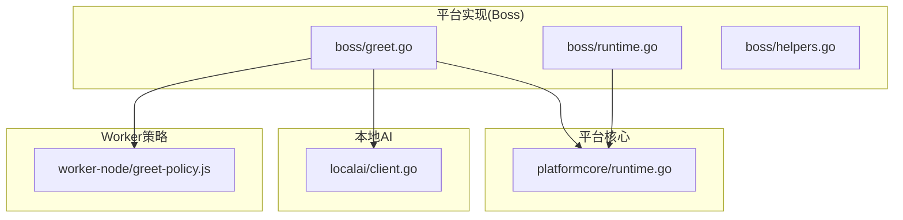
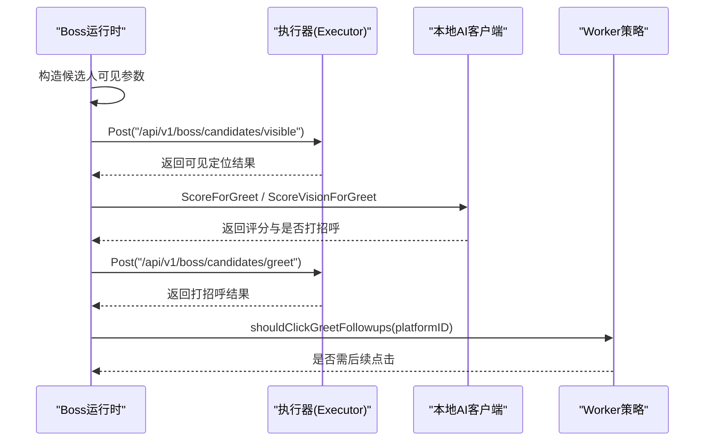
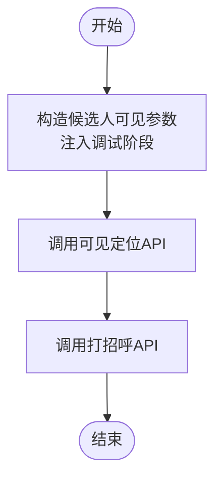
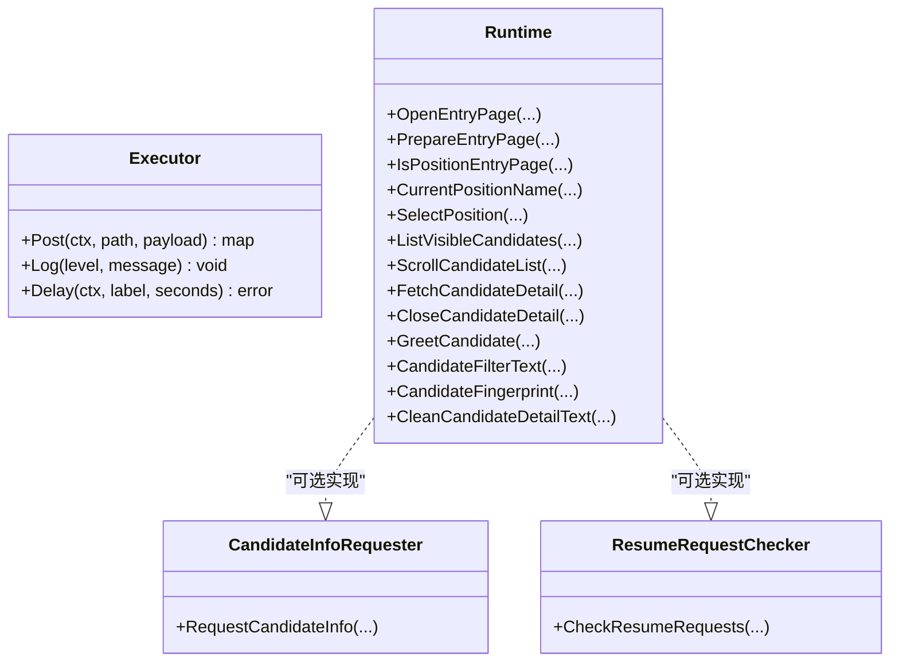
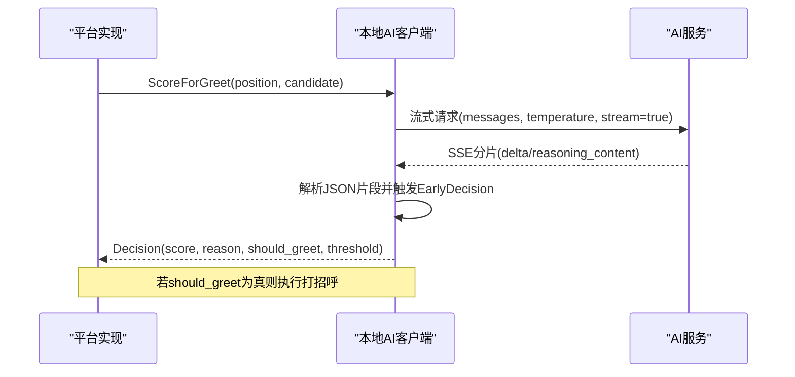
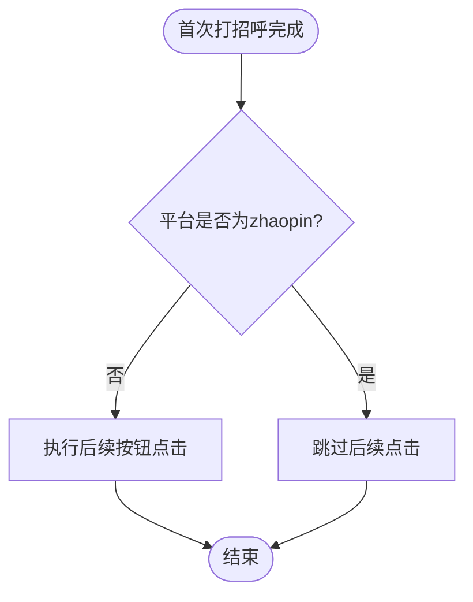
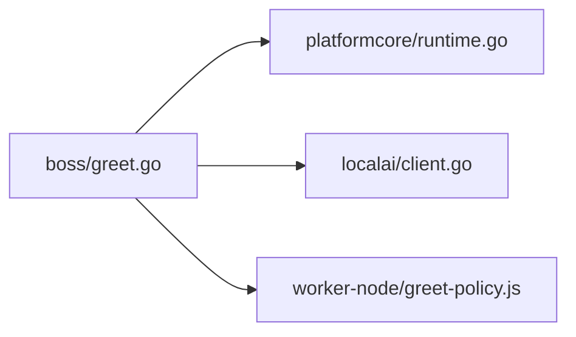

# 自动问候系统

<cite>
**本文引用的文件**
- [greet.go](file://goodhr5/local-agent-go/internal/platforms/boss/greet.go)
- [runtime.go](file://goodhr5/local-agent-go/internal/platforms/boss/runtime.go)
- [helpers.go](file://goodhr5/local-agent-go/internal/platforms/boss/helpers.go)
- [runtime.go](file://goodhr5/local-agent-go/internal/platformcore/runtime.go)
- [client.go](file://goodhr5/local-agent-go/internal/localai/client.go)
- [greet-policy.js](file://goodhr5/local-agent-go/worker-node/src/greet-policy.js)
</cite>

## 目录
1. [简介](#简介)
2. [项目结构](#项目结构)
3. [核心组件](#核心组件)
4. [架构总览](#架构总览)
5. [详细组件分析](#详细组件分析)
6. [依赖关系分析](#依赖关系分析)
7. [性能与频率控制](#性能与频率控制)
8. [故障排查指南](#故障排查指南)
9. [结论](#结论)
10. [附录：操作模拟与定位要点](#附录操作模拟与定位要点)

## 简介
本文件面向 Boss 直聘自动问候系统，聚焦以下目标：
- 问候语生成：基于岗位与候选人上下文的评分与决策，支持视觉识别与结构化简历输出。
- 发送时机控制：结合平台策略、AI 阈值与重试机制，决定何时发起打招呼。
- 对话状态管理：通过平台运行时接口统一封装候选人与详情页交互。
- 聊天界面操作模拟：通过执行器调用浏览器 Worker 完成输入框定位、发送按钮点击等动作（由平台实现与云端配置驱动）。
- 个性化模板与上下文感知：提示词与阈值可配置，支持按岗位与候选人信息动态构建消息。
- 效果追踪与异常恢复：记录耗时、用量、错误分类与退避重试，保障稳定性。
- AI 服务集成：OpenAI 兼容流式接口，支持提前决策、思考模式与视觉识别。
- 用户体验优化：稳定提示词与变量分离、流式进度反馈、失败快速降级。

## 项目结构
围绕自动问候的关键代码分布在本地 Agent 的“平台实现”“平台核心接口”“本地 AI 客户端”以及“Worker 端策略脚本”中：
- 平台实现层（Boss）：负责将高层意图转化为对浏览器 Worker 的具体调用，构造候选人可见参数并触发打招呼流程。
- 平台核心接口：定义统一的 Runtime、Executor 等抽象，屏蔽不同招聘平台的差异。
- 本地 AI 客户端：提供打分、视觉识别、流式响应解析、错误分类与重试。
- Worker 端策略：集中管理各平台在首次打招呼后是否需要追加点击确认或继续按钮。

**图表来源**
- [greet.go:11-23](file://goodhr5/local-agent-go/internal/platforms/boss/greet.go#L11-L23)
- [runtime.go:11-18](file://goodhr5/local-agent-go/internal/platforms/boss/runtime.go#L11-L18)
- [runtime.go:54-82](file://goodhr5/local-agent-go/internal/platformcore/runtime.go#L54-L82)
- [client.go:191-256](file://goodhr5/local-agent-go/internal/localai/client.go#L191-L256)
- [greet-policy.js:3-12](file://goodhr5/local-agent-go/worker-node/src/greet-policy.js#L3-L12)

**章节来源**
- [greet.go:11-23](file://goodhr5/local-agent-go/internal/platforms/boss/greet.go#L11-L23)
- [runtime.go:11-18](file://goodhr5/local-agent-go/internal/platforms/boss/runtime.go#L11-L18)
- [runtime.go:54-82](file://goodhr5/local-agent-go/internal/platformcore/runtime.go#L54-L82)
- [client.go:191-256](file://goodhr5/local-agent-go/internal/localai/client.go#L191-L256)
- [greet-policy.js:3-12](file://goodhr5/local-agent-go/worker-node/src/greet-policy.js#L3-L12)

## 核心组件
- Boss 平台运行时与问候入口：封装候选人可见参数、日志阶段标记，并通过执行器调用后端 API 完成“可见定位”和“打招呼”。
- 平台核心接口：定义 Executor、Runtime、CandidateInfoRequester 等能力边界，使问候流程可插拔、可扩展。
- 本地 AI 客户端：提供 ScoreForGreet、ScoreVisionForGreet、Chat 等能力，内置阈值判断、流式解析、错误分类与重试。
- Worker 端问候后续策略：根据平台标识决定是否在首次打招呼后进行“继续/确认”按钮点击。

**章节来源**
- [greet.go:11-23](file://goodhr5/local-agent-go/internal/platforms/boss/greet.go#L11-L23)
- [runtime.go:54-102](file://goodhr5/local-agent-go/internal/platformcore/runtime.go#L54-L102)
- [client.go:191-256](file://goodhr5/local-agent-go/internal/localai/client.go#L191-L256)
- [greet-policy.js:3-12](file://goodhr5/local-agent-go/worker-node/src/greet-policy.js#L3-L12)

## 架构总览
自动问候的整体流程如下：
1. 平台运行时准备候选人可见参数，并设置调试阶段。
2. 调用后端 API 进行“候选人可见定位”，再调用“打招呼”接口。
3. 在需要时，借助本地 AI 客户端计算打招呼评分与是否应打招呼。
4. 若平台需要，Worker 端策略脚本决定是否进行后续按钮点击。
5. 全流程记录日志、耗时与用量，并对 AI 服务错误进行分类与重试。

**图表来源**
- [greet.go:11-23](file://goodhr5/local-agent-go/internal/platforms/boss/greet.go#L11-L23)
- [client.go:191-256](file://goodhr5/local-agent-go/internal/localai/client.go#L191-L256)
- [greet-policy.js:3-12](file://goodhr5/local-agent-go/worker-node/src/greet-policy.js#L3-L12)

## 详细组件分析

### Boss 平台问候实现
- 职责：为 Boss 平台构造候选人可见参数、记录调试阶段，并通过执行器调用后端 API 完成可见定位与打招呼。
- 关键行为：
  - 使用 runtime 提供的通用参数构造函数，注入卡片索引、元素引用、滚动尝试次数、视口边距等。
  - 先调用“可见定位”接口，再调用“打招呼”接口，便于问题定位与审计。
  - 从候选人数据中提取姓名、年龄等信息用于诊断与去重。

**图表来源**
- [greet.go:11-23](file://goodhr5/local-agent-go/internal/platforms/boss/greet.go#L11-L23)
- [runtime.go:21-36](file://goodhr5/local-agent-go/internal/platforms/boss/runtime.go#L21-L36)
- [helpers.go:182-186](file://goodhr5/local-agent-go/internal/platforms/boss/helpers.go#L182-L186)

**章节来源**
- [greet.go:11-23](file://goodhr5/local-agent-go/internal/platforms/boss/greet.go#L11-L23)
- [runtime.go:21-36](file://goodhr5/local-agent-go/internal/platforms/boss/runtime.go#L21-L36)
- [helpers.go:182-186](file://goodhr5/local-agent-go/internal/platforms/boss/helpers.go#L182-L186)

### 平台核心接口与状态管理
- 统一抽象：
  - Executor：封装对浏览器 Worker 的 Post、Log、Delay 等操作。
  - Runtime：定义打开入口页、选择岗位、列表滚动、详情读取、关闭详情、打招呼、筛选文本与指纹等能力。
  - CandidateInfoRequester：打招呼成功后向候选人索要信息与发送追加消息。
  - ResumeRequestChecker：收尾阶段检查候选人回复并执行索要动作。
- 作用：将问候流程中的页面导航、元素定位、消息发送等细节下沉到平台实现，上层仅关注业务语义。

**图表来源**
- [runtime.go:10-18](file://goodhr5/local-agent-go/internal/platformcore/runtime.go#L10-L18)
- [runtime.go:54-102](file://goodhr5/local-agent-go/internal/platformcore/runtime.go#L54-L102)

**章节来源**
- [runtime.go:10-18](file://goodhr5/local-agent-go/internal/platformcore/runtime.go#L10-L18)
- [runtime.go:54-102](file://goodhr5/local-agent-go/internal/platformcore/runtime.go#L54-L102)

### 本地 AI 客户端与智能对话策略
- 打招呼评分：
  - ScoreForGreet：基于岗位快照与候选人信息，构建消息并请求 OpenAI 兼容接口，返回评分、原因、是否应打招呼及阈值。
  - ScoreVisionForGreet：一次性识别候选人详情长图，结合岗位要求输出结构化简历与分析，返回评分与是否应打招呼。
- 流式处理与提前决策：
  - Chat：默认开启流式输出，支持提前从流式中提取 JSON 评分，回调 EarlyDecision。
  - readChatStream：解析 SSE 流，累积正文与思考内容，推送进度与提前决策。
- 错误分类与重试：
  - ServiceError：包含状态码、响应体、底层原因、是否可重试、是否致命、Retry-After。
  - doChatRequest：统一创建请求、处理非 JSON/SSE 兼容、错误分类与退避重试。
- 提示词与模板：
  - buildGreetMessages/buildDetailMessages：将稳定规则与动态变量分离，保证缓存友好与一致性。
  - stablePrompt：替换占位符，支持结构化简历输出开关。

**图表来源**
- [client.go:191-256](file://goodhr5/local-agent-go/internal/localai/client.go#L191-L256)
- [client.go:258-326](file://goodhr5/local-agent-go/internal/localai/client.go#L258-L326)
- [client.go:470-539](file://goodhr5/local-agent-go/internal/localai/client.go#L470-L539)

**章节来源**
- [client.go:191-256](file://goodhr5/local-agent-go/internal/localai/client.go#L191-L256)
- [client.go:258-326](file://goodhr5/local-agent-go/internal/localai/client.go#L258-L326)
- [client.go:470-539](file://goodhr5/local-agent-go/internal/localai/client.go#L470-L539)

### Worker 端问候后续策略
- 职责：集中管理各平台在完成首次打招呼后是否需要点击“继续/确认”按钮。
- 策略：除特定平台外，默认执行后续点击；针对特定平台（如 zhaopin）跳过后续点击。

**图表来源**
- [greet-policy.js:3-12](file://goodhr5/local-agent-go/worker-node/src/greet-policy.js#L3-L12)

**章节来源**
- [greet-policy.js:3-12](file://goodhr5/local-agent-go/worker-node/src/greet-policy.js#L3-L12)

## 依赖关系分析
- 平台实现依赖平台核心接口，以 Executor 抽象浏览器操作，避免直接耦合具体 DOM/CDP 细节。
- 平台实现依赖本地 AI 客户端进行打分与视觉识别，从而决定问候时机。
- Worker 端策略脚本独立于 Go 实现，通过平台标识控制后续交互。

**图表来源**
- [greet.go:11-23](file://goodhr5/local-agent-go/internal/platforms/boss/greet.go#L11-L23)
- [runtime.go:54-82](file://goodhr5/local-agent-go/internal/platformcore/runtime.go#L54-L82)
- [client.go:191-256](file://goodhr5/local-agent-go/internal/localai/client.go#L191-L256)
- [greet-policy.js:3-12](file://goodhr5/local-agent-go/worker-node/src/greet-policy.js#L3-L12)

**章节来源**
- [greet.go:11-23](file://goodhr5/local-agent-go/internal/platforms/boss/greet.go#L11-L23)
- [runtime.go:54-82](file://goodhr5/local-agent-go/internal/platformcore/runtime.go#L54-L82)
- [client.go:191-256](file://goodhr5/local-agent-go/internal/localai/client.go#L191-L256)
- [greet-policy.js:3-12](file://goodhr5/local-agent-go/worker-node/src/greet-policy.js#L3-L12)

## 性能与频率控制
- 超时与重试：
  - 默认请求超时秒数可配置，未配置时使用默认值。
  - 对网络或服务端临时错误进行最多三次重试，依据 Retry-After 头进行退避。
- 流式与提前决策：
  - 默认启用流式输出，可在流式中尽早解析评分并触发回调，缩短等待时间。
  - 支持开启思考模式（reasoning_content），提升可解释性。
- 频率限制：
  - 平台侧可通过执行器的 Delay 方法在业务动作间插入等待，降低请求频率。
  - 平台配置中可调整滚动尝试次数、视口边距、等待毫秒等参数，间接影响整体节奏。
- 资源使用：
  - 流式响应减少大对象内存占用，配合 Usage 统计便于成本监控。

[本节为通用性能指导，不直接分析具体文件]

## 故障排查指南
- AI 服务错误分类：
  - 区分可重试与致命错误，包含状态码、响应体预览、Retry-After 解析。
  - 对于配额不足、模型不存在、鉴权失败等情况，标记为致命错误，避免无效重试。
- 流式解析异常：
  - 当 Content-Type 非标准时，尝试以 SSE 方式解析响应体，提高兼容性。
  - 流中断会包装为带 Cause 的错误，便于上层定位。
- 平台侧问题：
  - 通过调试阶段标记（如 greet-before、greet-click）与日志，快速定位可见定位与打招呼阶段的失败点。
  - 使用 helpers 中的字段摘要与预览工具，辅助排查候选人数据缺失或格式异常。

**章节来源**
- [client.go:328-403](file://goodhr5/local-agent-go/internal/localai/client.go#L328-L403)
- [client.go:470-539](file://goodhr5/local-agent-go/internal/localai/client.go#L470-L539)
- [greet.go:11-23](file://goodhr5/local-agent-go/internal/platforms/boss/greet.go#L11-L23)
- [helpers.go:194-206](file://goodhr5/local-agent-go/internal/platforms/boss/helpers.go#L194-L206)

## 结论
本自动问候系统通过平台抽象、AI 评分与 Worker 策略的协同，实现了：
- 稳定的问候时机控制：基于岗位与候选人上下文的评分与阈值判断。
- 灵活的聊天界面操作模拟：通过 Executor 与平台配置驱动输入框定位与发送按钮点击。
- 高可用的 AI 集成：流式响应、提前决策、错误分类与退避重试。
- 可观测的效果追踪：日志、耗时、用量与调试阶段标记。
建议在生产环境中结合平台配置与用户偏好，持续优化提示词、阈值与频率控制，以获得更佳的体验与效率。

[本节为总结性内容，不直接分析具体文件]

## 附录：操作模拟与定位要点
- 输入框定位与发送按钮点击：
  - 由平台实现通过 Executor.Post 调用浏览器 Worker 的相应路径，传入元素定位配置（如 target_classes、parent_classes、find_attempts、find_interval_ms）。
  - 平台配置中的 card、input、button 等分区可定义元素定位策略，适配不同页面结构变化。
- 滚动与视口：
  - 候选人列表滚动与详情页滚动通过平台运行时接口实现，支持距离与尝试次数配置，确保元素进入可视区域后再操作。
- 状态管理与兜底：
  - 通过 CandidateInfoRequester 与 ResumeRequestChecker 在打招呼后收集信息与收尾检查，确保流程闭环。
  - 对不可用元素或页面跳转失败，利用日志与调试阶段快速回退与重试。

[本节为概念性说明，不直接分析具体文件]