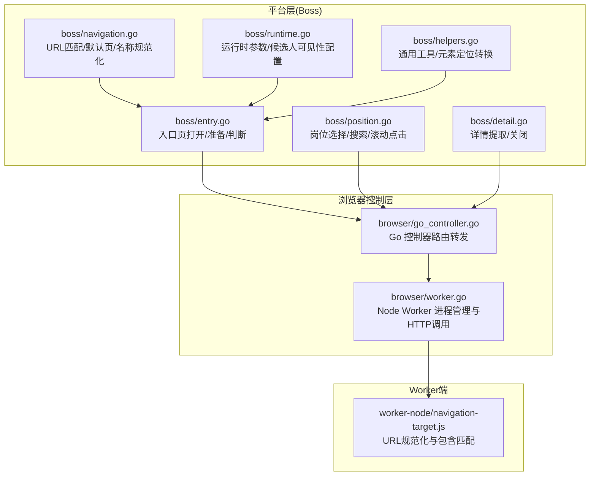
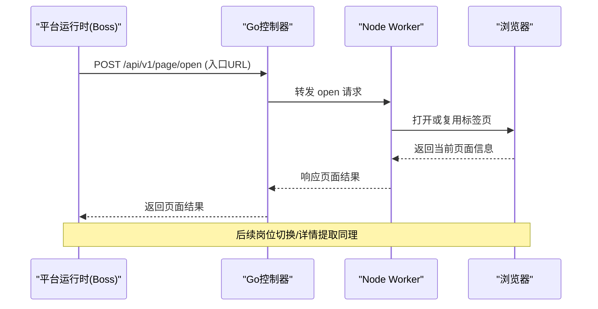
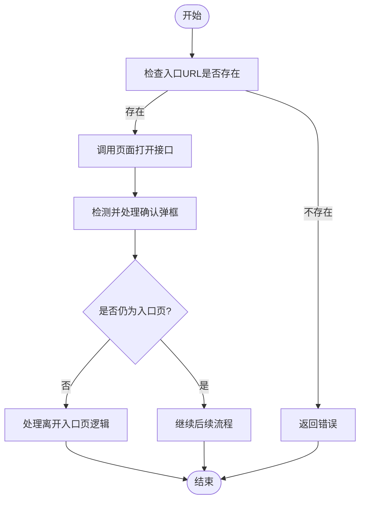
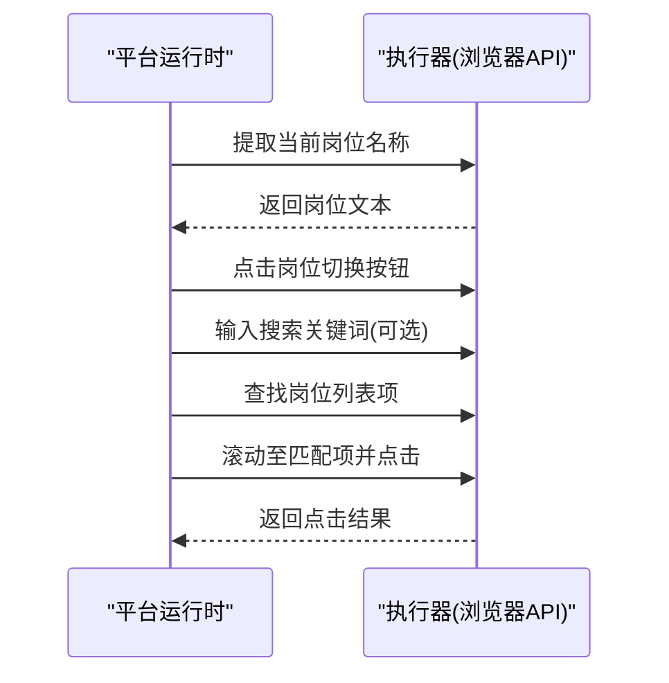
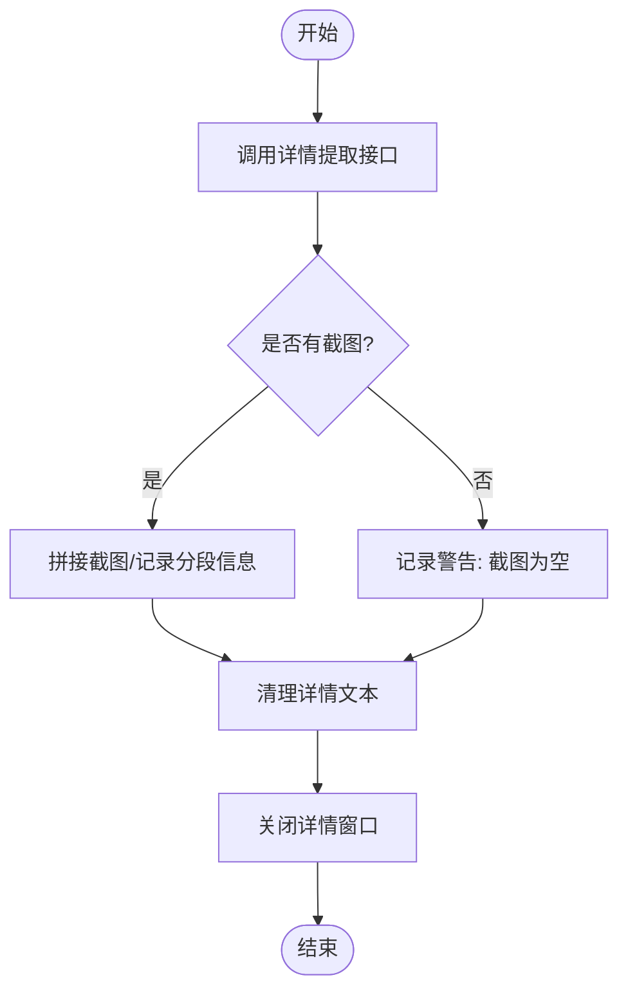
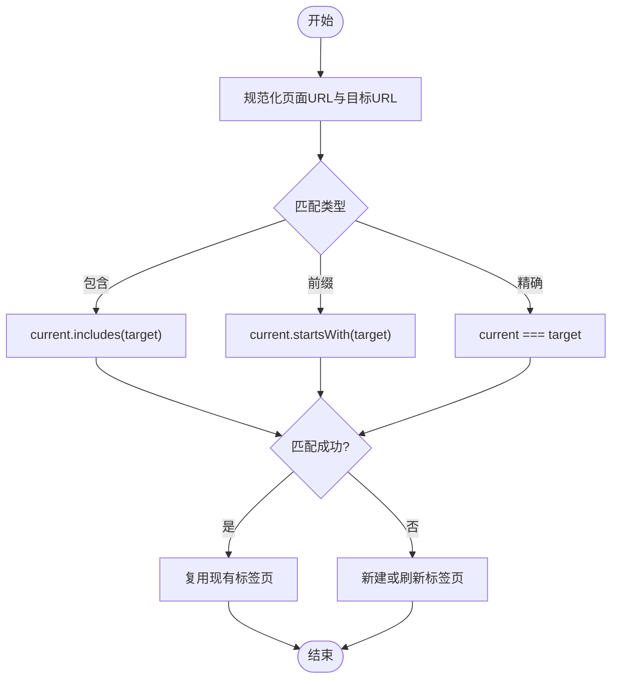
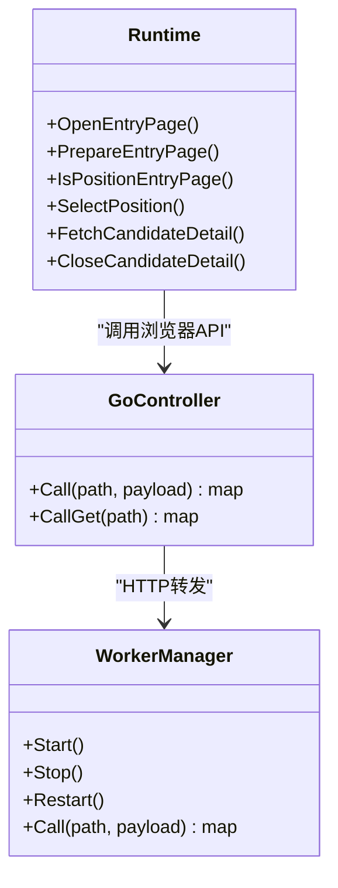
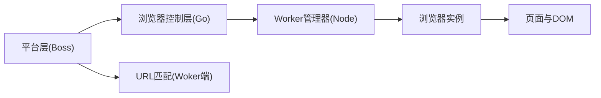

# 页面导航控制

<cite>
**本文引用的文件**
- [navigation.go](file://goodhr5/local-agent-go/internal/platforms/boss/navigation.go)
- [entry.go](file://goodhr5/local-agent-go/internal/platforms/boss/entry.go)
- [position.go](file://goodhr5/local-agent-go/internal/platforms/boss/position.go)
- [detail.go](file://goodhr5/local-agent-go/internal/platforms/boss/detail.go)
- [runtime.go](file://goodhr5/local-agent-go/internal/platforms/boss/runtime.go)
- [helpers.go](file://goodhr5/local-agent-go/internal/platforms/boss/helpers.go)
- [go_controller.go](file://goodhr5/local-agent-go/internal/browser/go_controller.go)
- [worker.go](file://goodhr5/local-agent-go/internal/browser/worker.go)
- [navigation-target.js](file://goodhr5/local-agent-go/worker-node/src/navigation-target.js)
</cite>

## 目录
1. [简介](#简介)
2. [项目结构](#项目结构)
3. [核心组件](#核心组件)
4. [架构总览](#架构总览)
5. [详细组件分析](#详细组件分析)
6. [依赖关系分析](#依赖关系分析)
7. [性能与资源管理](#性能与资源管理)
8. [故障排查指南](#故障排查指南)
9. [结论](#结论)

## 简介
本文面向 Boss 直聘平台的自动化运行场景，系统化说明页面导航控制的实现：包括页面跳转逻辑、URL 模式识别、路由状态管理、前进后退控制、刷新重试、超时处理机制；并覆盖 Boss 特有的导航结构、页面加载策略、异步内容处理；最后给出与浏览器自动化引擎的集成方式、跨页面数据传递机制以及性能优化与内存管理建议。

## 项目结构
Boss 平台导航相关代码主要分布在以下位置：
- 平台运行时与导航工具：internal/platforms/boss/*
- 浏览器控制器与 Worker 管理：internal/browser/*
- Worker 端 URL 匹配辅助：worker-node/src/navigation-target.js

**图表来源**
- [entry.go:12-72](file://goodhr5/local-agent-go/internal/platforms/boss/entry.go#L12-L72)
- [position.go:12-200](file://goodhr5/local-agent-go/internal/platforms/boss/position.go#L12-L200)
- [detail.go:14-108](file://goodhr5/local-agent-go/internal/platforms/boss/detail.go#L14-L108)
- [navigation.go:12-71](file://goodhr5/local-agent-go/internal/platforms/boss/navigation.go#L12-L71)
- [runtime.go:19-34](file://goodhr5/local-agent-go/internal/platforms/boss/runtime.go#L19-L34)
- [helpers.go:112-160](file://goodhr5/local-agent-go/internal/platforms/boss/helpers.go#L112-L160)
- [go_controller.go:259-335](file://goodhr5/local-agent-go/internal/browser/go_controller.go#L259-L335)
- [worker.go:254-332](file://goodhr5/local-agent-go/internal/browser/worker.go#L254-L332)
- [navigation-target.js:8-30](file://goodhr5/local-agent-go/worker-node/src/navigation-target.js#L8-L30)

**章节来源**
- [entry.go:12-72](file://goodhr5/local-agent-go/internal/platforms/boss/entry.go#L12-L72)
- [position.go:12-200](file://goodhr5/local-agent-go/internal/platforms/boss/position.go#L12-L200)
- [detail.go:14-108](file://goodhr5/local-agent-go/internal/platforms/boss/detail.go#L14-L108)
- [navigation.go:12-71](file://goodhr5/local-agent-go/internal/platforms/boss/navigation.go#L12-L71)
- [runtime.go:19-34](file://goodhr5/local-agent-go/internal/platforms/boss/runtime.go#L19-L34)
- [helpers.go:112-160](file://goodhr5/local-agent-go/internal/platforms/boss/helpers.go#L112-L160)
- [go_controller.go:259-335](file://goodhr5/local-agent-go/internal/browser/go_controller.go#L259-L335)
- [worker.go:254-332](file://goodhr5/local-agent-go/internal/browser/worker.go#L254-L332)
- [navigation-target.js:8-30](file://goodhr5/local-agent-go/worker-node/src/navigation-target.js#L8-L30)

## 核心组件
- Boss 平台运行时（Runtime）：封装 Boss 特有导航能力，如打开入口页、准备入口页、判断是否仍在入口页、切换岗位、提取详情等。
- 浏览器控制器（GoController）：提供与 Node Worker 兼容的 HTTP 路由转发，支持页面打开、列表查找、元素点击、截图、Cookie 操作等。
- Worker 管理器（WorkerManager）：管理 Node Browser Worker 生命周期，统一错误处理与自动重启，封装 HTTP 调用。
- Worker 端 URL 匹配（navigation-target.js）：规范化并比较现有标签页 URL 与目标 URL，避免重复刷新导致筛选条件丢失。

**章节来源**
- [runtime.go:11-17](file://goodhr5/local-agent-go/internal/platforms/boss/runtime.go#L11-L17)
- [go_controller.go:109-122](file://goodhr5/local-agent-go/internal/browser/go_controller.go#L109-L122)
- [worker.go:35-48](file://goodhr5/local-agent-go/internal/browser/worker.go#L35-L48)
- [navigation-target.js:8-30](file://goodhr5/local-agent-go/worker-node/src/navigation-target.js#L8-L30)

## 架构总览
Boss 导航控制采用“平台层 + 浏览器控制层 + Worker 端”的分层架构：
- 平台层负责业务语义（入口页、岗位切换、详情提取），通过 Executor 调用浏览器控制 API。
- 浏览器控制层将平台请求映射到具体浏览器操作（打开页面、点击、滚动、截图、Cookie）。
- Worker 端提供 URL 匹配与页面复用策略，减少不必要的刷新，保护用户已设置的筛选条件。

**图表来源**
- [entry.go:14-21](file://goodhr5/local-agent-go/internal/platforms/boss/entry.go#L14-L21)
- [go_controller.go:277-279](file://goodhr5/local-agent-go/internal/browser/go_controller.go#L277-L279)
- [worker.go:254-332](file://goodhr5/local-agent-go/internal/browser/worker.go#L254-L332)

## 详细组件分析

### 入口页导航与状态判断
- 打开入口页：校验配置中的入口地址，调用页面打开接口，记录日志。
- 准备入口页：检测确认弹框并点击确认，等待关闭。
- 判断是否仍在入口页：获取当前页面列表，取默认页并与配置入口进行匹配。

**图表来源**
- [entry.go:14-21](file://goodhr5/local-agent-go/internal/platforms/boss/entry.go#L14-L21)
- [entry.go:23-53](file://goodhr5/local-agent-go/internal/platforms/boss/entry.go#L23-L53)
- [entry.go:55-72](file://goodhr5/local-agent-go/internal/platforms/boss/entry.go#L55-L72)
- [navigation.go:12-39](file://goodhr5/local-agent-go/internal/platforms/boss/navigation.go#L12-L39)
- [navigation.go:55-71](file://goodhr5/local-agent-go/internal/platforms/boss/navigation.go#L55-L71)

**章节来源**
- [entry.go:14-72](file://goodhr5/local-agent-go/internal/platforms/boss/entry.go#L14-L72)
- [navigation.go:12-71](file://goodhr5/local-agent-go/internal/platforms/boss/navigation.go#L12-L71)

### 岗位切换与列表交互
- 读取当前岗位名称：通过配置的元素定位提取文本。
- 切换岗位：优先使用搜索框输入关键词，若不可用则回退到完整列表滚动查找。
- 列表项匹配：标准化岗位名称，查找匹配项后滚动至可视区域并点击。
- 失败回退：若无元素引用，按序号点击；若搜索未匹配，清空搜索并提示回退。

**图表来源**
- [position.go:14-30](file://goodhr5/local-agent-go/internal/platforms/boss/position.go#L14-L30)
- [position.go:32-119](file://goodhr5/local-agent-go/internal/platforms/boss/position.go#L32-L119)
- [position.go:121-199](file://goodhr5/local-agent-go/internal/platforms/boss/position.go#L121-L199)

**章节来源**
- [position.go:14-199](file://goodhr5/local-agent-go/internal/platforms/boss/position.go#L14-L199)

### 详情提取与关闭
- 提取详情：调用详情提取接口，支持截图与滚动分段，记录调试信息。
- 清理详情文本：去除平台附加内容（如“牛人分析器”）。
- 关闭详情：通过按键或专用接口关闭候选人详情窗口。

**图表来源**
- [detail.go:14-64](file://goodhr5/local-agent-go/internal/platforms/boss/detail.go#L14-L64)
- [detail.go:66-108](file://goodhr5/local-agent-go/internal/platforms/boss/detail.go#L66-L108)

**章节来源**
- [detail.go:14-108](file://goodhr5/local-agent-go/internal/platforms/boss/detail.go#L14-L108)

### URL 模式识别与页面复用
- 规范化 URL：去除多余斜杠、统一大小写、保留查询与哈希。
- 包含匹配：判断现有标签页 URL 是否包含目标 URL，用于复用页面，避免刷新丢失筛选条件。
- 入口页匹配：支持前缀、包含、精确三种匹配模式。

**图表来源**
- [navigation-target.js:8-30](file://goodhr5/local-agent-go/worker-node/src/navigation-target.js#L8-L30)
- [navigation.go:55-71](file://goodhr5/local-agent-go/internal/platforms/boss/navigation.go#L55-L71)

**章节来源**
- [navigation-target.js:8-30](file://goodhr5/local-agent-go/worker-node/src/navigation-target.js#L8-L30)
- [navigation.go:55-71](file://goodhr5/local-agent-go/internal/platforms/boss/navigation.go#L55-L71)

### 浏览器自动化集成与路由转发
- Go 控制器路由：将平台层的请求转发到浏览器操作（打开页面、点击、输入、滚动、截图、Cookie）。
- Worker 管理器：启动/停止/重启 Node Worker，统一错误处理与自动重试，封装 HTTP 调用。
- 跨页面数据传递：通过元素引用（element_ref）、字段提取（fields）、截图路径等方式在页面间传递上下文。

**图表来源**
- [go_controller.go:259-335](file://goodhr5/local-agent-go/internal/browser/go_controller.go#L259-L335)
- [worker.go:254-332](file://goodhr5/local-agent-go/internal/browser/worker.go#L254-L332)
- [entry.go:14-72](file://goodhr5/local-agent-go/internal/platforms/boss/entry.go#L14-L72)
- [position.go:32-199](file://goodhr5/local-agent-go/internal/platforms/boss/position.go#L32-L199)
- [detail.go:14-108](file://goodhr5/local-agent-go/internal/platforms/boss/detail.go#L14-L108)

**章节来源**
- [go_controller.go:259-335](file://goodhr5/local-agent-go/internal/browser/go_controller.go#L259-L335)
- [worker.go:254-332](file://goodhr5/local-agent-go/internal/browser/worker.go#L254-L332)

## 依赖关系分析
- 平台层依赖浏览器控制层提供的页面操作能力。
- 浏览器控制层依赖 Worker 管理器进行进程管理与 HTTP 调用。
- Worker 端提供 URL 匹配与页面复用策略，降低刷新频率，提升稳定性。
- 各层之间通过统一的 JSON 协议与路由路径通信，便于扩展与维护。

**图表来源**
- [entry.go:14-72](file://goodhr5/local-agent-go/internal/platforms/boss/entry.go#L14-L72)
- [go_controller.go:259-335](file://goodhr5/local-agent-go/internal/browser/go_controller.go#L259-L335)
- [worker.go:254-332](file://goodhr5/local-agent-go/internal/browser/worker.go#L254-L332)
- [navigation-target.js:8-30](file://goodhr5/local-agent-go/worker-node/src/navigation-target.js#L8-L30)

**章节来源**
- [entry.go:14-72](file://goodhr5/local-agent-go/internal/platforms/boss/entry.go#L14-L72)
- [go_controller.go:259-335](file://goodhr5/local-agent-go/internal/browser/go_controller.go#L259-L335)
- [worker.go:254-332](file://goodhr5/local-agent-go/internal/browser/worker.go#L254-L332)
- [navigation-target.js:8-30](file://goodhr5/local-agent-go/worker-node/src/navigation-target.js#L8-L30)

## 性能与资源管理
- 页面复用策略：通过 URL 规范化与包含匹配，避免重复刷新，保护用户筛选条件，减少网络与渲染开销。
- 滚动与可视性：在点击前确保元素进入视口，减少误触与重排，提高点击成功率。
- 超时与重试：Worker 管理器对调用失败进行自动重启并重试，提升鲁棒性。
- 内存与资源清理：
  - 元素引用缓存：控制器维护元素引用，避免重复查找。
  - 截图与日志：详情截图分段存储，Worker 日志集中管理，便于问题定位。
  - 进程管理：Worker 进程退出时清理子进程树，防止僵尸进程。

[本节为通用指导，不直接分析具体文件]

## 故障排查指南
- 入口页弹框未关闭：检查弹框选择器与点击超时设置，确认页面结构变化。
- 岗位未找到：核对岗位名称规范化逻辑与搜索关键词生成规则，确认列表项字段是否正确提取。
- 详情提取失败：查看截图调试信息与分段数量，确认滚动区域与视口边距设置。
- Worker 调用失败：检查端口占用与版本兼容性，必要时重启 Worker 并查看最近日志。

**章节来源**
- [entry.go:23-53](file://goodhr5/local-agent-go/internal/platforms/boss/entry.go#L23-L53)
- [position.go:32-119](file://goodhr5/local-agent-go/internal/platforms/boss/position.go#L32-L119)
- [detail.go:14-64](file://goodhr5/local-agent-go/internal/platforms/boss/detail.go#L14-L64)
- [worker.go:334-364](file://goodhr5/local-agent-go/internal/browser/worker.go#L334-L364)

## 结论
Boss 直聘页面导航控制通过分层架构实现了稳定的页面跳转、URL 模式识别与路由状态管理。结合 Worker 端的 URL 匹配与页面复用策略，有效减少了不必要的刷新与资源消耗。浏览器控制层提供了丰富的页面操作能力，并通过 Worker 管理器实现了健壮的错误处理与自动恢复机制。整体设计兼顾了可扩展性与可维护性，适合在复杂招聘平台场景中持续演进。