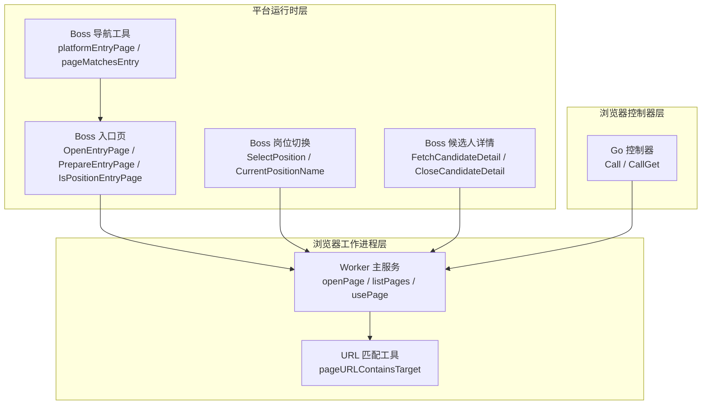
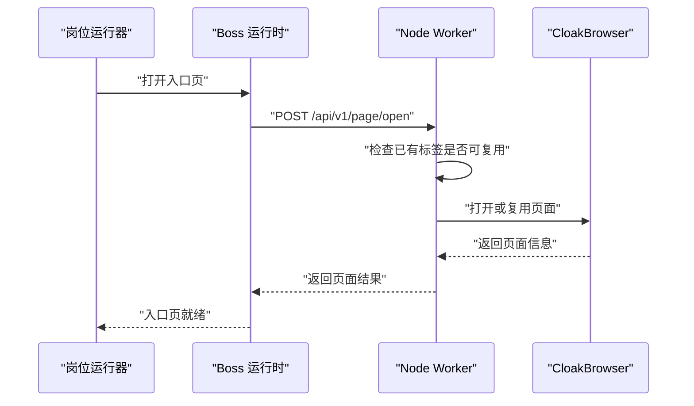
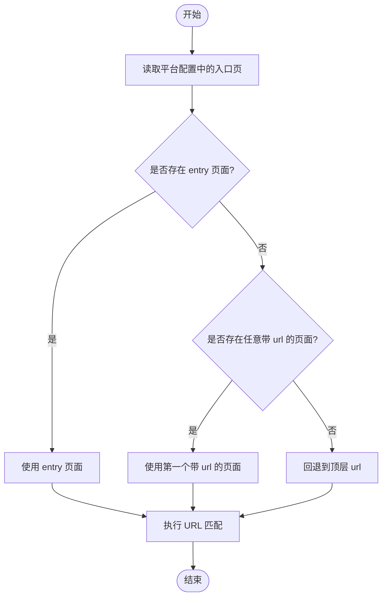
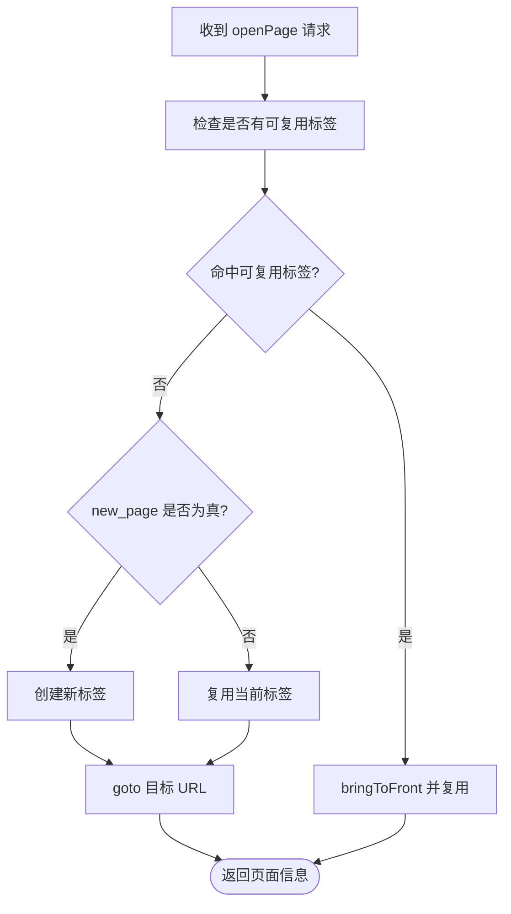
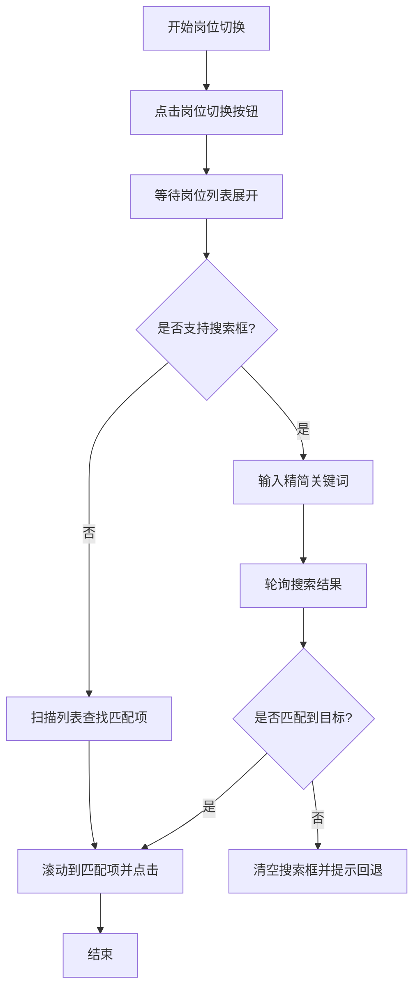
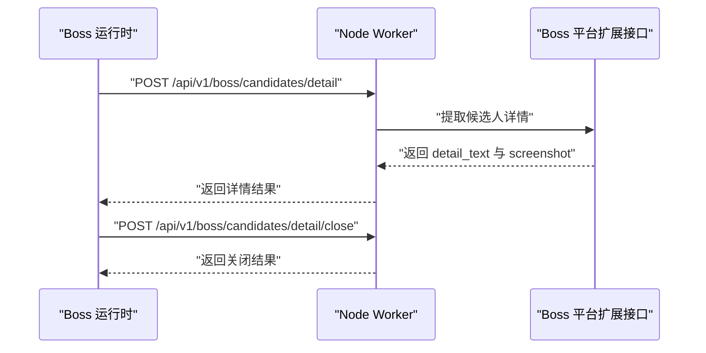
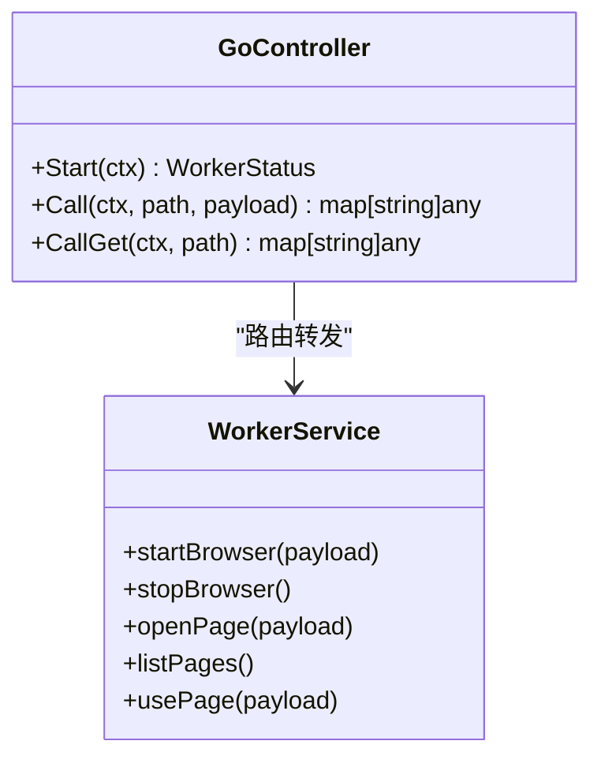
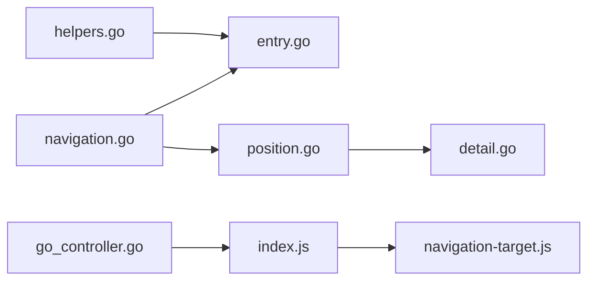

# 页面导航控制

<cite>
**本文引用的文件**   
- [local-agent-go/internal/platforms/boss/navigation.go](file://goodhr5/local-agent-go/internal/platforms/boss/navigation.go)
- [local-agent-go/internal/platforms/boss/entry.go](file://goodhr5/local-agent-go/internal/platforms/boss/entry.go)
- [local-agent-go/internal/platforms/boss/helpers.go](file://goodhr5/local-agent-go/internal/platforms/boss/helpers.go)
- [local-agent-go/internal/platforms/boss/runtime.go](file://goodhr5/local-agent-go/internal/platforms/boss/runtime.go)
- [local-agent-go/internal/platforms/boss/detail.go](file://goodhr5/local-agent-go/internal/platforms/boss/detail.go)
- [local-agent-go/internal/platforms/boss/position.go](file://goodhr5/local-agent-go/internal/platforms/boss/position.go)
- [local-agent-go/worker-node/src/index.js](file://goodhr5/local-agent-go/worker-node/src/index.js)
- [local-agent-go/worker-node/src/navigation-target.js](file://goodhr5/local-agent-go/worker-node/src/navigation-target.js)
- [local-agent-go/internal/browser/go_controller.go](file://goodhr5/local-agent-go/internal/browser/go_controller.go)
</cite>

## 目录
1. [引言](#引言)
2. [项目结构](#项目结构)
3. [核心组件](#核心组件)
4. [架构总览](#架构总览)
5. [详细组件分析](#详细组件分析)
6. [依赖关系分析](#依赖关系分析)
7. [性能与资源管理](#性能与资源管理)
8. [故障排查指南](#故障排查指南)
9. [结论](#结论)

## 引言
本文聚焦 Boss 直聘平台在 GoodHR 本地 Agent 中的页面导航控制，覆盖以下关键目标：
- 页面跳转逻辑、URL 模式识别与路由状态管理。
- Boss 直聘特有的导航结构、页面加载策略与异步内容处理。
- 前进后退控制、刷新重试、超时处理机制。
- 导航性能优化、内存管理与资源清理策略。
- 与浏览器自动化引擎（Node Worker 与 Go 控制器）的集成方式及跨页面数据传递机制。

## 项目结构
Boss 直聘导航能力由三层组成：
- 平台运行时层：Boss 平台规则、入口页判断、岗位切换、详情打开与关闭等。
- 浏览器工作进程层：Node Worker HTTP 服务，负责页面生命周期、标签复用、元素操作、截图与下载等。
- 浏览器控制器层：Go 控制器提供与 Node Worker 兼容的路由映射，支持实验性 Go 浏览器实现。

**图表来源**
- [local-agent-go/internal/platforms/boss/entry.go:12-72](file://goodhr5/local-agent-go/internal/platforms/boss/entry.go#L12-L72)
- [local-agent-go/internal/platforms/boss/position.go:12-119](file://goodhr5/local-agent-go/internal/platforms/boss/position.go#L12-L119)
- [local-agent-go/internal/platforms/boss/detail.go:14-107](file://goodhr5/local-agent-go/internal/platforms/boss/detail.go#L14-L107)
- [local-agent-go/internal/platforms/boss/navigation.go:12-71](file://goodhr5/local-agent-go/internal/platforms/boss/navigation.go#L12-L71)
- [local-agent-go/worker-node/src/index.js:681-743](file://goodhr5/local-agent-go/worker-node/src/index.js#L681-L743)
- [local-agent-go/worker-node/src/navigation-target.js:8-30](file://goodhr5/local-agent-go/worker-node/src/navigation-target.js#L8-L30)
- [local-agent-go/internal/browser/go_controller.go:259-334](file://goodhr5/local-agent-go/internal/browser/go_controller.go#L259-L334)

**章节来源**
- [local-agent-go/internal/platforms/boss/entry.go:12-72](file://goodhr5/local-agent-go/internal/platforms/boss/entry.go#L12-L72)
- [local-agent-go/internal/platforms/boss/position.go:12-119](file://goodhr5/local-agent-go/internal/platforms/boss/position.go#L12-L119)
- [local-agent-go/internal/platforms/boss/detail.go:14-107](file://goodhr5/local-agent-go/internal/platforms/boss/detail.go#L14-L107)
- [local-agent-go/internal/platforms/boss/navigation.go:12-71](file://goodhr5/local-agent-go/internal/platforms/boss/navigation.go#L12-L71)
- [local-agent-go/worker-node/src/index.js:681-743](file://goodhr5/local-agent-go/worker-node/src/index.js#L681-L743)
- [local-agent-go/worker-node/src/navigation-target.js:8-30](file://goodhr5/local-agent-go/worker-node/src/navigation-target.js#L8-L30)
- [local-agent-go/internal/browser/go_controller.go:259-334](file://goodhr5/local-agent-go/internal/browser/go_controller.go#L259-L334)

## 核心组件
- Boss 平台运行时
  - 入口页打开与准备：OpenEntryPage、PrepareEntryPage、IsPositionEntryPage。
  - 岗位选择与当前岗位读取：SelectPosition、CurrentPositionName。
  - 候选人详情提取与关闭：FetchCandidateDetail、CloseCandidateDetail。
  - 导航工具函数：platformEntryPage、pageMatchesEntry、currentDefaultPage。
- Node Worker 浏览器工作进程
  - 页面打开与复用：openPage、listPages、usePage。
  - URL 规范化与包含匹配：normalizeNavigationURL、pageURLContainsTarget。
- Go 浏览器控制器
  - 路由转发：Call、CallGet，将平台调用映射到浏览器基础操作或平台扩展操作。

**章节来源**
- [local-agent-go/internal/platforms/boss/entry.go:12-72](file://goodhr5/local-agent-go/internal/platforms/boss/entry.go#L12-L72)
- [local-agent-go/internal/platforms/boss/position.go:12-119](file://goodhr5/local-agent-go/internal/platforms/boss/position.go#L12-L119)
- [local-agent-go/internal/platforms/boss/detail.go:14-107](file://goodhr5/local-agent-go/internal/platforms/boss/detail.go#L14-L107)
- [local-agent-go/internal/platforms/boss/navigation.go:12-71](file://goodhr5/local-agent-go/internal/platforms/boss/navigation.go#L12-L71)
- [local-agent-go/worker-node/src/index.js:681-743](file://goodhr5/local-agent-go/worker-node/src/index.js#L681-L743)
- [local-agent-go/worker-node/src/navigation-target.js:8-30](file://goodhr5/local-agent-go/worker-node/src/navigation-target.js#L8-L30)
- [local-agent-go/internal/browser/go_controller.go:259-334](file://goodhr5/local-agent-go/internal/browser/go_controller.go#L259-L334)

## 架构总览
Boss 直聘导航控制的整体流程如下：
- 上层业务通过平台运行时发起导航请求。
- 平台运行时根据 Boss 配置解析入口页、岗位列表、详情弹窗等 DOM 结构。
- 浏览器工作进程负责实际页面打开、标签复用、元素定位与交互。
- Go 控制器作为可选后端，提供与 Node Worker 一致的路由接口。

**图表来源**
- [local-agent-go/internal/platforms/boss/entry.go:12-21](file://goodhr5/local-agent-go/internal/platforms/boss/entry.go#L12-L21)
- [local-agent-go/worker-node/src/index.js:681-743](file://goodhr5/local-agent-go/worker-node/src/index.js#L681-L743)

## 详细组件分析

### Boss 入口页与页面匹配
- 入口页选择策略
  - 优先从 auth.pages 中查找 entry=true 且 url 非空的页面。
  - 若未找到，则回退到任意有 url 的页面。
  - 最终仍无 url 时，尝试使用顶层 cfg.url。
- 默认页面选择
  - 从 Worker 返回的 pages 列表中取 is_default=true 的页面；若无，则取第一个页面。
- URL 匹配规则
  - 支持 prefix、contains、exact 三种匹配模式。
  - 比较前会去除末尾斜杠并忽略大小写。

**图表来源**
- [local-agent-go/internal/platforms/boss/navigation.go:12-39](file://goodhr5/local-agent-go/internal/platforms/boss/navigation.go#L12-L39)
- [local-agent-go/internal/platforms/boss/navigation.go:55-71](file://goodhr5/local-agent-go/internal/platforms/boss/navigation.go#L55-L71)

**章节来源**
- [local-agent-go/internal/platforms/boss/navigation.go:12-71](file://goodhr5/local-agent-go/internal/platforms/boss/navigation.go#L12-L71)
- [local-agent-go/internal/platforms/boss/entry.go:55-72](file://goodhr5/local-agent-go/internal/platforms/boss/entry.go#L55-L72)

### 页面打开与标签复用
- 标签复用判定
  - 对现有标签页 URL 与目标 URL 进行规范化后做包含匹配。
  - 规范化过程统一 origin、pathname、search、hash，避免多余斜杠和大小写差异。
- 页面打开流程
  - 若检测到可复用标签，直接 bringToFront 并复用，保留用户筛选条件。
  - 否则按 new_page 参数决定新建标签还是复用当前标签，然后 goto 目标 URL。
  - 打开时使用 domcontentloaded 等待策略，并支持自定义超时。

**图表来源**
- [local-agent-go/worker-node/src/navigation-target.js:8-30](file://goodhr5/local-agent-go/worker-node/src/navigation-target.js#L8-L30)
- [local-agent-go/worker-node/src/index.js:681-743](file://goodhr5/local-agent-go/worker-node/src/index.js#L681-L743)

**章节来源**
- [local-agent-go/worker-node/src/navigation-target.js:8-30](file://goodhr5/local-agent-go/worker-node/src/navigation-target.js#L8-L30)
- [local-agent-go/worker-node/src/index.js:681-743](file://goodhr5/local-agent-go/worker-node/src/index.js#L681-L743)

### 岗位切换与搜索回退
- 岗位切换流程
  - 点击岗位切换按钮，等待列表展开。
  - 优先尝试通过岗位搜索框输入精简关键词，多次轮询搜索结果。
  - 若搜索不可用或未匹配，回退为滚动列表查找匹配项。
  - 滚动到匹配项并确保可见后点击。
- 名称规范化
  - 去除岗位名称中的中英文括号说明，合并空白字符，提升匹配稳定性。

**图表来源**
- [local-agent-go/internal/platforms/boss/position.go:32-119](file://goodhr5/local-agent-go/internal/platforms/boss/position.go#L32-L119)
- [local-agent-go/internal/platforms/boss/position.go:121-199](file://goodhr5/local-agent-go/internal/platforms/boss/position.go#L121-L199)
- [local-agent-go/internal/platforms/boss/navigation.go:73-93](file://goodhr5/local-agent-go/internal/platforms/boss/navigation.go#L73-L93)

**章节来源**
- [local-agent-go/internal/platforms/boss/position.go:32-119](file://goodhr5/local-agent-go/internal/platforms/boss/position.go#L32-L119)
- [local-agent-go/internal/platforms/boss/position.go:121-199](file://goodhr5/local-agent-go/internal/platforms/boss/position.go#L121-L199)
- [local-agent-go/internal/platforms/boss/navigation.go:73-93](file://goodhr5/local-agent-go/internal/platforms/boss/navigation.go#L73-L93)

### 候选人详情打开与关闭
- 详情提取
  - 调用平台扩展接口，传入 position_id、card_index、element_ref、截图开关、滚动参数、视口边距等。
  - 支持 OCR/AI/DOM 多种模式，并记录诊断 traceID。
  - 返回文本与截图信息，必要时拼接分段截图。
- 详情关闭
  - 通过发送 Escape 键关闭详情弹窗，并记录日志。

**图表来源**
- [local-agent-go/internal/platforms/boss/detail.go:14-64](file://goodhr5/local-agent-go/internal/platforms/boss/detail.go#L14-L64)
- [local-agent-go/internal/platforms/boss/detail.go:66-107](file://goodhr5/local-agent-go/internal/platforms/boss/detail.go#L66-L107)

**章节来源**
- [local-agent-go/internal/platforms/boss/detail.go:14-107](file://goodhr5/local-agent-go/internal/platforms/boss/detail.go#L14-L107)

### 与浏览器自动化引擎的集成
- Node Worker
  - 提供 HTTP 服务，暴露页面打开、列表、切换、点击、输入、滚动、截图、Cookie 等操作。
  - 维护浏览器上下文、页面、元素引用、下载记录等状态。
- Go 控制器
  - 将平台运行时调用的路径映射到浏览器基础操作或平台扩展操作。
  - 返回统一 worker 标识，便于区分 Node 与 Go 两种后端。

**图表来源**
- [local-agent-go/internal/browser/go_controller.go:259-334](file://goodhr5/local-agent-go/internal/browser/go_controller.go#L259-L334)
- [local-agent-go/worker-node/src/index.js:390-532](file://goodhr5/local-agent-go/worker-node/src/index.js#L390-L532)
- [local-agent-go/worker-node/src/index.js:681-743](file://goodhr5/local-agent-go/worker-node/src/index.js#L681-L743)

**章节来源**
- [local-agent-go/internal/browser/go_controller.go:259-334](file://goodhr5/local-agent-go/internal/browser/go_controller.go#L259-L334)
- [local-agent-go/worker-node/src/index.js:390-532](file://goodhr5/local-agent-go/worker-node/src/index.js#L390-L532)
- [local-agent-go/worker-node/src/index.js:681-743](file://goodhr5/local-agent-go/worker-node/src/index.js#L681-L743)

## 依赖关系分析
- 平台运行时依赖
  - helpers.go：通用 map/字符串转换、Worker 响应解析、元素定位载荷构造。
  - navigation.go：入口页选择、默认页选择、URL 匹配、岗位名称规范化。
  - entry.go：入口页打开、弹框处理、入口页判断。
  - position.go：岗位切换、搜索回退、滚动与点击。
  - detail.go：详情提取、截图调试、详情关闭。
- Worker 依赖
  - index.js：浏览器启动、页面打开、标签复用、元素操作、截图、下载、健康检查。
  - navigation-target.js：URL 规范化与包含匹配。
- Go 控制器依赖
  - go_controller.go：路由映射、基础操作封装、平台扩展操作转发。

**图表来源**
- [local-agent-go/internal/platforms/boss/helpers.go:1-207](file://goodhr5/local-agent-go/internal/platforms/boss/helpers.go#L1-L207)
- [local-agent-go/internal/platforms/boss/navigation.go:1-162](file://goodhr5/local-agent-go/internal/platforms/boss/navigation.go#L1-L162)
- [local-agent-go/internal/platforms/boss/entry.go:1-73](file://goodhr5/local-agent-go/internal/platforms/boss/entry.go#L1-L73)
- [local-agent-go/internal/platforms/boss/position.go:1-200](file://goodhr5/local-agent-go/internal/platforms/boss/position.go#L1-L200)
- [local-agent-go/internal/platforms/boss/detail.go:1-108](file://goodhr5/local-agent-go/internal/platforms/boss/detail.go#L1-L108)
- [local-agent-go/worker-node/src/index.js:1-800](file://goodhr5/local-agent-go/worker-node/src/index.js#L1-L800)
- [local-agent-go/worker-node/src/navigation-target.js:1-31](file://goodhr5/local-agent-go/worker-node/src/navigation-target.js#L1-L31)
- [local-agent-go/internal/browser/go_controller.go:1-374](file://goodhr5/local-agent-go/internal/browser/go_controller.go#L1-L374)

**章节来源**
- [local-agent-go/internal/platforms/boss/helpers.go:1-207](file://goodhr5/local-agent-go/internal/platforms/boss/helpers.go#L1-L207)
- [local-agent-go/internal/platforms/boss/navigation.go:1-162](file://goodhr5/local-agent-go/internal/platforms/boss/navigation.go#L1-L162)
- [local-agent-go/internal/platforms/boss/entry.go:1-73](file://goodhr5/local-agent-go/internal/platforms/boss/entry.go#L1-L73)
- [local-agent-go/internal/platforms/boss/position.go:1-200](file://goodhr5/local-agent-go/internal/platforms/boss/position.go#L1-L200)
- [local-agent-go/internal/platforms/boss/detail.go:1-108](file://goodhr5/local-agent-go/internal/platforms/boss/detail.go#L1-L108)
- [local-agent-go/worker-node/src/index.js:1-800](file://goodhr5/local-agent-go/worker-node/src/index.js#L1-L800)
- [local-agent-go/worker-node/src/navigation-target.js:1-31](file://goodhr5/local-agent-go/worker-node/src/navigation-target.js#L1-L31)
- [local-agent-go/internal/browser/go_controller.go:1-374](file://goodhr5/local-agent-go/internal/browser/go_controller.go#L1-L374)

## 性能与资源管理
- 页面加载策略
  - 使用 domcontentloaded 等待策略，减少首屏渲染阻塞。
  - 支持自定义超时，避免长时间挂起。
- 标签复用
  - 通过 URL 规范化与包含匹配复用已有标签，保留用户筛选条件，降低重复导航成本。
- 元素引用管理
  - 打开页面时清空元素引用，避免陈旧引用导致定位失败。
- 浏览器状态清理
  - 停止浏览器时关闭 context 与 browser，重置全局状态。
  - 检测已关闭目标错误，自动清理无效状态。
- 内存与系统资源
  - 记录 Node 内存、系统内存、浏览器页面数量等诊断字段，辅助定位内存泄漏。
- 下载与截图
  - 设置下载目录，记录下载历史；详情截图支持分段拼接与滚动诊断。

**章节来源**
- [local-agent-go/worker-node/src/index.js:681-743](file://goodhr5/local-agent-go/worker-node/src/index.js#L681-L743)
- [local-agent-go/worker-node/src/index.js:538-566](file://goodhr5/local-agent-go/worker-node/src/index.js#L538-L566)
- [local-agent-go/worker-node/src/index.js:629-674](file://goodhr5/local-agent-go/worker-node/src/index.js#L629-L674)
- [local-agent-go/worker-node/src/index.js:131-153](file://goodhr5/local-agent-go/worker-node/src/index.js#L131-L153)
- [local-agent-go/internal/platforms/boss/detail.go:14-64](file://goodhr5/local-agent-go/internal/platforms/boss/detail.go#L14-L64)

## 故障排查指南
- 入口页配置缺失
  - 现象：平台配置缺少入口页面地址。
  - 处理：检查云端平台配置中的 auth.pages 或顶层 url。
- 岗位为空或选择器缺失
  - 现象：平台配置中无当前岗位选择器或岗位列表为空。
  - 处理：确认岗位模板名称与 Boss 直聘岗位名称一致，检查选择器配置。
- 详情页提取失败
  - 现象：详情提取接口报错，traceID 可用于检索日志。
  - 处理：查看截图调试信息与滚动诊断，确认视口与滚动参数。
- 浏览器会话失效
  - 现象：Target closed 或 Browser has been closed。
  - 处理：触发状态清理，重新启动浏览器。
- Go 控制器不支持的操作
  - 现象：某些组合操作或 GET 路由未实现。
  - 处理：切换到 Node Worker 或升级 Go 控制器支持。

**章节来源**
- [local-agent-go/internal/platforms/boss/entry.go:14-21](file://goodhr5/local-agent-go/internal/platforms/boss/entry.go#L14-L21)
- [local-agent-go/internal/platforms/boss/position.go:14-29](file://goodhr5/local-agent-go/internal/platforms/boss/position.go#L14-L29)
- [local-agent-go/internal/platforms/boss/detail.go:38-41](file://goodhr5/local-agent-go/internal/platforms/boss/detail.go#L38-L41)
- [local-agent-go/worker-node/src/index.js:629-674](file://goodhr5/local-agent-go/worker-node/src/index.js#L629-L674)
- [local-agent-go/internal/browser/go_controller.go:305-352](file://goodhr5/local-agent-go/internal/browser/go_controller.go#L305-L352)

## 结论
Boss 直聘页面导航控制在 GoodHR 本地 Agent 中采用分层设计：
- 平台运行时负责 Boss 特有规则与 DOM 交互。
- Node Worker 提供稳定可靠的浏览器自动化能力，支持标签复用、元素操作、截图与下载。
- Go 控制器提供兼容路由，便于未来替换或扩展浏览器后端。

该方案在保证用户体验（保留筛选条件、减少重复导航）的同时，兼顾性能与稳定性（超时控制、状态清理、诊断日志），并为后续优化预留了清晰的扩展点。