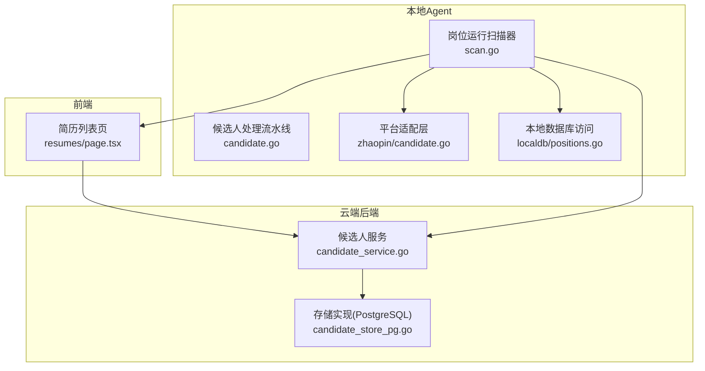
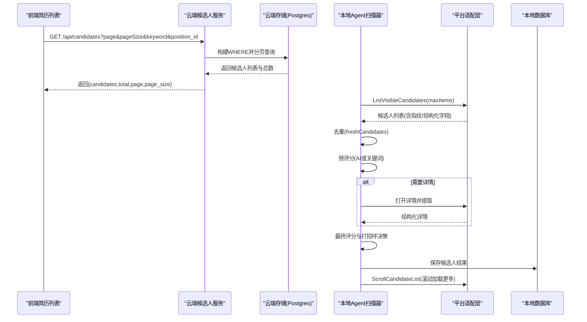
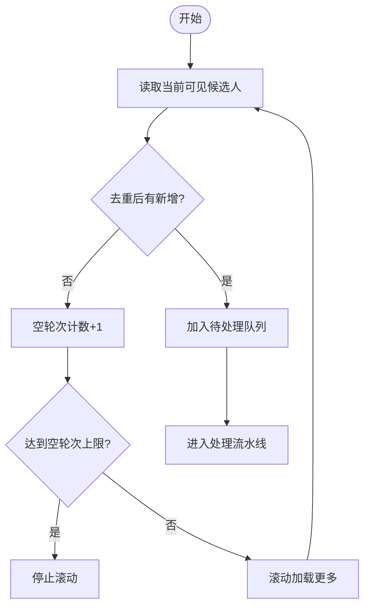
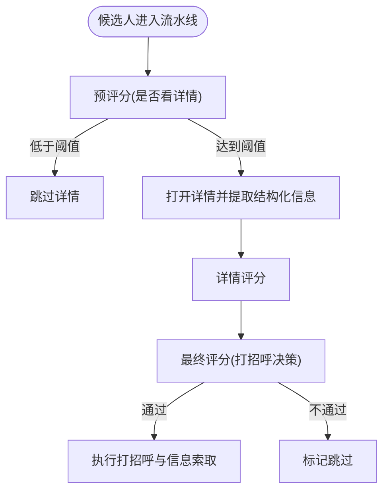
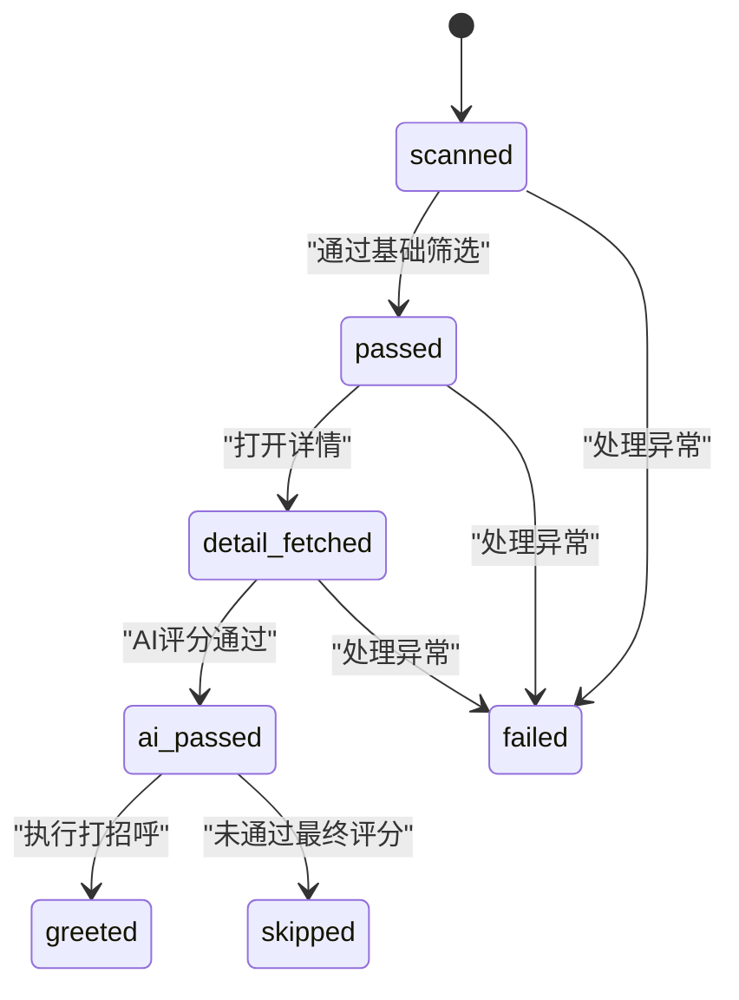
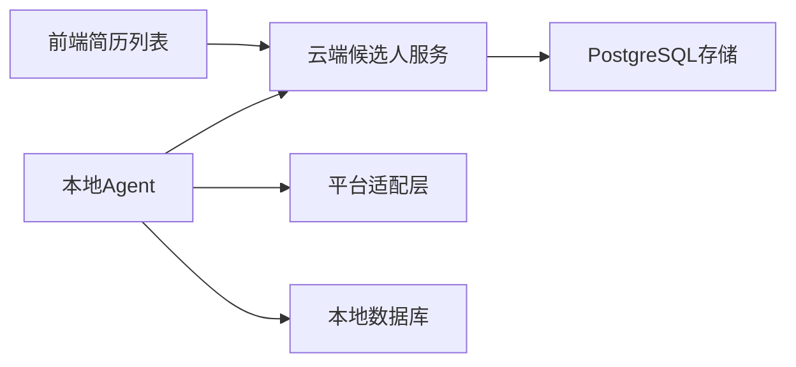

# 候选人处理

<cite>
**本文引用的文件**
- [scan.go](file://goodhr5/local-agent-go/internal/positionrunner/scan.go)
- [candidate.go](file://goodhr5/local-agent-go/internal/positionrunner/candidate.go)
- [positions.go](file://goodhr5/local-agent-go/internal/localdb/positions.go)
- [candidate_service.go](file://goodhr5/cloud/backend/internal/httpapi/candidate_service.go)
- [candidate_store_pg.go](file://goodhr5/cloud/backend/internal/httpapi/candidate_store_pg.go)
- [page.tsx（简历列表）](file://goodhr5/cloud/frontend-next/app/admin/resumes/page.tsx)
- [candidate.go（智联招聘平台实现）](file://goodhr5/local-agent-go/internal/platforms/zhaopin/candidate.go)
- [candidate_list.go（通用翻页与列表变更等待）](file://goodhr5/local-agent-go/internal/platform/common/candidate_list.go)
- [0018_upgrade_default_prompts_to_score_mode.sql](file://goodhr5/cloud/backend/db/migrations/0018_upgrade_default_prompts_to_score_mode.sql)
- [0019_upgrade_position_ai_prompts_to_score_mode.sql](file://goodhr5/cloud/backend/db/migrations/0019_upgrade_position_ai_prompts_to_score_mode.sql)
</cite>

## 目录
1. [简介](#简介)
2. [项目结构](#项目结构)
3. [核心组件](#核心组件)
4. [架构总览](#架构总览)
5. [详细组件分析](#详细组件分析)
6. [依赖关系分析](#依赖关系分析)
7. [性能考量](#性能考量)
8. [故障排查指南](#故障排查指南)
9. [结论](#结论)
10. [附录](#附录)

## 简介
本文件面向前程无忧等招聘平台的候选人处理流程，系统性说明从“候选人列表获取”到“结构化信息提取”“AI匹配评分”“状态管理与筛选排序”“数据持久化与同步”的完整链路。重点覆盖分页加载、去重策略、缓存与并发控制、关键词匹配与经验评估、兼容性分析、以及最终与AI系统的集成方式。

## 项目结构
本项目采用“本地Agent + 云端后端 + 前端管理界面”的分层架构：
- 本地Agent负责驱动浏览器抓取平台页面、解析候选人列表与详情、执行打招呼与信息索取、并维护运行状态与统计。
- 云端后端提供候选人列表API、团队权限控制、结构化字段查询与分页。
- 前端提供简历库查看、筛选、分页加载与管理操作。



图表来源
- [scan.go:17-203](file://goodhr5/local-agent-go/internal/positionrunner/scan.go#L17-L203)
- [candidate.go:16-76](file://goodhr5/local-agent-go/internal/positionrunner/candidate.go#L16-L76)
- [candidate.go（智联）:13-50](file://goodhr5/local-agent-go/internal/platforms/zhaopin/candidate.go#L13-L50)
- [positions.go:462-528](file://goodhr5/local-agent-go/internal/localdb/positions.go#L462-L528)
- [candidate_service.go:29-76](file://goodhr5/cloud/backend/internal/httpapi/candidate_service.go#L29-L76)
- [candidate_store_pg.go:624-651](file://goodhr5/cloud/backend/internal/httpapi/candidate_store_pg.go#L624-L651)
- [page.tsx（简历列表）:57-99](file://goodhr5/cloud/frontend-next/app/admin/resumes/page.tsx#L57-L99)

章节来源
- [scan.go:17-203](file://goodhr5/local-agent-go/internal/positionrunner/scan.go#L17-L203)
- [candidate_service.go:29-76](file://goodhr5/cloud/backend/internal/httpapi/candidate_service.go#L29-L76)
- [page.tsx（简历列表）:57-99](file://goodhr5/cloud/frontend-next/app/admin/resumes/page.tsx#L57-L99)

## 核心组件
- 岗位运行扫描器：负责打开平台入口、应用基础筛选、读取可见候选人、滚动加载更多、去重、入队处理。
- 候选人处理流水线：对每个候选人进行预评分（是否看详情）、可选打开详情、二次打分、决定是否打招呼与信息索取。
- 平台适配层：封装各平台（如智联招聘）的列表提取、滚动、可见性确认、指纹生成等差异。
- 本地数据库访问：结构化字段的读写、过滤、分页、删除与清空。
- 云端候选人服务：对外提供候选人的分页查询、团队隔离、关键字搜索、备注管理等。
- 前端简历列表：调用后端API，支持按岗位、关键词、分页参数加载。

章节来源
- [scan.go:17-203](file://goodhr5/local-agent-go/internal/positionrunner/scan.go#L17-L203)
- [candidate.go:16-76](file://goodhr5/local-agent-go/internal/positionrunner/candidate.go#L16-L76)
- [candidate.go（智联）:13-50](file://goodhr5/local-agent-go/internal/platforms/zhaopin/candidate.go#L13-L50)
- [positions.go:462-528](file://goodhr5/local-agent-go/internal/localdb/positions.go#L462-L528)
- [candidate_service.go:29-76](file://goodhr5/cloud/backend/internal/httpapi/candidate_service.go#L29-L76)
- [page.tsx（简历列表）:57-99](file://goodhr5/cloud/frontend-next/app/admin/resumes/page.tsx#L57-L99)

## 架构总览
候选人处理的主流程如下：
1. 启动浏览器并进入平台入口页，应用岗位搜索条件与基础筛选。
2. 读取当前可见候选人，去重后加入队列。
3. 对队列中的候选人进行预评分（AI或关键词模式），决定是否打开详情。
4. 若需要详情，则打开详情页并提取结构化信息；必要时进行二次打分。
5. 根据最终评分决定是否打招呼与信息索取。
6. 保存候选人结果，更新统计，滚动加载更多，循环直到达到空轮次上限或用户停止。



图表来源
- [scan.go:178-203](file://goodhr5/local-agent-go/internal/positionrunner/scan.go#L178-L203)
- [candidate.go:269-324](file://goodhr5/local-agent-go/internal/positionrunner/candidate.go#L269-L324)
- [candidate.go（智联）:13-50](file://goodhr5/local-agent-go/internal/platforms/zhaopin/candidate.go#L13-L50)
- [candidate_service.go:29-76](file://goodhr5/cloud/backend/internal/httpapi/candidate_service.go#L29-L76)
- [candidate_store_pg.go:624-651](file://goodhr5/cloud/backend/internal/httpapi/candidate_store_pg.go#L624-L651)
- [page.tsx（简历列表）:57-99](file://goodhr5/cloud/frontend-next/app/admin/resumes/page.tsx#L57-L99)

## 详细组件分析

### 候选人列表获取与分页加载
- 前端通过URL参数page、page_size、keyword、position_id发起请求，后端按团队与用户权限过滤，返回分页结果。
- 本地Agent在每轮扫描中读取当前可见候选人，设置最大条目数，避免一次性拉取过多数据。
- 当本轮无新候选人时，触发滚动以加载更多，直至连续空轮次达到上限。



图表来源
- [scan.go:178-203](file://goodhr5/local-agent-go/internal/positionrunner/scan.go#L178-L203)
- [scan.go:495-510](file://goodhr5/local-agent-go/internal/positionrunner/scan.go#L495-L510)

章节来源
- [page.tsx（简历列表）:57-99](file://goodhr5/cloud/frontend-next/app/admin/resumes/page.tsx#L57-L99)
- [candidate_service.go:29-76](file://goodhr5/cloud/backend/internal/httpapi/candidate_service.go#L29-L76)
- [candidate_store_pg.go:624-651](file://goodhr5/cloud/backend/internal/httpapi/candidate_store_pg.go#L624-L651)
- [scan.go:178-203](file://goodhr5/local-agent-go/internal/positionrunner/scan.go#L178-L203)
- [scan.go:495-510](file://goodhr5/local-agent-go/internal/positionrunner/scan.go#L495-L510)

### 数据去重与稳定性
- 去重基于候选人唯一标识（平台ID+稳定字段）。平台适配层为候选人生成指纹，例如姓名+年龄的稳定组合，确保跨页面重复识别。
- 主流程使用内存集合记录已见候选人ID，快速判断重复并累计重复数量。

```mermaid
classDiagram
class CandidateFingerprint {
+generate(candidate) string
}
class DedupSet {
-seen map[string]struct{}
+add(id) bool
+isDuplicate(id) bool
}
CandidateFingerprint --> DedupSet : "生成稳定ID用于去重"
```

图表来源
- [candidate.go（智联）:76-85](file://goodhr5/local-agent-go/internal/platforms/zhaopin/candidate.go#L76-L85)
- [candidate.go:269-287](file://goodhr5/local-agent-go/internal/positionrunner/candidate.go#L269-L287)

章节来源
- [candidate.go（智联）:76-85](file://goodhr5/local-agent-go/internal/platforms/zhaopin/candidate.go#L76-L85)
- [candidate.go:269-287](file://goodhr5/local-agent-go/internal/positionrunner/candidate.go#L269-L287)

### 候选人信息提取算法
- 基本信息：姓名、年龄、学历、期望职位、工作地区、薪资范围、在线状态等。
- 工作经历与教育背景：结构化数组字段，便于后续匹配与展示。
- 技能标签与附加信息：平台配置中的extras字段，如薪资文本、基本信息、标签、公司信息。
- 平台适配层负责将DOM节点映射为统一的结构化对象，并计算筛选文本用于检索。

章节来源
- [candidate.go（智联）:13-50](file://goodhr5/local-agent-go/internal/platforms/zhaopin/candidate.go#L13-L50)
- [candidate_service.go:251-295](file://goodhr5/cloud/backend/internal/httpapi/candidate_service.go#L251-L295)

### AI匹配评分机制
- 预评分：在列表阶段进行“是否值得看详情”的评分，阈值由岗位配置决定；低于阈值直接跳过。
- 详情评分：打开详情后，结合结构化信息进行更精确的匹配评估。
- 最终评分：决定是否打招呼与信息索取，评分阈值可独立配置。
- 提示词升级：系统默认提示词与岗位提示词均升级为评分模式，要求输出score与reason，保证可解释性与一致性。



图表来源
- [scan.go:217-379](file://goodhr5/local-agent-go/internal/positionrunner/scan.go#L217-L379)
- [0018_upgrade_default_prompts_to_score_mode.sql:1-20](file://goodhr5/cloud/backend/db/migrations/0018_upgrade_default_prompts_to_score_mode.sql#L1-L20)
- [0019_upgrade_position_ai_prompts_to_score_mode.sql:9-22](file://goodhr5/cloud/backend/db/migrations/0019_upgrade_position_ai_prompts_to_score_mode.sql#L9-L22)

章节来源
- [scan.go:217-379](file://goodhr5/local-agent-go/internal/positionrunner/scan.go#L217-L379)
- [0018_upgrade_default_prompts_to_score_mode.sql:1-20](file://goodhr5/cloud/backend/db/migrations/0018_upgrade_default_prompts_to_score_mode.sql#L1-L20)
- [0019_upgrade_position_ai_prompts_to_score_mode.sql:9-22](file://goodhr5/cloud/backend/db/migrations/0019_upgrade_position_ai_prompts_to_score_mode.sql#L9-L22)

### 候选人状态管理与筛选逻辑
- 状态流转：scanned → passed → detail_fetched → ai_passed → greeted；失败与跳过分别标记failed与skipped。
- 列表阶段筛选：支持关键词模式与详情模式；关键词模式下可在列表阶段直接终判。
- 云端筛选：支持按岗位、用户邮箱、关键字等多条件组合过滤，关键字在多个字段中进行模糊匹配。
- 本地筛选：支持按岗位ID与关键字过滤，并在内存中完成分页。



图表来源
- [candidate.go:337-349](file://goodhr5/local-agent-go/internal/positionrunner/candidate.go#L337-L349)
- [candidate_store_pg.go:624-651](file://goodhr5/cloud/backend/internal/httpapi/candidate_store_pg.go#L624-L651)
- [positions.go:599-611](file://goodhr5/local-agent-go/internal/localdb/positions.go#L599-L611)

章节来源
- [candidate.go:337-349](file://goodhr5/local-agent-go/internal/positionrunner/candidate.go#L337-L349)
- [candidate_store_pg.go:624-651](file://goodhr5/cloud/backend/internal/httpapi/candidate_store_pg.go#L624-L651)
- [positions.go:599-611](file://goodhr5/local-agent-go/internal/localdb/positions.go#L599-L611)

### 数据持久化与同步方案
- 本地持久化：候选人结构化字段、AI评分与原因、时间戳、附件信息等写入本地数据库，支持按条件查询与分页。
- 云端同步：云端服务提供候选人列表API，支持团队隔离与权限控制；前端通过分页参数加载数据。
- 统计与进度：岗位运行过程中持续累计扫描、跳过、打招呼、失败数量，并在任务结束时刷新统计。

章节来源
- [positions.go:462-528](file://goodhr5/local-agent-go/internal/localdb/positions.go#L462-L528)
- [candidate_service.go:29-76](file://goodhr5/cloud/backend/internal/httpapi/candidate_service.go#L29-L76)
- [scan.go:449-461](file://goodhr5/local-agent-go/internal/positionrunner/scan.go#L449-L461)

### 与AI系统的集成方式
- 预评分与详情评分：通过岗位配置的提示词与阈值，调用AI系统进行匹配度评估，输出分数与原因。
- 信息索取策略：根据最终评分与阈值决定是否向平台请求联系方式或简历。
- 可观测性：所有AI调用结果与耗时、阈值、使用次数等字段保存在候选人记录中，便于复盘与调优。

章节来源
- [scan.go:217-379](file://goodhr5/local-agent-go/internal/positionrunner/scan.go#L217-L379)
- [candidate.go:78-109](file://goodhr5/local-agent-go/internal/positionrunner/candidate.go#L78-L109)
- [0018_upgrade_default_prompts_to_score_mode.sql:1-20](file://goodhr5/cloud/backend/db/migrations/0018_upgrade_default_prompts_to_score_mode.sql#L1-L20)
- [0019_upgrade_position_ai_prompts_to_score_mode.sql:9-22](file://goodhr5/cloud/backend/db/migrations/0019_upgrade_position_ai_prompts_to_score_mode.sql#L9-L22)

## 依赖关系分析
- 本地Agent依赖平台适配层以屏蔽不同招聘平台的差异。
- 云端服务依赖PostgreSQL进行团队隔离与多条件查询。
- 前端依赖云端API进行分页加载与筛选。
- 数据存储层同时包含本地数据库与云端数据库，形成“采集-处理-展示”的闭环。



图表来源
- [candidate_service.go:29-76](file://goodhr5/cloud/backend/internal/httpapi/candidate_service.go#L29-L76)
- [candidate_store_pg.go:624-651](file://goodhr5/cloud/backend/internal/httpapi/candidate_store_pg.go#L624-L651)
- [candidate.go（智联）:13-50](file://goodhr5/local-agent-go/internal/platforms/zhaopin/candidate.go#L13-L50)
- [positions.go:462-528](file://goodhr5/local-agent-go/internal/localdb/positions.go#L462-L528)

章节来源
- [candidate_service.go:29-76](file://goodhr5/cloud/backend/internal/httpapi/candidate_service.go#L29-L76)
- [candidate_store_pg.go:624-651](file://goodhr5/cloud/backend/internal/httpapi/candidate_store_pg.go#L624-L651)
- [candidate.go（智联）:13-50](file://goodhr5/local-agent-go/internal/platforms/zhaopin/candidate.go#L13-L50)
- [positions.go:462-528](file://goodhr5/local-agent-go/internal/localdb/positions.go#L462-L528)

## 性能考量
- 分页与限流：前端与本地Agent均采用分页与最大条目限制，避免单次请求过大。
- 并发处理：预评分阶段使用并发通道提升吞吐，但保持页面顺序消费以保证UI一致。
- 滚动优化：滚动距离随机化与锚点选择，减少平台反爬检测风险。
- 去重效率：内存集合O(1)查找，降低重复处理开销。
- 超时与重试：关键操作设置超时与重试，提高鲁棒性。

[本节为通用指导，无需特定文件引用]

## 故障排查指南
- 页面未就绪：检查入口页匹配与岗位切换逻辑，确认当前页面是否为岗位运行入口。
- 列表为空：确认基础筛选是否正确应用，滚动是否生效，空轮次上限是否过早触发。
- 去重异常：核对平台指纹生成规则，确保姓名与年龄等关键字段存在且稳定。
- AI评分失败：检查提示词配置与阈值设置，确认AI服务可用性与超时策略。
- 打招呼失败：查看重试次数与错误日志，确认平台接口可用性。

章节来源
- [scan.go:528-634](file://goodhr5/local-agent-go/internal/positionrunner/scan.go#L528-L634)
- [scan.go:495-510](file://goodhr5/local-agent-go/internal/positionrunner/scan.go#L495-L510)
- [candidate.go:111-135](file://goodhr5/local-agent-go/internal/positionrunner/candidate.go#L111-L135)

## 结论
本方案通过“本地Agent采集 + 云端服务展示”的双层架构，实现了候选人列表的高效获取、结构化提取、AI匹配评分与状态管理。分页加载、去重策略与并发控制保障了性能与稳定性；提示词升级与评分模式提升了匹配的可解释性与可控性。未来可进一步扩展平台适配、优化AI模型与阈值策略，以提升整体匹配质量与用户体验。

[本节为总结，无需特定文件引用]

## 附录
- 前端简历列表分页参数：page、page_size、keyword、position_id。
- 候选人关键字段：basic_info、work_experiences、educations、certificates、honors、project_experiences、colleague_communications。
- AI评分字段：ai_detail_score/reason、ai_greet_score/reason、ai_review_score/reason。
- 平台配置键位：platform_id、pages、selectors、extras、behavior。

[本节为补充说明，无需特定文件引用]