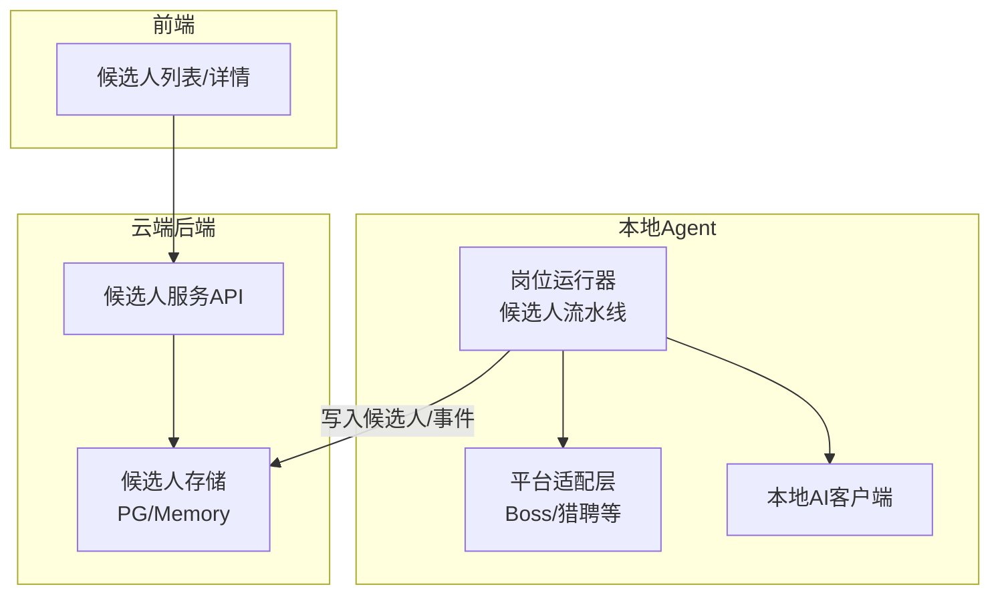
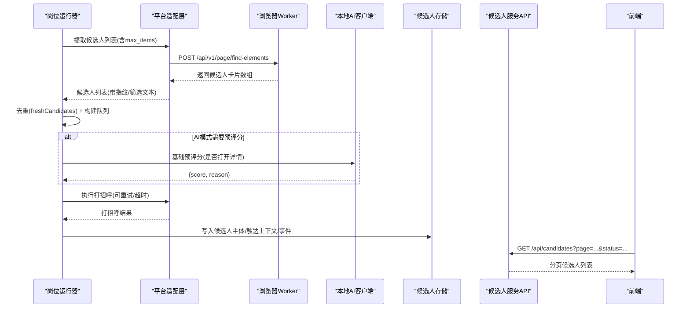
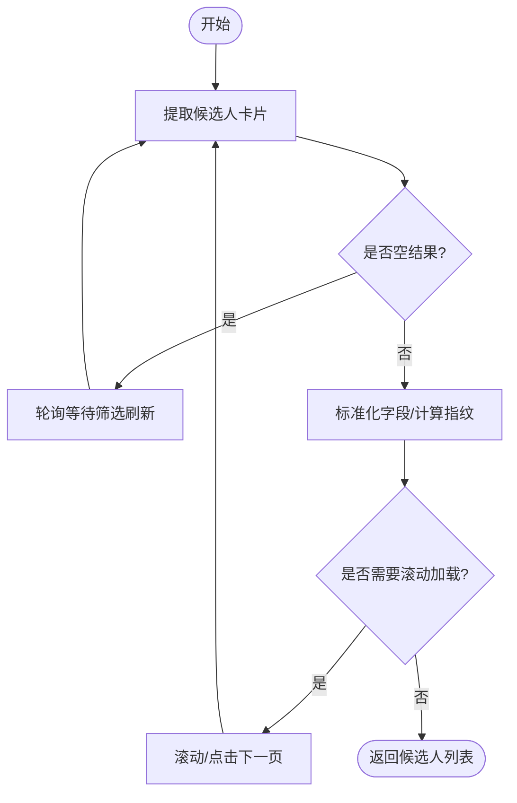
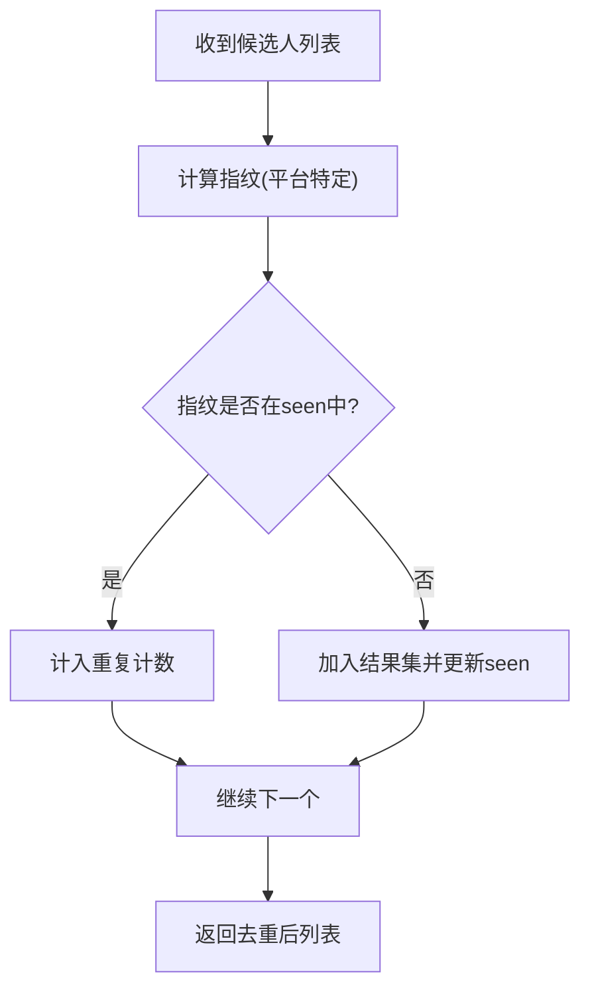
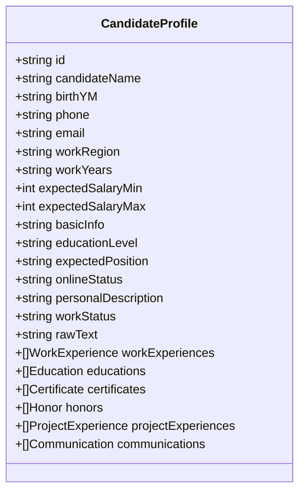
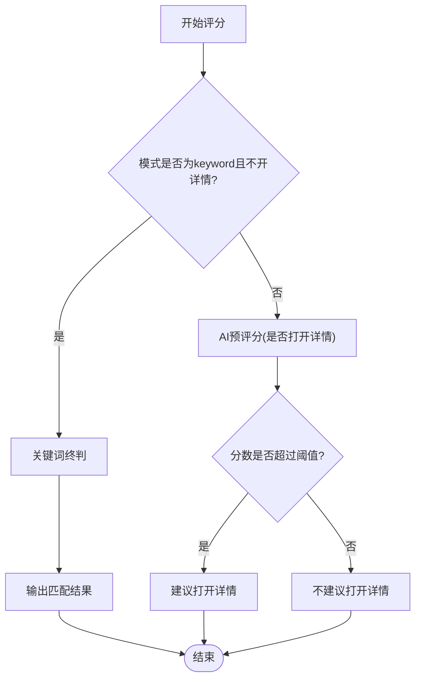
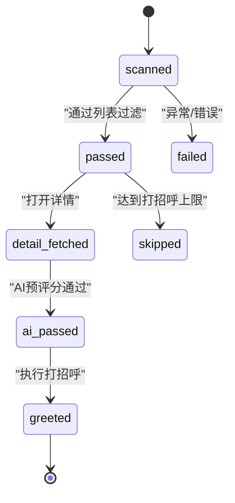
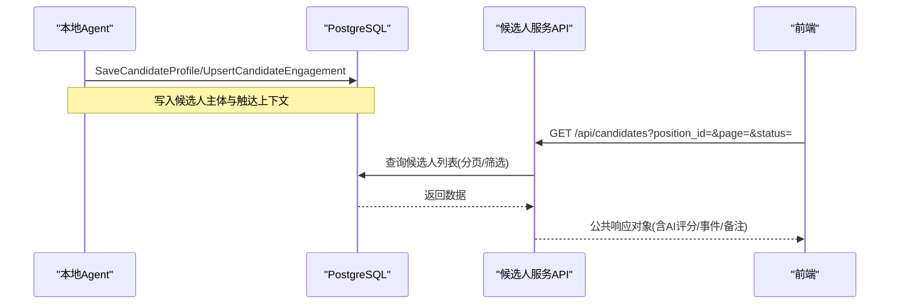
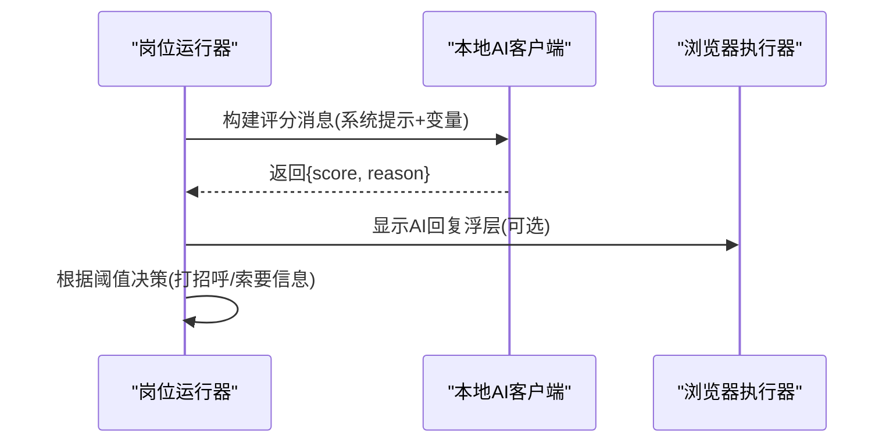
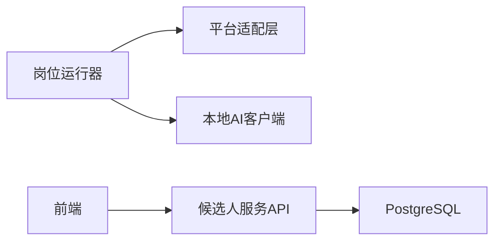

# 候选人处理

<cite>
**本文引用的文件**
- [candidate.go](file://goodhr5/local-agent-go/internal/positionrunner/candidate.go)
- [pipeline.go](file://goodhr5/local-agent-go/internal/positionrunner/pipeline.go)
- [scan.go](file://goodhr5/local-agent-go/internal/positionrunner/scan.go)
- [candidate.go](file://goodhr5/local-agent-go/internal/platforms/boss/candidate.go)
- [candidate.go](file://goodhr5/local-agent-go/internal/platforms/hliepin/candidate.go)
- [candidate-match.js](file://goodhr5/local-agent-go/worker-node/src/candidate-match.js)
- [candidate_service.go](file://goodhr5/cloud/backend/internal/httpapi/candidate_service.go)
- [candidate_store_pg.go](file://goodhr5/cloud/backend/internal/httpapi/candidate_store_pg.go)
- [resume_tracking_store.go](file://goodhr5/cloud/backend/internal/httpapi/resume_tracking_store.go)
- [positions.go](file://goodhr5/local-agent-go/internal/localdb/positions.go)
- [client.go](file://goodhr5/local-agent-go/internal/localai/client.go)
- [candidate-normalize.ts](file://goodhr5/cloud/frontend-next/lib/candidate-normalize.ts)
</cite>

## 目录
1. [简介](#简介)
2. [项目结构](#项目结构)
3. [核心组件](#核心组件)
4. [架构总览](#架构总览)
5. [详细组件分析](#详细组件分析)
6. [依赖关系分析](#依赖关系分析)
7. [性能考虑](#性能考虑)
8. [故障排查指南](#故障排查指南)
9. [结论](#结论)
10. [附录](#附录)

## 简介
本文件面向前程无忧平台（以及同构的多平台）候选人处理流程，系统性说明候选人列表获取、分页加载、去重与缓存策略；候选人信息提取算法（基本信息、工作经历、技能标签等结构化数据）；候选人匹配评分机制（关键词匹配、经验评估、兼容性分析）；候选人状态管理与筛选逻辑（条件过滤与排序）；候选人数据持久化与同步方案；以及与AI系统的集成方式。文档以代码为依据，提供流程图与时序图帮助理解端到端链路。

## 项目结构
系统由本地Agent（负责浏览器自动化、候选人抓取、AI预评分）、云端后端（候选人存储、API、简历进度跟踪）、前端（候选人展示与交互）三部分构成：
- 本地Agent：按岗位运行扫描候选人列表，执行打招呼与信息索要，进行AI预评分与结果落库。
- 云端后端：提供候选人列表查询、详情读取、备注与事件管理，维护候选人主体、触达上下文与简历进度。
- 前端：对候选人数据进行标准化展示，支持筛选、分页与状态可视化。

**图示来源**
- [pipeline.go:49-131](file://goodhr5/local-agent-go/internal/positionrunner/pipeline.go#L49-L131)
- [candidate_service.go:30-79](file://goodhr5/cloud/backend/internal/httpapi/candidate_service.go#L30-L79)
- [candidate_store_pg.go:24-161](file://goodhr5/cloud/backend/internal/httpapi/candidate_store_pg.go#L24-L161)

**章节来源**
- [pipeline.go:49-131](file://goodhr5/local-agent-go/internal/positionrunner/pipeline.go#L49-L131)
- [candidate_service.go:30-79](file://goodhr5/cloud/backend/internal/httpapi/candidate_service.go#L30-L79)
- [candidate_store_pg.go:24-161](file://goodhr5/cloud/backend/internal/httpapi/candidate_store_pg.go#L24-L161)

## 核心组件
- 候选人流水线与并发控制：按页面顺序消费候选人，必要时并行进行AI预评分，限制打招呼上限与超时保护。
- 平台适配层：封装各招聘平台的候选人提取、滚动、可见性保证、指纹去重与筛选文本生成。
- 候选人存储与服务：统一候选人主体、触达上下文与事件记录，提供分页、关键词与状态筛选的API。
- 简历进度跟踪：维护简历“待索要/已索要/已接收/已下载/失败”等阶段，支持并发安全与回退保护。
- 前端标准化：将后端字段映射为统一的候选人展示模型，便于UI渲染与筛选。

**章节来源**
- [candidate.go:21-106](file://goodhr5/local-agent-go/internal/positionrunner/candidate.go#L21-L106)
- [pipeline.go:49-131](file://goodhr5/local-agent-go/internal/positionrunner/pipeline.go#L49-L131)
- [candidate_service.go:30-79](file://goodhr5/cloud/backend/internal/httpapi/candidate_service.go#L30-L79)
- [resume_tracking_store.go:139-162](file://goodhr5/cloud/backend/internal/httpapi/resume_tracking_store.go#L139-L162)
- [candidate-normalize.ts:76-91](file://goodhr5/cloud/frontend-next/lib/candidate-normalize.ts#L76-L91)

## 架构总览
候选人从平台列表页到最终入库与展示的完整链路如下：
- 列表抓取与分页：平台适配层通过Worker接口提取当前可见候选人卡片，支持滚动加载更多。
- 去重与队列构建：基于平台指纹或姓名+年龄生成稳定ID，结合内存seen集合去重，形成待处理队列。
- 预评分与分流：在AI模式下，对候选人进行“是否值得看详情”的预评分，决定是否进入详情页或继续打招呼。
- 打招呼与信息索要：根据岗位配置与AI评分阈值决定是否打招呼及索要联系方式/简历，并记录事件。
- 持久化与同步：候选人主体与触达上下文写入数据库，简历进度独立跟踪，前端通过API分页读取。

**图示来源**
- [candidate.go:13-49](file://goodhr5/local-agent-go/internal/platforms/boss/candidate.go#L13-L49)
- [candidate.go:14-79](file://goodhr5/local-agent-go/internal/platforms/hliepin/candidate.go#L14-L79)
- [pipeline.go:49-131](file://goodhr5/local-agent-go/internal/positionrunner/pipeline.go#L49-L131)
- [candidate_service.go:30-79](file://goodhr5/cloud/backend/internal/httpapi/candidate_service.go#L30-L79)

## 详细组件分析

### 候选人列表获取与分页加载
- 平台适配层通过POST调用Worker接口提取当前可见候选人，支持最大条目数限制。
- 猎聘平台在首次为空时采用轮询等待，确保筛选刷新后的候选人加载完成。
- Boss平台直接提取可见卡片，并在整理阶段计算稳定指纹用于去重。
- 滚动加载：通过滚动或点击下一页推进列表，配合“立即沟通”等按钮判断有效行。

**图示来源**
- [candidate.go:14-79](file://goodhr5/local-agent-go/internal/platforms/hliepin/candidate.go#L14-L79)
- [candidate.go:13-49](file://goodhr5/local-agent-go/internal/platforms/boss/candidate.go#L13-L49)

**章节来源**
- [candidate.go:13-49](file://goodhr5/local-agent-go/internal/platforms/boss/candidate.go#L13-L49)
- [candidate.go:14-79](file://goodhr5/local-agent-go/internal/platforms/hliepin/candidate.go#L14-L79)

### 数据去重与缓存策略
- 去重指纹：Boss使用“姓名+年龄”生成稳定ID；猎聘优先使用平台唯一ID，否则基于姓名、年龄与稳定文本哈希生成。
- 内存去重：使用seen集合过滤重复候选人，统计重复数量并仅保留新增项。
- 前端缓存：前端对候选人数据进行标准化，便于UI复用与减少重复解析。

**图示来源**
- [candidate.go:76-86](file://goodhr5/local-agent-go/internal/platforms/boss/candidate.go#L76-L86)
- [candidate.go:105-119](file://goodhr5/local-agent-go/internal/platforms/hliepin/candidate.go#L105-L119)
- [candidate.go:386-404](file://goodhr5/local-agent-go/internal/positionrunner/candidate.go#L386-L404)

**章节来源**
- [candidate.go:386-404](file://goodhr5/local-agent-go/internal/positionrunner/candidate.go#L386-L404)
- [candidate.go:76-86](file://goodhr5/local-agent-go/internal/platforms/boss/candidate.go#L76-L86)
- [candidate.go:105-119](file://goodhr5/local-agent-go/internal/platforms/hliepin/candidate.go#L105-L119)

### 候选人信息提取算法
- 基本信息：姓名、出生年月、电话、邮箱、工作地区、工作年限、期望薪资区间、教育程度、期望职位、在线状态、个人描述、工作状态。
- 结构化数据：工作经历、教育经历、证书、荣誉、项目经历、同事沟通记录等JSON数组。
- 原始与筛选文本：raw_text与filter_text用于后续关键词匹配与AI评分输入。
- 前端标准化：将后端字段映射为统一模型，包括年龄推导、状态文本等。

**图示来源**
- [candidate_store_pg.go:24-161](file://goodhr5/cloud/backend/internal/httpapi/candidate_store_pg.go#L24-L161)
- [positions.go:382-500](file://goodhr5/local-agent-go/internal/localdb/positions.go#L382-L500)
- [candidate-normalize.ts:76-91](file://goodhr5/cloud/frontend-next/lib/candidate-normalize.ts#L76-L91)

**章节来源**
- [candidate_store_pg.go:24-161](file://goodhr5/cloud/backend/internal/httpapi/candidate_store_pg.go#L24-L161)
- [positions.go:382-500](file://goodhr5/local-agent-go/internal/localdb/positions.go#L382-L500)
- [candidate-normalize.ts:76-91](file://goodhr5/cloud/frontend-next/lib/candidate-normalize.ts#L76-L91)

### 候选人匹配评分机制
- 关键词匹配：在keyword模式且不开详情时，直接在列表阶段进行关键词终判；否则跳过列表阶段终判，交由详情或AI阶段处理。
- 经验评估与兼容性分析：AI根据岗位要求与候选人信息输出分数与原因，支持结构化简历输出以便入库。
- 预评分与阈值决策：AI预评分用于决定“是否打开详情”，打分规则包含宽松/收紧策略，输出JSON格式。
- 文本相似度：前端/Worker侧使用双字符相似度与名称包含判断，辅助定位目标候选人卡片。

**图示来源**
- [candidate.go:416-441](file://goodhr5/local-agent-go/internal/positionrunner/candidate.go#L416-L441)
- [client.go:689-733](file://goodhr5/local-agent-go/internal/localai/client.go#L689-L733)
- [candidate-match.js:26-65](file://goodhr5/local-agent-go/worker-node/src/candidate-match.js#L26-L65)

**章节来源**
- [candidate.go:416-441](file://goodhr5/local-agent-go/internal/positionrunner/candidate.go#L416-L441)
- [client.go:689-733](file://goodhr5/local-agent-go/internal/localai/client.go#L689-L733)
- [candidate-match.js:26-65](file://goodhr5/local-agent-go/worker-node/src/candidate-match.js#L26-L65)

### 候选人状态管理与筛选逻辑
- 状态流转：scanned → passed → detail_fetched → ai_passed → greeted；失败或跳过会记录相应状态与原因。
- 筛选维度：支持按岗位、关键词、状态（detail/greeted/resume_*等）分页查询；未知状态不参与过滤避免误伤。
- 触达上下文：候选人主体与触达上下文分离，便于同一候选人在不同岗位下的独立进度管理。
- 前端展示：公共响应对象包含AI评分、事件流水、备注与简历进度字段。

**图示来源**
- [candidate.go:454-467](file://goodhr5/local-agent-go/internal/positionrunner/candidate.go#L454-L467)
- [candidate_store_pg.go:695-716](file://goodhr5/cloud/backend/internal/httpapi/candidate_store_pg.go#L695-L716)
- [candidate_service.go:245-303](file://goodhr5/cloud/backend/internal/httpapi/candidate_service.go#L245-L303)

**章节来源**
- [candidate.go:454-467](file://goodhr5/local-agent-go/internal/positionrunner/candidate.go#L454-L467)
- [candidate_store_pg.go:695-716](file://goodhr5/cloud/backend/internal/httpapi/candidate_store_pg.go#L695-L716)
- [candidate_service.go:245-303](file://goodhr5/cloud/backend/internal/httpapi/candidate_service.go#L245-L303)

### 候选人数据持久化与同步方案
- 候选人主体：按租户与平台唯一键upsert，覆盖更新字段并保留首次出现时间。
- 触达上下文：按岗位与账号维度记录状态与关键时间点（查看详情、打招呼、索要简历）。
- 简历进度：独立跟踪表，支持并发写入与版本控制，防止迟到报告回退进度。
- 同步API：前端通过分页与状态筛选读取候选人列表与详情，后端组装公共响应对象。

**图示来源**
- [candidate_store_pg.go:24-161](file://goodhr5/cloud/backend/internal/httpapi/candidate_store_pg.go#L24-L161)
- [candidate_store_pg.go:163-200](file://goodhr5/cloud/backend/internal/httpapi/candidate_store_pg.go#L163-L200)
- [candidate_service.go:30-79](file://goodhr5/cloud/backend/internal/httpapi/candidate_service.go#L30-L79)

**章节来源**
- [candidate_store_pg.go:24-161](file://goodhr5/cloud/backend/internal/httpapi/candidate_store_pg.go#L24-L161)
- [candidate_store_pg.go:163-200](file://goodhr5/cloud/backend/internal/httpapi/candidate_store_pg.go#L163-L200)
- [candidate_service.go:30-79](file://goodhr5/cloud/backend/internal/httpapi/candidate_service.go#L30-L79)

### 与AI系统的集成方式
- 消息构建：将稳定的提示词与本次变量（岗位要求、候选人信息）拆分，支持结构化简历输出。
- 预评分：在流水线中启动并发工作池，对候选人进行“是否值得打开详情”的AI预评分，显示浮层反馈。
- 阈值控制：岗位配置中的greet_score_threshold与request_score_threshold控制打招呼与信息索要行为。
- 结果解析：解析AI返回的JSON，提取分数与原因，必要时提取结构化简历字段入库。

**图示来源**
- [pipeline.go:49-131](file://goodhr5/local-agent-go/internal/positionrunner/pipeline.go#L49-L131)
- [client.go:689-733](file://goodhr5/local-agent-go/internal/localai/client.go#L689-L733)
- [candidate.go:147-161](file://goodhr5/local-agent-go/internal/positionrunner/candidate.go#L147-L161)

**章节来源**
- [pipeline.go:49-131](file://goodhr5/local-agent-go/internal/positionrunner/pipeline.go#L49-L131)
- [client.go:689-733](file://goodhr5/local-agent-go/internal/localai/client.go#L689-L733)
- [candidate.go:147-161](file://goodhr5/local-agent-go/internal/positionrunner/candidate.go#L147-L161)

## 依赖关系分析
- 岗位运行器依赖平台适配层进行候选人提取与滚动，依赖本地AI客户端进行预评分。
- 平台适配层依赖Worker接口与平台配置，实现跨平台一致性。
- 云端后端依赖PostgreSQL存储候选人主体与触达上下文，提供REST API供前端查询。
- 前端依赖标准化模型与API，实现候选人列表与详情的展示与交互。

**图示来源**
- [pipeline.go:49-131](file://goodhr5/local-agent-go/internal/positionrunner/pipeline.go#L49-L131)
- [candidate_service.go:30-79](file://goodhr5/cloud/backend/internal/httpapi/candidate_service.go#L30-L79)
- [candidate_store_pg.go:24-161](file://goodhr5/cloud/backend/internal/httpapi/candidate_store_pg.go#L24-L161)

**章节来源**
- [pipeline.go:49-131](file://goodhr5/local-agent-go/internal/positionrunner/pipeline.go#L49-L131)
- [candidate_service.go:30-79](file://goodhr5/cloud/backend/internal/httpapi/candidate_service.go#L30-L79)
- [candidate_store_pg.go:24-161](file://goodhr5/cloud/backend/internal/httpapi/candidate_store_pg.go#L24-L161)

## 性能考虑
- 并发控制：AI预评分使用固定并发池，避免资源争用；单个操作设置超时与异常捕获。
- 分页与筛选：后端支持分页与多条件筛选，减少前端渲染压力；未知状态不参与过滤避免误伤。
- 去重优化：内存seen集合快速去重，平台指纹稳定减少重复入库。
- 滚动加载：按需滚动与轮询等待，提升列表加载效率与稳定性。

[本节为通用指导，不直接分析具体文件]

## 故障排查指南
- 列表为空：检查平台选择器与轮询等待逻辑，确认筛选刷新后的候选人加载完成。
- 去重异常：核对平台指纹生成规则，确保姓名与年龄字段可用。
- AI评分失败：检查提示词与变量注入，确认结构化简历开关与输出解析正确。
- 简历进度回退：确认并发写入的版本控制与迟到报告保护逻辑生效。

**章节来源**
- [candidate.go:14-79](file://goodhr5/local-agent-go/internal/platforms/hliepin/candidate.go#L14-L79)
- [candidate.go:386-404](file://goodhr5/local-agent-go/internal/positionrunner/candidate.go#L386-L404)
- [client.go:689-733](file://goodhr5/local-agent-go/internal/localai/client.go#L689-L733)
- [resume_tracking_store.go:139-162](file://goodhr5/cloud/backend/internal/httpapi/resume_tracking_store.go#L139-L162)

## 结论
本系统通过平台适配层、岗位运行器与云端存储的协同，实现了候选人列表的高效获取、去重与结构化解析；借助AI预评分与阈值控制，提升了匹配精度与运营效率；完善的简历进度跟踪与前端标准化展示，保障了用户体验与数据一致性。未来可进一步优化并发策略与AI提示词模板，提升整体吞吐与准确率。

[本节为总结，不直接分析具体文件]

## 附录
- 关键API路径：/api/candidates（列表/详情/备注），/api/v1/page/find-elements（候选人提取），/api/v1/page/scroll-or-click-next（滚动/翻页）。
- 状态枚举：detail、greeted、resume_pending、resume_requested、resume_received、resume_downloaded、resume_failed。
- 字段规范：候选人主体字段与触达上下文字段见存储实现；前端标准化字段见normalize函数。

[本节为补充信息，不直接分析具体文件]