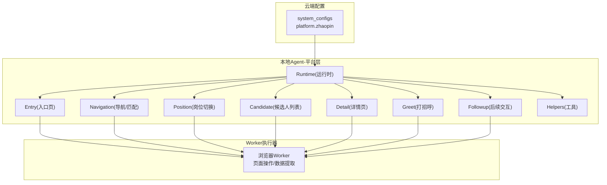
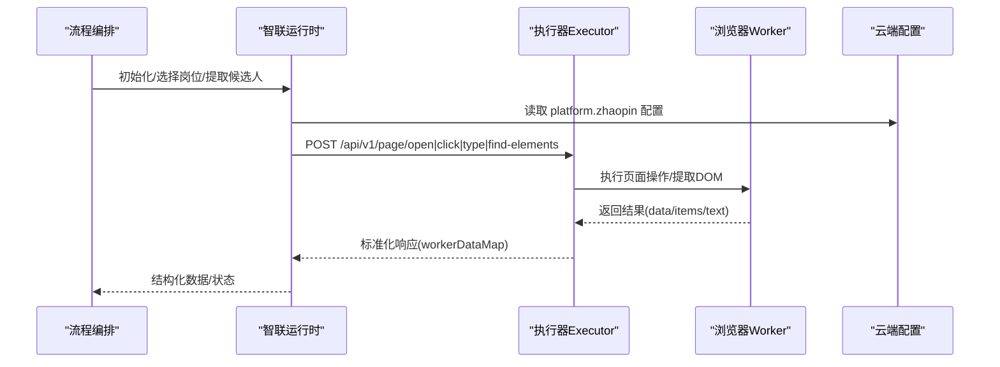
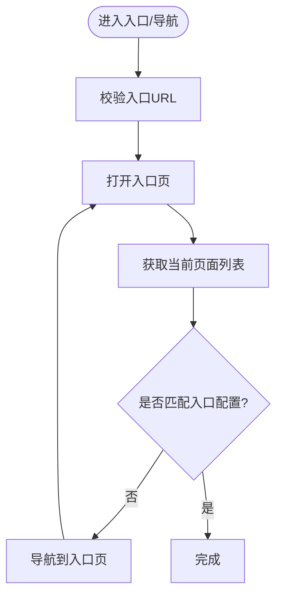
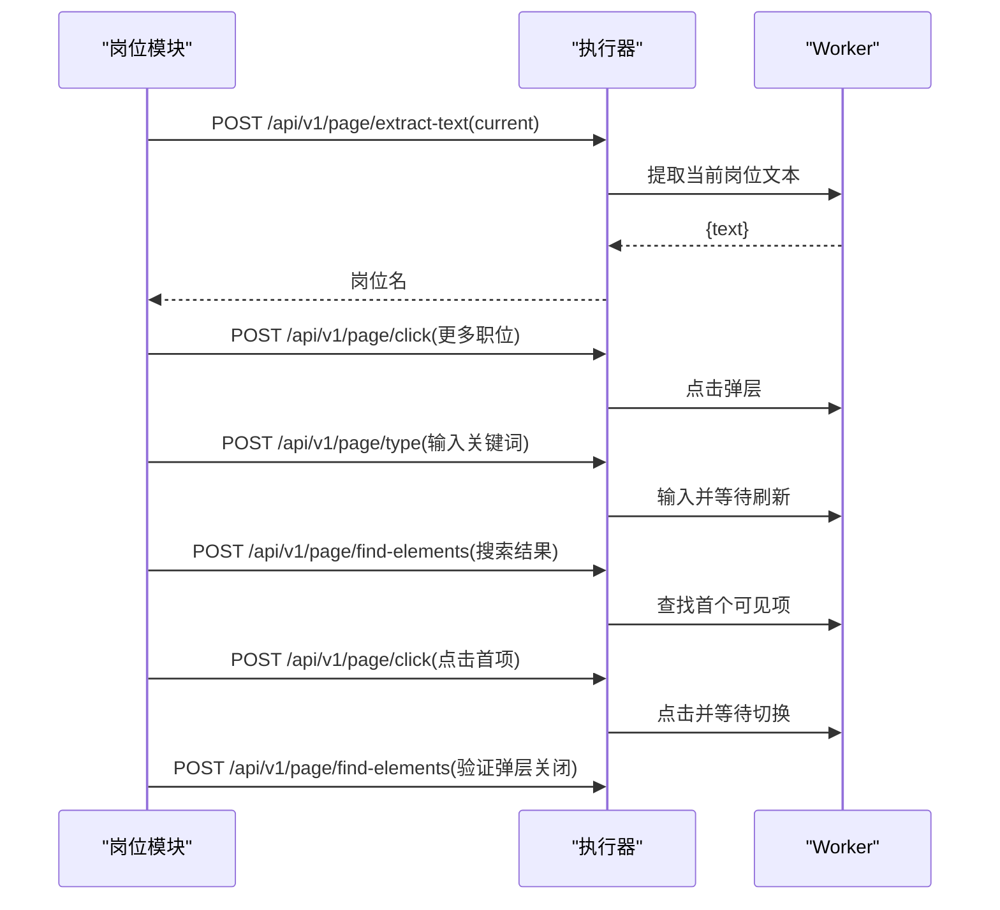
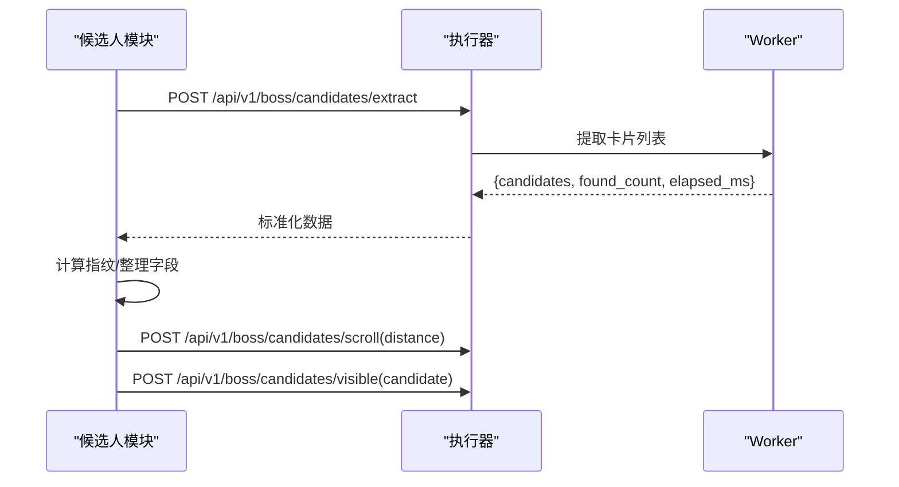
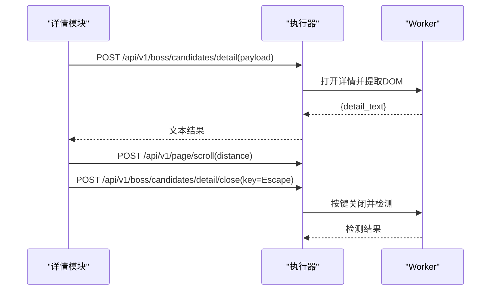
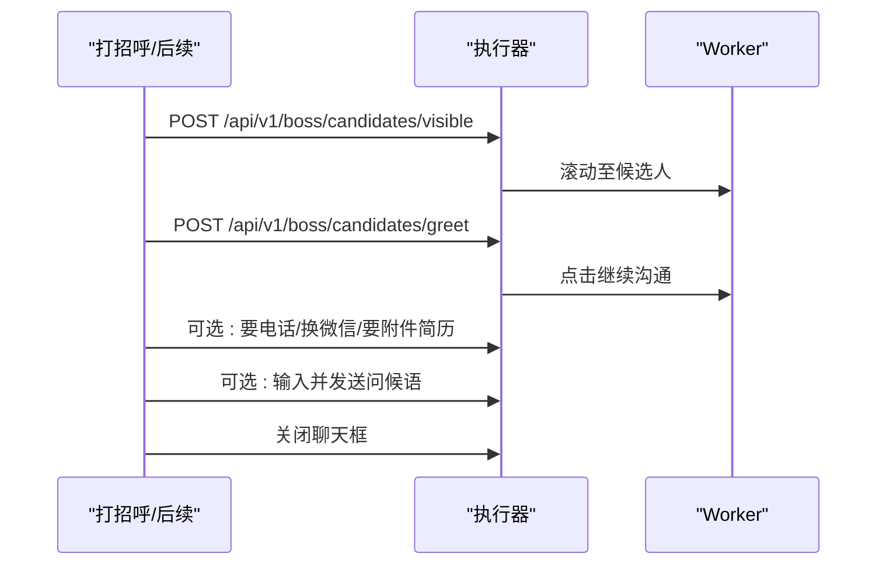
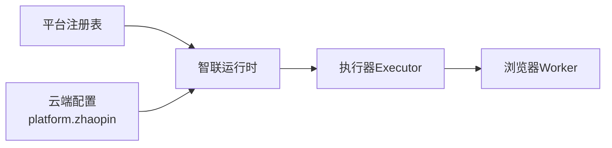

# 前程无忧适配器

<cite>
**本文引用的文件**
- [runtime.go](file://goodhr5/local-agent-go/internal/platforms/zhaopin/runtime.go)
- [entry.go](file://goodhr5/local-agent-go/internal/platforms/zhaopin/entry.go)
- [navigation.go](file://goodhr5/local-agent-go/internal/platforms/zhaopin/navigation.go)
- [position.go](file://goodhr5/local-agent-go/internal/platforms/zhaopin/position.go)
- [candidate.go](file://goodhr5/local-agent-go/internal/platforms/zhaopin/candidate.go)
- [detail.go](file://goodhr5/local-agent-go/internal/platforms/zhaopin/detail.go)
- [greet.go](file://goodhr5/local-agent-go/internal/platforms/zhaopin/greet.go)
- [followup.go](file://goodhr5/local-agent-go/internal/platforms/zhaopin/followup.go)
- [helpers.go](file://goodhr5/local-agent-go/internal/platforms/zhaopin/helpers.go)
- [registry.go](file://goodhr5/local-agent-go-new/internal/platform/registry.go)
- [0052_liepin_zhaopin_dom_platforms.sql](file://goodhr5/cloud/backend/db/migrations/0052_liepin_zhaopin_dom_platforms.sql)
- [0059_refresh_liepin_zhaopin_platform_configs.sql](file://goodhr5/cloud/backend/db/migrations/0059_refresh_liepin_zhaopin_platform_configs.sql)
</cite>

## 目录
1. [简介](#简介)
2. [项目结构](#项目结构)
3. [核心组件](#核心组件)
4. [架构总览](#架构总览)
5. [详细组件分析](#详细组件分析)
6. [依赖关系分析](#依赖关系分析)
7. [性能与稳定性](#性能与稳定性)
8. [故障排查指南](#故障排查指南)
9. [结论](#结论)
10. [附录：配置参数详解](#附录：配置参数详解)

## 简介
本文件面向“前程无忧（智联招聘）平台适配器”，系统性说明其在 GoodHR5 本地 Agent 中的职责、页面架构理解、元素定位策略、用户行为模拟方法，以及职位搜索、候选人筛选、简历详情获取、自动打招呼与索要信息等功能的技术实现。文档同时覆盖平台特殊处理逻辑、页面跳转处理、数据提取策略、配置参数、稳定性保障、调试手段，以及与系统其他组件的集成和数据流转过程。

## 项目结构
智联招聘适配器的代码位于本地 Agent 的 platform 层，按能力拆分为入口、导航、岗位、候选人、详情、打招呼、后续交互等模块，并通过统一的运行时接口对外暴露。云端通过数据库迁移注入平台选择器配置，本地运行时根据配置驱动 Worker 完成页面操作与数据提取。

图表来源
- [runtime.go:1-69](file://goodhr5/local-agent-go/internal/platforms/zhaopin/runtime.go#L1-L69)
- [entry.go:1-44](file://goodhr5/local-agent-go/internal/platforms/zhaopin/entry.go#L1-L44)
- [navigation.go:1-162](file://goodhr5/local-agent-go/internal/platforms/zhaopin/navigation.go#L1-L162)
- [position.go:1-103](file://goodhr5/local-agent-go/internal/platforms/zhaopin/position.go#L1-L103)
- [candidate.go:1-86](file://goodhr5/local-agent-go/internal/platforms/zhaopin/candidate.go#L1-L86)
- [detail.go:1-103](file://goodhr5/local-agent-go/internal/platforms/zhaopin/detail.go#L1-L103)
- [greet.go:1-23](file://goodhr5/local-agent-go/internal/platforms/zhaopin/greet.go#L1-L23)
- [followup.go:1-168](file://goodhr5/local-agent-go/internal/platforms/zhaopin/followup.go#L1-L168)
- [helpers.go:1-207](file://goodhr5/local-agent-go/internal/platforms/zhaopin/helpers.go#L1-L207)
- [0059_refresh_liepin_zhaopin_platform_configs.sql:127-181](file://goodhr5/cloud/backend/db/migrations/0059_refresh_liepin_zhaopin_platform_configs.sql#L127-L181)

章节来源
- [runtime.go:1-69](file://goodhr5/local-agent-go/internal/platforms/zhaopin/runtime.go#L1-L69)
- [entry.go:1-44](file://goodhr5/local-agent-go/internal/platforms/zhaopin/entry.go#L1-L44)
- [navigation.go:1-162](file://goodhr5/local-agent-go/internal/platforms/zhaopin/navigation.go#L1-L162)
- [position.go:1-103](file://goodhr5/local-agent-go/internal/platforms/zhaopin/position.go#L1-L103)
- [candidate.go:1-86](file://goodhr5/local-agent-go/internal/platforms/zhaopin/candidate.go#L1-L86)
- [detail.go:1-103](file://goodhr5/local-agent-go/internal/platforms/zhaopin/detail.go#L1-L103)
- [greet.go:1-23](file://goodhr5/local-agent-go/internal/platforms/zhaopin/greet.go#L1-L23)
- [followup.go:1-168](file://goodhr5/local-agent-go/internal/platforms/zhaopin/followup.go#L1-L168)
- [helpers.go:1-207](file://goodhr5/local-agent-go/internal/platforms/zhaopin/helpers.go#L1-L207)
- [0059_refresh_liepin_zhaopin_platform_configs.sql:127-181](file://goodhr5/cloud/backend/db/migrations/0059_refresh_liepin_zhaopin_platform_configs.sql#L127-L181)

## 核心组件
- 运行时 Runtime：提供平台标识、是否直接选择岗位、候选人可见性负载构造、年龄解析、指纹生成等能力。
- 入口 Entry：打开入口页、判断当前是否在入口页。
- 导航 Navigation：入口页匹配、岗位名称规范化、搜索关键词生成、列表项元素合并。
- 岗位 Position：读取当前岗位名、通过弹层搜索并切换到目标岗位。
- 候选人 Candidate：提取可见候选人、滚动列表、确保候选卡片可见、去重指纹。
- 详情 Detail：仅支持 DOM 模式详情提取、滚动详情、关闭详情弹窗。
- 打招呼 Greet：将候选人滚动至可视区域后执行打招呼。
- 后续 Followup：在聊天框中索要电话/微信/附件简历、发送首次问候语、关闭聊天框。
- 工具 Helpers：通用 map/list 转换、Worker 响应解析、元素定位载荷转换、日志格式化等。

章节来源
- [runtime.go:1-69](file://goodhr5/local-agent-go/internal/platforms/zhaopin/runtime.go#L1-L69)
- [entry.go:1-44](file://goodhr5/local-agent-go/internal/platforms/zhaopin/entry.go#L1-L44)
- [navigation.go:1-162](file://goodhr5/local-agent-go/internal/platforms/zhaopin/navigation.go#L1-L162)
- [position.go:1-103](file://goodhr5/local-agent-go/internal/platforms/zhaopin/position.go#L1-L103)
- [candidate.go:1-86](file://goodhr5/local-agent-go/internal/platforms/zhaopin/candidate.go#L1-L86)
- [detail.go:1-103](file://goodhr5/local-agent-go/internal/platforms/zhaopin/detail.go#L1-L103)
- [greet.go:1-23](file://goodhr5/local-agent-go/internal/platforms/zhaopin/greet.go#L1-L23)
- [followup.go:1-168](file://goodhr5/local-agent-go/internal/platforms/zhaopin/followup.go#L1-L168)
- [helpers.go:1-207](file://goodhr5/local-agent-go/internal/platforms/zhaopin/helpers.go#L1-L207)

## 架构总览
智联招聘适配器采用“配置驱动 + 执行器调用”的模式：
- 云端通过 system_configs 维护 platform.zhaopin 的选择器与行为配置。
- 本地运行时根据配置构建 Worker 请求，统一通过 /api/v1/page/* 与 /api/v1/boss/* 接口驱动浏览器。
- 各能力模块封装具体页面动作与数据提取，向上层流程编排提供稳定接口。

图表来源
- [entry.go:12-43](file://goodhr5/local-agent-go/internal/platforms/zhaopin/entry.go#L12-L43)
- [position.go:31-102](file://goodhr5/local-agent-go/internal/platforms/zhaopin/position.go#L31-L102)
- [candidate.go:13-86](file://goodhr5/local-agent-go/internal/platforms/zhaopin/candidate.go#L13-L86)
- [detail.go:13-103](file://goodhr5/local-agent-go/internal/platforms/zhaopin/detail.go#L13-L103)
- [helpers.go:75-99](file://goodhr5/local-agent-go/internal/platforms/zhaopin/helpers.go#L75-L99)
- [0059_refresh_liepin_zhaopin_platform_configs.sql:127-181](file://goodhr5/cloud/backend/db/migrations/0059_refresh_liepin_zhaopin_platform_configs.sql#L127-L181)

## 详细组件分析

### 入口与导航
- 入口页打开与校验：校验入口 URL，打开页面；通过页面列表与入口配置进行匹配，判断是否处于入口页。
- 页面匹配策略：支持 exact/prefix/contains 三种匹配方式，兼容不同域名与路径。
- 岗位名称规范化：去除括号注释、清理多余空白，提升搜索鲁棒性。
- 列表项元素合并：将容器与项的定位父类与目标类合并，增强定位稳定性。

图表来源
- [entry.go:12-43](file://goodhr5/local-agent-go/internal/platforms/zhaopin/entry.go#L12-L43)
- [navigation.go:12-71](file://goodhr5/local-agent-go/internal/platforms/zhaopin/navigation.go#L12-L71)
- [navigation.go:73-122](file://goodhr5/local-agent-go/internal/platforms/zhaopin/navigation.go#L73-L122)

章节来源
- [entry.go:12-43](file://goodhr5/local-agent-go/internal/platforms/zhaopin/entry.go#L12-L43)
- [navigation.go:12-122](file://goodhr5/local-agent-go/internal/platforms/zhaopin/navigation.go#L12-L122)

### 岗位切换
- 读取当前岗位：使用配置的 current 选择器提取文本，为空则报错。
- 切换岗位流程：点击“更多职位”弹层 -> 输入精简关键词 -> 等待刷新 -> 查找第一个可见结果 -> 点击并确认弹层关闭。
- 失败保护：每一步均有超时与错误包装，便于上层重试或告警。

图表来源
- [position.go:11-102](file://goodhr5/local-agent-go/internal/platforms/zhaopin/position.go#L11-L102)

章节来源
- [position.go:11-102](file://goodhr5/local-agent-go/internal/platforms/zhaopin/position.go#L11-L102)

### 候选人列表与筛选
- 提取可见候选人：调用统一提取接口，附带平台配置与最大数量；记录 find/convert 耗时。
- 滚动列表：按距离滚动以加载更多卡片。
- 确保可见：构造可见性负载（含匹配文本、卡片索引、滚动尝试次数等），保证后续操作可定位。
- 去重指纹：基于姓名与年龄生成唯一 ID，避免重复处理。

图表来源
- [candidate.go:13-86](file://goodhr5/local-agent-go/internal/platforms/zhaopin/candidate.go#L13-L86)
- [runtime.go:24-48](file://goodhr5/local-agent-go/internal/platforms/zhaopin/runtime.go#L24-L48)

章节来源
- [candidate.go:13-86](file://goodhr5/local-agent-go/internal/platforms/zhaopin/candidate.go#L13-L86)
- [runtime.go:24-48](file://goodhr5/local-agent-go/internal/platforms/zhaopin/runtime.go#L24-L48)

### 详情获取与关闭
- 详情模式：仅支持 DOM 模式，拒绝 OCR/AI 模式。
- 详情提取：构造可见性负载，设置截图关闭、滚动尝试次数、视口边距、就绪超时，提取 DOM 文本。
- 滚动详情：在 AI 分析前滚动一次，确保内容完整。
- 关闭详情：优先使用 Escape 键，二次检测未关闭时再次按键，直至确认关闭。

图表来源
- [detail.go:13-103](file://goodhr5/local-agent-go/internal/platforms/zhaopin/detail.go#L13-L103)

章节来源
- [detail.go:13-103](file://goodhr5/local-agent-go/internal/platforms/zhaopin/detail.go#L13-L103)

### 打招呼与后续交互
- 打招呼：先确保候选人可见，再调用打招呼接口。
- 后续交互：打开聊天框，按配置索要电话/微信/附件简历，发送首次问候语，最后关闭聊天框。
- 稳定性：对弹窗出现与否做条件判断，缺失则跳过；异常时兜底关闭聊天框。

图表来源
- [greet.go:11-23](file://goodhr5/local-agent-go/internal/platforms/zhaopin/greet.go#L11-L23)
- [followup.go:30-168](file://goodhr5/local-agent-go/internal/platforms/zhaopin/followup.go#L30-L168)

章节来源
- [greet.go:11-23](file://goodhr5/local-agent-go/internal/platforms/zhaopin/greet.go#L11-L23)
- [followup.go:30-168](file://goodhr5/local-agent-go/internal/platforms/zhaopin/followup.go#L30-L168)

### 工具与通用逻辑
- 元素定位载荷转换：将云端配置中的 targetClasses/parentClasses 等转换为 Worker 统一协议。
- 响应解析：统一从 data 字段取值，兼容旧格式。
- 日志与耗时：格式化毫秒耗时，输出关键阶段耗时，便于定位瓶颈。
- 文本与指纹：规范化姓名、年龄、岗位名称，生成稳定指纹。

章节来源
- [helpers.go:9-207](file://goodhr5/local-agent-go/internal/platforms/zhaopin/helpers.go#L9-L207)
- [runtime.go:43-69](file://goodhr5/local-agent-go/internal/platforms/zhaopin/runtime.go#L43-L69)

## 依赖关系分析
- 平台注册：新 Agent 通过 registry 按平台编号返回对应运行时，zhaopin 已注册。
- 配置来源：云端 system_configs 中 platform.zhaopin 提供 auth/pages、card/actions/detail/position/behavior 等选择器与行为开关。
- 执行器契约：所有页面操作均通过 Executor 的 Post/Delay 等方法与 Worker 通信，屏蔽底层浏览器差异。

图表来源
- [registry.go:15-29](file://goodhr5/local-agent-go-new/internal/platform/registry.go#L15-L29)
- [0059_refresh_liepin_zhaopin_platform_configs.sql:127-181](file://goodhr5/cloud/backend/db/migrations/0059_refresh_liepin_zhaopin_platform_configs.sql#L127-L181)

章节来源
- [registry.go:15-29](file://goodhr5/local-agent-go-new/internal/platform/registry.go#L15-L29)
- [0059_refresh_liepin_zhaopin_platform_configs.sql:127-181](file://goodhr5/cloud/backend/db/migrations/0059_refresh_liepin_zhaopin_platform_configs.sql#L127-L181)

## 性能与稳定性
- 提取与转换耗时统计：候选人提取阶段分别记录 find_elapsed_ms 与 convert_elapsed_ms，便于定位瓶颈。
- 滚动与重试：候选人可见性控制包含滚动尝试次数与视口边距，减少误判。
- 超时与延迟：关键步骤设置合理超时与等待时间，降低抖动影响。
- 降级与兜底：如手机号索要弹层不存在则跳过；详情关闭失败会二次尝试。
- 仅 DOM 详情：限制为 DOM 模式，避免 OCR/AI 带来的不确定性与额外开销。

[本节为通用指导，不直接分析具体文件]

## 故障排查指南
- 入口页未命中：检查入口 URL 与 match 类型（exact/prefix/contains），确认 pages 配置正确。
- 岗位切换失败：核对 position.current/switchBtn/list/item/itemText 选择器；确认搜索关键词经过去括号与空白处理。
- 候选人提取为空：检查 card.item/target_classes、fields 选择器；查看 worker 返回的 found_count 与 items。
- 详情无法关闭：确认 detail.closeBtn 选择器；必要时手动触发 Escape 并二次检测。
- 聊天框操作失败：核对 im-session-detail-footer 相关选择器；若弹层未出现，流程应跳过并继续。

章节来源
- [entry.go:27-43](file://goodhr5/local-agent-go/internal/platforms/zhaopin/entry.go#L27-L43)
- [position.go:31-102](file://goodhr5/local-agent-go/internal/platforms/zhaopin/position.go#L31-L102)
- [candidate.go:13-86](file://goodhr5/local-agent-go/internal/platforms/zhaopin/candidate.go#L13-L86)
- [detail.go:57-103](file://goodhr5/local-agent-go/internal/platforms/zhaopin/detail.go#L57-L103)
- [followup.go:104-168](file://goodhr5/local-agent-go/internal/platforms/zhaopin/followup.go#L104-L168)

## 结论
智联招聘适配器通过清晰的模块化设计与配置驱动机制，实现了稳定的页面操作与数据提取。其核心优势在于：
- 明确的职责划分与稳定的执行器契约；
- 针对平台特性的选择器与行为配置；
- 完善的日志与耗时统计，便于问题定位；
- 多层次的容错与兜底策略，提高自动化成功率。

[本节为总结性内容，不直接分析具体文件]

## 附录：配置参数详解
以下配置来自云端 system_configs 的 platform.zhaopin，用于驱动页面定位与行为：

- auth.pages：入口页与登录态判定
  - url：推荐页地址（支持 rd6.zhaopin.com 与 zhaopin.com）
  - entry：标记默认入口
  - match：匹配方式（contains）
  - title：页面标题
  - login_url_prefixes：登录页前缀
  - logged_in_url_contains：已登录特征子串

- card：候选人卡片定位
  - item.parent_classes：卡片父级容器类
  - item.target_classes：卡片目标类
  - fields：字段定位（name/basic_info/education/description）
  - scroll：滚动容器类

- actions：按钮定位
  - greetBtn：打招呼按钮
  - continueBtn：继续沟通按钮

- detail：详情弹窗
  - openTarget：打开详情的目标元素
  - content：详情内容区域

- position：岗位切换
  - current：当前岗位显示元素
  - switchBtn：切换按钮
  - list：下拉列表容器
  - item：列表项
  - itemText：列表项文本

- behavior：行为开关
  - needsDetailPage：是否需要详情页（true）
  - supportsPaging：是否支持分页（false）

章节来源
- [0052_liepin_zhaopin_dom_platforms.sql:100-181](file://goodhr5/cloud/backend/db/migrations/0052_liepin_zhaopin_dom_platforms.sql#L100-L181)
- [0059_refresh_liepin_zhaopin_platform_configs.sql:127-181](file://goodhr5/cloud/backend/db/migrations/0059_refresh_liepin_zhaopin_platform_configs.sql#L127-L181)