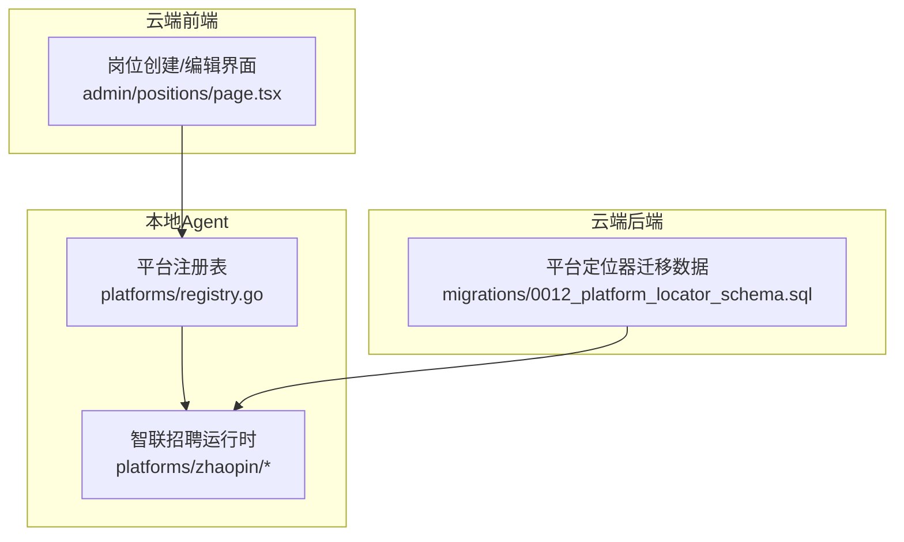
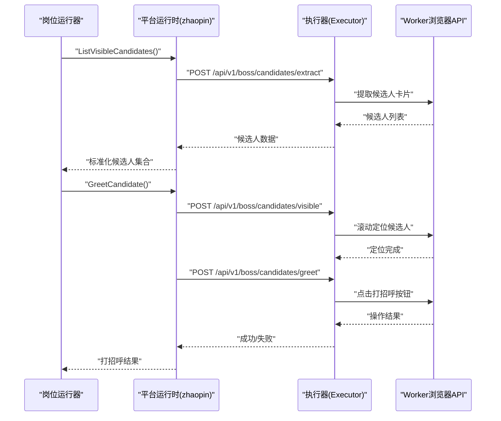
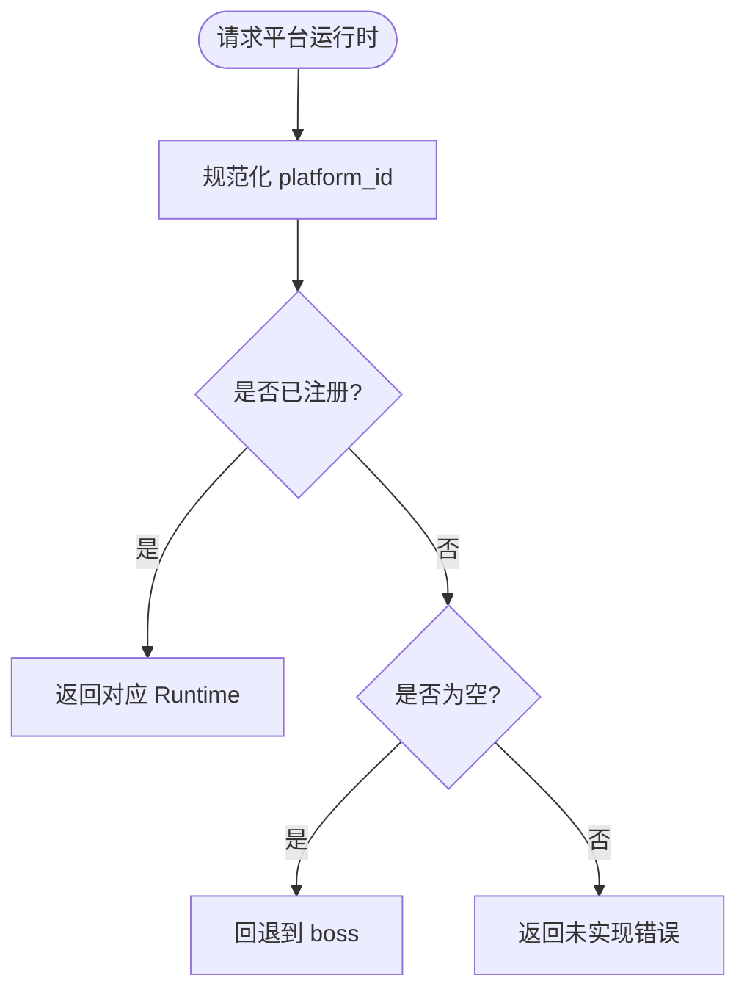
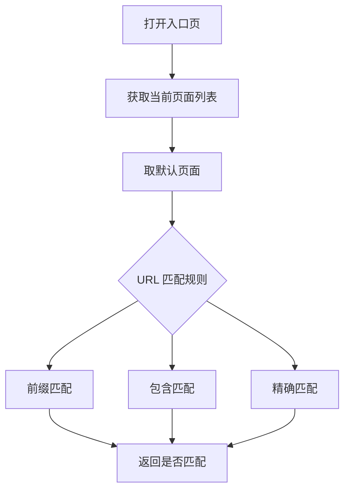
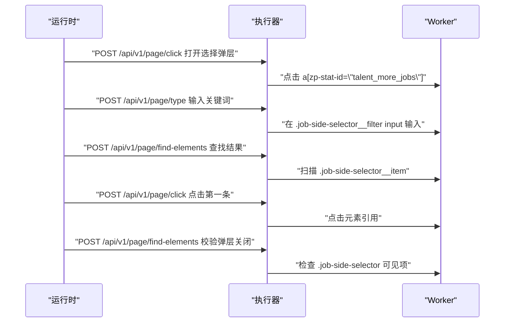
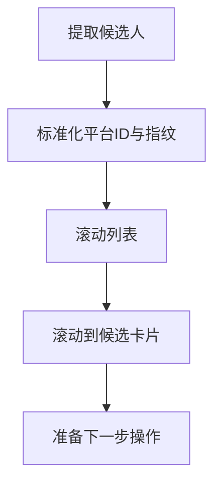
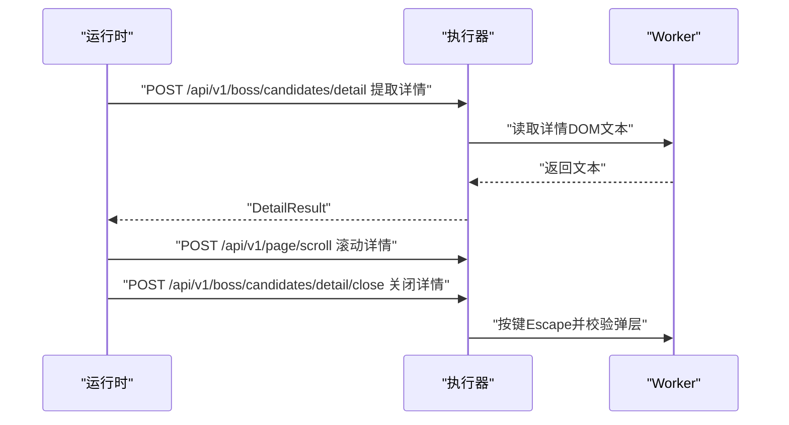
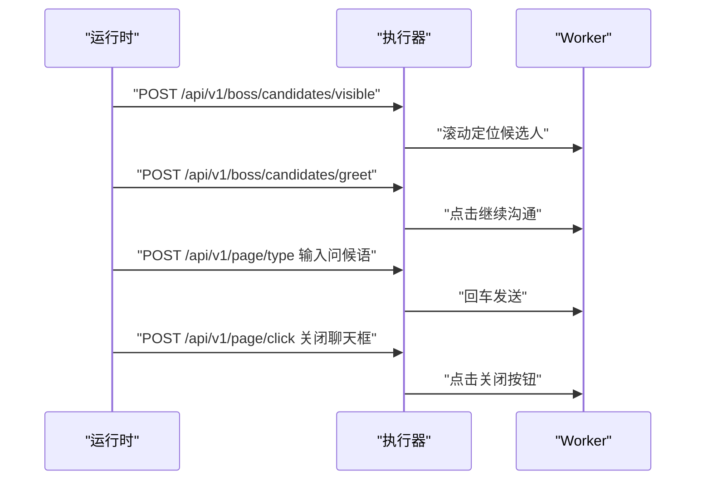
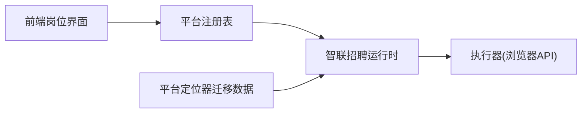

# 前程无忧适配器

<cite>
**本文引用的文件**   
- [local-agent-go/internal/platforms/registry.go](file://goodhr5/local-agent-go/internal/platforms/registry.go)
- [local-agent-go/internal/platforms/zhaopin/entry.go](file://goodhr5/local-agent-go/internal/platforms/zhaopin/entry.go)
- [local-agent-go/internal/platforms/zhaopin/runtime.go](file://goodhr5/local-agent-go/internal/platforms/zhaopin/runtime.go)
- [local-agent-go/internal/platforms/zhaopin/navigation.go](file://goodhr5/local-agent-go/internal/platforms/zhaopin/navigation.go)
- [local-agent-go/internal/platforms/zhaopin/position.go](file://goodhr5/local-agent-go/internal/platforms/zhaopin/position.go)
- [local-agent-go/internal/platforms/zhaopin/candidate.go](file://goodhr5/local-agent-go/internal/platforms/zhaopin/candidate.go)
- [local-agent-go/internal/platforms/zhaopin/detail.go](file://goodhr5/local-agent-go/internal/platforms/zhaopin/detail.go)
- [local-agent-go/internal/platforms/zhaopin/greet.go](file://goodhr5/local-agent-go/internal/platforms/zhaopin/greet.go)
- [local-agent-go/internal/platforms/zhaopin/followup.go](file://goodhr5/local-agent-go/internal/platforms/zhaopin/followup.go)
- [cloud/backend/db/migrations/0012_platform_locator_schema.sql](file://goodhr5/cloud/backend/db/migrations/0012_platform_locator_schema.sql)
- [cloud/frontend-next/app/admin/positions/page.tsx](file://goodhr5/cloud/frontend-next/app/admin/positions/page.tsx)
</cite>

## 目录
1. [引言](#引言)
2. [项目结构](#项目结构)
3. [核心组件](#核心组件)
4. [架构总览](#架构总览)
5. [详细组件分析](#详细组件分析)
6. [依赖关系分析](#依赖关系分析)
7. [性能与稳定性](#性能与稳定性)
8. [配置参数详解](#配置参数详解)
9. [调试与排障指南](#调试与排障指南)
10. [结论](#结论)

## 引言
本文件聚焦“前程无忧平台适配器”的技术文档。需要特别说明的是：当前仓库中已实现的本地运行时为“智联招聘（zhaopin）”，并未出现“前程无忧（51job）”的独立实现。因此，本文在严格遵循代码事实的前提下，给出以下说明：
- 若目标平台确为“前程无忧”，当前仓库未提供对应适配器；需新增平台实现并注册到平台运行时。
- 若实际目标是“智联招聘”，则可直接复用现有 zhaopin 适配器的全部能力，包括岗位切换、候选人提取、详情读取、自动打招呼与后续信息索要等。

为避免误解，下文将同时覆盖：
- 如何理解现有“智联招聘”适配器的实现与集成方式；
- 如需支持“前程无忧”，应如何基于现有模式扩展新平台。

## 项目结构
本地 Agent 的平台运行时采用“按平台 ID 分发”的结构：
- 平台注册表集中管理各平台的 Runtime 实例；
- 每个平台拥有独立的目录，包含入口页、导航、岗位、候选人、详情、打招呼、跟进等职责文件；
- 云端前端负责选择平台、打开平台页面、展示任务状态与配置项。

图示来源
- [local-agent-go/internal/platforms/registry.go:15-20](file://goodhr5/local-agent-go/internal/platforms/registry.go#L15-L20)
- [cloud/backend/db/migrations/0012_platform_locator_schema.sql:48-88](file://goodhr5/cloud/backend/db/migrations/0012_platform_locator_schema.sql#L48-L88)
- [cloud/frontend-next/app/admin/positions/page.tsx:1339-1354](file://goodhr5/cloud/frontend-next/app/admin/positions/page.tsx#L1339-L1354)

章节来源
- [local-agent-go/internal/platforms/registry.go:1-35](file://goodhr5/local-agent-go/internal/platforms/registry.go#L1-L35)
- [cloud/backend/db/migrations/0012_platform_locator_schema.sql:48-88](file://goodhr5/cloud/backend/db/migrations/0012_platform_locator_schema.sql#L48-L88)
- [cloud/frontend-next/app/admin/positions/page.tsx:1339-1354](file://goodhr5/cloud/frontend-next/app/admin/positions/page.tsx#L1339-L1354)

## 核心组件
- 平台注册表：根据 platform_id 返回对应 Runtime，默认回退到 boss，未实现时返回错误。
- 智联招聘运行时：
  - 入口页打开与校验；
  - 岗位名称读取与岗位切换；
  - 候选人列表提取、滚动、可见性保证；
  - 详情页 DOM 文本提取与关闭；
  - 打招呼与信息索要（电话、微信、附件简历）。

章节来源
- [local-agent-go/internal/platforms/registry.go:22-34](file://goodhr5/local-agent-go/internal/platforms/registry.go#L22-L34)
- [local-agent-go/internal/platforms/zhaopin/runtime.go:11-22](file://goodhr5/local-agent-go/internal/platforms/zhaopin/runtime.go#L11-L22)
- [local-agent-go/internal/platforms/zhaopin/entry.go:12-43](file://goodhr5/local-agent-go/internal/platforms/zhaopin/entry.go#L12-L43)
- [local-agent-go/internal/platforms/zhaopin/position.go:11-102](file://goodhr5/local-agent-go/internal/platforms/zhaopin/position.go#L11-L102)
- [local-agent-go/internal/platforms/zhaopin/candidate.go:13-85](file://goodhr5/local-agent-go/internal/platforms/zhaopin/candidate.go#L13-L85)
- [local-agent-go/internal/platforms/zhaopin/detail.go:13-102](file://goodhr5/local-agent-go/internal/platforms/zhaopin/detail.go#L13-L102)
- [local-agent-go/internal/platforms/zhaopin/greet.go:11-22](file://goodhr5/local-agent-go/internal/platforms/zhaopin/greet.go#L11-L22)
- [local-agent-go/internal/platforms/zhaopin/followup.go:25-167](file://goodhr5/local-agent-go/internal/platforms/zhaopin/followup.go#L25-L167)

## 架构总览
本地 Agent 通过 Executor 调用 Worker 提供的浏览器操作 API，平台运行时仅负责业务编排与平台差异处理。

图示来源
- [local-agent-go/internal/platforms/zhaopin/candidate.go:13-49](file://goodhr5/local-agent-go/internal/platforms/zhaopin/candidate.go#L13-L49)
- [local-agent-go/internal/platforms/zhaopin/greet.go:11-22](file://goodhr5/local-agent-go/internal/platforms/zhaopin/greet.go#L11-L22)

## 详细组件分析

### 平台注册与运行时选择
- 注册表维护平台 ID 到 Runtime 的映射；
- 当 platform_id 为空时默认使用 boss；
- 未实现的平台会返回错误，便于前端提示“暂未开放”。

图示来源
- [local-agent-go/internal/platforms/registry.go:22-34](file://goodhr5/local-agent-go/internal/platforms/registry.go#L22-L34)

章节来源
- [local-agent-go/internal/platforms/registry.go:1-35](file://goodhr5/local-agent-go/internal/platforms/registry.go#L1-L35)

### 入口页与页面跳转处理
- 打开入口页：通过 Executor 调用 Worker 打开指定 URL；
- 判断是否仍在入口页：比较当前默认页面 URL 与配置中的入口页匹配规则；
- 匹配策略支持前缀、包含或精确匹配。

图示来源
- [local-agent-go/internal/platforms/zhaopin/entry.go:12-43](file://goodhr5/local-agent-go/internal/platforms/zhaopin/entry.go#L12-L43)
- [local-agent-go/internal/platforms/zhaopin/navigation.go:12-71](file://goodhr5/local-agent-go/internal/platforms/zhaopin/navigation.go#L12-L71)

章节来源
- [local-agent-go/internal/platforms/zhaopin/entry.go:12-43](file://goodhr5/local-agent-go/internal/platforms/zhaopin/entry.go#L12-L43)
- [local-agent-go/internal/platforms/zhaopin/navigation.go:12-71](file://goodhr5/local-agent-go/internal/platforms/zhaopin/navigation.go#L12-L71)

### 岗位搜索与切换
- 直接切换岗位：运行时声明 ShouldSelectPositionDirectly 为 true；
- 读取当前岗位：从页面提取文本字段；
- 切换岗位流程：
  - 打开职位选择弹层；
  - 输入精简关键词；
  - 查找第一条结果并点击；
  - 等待弹层关闭并校验状态。

图示来源
- [local-agent-go/internal/platforms/zhaopin/position.go:31-102](file://goodhr5/local-agent-go/internal/platforms/zhaopin/position.go#L31-L102)

章节来源
- [local-agent-go/internal/platforms/zhaopin/runtime.go:19-22](file://goodhr5/local-agent-go/internal/platforms/zhaopin/runtime.go#L19-L22)
- [local-agent-go/internal/platforms/zhaopin/position.go:11-102](file://goodhr5/local-agent-go/internal/platforms/zhaopin/position.go#L11-L102)

### 候选人筛选与可见性保证
- 候选人提取：调用 Worker 接口批量提取卡片，并标准化平台 ID、去重指纹；
- 滚动列表：通过 Worker 滚动距离触发加载；
- 可见性保证：小步滚轮滚动到目标卡片，确保后续操作稳定；
- 年龄解析：优先结构化字段，其次正则解析“岁”字前的数字。

图示来源
- [local-agent-go/internal/platforms/zhaopin/candidate.go:13-85](file://goodhr5/local-agent-go/internal/platforms/zhaopin/candidate.go#L13-L85)
- [local-agent-go/internal/platforms/zhaopin/runtime.go:24-68](file://goodhr5/local-agent-go/internal/platforms/zhaopin/runtime.go#L24-L68)

章节来源
- [local-agent-go/internal/platforms/zhaopin/candidate.go:13-85](file://goodhr5/local-agent-go/internal/platforms/zhaopin/candidate.go#L13-L85)
- [local-agent-go/internal/platforms/zhaopin/runtime.go:24-68](file://goodhr5/local-agent-go/internal/platforms/zhaopin/runtime.go#L24-L68)

### 简历详情获取
- 模式限制：仅支持 DOM 模式；
- 详情提取：通过 Worker 接口读取详情弹框文本；
- 滚动浏览：在 AI 分析期间可滚动一次以补充内容；
- 关闭详情：优先按键 Escape，再检测弹层是否消失，必要时再次按键。

图示来源
- [local-agent-go/internal/platforms/zhaopin/detail.go:13-102](file://goodhr5/local-agent-go/internal/platforms/zhaopin/detail.go#L13-L102)

章节来源
- [local-agent-go/internal/platforms/zhaopin/detail.go:13-102](file://goodhr5/local-agent-go/internal/platforms/zhaopin/detail.go#L13-L102)

### 自动打招呼与信息索要
- 打招呼：先确保候选人可见，再调用打招呼接口；
- 信息索要：
  - 打开聊天框；
  - 可选索要电话、微信、附件简历；
  - 发送首次问候语；
  - 关闭聊天框。

图示来源
- [local-agent-go/internal/platforms/zhaopin/greet.go:11-22](file://goodhr5/local-agent-go/internal/platforms/zhaopin/greet.go#L11-L22)
- [local-agent-go/internal/platforms/zhaopin/followup.go:30-101](file://goodhr5/local-agent-go/internal/platforms/zhaopin/followup.go#L30-L101)

章节来源
- [local-agent-go/internal/platforms/zhaopin/greet.go:11-22](file://goodhr5/local-agent-go/internal/platforms/zhaopin/greet.go#L11-L22)
- [local-agent-go/internal/platforms/zhaopin/followup.go:25-167](file://goodhr5/local-agent-go/internal/platforms/zhaopin/followup.go#L25-L167)

### 平台定位器与元素选择器
- 云端迁移数据中包含“智联招聘”的定位器配置，定义页面、卡片、字段、动作与行为；
- 该配置用于 Worker 侧进行元素定位、文本提取与交互。

章节来源
- [cloud/backend/db/migrations/0012_platform_locator_schema.sql:48-88](file://goodhr5/cloud/backend/db/migrations/0012_platform_locator_schema.sql#L48-L88)

## 依赖关系分析
- 平台运行时依赖 Executor 提供的浏览器操作 API；
- 前端通过平台配置控制可用平台与图标描述；
- 迁移数据提供平台定位器，供 Worker 侧解析。

图示来源
- [cloud/frontend-next/app/admin/positions/page.tsx:1339-1354](file://goodhr5/cloud/frontend-next/app/admin/positions/page.tsx#L1339-L1354)
- [local-agent-go/internal/platforms/registry.go:15-20](file://goodhr5/local-agent-go/internal/platforms/registry.go#L15-L20)
- [cloud/backend/db/migrations/0012_platform_locator_schema.sql:48-88](file://goodhr5/cloud/backend/db/migrations/0012_platform_locator_schema.sql#L48-L88)

章节来源
- [cloud/frontend-next/app/admin/positions/page.tsx:1339-1354](file://goodhr5/cloud/frontend-next/app/admin/positions/page.tsx#L1339-L1354)
- [local-agent-go/internal/platforms/registry.go:15-20](file://goodhr5/local-agent-go/internal/platforms/registry.go#L15-L20)
- [cloud/backend/db/migrations/0012_platform_locator_schema.sql:48-88](file://goodhr5/cloud/backend/db/migrations/0012_platform_locator_schema.sql#L48-L88)

## 性能与稳定性
- 候选人提取日志：记录 worker_find、convert_elapsed_ms 与总耗时，便于定位瓶颈；
- 可见性保证：通过小步滚动与重试次数控制，降低误判概率；
- 详情关闭：多轮检测与二次按键，提高关闭成功率；
- 弹窗校验：岗位切换后校验弹层是否关闭，避免状态不一致。

建议优化点：
- 对频繁调用的 Worker 接口增加超时与重试策略；
- 对长列表滚动增加节流与断点续扫；
- 对关键 UI 元素增加更稳定的相对定位与容错选择器。

[本节为通用指导，不直接分析具体文件]

## 配置参数详解
- 平台选择：前端岗位界面提供平台选择控件，显示平台图标与描述；
- 平台定位器：云端迁移数据中包含平台 ID、域名、页面、卡片、字段、动作与行为配置；
- 行为开关：如“思考模式”“提示音”等影响 AI 分析与交互体验。

章节来源
- [cloud/frontend-next/app/admin/positions/page.tsx:1325-1354](file://goodhr5/cloud/frontend-next/app/admin/positions/page.tsx#L1325-L1354)
- [cloud/backend/db/migrations/0012_platform_locator_schema.sql:48-88](file://goodhr5/cloud/backend/db/migrations/0012_platform_locator_schema.sql#L48-L88)

## 调试与排障指南
常见问题与排查步骤：
- 平台未实现：
  - 现象：运行时返回“平台暂未实现本地运行时”；
  - 排查：确认 platform_id 是否正确，是否在注册表中存在；
  - 参考：[local-agent-go/internal/platforms/registry.go:22-34](file://goodhr5/local-agent-go/internal/platforms/registry.go#L22-L34)
- 入口页地址缺失：
  - 现象：报错“云端平台配置缺少入口页面地址”；
  - 排查：检查平台配置的 pages 或 url 字段；
  - 参考：[local-agent-go/internal/platforms/zhaopin/entry.go:12-19](file://goodhr5/local-agent-go/internal/platforms/zhaopin/entry.go#L12-L19)
- 岗位切换失败：
  - 现象：打开弹层、输入关键词、查找结果或点击失败；
  - 排查：检查选择器是否变化、网络延迟、弹层是否关闭；
  - 参考：[local-agent-go/internal/platforms/zhaopin/position.go:31-102](file://goodhr5/local-agent-go/internal/platforms/zhaopin/position.go#L31-L102)
- 候选人提取为空或数量异常：
  - 现象：found_count 为 0 或 candidates 为空；
  - 排查：检查定位器配置、页面结构、滚动加载；
  - 参考：[local-agent-go/internal/platforms/zhaopin/candidate.go:13-49](file://goodhr5/local-agent-go/internal/platforms/zhaopin/candidate.go#L13-L49)
- 详情文本为空：
  - 现象：DOM 模式未读取到详情文本；
  - 排查：确认模式为 dom、弹框已打开、选择器有效；
  - 参考：[local-agent-go/internal/platforms/zhaopin/detail.go:13-39](file://goodhr5/local-agent-go/internal/platforms/zhaopin/detail.go#L13-L39)
- 打招呼失败：
  - 现象：可见性定位或点击打招呼失败；
  - 排查：检查候选人可见性、按钮选择器、网络状态；
  - 参考：[local-agent-go/internal/platforms/zhaopin/greet.go:11-22](file://goodhr5/local-agent-go/internal/platforms/zhaopin/greet.go#L11-L22)
- 信息索要失败：
  - 现象：电话/微信/附件简历按钮点击失败；
  - 排查：检查聊天框底部选择器、弹层出现时机；
  - 参考：[local-agent-go/internal/platforms/zhaopin/followup.go:30-167](file://goodhr5/local-agent-go/internal/platforms/zhaopin/followup.go#L30-L167)

章节来源
- [local-agent-go/internal/platforms/registry.go:22-34](file://goodhr5/local-agent-go/internal/platforms/registry.go#L22-L34)
- [local-agent-go/internal/platforms/zhaopin/entry.go:12-19](file://goodhr5/local-agent-go/internal/platforms/zhaopin/entry.go#L12-L19)
- [local-agent-go/internal/platforms/zhaopin/position.go:31-102](file://goodhr5/local-agent-go/internal/platforms/zhaopin/position.go#L31-L102)
- [local-agent-go/internal/platforms/zhaopin/candidate.go:13-49](file://goodhr5/local-agent-go/internal/platforms/zhaopin/candidate.go#L13-L49)
- [local-agent-go/internal/platforms/zhaopin/detail.go:13-39](file://goodhr5/local-agent-go/internal/platforms/zhaopin/detail.go#L13-L39)
- [local-agent-go/internal/platforms/zhaopin/greet.go:11-22](file://goodhr5/local-agent-go/internal/platforms/zhaopin/greet.go#L11-L22)
- [local-agent-go/internal/platforms/zhaopin/followup.go:30-167](file://goodhr5/local-agent-go/internal/platforms/zhaopin/followup.go#L30-L167)

## 结论
- 当前仓库未实现“前程无忧（51job）”平台适配器；如需支持该平台，需参照现有 zhaopin 的实现模式，新增平台目录与运行时，并在注册表中注册。
- 若目标是“智联招聘”，现有 zhaopin 适配器已覆盖岗位切换、候选人提取、详情读取、自动打招呼与信息索要等核心流程，并通过 Worker 浏览器 API 实现稳定交互。
- 建议在扩展新平台时：
  - 明确入口页与页面跳转逻辑；
  - 完善定位器配置与元素选择器；
  - 增加健壮的错误处理与重试机制；
  - 提供详细的调试日志与排障指引。

[本节为总结性内容，不直接分析具体文件]