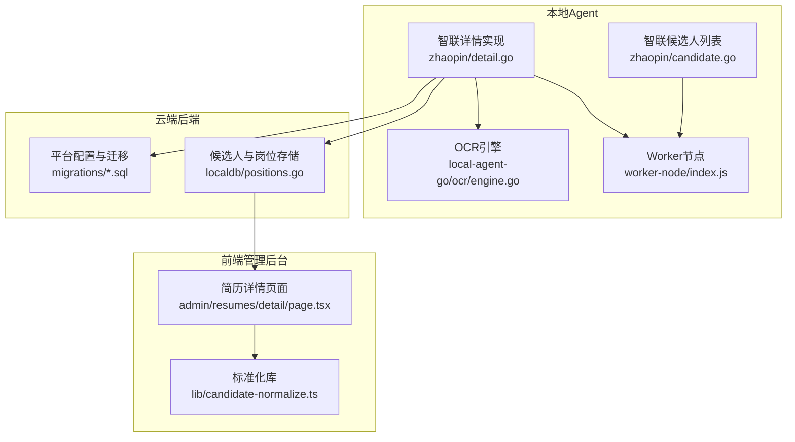
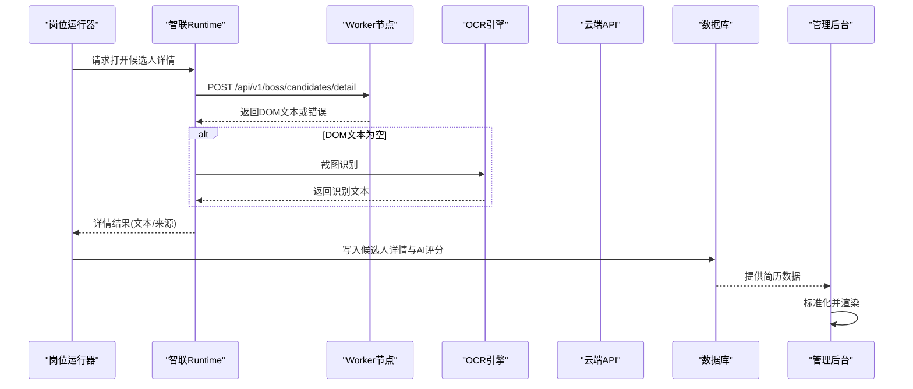
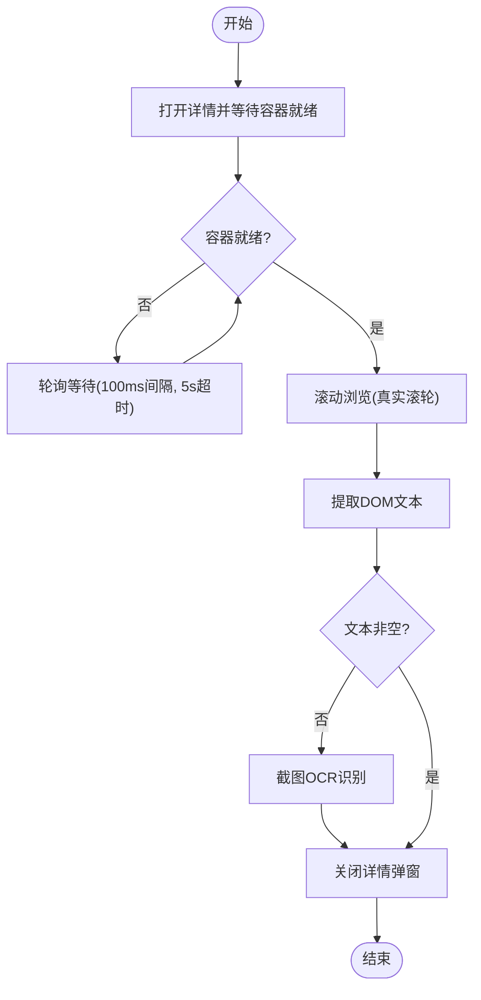
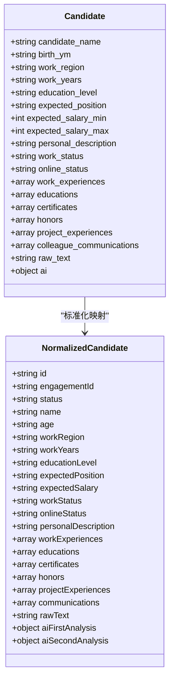
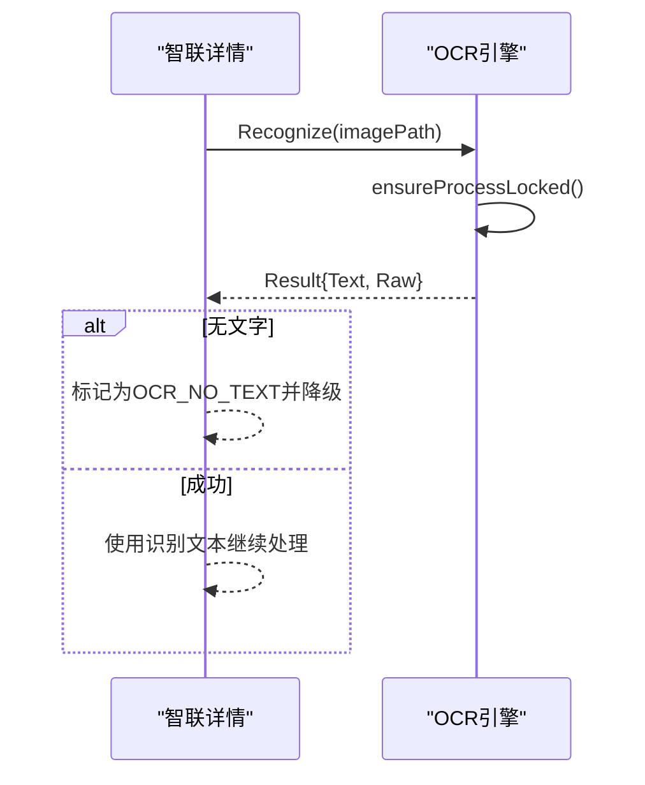
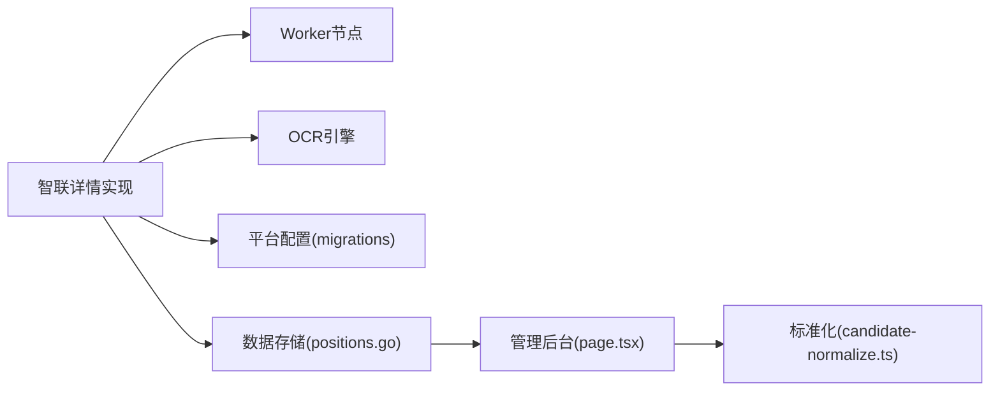

# 简历详情

<cite>
**本文引用的文件**
- [detail.go](file://goodhr5/local-agent-go/internal/platforms/zhaopin/detail.go)
- [candidate.go](file://goodhr5/local-agent-go/internal/platforms/zhaopin/candidate.go)
- [detail.go](file://goodhr5/local-agent-go-new/internal/platform/zhaopin/detail.go)
- [candidate.go](file://goodhr5/local-agent-go-new/internal/platform/zhaopin/candidate.go)
- [engine.go](file://goodhr5/local-agent-go/internal/ocr/engine.go)
- [client.go](file://goodhr5/local-agent-go-new/internal/integration/ocr/client.go)
- [candidate-normalize.ts](file://goodhr5/cloud/frontend-next/lib/candidate-normalize.ts)
- [page.tsx](file://goodhr5/cloud/frontend-next/app/admin/resumes/detail/page.tsx)
- [positions.go](file://goodhr5/local-agent-go/internal/localdb/positions.go)
- [0013_detail_prompt_and_preferences.sql](file://goodhr5/cloud/backend/db/migrations/0013_detail_prompt_and_preferences.sql)
- [0012_platform_locator_schema.sql](file://goodhr5/cloud/backend/db/migrations/0012_platform_locator_schema.sql)
- [error_policy.go](file://goodhr5/local-agent-go/internal/positionrunner/error_policy.go)
- [scan.go](file://goodhr5/local-agent-go/internal/positionrunner/scan.go)
- [index.js](file://goodhr5/local-agent-go/worker-node/src/index.js)
- [detail-ready.test.js](file://goodhr5/local-agent-go/worker-node/src/detail-ready.test.js)
- [types.go](file://goodhr5/local-agent-go-new/internal/integration/cloud/types.go)
- [简历模型.json](file://goodhr5/简历模型.json)
</cite>

## 目录
1. [简介](#简介)
2. [项目结构](#项目结构)
3. [核心组件](#核心组件)
4. [架构总览](#架构总览)
5. [详细组件分析](#详细组件分析)
6. [依赖关系分析](#依赖关系分析)
7. [性能考虑](#性能考虑)
8. [故障排查指南](#故障排查指南)
9. [结论](#结论)
10. [附录](#附录)

## 简介
本文件面向前程无忧（智联招聘）平台在 GoodHR5 中的“简历详情”处理链路，覆盖以下目标：
- 页面访问策略与加载优化：包括详情页打开、可见性等待、懒加载与滚动浏览、异步数据获取。
- 结构化解析：教育背景、工作经历、项目经验、证书荣誉等模块的数据提取与标准化。
- 图片处理与 OCR 识别：头像与技能证书的截图识别流程与降级策略。
- 数据标准化与校验：统一字段、评分与时间格式，保证前后端一致性与可展示性。
- 异常处理与降级：组件不可用、无文字、连续失败停止等策略。
- 性能监控与建议：耗时统计、轮询超时、并发控制与缓存建议。

## 项目结构
GoodHR5 的简历详情处理由“本地 Agent（浏览器自动化 + OCR）+ 云端后端（存储与配置）+ 前端管理后台（展示与交互）”三部分协作完成。针对智联招聘平台，关键路径如下：
- 本地 Agent 负责打开候选人详情页、等待容器就绪、滚动浏览、提取 DOM 文本或截图 OCR。
- 云端后端提供平台选择器配置、用户偏好（如打开详情的概率）、以及持久化存储。
- 前端管理后台对标准化后的简历数据进行可视化展示。

图表来源
- [detail.go:13-39](file://goodhr5/local-agent-go/internal/platforms/zhaopin/detail.go#L13-L39)
- [candidate.go:13-49](file://goodhr5/local-agent-go/internal/platforms/zhaopin/candidate.go#L13-L49)
- [engine.go:59-97](file://goodhr5/local-agent-go/internal/ocr/engine.go#L59-L97)
- [0013_detail_prompt_and_preferences.sql:1-38](file://goodhr5/cloud/backend/db/migrations/0013_detail_prompt_and_preferences.sql#L1-L38)
- [positions.go:382-404](file://goodhr5/local-agent-go/internal/localdb/positions.go#L382-L404)
- [page.tsx:18-25](file://goodhr5/cloud/frontend-next/app/admin/resumes/detail/page.tsx#L18-L25)
- [candidate-normalize.ts:56-112](file://goodhr5/cloud/frontend-next/lib/candidate-normalize.ts#L56-L112)

章节来源
- [detail.go:13-39](file://goodhr5/local-agent-go/internal/platforms/zhaopin/detail.go#L13-L39)
- [candidate.go:13-49](file://goodhr5/local-agent-go/internal/platforms/zhaopin/candidate.go#L13-L49)
- [engine.go:59-97](file://goodhr5/local-agent-go/internal/ocr/engine.go#L59-L97)
- [0013_detail_prompt_and_preferences.sql:1-38](file://goodhr5/cloud/backend/db/migrations/0013_detail_prompt_and_preferences.sql#L1-L38)
- [positions.go:382-404](file://goodhr5/local-agent-go/internal/localdb/positions.go#L382-L404)
- [page.tsx:18-25](file://goodhr5/cloud/frontend-next/app/admin/resumes/detail/page.tsx#L18-L25)
- [candidate-normalize.ts:56-112](file://goodhr5/cloud/frontend-next/lib/candidate-normalize.ts#L56-L112)

## 核心组件
- 智联详情提取：通过 Worker 接口调用 DOM 文本提取，支持滚动与关闭弹窗，限制为 DOM 模式。
- 候选人列表与定位：从当前可见区域提取候选人卡片，滚动到指定候选人并保证可见。
- OCR 引擎：本地常驻进程识别截图文字，具备健壮的错误分类与日志记录。
- 数据标准化：前端将后端返回的扁平简历模型转换为展示结构，包含经历、教育、证书、项目等。
- 平台配置：通过数据库迁移注入平台选择器、行为开关（是否需要详情页）和详情内容容器。
- 错误与降级：连续错误计数、OCR 不可用/无文字区分、岗位运行自动停止策略。

章节来源
- [detail.go:13-39](file://goodhr5/local-agent-go/internal/platforms/zhaopin/detail.go#L13-L39)
- [candidate.go:13-49](file://goodhr5/local-agent-go/internal/platforms/zhaopin/candidate.go#L13-L49)
- [engine.go:59-97](file://goodhr5/local-agent-go/internal/ocr/engine.go#L59-L97)
- [candidate-normalize.ts:56-112](file://goodhr5/cloud/frontend-next/lib/candidate-normalize.ts#L56-L112)
- [0013_detail_prompt_and_preferences.sql:1-38](file://goodhr5/cloud/backend/db/migrations/0013_detail_prompt_and_preferences.sql#L1-L38)
- [error_policy.go:48-118](file://goodhr5/local-agent-go/internal/positionrunner/error_policy.go#L48-L118)

## 架构总览
下图展示了智联招聘简历详情从打开到结构化展示的完整时序：

图表来源
- [detail.go:13-39](file://goodhr5/local-agent-go/internal/platforms/zhaopin/detail.go#L13-L39)
- [engine.go:59-97](file://goodhr5/local-agent-go/internal/ocr/engine.go#L59-L97)
- [positions.go:382-404](file://goodhr5/local-agent-go/internal/localdb/positions.go#L382-L404)
- [page.tsx:18-25](file://goodhr5/cloud/frontend-next/app/admin/resumes/detail/page.tsx#L18-L25)

## 详细组件分析

### 智联详情打开与加载优化
- 打开策略：仅支持 DOM 模式详情提取；通过 Worker 接口发送候选人与位置信息，禁用截图与强制滚动，设置详情就绪超时与视口边距。
- 可见性等待：使用轮询机制检测详情容器是否出现，默认每 100ms 检查一次，最长 5s 超时；若未找到则返回失败原因。
- 滚动浏览：在 AI 判断前进行真实滚轮滚动，确保长页面内容被加载；滚动距离与次数可调。
- 关闭策略：优先尝试 Escape 键关闭，随后多次查找详情容器确认关闭；若仍未关闭则报错。

图表来源
- [detail.go:13-39](file://goodhr5/local-agent-go/internal/platforms/zhaopin/detail.go#L13-L39)
- [detail.go:57-96](file://goodhr5/local-agent-go/internal/platforms/zhaopin/detail.go#L57-L96)
- [detail-ready.test.js:8-44](file://goodhr5/local-agent-go/worker-node/src/detail-ready.test.js#L8-L44)

章节来源
- [detail.go:13-39](file://goodhr5/local-agent-go/internal/platforms/zhaopin/detail.go#L13-L39)
- [detail.go:57-96](file://goodhr5/local-agent-go/internal/platforms/zhaopin/detail.go#L57-L96)
- [detail-ready.test.js:8-44](file://goodhr5/local-agent-go/worker-node/src/detail-ready.test.js#L8-L44)

### 候选人列表与定位
- 列表提取：从当前可见区域批量提取候选人卡片，附带耗时统计与去重指纹。
- 滚动定位：小步滚轮滚动到指定候选人，确保其进入可视区域后再执行后续操作。
- 翻页与加载更多：通过公共能力推进候选人列表，避免重复加载。

章节来源
- [candidate.go:13-49](file://goodhr5/local-agent-go/internal/platforms/zhaopin/candidate.go#L13-L49)
- [candidate.go:62-69](file://goodhr5/local-agent-go/internal/platforms/zhaopin/candidate.go#L62-L69)
- [candidate.go:71-85](file://goodhr5/local-agent-go/internal/platforms/zhaopin/candidate.go#L71-L85)

### 结构化解析与标准化
- 后端存储：候选人详情以扁平 JSON 字段持久化，包含基本信息、工作/教育/证书/项目/沟通摘要、AI 评分与原始文本等。
- 前端标准化：将后端数据映射为展示结构，计算年龄、薪资区间、经历行摘要与时间段文本。
- 平台配置：通过迁移脚本注入平台选择器与行为开关，例如是否需要详情页、详情内容容器类名等。

图表来源
- [positions.go:382-404](file://goodhr5/local-agent-go/internal/localdb/positions.go#L382-L404)
- [positions.go:764-801](file://goodhr5/local-agent-go/internal/localdb/positions.go#L764-L801)
- [candidate-normalize.ts:56-112](file://goodhr5/cloud/frontend-next/lib/candidate-normalize.ts#L56-L112)
- [types.go:149-196](file://goodhr5/local-agent-go-new/internal/integration/cloud/types.go#L149-L196)
- [简历模型.json:1-84](file://goodhr5/简历模型.json#L1-L84)

章节来源
- [positions.go:382-404](file://goodhr5/local-agent-go/internal/localdb/positions.go#L382-L404)
- [positions.go:764-801](file://goodhr5/local-agent-go/internal/localdb/positions.go#L764-L801)
- [candidate-normalize.ts:56-112](file://goodhr5/cloud/frontend-next/lib/candidate-normalize.ts#L56-L112)
- [types.go:149-196](file://goodhr5/local-agent-go-new/internal/integration/cloud/types.go#L149-L196)
- [简历模型.json:1-84](file://goodhr5/简历模型.json#L1-L84)

### 图片处理与 OCR 识别集成
- 触发条件：当 DOM 文本为空时，回退到截图 OCR 识别。
- 进程管理：OCR 引擎启动本地常驻进程，按 JSON 行协议通信；支持环境变量与系统 PATH 查找可执行文件。
- 错误分类：区分“组件不可用”与“无文字”，便于上层做降级与重试。
- 日志与诊断：输出 OCR 日志路径，便于问题定位。

图表来源
- [engine.go:59-97](file://goodhr5/local-agent-go/internal/ocr/engine.go#L59-L97)
- [engine.go:99-146](file://goodhr5/local-agent-go/internal/ocr/engine.go#L99-L146)
- [engine.go:240-278](file://goodhr5/local-agent-go/internal/ocr/engine.go#L240-L278)
- [client.go:102-132](file://goodhr5/local-agent-go-new/internal/integration/ocr/client.go#L102-L132)
- [client.go:294-350](file://goodhr5/local-agent-go-new/internal/integration/ocr/client.go#L294-L350)

章节来源
- [engine.go:59-97](file://goodhr5/local-agent-go/internal/ocr/engine.go#L59-L97)
- [engine.go:99-146](file://goodhr5/local-agent-go/internal/ocr/engine.go#L99-L146)
- [engine.go:240-278](file://goodhr5/local-agent-go/internal/ocr/engine.go#L240-L278)
- [client.go:102-132](file://goodhr5/local-agent-go-new/internal/integration/ocr/client.go#L102-L132)
- [client.go:294-350](file://goodhr5/local-agent-go-new/internal/integration/ocr/client.go#L294-L350)

### 简历信息的标准化与验证
- 字段映射：将后端扁平模型映射到前端展示结构，确保必填字段存在且类型正确。
- 时间格式：统一使用 YYYY-MM 表示起止时间，缺失时显示“至今”。
- 薪资区间：根据最小值与最大值生成可读文本，支持单边区间。
- 年龄计算：基于出生年月粗略计算年龄，非法输入忽略。
- 平台配置：通过迁移脚本注入平台选择器与行为开关，确保详情页内容与容器匹配。

章节来源
- [candidate-normalize.ts:56-112](file://goodhr5/cloud/frontend-next/lib/candidate-normalize.ts#L56-L112)
- [candidate-normalize.ts:114-162](file://goodhr5/cloud/frontend-next/lib/candidate-normalize.ts#L114-L162)
- [0013_detail_prompt_and_preferences.sql:1-38](file://goodhr5/cloud/backend/db/migrations/0013_detail_prompt_and_preferences.sql#L1-L38)
- [0012_platform_locator_schema.sql:48-88](file://goodhr5/cloud/backend/db/migrations/0012_platform_locator_schema.sql#L48-L88)

### 异常处理与降级策略
- 连续错误停止：同一平台环节连续出现相同错误达到阈值时，自动停止岗位运行，避免无效循环。
- OCR 降级：组件不可用时记录错误并跳过；无文字时视为正常情况，不中断流程。
- 页面跳转与超时：Worker 节点跳转页面设置超时与等待策略，确保稳定性。
- 扫描与批处理：候选人处理失败时记录错误并继续下一项，累计失败数用于统计与告警。

章节来源
- [error_policy.go:48-118](file://goodhr5/local-agent-go/internal/positionrunner/error_policy.go#L48-L118)
- [scan.go:235-273](file://goodhr5/local-agent-go/internal/positionrunner/scan.go#L235-L273)
- [index.js:707-741](file://goodhr5/local-agent-go/worker-node/src/index.js#L707-L741)

## 依赖关系分析
- 平台实现依赖 Worker 节点提供的页面导航、元素查找与滚动能力。
- OCR 引擎作为独立进程，通过管道与主程序通信，具备状态自检与日志输出。
- 前端依赖后端提供的扁平简历模型，并通过标准化库转换为展示结构。
- 平台配置通过数据库迁移注入，影响详情页打开与内容容器选择。

图表来源
- [detail.go:13-39](file://goodhr5/local-agent-go/internal/platforms/zhaopin/detail.go#L13-L39)
- [engine.go:59-97](file://goodhr5/local-agent-go/internal/ocr/engine.go#L59-L97)
- [0013_detail_prompt_and_preferences.sql:1-38](file://goodhr5/cloud/backend/db/migrations/0013_detail_prompt_and_preferences.sql#L1-L38)
- [positions.go:382-404](file://goodhr5/local-agent-go/internal/localdb/positions.go#L382-L404)
- [page.tsx:18-25](file://goodhr5/cloud/frontend-next/app/admin/resumes/detail/page.tsx#L18-L25)
- [candidate-normalize.ts:56-112](file://goodhr5/cloud/frontend-next/lib/candidate-normalize.ts#L56-L112)

章节来源
- [detail.go:13-39](file://goodhr5/local-agent-go/internal/platforms/zhaopin/detail.go#L13-L39)
- [engine.go:59-97](file://goodhr5/local-agent-go/internal/ocr/engine.go#L59-L97)
- [0013_detail_prompt_and_preferences.sql:1-38](file://goodhr5/cloud/backend/db/migrations/0013_detail_prompt_and_preferences.sql#L1-L38)
- [positions.go:382-404](file://goodhr5/local-agent-go/internal/localdb/positions.go#L382-L404)
- [page.tsx:18-25](file://goodhr5/cloud/frontend-next/app/admin/resumes/detail/page.tsx#L18-L25)
- [candidate-normalize.ts:56-112](file://goodhr5/cloud/frontend-next/lib/candidate-normalize.ts#L56-L112)

## 性能考虑
- 轮询与超时：详情容器轮询间隔 100ms，最大 5s 超时，避免长时间阻塞。
- 滚动策略：真实滚轮滚动提升内容加载成功率，减少二次请求。
- 并发控制：候选人提取与处理采用批处理与队列，降低资源竞争。
- OCR 常驻进程：复用进程减少启动开销，但需关注内存与模型加载。
- 前端渲染：标准化库轻量高效，避免重复计算；按需展开详情面板。

[本节为通用性能指导，不直接分析具体文件]

## 故障排查指南
- 详情未打开：检查平台配置中是否需要详情页与详情容器类名是否正确。
- DOM 文本为空：确认滚动与等待逻辑是否生效，必要时启用 OCR 识别。
- OCR 不可用：查看组件安装与模型文件完整性，检查日志路径与进程状态。
- 连续错误停止：定位具体环节（如滚动、点击、查找元素），修复后重置计数器。
- 前端展示异常：核对标准化库字段映射与时间/薪资格式。

章节来源
- [0013_detail_prompt_and_preferences.sql:1-38](file://goodhr5/cloud/backend/db/migrations/0013_detail_prompt_and_preferences.sql#L1-L38)
- [engine.go:99-146](file://goodhr5/local-agent-go/internal/ocr/engine.go#L99-L146)
- [error_policy.go:48-118](file://goodhr5/local-agent-go/internal/positionrunner/error_policy.go#L48-L118)
- [candidate-normalize.ts:56-112](file://goodhr5/cloud/frontend-next/lib/candidate-normalize.ts#L56-L112)

## 结论
GoodHR5 对智联招聘平台的简历详情处理形成了稳定的端到端链路：通过 Worker 节点进行页面交互与 DOM 提取，结合 OCR 作为兜底方案；后端以扁平模型持久化，前端通过标准化库统一展示。系统在加载优化、结构化解析、异常处理与性能方面具备良好实践，建议在复杂场景下进一步引入缓存与更细粒度的监控指标。

[本节为总结性内容，不直接分析具体文件]

## 附录
- 简历模型示例：包含基本信息、经历、教育、证书、项目、沟通摘要与 AI 评分。
- 平台配置示例：包含详情页打开目标、关闭按钮、消息提示等选择器。

章节来源
- [简历模型.json:1-84](file://goodhr5/简历模型.json#L1-L84)
- [0012_platform_locator_schema.sql:48-88](file://goodhr5/cloud/backend/db/migrations/0012_platform_locator_schema.sql#L48-L88)