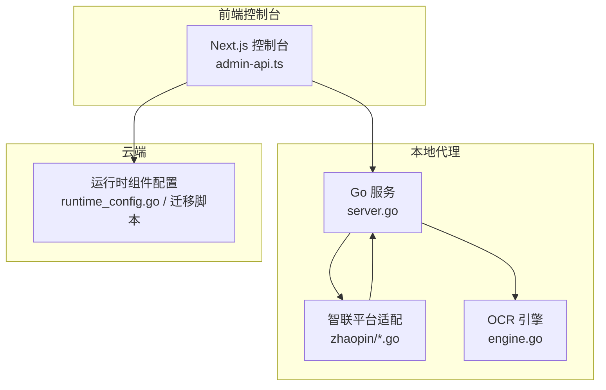
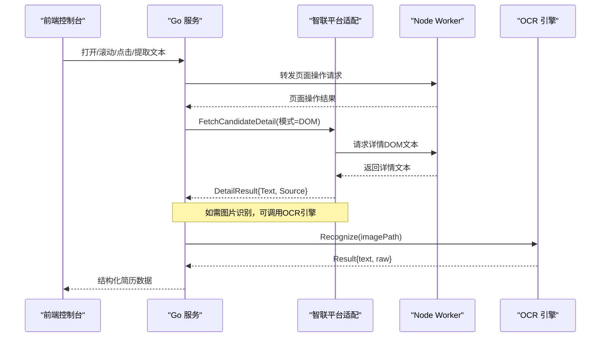
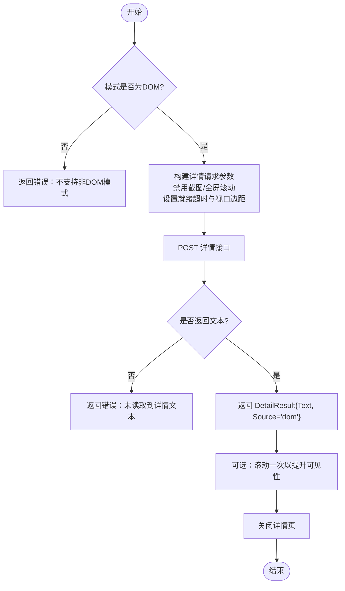
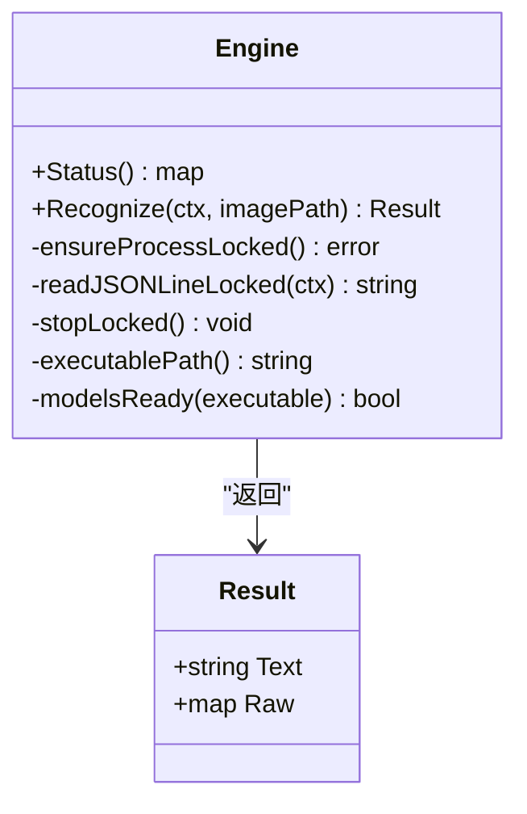
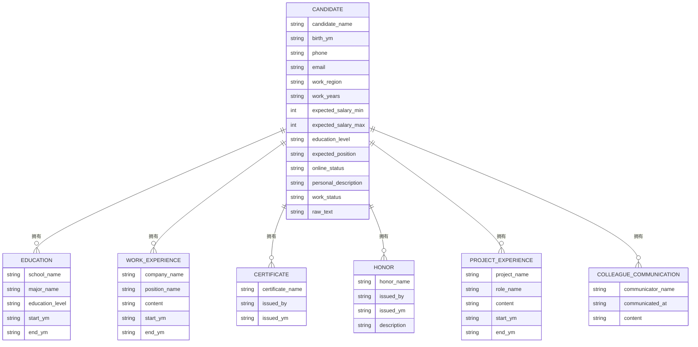
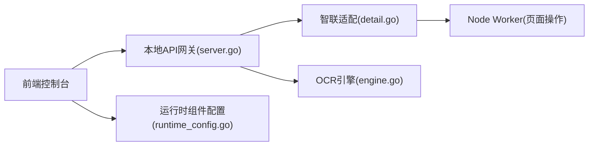

# 简历详情

<cite>
**本文引用的文件**
- [detail.go](file://goodhr5/local-agent-go/internal/platforms/zhaopin/detail.go)
- [candidate.go](file://goodhr5/local-agent-go/internal/platforms/zhaopin/candidate.go)
- [engine.go](file://goodhr5/local-agent-go/internal/ocr/engine.go)
- [server.go](file://goodhr5/local-agent-go/internal/app/server.go)
- [admin-api.ts](file://goodhr5/cloud/frontend-next/lib/admin-api.ts)
- [0042_onboarding_runtime_components.sql](file://goodhr5/cloud/backend/db/migrations/0042_onboarding_runtime_components.sql)
- [runtime_config.go](file://goodhr5/cloud/backend/internal/httpapi/runtime_config.go)
- [简历模型.json](file://goodhr5/简历模型.json)
</cite>

## 目录
1. [简介](#简介)
2. [项目结构](#项目结构)
3. [核心组件](#核心组件)
4. [架构总览](#架构总览)
5. [详细组件分析](#详细组件分析)
6. [依赖关系分析](#依赖关系分析)
7. [性能考虑](#性能考虑)
8. [故障排查指南](#故障排查指南)
9. [结论](#结论)
10. [附录](#附录)

## 简介
本文件面向前程无忧（智联招聘）平台“简历详情”的端到端处理，覆盖页面访问策略、懒加载与异步数据获取、结构化解析、图片与OCR识别集成、标准化与校验、异常与降级策略，以及性能监控与优化建议。文档以代码为依据，提供可追溯的来源标注和可视化图示，帮助读者快速理解并落地实现。

## 项目结构
围绕“简历详情”的关键路径涉及以下模块：
- 平台适配层：zhaopin 平台对详情页的 DOM 提取、滚动、关闭等能力封装
- 本地代理与服务转发：Go 服务将浏览器操作请求转发给 Node Worker
- OCR 引擎：本地进程调用 RapidOCR-json 进行截图文字识别
- 前端控制台：通过统一 API 与本地程序交互，展示运行状态与安装进度
- 云端配置：运行时组件（含 OCR）下载与版本信息下发

图表来源
- [server.go:764-797](file://goodhr5/local-agent-go/internal/app/server.go#L764-L797)
- [detail.go:13-40](file://goodhr5/local-agent-go/internal/platforms/zhaopin/detail.go#L13-L40)
- [engine.go:41-97](file://goodhr5/local-agent-go/internal/ocr/engine.go#L41-L97)
- [runtime_config.go:35-45](file://goodhr5/cloud/backend/internal/httpapi/runtime_config.go#L35-L45)
- [0042_onboarding_runtime_components.sql:35-52](file://goodhr5/cloud/backend/db/migrations/0042_onboarding_runtime_components.sql#L35-L52)

章节来源
- [detail.go:13-40](file://goodhr5/local-agent-go/internal/platforms/zhaopin/detail.go#L13-L40)
- [candidate.go:13-49](file://goodhr5/local-agent-go/internal/platforms/zhaopin/candidate.go#L13-L49)
- [engine.go:41-97](file://goodhr5/local-agent-go/internal/ocr/engine.go#L41-L97)
- [server.go:764-797](file://goodhr5/local-agent-go/internal/app/server.go#L764-L797)
- [admin-api.ts:86-119](file://goodhr5/cloud/frontend-next/lib/admin-api.ts#L86-L119)
- [runtime_config.go:35-45](file://goodhr5/cloud/backend/internal/httpapi/runtime_config.go#L35-L45)
- [0042_onboarding_runtime_components.sql:35-52](file://goodhr5/cloud/backend/db/migrations/0042_onboarding_runtime_components.sql#L35-L52)

## 核心组件
- 智联详情页提取器：仅支持 DOM 模式，通过执行器向 Worker 发起详情文本提取，返回纯文本与来源标记
- 列表可见性与滚动：确保候选人卡片进入可视区域，必要时小步滚动；详情页支持一次性滚动浏览
- 详情页关闭：发送 Escape 键并二次确认元素消失，避免弹窗残留影响后续流程
- OCR 引擎：维护常驻进程，按行 JSON 协议通信，输出合并后的文本与原始结果
- 前端统一请求：带超时控制与错误归一化，便于控制台稳定调用本地接口
- 运行时组件配置：云端下发 OCR 等组件版本与下载地址，开发环境自动替换为本地地址

章节来源
- [detail.go:13-40](file://goodhr5/local-agent-go/internal/platforms/zhaopin/detail.go#L13-L40)
- [detail.go:42-96](file://goodhr5/local-agent-go/internal/platforms/zhaopin/detail.go#L42-L96)
- [candidate.go:13-49](file://goodhr5/local-agent-go/internal/platforms/zhaopin/candidate.go#L13-L49)
- [engine.go:41-97](file://goodhr5/local-agent-go/internal/ocr/engine.go#L41-L97)
- [admin-api.ts:86-119](file://goodhr5/cloud/frontend-next/lib/admin-api.ts#L86-L119)
- [runtime_config.go:35-45](file://goodhr5/cloud/backend/internal/httpapi/runtime_config.go#L35-L45)
- [0042_onboarding_runtime_components.sql:35-52](file://goodhr5/cloud/backend/db/migrations/0042_onboarding_runtime_components.sql#L35-L52)

## 架构总览
智联招聘简历详情的数据流从前端控制台触发，经 Go 服务转发到 Node Worker 完成页面交互，再由平台适配层提取 DOM 文本或结合 OCR 识别图片内容，最终产出标准化的简历数据。

图表来源
- [server.go:764-797](file://goodhr5/local-agent-go/internal/app/server.go#L764-L797)
- [detail.go:13-40](file://goodhr5/local-agent-go/internal/platforms/zhaopin/detail.go#L13-L40)
- [engine.go:41-97](file://goodhr5/local-agent-go/internal/ocr/engine.go#L41-L97)

## 详细组件分析

### 智联详情页 DOM 提取与滚动
- 访问策略：仅允许 DOM 模式，强制禁用截图与全屏滚动，设置详情页就绪超时与视口边距，减少不必要的网络与渲染开销
- 异步数据获取：通过执行器 POST 到 Worker 的详情接口，等待就绪后读取文本
- 滚动优化：在 AI 分析阶段进行一次轻量滚动，提升长页内容可见性
- 关闭策略：先按 Escape，再检测弹窗是否消失，失败时重试一次，确保流程继续

图表来源
- [detail.go:13-40](file://goodhr5/local-agent-go/internal/platforms/zhaopin/detail.go#L13-L40)
- [detail.go:42-96](file://goodhr5/local-agent-go/internal/platforms/zhaopin/detail.go#L42-L96)

章节来源
- [detail.go:13-40](file://goodhr5/local-agent-go/internal/platforms/zhaopin/detail.go#L13-L40)
- [detail.go:42-96](file://goodhr5/local-agent-go/internal/platforms/zhaopin/detail.go#L42-L96)

### 候选人列表可见性与去重
- 列表提取：批量提取当前可见候选人，记录查找与转换耗时，便于性能追踪
- 可见性保证：使用小步滚动定位目标卡片，降低误触与抖动
- 去重指纹：基于姓名与年龄生成唯一标识，避免重复处理

章节来源
- [candidate.go:13-49](file://goodhr5/local-agent-go/internal/platforms/zhaopin/candidate.go#L13-L49)
- [candidate.go:62-85](file://goodhr5/local-agent-go/internal/platforms/zhaopin/candidate.go#L62-L85)

### OCR 图片识别与集成
- 进程管理：启动并复用常驻进程，按行 JSON 协议通信，支持上下文取消与异常退出日志
- 输入校验：要求绝对路径、文件存在、模型文件完整
- 结果收集：递归收集多字段中的文本片段，合并为单段文本，同时保留原始结果用于诊断
- 降级策略：当 OCR 不可用时，回退到 DOM 文本或提示安装组件

图表来源
- [engine.go:21-97](file://goodhr5/local-agent-go/internal/ocr/engine.go#L21-L97)
- [engine.go:99-200](file://goodhr5/local-agent-go/internal/ocr/engine.go#L99-L200)
- [engine.go:240-326](file://goodhr5/local-agent-go/internal/ocr/engine.go#L240-L326)

章节来源
- [engine.go:41-97](file://goodhr5/local-agent-go/internal/ocr/engine.go#L41-L97)
- [engine.go:99-200](file://goodhr5/local-agent-go/internal/ocr/engine.go#L99-L200)
- [engine.go:240-326](file://goodhr5/local-agent-go/internal/ocr/engine.go#L240-L326)

### 前端控制台与本地程序交互
- 统一请求封装：设置超时、缓存控制、错误归一化，便于上层稳定调用
- 运行时状态：并行拉取本地程序状态与健康检查，聚合显示
- 组件安装：根据云端下发的运行时组件配置，引导安装 OCR 等必要组件

章节来源
- [admin-api.ts:86-119](file://goodhr5/cloud/frontend-next/lib/admin-api.ts#L86-L119)
- [0042_onboarding_runtime_components.sql:35-52](file://goodhr5/cloud/backend/db/migrations/0042_onboarding_runtime_components.sql#L35-L52)
- [runtime_config.go:35-45](file://goodhr5/cloud/backend/internal/httpapi/runtime_config.go#L35-L45)

### 结构化简历数据模型与标准化
- 标准字段：包含候选人基本信息、期望薪资、教育背景、工作经历、证书、荣誉、项目经验、沟通记录等
- 文本来源：raw_text 保存原始抓取文本，便于回溯与审计
- 质量保障：建议在解析层增加必填字段校验、时间格式规范化、枚举值映射与范围约束

图表来源
- [简历模型.json:1-84](file://goodhr5/简历模型.json#L1-L84)

章节来源
- [简历模型.json:1-84](file://goodhr5/简历模型.json#L1-L84)

## 依赖关系分析
- 平台适配层依赖执行器（Worker）提供的页面操作与 DOM 提取能力
- 本地代理负责路由与转发，屏蔽底层浏览器差异
- OCR 引擎作为独立子进程，通过管道与主进程通信
- 前端控制台依赖统一的本地请求封装，解耦具体实现细节
- 云端配置驱动运行时组件的版本与下载源，保证环境一致性

图表来源
- [server.go:764-797](file://goodhr5/local-agent-go/internal/app/server.go#L764-L797)
- [detail.go:13-40](file://goodhr5/local-agent-go/internal/platforms/zhaopin/detail.go#L13-L40)
- [engine.go:41-97](file://goodhr5/local-agent-go/internal/ocr/engine.go#L41-L97)
- [runtime_config.go:35-45](file://goodhr5/cloud/backend/internal/httpapi/runtime_config.go#L35-L45)

章节来源
- [server.go:764-797](file://goodhr5/local-agent-go/internal/app/server.go#L764-L797)
- [detail.go:13-40](file://goodhr5/local-agent-go/internal/platforms/zhaopin/detail.go#L13-L40)
- [engine.go:41-97](file://goodhr5/local-agent-go/internal/ocr/engine.go#L41-L97)
- [runtime_config.go:35-45](file://goodhr5/cloud/backend/internal/httpapi/runtime_config.go#L35-L45)

## 性能考虑
- 懒加载与按需滚动：仅在需要时滚动详情页，减少首屏渲染压力
- 单次滚动策略：AI 分析阶段只滚动一次，平衡可见性与性能
- 并发与超时：前端统一请求封装内置超时，避免阻塞；OCR 读取支持上下文取消
- 进程复用：OCR 常驻进程减少启动开销，提高吞吐
- 日志与度量：候选人提取与详情读取均记录耗时，便于瓶颈定位

[本节为通用性能建议，不直接分析具体文件]

## 故障排查指南
- 详情页未返回文本：检查模式是否为 DOM、详情页就绪超时、视口边距设置是否正确
- 详情页无法关闭：确认 Escape 按键发送成功，二次检测弹窗元素是否存在
- OCR 不可用：检查可执行文件路径、模型文件完整性、环境变量与 PATH；查看 OCR 日志文件
- 前端请求失败：核对本地程序连通性、超时设置、错误归一化信息
- 组件缺失：依据云端下发的运行时组件配置安装 OCR 等组件

章节来源
- [detail.go:13-40](file://goodhr5/local-agent-go/internal/platforms/zhaopin/detail.go#L13-L40)
- [detail.go:57-96](file://goodhr5/local-agent-go/internal/platforms/zhaopin/detail.go#L57-L96)
- [engine.go:61-97](file://goodhr5/local-agent-go/internal/ocr/engine.go#L61-L97)
- [engine.go:202-238](file://goodhr5/local-agent-go/internal/ocr/engine.go#L202-L238)
- [admin-api.ts:86-119](file://goodhr5/cloud/frontend-next/lib/admin-api.ts#L86-L119)
- [0042_onboarding_runtime_components.sql:35-52](file://goodhr5/cloud/backend/db/migrations/0042_onboarding_runtime_components.sql#L35-L52)

## 结论
本方案通过“平台适配层 + 本地代理 + OCR 引擎 + 前端控制台”的分层架构，实现了前程无忧平台简历详情的稳定采集与高效处理。DOM 优先、按需滚动与进程复用的策略在保证准确率的同时显著提升了性能。配合云端运行时组件配置与完善的异常降级机制，系统具备较强的鲁棒性与可维护性。

[本节为总结性内容，不直接分析具体文件]

## 附录
- 结构化简历字段参考：详见“简历模型.json”，包含候选人基本信息、教育背景、工作经历、证书、荣誉、项目经验、沟通记录等
- 关键实现路径参考：
  - 详情页提取与滚动：[detail.go](file://goodhr5/local-agent-go/internal/platforms/zhaopin/detail.go)
  - 候选人列表与可见性：[candidate.go](file://goodhr5/local-agent-go/internal/platforms/zhaopin/candidate.go)
  - OCR 引擎：[engine.go](file://goodhr5/local-agent-go/internal/ocr/engine.go)
  - 本地代理转发：[server.go](file://goodhr5/local-agent-go/internal/app/server.go)
  - 前端统一请求：[admin-api.ts](file://goodhr5/cloud/frontend-next/lib/admin-api.ts)
  - 运行时组件配置：[runtime_config.go](file://goodhr5/cloud/backend/internal/httpapi/runtime_config.go)、[0042_onboarding_runtime_components.sql](file://goodhr5/cloud/backend/db/migrations/0042_onboarding_runtime_components.sql)

[本节为索引与参考，不直接分析具体文件]