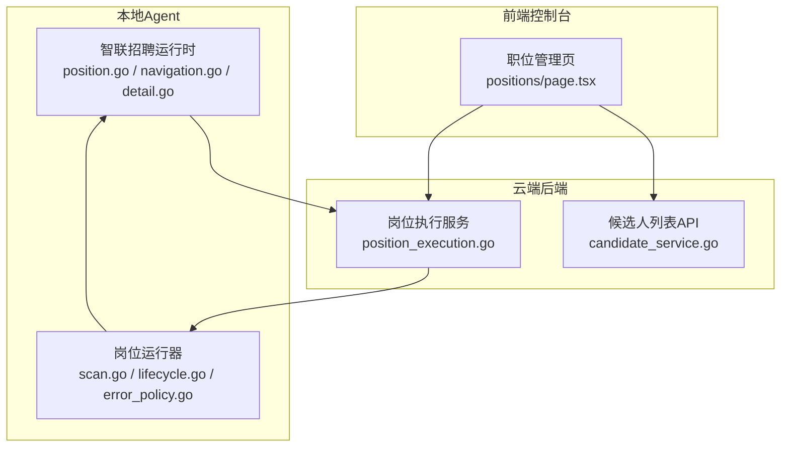
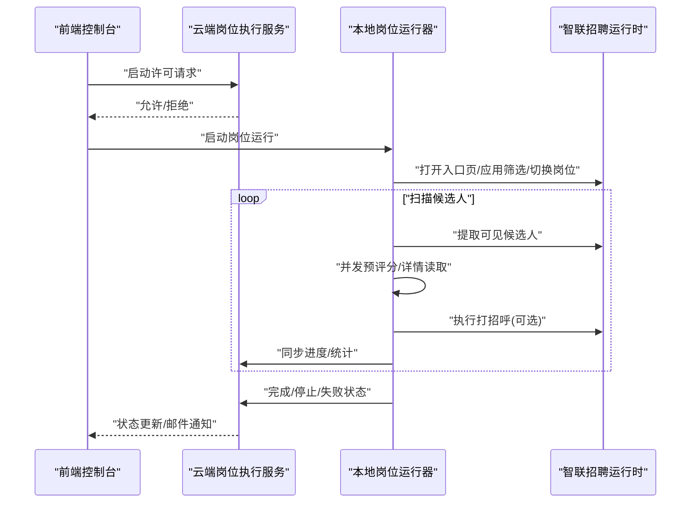
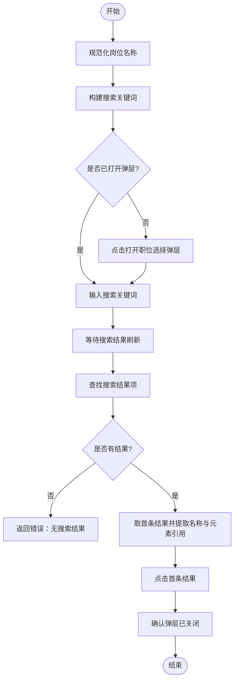
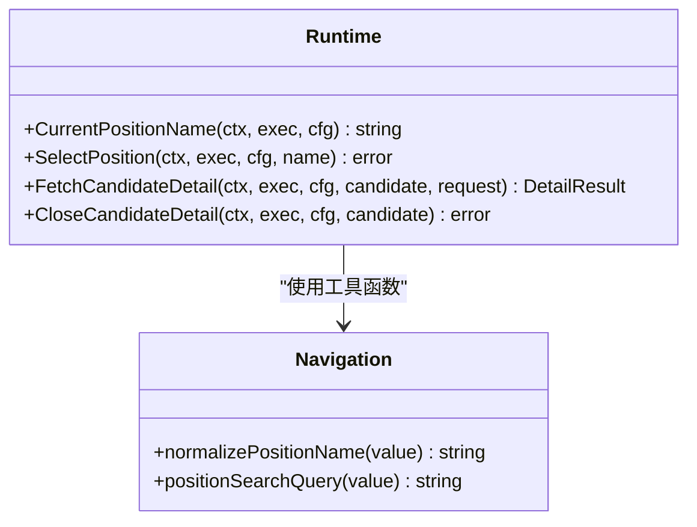
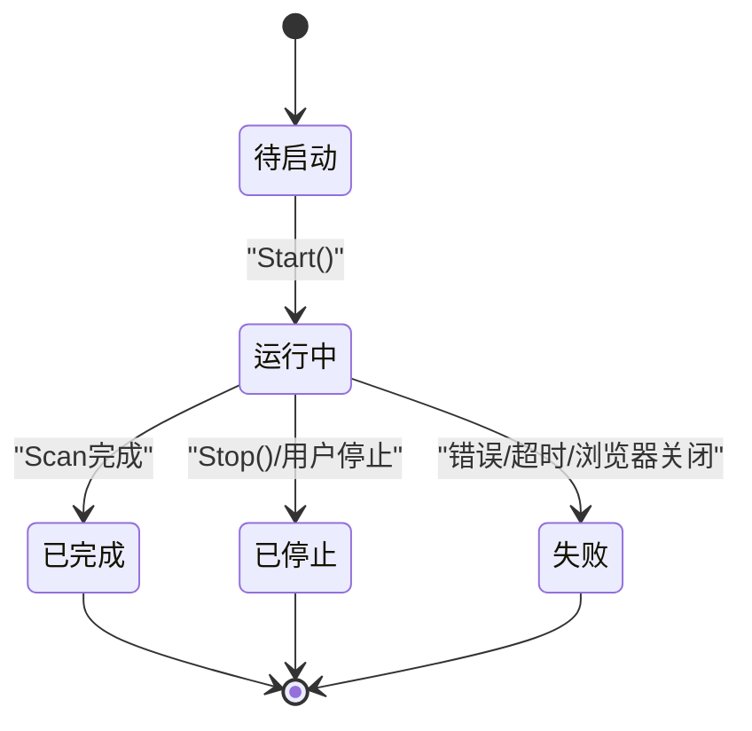
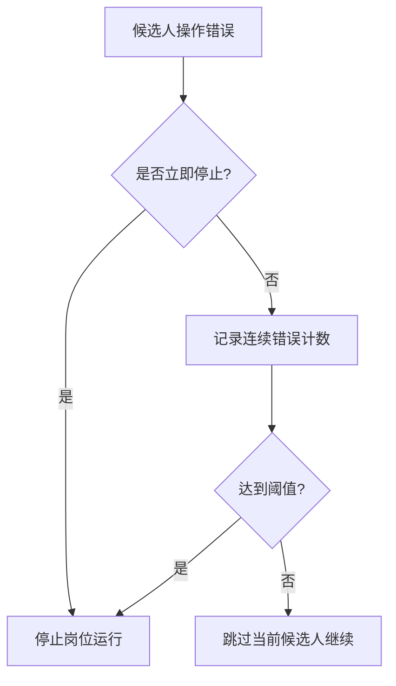
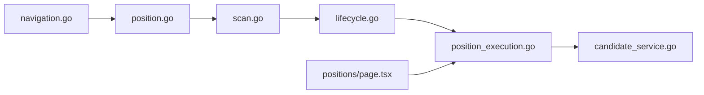

# 职位管理

<cite>
**本文引用的文件**
- [position.go](file://goodhr5/local-agent-go/internal/platforms/zhaopin/position.go)
- [entry.go](file://goodhr5/local-agent-go/internal/platforms/zhaopin/entry.go)
- [navigation.go](file://goodhr5/local-agent-go/internal/platforms/zhaopin/navigation.go)
- [detail.go](file://goodhr5/local-agent-go/internal/platforms/zhaopin/detail.go)
- [scan.go](file://goodhr5/local-agent-go/internal/positionrunner/scan.go)
- [lifecycle.go](file://goodhr5/local-agent-go/internal/positionrunner/lifecycle.go)
- [error_policy.go](file://goodhr5/local-agent-go/internal/positionrunner/error_policy.go)
- [position_execution.go](file://goodhr5/cloud/backend/internal/httpapi/position_execution.go)
- [candidate_service.go](file://goodhr5/cloud/backend/internal/httpapi/candidate_service.go)
- [0062_boss_position_search_input.sql](file://goodhr5/cloud/backend/db/migrations/0062_boss_position_search_input.sql)
- [page.tsx（职位管理前端）](file://goodhr5/cloud/frontend-next/app/admin/positions/page.tsx)
</cite>

## 目录
1. [简介](#简介)
2. [项目结构](#项目结构)
3. [核心组件](#核心组件)
4. [架构总览](#架构总览)
5. [详细组件分析](#详细组件分析)
6. [依赖关系分析](#依赖关系分析)
7. [性能考量](#性能考量)
8. [故障排查指南](#故障排查指南)
9. [结论](#结论)
10. [附录](#附录)

## 简介
本文件面向前程无忧平台（以智联招聘实现为参考）的“职位管理”能力，聚焦以下目标：
- 职位搜索功能的实现原理：搜索条件构建、页面加载策略与结果解析逻辑。
- 职位信息提取方法：职位名称、薪资范围、工作地点等关键字段的数据获取方式。
- 职位状态管理与更新机制：有效性检查、状态同步与失败恢复。
- 错误处理与重试策略：候选人级与岗位运行级的错误分类、自动停止与重试边界。
- 性能优化技巧：滚动策略、并发预评分、超时控制与资源保护。
- 具体代码示例路径与调试方法：通过源码路径快速定位关键流程。

## 项目结构
系统由本地 Agent（浏览器自动化与平台适配）、云端后端（岗位运行状态与数据服务）以及前端控制台组成。针对前程无忧（智联招聘）的职位管理，主要涉及：
- 本地 Agent：平台运行时、页面操作、候选人扫描与详情读取、错误策略。
- 云端后端：岗位运行生命周期、状态同步、候选人查询接口。
- 前端控制台：岗位启动前校验、打开平台页面、登录态确认、用户引导。

**图表来源**
- [position.go:1-103](file://goodhr5/local-agent-go/internal/platforms/zhaopin/position.go#L1-L103)
- [scan.go:17-172](file://goodhr5/local-agent-go/internal/positionrunner/scan.go#L17-L172)
- [lifecycle.go:15-79](file://goodhr5/local-agent-go/internal/positionrunner/lifecycle.go#L15-L79)
- [position_execution.go:125-200](file://goodhr5/cloud/backend/internal/httpapi/position_execution.go#L125-L200)
- [candidate_service.go:54-76](file://goodhr5/cloud/backend/internal/httpapi/candidate_service.go#L54-L76)
- [page.tsx（职位管理前端）:379-503](file://goodhr5/cloud/frontend-next/app/admin/positions/page.tsx#L379-L503)

**章节来源**
- [position.go:1-103](file://goodhr5/local-agent-go/internal/platforms/zhaopin/position.go#L1-L103)
- [scan.go:17-172](file://goodhr5/local-agent-go/internal/positionrunner/scan.go#L17-L172)
- [lifecycle.go:15-79](file://goodhr5/local-agent-go/internal/positionrunner/lifecycle.go#L15-L79)
- [position_execution.go:125-200](file://goodhr5/cloud/backend/internal/httpapi/position_execution.go#L125-L200)
- [candidate_service.go:54-76](file://goodhr5/cloud/backend/internal/httpapi/candidate_service.go#L54-L76)
- [page.tsx（职位管理前端）:379-503](file://goodhr5/cloud/frontend-next/app/admin/positions/page.tsx#L379-L503)

## 核心组件
- 智联招聘运行时
  - 入口页打开与判断：确保当前页面命中配置入口，必要时跳转。
  - 岗位选择与搜索：构造精简关键词，打开弹层输入并点击首条结果，关闭弹层后继续。
  - 详情页读取：仅支持 DOM 模式，提取详情文本并清理附加内容。
- 岗位运行器
  - 页面准备与岗位切换：等待入口页、应用基础筛选、读取或切换当前岗位。
  - 候选人扫描与处理：可见候选人提取、去重、滚动加载更多、并发预评分、详情读取、打招呼与保存。
  - 状态同步与通知：启动、完成、停止时与云端同步，失败时发送通知。
- 云端后端
  - 岗位执行服务：接收本地状态同步、完成/停止通知，持久化并发送邮件。
  - 候选人列表API：按岗位ID与关键词分页返回候选人。
- 前端控制台
  - 启动前检查：AI余额、本地程序版本、平台开放状态、登录态确认。
  - 打开平台页面：调用本地代理打开对应平台页面，提示用户先手动设置基础筛选。

**章节来源**
- [entry.go:12-43](file://goodhr5/local-agent-go/internal/platforms/zhaopin/entry.go#L12-L43)
- [position.go:31-102](file://goodhr5/local-agent-go/internal/platforms/zhaopin/position.go#L31-L102)
- [detail.go:13-40](file://goodhr5/local-agent-go/internal/platforms/zhaopin/detail.go#L13-L40)
- [scan.go:97-203](file://goodhr5/local-agent-go/internal/positionrunner/scan.go#L97-L203)
- [lifecycle.go:15-79](file://goodhr5/local-agent-go/internal/positionrunner/lifecycle.go#L15-L79)
- [position_execution.go:125-200](file://goodhr5/cloud/backend/internal/httpapi/position_execution.go#L125-L200)
- [candidate_service.go:54-76](file://goodhr5/cloud/backend/internal/httpapi/candidate_service.go#L54-L76)
- [page.tsx（职位管理前端）:379-503](file://goodhr5/cloud/frontend-next/app/admin/positions/page.tsx#L379-L503)

## 架构总览
职位管理的端到端流程如下：
- 前端触发岗位启动，检查本地程序健康与AI余额，打开平台页面并确认登录态。
- 本地运行器启动岗位，进入页面准备阶段：打开入口页、应用基础筛选、读取或切换当前岗位。
- 循环扫描候选人：提取可见候选人、去重、滚动加载更多；对候选进行AI预评分与详情读取；根据决策决定是否打招呼与保存。
- 运行结束或异常时，本地将状态同步到云端，云端更新岗位状态并发送邮件通知。

**图表来源**
- [lifecycle.go:15-79](file://goodhr5/local-agent-go/internal/positionrunner/lifecycle.go#L15-L79)
- [scan.go:97-203](file://goodhr5/local-agent-go/internal/positionrunner/scan.go#L97-L203)
- [position_execution.go:125-200](file://goodhr5/cloud/backend/internal/httpapi/position_execution.go#L125-L200)
- [entry.go:12-43](file://goodhr5/local-agent-go/internal/platforms/zhaopin/entry.go#L12-L43)
- [position.go:31-102](file://goodhr5/local-agent-go/internal/platforms/zhaopin/position.go#L31-L102)

## 详细组件分析

### 职位搜索功能实现原理
- 搜索条件构建
  - 岗位名称规范化：去除多余空白与括号说明，生成平台可识别的精简关键词。
  - 搜索框定位：通过配置中的 searchInput 选择器定位输入框，填入关键词。
  - 结果项定位：查找搜索结果项列表，读取首条标题与元素引用。
- 页面加载策略
  - 入口页确认：若当前页面未命中入口地址，则打开配置入口URL。
  - 弹层交互：打开职位选择弹层，输入关键词，等待刷新，点击首条结果，关闭弹层。
- 结果解析逻辑
  - 从搜索结果项中提取职位名称与元素引用，用于后续点击与切换。
  - 若结果为空或缺少元素引用，返回错误以便上层重试或提示。

**图表来源**
- [navigation.go:73-93](file://goodhr5/local-agent-go/internal/platforms/zhaopin/navigation.go#L73-L93)
- [position.go:31-102](file://goodhr5/local-agent-go/internal/platforms/zhaopin/position.go#L31-L102)

**章节来源**
- [navigation.go:73-93](file://goodhr5/local-agent-go/internal/platforms/zhaopin/navigation.go#L73-L93)
- [position.go:31-102](file://goodhr5/local-agent-go/internal/platforms/zhaopin/position.go#L31-L102)
- [0062_boss_position_search_input.sql:1-17](file://goodhr5/cloud/backend/db/migrations/0062_boss_position_search_input.sql#L1-L17)

### 职位信息提取方法
- 职位名称
  - 通过当前岗位选择器读取页面展示名称，或使用搜索结果项标题。
  - 若为空，记录警告日志并返回错误，便于上层重试或提示。
- 薪资范围与工作地点
  - 在平台配置中定义字段映射（如 extras 中的薪资），通过 Worker 的 find-elements 提取对应DOM文本。
  - 若平台未提供结构化字段，可在详情DOM中提取并清洗后使用。
- 详情页文本
  - 智联招聘仅支持 DOM 模式详情识别，调用详情接口提取文本，并清理平台附加内容。

**图表来源**
- [position.go:11-29](file://goodhr5/local-agent-go/internal/platforms/zhaopin/position.go#L11-L29)
- [detail.go:13-40](file://goodhr5/local-agent-go/internal/platforms/zhaopin/detail.go#L13-L40)
- [navigation.go:73-93](file://goodhr5/local-agent-go/internal/platforms/zhaopin/navigation.go#L73-L93)

**章节来源**
- [position.go:11-29](file://goodhr5/local-agent-go/internal/platforms/zhaopin/position.go#L11-L29)
- [detail.go:13-40](file://goodhr5/local-agent-go/internal/platforms/zhaopin/detail.go#L13-L40)
- [navigation.go:73-93](file://goodhr5/local-agent-go/internal/platforms/zhaopin/navigation.go#L73-L93)

### 职位状态管理与更新机制
- 有效性检查
  - 启动前检查：本地程序健康、AI余额、平台开放状态、登录态确认。
  - 运行中检查：云端会话有效性验证，若失效则停止并通知。
- 状态同步
  - 本地运行器在启动、完成、停止、失败时向云端同步状态。
  - 云端更新岗位状态，并在完成时发送邮件通知。
- 失败恢复
  - 连续相同错误达到阈值时自动停止岗位运行，避免无效循环。
  - 浏览器关闭或上下文关闭时，自动结束并通知。

**图表来源**
- [lifecycle.go:15-79](file://goodhr5/local-agent-go/internal/positionrunner/lifecycle.go#L15-L79)
- [lifecycle.go:141-169](file://goodhr5/local-agent-go/internal/positionrunner/lifecycle.go#L141-L169)
- [position_execution.go:125-200](file://goodhr5/cloud/backend/internal/httpapi/position_execution.go#L125-L200)

**章节来源**
- [lifecycle.go:15-79](file://goodhr5/local-agent-go/internal/positionrunner/lifecycle.go#L15-L79)
- [lifecycle.go:141-169](file://goodhr5/local-agent-go/internal/positionrunner/lifecycle.go#L141-L169)
- [position_execution.go:125-200](file://goodhr5/cloud/backend/internal/httpapi/position_execution.go#L125-L200)

### 错误处理与重试策略
- 候选人级错误
  - 记录同一平台环节的连续错误指纹，达到阈值（如3次）自动停止岗位运行。
  - 非致命错误（如暂时找不到元素）允许跳过当前候选人并继续。
- 岗位运行级错误
  - 立即停止的错误包括：AI服务不可用、浏览器关闭、上下文取消等。
  - OCR致命错误（组件未安装、模型不完整、进程退出）直接终止。
- 重试边界
  - 滚动失败不阻断主流程，仅记录警告。
  - 详情读取失败可重试一次（如再次按下 Escape 关闭弹层）。
  - 云端状态同步失败时，前端可重试提交。

**图表来源**
- [error_policy.go:37-99](file://goodhr5/local-agent-go/internal/positionrunner/error_policy.go#L37-L99)
- [error_policy.go:101-118](file://goodhr5/local-agent-go/internal/positionrunner/error_policy.go#L101-L118)
- [detail.go:57-96](file://goodhr5/local-agent-go/internal/platforms/zhaopin/detail.go#L57-L96)

**章节来源**
- [error_policy.go:37-99](file://goodhr5/local-agent-go/internal/positionrunner/error_policy.go#L37-L99)
- [error_policy.go:101-118](file://goodhr5/local-agent-go/internal/positionrunner/error_policy.go#L101-L118)
- [detail.go:57-96](file://goodhr5/local-agent-go/internal/platforms/zhaopin/detail.go#L57-L96)

### 性能优化技巧
- 滚动策略
  - 每轮滚动距离带随机抖动，避免固定模式被反爬检测。
  - 连续空轮次达到上限时停止滚动，减少无效操作。
- 并发预评分
  - 对候选进行AI预评分时开启并发工作协程，提升吞吐。
  - 主流程仍按页面顺序消费候选人，保证稳定性。
- 超时控制
  - 候选人处理总超时、详情读取超时、OCR识别超时等均有明确限制。
  - 页面稳定等待时间可配置，避免过早提取导致失败。
- 资源保护
  - 防睡眠保护防止电脑休眠中断运行。
  - 检测到睡眠恢复后取消运行，避免状态不一致。

**章节来源**
- [scan.go:495-510](file://goodhr5/local-agent-go/internal/positionrunner/scan.go#L495-L510)
- [scan.go:217-233](file://goodhr5/local-agent-go/internal/positionrunner/scan.go#L217-L233)
- [lifecycle.go:370-459](file://goodhr5/local-agent-go/internal/positionrunner/lifecycle.go#L370-L459)

## 依赖关系分析
- 平台运行时依赖导航工具函数进行岗位名称规范与搜索关键词构建。
- 岗位运行器依赖平台运行时执行页面操作，并通过Worker调用浏览器能力。
- 云端后端依赖存储与服务组件完成状态持久化与通知。
- 前端控制台依赖云端API与本地代理进行启动前检查与页面打开。

**图表来源**
- [navigation.go:73-93](file://goodhr5/local-agent-go/internal/platforms/zhaopin/navigation.go#L73-L93)
- [position.go:31-102](file://goodhr5/local-agent-go/internal/platforms/zhaopin/position.go#L31-L102)
- [scan.go:97-203](file://goodhr5/local-agent-go/internal/positionrunner/scan.go#L97-L203)
- [lifecycle.go:15-79](file://goodhr5/local-agent-go/internal/positionrunner/lifecycle.go#L15-L79)
- [position_execution.go:125-200](file://goodhr5/cloud/backend/internal/httpapi/position_execution.go#L125-L200)
- [candidate_service.go:54-76](file://goodhr5/cloud/backend/internal/httpapi/candidate_service.go#L54-L76)
- [page.tsx（职位管理前端）:379-503](file://goodhr5/cloud/frontend-next/app/admin/positions/page.tsx#L379-L503)

**章节来源**
- [navigation.go:73-93](file://goodhr5/local-agent-go/internal/platforms/zhaopin/navigation.go#L73-L93)
- [position.go:31-102](file://goodhr5/local-agent-go/internal/platforms/zhaopin/position.go#L31-L102)
- [scan.go:97-203](file://goodhr5/local-agent-go/internal/positionrunner/scan.go#L97-L203)
- [lifecycle.go:15-79](file://goodhr5/local-agent-go/internal/positionrunner/lifecycle.go#L15-L79)
- [position_execution.go:125-200](file://goodhr5/cloud/backend/internal/httpapi/position_execution.go#L125-L200)
- [candidate_service.go:54-76](file://goodhr5/cloud/backend/internal/httpapi/candidate_service.go#L54-L76)
- [page.tsx（职位管理前端）:379-503](file://goodhr5/cloud/frontend-next/app/admin/positions/page.tsx#L379-L503)

## 性能考量
- 滚动与提取
  - 使用随机滚动距离与最大项数限制，避免过度滚动与内存压力。
  - 页面稳定等待时间可调，降低提取失败率。
- 并发与超时
  - AI预评分并发处理，提高吞吐量；主流程串行消费保证顺序。
  - 各阶段超时控制合理，避免长时间阻塞。
- 资源与稳定性
  - 防睡眠保护与睡眠恢复检测，保障长任务稳定性。
  - 连续错误自动停止，防止无效循环消耗资源。

[本节为通用指导，无需特定文件来源]

## 故障排查指南
- 常见问题
  - 岗位名称为空：检查当前岗位选择器与页面结构，确认入口页正确。
  - 搜索无结果：检查搜索关键词构建与弹层输入是否正确，确认平台配置。
  - 详情无法关闭：尝试再次按下 Escape，确认弹层选择器有效。
  - 连续错误停止：查看错误指纹与计数，定位平台环节问题。
- 调试方法
  - 查看岗位运行日志：本地运行器会记录各阶段日志，便于定位问题。
  - 前端控制台状态：观察启动前检查与平台登录态确认步骤。
  - 云端状态同步：检查完成/停止/失败状态同步是否成功。

**章节来源**
- [position.go:11-29](file://goodhr5/local-agent-go/internal/platforms/zhaopin/position.go#L11-L29)
- [position.go:31-102](file://goodhr5/local-agent-go/internal/platforms/zhaopin/position.go#L31-L102)
- [detail.go:57-96](file://goodhr5/local-agent-go/internal/platforms/zhaopin/detail.go#L57-L96)
- [error_policy.go:37-99](file://goodhr5/local-agent-go/internal/positionrunner/error_policy.go#L37-L99)
- [lifecycle.go:15-79](file://goodhr5/local-agent-go/internal/positionrunner/lifecycle.go#L15-L79)
- [page.tsx（职位管理前端）:379-503](file://goodhr5/cloud/frontend-next/app/admin/positions/page.tsx#L379-L503)

## 结论
前程无忧平台的职位管理能力通过本地Agent与云端后端的协同实现，具备完整的搜索、提取、状态管理与错误处理机制。通过合理的滚动策略、并发预评分与超时控制，系统在稳定性与性能之间取得平衡。前端控制台提供友好的启动前检查与用户引导，提升用户体验。未来可进一步优化平台配置的可维护性与错误诊断能力。

[本节为总结性内容，无需特定文件来源]

## 附录
- 代码示例路径
  - 岗位搜索关键词构建：[navigation.go:73-93](file://goodhr5/local-agent-go/internal/platforms/zhaopin/navigation.go#L73-L93)
  - 职位选择弹层交互：[position.go:31-102](file://goodhr5/local-agent-go/internal/platforms/zhaopin/position.go#L31-L102)
  - 详情页DOM提取：[detail.go:13-40](file://goodhr5/local-agent-go/internal/platforms/zhaopin/detail.go#L13-L40)
  - 候选人扫描主循环：[scan.go:97-203](file://goodhr5/local-agent-go/internal/positionrunner/scan.go#L97-L203)
  - 状态同步与通知：[position_execution.go:125-200](file://goodhr5/cloud/backend/internal/httpapi/position_execution.go#L125-L200)
  - 前端启动前检查：[page.tsx（职位管理前端）:379-503](file://goodhr5/cloud/frontend-next/app/admin/positions/page.tsx#L379-L503)

[本节为索引性内容，无需特定文件来源]