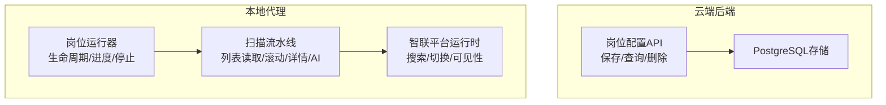
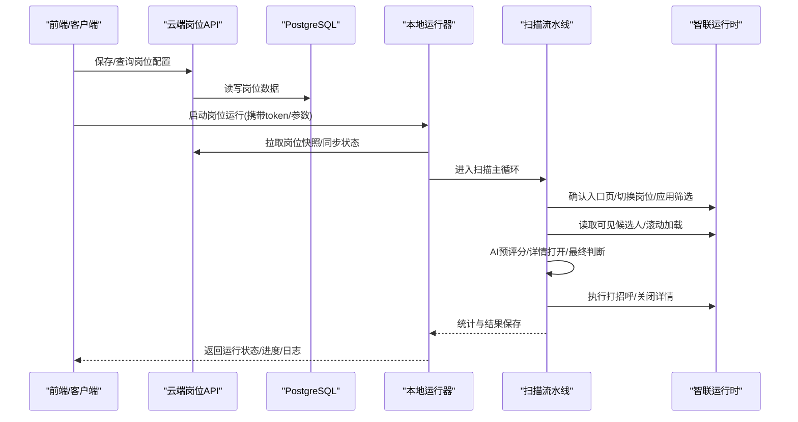
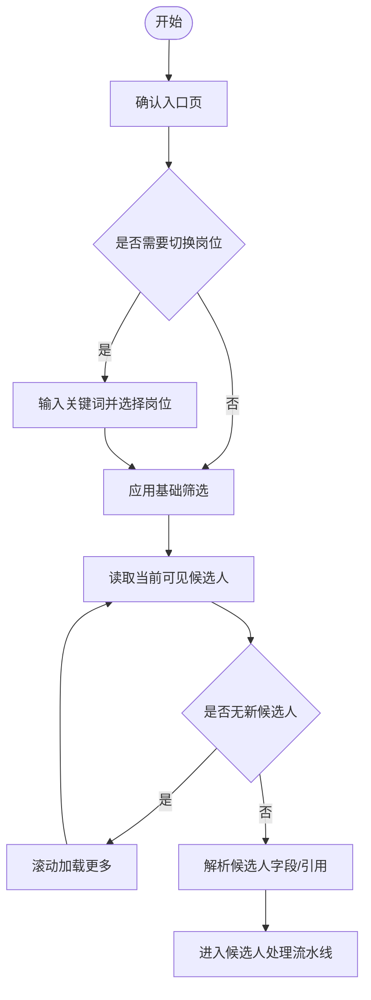
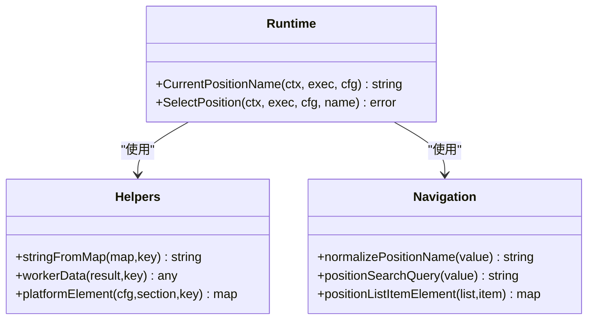
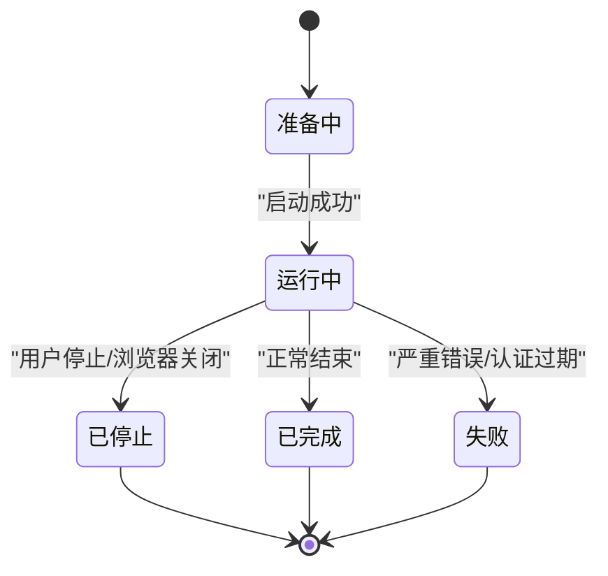
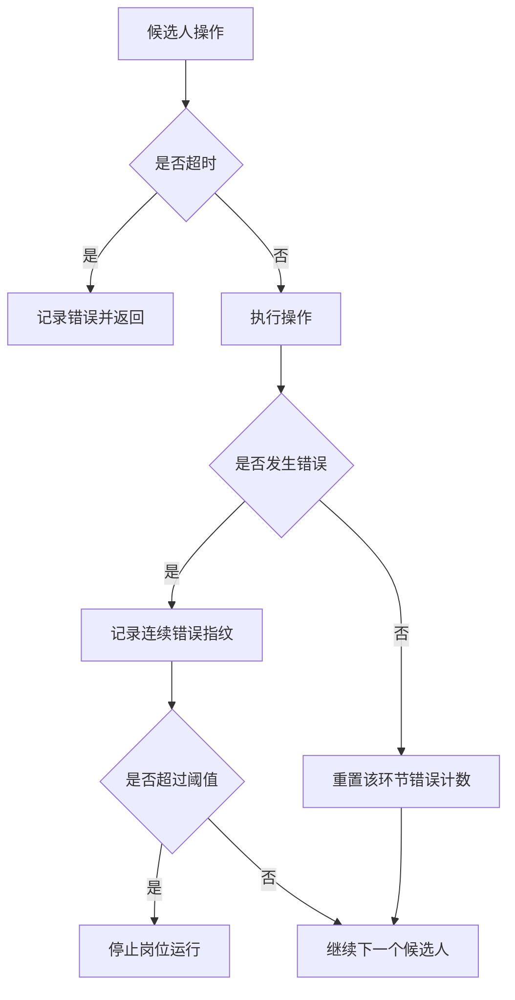
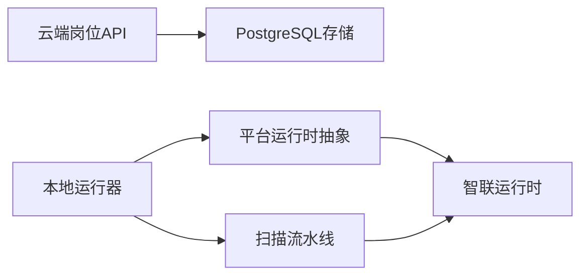

# 职位管理

<cite>
**本文引用的文件**
- [position.go](file://goodhr5/cloud/backend/internal/httpapi/position.go)
- [position_store_pg.go](file://goodhr5/cloud/backend/internal/httpapi/position_store_pg.go)
- [scan.go](file://goodhr5/local-agent-go/internal/positionrunner/scan.go)
- [lifecycle.go](file://goodhr5/local-agent-go/internal/positionrunner/lifecycle.go)
- [pipeline.go](file://goodhr5/local-agent-go/internal/positionrunner/pipeline.go)
- [error_policy.go](file://goodhr5/local-agent-go/internal/positionrunner/error_policy.go)
- [position.go](file://goodhr5/local-agent-go/internal/platforms/zhaopin/position.go)
- [runtime.go](file://goodhr5/local-agent-go/internal/platforms/zhaopin/runtime.go)
- [navigation.go](file://goodhr5/local-agent-go/internal/platforms/zhaopin/navigation.go)
- [helpers.go](file://goodhr5/local-agent-go/internal/platforms/zhaopin/helpers.go)
</cite>

## 目录
1. [简介](#简介)
2. [项目结构](#项目结构)
3. [核心组件](#核心组件)
4. [架构总览](#架构总览)
5. [详细组件分析](#详细组件分析)
6. [依赖关系分析](#依赖关系分析)
7. [性能考量](#性能考量)
8. [故障排查指南](#故障排查指南)
9. [结论](#结论)
10. [附录](#附录)

## 简介
本文件面向前程无忧（智联招聘）平台的“职位管理”能力，聚焦以下目标：
- 职位搜索功能的实现原理：搜索条件构建、页面加载策略与结果解析逻辑。
- 职位信息提取方法：职位名称、薪资范围、工作地点等关键字段的数据获取方式。
- 职位状态管理与更新机制：有效性检查、运行状态同步与收尾处理。
- 错误处理与重试策略：候选人操作失败、连续错误检测与恢复。
- 性能优化技巧：并发预评分、滚动加载、超时控制与资源释放。
- 调试方法与示例路径：通过日志定位问题、关键流程的调用链与数据流。

## 项目结构
系统由云端后端与本地代理两部分组成：
- 云端后端负责岗位配置的持久化、权限校验、AI 能力接入以及状态接口。
- 本地代理负责浏览器自动化、平台运行时适配、候选人扫描与打分、打招呼与结果上报。

图表来源
- [position.go:75-206](file://goodhr5/cloud/backend/internal/httpapi/position.go#L75-L206)
- [position_store_pg.go:23-200](file://goodhr5/cloud/backend/internal/httpapi/position_store_pg.go#L23-L200)
- [lifecycle.go:17-123](file://goodhr5/local-agent-go/internal/positionrunner/lifecycle.go#L17-L123)
- [scan.go:17-476](file://goodhr5/local-agent-go/internal/positionrunner/scan.go#L17-L476)
- [position.go:11-103](file://goodhr5/local-agent-go/internal/platforms/zhaopin/position.go#L11-L103)

章节来源
- [position.go:75-206](file://goodhr5/cloud/backend/internal/httpapi/position.go#L75-L206)
- [position_store_pg.go:23-200](file://goodhr5/cloud/backend/internal/httpapi/position_store_pg.go#L23-L200)
- [lifecycle.go:17-123](file://goodhr5/local-agent-go/internal/positionrunner/lifecycle.go#L17-L123)
- [scan.go:17-476](file://goodhr5/local-agent-go/internal/positionrunner/scan.go#L17-L476)
- [position.go:11-103](file://goodhr5/local-agent-go/internal/platforms/zhaopin/position.go#L11-L103)

## 核心组件
- 云端岗位服务：提供岗位配置的创建、查询、删除与 AI 需求优化；按用户与团队隔离数据。
- 本地岗位运行器：启动/停止/状态查询；维护运行锁、防睡眠保护、进度与日志。
- 扫描流水线：入口页确认、岗位选择、基础筛选、候选人列表读取、滚动加载、详情打开、AI 预评分与最终判断、打招呼与结果保存。
- 智联平台运行时：岗位名称读取、岗位切换、候选卡片可见性保证、字段提取与规范化。

章节来源
- [position.go:28-566](file://goodhr5/cloud/backend/internal/httpapi/position.go#L28-L566)
- [lifecycle.go:17-763](file://goodhr5/local-agent-go/internal/positionrunner/lifecycle.go#L17-L763)
- [scan.go:17-800](file://goodhr5/local-agent-go/internal/positionrunner/scan.go#L17-L800)
- [position.go:11-103](file://goodhr5/local-agent-go/internal/platforms/zhaopin/position.go#L11-L103)
- [runtime.go:11-69](file://goodhr5/local-agent-go/internal/platforms/zhaopin/runtime.go#L11-L69)
- [navigation.go:73-93](file://goodhr5/local-agent-go/internal/platforms/zhaopin/navigation.go#L73-L93)
- [helpers.go:9-207](file://goodhr5/local-agent-go/internal/platforms/zhaopin/helpers.go#L9-L207)

## 架构总览
从云端到本地的端到端流程如下：
- 前端或外部系统调用云端岗位 API 保存/查询岗位配置。
- 本地代理启动岗位运行，拉取云端岗位快照，准备浏览器与平台入口页。
- 根据平台运行时策略进行岗位切换与基础筛选，循环读取候选人列表并滚动加载更多。
- 对候选人执行 AI 预评分与详情打开，最终决定是否打招呼并保存结果。
- 运行过程中持续同步状态、统计计数与日志，异常时记录并通知。

图表来源
- [position.go:75-206](file://goodhr5/cloud/backend/internal/httpapi/position.go#L75-L206)
- [position_store_pg.go:23-200](file://goodhr5/cloud/backend/internal/httpapi/position_store_pg.go#L23-L200)
- [lifecycle.go:17-123](file://goodhr5/local-agent-go/internal/positionrunner/lifecycle.go#L17-L123)
- [scan.go:17-476](file://goodhr5/local-agent-go/internal/positionrunner/scan.go#L17-L476)
- [position.go:11-103](file://goodhr5/local-agent-go/internal/platforms/zhaopin/position.go#L11-L103)

## 详细组件分析

### 职位搜索功能：条件构建、页面加载与结果解析
- 搜索条件构建
  - 岗位名称规范化：去除多余空格与括号说明，生成平台可识别的精简关键词。
  - 基础筛选：通过平台运行时接口一次性应用基础筛选条件，减少后续过滤成本。
- 页面加载策略
  - 入口页确认：等待当前页面命中岗位入口地址，必要时跳转。
  - 岗位切换：支持直接切换或先读取当前岗位再比较匹配，不匹配则切换并二次确认。
  - 滚动加载：当列表无新候选人时，按平台策略滚动以加载更多。
- 结果解析逻辑
  - 列表项合并：将容器与项的定位配置合并，增强稳定性。
  - 字段提取：通过 Worker 统一协议读取文本、结构化字段与元素引用，用于后续可见性保证与点击。

图表来源
- [scan.go:110-177](file://goodhr5/local-agent-go/internal/positionrunner/scan.go#L110-L177)
- [scan.go:183-213](file://goodhr5/local-agent-go/internal/positionrunner/scan.go#L183-L213)
- [scan.go:509-524](file://goodhr5/local-agent-go/internal/positionrunner/scan.go#L509-L524)
- [position.go:31-103](file://goodhr5/local-agent-go/internal/platforms/zhaopin/position.go#L31-L103)
- [navigation.go:73-93](file://goodhr5/local-agent-go/internal/platforms/zhaopin/navigation.go#L73-L93)
- [navigation.go:95-122](file://goodhr5/local-agent-go/internal/platforms/zhaopin/navigation.go#L95-L122)
- [helpers.go:75-130](file://goodhr5/local-agent-go/internal/platforms/zhaopin/helpers.go#L75-L130)

章节来源
- [scan.go:110-213](file://goodhr5/local-agent-go/internal/positionrunner/scan.go#L110-L213)
- [scan.go:509-524](file://goodhr5/local-agent-go/internal/positionrunner/scan.go#L509-L524)
- [position.go:31-103](file://goodhr5/local-agent-go/internal/platforms/zhaopin/position.go#L31-L103)
- [navigation.go:73-122](file://goodhr5/local-agent-go/internal/platforms/zhaopin/navigation.go#L73-L122)
- [helpers.go:75-130](file://goodhr5/local-agent-go/internal/platforms/zhaopin/helpers.go#L75-L130)

### 职位信息提取方法：关键字段获取
- 职位名称
  - 通过平台配置中的“当前岗位”定位器读取页面文本，若为空则告警并报错。
  - 岗位名称在搜索前会进行规范化，去除无关字符以提升匹配成功率。
- 薪资范围与工作地点
  - 通过平台配置中“卡片字段”定位器批量提取结构化字段；若未配置或为空，回退到原始文本或过滤文本。
  - 字段值通过统一工具函数安全读取，避免类型转换异常。
- 元素引用与可见性
  - 提取结果包含元素引用，用于后续确保候选人卡片在视口内，再进行打分或交互。

图表来源
- [position.go:11-29](file://goodhr5/local-agent-go/internal/platforms/zhaopin/position.go#L11-L29)
- [position.go:31-103](file://goodhr5/local-agent-go/internal/platforms/zhaopin/position.go#L31-L103)
- [helpers.go:9-130](file://goodhr5/local-agent-go/internal/platforms/zhaopin/helpers.go#L9-L130)
- [navigation.go:73-122](file://goodhr5/local-agent-go/internal/platforms/zhaopin/navigation.go#L73-L122)

章节来源
- [position.go:11-103](file://goodhr5/local-agent-go/internal/platforms/zhaopin/position.go#L11-L103)
- [helpers.go:9-130](file://goodhr5/local-agent-go/internal/platforms/zhaopin/helpers.go#L9-L130)
- [navigation.go:73-122](file://goodhr5/local-agent-go/internal/platforms/zhaopin/navigation.go#L73-L122)

### 职位状态管理与更新机制
- 启动阶段
  - 校验岗位 ID、Token，拉取云端岗位快照并落库；设置运行锁与防睡眠保护。
  - 同步云端运行状态，获得本次执行任务记录 ID，便于结果归组。
- 运行阶段
  - 每轮扫描后累计统计（扫描、跳过、打招呼、失败），并异步上报云端。
  - 遇到浏览器关闭、认证过期等错误，立即停止并通知。
- 结束阶段
  - 完成一轮或多轮扫描后，更新本地状态为完成；后台继续检查待索要名单是否已回复。
  - 清理运行锁、释放浏览器占用与防睡眠保护。

图表来源
- [lifecycle.go:17-123](file://goodhr5/local-agent-go/internal/positionrunner/lifecycle.go#L17-L123)
- [lifecycle.go:205-314](file://goodhr5/local-agent-go/internal/positionrunner/lifecycle.go#L205-L314)
- [scan.go:478-507](file://goodhr5/local-agent-go/internal/positionrunner/scan.go#L478-L507)

章节来源
- [lifecycle.go:17-314](file://goodhr5/local-agent-go/internal/positionrunner/lifecycle.go#L17-L314)
- [scan.go:478-507](file://goodhr5/local-agent-go/internal/positionrunner/scan.go#L478-L507)

### 错误处理与重试策略
- 操作级超时与异常捕获
  - 每个候选人关键操作包裹超时上下文，记录耗时与错误，避免长时间阻塞。
- 连续错误检测
  - 针对同一操作的相同错误指纹进行计数，达到阈值时快速停止，防止无效重试。
- 恢复与重置
  - 一次操作成功后重置该环节的错误计数，允许后续继续尝试。
- 典型错误场景
  - 浏览器关闭、认证过期、详情页未出现、网络超时等均有专门判断与处理。

图表来源
- [pipeline.go:14-47](file://goodhr5/local-agent-go/internal/positionrunner/pipeline.go#L14-L47)
- [error_policy.go:44-86](file://goodhr5/local-agent-go/internal/positionrunner/error_policy.go#L44-L86)
- [scan.go:272-358](file://goodhr5/local-agent-go/internal/positionrunner/scan.go#L272-L358)

章节来源
- [pipeline.go:14-47](file://goodhr5/local-agent-go/internal/positionrunner/pipeline.go#L14-L47)
- [error_policy.go:44-86](file://goodhr5/local-agent-go/internal/positionrunner/error_policy.go#L44-L86)
- [scan.go:272-358](file://goodhr5/local-agent-go/internal/positionrunner/scan.go#L272-L358)

### 性能优化技巧
- 并发预评分
  - 对一批候选人开启多 worker 并行进行“是否值得看详情”的预评分，提升吞吐。
- 滚动加载与去重
  - 当列表无新候选人时滚动加载；使用集合去重避免重复处理。
- 超时与限流
  - 候选人处理总超时、单操作超时、空轮次数上限，避免无限等待。
- 资源释放
  - 及时关闭详情页、释放浏览器占用与防睡眠保护，降低资源占用。

章节来源
- [pipeline.go:49-150](file://goodhr5/local-agent-go/internal/positionrunner/pipeline.go#L49-L150)
- [scan.go:227-243](file://goodhr5/local-agent-go/internal/positionrunner/scan.go#L227-L243)
- [scan.go:191-213](file://goodhr5/local-agent-go/internal/positionrunner/scan.go#L191-L213)
- [lifecycle.go:442-489](file://goodhr5/local-agent-go/internal/positionrunner/lifecycle.go#L442-L489)

## 依赖关系分析
- 云端岗位服务依赖存储层与 AI 配置，对外暴露 REST 接口。
- 本地运行器依赖平台运行时抽象，解耦不同招聘平台的差异。
- 智联运行时依赖 Worker 统一协议进行页面交互与数据提取。
- 扫描流水线依赖运行器提供的上下文、超时与日志能力。

图表来源
- [position.go:28-566](file://goodhr5/cloud/backend/internal/httpapi/position.go#L28-L566)
- [position_store_pg.go:13-200](file://goodhr5/cloud/backend/internal/httpapi/position_store_pg.go#L13-L200)
- [lifecycle.go:17-123](file://goodhr5/local-agent-go/internal/positionrunner/lifecycle.go#L17-L123)
- [scan.go:17-476](file://goodhr5/local-agent-go/internal/positionrunner/scan.go#L17-L476)
- [position.go:11-103](file://goodhr5/local-agent-go/internal/platforms/zhaopin/position.go#L11-L103)

章节来源
- [position.go:28-566](file://goodhr5/cloud/backend/internal/httpapi/position.go#L28-L566)
- [position_store_pg.go:13-200](file://goodhr5/cloud/backend/internal/httpapi/position_store_pg.go#L13-L200)
- [lifecycle.go:17-123](file://goodhr5/local-agent-go/internal/positionrunner/lifecycle.go#L17-L123)
- [scan.go:17-476](file://goodhr5/local-agent-go/internal/positionrunner/scan.go#L17-L476)
- [position.go:11-103](file://goodhr5/local-agent-go/internal/platforms/zhaopin/position.go#L11-L103)

## 性能考量
- 并发度控制：根据候选人数量动态调整预评分并发数，避免过载。
- 滚动策略：随机滚动距离与最大加载次数，平衡效率与稳定性。
- 超时设计：细粒度超时覆盖各阶段，保障整体响应时间可控。
- 缓存与去重：利用内存集合去重，减少重复计算与页面操作。
- 资源回收：详情页关闭、浏览器占用释放、防睡眠保护按需启用与释放。

[本节为通用指导，无需特定文件来源]

## 故障排查指南
- 常见问题定位
  - 岗位名称为空：检查平台配置中“当前岗位”定位器是否正确。
  - 搜索结果无候选：确认岗位切换成功、基础筛选已应用、滚动加载生效。
  - 详情页无法关闭：查看详情页滚动支持情况，必要时强制关闭。
  - 认证过期：云端会话失效导致停止，需重新登录。
- 日志与调试
  - 关注“页面准备”“候选人提取”“候选人处理”“结果保存”等阶段日志。
  - 使用“连续错误指纹”判断是否为同一类错误导致的频繁失败。
  - 通过运行状态接口查看进度、日志与统计指标。

章节来源
- [scan.go:110-213](file://goodhr5/local-agent-go/internal/positionrunner/scan.go#L110-L213)
- [scan.go:272-358](file://goodhr5/local-agent-go/internal/positionrunner/scan.go#L272-L358)
- [lifecycle.go:205-314](file://goodhr5/local-agent-go/internal/positionrunner/lifecycle.go#L205-L314)
- [error_policy.go:44-86](file://goodhr5/local-agent-go/internal/positionrunner/error_policy.go#L44-L86)

## 结论
本方案通过云端岗位配置与本地浏览器自动化的协同，实现了智联招聘平台的职位搜索、信息提取、状态管理与高效处理。借助平台运行时抽象与统一的 Worker 协议，系统具备良好的可扩展性与稳定性。结合并发预评分、滚动加载、超时控制与错误恢复机制，能够在复杂页面环境下稳定运行并提供良好的用户体验。

[本节为总结，无需特定文件来源]

## 附录
- 关键流程参考路径
  - 岗位配置保存与查询：[position.go:75-206](file://goodhr5/cloud/backend/internal/httpapi/position.go#L75-L206)
  - 岗位数据存储：[position_store_pg.go:23-200](file://goodhr5/cloud/backend/internal/httpapi/position_store_pg.go#L23-L200)
  - 岗位运行启动与状态同步：[lifecycle.go:17-123](file://goodhr5/local-agent-go/internal/positionrunner/lifecycle.go#L17-L123)
  - 扫描主循环与滚动加载：[scan.go:17-476](file://goodhr5/local-agent-go/internal/positionrunner/scan.go#L17-L476)
  - 智联岗位切换与名称读取：[position.go:11-103](file://goodhr5/local-agent-go/internal/platforms/zhaopin/position.go#L11-L103)
  - 岗位名称规范化与搜索词构建：[navigation.go:73-93](file://goodhr5/local-agent-go/internal/platforms/zhaopin/navigation.go#L73-L93)
  - 字段提取与元素协议：[helpers.go:75-130](file://goodhr5/local-agent-go/internal/platforms/zhaopin/helpers.go#L75-L130)

[本节为索引，无需特定文件来源]