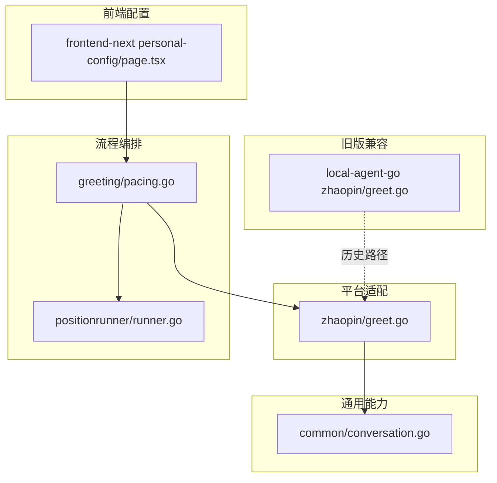
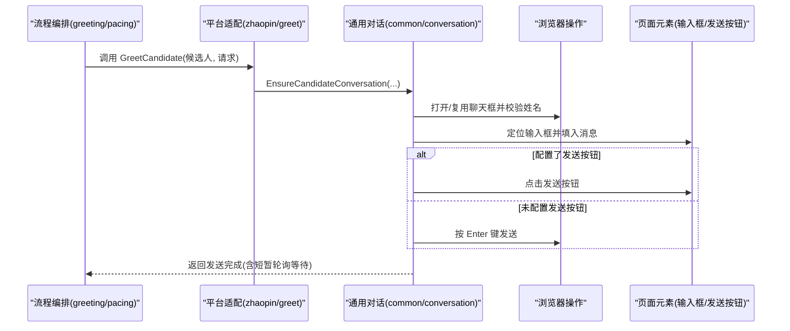
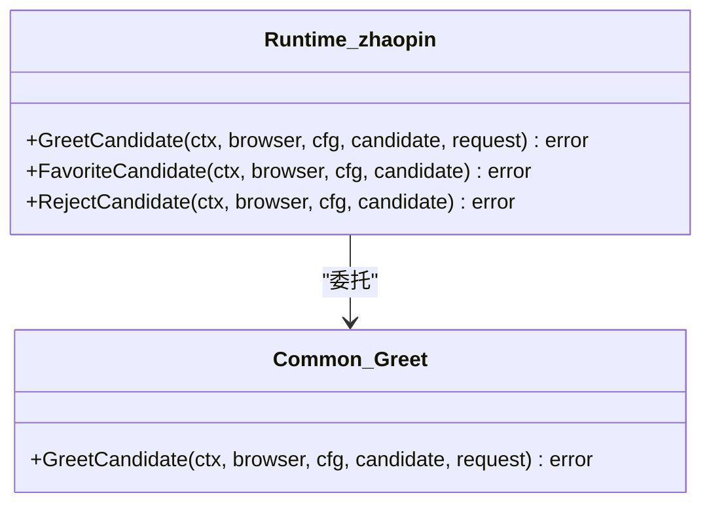
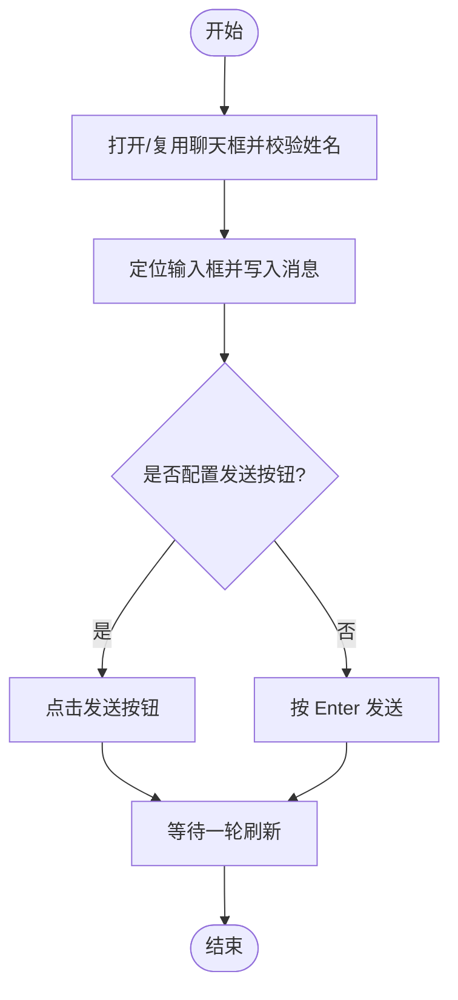
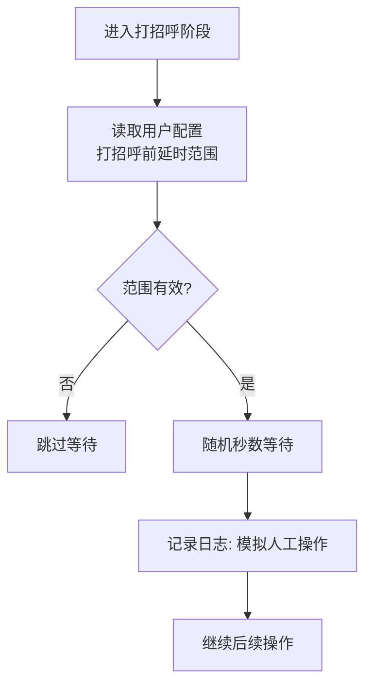
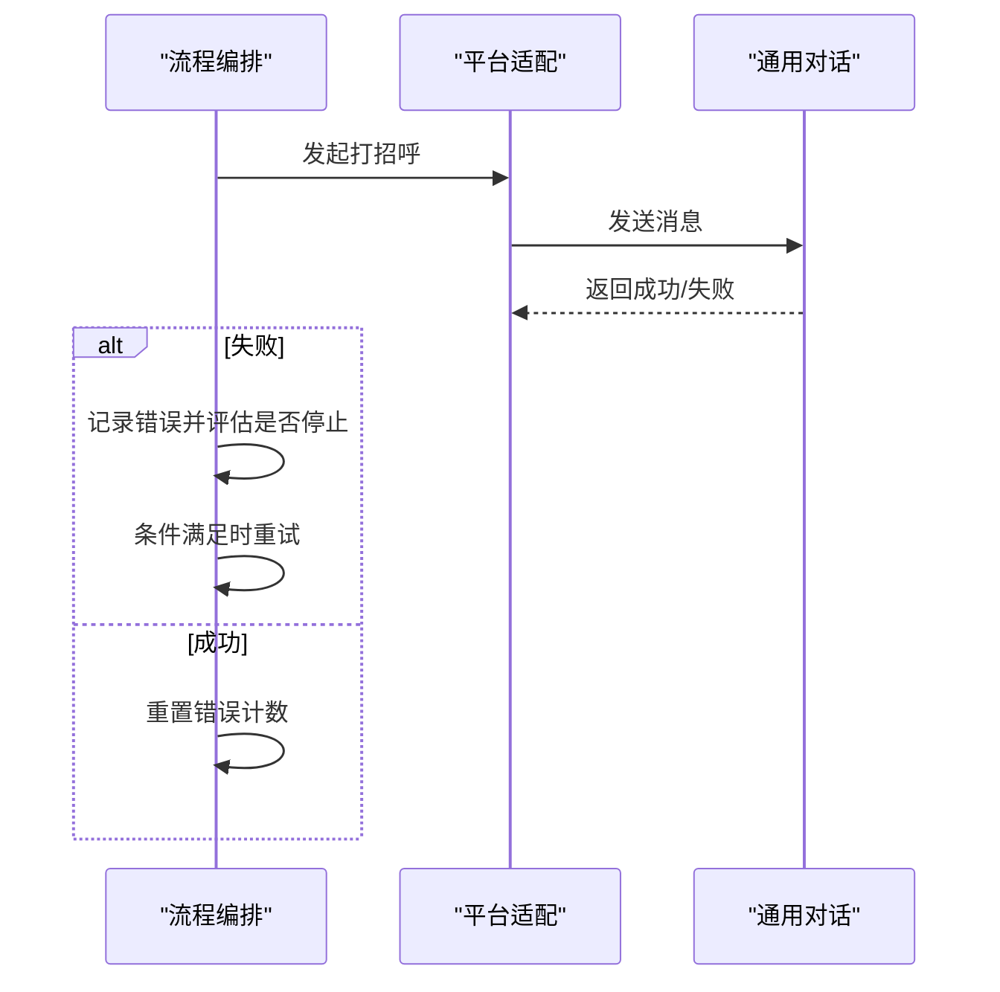
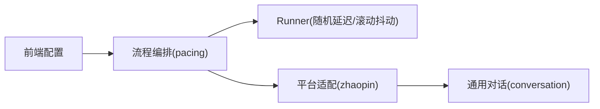

# 自动打招呼

<cite>
**本文引用的文件**
- [greet.go](file://goodhr5/local-agent-go/internal/platform/zhaopin/greet.go)
- [conversation.go](file://goodhr5/local-agent-go/internal/platform/common/conversation.go)
- [pacing.go](file://goodhr5/local-agent-go/internal/flow/greeting/pacing.go)
- [runner.go](file://goodhr5/local-agent-go/internal/positionrunner/runner.go)
- [page.tsx](file://goodhr5/cloud/frontend-next/app/admin/personal-config/page.tsx)
- [greet.go](file://goodhr5/local-agent-go/internal/platforms/zhaopin/greet.go)
</cite>

## 目录
1. [简介](#简介)
2. [项目结构](#项目结构)
3. [核心组件](#核心组件)
4. [架构总览](#架构总览)
5. [详细组件分析](#详细组件分析)
6. [依赖关系分析](#依赖关系分析)
7. [性能与频率控制](#性能与频率控制)
8. [故障排查指南](#故障排查指南)
9. [结论](#结论)
10. [附录](#附录)

## 简介
本文件面向前程无忧（智联招聘）平台的“自动打招呼”能力，系统化说明消息生成策略、发送执行流程、频率控制与防检测机制、状态跟踪与重试、效果分析与A/B测试支持，以及与其他平台的差异化处理。文档以代码为依据，提供可追溯的章节来源和图示来源，便于研发与运营协同落地。

## 项目结构
自动打招呼能力由“平台适配层 + 通用对话能力 + 流程编排 + 前端配置 + 旧版兼容实现”构成：
- 平台适配层：针对智联招聘封装 GreetCandidate/FavoriteCandidate/RejectCandidate 等动作。
- 通用对话能力：统一处理候选人聊天框打开、输入框定位、发送按钮点击或回车提交、轮询等待等。
- 流程编排：负责批量处理未读会话、错误策略、轮次控制与休息计划。
- 前端配置：提供“打招呼前延时”“模拟休息”等用户可调参数。
- 旧版兼容：保留通过后端接口触发打招呼的调用路径。

**图表来源**
- [greet.go:11-14](file://goodhr5/local-agent-go/internal/platform/zhaopin/greet.go#L11-L14)
- [conversation.go:18-41](file://goodhr5/local-agent-go/internal/platform/common/conversation.go#L18-L41)
- [pacing.go:22-31](file://goodhr5/local-agent-go/internal/flow/greeting/pacing.go#L22-L31)
- [runner.go:420-447](file://goodhr5/local-agent-go/internal/positionrunner/runner.go#L420-L447)
- [page.tsx:446-454](file://goodhr5/cloud/frontend-next/app/admin/personal-config/page.tsx#L446-L454)
- [greet.go:11-21](file://goodhr5/local-agent-go/internal/platforms/zhaopin/greet.go#L11-L21)

**章节来源**
- [greet.go:11-14](file://goodhr5/local-agent-go/internal/platform/zhaopin/greet.go#L11-L14)
- [conversation.go:18-41](file://goodhr5/local-agent-go/internal/platform/common/conversation.go#L18-L41)
- [pacing.go:22-31](file://goodhr5/local-agent-go/internal/flow/greeting/pacing.go#L22-L31)
- [runner.go:420-447](file://goodhr5/local-agent-go/internal/positionrunner/runner.go#L420-L447)
- [page.tsx:446-454](file://goodhr5/cloud/frontend-next/app/admin/personal-config/page.tsx#L446-L454)
- [greet.go:11-21](file://goodhr5/local-agent-go/internal/platforms/zhaopin/greet.go#L11-L21)

## 核心组件
- 平台适配层（智联招聘）
  - 对外暴露 GreetCandidate，内部委托通用打招呼流程，确保跨平台一致性。
- 通用对话能力
  - EnsureCandidateConversation/SendCandidateMessage/sendMessage：负责聊天框打开、候选人校验、输入框定位、发送按钮点击或回车提交、发送后轮询等待。
- 流程编排
  - pacing：基于用户偏好生成“模拟休息”计划；结合 Runner 的随机延迟与滚动抖动，降低被检测风险。
- 前端配置
  - “打招呼前延时”“模拟休息”等参数直接影响运行节奏与风控表现。
- 旧版兼容
  - 通过后端接口触发可见性与打招呼动作，作为历史路径保留。

**章节来源**
- [greet.go:11-14](file://goodhr5/local-agent-go/internal/platform/zhaopin/greet.go#L11-L14)
- [conversation.go:146-159](file://goodhr5/local-agent-go/internal/platform/common/conversation.go#L146-L159)
- [conversation.go:347-367](file://goodhr5/local-agent-go/internal/platform/common/conversation.go#L347-L367)
- [pacing.go:22-31](file://goodhr5/local-agent-go/internal/flow/greeting/pacing.go#L22-L31)
- [runner.go:420-447](file://goodhr5/local-agent-go/internal/positionrunner/runner.go#L420-L447)
- [page.tsx:446-454](file://goodhr5/cloud/frontend-next/app/admin/personal-config/page.tsx#L446-L454)
- [greet.go:11-21](file://goodhr5/local-agent-go/internal/platforms/zhaopin/greet.go#L11-L21)

## 架构总览
下图展示从“岗位运行/任务编排”到“浏览器交互”的关键调用链，覆盖消息生成、发送与等待确认。

**图表来源**
- [greet.go:11-14](file://goodhr5/local-agent-go/internal/platform/zhaopin/greet.go#L11-L14)
- [conversation.go:18-41](file://goodhr5/local-agent-go/internal/platform/common/conversation.go#L18-L41)
- [conversation.go:146-159](file://goodhr5/local-agent-go/internal/platform/common/conversation.go#L146-L159)
- [conversation.go:347-367](file://goodhr5/local-agent-go/internal/platform/common/conversation.go#L347-L367)

## 详细组件分析

### 组件A：智联招聘打招呼入口
- 职责：将平台特定的候选人与请求透传到通用打招呼流程，保证多平台一致行为。
- 关键点：
  - 接收候选人信息与请求上下文。
  - 委托 common.GreetCandidate 完成实际交互。
  - 保持扩展点以便未来增加收藏/不合适等动作。

**图表来源**
- [greet.go:11-14](file://goodhr5/local-agent-go/internal/platform/zhaopin/greet.go#L11-L14)

**章节来源**
- [greet.go:11-14](file://goodhr5/local-agent-go/internal/platform/zhaopin/greet.go#L11-L14)

### 组件B：通用对话与消息发送
- 职责：统一处理候选人聊天框打开、候选人身份校验、输入框定位、发送按钮点击或回车提交、发送后轮询等待。
- 关键流程：
  - EnsureCandidateConversation：优先复用已有聊天框，否则从卡片或联系人列表切换至目标候选人。
  - SendCandidateMessage：校验聊天框归属后，调用 sendMessage。
  - sendMessage：先写入输入框，再根据是否配置发送按钮选择点击或按 Enter；发送后等待一轮刷新。

**图表来源**
- [conversation.go:18-41](file://goodhr5/local-agent-go/internal/platform/common/conversation.go#L18-L41)
- [conversation.go:146-159](file://goodhr5/local-agent-go/internal/platform/common/conversation.go#L146-L159)
- [conversation.go:347-367](file://goodhr5/local-agent-go/internal/platform/common/conversation.go#L347-L367)

**章节来源**
- [conversation.go:18-41](file://goodhr5/local-agent-go/internal/platform/common/conversation.go#L18-L41)
- [conversation.go:146-159](file://goodhr5/local-agent-go/internal/platform/common/conversation.go#L146-L159)
- [conversation.go:347-367](file://goodhr5/local-agent-go/internal/platform/common/conversation.go#L347-L367)

### 组件C：发送频率控制与防检测
- 随机延迟：Runner 提供 delayRandomRange，在指定范围内随机等待，并将“模拟人工操作”写入日志。
- 滚动抖动：randomScrollDistance 围绕基准距离产生抖动，避免固定步长。
- 用户配置：前端“打招呼前延时”“模拟休息”等参数驱动运行节奏。
- 休息计划：pacing 根据用户偏好计算本次任务的休息次数与触发点。

**图表来源**
- [runner.go:420-447](file://goodhr5/local-agent-go/internal/positionrunner/runner.go#L420-L447)
- [page.tsx:446-454](file://goodhr5/cloud/frontend-next/app/admin/personal-config/page.tsx#L446-L454)
- [pacing.go:22-31](file://goodhr5/local-agent-go/internal/flow/greeting/pacing.go#L22-L31)

**章节来源**
- [runner.go:420-447](file://goodhr5/local-agent-go/internal/positionrunner/runner.go#L420-L447)
- [page.tsx:446-454](file://goodhr5/cloud/frontend-next/app/admin/personal-config/page.tsx#L446-L454)
- [pacing.go:22-31](file://goodhr5/local-agent-go/internal/flow/greeting/pacing.go#L22-L31)

### 组件D：发送状态跟踪与失败重试
- 状态跟踪：通用对话在发送后会进行短暂轮询等待，确保聊天组件刷新完成后再进行关闭等后续动作，提升稳定性。
- 失败重试：流程编排对连续错误采用错误策略记录与停止阈值控制；若单次错误恢复，则重置计数器继续处理。
- 邮件通知（相关能力）：后端邮件模板包含“今日打招呼”“本次跳过”等统计字段，可用于结果回溯与告警。

**图表来源**
- [conversation.go:347-367](file://goodhr5/local-agent-go/internal/platform/common/conversation.go#L347-L367)
- [flow.go:93-133](file://goodhr5/local-agent-go/internal/flow/auto_reply/flow.go#L93-L133)

**章节来源**
- [conversation.go:347-367](file://goodhr5/local-agent-go/internal/platform/common/conversation.go#L347-L367)
- [flow.go:93-133](file://goodhr5/local-agent-go/internal/flow/auto_reply/flow.go#L93-L133)

### 组件E：消息效果分析与A/B测试支持
- 指标采集：流程编排与 Runner 会记录操作日志（如“模拟人工操作”），便于统计成功率、失败率与耗时分布。
- A/B实验建议：
  - 维度：打招呼前延时区间、点击频率、详情查看概率、休息策略。
  - 指标：投递成功率、回复率、举报/封号风险事件、人均成本。
  - 方法：按用户或任务粒度分流，对比不同配置组合的效果差异。

[本节为概念性内容，不直接引用具体文件]

### 组件F：与其他平台的差异化处理
- 智联招聘：通过平台适配层委托通用流程，强调“继续沟通”入口与右侧联系人列表双路径打开聊天框。
- 其他平台：同样遵循“通用对话能力”，但选择器与入口差异由各自平台配置承担，适配层仅做最小转发。
- 旧版兼容：保留通过后端接口触发的可见性与打招呼调用，用于历史数据与迁移场景。

**章节来源**
- [greet.go:11-14](file://goodhr5/local-agent-go/internal/platform/zhaopin/greet.go#L11-L14)
- [conversation.go:18-41](file://goodhr5/local-agent-go/internal/platform/common/conversation.go#L18-L41)
- [greet.go:11-21](file://goodhr5/local-agent-go/internal/platforms/zhaopin/greet.go#L11-L21)

## 依赖关系分析
- 平台适配层依赖通用对话能力，屏蔽平台差异。
- 流程编排依赖用户偏好与 Runner 的随机延迟能力，形成“策略+执行”的分层。
- 前端配置影响运行时行为，需与本地 Agent 的配置同步。

**图表来源**
- [page.tsx:446-454](file://goodhr5/cloud/frontend-next/app/admin/personal-config/page.tsx#L446-L454)
- [pacing.go:22-31](file://goodhr5/local-agent-go/internal/flow/greeting/pacing.go#L22-L31)
- [runner.go:420-447](file://goodhr5/local-agent-go/internal/positionrunner/runner.go#L420-L447)
- [greet.go:11-14](file://goodhr5/local-agent-go/internal/platform/zhaopin/greet.go#L11-L14)
- [conversation.go:146-159](file://goodhr5/local-agent-go/internal/platform/common/conversation.go#L146-L159)

**章节来源**
- [page.tsx:446-454](file://goodhr5/cloud/frontend-next/app/admin/personal-config/page.tsx#L446-L454)
- [pacing.go:22-31](file://goodhr5/local-agent-go/internal/flow/greeting/pacing.go#L22-L31)
- [runner.go:420-447](file://goodhr5/local-agent-go/internal/positionrunner/runner.go#L420-L447)
- [greet.go:11-14](file://goodhr5/local-agent-go/internal/platform/zhaopin/greet.go#L11-L14)
- [conversation.go:146-159](file://goodhr5/local-agent-go/internal/platform/common/conversation.go#L146-L159)

## 性能与频率控制
- 随机延迟：使用 delayRandomRange 在配置范围内随机等待，避免固定节拍。
- 滚动抖动：randomScrollDistance 产生自然滚动幅度变化。
- 用户可调：通过“打招呼前延时”“模拟休息”等参数控制整体节奏。
- 建议：
  - 根据账号历史表现动态调整延时区间与休息策略。
  - 在高并发或多账号场景下，合理设置“处理多少人后休息”，降低集中操作风险。

**章节来源**
- [runner.go:420-447](file://goodhr5/local-agent-go/internal/positionrunner/runner.go#L420-L447)
- [page.tsx:446-454](file://goodhr5/cloud/frontend-next/app/admin/personal-config/page.tsx#L446-L454)
- [pacing.go:22-31](file://goodhr5/local-agent-go/internal/flow/greeting/pacing.go#L22-L31)

## 故障排查指南
- 常见问题
  - 聊天框未打开或候选人不一致：检查 EnsureCandidateConversation 与 WaitCandidateConversation 的轮询逻辑。
  - 发送失败：确认是否配置了发送按钮；若无，系统将尝试按 Enter 发送。
  - 频繁失败导致中断：查看流程的错误策略与连续错误计数，必要时调整重试间隔或暂停任务。
- 定位步骤
  - 查看 Runner 日志中的“模拟人工操作”记录，确认随机延迟是否生效。
  - 核对前端“打招呼前延时”“模拟休息”配置是否与预期一致。
  - 若使用旧版路径，检查后端接口调用是否成功。

**章节来源**
- [conversation.go:18-41](file://goodhr5/local-agent-go/internal/platform/common/conversation.go#L18-L41)
- [conversation.go:347-367](file://goodhr5/local-agent-go/internal/platform/common/conversation.go#L347-L367)
- [runner.go:420-447](file://goodhr5/local-agent-go/internal/positionrunner/runner.go#L420-L447)
- [page.tsx:446-454](file://goodhr5/cloud/frontend-next/app/admin/personal-config/page.tsx#L446-L454)
- [greet.go:11-21](file://goodhr5/local-agent-go/internal/platforms/zhaopin/greet.go#L11-L21)

## 结论
本方案通过“平台适配 + 通用对话 + 流程编排”的分层设计，实现了智联招聘自动打招呼的稳定执行与可控节奏。借助随机延迟、滚动抖动与用户可配策略，有效降低被检测风险；通过轮询等待与错误策略，保障投递可靠性。建议在上线后持续采集指标并进行A/B测试，优化配置以提升投递质量与安全性。

## 附录
- 术语
  - 继续沟通：平台在首次消息后出现的二次沟通入口。
  - 联系人列表：推荐页右侧的候选人侧边栏。
  - 轮询等待：发送后短暂等待界面刷新，确保后续操作稳定。
- 参考路径
  - 平台适配：[greet.go:11-14](file://goodhr5/local-agent-go/internal/platform/zhaopin/greet.go#L11-L14)
  - 通用对话：[conversation.go:146-159](file://goodhr5/local-agent-go/internal/platform/common/conversation.go#L146-L159)、[conversation.go:347-367](file://goodhr5/local-agent-go/internal/platform/common/conversation.go#L347-L367)
  - 频率控制：[runner.go:420-447](file://goodhr5/local-agent-go/internal/positionrunner/runner.go#L420-L447)、[page.tsx:446-454](file://goodhr5/cloud/frontend-next/app/admin/personal-config/page.tsx#L446-L454)、[pacing.go:22-31](file://goodhr5/local-agent-go/internal/flow/greeting/pacing.go#L22-L31)
  - 旧版兼容：[greet.go:11-21](file://goodhr5/local-agent-go/internal/platforms/zhaopin/greet.go#L11-L21)