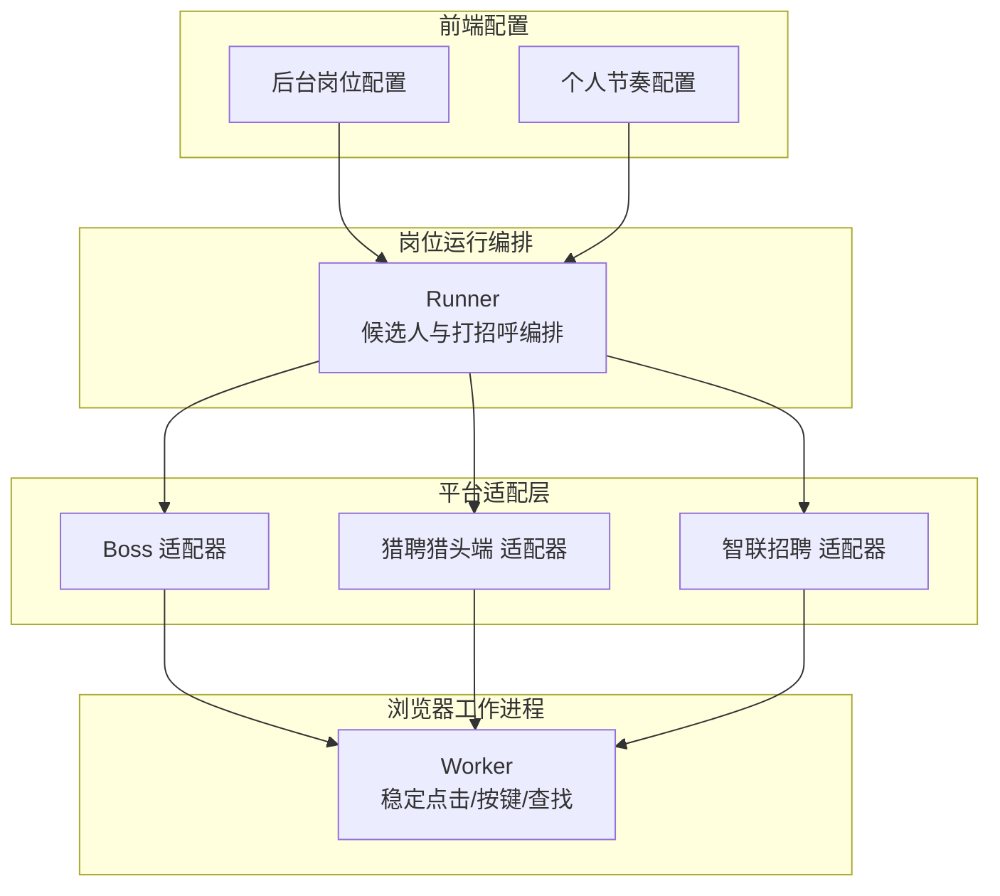
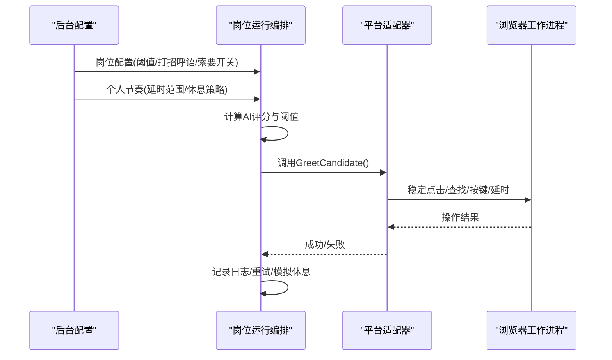
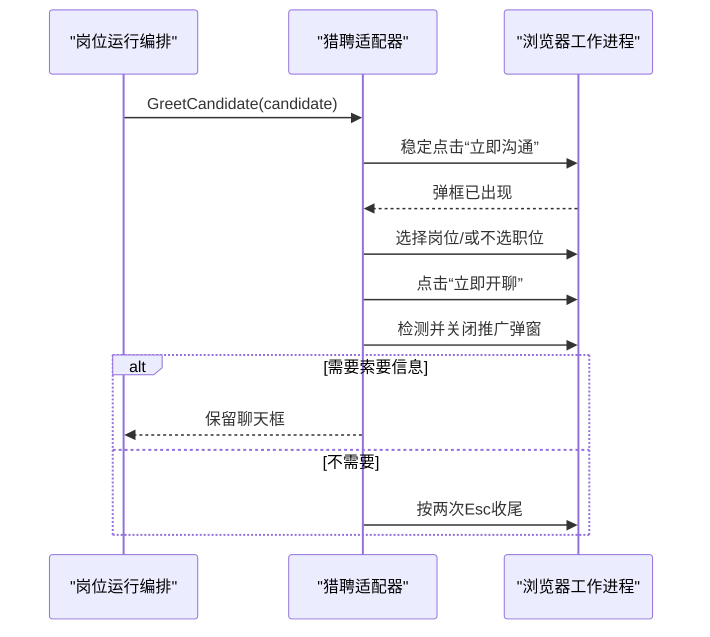
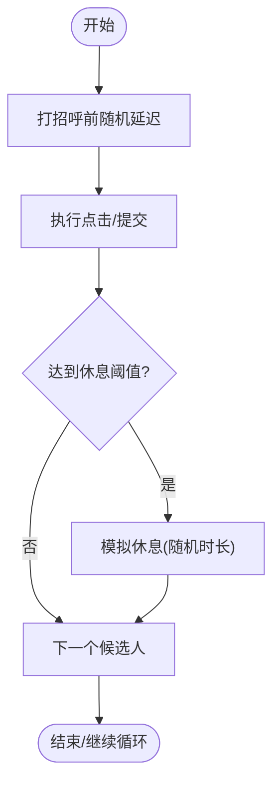
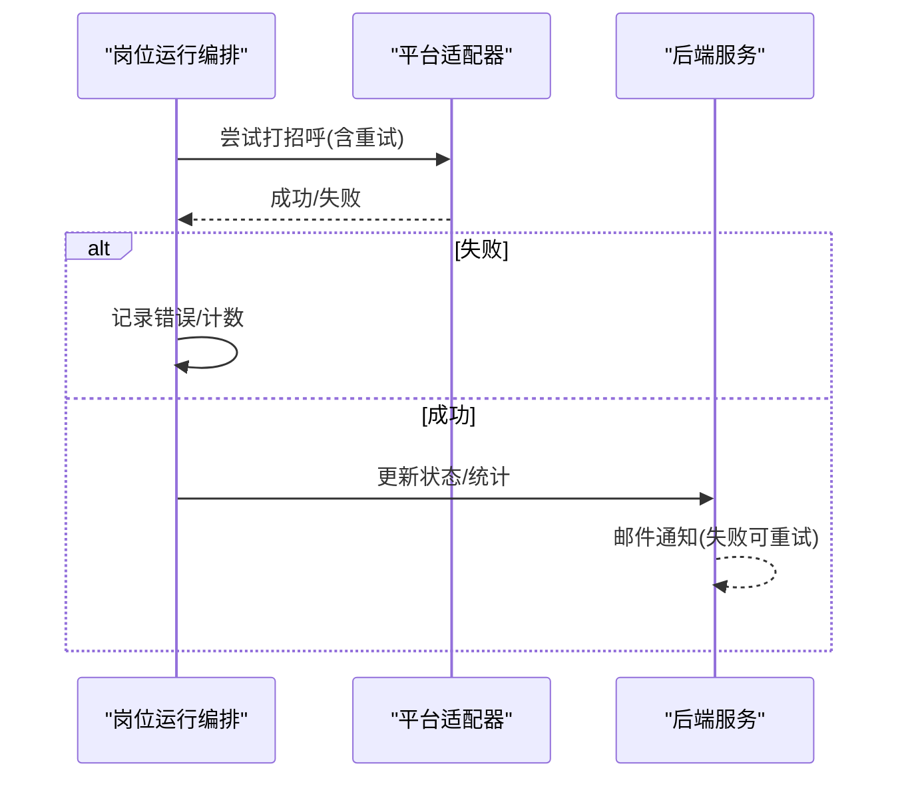
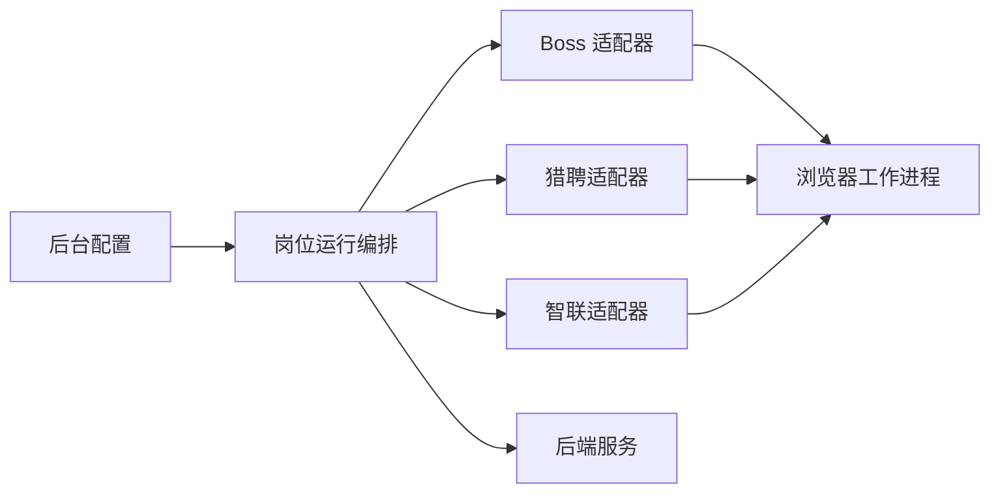

# 自动打招呼

<cite>
**本文引用的文件**
- [candidate.go](file://goodhr5/local-agent-go/internal/positionrunner/candidate.go)
- [greet.go（猎聘）](file://goodhr5/local-agent-go/internal/platforms/hliepin/greet.go)
- [greet.go（Boss）](file://goodhr5/local-agent-go/internal/platforms/boss/greet.go)
- [greet.go（智联）](file://goodhr5/local-agent-go/internal/platforms/zhaopin/greet.go)
- [greet-policy.js](file://goodhr5/local-agent-go/worker-node/src/greet-policy.js)
- [positions/page.tsx](file://goodhr5/cloud/frontend-next/app/admin/positions/page.tsx)
- [personal-config/page.tsx](file://goodhr5/cloud/frontend-next/app/admin/personal-config/page.tsx)
- [0019_upgrade_position_ai_prompts_to_score_mode.down.sql](file://goodhr5/cloud/backend/db/migrations/0019_upgrade_position_ai_prompts_to_score_mode.down.sql)
- [chatflow_test.go](file://goodhr5/local-agent-go/internal/platforms/chatflow/chatflow_test.go)
- [position_execution_test.go](file://goodhr5/cloud/backend/internal/httpapi/position_execution_test.go)
</cite>

## 目录
1. [简介](#简介)
2. [项目结构](#项目结构)
3. [核心组件](#核心组件)
4. [架构总览](#架构总览)
5. [详细组件分析](#详细组件分析)
6. [依赖关系分析](#依赖关系分析)
7. [性能与防检测](#性能与防检测)
8. [故障排查指南](#故障排查指南)
9. [结论](#结论)
10. [附录](#附录)

## 简介
本文件面向前程无忧平台（在本仓库中通过通用流程与平台适配层实现）的“自动打招呼”能力，系统性说明：
- 打招呼消息生成策略：个性化模板、动态变量替换、上下文感知。
- 发送执行流程：按钮定位、输入框操作、提交验证。
- 频率控制与防检测：随机延迟、行为模拟、风险控制。
- 状态跟踪与失败重试：确保投递可靠性。
- 效果分析与A/B测试支持：指标采集与实验分流。
- 多平台差异化处理：Boss、猎聘猎头端、智联招聘等平台的差异点。

## 项目结构
自动打招呼由“岗位运行编排 + 平台适配 + 浏览器工作进程 + 前端配置”共同完成：
- 岗位运行编排：负责候选人筛选、打分阈值判断、打招呼前延时、重试与休息模拟。
- 平台适配：各平台具体点击、弹窗处理、开聊流程封装。
- 浏览器工作进程：提供稳定点击、元素查找、按键模拟、截图等底层能力。
- 前端配置：岗位级提示词、阈值、首次打招呼语、索要动作开关；个人节奏与模拟休息参数。

图表来源
- [candidate.go:163-231](file://goodhr5/local-agent-go/internal/positionrunner/candidate.go#L163-L231)
- [greet.go（猎聘）:31-110](file://goodhr5/local-agent-go/internal/platforms/hliepin/greet.go#L31-L110)
- [greet.go（Boss）:11-23](file://goodhr5/local-agent-go/internal/platforms/boss/greet.go#L11-L23)
- [greet.go（智联）:11-22](file://goodhr5/local-agent-go/internal/platforms/zhaopin/greet.go#L11-L22)
- [positions/page.tsx:1788-1811](file://goodhr5/cloud/frontend-next/app/admin/positions/page.tsx#L1788-L1811)
- [personal-config/page.tsx:121-161](file://goodhr5/cloud/frontend-next/app/admin/personal-config/page.tsx#L121-L161)

章节来源
- [candidate.go:163-231](file://goodhr5/local-agent-go/internal/positionrunner/candidate.go#L163-L231)
- [greet.go（猎聘）:31-110](file://goodhr5/local-agent-go/internal/platforms/hliepin/greet.go#L31-L110)
- [greet.go（Boss）:11-23](file://goodhr5/local-agent-go/internal/platforms/boss/greet.go#L11-L23)
- [greet.go（智联）:11-22](file://goodhr5/local-agent-go/internal/platforms/zhaopin/greet.go#L11-L22)
- [positions/page.tsx:1788-1811](file://goodhr5/cloud/frontend-next/app/admin/positions/page.tsx#L1788-L1811)
- [personal-config/page.tsx:121-161](file://goodhr5/cloud/frontend-next/app/admin/personal-config/page.tsx#L121-L161)

## 核心组件
- 岗位运行编排器（Runner）
  - 负责候选人打分阈值判定、打招呼前人工化延时、重试、以及按配置的“模拟休息”。
  - 维护候选人信息请求（手机号/微信/简历）与追加问候语的决策。
- 平台适配器
  - Boss/智联：通过统一接口上报可见性与触发打招呼。
  - 猎聘猎头端：完整实现开聊弹框等待、职位选择、推广弹窗关闭、收尾Esc等。
- 浏览器工作进程（Worker）
  - 提供稳定点击、元素查找、按键模拟、延时等原子能力，供平台适配器调用。
- 前端配置
  - 岗位级：首次打招呼语、AI提示词、阈值、是否索要信息等。
  - 个人级：点击频率、详情打开概率、打招呼前延时范围、模拟休息策略。

章节来源
- [candidate.go:112-161](file://goodhr5/local-agent-go/internal/positionrunner/candidate.go#L112-L161)
- [greet.go（猎聘）:31-110](file://goodhr5/local-agent-go/internal/platforms/hliepin/greet.go#L31-L110)
- [greet.go（Boss）:11-23](file://goodhr5/local-agent-go/internal/platforms/boss/greet.go#L11-L23)
- [greet.go（智联）:11-22](file://goodhr5/local-agent-go/internal/platforms/zhaopin/greet.go#L11-L22)
- [positions/page.tsx:1788-1811](file://goodhr5/cloud/frontend-next/app/admin/positions/page.tsx#L1788-L1811)
- [personal-config/page.tsx:121-161](file://goodhr5/cloud/frontend-next/app/admin/personal-config/page.tsx#L121-L161)

## 架构总览
下图展示从岗位运行到平台适配再到浏览器操作的端到端流程，并标注关键控制点（阈值、延时、重试）。

图表来源
- [candidate.go:163-231](file://goodhr5/local-agent-go/internal/positionrunner/candidate.go#L163-L231)
- [greet.go（猎聘）:31-110](file://goodhr5/local-agent-go/internal/platforms/hliepin/greet.go#L31-L110)
- [greet.go（Boss）:11-23](file://goodhr5/local-agent-go/internal/platforms/boss/greet.go#L11-L23)
- [greet.go（智联）:11-22](file://goodhr5/local-agent-go/internal/platforms/zhaopin/greet.go#L11-L22)

## 详细组件分析

### 打招呼消息生成策略（模板、变量、上下文）
- 模板与变量
  - 岗位级“首次打招呼语”作为基础模板，结合岗位描述、岗位要求、候选人匹配度等信息进行上下文拼装。
  - AI提示词用于详情分析与最终打分，间接影响是否执行打招呼及后续索要动作。
- 上下文感知
  - 根据岗位快照中的AI配置读取阈值（打招呼阈值、索要阈值），决定是否需要索要信息或仅发送问候。
  - 候选人数据中包含AI评分字段，用于严格比较阈值以决定是否继续。
- 配置入口
  - 前台岗位页面提供“首次打招呼语”“打招呼阈值分”“打招呼后自动索要”等选项。
  - 数据库迁移历史显示系统已从纯文本提示词演进为“分数模式”，便于量化控制。

章节来源
- [positions/page.tsx:1788-1811](file://goodhr5/cloud/frontend-next/app/admin/positions/page.tsx#L1788-L1811)
- [positions/page.tsx:2222-2252](file://goodhr5/cloud/frontend-next/app/admin/positions/page.tsx#L2222-L2252)
- [0019_upgrade_position_ai_prompts_to_score_mode.down.sql:1-4](file://goodhr5/cloud/backend/db/migrations/0019_upgrade_position_ai_prompts_to_score_mode.down.sql#L1-L4)
- [candidate.go:112-161](file://goodhr5/local-agent-go/internal/positionrunner/candidate.go#L112-L161)

### 发送执行流程（按钮定位、输入框操作、提交验证）
- Boss/智联
  - 通过统一接口上报“可见性”与“打招呼”两个阶段，便于调试与追踪。
- 猎聘猎头端
  - 稳定点击“立即沟通”按钮，轮询等待开聊弹框出现。
  - 在弹框中选择当前岗位（若开启发布职位匹配模式），否则走“不选择职位开聊”。
  - 点击“立即开聊”，随后处理偶发的推广弹窗，必要时按两次Esc收尾。
  - 若需要索要信息，则保留聊天框交由后续流程处理。
- 工作进程能力
  - 使用稳定点击、元素查找、按键模拟、延时等原子能力，保证跨平台一致性。

图表来源
- [greet.go（猎聘）:31-110](file://goodhr5/local-agent-go/internal/platforms/hliepin/greet.go#L31-L110)
- [greet.go（猎聘）:118-143](file://goodhr5/local-agent-go/internal/platforms/hliepin/greet.go#L118-L143)
- [greet.go（Boss）:11-23](file://goodhr5/local-agent-go/internal/platforms/boss/greet.go#L11-L23)
- [greet.go（智联）:11-22](file://goodhr5/local-agent-go/internal/platforms/zhaopin/greet.go#L11-L22)

章节来源
- [greet.go（猎聘）:31-110](file://goodhr5/local-agent-go/internal/platforms/hliepin/greet.go#L31-L110)
- [greet.go（猎聘）:118-143](file://goodhr5/local-agent-go/internal/platforms/hliepin/greet.go#L118-L143)
- [greet.go（Boss）:11-23](file://goodhr5/local-agent-go/internal/platforms/boss/greet.go#L11-L23)
- [greet.go（智联）:11-22](file://goodhr5/local-agent-go/internal/platforms/zhaopin/greet.go#L11-L22)

### 发送频率控制与防检测机制
- 随机延迟
  - 打招呼前存在可配置的随机等待区间，避免固定节奏被识别。
- 行为模拟
  - 点击频率、详情打开概率、打开/关闭详情前后延时均可配置，贴近真实用户行为。
- 风险控制
  - 每次处理一定数量候选人后进入“模拟休息”，降低连续操作风险。
  - 不同平台对后续按钮点击策略有差异（例如智联首次打招呼后不再点击继续聊天）。

图表来源
- [candidate.go:201-231](file://goodhr5/local-agent-go/internal/positionrunner/candidate.go#L201-L231)
- [personal-config/page.tsx:121-161](file://goodhr5/cloud/frontend-next/app/admin/personal-config/page.tsx#L121-L161)
- [greet-policy.js:1-12](file://goodhr5/local-agent-go/worker-node/src/greet-policy.js#L1-L12)

章节来源
- [candidate.go:201-231](file://goodhr5/local-agent-go/internal/positionrunner/candidate.go#L201-L231)
- [personal-config/page.tsx:121-161](file://goodhr5/cloud/frontend-next/app/admin/personal-config/page.tsx#L121-L161)
- [greet-policy.js:1-12](file://goodhr5/local-agent-go/worker-node/src/greet-policy.js#L1-L12)

### 发送状态跟踪与失败重试
- 重试机制
  - 单个候选人的打招呼执行带重试次数上限，失败时记录错误并继续后续流程。
- 状态与日志
  - 平台适配器在关键阶段写入日志（如“准备调用”“点击阶段”），便于问题定位。
  - 岗位运行过程中会记录模拟人工操作等待时间、休息计划等。
- 外部通知重试
  - 后端在完成状态同步时若邮件发送失败，不会提前写入完成状态，待恢复后可重试发送。

图表来源
- [candidate.go:163-231](file://goodhr5/local-agent-go/internal/positionrunner/candidate.go#L163-L231)
- [greet.go（Boss）:11-23](file://goodhr5/local-agent-go/internal/platforms/boss/greet.go#L11-L23)
- [position_execution_test.go:301-362](file://goodhr5/cloud/backend/internal/httpapi/position_execution_test.go#L301-L362)

章节来源
- [candidate.go:163-231](file://goodhr5/local-agent-go/internal/positionrunner/candidate.go#L163-L231)
- [greet.go（Boss）:11-23](file://goodhr5/local-agent-go/internal/platforms/boss/greet.go#L11-L23)
- [position_execution_test.go:301-362](file://goodhr5/cloud/backend/internal/httpapi/position_execution_test.go#L301-L362)

### 消息效果分析与A/B测试支持
- 指标采集
  - 岗位运行日志包含今日/本次打招呼数、跳过数、失败原因等，可用于效果评估。
  - 后台邮件模板包含岗位运行状态、今日打招呼等字段，便于运营观察。
- A/B测试建议
  - 基于岗位级阈值与提示词进行分组对比（例如不同打招呼阈值、不同提示词模板），结合日志与转化率进行分析。
  - 利用“打招呼后自动索要”开关与阈值组合，形成多策略实验。

章节来源
- [positions/page.tsx:2222-2252](file://goodhr5/cloud/frontend-next/app/admin/positions/page.tsx#L2222-L2252)
- [mailer_test.go:35-64](file://goodhr5/cloud/backend/internal/httpapi/mailer_test.go#L35-L64)

### 与其他平台的差异化处理策略
- Boss/智联
  - 通过统一接口上报可见性与触发打招呼，简化平台差异。
- 猎聘猎头端
  - 复杂弹框处理：等待开聊弹框、选择岗位、推广弹窗关闭、收尾Esc。
  - 根据是否需要索要信息决定是否保留聊天框。
- 后续点击策略
  - 智联首次打招呼后不再点击继续聊天；其他平台保留原有后续按钮处理逻辑。

章节来源
- [greet.go（Boss）:11-23](file://goodhr5/local-agent-go/internal/platforms/boss/greet.go#L11-L23)
- [greet.go（智联）:11-22](file://goodhr5/local-agent-go/internal/platforms/zhaopin/greet.go#L11-L22)
- [greet.go（猎聘）:31-110](file://goodhr5/local-agent-go/internal/platforms/hliepin/greet.go#L31-L110)
- [greet-policy.js:1-12](file://goodhr5/local-agent-go/worker-node/src/greet-policy.js#L1-L12)

## 依赖关系分析
- Runner 依赖平台适配器的 GreetCandidate 接口，屏蔽平台差异。
- 平台适配器依赖浏览器工作进程的原子能力（稳定点击、查找、按键、延时）。
- 前端配置驱动 Runner 的行为（阈值、延时、休息策略）。
- 后端服务负责状态同步与通知，具备失败重试能力。

图表来源
- [candidate.go:163-231](file://goodhr5/local-agent-go/internal/positionrunner/candidate.go#L163-L231)
- [greet.go（猎聘）:31-110](file://goodhr5/local-agent-go/internal/platforms/hliepin/greet.go#L31-L110)
- [greet.go（Boss）:11-23](file://goodhr5/local-agent-go/internal/platforms/boss/greet.go#L11-L23)
- [greet.go（智联）:11-22](file://goodhr5/local-agent-go/internal/platforms/zhaopin/greet.go#L11-L22)

章节来源
- [candidate.go:163-231](file://goodhr5/local-agent-go/internal/positionrunner/candidate.go#L163-L231)
- [greet.go（猎聘）:31-110](file://goodhr5/local-agent-go/internal/platforms/hliepin/greet.go#L31-L110)
- [greet.go（Boss）:11-23](file://goodhr5/local-agent-go/internal/platforms/boss/greet.go#L11-L23)
- [greet.go（智联）:11-22](file://goodhr5/local-agent-go/internal/platforms/zhaopin/greet.go#L11-L22)

## 性能与防检测
- 性能
  - 使用稳定点击与轮询等待替代固定延迟，减少超时与误判。
  - 按需保留聊天框，避免不必要的DOM操作。
- 防检测
  - 随机延迟与模拟休息降低行为指纹特征。
  - 针对不同平台定制后续点击策略，避免机械式重复。
  - 通过日志记录关键阶段，便于调优与审计。

[本节为通用指导，不直接分析具体文件]

## 故障排查指南
- 常见问题
  - 开聊弹框未出现：检查稳定点击与轮询等待逻辑，确认页面渲染完成。
  - 推广弹窗遮挡：确认推广弹窗检测与关闭逻辑，必要时按Esc兜底。
  - 邮箱通知失败：后端完成状态同步失败时会返回非200，修复后可重试。
- 定位方法
  - 查看平台适配器的阶段日志（如“准备调用”“点击阶段”）。
  - 检查岗位运行日志中的模拟人工操作等待与休息计划。
  - 使用后台邮件模板字段核对统计数据。

章节来源
- [greet.go（猎聘）:118-143](file://goodhr5/local-agent-go/internal/platforms/hliepin/greet.go#L118-L143)
- [greet.go（猎聘）:297-334](file://goodhr5/local-agent-go/internal/platforms/hliepin/greet.go#L297-L334)
- [position_execution_test.go:301-362](file://goodhr5/cloud/backend/internal/httpapi/position_execution_test.go#L301-L362)

## 结论
本方案通过“岗位运行编排 + 平台适配 + 浏览器工作进程”的分层设计，实现了跨平台的自动打招呼能力。借助可配置的阈值、模板与节奏控制，既保证了消息的个性化与上下文感知，又通过随机延迟、模拟休息与差异化策略有效规避平台风控。同时，完善的日志与重试机制保障了投递的可靠性，为效果分析与A/B测试提供了数据基础。

[本节为总结，不直接分析具体文件]

## 附录
- 相关测试用例参考
  - 只点击勾选的索要按钮并确认弹框、未勾选不点击。
  - 配置发送按钮时点击按钮，未配置时按Enter。
  - 邮件模板渲染与流程帮助邮件模板校验。

章节来源
- [chatflow_test.go:146-179](file://goodhr5/local-agent-go/internal/platforms/chatflow/chatflow_test.go#L146-L179)
- [mailer_test.go:35-64](file://goodhr5/cloud/backend/internal/httpapi/mailer_test.go#L35-L64)
- [admin_email_test.go:50-78](file://goodhr5/cloud/backend/internal/httpapi/admin_email_test.go#L50-L78)