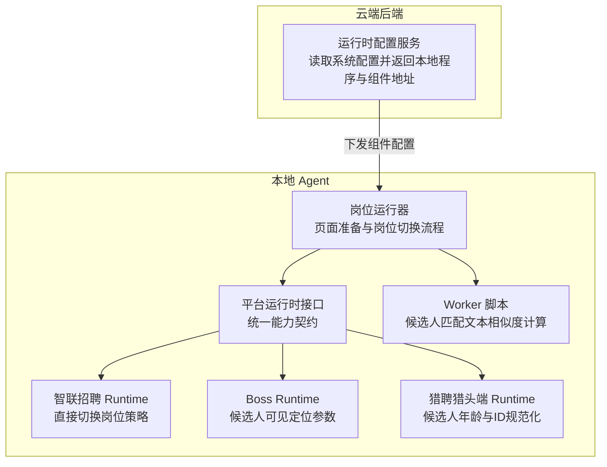
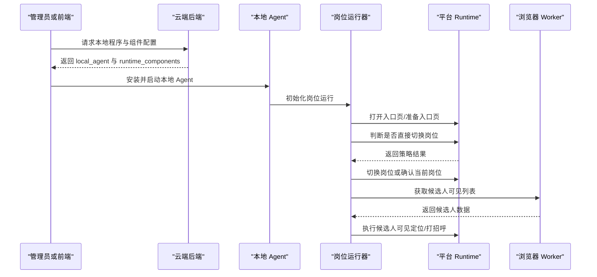
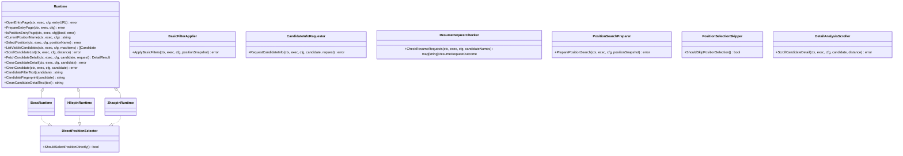
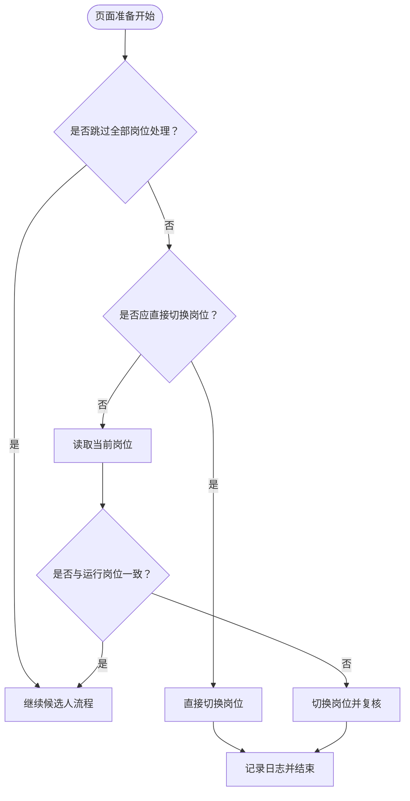
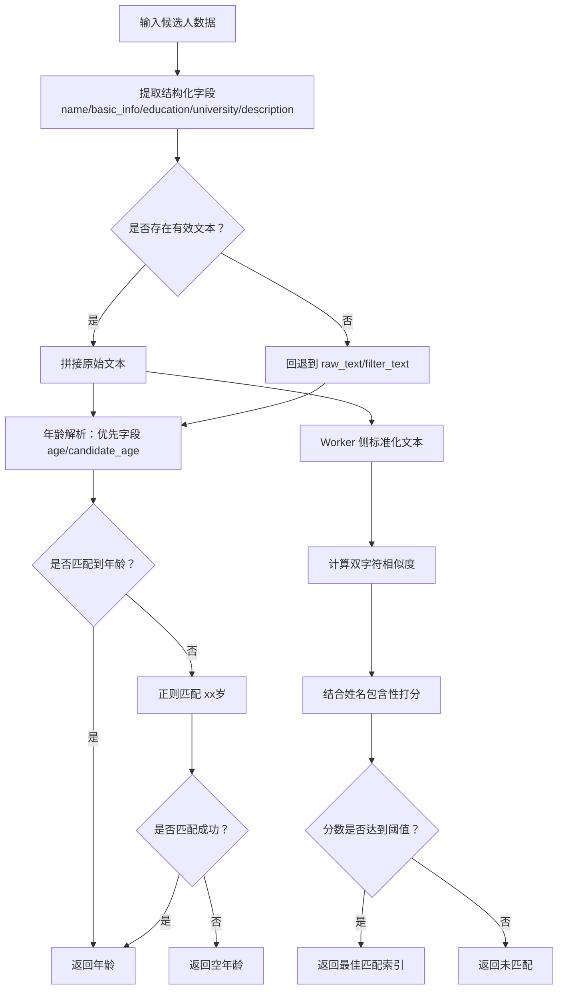
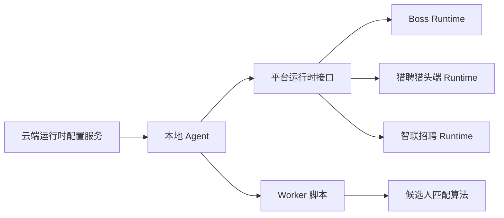

# 运行时配置

<cite>
**本文引用的文件**   
- [runtime_config.go](file://goodhr5/cloud/backend/internal/httpapi/runtime_config.go)
- [runtime.go](file://goodhr5/local-agent-go/internal/platformcore/runtime.go)
- [runtime.go](file://goodhr5/local-agent-go/internal/platforms/boss/runtime.go)
- [runtime.go](file://goodhr5/local-agent-go/internal/platforms/hliepin/runtime.go)
- [runtime.go](file://goodhr5/local-agent-go/internal/platforms/zhaopin/runtime.go)
- [scan.go](file://goodhr5/local-agent-go/internal/positionrunner/scan.go)
- [candidate-match.js](file://goodhr5/local-agent-go/worker-node/src/candidate-match.js)
- [client.go](file://goodhr5/local-agent-go/internal/cloudapi/client.go)
</cite>

## 目录
1. [引言](#引言)
2. [项目结构](#项目结构)
3. [核心组件](#核心组件)
4. [架构总览](#架构总览)
5. [详细组件分析](#详细组件分析)
6. [依赖关系分析](#依赖关系分析)
7. [性能与稳定性建议](#性能与稳定性建议)
8. [故障排查指南](#故障排查指南)
9. [结论](#结论)

## 引言
本文面向前程无忧平台（智联招聘）的运行时配置与行为，聚焦以下目标：
- 解释本地 Agent 侧平台 Runtime 的设计模式与生命周期。
- 说明 ShouldSelectPositionDirectly 的作用机制及智联招聘的特殊处理逻辑。
- 文档化候选人可见定位参数，包括 platform_id、platform_config、candidate_name 等字段含义与使用场景。
- 说明候选人匹配文本生成算法，包括字段提取、正则表达式年龄解析和动态列表重匹配流程。
- 提供运行时配置的最佳实践与性能优化建议。

## 项目结构
本主题涉及两个主要子系统：
- 云端后端：负责向已登录用户下发本地程序与运行组件配置。
- 本地 Agent：按平台实现 Runtime，驱动浏览器 Worker 执行岗位切换、候选人可见性检测、打招呼与信息索要等动作。

图表来源
- [runtime_config.go:10-45](file://goodhr5/cloud/backend/internal/httpapi/runtime_config.go#L10-L45)
- [runtime.go:54-127](file://goodhr5/local-agent-go/internal/platformcore/runtime.go#L54-L127)
- [runtime.go:11-22](file://goodhr5/local-agent-go/internal/platforms/zhaopin/runtime.go#L11-L22)
- [runtime.go:11-19](file://goodhr5/local-agent-go/internal/platforms/boss/runtime.go#L11-L19)
- [runtime.go:10-19](file://goodhr5/local-agent-go/internal/platforms/hliepin/runtime.go#L10-L19)
- [scan.go:544-603](file://goodhr5/local-agent-go/internal/positionrunner/scan.go#L544-L603)
- [candidate-match.js:3-12](file://goodhr5/local-agent-go/worker-node/src/candidate-match.js#L3-L12)

章节来源
- [runtime_config.go:10-45](file://goodhr5/cloud/backend/internal/httpapi/runtime_config.go#L10-L45)
- [runtime.go:54-127](file://goodhr5/local-agent-go/internal/platformcore/runtime.go#L54-L127)

## 核心组件
- 平台运行时接口：定义打开入口页、准备入口页、当前岗位名称、切换岗位、候选人可见列表、滚动、详情读取、打招呼、筛选文本、指纹、清理详情文本等统一能力；并提供可选的基础筛选应用、打招呼后信息索要、简历回复检查、岗位搜索准备、详情页滚动扩展能力。
- 平台 Runtime 实现：Boss、猎聘猎头端、智联招聘各自实现上述接口，并在候选人年龄解析、ID 规范化、候选人可见定位参数等方面体现平台差异。
- 岗位运行器：负责页面准备、岗位切换策略选择（跳过、直接切换、先读当前岗位再切换）、基础筛选应用等主流程控制。
- Worker 脚本：在动态列表中通过标准化文本与双字符相似度重新匹配目标候选人。

章节来源
- [runtime.go:54-127](file://goodhr5/local-agent-go/internal/platformcore/runtime.go#L54-L127)
- [runtime.go:11-22](file://goodhr5/local-agent-go/internal/platforms/zhaopin/runtime.go#L11-L22)
- [runtime.go:11-19](file://goodhr5/local-agent-go/internal/platforms/boss/runtime.go#L11-L19)
- [runtime.go:10-19](file://goodhr5/local-agent-go/internal/platforms/hliepin/runtime.go#L10-L19)
- [scan.go:544-603](file://goodhr5/local-agent-go/internal/positionrunner/scan.go#L544-L603)
- [candidate-match.js:3-12](file://goodhr5/local-agent-go/worker-node/src/candidate-match.js#L3-L12)

## 架构总览
运行时配置从云端下发到本地 Agent，再由本地 Agent 根据平台 Runtime 驱动浏览器 Worker 完成岗位切换与候选人可见性检测。

图表来源
- [runtime_config.go:22-45](file://goodhr5/cloud/backend/internal/httpapi/runtime_config.go#L22-L45)
- [scan.go:544-603](file://goodhr5/local-agent-go/internal/positionrunner/scan.go#L544-L603)
- [runtime.go:54-82](file://goodhr5/local-agent-go/internal/platformcore/runtime.go#L54-L82)

## 详细组件分析

### 平台运行时接口与生命周期
- 生命周期阶段：
  - 打开入口页：进入平台指定入口 URL。
  - 准备入口页：处理弹窗、初始化交互等前置动作。
  - 岗位相关：读取当前岗位、切换岗位、判断是否需要跳过或直切。
  - 候选人相关：列出可见候选人、滚动列表、读取详情、关闭详情、打招呼、索要信息、检查回复。
  - 辅助能力：基础筛选应用、岗位搜索准备、详情页滚动。
- 设计要点：
  - 通过接口抽象平台差异，便于新增平台时仅实现必要方法。
  - 可选能力以独立接口暴露，避免对不支持的平台产生副作用。

图表来源
- [runtime.go:54-127](file://goodhr5/local-agent-go/internal/platformcore/runtime.go#L54-L127)
- [runtime.go:11-19](file://goodhr5/local-agent-go/internal/platforms/boss/runtime.go#L11-L19)
- [runtime.go:10-19](file://goodhr5/local-agent-go/internal/platforms/hliepin/runtime.go#L10-L19)
- [runtime.go:11-22](file://goodhr5/local-agent-go/internal/platforms/zhaopin/runtime.go#L11-L22)

章节来源
- [runtime.go:54-127](file://goodhr5/local-agent-go/internal/platformcore/runtime.go#L54-L127)

### 智联招聘平台的特殊处理逻辑
- 直接切换岗位策略：
  - 智联招聘 Runtime 实现 ShouldSelectPositionDirectly 返回 true，表示每次不读取页面当前岗位，直接切换到岗位运行配置的岗位。
  - 岗位运行器在页面准备阶段会调用 shouldSelectPositionDirectly 判断，若为真则直接调用 SelectPosition 切换岗位，不再进行“读取当前岗位—比较—必要时切换”的流程。
- 优势：
  - 减少不必要的页面状态读取与比较开销。
  - 避免因页面当前岗位不稳定导致的误判。

图表来源
- [scan.go:556-589](file://goodhr5/local-agent-go/internal/positionrunner/scan.go#L556-L589)
- [runtime.go:19-22](file://goodhr5/local-agent-go/internal/platforms/zhaopin/runtime.go#L19-L22)

章节来源
- [runtime.go:19-22](file://goodhr5/local-agent-go/internal/platforms/zhaopin/runtime.go#L19-L22)
- [scan.go:556-589](file://goodhr5/local-agent-go/internal/positionrunner/scan.go#L556-L589)

### 候选人可见定位参数与使用场景
- Boss 平台：
  - 通用参数包含 platform_config、card_index、element_ref、diagnostic_candidate_name、distance、wait_ms、card_scroll_attempts、card_scroll_max_distance、require_full、viewport_margin。
  - 用于在 Boss 平台定位候选人卡片并确保其完全可见，同时提供诊断信息与滚动重试策略。
- 智联招聘平台：
  - 通用参数包含 platform_id、platform_config、candidate_name、candidate_match_text、require_candidate_match、card_index、element_ref、distance、wait_ms、card_scroll_attempts、require_full、viewport_margin。
  - 其中 require_candidate_match 表示需要基于候选人匹配文本进行二次校验，确保动态列表中的目标候选人稳定命中。

字段说明与建议：
- platform_id：平台标识，用于 Worker 侧区分平台逻辑。
- platform_config：云端下发的平台配置对象，包含认证、页面、行为开关等。
- candidate_name：候选人姓名，用于日志诊断与匹配加权。
- candidate_match_text：候选人匹配文本，用于动态列表重匹配。
- card_index / element_ref：候选人在列表中的索引与元素引用，用于精确定位。
- distance / wait_ms：滚动距离与等待时间，平衡稳定性与性能。
- card_scroll_attempts / card_scroll_max_distance：滚动尝试次数与最大滚动距离，提升复杂页面下的可见性保证。
- require_full / viewport_margin：要求候选人卡片完全可见，以及视口边距调整。

章节来源
- [runtime.go:21-36](file://goodhr5/local-agent-go/internal/platforms/boss/runtime.go#L21-L36)
- [runtime.go:24-41](file://goodhr5/local-agent-go/internal/platforms/zhaopin/runtime.go#L24-L41)

### 候选人匹配文本生成与年龄解析逻辑
- 字段提取：
  - 优先从结构化 fields 中读取 name、basic_info、education、university、description 等字段拼接原始文本。
  - 若结构化字段缺失，回退到 raw_text、filter_text 等非结构化文本。
- 年龄解析：
  - 优先读取 age 或 candidate_age 字段；若无，则从文本中通过正则匹配“xx岁”格式提取年龄。
  - 正则模式为两位以内数字加“岁”，兼容常见中文表达。
- 动态列表重匹配：
  - Worker 侧将候选人姓名与卡片文本标准化（小写、去除非中英文与数字），计算双字符相似度。
  - 结合姓名包含性与相似度得分，选出最佳匹配项；当分数低于阈值时视为未匹配。

图表来源
- [runtime.go:21-36](file://goodhr5/local-agent-go/internal/platforms/boss/runtime.go#L21-L36)
- [runtime.go:32-45](file://goodhr5/local-agent-go/internal/platforms/hliepin/runtime.go#L32-L45)
- [runtime.go:43-63](file://goodhr5/local-agent-go/internal/platforms/zhaopin/runtime.go#L43-L63)
- [candidate-match.js:3-12](file://goodhr5/local-agent-go/worker-node/src/candidate-match.js#L3-L12)
- [candidate-match.js:26-44](file://goodhr5/local-agent-go/worker-node/src/candidate-match.js#L26-L44)
- [candidate-match.js:46-65](file://goodhr5/local-agent-go/worker-node/src/candidate-match.js#L46-L65)

章节来源
- [runtime.go:21-36](file://goodhr5/local-agent-go/internal/platforms/boss/runtime.go#L21-L36)
- [runtime.go:32-45](file://goodhr5/local-agent-go/internal/platforms/hliepin/runtime.go#L32-L45)
- [runtime.go:43-63](file://goodhr5/local-agent-go/internal/platforms/zhaopin/runtime.go#L43-L63)
- [candidate-match.js:3-12](file://goodhr5/local-agent-go/worker-node/src/candidate-match.js#L3-L12)
- [candidate-match.js:26-44](file://goodhr5/local-agent-go/worker-node/src/candidate-match.js#L26-L44)
- [candidate-match.js:46-65](file://goodhr5/local-agent-go/worker-node/src/candidate-match.js#L46-L65)

### 云端平台配置加载与 platform_id 关联
- 本地 Agent 通过云端 API 拉取平台配置，按 platform.<平台ID> 键查找对应配置。
- 若配置缺少 id 字段，会自动填充为平台 ID，确保后续流程能稳定识别平台。
- 该机制保障 platform_id 与 platform_config 的一致性，使 Worker 侧可依据 platform_id 选择正确的匹配与定位逻辑。

章节来源
- [client.go:85-129](file://goodhr5/local-agent-go/internal/cloudapi/client.go#L85-L129)

## 依赖关系分析
- 云端后端运行时配置服务：
  - 从系统配置读取 onboarding_config，返回 local_agent 与 runtime_components。
  - 开发环境下覆盖组件下载地址为本地后端路径，便于本地调试。
- 本地 Agent 平台运行时：
  - 通过 platformcore.Runtime 接口统一能力，各平台实现差异化逻辑。
  - 岗位运行器根据平台策略决定岗位切换方式。
- Worker 脚本：
  - 提供候选人匹配文本标准化与相似度计算，支撑动态列表重匹配。

图表来源
- [runtime_config.go:10-45](file://goodhr5/cloud/backend/internal/httpapi/runtime_config.go#L10-L45)
- [runtime.go:54-127](file://goodhr5/local-agent-go/internal/platformcore/runtime.go#L54-L127)
- [candidate-match.js:3-12](file://goodhr5/local-agent-go/worker-node/src/candidate-match.js#L3-L12)

章节来源
- [runtime_config.go:10-45](file://goodhr5/cloud/backend/internal/httpapi/runtime_config.go#L10-L45)
- [runtime.go:54-127](file://goodhr5/local-agent-go/internal/platformcore/runtime.go#L54-L127)
- [candidate-match.js:3-12](file://goodhr5/local-agent-go/worker-node/src/candidate-match.js#L3-L12)

## 性能与稳定性建议
- 岗位切换策略：
  - 对于智联招聘等平台，启用直接切换岗位策略可减少页面状态读取与比较开销，提高稳定性。
- 候选人可见定位：
  - 合理设置 distance、wait_ms、card_scroll_attempts、card_scroll_max_distance，避免过度滚动导致页面卡顿。
  - 开启 require_full 确保候选人卡片完全可见，降低误判率。
- 匹配文本与相似度：
  - 保持 candidate_match_text 的准确性，优先使用结构化字段；若缺失，确保 raw_text/filter_text 质量。
  - 调整相似度阈值与姓名加权权重，平衡召回率与准确率。
- 云端配置：
  - 确保 platform_id 与 platform_config 一致性，避免 Worker 侧逻辑错配。
  - 开发环境使用本地组件地址，减少外部依赖带来的不确定性。

[本节为通用指导，不直接分析具体文件]

## 故障排查指南
- 页面岗位不一致：
  - 检查 shouldSkipPositionSelection 与 shouldSelectPositionDirectly 的判断结果，确认平台策略是否符合预期。
  - 查看岗位运行日志中“页面岗位与岗位运行岗位不一致”的提示，必要时手动切换后再开始。
- 候选人可见定位失败：
  - 检查 candidate_name、candidate_match_text 是否为空或异常。
  - 调整滚动参数与等待时间，观察是否因页面渲染延迟导致定位失败。
- 匹配未命中：
  - 检查标准化后的文本是否包含姓名关键字。
  - 调整相似度阈值，确认是否因文本噪声导致分数过低。
- 云端配置错误：
  - 确认 platform_id 是否正确，platform_config 是否包含必要字段。
  - 检查云端 API 返回的数据结构是否符合预期。

章节来源
- [scan.go:556-589](file://goodhr5/local-agent-go/internal/positionrunner/scan.go#L556-L589)
- [runtime.go:24-41](file://goodhr5/local-agent-go/internal/platforms/zhaopin/runtime.go#L24-L41)
- [candidate-match.js:46-65](file://goodhr5/local-agent-go/worker-node/src/candidate-match.js#L46-L65)
- [client.go:85-129](file://goodhr5/local-agent-go/internal/cloudapi/client.go#L85-L129)

## 结论
- 平台运行时接口提供了统一的平台能力抽象，便于扩展与维护。
- 智联招聘平台通过 ShouldSelectPositionDirectly 实现直接切换岗位策略，提升效率与稳定性。
- 候选人可见定位参数在不同平台间存在差异，需根据平台特性调优。
- 候选人匹配文本生成与年龄解析逻辑兼顾结构化与非结构化数据，Worker 侧相似度计算提升了动态列表重匹配的鲁棒性。
- 云端配置与本地运行时协同工作，确保 platform_id 与 platform_config 的一致性，为全流程提供可靠支撑。

[本节为总结性内容，不直接分析具体文件]