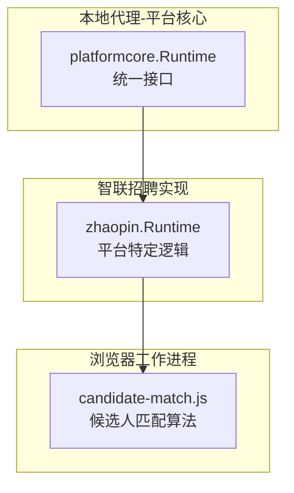
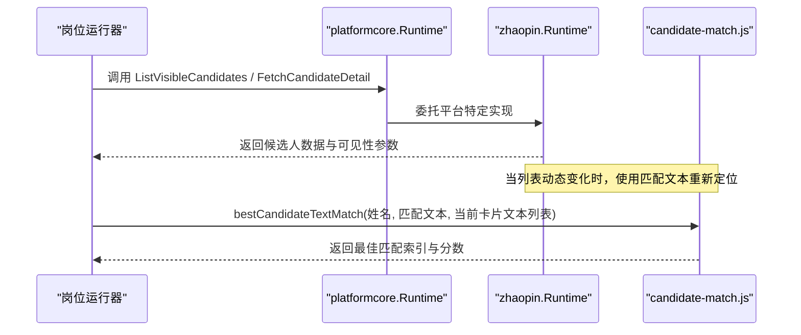
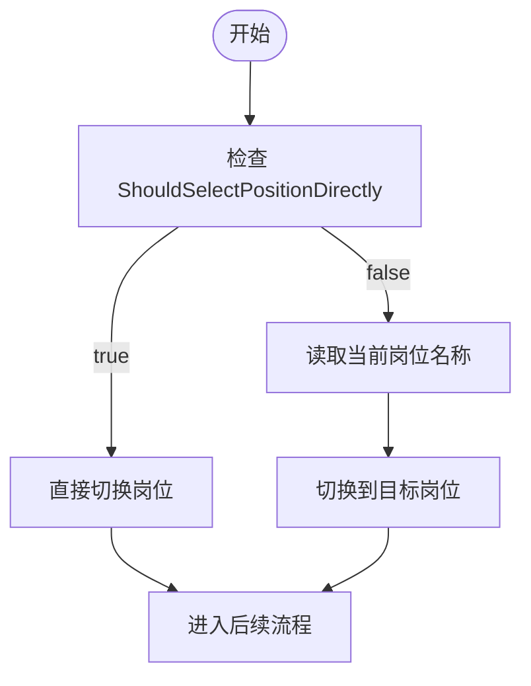
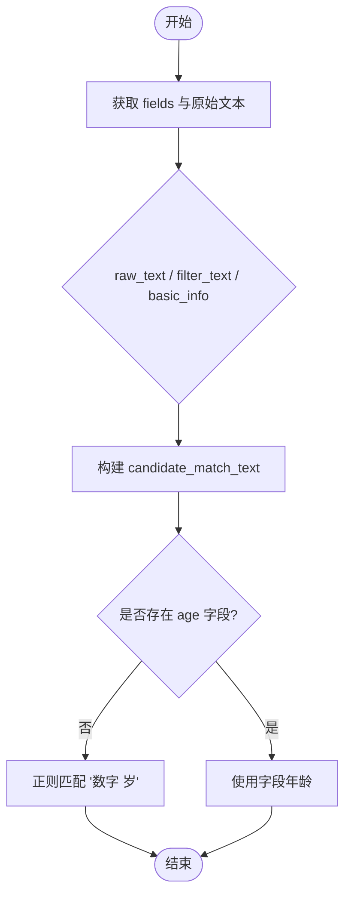
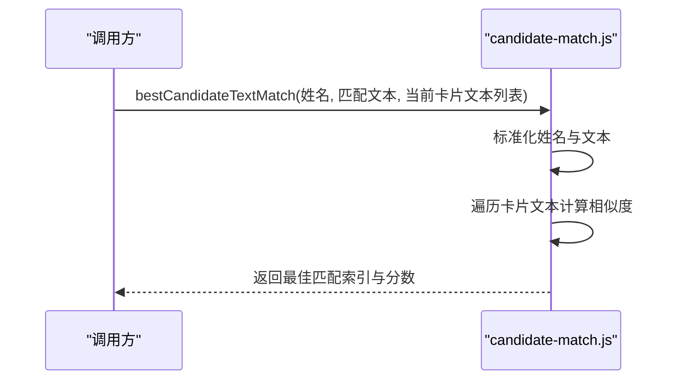
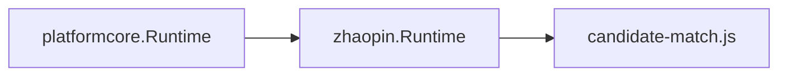

# 运行时配置

<cite>
**本文引用的文件**
- [platformcore/runtime.go](file://goodhr5/local-agent-go/internal/platformcore/runtime.go)
- [zhaopin/runtime.go](file://goodhr5/local-agent-go/internal/platforms/zhaopin/runtime.go)
- [candidate-match.js](file://goodhr5/local-agent-go/worker-node/src/candidate-match.js)
</cite>

## 目录
1. [简介](#简介)
2. [项目结构](#项目结构)
3. [核心组件](#核心组件)
4. [架构总览](#架构总览)
5. [详细组件分析](#详细组件分析)
6. [依赖关系分析](#依赖关系分析)
7. [性能考虑](#性能考虑)
8. [故障排查指南](#故障排查指南)
9. [结论](#结论)
10. [附录](#附录)

## 简介
本文件聚焦前程无忧平台（智联招聘）的运行时配置与候选人匹配流程，围绕 Runtime 接口设计、生命周期管理、ShouldSelectPositionDirectly 策略、候选人可见性参数以及候选人匹配文本生成算法进行系统化说明。文档旨在帮助开发者快速理解并正确配置运行时行为，同时提供可操作的最佳实践与性能优化建议。

## 项目结构
与本次主题相关的代码主要分布在以下位置：
- 平台运行时统一接口定义：local-agent-go/internal/platformcore/runtime.go
- 智联招聘平台运行时实现：local-agent-go/internal/platforms/zhaopin/runtime.go
- 候选人匹配文本相似度计算（Worker 端）：local-agent-go/worker-node/src/candidate-match.js

图表来源
- [platformcore/runtime.go:46-110](file://goodhr5/local-agent-go/internal/platformcore/runtime.go#L46-L110)
- [zhaopin/runtime.go:11-69](file://goodhr5/local-agent-go/internal/platforms/zhaopin/runtime.go#L11-L69)
- [candidate-match.js:1-80](file://goodhr5/local-agent-go/worker-node/src/candidate-match.js#L1-L80)

章节来源
- [platformcore/runtime.go:46-110](file://goodhr5/local-agent-go/internal/platformcore/runtime.go#L46-L110)
- [zhaopin/runtime.go:11-69](file://goodhr5/local-agent-go/internal/platforms/zhaopin/runtime.go#L11-L69)
- [candidate-match.js:1-80](file://goodhr5/local-agent-go/worker-node/src/candidate-match.js#L1-L80)

## 核心组件
- 平台运行时接口（Runtime）：定义了打开入口页、准备页面、切换岗位、提取候选人、读取详情、关闭详情、打招呼、筛选文本、指纹去重、详情文本清理等能力。这些方法构成主流程对平台的统一调用契约。
- 可选扩展接口：
  - BasicFilterApplier：在岗位处理完成后应用基础筛选条件。
  - CandidateInfoRequester：打招呼成功后向候选人索要信息并追加消息。
  - PositionSearchPreparer：首次确认岗位前执行搜索准备（需要按岗位配置先搜索的平台）。
  - DirectPositionSelector：是否跳过“读取当前岗位 + 切换后复核”，直接切换岗位运行。
  - PositionSelectionSkipper：完全跳过页面岗位处理。
  - DetailAnalysisScroller：AI 分析期间滚动候选人详情。
- 智联招聘运行时（zhaopin.Runtime）：实现了 ShouldSelectPositionDirectly 返回 true，表示每次直接切换岗位运行；并提供候选人可见性参数构造、候选人名与匹配文本生成、年龄解析等。
- 候选人匹配算法（candidate-match.js）：负责将候选人卡片文本标准化、计算双字符相似度、结合姓名优先匹配，输出最佳匹配项。

章节来源
- [platformcore/runtime.go:46-110](file://goodhr5/local-agent-go/internal/platformcore/runtime.go#L46-L110)
- [zhaopin/runtime.go:11-69](file://goodhr5/local-agent-go/internal/platforms/zhaopin/runtime.go#L11-L69)
- [candidate-match.js:1-80](file://goodhr5/local-agent-go/worker-node/src/candidate-match.js#L1-L80)

## 架构总览
运行时由“平台核心接口”和“平台具体实现”组成，并通过 Worker 端的候选人匹配脚本完成动态列表中的稳定定位。

图表来源
- [platformcore/runtime.go:46-110](file://goodhr5/local-agent-go/internal/platformcore/runtime.go#L46-L110)
- [zhaopin/runtime.go:24-48](file://goodhr5/local-agent-go/internal/platforms/zhaopin/runtime.go#L24-L48)
- [candidate-match.js:26-65](file://goodhr5/local-agent-go/worker-node/src/candidate-match.js#L26-L65)

## 详细组件分析

### Runtime 接口设计与生命周期管理
- 职责边界清晰：OpenEntryPage/PrepareEntryPage 负责初始化；IsPositionEntryPage/CurrentPositionName/SelectPosition 负责岗位切换；ListVisibleCandidates/ScrollCandidateList 负责列表交互；FetchCandidateDetail/CloseCandidateDetail/GreetCandidate 负责候选人详情与沟通；CandidateFilterText/CandidateFingerprint/CleanCandidateDetailText 提供通用辅助能力。
- 可扩展点：通过可选接口（BasicFilterApplier、CandidateInfoRequester、PositionSearchPreparer、DirectPositionSelector、PositionSelectionSkipper、DetailAnalysisScroller）按需增强平台能力，避免在核心路径中引入不必要的耦合。
- 生命周期要点：
  - 启动阶段：OpenEntryPage → PrepareEntryPage
  - 岗位阶段：IsPositionEntryPage → CurrentPositionName → SelectPosition（或直接切换）
  - 列表阶段：ListVisibleCandidates → ScrollCandidateList（必要时）
  - 详情阶段：FetchCandidateDetail → CloseCandidateDetail
  - 沟通阶段：GreetCandidate → RequestCandidateInfo（可选）
  - 收尾阶段：ApplyBasicFilters（可选）

章节来源
- [platformcore/runtime.go:46-110](file://goodhr5/local-agent-go/internal/platformcore/runtime.go#L46-L110)

### ShouldSelectPositionDirectly 的作用机制与智联特殊处理
- 作用机制：当平台实现实现 DirectPositionSelector 且 ShouldSelectPositionDirectly 返回 true 时，主流程会跳过“读取当前岗位名称”和“切换后复核”的步骤，直接切换到目标岗位继续运行。这适用于页面状态不稳定或无需校验当前岗位的平台。
- 智联招聘的特殊处理：zhaopin.Runtime.ShouldSelectPositionDirectly 返回 true，表明智联招聘采用“每次直接切换岗位运行岗位”的策略，减少因页面状态不一致导致的误判，提高稳定性。

图表来源
- [platformcore/runtime.go:94-98](file://goodhr5/local-agent-go/internal/platformcore/runtime.go#L94-L98)
- [zhaopin/runtime.go:19-22](file://goodhr5/local-agent-go/internal/platforms/zhaopin/runtime.go#L19-L22)

章节来源
- [platformcore/runtime.go:94-98](file://goodhr5/local-agent-go/internal/platformcore/runtime.go#L94-L98)
- [zhaopin/runtime.go:19-22](file://goodhr5/local-agent-go/internal/platforms/zhaopin/runtime.go#L19-L22)

### 候选人可见性参数配置（platform_id、platform_config、candidate_name 等）
- platform_id：标识平台类型，用于 Worker 侧选择对应定位与交互逻辑。智联招聘固定为 zhaopin。
- platform_config：透传平台配置对象，供 Worker 侧根据配置调整行为（如等待时间、滚动距离、重试次数等）。
- candidate_name：从候选人数据中提取的姓名，用于匹配阶段优先过滤。
- 其他关键字段（示例）：
  - candidate_match_text：用于动态列表重新定位的卡片文本，优先级为 raw_text > filter_text > fields.basic_info。
  - require_candidate_match：是否要求匹配成功才继续。
  - card_index / element_ref：用于精确定位候选人的元素引用与序号。
  - distance / wait_ms / card_scroll_attempts / viewport_margin：滚动与等待策略参数。
  - require_full：是否要求完整加载后再匹配。

章节来源
- [zhaopin/runtime.go:24-48](file://goodhr5/local-agent-go/internal/platforms/zhaopin/runtime.go#L24-L48)

### 候选人匹配文本生成算法（字段提取、正则表达式匹配、年龄解析）
- 字段提取顺序：
  - 首选 raw_text
  - 其次 filter_text
  - 再次 fields.basic_info
  - 若存在 age 或 candidate_age 字段，优先作为年龄来源
- 年龄解析：
  - 若字段中存在年龄字符串，则直接使用
  - 否则从文本中通过正则匹配“数字+岁”的模式提取年龄
- 匹配文本生成：
  - 以 raw_text/filter_text/basic_info 之一作为基础文本
  - 该文本将传入 Worker 侧进行标准化与相似度比较

图表来源
- [zhaopin/runtime.go:43-63](file://goodhr5/local-agent-go/internal/platforms/zhaopin/runtime.go#L43-L63)

章节来源
- [zhaopin/runtime.go:43-63](file://goodhr5/local-agent-go/internal/platforms/zhaopin/runtime.go#L43-L63)

### Worker 端候选人匹配流程（bestCandidateTextMatch）
- 文本标准化：去除非字母数字字符并小写，提升鲁棒性。
- 相似度计算：基于双字符集合的重叠度计算相似度。
- 姓名优先：若包含姓名，则在匹配时给予额外加分，提高命中率。
- 阈值控制：仅当相似度达到一定阈值（例如 0.45）才认为匹配成功。

图表来源
- [candidate-match.js:26-65](file://goodhr5/local-agent-go/worker-node/src/candidate-match.js#L26-L65)

章节来源
- [candidate-match.js:26-65](file://goodhr5/local-agent-go/worker-node/src/candidate-match.js#L26-L65)

## 依赖关系分析
- platformcore 提供统一接口，zhaopin 实现平台特定逻辑，二者解耦良好。
- zhaopin 将候选人可见性参数传递给 Worker 端脚本，由 candidate-match.js 完成最终匹配。
- 依赖链简洁，无循环依赖风险。

图表来源
- [platformcore/runtime.go:46-110](file://goodhr5/local-agent-go/internal/platformcore/runtime.go#L46-L110)
- [zhaopin/runtime.go:11-69](file://goodhr5/local-agent-go/internal/platforms/zhaopin/runtime.go#L11-L69)
- [candidate-match.js:1-80](file://goodhr5/local-agent-go/worker-node/src/candidate-match.js#L1-L80)

章节来源
- [platformcore/runtime.go:46-110](file://goodhr5/local-agent-go/internal/platformcore/runtime.go#L46-L110)
- [zhaopin/runtime.go:11-69](file://goodhr5/local-agent-go/internal/platforms/zhaopin/runtime.go#L11-L69)
- [candidate-match.js:1-80](file://goodhr5/local-agent-go/worker-node/src/candidate-match.js#L1-L80)

## 性能考虑
- 直接切换岗位：对于智联招聘，ShouldSelectPositionDirectly 返回 true，可减少一次页面读取与复核开销，提升整体吞吐。
- 匹配文本标准化：Worker 端对文本进行标准化与双字符相似度计算，能有效降低因格式差异导致的匹配失败，减少重试次数。
- 滚动与等待参数：distance、wait_ms、card_scroll_attempts 等参数可根据页面加载速度与网络状况调优，平衡稳定性与速度。
- 最小化 DOM 操作：仅在必要时滚动与截图，避免频繁触发重排与重绘。

[本节为通用指导，不直接分析具体文件]

## 故障排查指南
- 匹配失败：
  - 检查 candidate_match_text 是否正确生成（raw_text/filter_text/basic_info 优先级）
  - 确认 Worker 端 bestCandidateTextMatch 的阈值设置是否合理
  - 核对姓名是否被正确提取并参与匹配加分
- 页面状态异常：
  - 若 IsPositionEntryPage 判断失败，考虑启用 ShouldSelectPositionDirectly 策略
  - 调整 wait_ms 与 card_scroll_attempts，确保内容加载完成
- 详情文本噪声：
  - 使用 CleanCandidateDetailText 清理非简历内容，提高后续分析质量

章节来源
- [zhaopin/runtime.go:24-69](file://goodhr5/local-agent-go/internal/platforms/zhaopin/runtime.go#L24-L69)
- [candidate-match.js:26-65](file://goodhr5/local-agent-go/worker-node/src/candidate-match.js#L26-L65)

## 结论
- 平台核心接口提供了清晰的运行时契约与扩展点，便于多平台接入与维护。
- 智联招聘通过 ShouldSelectPositionDirectly 实现更稳定的岗位切换策略，减少页面状态不确定性带来的影响。
- 候选人匹配算法在 Go 侧生成匹配文本，在 JS 侧完成标准化与相似度计算，兼顾准确性与鲁棒性。
- 合理配置 platform_id、platform_config、candidate_name 等可见性参数，并结合滚动与等待策略，可显著提升匹配成功率与运行效率。

[本节为总结性内容，不直接分析具体文件]

## 附录
- 最佳实践
  - 明确各平台是否需要 ShouldSelectPositionDirectly，避免不必要的页面读取
  - 保持 candidate_match_text 的稳定性，优先使用结构化字段（如 basic_info）
  - 在 Worker 端维护合理的相似度阈值，并根据实际业务反馈调优
  - 定期评估并更新正则表达式与字段映射，适应平台页面变更
- 性能优化建议
  - 批量滚动与延迟：合并多次滚动请求，减少网络与渲染开销
  - 缓存匹配结果：对短时间内重复出现的候选人卡片进行缓存
  - 限制截图频率：仅在关键节点截图，避免 I/O 瓶颈

[本节为通用指导，不直接分析具体文件]