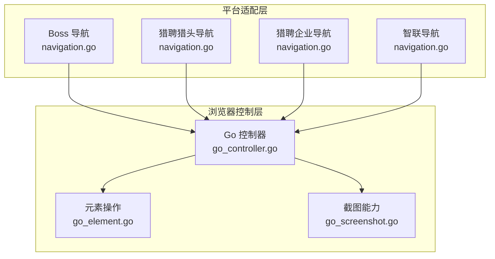
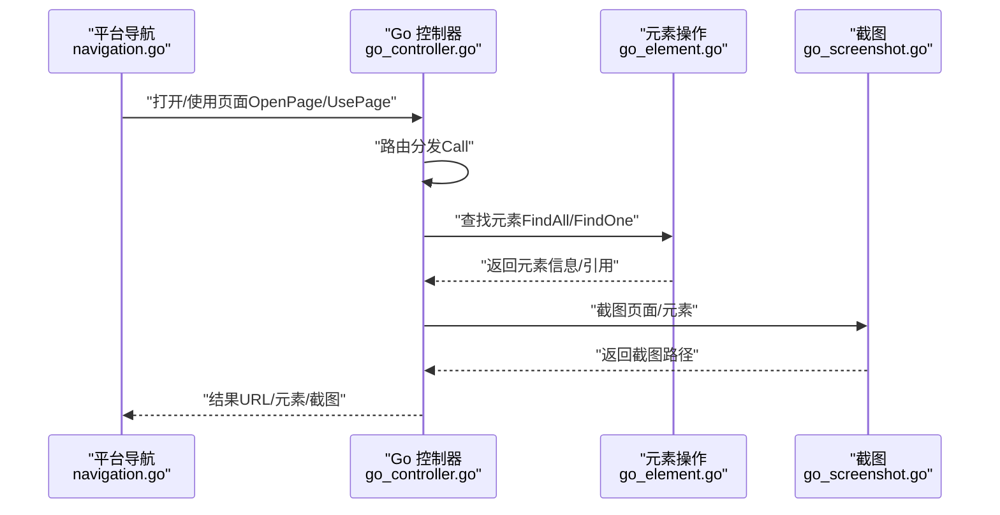
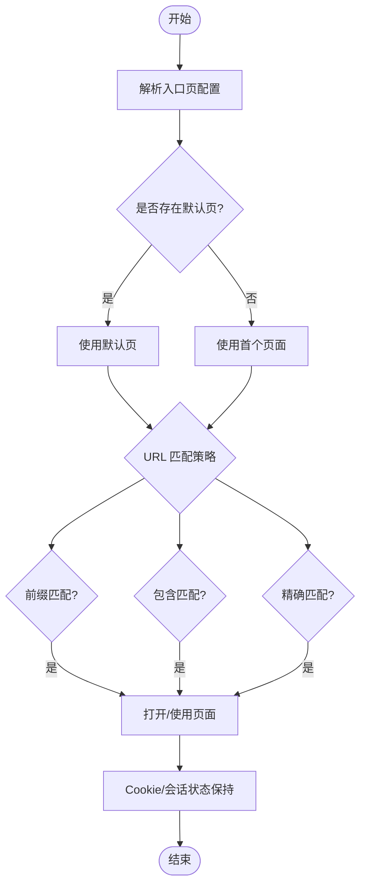
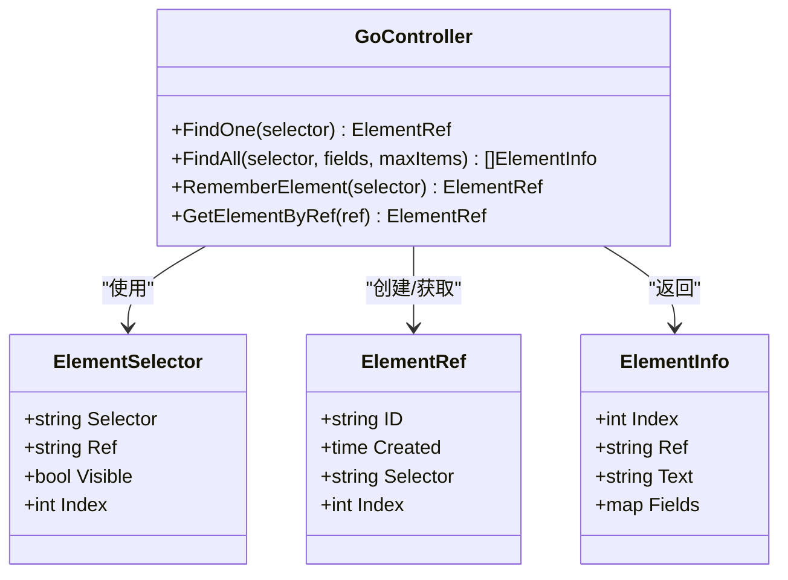
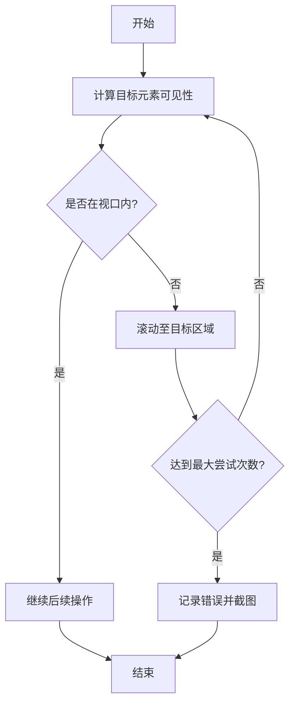
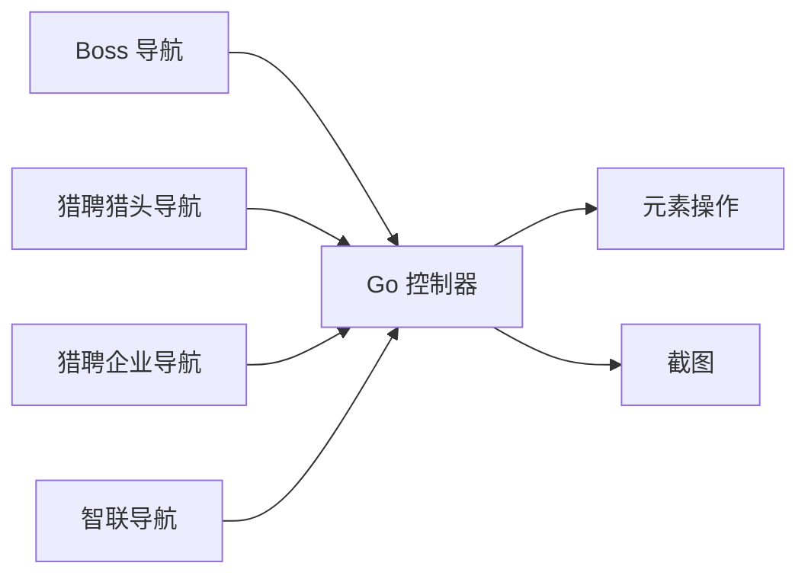

# 页面导航

<cite>
**本文引用的文件**
- [navigation.go](file://goodhr5/local-agent-go/internal/platforms/boss/navigation.go)
- [navigation.go](file://goodhr5/local-agent-go/internal/platforms/hliepin/navigation.go)
- [navigation.go](file://goodhr5/local-agent-go/internal/platforms/liepin/navigation.go)
- [navigation.go](file://goodhr5/local-agent-go/internal/platforms/zhaopin/navigation.go)
- [go_controller.go](file://goodhr5/local-agent-go/internal/browser/go_controller.go)
- [go_element.go](file://goodhr5/local-agent-go/internal/browser/go_element.go)
- [go_screenshot.go](file://goodhr5/local-agent-go/internal/browser/go_screenshot.go)
- [runtime.go](file://goodhr5/local-agent-go/internal/platforms/boss/runtime.go)
- [runtime.go](file://goodhr5/local-agent-go/internal/platforms/hliepin/runtime.go)
</cite>

## 目录
1. [简介](#简介)
2. [项目结构](#项目结构)
3. [核心组件](#核心组件)
4. [架构总览](#架构总览)
5. [详细组件分析](#详细组件分析)
6. [依赖关系分析](#依赖关系分析)
7. [性能考虑](#性能考虑)
8. [故障排查指南](#故障排查指南)
9. [结论](#结论)
10. [附录](#附录)

## 简介
本文件面向前程无忧平台（以及同仓库中的 Boss、猎聘猎头端、智联招聘等）的页面自动化导航能力，系统化说明：
- 页面跳转策略与路由管理：URL 模式识别、参数传递与状态保持。
- 页面元素定位技术：CSS 选择器、XPath 兼容、智能查找算法与父级上下文组合。
- 页面等待与加载检测：超时、重试与错误恢复策略。
- 截图与调试工具集成：用于问题诊断与可视化分析。
- 稳定性保障：元素变化检测与自适应定位策略。

## 项目结构
本项目将“平台适配层”和“浏览器控制层”解耦：
- 平台适配层：按平台（boss、hliepin、liepin、zhaopin）提供入口页解析、默认页选择、URL 匹配、岗位名称规范化、列表项配置合并等能力。
- 浏览器控制层：统一的 Go 控制器封装 CloakBrowser，提供页面打开/切换、元素查找/读取/点击、滚动、截图、Cookie 管理等原子能力，并通过统一路由对外暴露。

**图表来源**
- [go_controller.go:48-78](file://goodhr5/local-agent-go/internal/browser/go_controller.go#L48-L78)
- [go_element.go:11-105](file://goodhr5/local-agent-go/internal/browser/go_element.go#L11-L105)
- [go_screenshot.go:14-86](file://goodhr5/local-agent-go/internal/browser/go_screenshot.go#L14-L86)
- [navigation.go:12-39](file://goodhr5/local-agent-go/internal/platforms/boss/navigation.go#L12-L39)
- [navigation.go:6-33](file://goodhr5/local-agent-go/internal/platforms/hliepin/navigation.go#L6-L33)
- [navigation.go:6-33](file://goodhr5/local-agent-go/internal/platforms/liepin/navigation.go#L6-L33)
- [navigation.go:12-39](file://goodhr5/local-agent-go/internal/platforms/zhaopin/navigation.go#L12-L39)

**章节来源**
- [go_controller.go:48-78](file://goodhr5/local-agent-go/internal/browser/go_controller.go#L48-L78)
- [go_element.go:11-105](file://goodhr5/local-agent-go/internal/browser/go_element.go#L11-L105)
- [go_screenshot.go:14-86](file://goodhr5/local-agent-go/internal/browser/go_screenshot.go#L14-L86)
- [navigation.go:12-39](file://goodhr5/local-agent-go/internal/platforms/boss/navigation.go#L12-L39)
- [navigation.go:6-33](file://goodhr5/local-agent-go/internal/platforms/hliepin/navigation.go#L6-L33)
- [navigation.go:6-33](file://goodhr5/local-agent-go/internal/platforms/liepin/navigation.go#L6-L33)
- [navigation.go:12-39](file://goodhr5/local-agent-go/internal/platforms/zhaopin/navigation.go#L12-L39)

## 核心组件
- 平台导航模块（各平台 navigation.go）
  - 入口页解析：优先从认证段 pages 中取 entry=true 的页面，否则回退到首个有 url 的页面或顶层 url。
  - 默认页选择：优先 is_default=true，否则取第一个页面。
  - URL 匹配：支持精确匹配、包含匹配、前缀匹配三种策略。
  - 岗位名称规范化：去除多余空白与括号说明，生成搜索框可识别的精简关键词（部分平台）。
  - 列表项配置合并：将容器与单项的 parent_classes/target_classes 合并，提升定位鲁棒性。
- 浏览器控制器（go_controller.go）
  - 统一路由：将 Node Worker 风格的路径映射到 Go 控制器方法，如页面打开、使用、查找、截图、Cookie 等。
  - 操作分层：基础操作、组合操作、平台个性化操作分类清晰，便于扩展与维护。
- 元素操作（go_element.go）
  - 选择器解析：支持 selector/css/path/selectors/classes/target_classes/element 等多字段融合；支持父级+目标组合选择器。
  - 可见性与视口：过滤不可见元素，计算元素在视口中的位置与可见性。
  - 引用缓存：通过 RememberElement/GetElementByRef 维护元素引用，避免重复解析。
- 截图能力（go_screenshot.go）
  - 页面/元素截图：支持全屏与裁剪区域，输出 PNG 并落盘，便于问题回溯。

**章节来源**
- [navigation.go:12-39](file://goodhr5/local-agent-go/internal/platforms/boss/navigation.go#L12-L39)
- [navigation.go:41-71](file://goodhr5/local-agent-go/internal/platforms/boss/navigation.go#L41-L71)
- [navigation.go:73-93](file://goodhr5/local-agent-go/internal/platforms/boss/navigation.go#L73-L93)
- [navigation.go:95-122](file://goodhr5/local-agent-go/internal/platforms/boss/navigation.go#L95-L122)
- [navigation.go:6-33](file://goodhr5/local-agent-go/internal/platforms/hliepin/navigation.go#L6-L33)
- [navigation.go:35-65](file://goodhr5/local-agent-go/internal/platforms/hliepin/navigation.go#L35-L65)
- [navigation.go:6-33](file://goodhr5/local-agent-go/internal/platforms/liepin/navigation.go#L6-L33)
- [navigation.go:12-39](file://goodhr5/local-agent-go/internal/platforms/zhaopin/navigation.go#L12-L39)
- [navigation.go:41-71](file://goodhr5/local-agent-go/internal/platforms/zhaopin/navigation.go#L41-L71)
- [navigation.go:79-93](file://goodhr5/local-agent-go/internal/platforms/zhaopin/navigation.go#L79-L93)
- [navigation.go:95-122](file://goodhr5/local-agent-go/internal/platforms/zhaopin/navigation.go#L95-L122)
- [go_controller.go:48-78](file://goodhr5/local-agent-go/internal/browser/go_controller.go#L48-L78)
- [go_controller.go:259-334](file://goodhr5/local-agent-go/internal/browser/go_controller.go#L259-L334)
- [go_element.go:11-105](file://goodhr5/local-agent-go/internal/browser/go_element.go#L11-L105)
- [go_element.go:257-329](file://goodhr5/local-agent-go/internal/browser/go_element.go#L257-L329)
- [go_screenshot.go:14-86](file://goodhr5/local-agent-go/internal/browser/go_screenshot.go#L14-L86)

## 架构总览
下图展示了从平台导航到浏览器控制的调用链：平台侧负责“进入哪个页面、如何判断当前页面”，浏览器侧负责“打开/切换页面、查找/操作元素、截图”。

**图表来源**
- [go_controller.go:259-334](file://goodhr5/local-agent-go/internal/browser/go_controller.go#L259-L334)
- [go_element.go:11-105](file://goodhr5/local-agent-go/internal/browser/go_element.go#L11-L105)
- [go_screenshot.go:14-86](file://goodhr5/local-agent-go/internal/browser/go_screenshot.go#L14-L86)
- [navigation.go:12-39](file://goodhr5/local-agent-go/internal/platforms/boss/navigation.go#L12-L39)

## 详细组件分析

### 页面跳转策略与路由管理
- URL 模式识别
  - 入口页解析：优先取 pages 中标记为 entry 的页面，其次取首个含 url 的页面，最后回退到顶层 url。
  - 默认页选择：优先 is_default=true 的页面，否则取第一个页面。
  - URL 匹配：支持 prefix（前缀）、contains（包含）、精确匹配三种策略，用于判断当前页面是否属于某入口。
- 参数传递与状态保持
  - 通过浏览器 Cookie 导入/导出实现登录态与跨页面状态保持。
  - 通过页面索引/ID 切换当前操作页面，保证多标签页场景下的稳定操作。
- 路由管理
  - 控制器以统一路由形式暴露页面相关能力：打开页面、使用页面、刷新、等待加载、查找元素、截图、Cookie 管理等。
  - 路由返回值统一附加 worker 标识，便于上层区分执行环境。

**图表来源**
- [navigation.go:12-39](file://goodhr5/local-agent-go/internal/platforms/boss/navigation.go#L12-L39)
- [navigation.go:41-71](file://goodhr5/local-agent-go/internal/platforms/boss/navigation.go#L41-L71)
- [go_controller.go:271-279](file://goodhr5/local-agent-go/internal/browser/go_controller.go#L271-L279)
- [go_controller.go:347-349](file://goodhr5/local-agent-go/internal/browser/go_controller.go#L347-L349)

**章节来源**
- [navigation.go:12-39](file://goodhr5/local-agent-go/internal/platforms/boss/navigation.go#L12-L39)
- [navigation.go:41-71](file://goodhr5/local-agent-go/internal/platforms/boss/navigation.go#L41-L71)
- [navigation.go:6-33](file://goodhr5/local-agent-go/internal/platforms/hliepin/navigation.go#L6-L33)
- [navigation.go:35-65](file://goodhr5/local-agent-go/internal/platforms/hliepin/navigation.go#L35-L65)
- [navigation.go:6-33](file://goodhr5/local-agent-go/internal/platforms/liepin/navigation.go#L6-L33)
- [navigation.go:12-39](file://goodhr5/local-agent-go/internal/platforms/zhaopin/navigation.go#L12-L39)
- [navigation.go:41-71](file://goodhr5/local-agent-go/internal/platforms/zhaopin/navigation.go#L41-L71)
- [go_controller.go:271-279](file://goodhr5/local-agent-go/internal/browser/go_controller.go#L271-L279)
- [go_controller.go:347-349](file://goodhr5/local-agent-go/internal/browser/go_controller.go#L347-L349)

### 页面元素定位技术
- CSS 选择器与 XPath 兼容
  - 支持 selector/css/path/selectors/classes/target_classes/element 多种字段，自动提取首个有效选择器。
  - 支持父级 classes 与目标 classes 组合，形成更稳定的定位表达式。
  - 纯 class 名称会被规范化为 CSS 类选择器，完整 CSS 保持不变。
- 智能查找算法
  - 查找时过滤不可见元素（display/visibility/尺寸），仅返回可见且有效的元素。
  - 支持 fields 批量抽取：在根元素下按子选择器读取文本，减少多次 DOM 访问。
  - 支持 index 指定第 N 个匹配项，提高对动态列表的定位精度。
- 元素引用与复用
  - 通过 RememberElement/GetElementByRef 缓存元素引用，避免重复解析与 DOM 抖动影响。
  - 清空引用可在页面切换或重置后释放资源。

**图表来源**
- [go_element.go:11-105](file://goodhr5/local-agent-go/internal/browser/go_element.go#L11-L105)
- [go_element.go:107-139](file://goodhr5/local-agent-go/internal/browser/go_element.go#L107-L139)
- [go_element.go:257-329](file://goodhr5/local-agent-go/internal/browser/go_element.go#L257-L329)
- [go_controller.go:159-182](file://goodhr5/local-agent-go/internal/browser/go_controller.go#L159-L182)

**章节来源**
- [go_element.go:11-105](file://goodhr5/local-agent-go/internal/browser/go_element.go#L11-L105)
- [go_element.go:107-139](file://goodhr5/local-agent-go/internal/browser/go_element.go#L107-L139)
- [go_element.go:257-329](file://goodhr5/local-agent-go/internal/browser/go_element.go#L257-L329)
- [go_controller.go:159-182](file://goodhr5/local-agent-go/internal/browser/go_controller.go#L159-L182)

### 页面等待与加载检测机制
- 超时与重试
  - 平台运行时提供滚动与可见性检查的参数（距离、等待毫秒数、尝试次数），用于处理异步加载与懒渲染。
  - 控制器提供 ensure-visible 路由，结合距离与最大尝试次数，确保目标元素进入可视区域。
- 错误恢复
  - 当元素查找失败或不可见时，可通过截图与日志辅助定位；必要时回退到页面截图进行整体诊断。
  - 控制器对未实现的路由返回明确错误信息，便于快速发现缺失能力。

**图表来源**
- [runtime.go:19-33](file://goodhr5/local-agent-go/internal/platforms/boss/runtime.go#L19-L33)
- [go_controller.go:292-295](file://goodhr5/local-agent-go/internal/browser/go_controller.go#L292-L295)
- [go_screenshot.go:14-86](file://goodhr5/local-agent-go/internal/browser/go_screenshot.go#L14-L86)

**章节来源**
- [runtime.go:19-33](file://goodhr5/local-agent-go/internal/platforms/boss/runtime.go#L19-L33)
- [go_controller.go:292-295](file://goodhr5/local-agent-go/internal/browser/go_controller.go#L292-L295)
- [go_screenshot.go:14-86](file://goodhr5/local-agent-go/internal/browser/go_screenshot.go#L14-L86)

### 截图与调试工具集成
- 页面截图：支持全屏截图，便于整体状态诊断。
- 元素截图：基于元素边界裁剪，聚焦关键区域，减少无关信息干扰。
- 输出与存储：统一落盘到临时目录，文件名带时间戳，便于追溯。
- 调试建议：在元素定位失败、滚动异常、弹窗遮挡等场景优先截取元素与页面，配合日志分析。

**章节来源**
- [go_screenshot.go:14-86](file://goodhr5/local-agent-go/internal/browser/go_screenshot.go#L14-L86)
- [go_element.go:184-216](file://goodhr5/local-agent-go/internal/browser/go_element.go#L184-L216)

### 页面稳定性保障措施
- 元素变化检测
  - 通过 visible_only 过滤隐藏元素，降低因样式变化导致的误判。
  - 使用 fields 批量抽取，减少多次查询带来的不稳定。
- 自适应定位策略
  - 父级 classes 与目标 classes 组合，增强对动态结构的适应性。
  - 支持 index 精准定位第 N 项，应对列表项顺序变化。
  - 平台侧合并容器与单项配置，提升通用性。

**章节来源**
- [go_element.go:257-329](file://goodhr5/local-agent-go/internal/browser/go_element.go#L257-L329)
- [navigation.go:95-122](file://goodhr5/local-agent-go/internal/platforms/boss/navigation.go#L95-L122)
- [navigation.go:73-100](file://goodhr5/local-agent-go/internal/platforms/hliepin/navigation.go#L73-L100)
- [navigation.go:95-122](file://goodhr5/local-agent-go/internal/platforms/zhaopin/navigation.go#L95-L122)

## 依赖关系分析
- 平台导航模块依赖浏览器控制器的页面与元素能力，完成“进入页面—定位元素—截图”的闭环。
- 浏览器控制器作为中间层，屏蔽底层浏览器差异，向上提供统一 API。
- 截图能力依赖元素边界计算，确保裁剪准确。

**图表来源**
- [go_controller.go:259-334](file://goodhr5/local-agent-go/internal/browser/go_controller.go#L259-L334)
- [go_element.go:11-105](file://goodhr5/local-agent-go/internal/browser/go_element.go#L11-L105)
- [go_screenshot.go:14-86](file://goodhr5/local-agent-go/internal/browser/go_screenshot.go#L14-L86)
- [navigation.go:12-39](file://goodhr5/local-agent-go/internal/platforms/boss/navigation.go#L12-L39)
- [navigation.go:6-33](file://goodhr5/local-agent-go/internal/platforms/hliepin/navigation.go#L6-L33)
- [navigation.go:6-33](file://goodhr5/local-agent-go/internal/platforms/liepin/navigation.go#L6-L33)
- [navigation.go:12-39](file://goodhr5/local-agent-go/internal/platforms/zhaopin/navigation.go#L12-L39)

**章节来源**
- [go_controller.go:259-334](file://goodhr5/local-agent-go/internal/browser/go_controller.go#L259-L334)
- [go_element.go:11-105](file://goodhr5/local-agent-go/internal/browser/go_element.go#L11-L105)
- [go_screenshot.go:14-86](file://goodhr5/local-agent-go/internal/browser/go_screenshot.go#L14-L86)
- [navigation.go:12-39](file://goodhr5/local-agent-go/internal/platforms/boss/navigation.go#L12-L39)
- [navigation.go:6-33](file://goodhr5/local-agent-go/internal/platforms/hliepin/navigation.go#L6-L33)
- [navigation.go:6-33](file://goodhr5/local-agent-go/internal/platforms/liepin/navigation.go#L6-L33)
- [navigation.go:12-39](file://goodhr5/local-agent-go/internal/platforms/zhaopin/navigation.go#L12-L39)

## 性能考虑
- 减少 DOM 访问次数：使用 fields 批量抽取文本，避免多次 querySelector。
- 可见性过滤：仅在可见范围内操作，降低无效点击与滚动开销。
- 合理设置滚动距离与尝试次数：平衡速度与稳定性，避免过度滚动导致卡顿。
- 截图频率控制：仅在关键节点或错误恢复时截图，避免频繁 IO。

[本节为通用指导，不直接分析具体文件]

## 故障排查指南
- 常见问题
  - 元素未找到：检查选择器是否正确、是否被父级 classes 包裹、是否可见。
  - 页面未加载完成：增加等待与重试次数，必要时先截图确认页面状态。
  - 滚动无效：调整滚动距离与最大尝试次数，确认目标元素是否被遮挡。
- 诊断步骤
  - 使用 ensure-visible 路由确保元素可视。
  - 使用元素截图定位具体问题区域。
  - 使用页面截图查看整体布局与弹窗遮挡情况。
  - 检查 Cookie 是否正确导入，确保登录态有效。

**章节来源**
- [go_controller.go:292-295](file://goodhr5/local-agent-go/internal/browser/go_controller.go#L292-L295)
- [go_screenshot.go:14-86](file://goodhr5/local-agent-go/internal/browser/go_screenshot.go#L14-L86)
- [go_controller.go:347-349](file://goodhr5/local-agent-go/internal/browser/go_controller.go#L347-L349)

## 结论
本项目通过“平台适配层 + 浏览器控制层”的分层设计，实现了跨平台的页面导航与元素操作能力。平台侧专注入口页解析、URL 匹配与岗位数据规范化；浏览器侧提供统一的页面与元素操作接口，并内置截图与调试能力。通过可见性过滤、父子级选择器组合、滚动与重试策略，系统在复杂动态页面中具备较好的稳定性与可维护性。

[本节为总结性内容，不直接分析具体文件]

## 附录
- 推荐实践
  - 优先使用父级 classes + 目标 classes 的组合选择器，提升定位鲁棒性。
  - 在关键流程节点插入截图，便于问题回溯。
  - 合理配置滚动距离与尝试次数，平衡速度与稳定性。
  - 使用 Cookie 导入/导出保持登录态，避免重复登录。

[本节为通用指导，不直接分析具体文件]