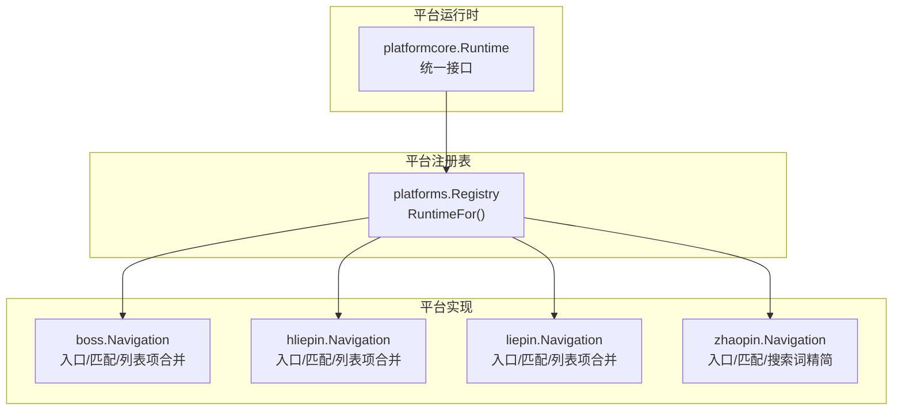
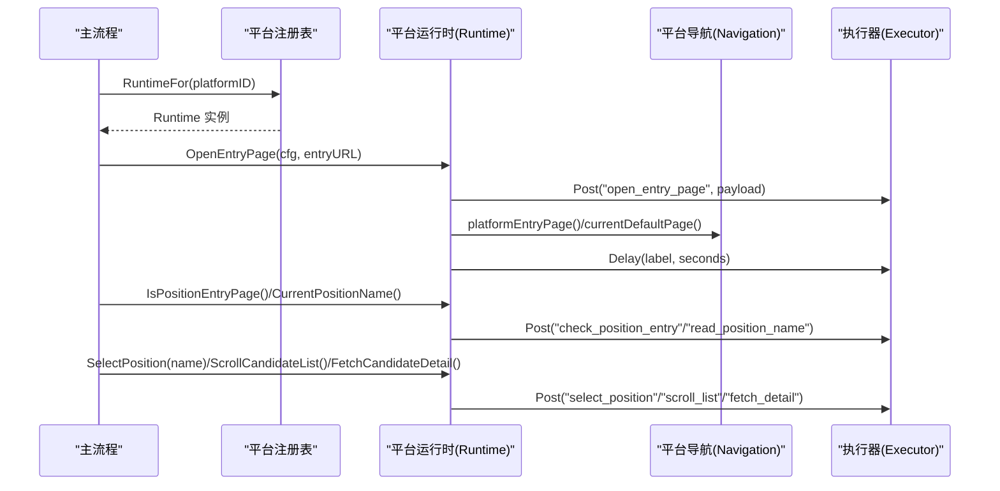
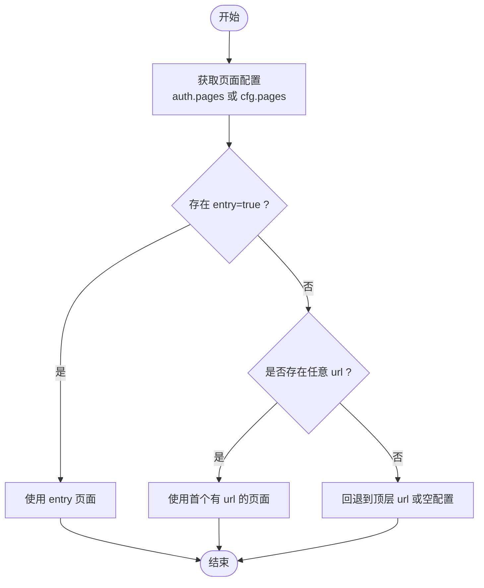
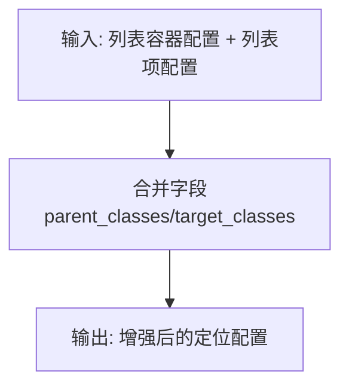
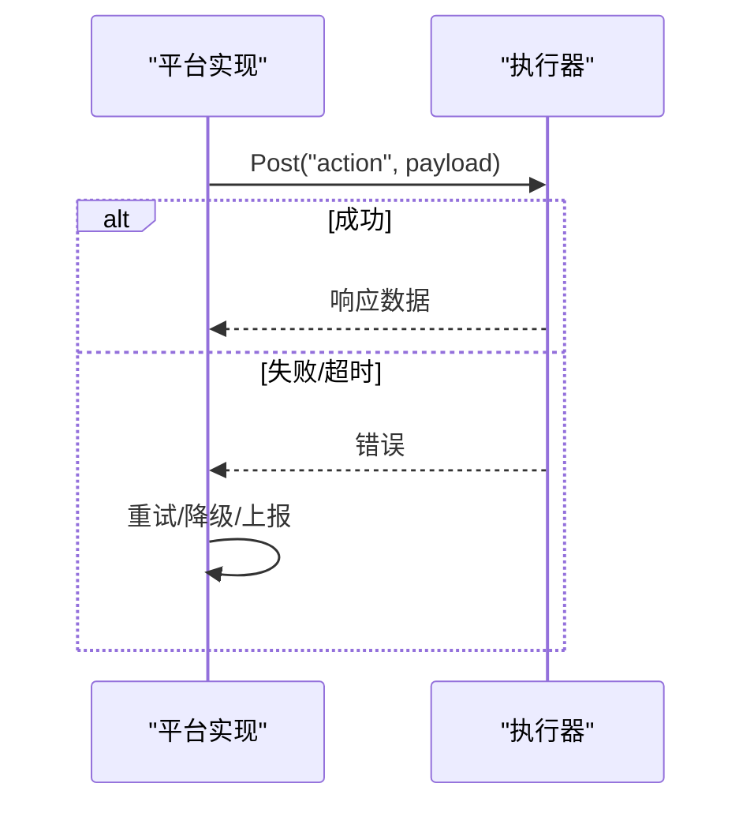
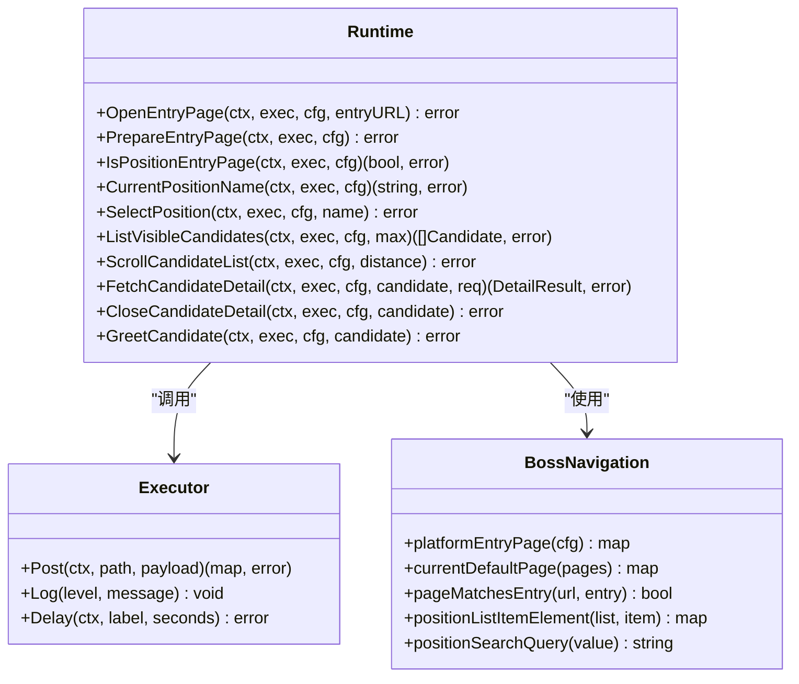

# 页面导航

<cite>
**本文引用的文件**
- [local-agent-go/internal/platformcore/runtime.go](file://goodhr5/local-agent-go/internal/platformcore/runtime.go)
- [local-agent-go/internal/platforms/registry.go](file://goodhr5/local-agent-go/internal/platforms/registry.go)
- [local-agent-go/internal/platforms/boss/navigation.go](file://goodhr5/local-agent-go/internal/platforms/boss/navigation.go)
- [local-agent-go/internal/platforms/hliepin/navigation.go](file://goodhr5/local-agent-go/internal/platforms/hliepin/navigation.go)
- [local-agent-go/internal/platforms/liepin/navigation.go](file://goodhr5/local-agent-go/internal/platforms/liepin/navigation.go)
- [local-agent-go/internal/platforms/zhaopin/navigation.go](file://goodhr5/local-agent-go/internal/platforms/zhaopin/navigation.go)
</cite>

## 目录
1. [简介](#简介)
2. [项目结构](#项目结构)
3. [核心组件](#核心组件)
4. [架构总览](#架构总览)
5. [详细组件分析](#详细组件分析)
6. [依赖关系分析](#依赖关系分析)
7. [性能与稳定性考量](#性能与稳定性考量)
8. [故障排查指南](#故障排查指南)
9. [结论](#结论)
10. [附录](#附录)

## 简介
本文件聚焦前程无忧平台（以及同仓库中的 Boss、猎聘、智联等）的页面导航能力，系统化说明：
- 页面跳转策略与路由管理：URL 模式识别、参数传递与状态保持。
- 页面元素定位技术：CSS 选择器、XPath 表达式与智能查找算法。
- 页面等待与加载检测：超时处理、重试策略与错误恢复。
- 截图与调试工具集成：问题诊断与可视化分析。
- 页面稳定性保障：元素变化检测与自适应定位策略。

## 项目结构
本地 Agent 通过“平台运行时”抽象统一调度各招聘平台的浏览器自动化流程。平台运行时由注册表按平台 ID 分发，具体导航逻辑在各平台模块中实现。

图表来源
- [local-agent-go/internal/platformcore/runtime.go:10-127](file://goodhr5/local-agent-go/internal/platformcore/runtime.go#L10-L127)
- [local-agent-go/internal/platforms/registry.go:15-34](file://goodhr5/local-agent-go/internal/platforms/registry.go#L15-L34)
- [local-agent-go/internal/platforms/boss/navigation.go:14-71](file://goodhr5/local-agent-go/internal/platforms/boss/navigation.go#L14-L71)
- [local-agent-go/internal/platforms/hliepin/navigation.go:8-65](file://goodhr5/local-agent-go/internal/platforms/hliepin/navigation.go#L8-L65)
- [local-agent-go/internal/platforms/liepin/navigation.go:8-65](file://goodhr5/local-agent-go/internal/platforms/liepin/navigation.go#L8-L65)
- [local-agent-go/internal/platforms/zhaopin/navigation.go:14-93](file://goodhr5/local-agent-go/internal/platforms/zhaopin/navigation.go#L14-L93)

章节来源
- [local-agent-go/internal/platformcore/runtime.go:10-127](file://goodhr5/local-agent-go/internal/platformcore/runtime.go#L10-L127)
- [local-agent-go/internal/platforms/registry.go:15-34](file://goodhr5/local-agent-go/internal/platforms/registry.go#L15-L34)

## 核心组件
- 平台运行时接口 Runtime：定义打开入口页、准备入口页、判断是否仍在岗位入口页、读取当前岗位名、切换岗位、滚动候选人列表、抓取详情、关闭详情、打招呼、筛选文本、指纹去重、清理详情文本等能力。
- 执行器 Executor：封装对浏览器 Worker 的调用、日志写入与延时等待，供平台实现调用。
- 平台注册表 Registry：根据平台 ID 返回对应运行时实现，未实现时返回错误。
- 各平台 Navigation：提供入口页解析、默认页选择、URL 匹配、岗位名称规范化、列表项元素合并、搜索关键词精简等通用能力。

章节来源
- [local-agent-go/internal/platformcore/runtime.go:10-127](file://goodhr5/local-agent-go/internal/platformcore/runtime.go#L10-L127)
- [local-agent-go/internal/platforms/registry.go:15-34](file://goodhr5/local-agent-go/internal/platforms/registry.go#L15-L34)
- [local-agent-go/internal/platforms/boss/navigation.go:14-162](file://goodhr5/local-agent-go/internal/platforms/boss/navigation.go#L14-L162)
- [local-agent-go/internal/platforms/hliepin/navigation.go:8-140](file://goodhr5/local-agent-go/internal/platforms/hliepin/navigation.go#L8-L140)
- [local-agent-go/internal/platforms/liepin/navigation.go:8-140](file://goodhr5/local-agent-go/internal/platforms/liepin/navigation.go#L8-L140)
- [local-agent-go/internal/platforms/zhaopin/navigation.go:14-162](file://goodhr5/local-agent-go/internal/platforms/zhaopin/navigation.go#L14-L162)

## 架构总览
下图展示从主流程到平台运行时的调用链，以及各平台导航能力的职责边界。

图表来源
- [local-agent-go/internal/platformcore/runtime.go:54-82](file://goodhr5/local-agent-go/internal/platformcore/runtime.go#L54-L82)
- [local-agent-go/internal/platforms/registry.go:22-34](file://goodhr5/local-agent-go/internal/platforms/registry.go#L22-L34)
- [local-agent-go/internal/platforms/boss/navigation.go:14-71](file://goodhr5/local-agent-go/internal/platforms/boss/navigation.go#L14-L71)

## 详细组件分析

### URL 模式识别与路由管理
- 入口页解析：优先从认证段 pages 中取 entry=true 的页面；若无则回退到任意含 url 的页面；再无则使用顶层 url。
- 默认页选择：在 Worker 返回的页面列表中，优先选择 is_default=true 的页面；否则取第一个。
- URL 匹配策略：支持 prefix（前缀匹配）、contains（包含匹配，默认）、精确匹配三种模式；匹配前会去除首尾空白与末尾斜杠，避免歧义。

图表来源
- [local-agent-go/internal/platforms/boss/navigation.go:14-39](file://goodhr5/local-agent-go/internal/platforms/boss/navigation.go#L14-L39)
- [local-agent-go/internal/platforms/hliepin/navigation.go:8-33](file://goodhr5/local-agent-go/internal/platforms/hliepin/navigation.go#L8-L33)
- [local-agent-go/internal/platforms/liepin/navigation.go:8-33](file://goodhr5/local-agent-go/internal/platforms/liepin/navigation.go#L8-L33)
- [local-agent-go/internal/platforms/zhaopin/navigation.go:14-39](file://goodhr5/local-agent-go/internal/platforms/zhaopin/navigation.go#L14-L39)

章节来源
- [local-agent-go/internal/platforms/boss/navigation.go:14-71](file://goodhr5/local-agent-go/internal/platforms/boss/navigation.go#L14-L71)
- [local-agent-go/internal/platforms/hliepin/navigation.go:8-65](file://goodhr5/local-agent-go/internal/platforms/hliepin/navigation.go#L8-L65)
- [local-agent-go/internal/platforms/liepin/navigation.go:8-65](file://goodhr5/local-agent-go/internal/platforms/liepin/navigation.go#L8-L65)
- [local-agent-go/internal/platforms/zhaopin/navigation.go:14-71](file://goodhr5/local-agent-go/internal/platforms/zhaopin/navigation.go#L14-L71)

### 参数传递与状态保持
- 参数传递：通过 Executor.Post 向浏览器 Worker 发送路径与负载，承载如 entryURL、positionName、candidate 等信息。
- 状态保持：通过 Runtime 方法组合维持“入口页—岗位页—详情页—消息页”的状态机；IsPositionEntryPage 用于确认是否仍停留在岗位入口页，避免误判跳转。
- 延迟控制：Delay 以业务语义标签记录等待时长，便于追踪与调优。

章节来源
- [local-agent-go/internal/platformcore/runtime.go:10-18](file://goodhr5/local-agent-go/internal/platformcore/runtime.go#L10-L18)
- [local-agent-go/internal/platformcore/runtime.go:54-82](file://goodhr5/local-agent-go/internal/platformcore/runtime.go#L54-L82)

### 页面元素定位技术
- 列表项元素合并：将“列表容器”与“列表项”的配置合并，继承 parent_classes/target_classes，增强定位鲁棒性。
- 搜索关键词精简：移除岗位名称中的中英文括号说明，并截断特定分隔符后的内容，提升搜索框匹配度。
- 模式标签：将详情提取模式映射为中文标签（结构/OCR/AI/未知），便于日志与界面显示。

图表来源
- [local-agent-go/internal/platforms/boss/navigation.go:95-122](file://goodhr5/local-agent-go/internal/platforms/boss/navigation.go#L95-L122)
- [local-agent-go/internal/platforms/hliepin/navigation.go:73-100](file://goodhr5/local-agent-go/internal/platforms/hliepin/navigation.go#L73-L100)
- [local-agent-go/internal/platforms/liepin/navigation.go:73-100](file://goodhr5/local-agent-go/internal/platforms/liepin/navigation.go#L73-L100)
- [local-agent-go/internal/platforms/zhaopin/navigation.go:95-122](file://goodhr5/local-agent-go/internal/platforms/zhaopin/navigation.go#L95-L122)

章节来源
- [local-agent-go/internal/platforms/boss/navigation.go:95-162](file://goodhr5/local-agent-go/internal/platforms/boss/navigation.go#L95-L162)
- [local-agent-go/internal/platforms/hliepin/navigation.go:73-140](file://goodhr5/local-agent-go/internal/platforms/hliepin/navigation.go#L73-L140)
- [local-agent-go/internal/platforms/liepin/navigation.go:73-140](file://goodhr5/local-agent-go/internal/platforms/liepin/navigation.go#L73-L140)
- [local-agent-go/internal/platforms/zhaopin/navigation.go:95-162](file://goodhr5/local-agent-go/internal/platforms/zhaopin/navigation.go#L95-L162)

### 页面等待与加载检测机制
- 显式等待：通过 Executor.Delay 在关键动作后插入延时，降低竞态风险。
- 重试与恢复：结合 IsPositionEntryPage 与 CurrentPositionName 进行状态复核；若失败可触发重试或降级策略（例如切换到 OCR/AI 模式）。
- 超时与错误：Worker 侧通常会在 Post 层实现超时与错误码；上层可根据错误类型决定重试或终止。

图表来源
- [local-agent-go/internal/platformcore/runtime.go:10-18](file://goodhr5/local-agent-go/internal/platformcore/runtime.go#L10-L18)
- [local-agent-go/internal/platformcore/runtime.go:54-82](file://goodhr5/local-agent-go/internal/platformcore/runtime.go#L54-L82)

章节来源
- [local-agent-go/internal/platformcore/runtime.go:10-18](file://goodhr5/local-agent-go/internal/platformcore/runtime.go#L10-L18)
- [local-agent-go/internal/platformcore/runtime.go:54-82](file://goodhr5/local-agent-go/internal/platformcore/runtime.go#L54-L82)

### 截图与调试工具集成
- 详情抓取：FetchCandidateDetail 支持 ScreenshotsDir 与 Filename，便于保存截图用于诊断。
- 模式选择：detailModeLabel 将底层模式映射为可读标签，辅助定位问题。
- 建议：在异常分支增加截图落盘与日志注入，便于复现与回溯。

章节来源
- [local-agent-go/internal/platformcore/runtime.go:23-36](file://goodhr5/local-agent-go/internal/platformcore/runtime.go#L23-L36)
- [local-agent-go/internal/platforms/boss/navigation.go:148-162](file://goodhr5/local-agent-go/internal/platforms/boss/navigation.go#L148-L162)
- [local-agent-go/internal/platforms/hliepin/navigation.go:126-140](file://goodhr5/local-agent-go/internal/platforms/hliepin/navigation.go#L126-L140)
- [local-agent-go/internal/platforms/liepin/navigation.go:126-140](file://goodhr5/local-agent-go/internal/platforms/liepin/navigation.go#L126-L140)
- [local-agent-go/internal/platforms/zhaopin/navigation.go:148-162](file://goodhr5/local-agent-go/internal/platforms/zhaopin/navigation.go#L148-L162)

### 页面稳定性保障措施
- 元素变化检测：通过 positionListItemElement 合并父级类名与目标类名，提高对 DOM 变动的容忍度。
- 自适应定位：URL 匹配支持多种模式，减少因站点微调导致的误判；搜索关键词精简提升输入框匹配成功率。
- 状态校验：IsPositionEntryPage 确保后续操作在正确页面上下文中执行，避免错位点击。

章节来源
- [local-agent-go/internal/platforms/boss/navigation.go:95-122](file://goodhr5/local-agent-go/internal/platforms/boss/navigation.go#L95-L122)
- [local-agent-go/internal/platforms/zhaopin/navigation.go:79-93](file://goodhr5/local-agent-go/internal/platforms/zhaopin/navigation.go#L79-L93)
- [local-agent-go/internal/platformcore/runtime.go:54-82](file://goodhr5/local-agent-go/internal/platformcore/runtime.go#L54-L82)

## 依赖关系分析
平台运行时与导航模块之间的依赖如下：

图表来源
- [local-agent-go/internal/platformcore/runtime.go:10-127](file://goodhr5/local-agent-go/internal/platformcore/runtime.go#L10-L127)
- [local-agent-go/internal/platforms/boss/navigation.go:14-162](file://goodhr5/local-agent-go/internal/platforms/boss/navigation.go#L14-L162)

章节来源
- [local-agent-go/internal/platformcore/runtime.go:10-127](file://goodhr5/local-agent-go/internal/platformcore/runtime.go#L10-L127)
- [local-agent-go/internal/platforms/boss/navigation.go:14-162](file://goodhr5/local-agent-go/internal/platforms/boss/navigation.go#L14-L162)

## 性能与稳定性考量
- 减少不必要的网络往返：尽量复用已加载页面，仅在必要时调用 Post。
- 合理设置 Delay：依据平台响应特征调整等待时间，避免过短导致不稳定、过长拖慢流程。
- 降级策略：当 DOM 解析失败时，可尝试 OCR/AI 模式；同时保留截图以便离线分析。
- 资源回收：及时关闭详情页，释放内存与句柄。

[本节为通用指导，不直接分析具体文件]

## 故障排查指南
- 无法进入入口页：检查 platformEntryPage 返回结果与 pageMatchesEntry 匹配策略是否正确。
- 岗位名读取失败：核对 CurrentPositionName 的实现与页面结构；必要时开启截图与日志。
- 详情页抓取失败：确认 FetchCandidateDetail 的参数与模式选择；查看截图与错误信息。
- 列表滚动无效：检查 ScrollCandidateList 的距离参数与页面高度；必要时分段滚动。

章节来源
- [local-agent-go/internal/platformcore/runtime.go:54-82](file://goodhr5/local-agent-go/internal/platformcore/runtime.go#L54-L82)
- [local-agent-go/internal/platforms/boss/navigation.go:14-71](file://goodhr5/local-agent-go/internal/platforms/boss/navigation.go#L14-L71)

## 结论
本项目通过统一的 Runtime 接口与平台注册表，将多平台的页面导航能力解耦与标准化。各平台 Navigation 模块提供一致的入口解析、URL 匹配与元素定位策略，配合 Executor 的延时与日志能力，形成稳定可靠的自动化流程。建议在新增平台时遵循现有模式，完善错误恢复与截图诊断，持续提升鲁棒性与可维护性。

[本节为总结性内容，不直接分析具体文件]

## 附录
- 术语
  - 入口页：平台登录后首次到达的主页面。
  - 岗位入口页：岗位列表或任务入口页面。
  - 详情页：候选人简历或职位详情页面。
  - 执行器：封装浏览器 Worker 调用的统一接口。
- 最佳实践
  - 使用 prefix/contains 灵活匹配 URL，避免硬编码。
  - 合并父级类名与目标类名，增强定位容错。
  - 在关键步骤加入 Delay 与截图，便于问题定位。
  - 对失败路径设计重试与降级，保证整体流程稳健。

[本节为补充说明，不直接分析具体文件]