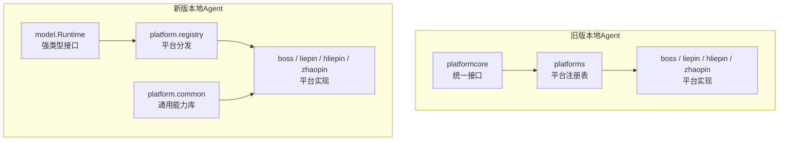
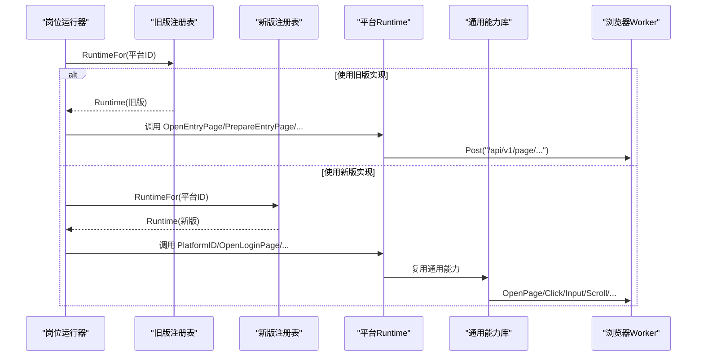
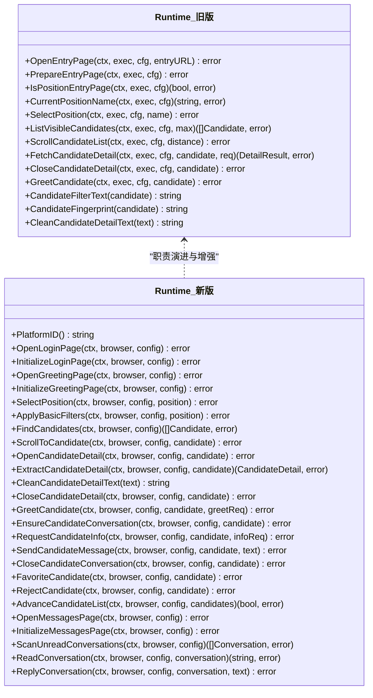
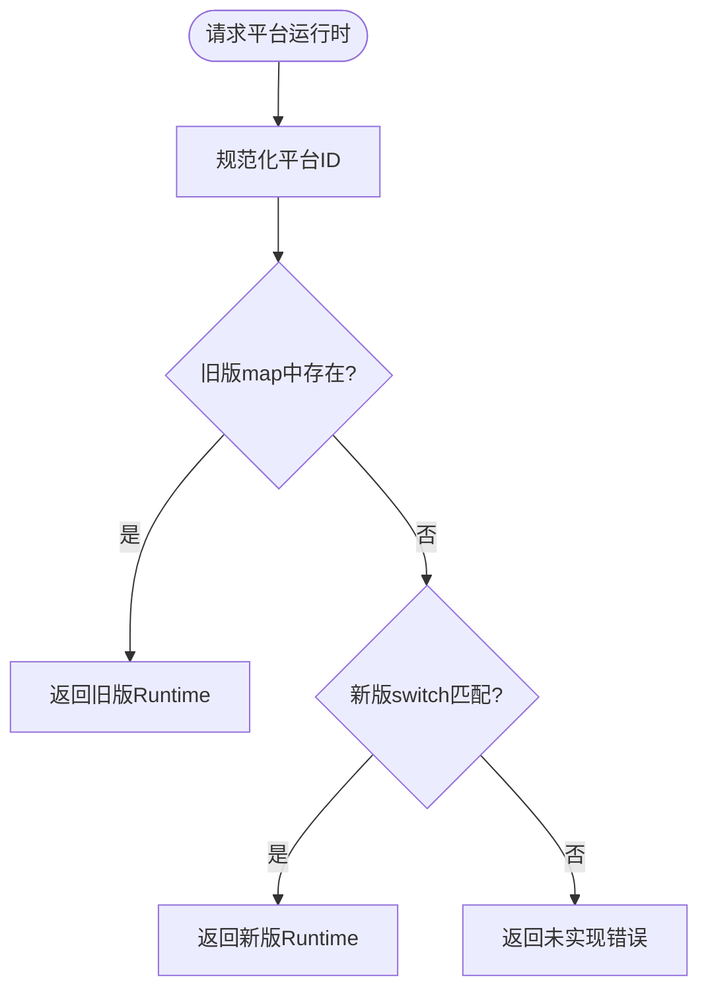
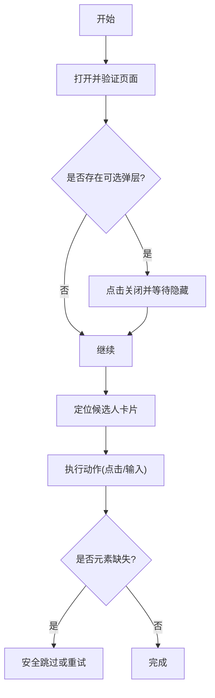
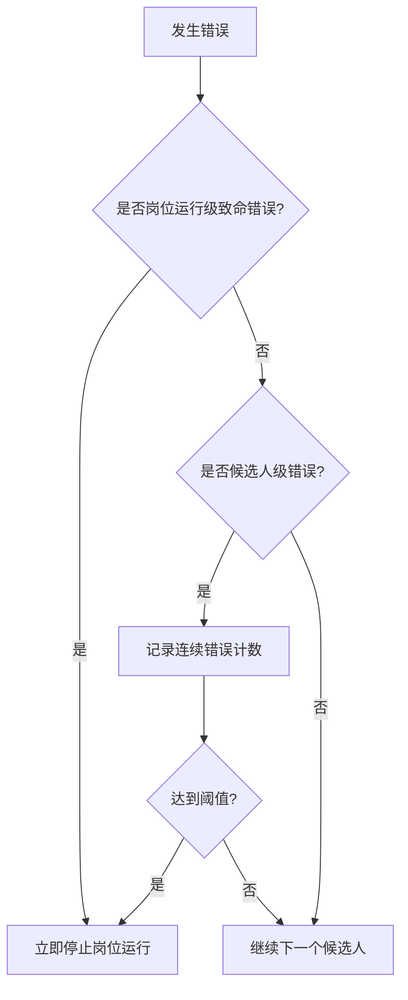
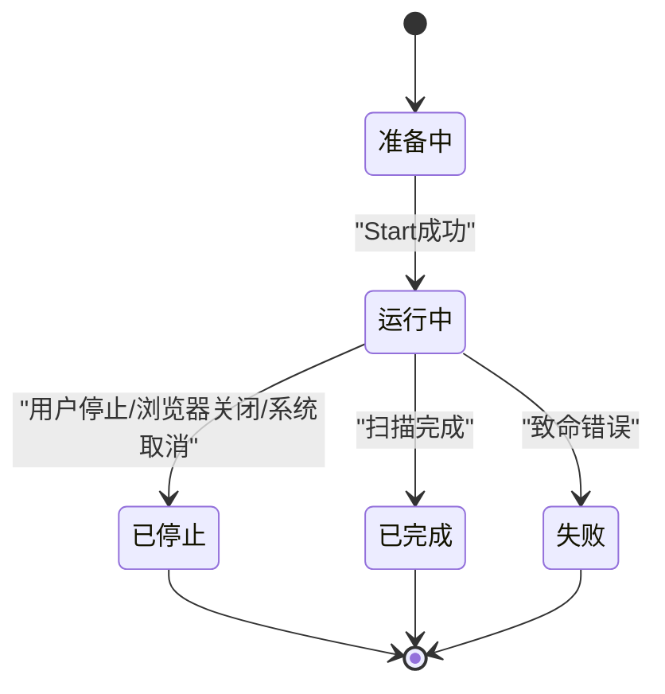
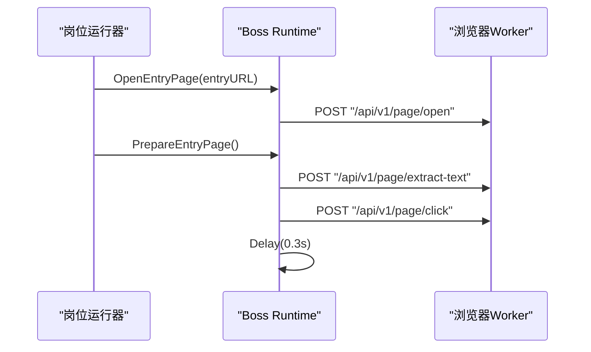
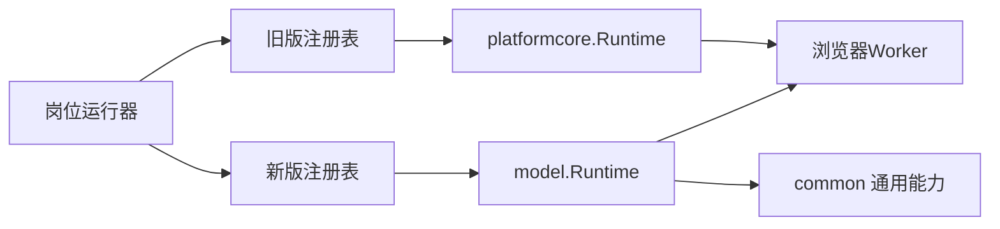

# 平台架构设计

<cite>
**本文引用的文件**
- [runtime.go](file://goodhr5/local-agent-go/internal/platformcore/runtime.go)
- [registry.go](file://goodhr5/local-agent-go/internal/platforms/registry.go)
- [entry.go](file://goodhr5/local-agent-go/internal/platforms/boss/entry.go)
- [runtime.go](file://goodhr5/local-agent-go/internal/platforms/boss/runtime.go)
- [runtime.go](file://goodhr5/local-agent-go/internal/platforms/hliepin/runtime.go)
- [runtime.go](file://goodhr5/local-agent-go/internal/platforms/liepin/runtime.go)
- [runtime.go](file://goodhr5/local-agent-go/internal/platforms/zhaopin/runtime.go)
- [runtime.go](file://goodhr5/local-agent-go-new/internal/platform/model/runtime.go)
- [registry.go](file://goodhr5/local-agent-go-new/internal/platform/registry.go)
- [runtime.go](file://goodhr5/local-agent-go-new/internal/platform/common/runtime.go)
- [config.go](file://goodhr5/local-agent-go-new/internal/platform/config.go)
- [error_policy.go](file://goodhr5/local-agent-go/internal/positionrunner/error_policy.go)
- [lifecycle.go](file://goodhr5/local-agent-go/internal/positionrunner/lifecycle.go)
</cite>

## 目录
1. [简介](#简介)
2. [项目结构](#项目结构)
3. [核心组件](#核心组件)
4. [架构总览](#架构总览)
5. [详细组件分析](#详细组件分析)
6. [依赖关系分析](#依赖关系分析)
7. [性能与稳定性考虑](#性能与稳定性考虑)
8. [故障排查指南](#故障排查指南)
9. [结论](#结论)
10. [附录：新平台接入流程与最佳实践](#附录：新平台接入流程与最佳实践)

## 简介
本文件系统性阐述 HRPlus5 本地岗位运行中的“平台适配器”架构，聚焦以下目标：
- 解释平台抽象接口的设计原理与 Runtime 接口的定义、实现模式。
- 说明平台注册机制、运行时分发逻辑、平台 ID 映射关系。
- 梳理平台适配器的通用组件设计、错误处理策略、生命周期管理。
- 提供新平台接入的标准流程与最佳实践。
- 说明平台间共享代码的组织结构与复用策略。

该架构将“平台差异”下沉到各平台适配器中，通过统一接口向上暴露稳定的能力边界，使上层岗位运行流程无需关心具体招聘平台的页面细节。

## 项目结构
仓库包含两套本地 Agent 实现：
- local-agent-go：基于 platformcore.Executor 的旧版平台运行时抽象，使用 map 注册表按平台 ID 分发。
- local-agent-go-new：新版强类型模型 model.Runtime，配合配置驱动（Config）和通用能力库 common，提供更清晰的隔离与扩展点。

图表来源
- [runtime.go:46-110](file://goodhr5/local-agent-go/internal/platformcore/runtime.go#L46-L110)
- [registry.go:15-34](file://goodhr5/local-agent-go/internal/platforms/registry.go#L15-L34)
- [runtime.go:124-152](file://goodhr5/local-agent-go-new/internal/platform/model/runtime.go#L124-L152)
- [registry.go:15-29](file://goodhr5/local-agent-go-new/internal/platform/registry.go#L15-L29)
- [runtime.go:24-166](file://goodhr5/local-agent-go-new/internal/platform/common/runtime.go#L24-L166)

章节来源
- [runtime.go:46-110](file://goodhr5/local-agent-go/internal/platformcore/runtime.go#L46-L110)
- [registry.go:15-34](file://goodhr5/local-agent-go/internal/platforms/registry.go#L15-L34)
- [runtime.go:124-152](file://goodhr5/local-agent-go-new/internal/platform/model/runtime.go#L124-L152)
- [registry.go:15-29](file://goodhr5/local-agent-go-new/internal/platform/registry.go#L15-L29)
- [runtime.go:24-166](file://goodhr5/local-agent-go-new/internal/platform/common/runtime.go#L24-L166)

## 核心组件
- 平台抽象接口
  - 旧版：platformcore.Runtime 定义打开入口页、准备入口页、判断是否仍在入口页、读取当前岗位、切换岗位、提取候选人列表、滚动列表、读取详情、关闭详情、打招呼、筛选文本、指纹、清理详情文本等能力；并提供可选能力接口 BasicFilterApplier、CandidateInfoRequester、PositionSearchPreparer、DirectPositionSelector、PositionSelectionSkipper、DetailAnalysisScroller。
  - 新版：model.Runtime 以强类型方式定义登录、初始化、选择岗位、应用筛选、查找候选人、滚动定位、打开/提取/关闭详情、打招呼、确保会话、索要信息、发送消息、收藏/拒绝、翻页、消息页扫描与回复等能力；并定义 Browser 作为 Worker 封装、Config 承载平台 URL/选择器/行为参数、Behavior 描述翻页/详情/岗位选择策略。
- 平台注册与分发
  - 旧版：platforms.registry 维护 map[string]Runtime，RuntimeFor 按平台 ID 返回实例，未实现时返回错误。
  - 新版：platform.registry 使用 switch 按平台 ID 返回对应 Runtime，同样对未知平台报错。
- 通用组件
  - 新版 common 提供页面打开校验、点击/输入动作、候选人与动作的选择器拼装、弹窗关闭、滚动定位、去重指纹、年龄提取、元素缺失判定等通用能力，降低平台实现重复代码。
- 配置与加载
  - 新版 platform.config 通过嵌入内置 JSON 配置并按平台 ID 加载，同时提供 ValidateTaskConfig 校验自动回复所需选择器完整性。

章节来源
- [runtime.go:46-110](file://goodhr5/local-agent-go/internal/platformcore/runtime.go#L46-L110)
- [runtime.go:124-152](file://goodhr5/local-agent-go-new/internal/platform/model/runtime.go#L124-L152)
- [registry.go:15-34](file://goodhr5/local-agent-go/internal/platforms/registry.go#L15-L34)
- [registry.go:15-29](file://goodhr5/local-agent-go-new/internal/platform/registry.go#L15-L29)
- [runtime.go:24-166](file://goodhr5/local-agent-go-new/internal/platform/common/runtime.go#L24-L166)
- [config.go:25-56](file://goodhr5/local-agent-go-new/internal/platform/config.go#L25-L56)

## 架构总览
下图展示从岗位运行启动到平台运行时调用的整体流程，以及新旧两套实现的协作关系。

图表来源
- [registry.go:15-34](file://goodhr5/local-agent-go/internal/platforms/registry.go#L15-L34)
- [registry.go:15-29](file://goodhr5/local-agent-go-new/internal/platform/registry.go#L15-L29)
- [entry.go:14-21](file://goodhr5/local-agent-go/internal/platforms/boss/entry.go#L14-L21)
- [runtime.go:24-166](file://goodhr5/local-agent-go-new/internal/platform/common/runtime.go#L24-L166)

章节来源
- [registry.go:15-34](file://goodhr5/local-agent-go/internal/platforms/registry.go#L15-L34)
- [registry.go:15-29](file://goodhr5/local-agent-go-new/internal/platform/registry.go#L15-L29)
- [entry.go:14-21](file://goodhr5/local-agent-go/internal/platforms/boss/entry.go#L14-L21)
- [runtime.go:24-166](file://goodhr5/local-agent-go-new/internal/platform/common/runtime.go#L24-L166)

## 详细组件分析

### 平台抽象接口与实现模式
- 旧版 platformcore.Runtime
  - 通过 Executor 与云端 Worker 通信，屏蔽底层 HTTP/CDP 细节。
  - 提供基础能力与可选能力，便于不同平台按需实现。
- 新版 model.Runtime
  - 强类型化，明确输入输出，减少歧义。
  - 结合 Config 与 Behavior，将平台差异配置化，提升可维护性。
  - 通过 Browser 抽象 Worker 能力，便于测试与替换。

图表来源
- [runtime.go:46-110](file://goodhr5/local-agent-go/internal/platformcore/runtime.go#L46-L110)
- [runtime.go:124-152](file://goodhr5/local-agent-go-new/internal/platform/model/runtime.go#L124-L152)

章节来源
- [runtime.go:46-110](file://goodhr5/local-agent-go/internal/platformcore/runtime.go#L46-L110)
- [runtime.go:124-152](file://goodhr5/local-agent-go-new/internal/platform/model/runtime.go#L124-L152)

### 平台注册机制与运行时分发
- 旧版：使用全局 map 注册 boss、hliepin、liepin、zhaopin；RuntimeFor 进行大小写与空白清洗，默认回退到 boss。
- 新版：switch 分发，显式列举支持的平台；未匹配时报错。

图表来源
- [registry.go:15-34](file://goodhr5/local-agent-go/internal/platforms/registry.go#L15-L34)
- [registry.go:15-29](file://goodhr5/local-agent-go-new/internal/platform/registry.go#L15-L29)

章节来源
- [registry.go:15-34](file://goodhr5/local-agent-go/internal/platforms/registry.go#L15-L34)
- [registry.go:15-29](file://goodhr5/local-agent-go-new/internal/platform/registry.go#L15-L29)

### 平台ID映射关系
- 支持的映射：boss、hliepin、liepin、zhaopin。
- 映射位置：
  - 旧版：platforms.registry 的 map 键。
  - 新版：platform.registry 的 switch case。
  - 新版：platform.config 的内置配置键。

章节来源
- [registry.go:15-34](file://goodhr5/local-agent-go/internal/platforms/registry.go#L15-L34)
- [registry.go:15-29](file://goodhr5/local-agent-go-new/internal/platform/registry.go#L15-L29)
- [config.go:25-38](file://goodhr5/local-agent-go-new/internal/platform/config.go#L25-L38)

### 通用组件设计与复用策略
- 页面与选择器
  - OpenPage/OpenVerifiedPage：打开并校验最终 URL，避免跳转导致状态不一致。
  - RequiredSelector/CandidateSelector/CandidateActionSelector：将选择器与候选人上下文组合，稳定定位卡片与动作。
- 交互与弹层
  - ClickRequired/ClickOptional/ClickOptionalQuick：区分必需与可选操作，快速探测即时弹层。
  - CloseOptionalPanel/CloseCandidateChat/CloseCandidatePanels：可靠关闭聊天框与抽屉，失败时尝试 Escape 兜底。
- 滚动与定位
  - ScrollToCandidate：真实鼠标滚轮滚动到候选人，支持锚点容器与视口边距。
- 数据与去重
  - CandidateFingerprint/CandidateIdentityTexts/extractAge：生成稳定指纹与身份文本，提高跨页面定位与去重可靠性。
- 错误识别
  - IsElementMissing：识别 Worker 的元素不存在错误，用于可选步骤安全跳过。

图表来源
- [runtime.go:24-166](file://goodhr5/local-agent-go-new/internal/platform/common/runtime.go#L24-L166)
- [runtime.go:269-363](file://goodhr5/local-agent-go-new/internal/platform/common/runtime.go#L269-L363)
- [runtime.go:365-421](file://goodhr5/local-agent-go-new/internal/platform/common/runtime.go#L365-L421)
- [runtime.go:423-546](file://goodhr5/local-agent-go-new/internal/platform/common/runtime.go#L423-L546)

章节来源
- [runtime.go:24-166](file://goodhr5/local-agent-go-new/internal/platform/common/runtime.go#L24-L166)
- [runtime.go:269-363](file://goodhr5/local-agent-go-new/internal/platform/common/runtime.go#L269-L363)
- [runtime.go:365-421](file://goodhr5/local-agent-go-new/internal/platform/common/runtime.go#L365-L421)
- [runtime.go:423-546](file://goodhr5/local-agent-go-new/internal/platform/common/runtime.go#L423-L546)

### 错误处理策略
- 候选人级错误
  - 记录同一环节连续相同错误次数，达到阈值后停止整个岗位运行，避免无效循环。
  - 归一化错误文本（数字占位、空白标准化），提高错误指纹稳定性。
- 岗位运行级错误
  - 立即停止：如 AI 指示停止、浏览器被关闭等致命错误。
  - 浏览器关闭检测：根据关键字识别用户主动关闭浏览器，优雅结束并通知。
- 组件错误
  - OCR 组件相关错误被识别为致命错误，触发停止与告警。

图表来源
- [error_policy.go:15-119](file://goodhr5/local-agent-go/internal/positionrunner/error_policy.go#L15-L119)

章节来源
- [error_policy.go:15-119](file://goodhr5/local-agent-go/internal/positionrunner/error_policy.go#L15-L119)

### 生命周期管理
- 启动阶段
  - 校验岗位运行 ID 与 Token，拉取云端岗位快照，创建本地锁，开启防睡眠保护，同步云端状态为 running。
- 运行阶段
  - 后台协程执行扫描流程，更新进度与日志，处理停止信号与浏览器关闭错误。
- 停止阶段
  - 用户停止请求：标记停止，等待当前候选人处理完成，超时则强制停止；保持浏览器打开。
  - 系统停止：检测到休眠恢复后取消所有运行中的岗位运行。
- 清理阶段
  - 释放运行锁、防睡眠保护，更新数据库状态，发送完成/失败通知。

图表来源
- [lifecycle.go:15-139](file://goodhr5/local-agent-go/internal/positionrunner/lifecycle.go#L15-L139)
- [lifecycle.go:141-193](file://goodhr5/local-agent-go/internal/positionrunner/lifecycle.go#L141-L193)
- [lifecycle.go:338-459](file://goodhr5/local-agent-go/internal/positionrunner/lifecycle.go#L338-L459)
- [lifecycle.go:461-624](file://goodhr5/local-agent-go/internal/positionrunner/lifecycle.go#L461-L624)

章节来源
- [lifecycle.go:15-139](file://goodhr5/local-agent-go/internal/positionrunner/lifecycle.go#L15-L139)
- [lifecycle.go:141-193](file://goodhr5/local-agent-go/internal/positionrunner/lifecycle.go#L141-L193)
- [lifecycle.go:338-459](file://goodhr5/local-agent-go/internal/positionrunner/lifecycle.go#L338-L459)
- [lifecycle.go:461-624](file://goodhr5/local-agent-go/internal/positionrunner/lifecycle.go#L461-L624)

### 平台适配器示例：Boss 直聘
- 入口页打开与准备
  - 校验入口地址，调用 Worker 打开页面；检测确认弹框并点击确认。
- 入口页判断
  - 列出当前页面，比对是否为入口页。
- 运行时辅助
  - 构造候选人可见定位负载，提取年龄与规范化 ID 组成部分。

图表来源
- [entry.go:14-53](file://goodhr5/local-agent-go/internal/platforms/boss/entry.go#L14-L53)
- [runtime.go:19-34](file://goodhr5/local-agent-go/internal/platforms/boss/runtime.go#L19-L34)

章节来源
- [entry.go:14-53](file://goodhr5/local-agent-go/internal/platforms/boss/entry.go#L14-L53)
- [runtime.go:19-34](file://goodhr5/local-agent-go/internal/platforms/boss/runtime.go#L19-L34)

### 平台适配器示例：智联招聘
- 直接切换岗位策略
  - ShouldSelectPositionDirectly 返回 true，表示每次直接切换岗位，不读取当前岗位。
- 候选人可见定位负载
  - 构造平台特定负载，包含候选人名称、匹配文本、滚动参数等。

章节来源
- [runtime.go:19-22](file://goodhr5/local-agent-go/internal/platforms/zhaopin/runtime.go#L19-L22)
- [runtime.go:24-41](file://goodhr5/local-agent-go/internal/platforms/zhaopin/runtime.go#L24-L41)

### 平台适配器示例：猎聘企业端/猎头端
- 运行时辅助
  - 组装候选人原始文本，提取年龄，规范化 ID 组成部分。
- 运行时实例
  - 携带平台标识与名称，便于日志与调试。

章节来源
- [runtime.go:10-19](file://goodhr5/local-agent-go/internal/platforms/liepin/runtime.go#L10-L19)
- [runtime.go:19-49](file://goodhr5/local-agent-go/internal/platforms/liepin/runtime.go#L19-L49)
- [runtime.go:10-19](file://goodhr5/local-agent-go/internal/platforms/hliepin/runtime.go#L10-L19)
- [runtime.go:21-51](file://goodhr5/local-agent-go/internal/platforms/hliepin/runtime.go#L21-L51)

## 依赖关系分析
- 模块耦合
  - 平台实现依赖 platformcore 或 model 接口，解耦了上层岗位运行与具体平台细节。
  - 新版 common 被多个平台实现复用，降低重复代码。
- 外部依赖
  - 浏览器 Worker 通过 Browser/Executor 抽象访问，便于替换与测试。
  - 云端 API 在旧版通过 cloudapi.PlatformConfig 传递，在新版通过 Config 承载。
- 潜在循环依赖
  - 接口与实现分离清晰，未见循环导入迹象。

图表来源
- [registry.go:15-34](file://goodhr5/local-agent-go/internal/platforms/registry.go#L15-L34)
- [registry.go:15-29](file://goodhr5/local-agent-go-new/internal/platform/registry.go#L15-L29)
- [runtime.go:46-110](file://goodhr5/local-agent-go/internal/platformcore/runtime.go#L46-L110)
- [runtime.go:124-152](file://goodhr5/local-agent-go-new/internal/platform/model/runtime.go#L124-L152)
- [runtime.go:24-166](file://goodhr5/local-agent-go-new/internal/platform/common/runtime.go#L24-L166)

章节来源
- [registry.go:15-34](file://goodhr5/local-agent-go/internal/platforms/registry.go#L15-L34)
- [registry.go:15-29](file://goodhr5/local-agent-go-new/internal/platform/registry.go#L15-L29)
- [runtime.go:46-110](file://goodhr5/local-agent-go/internal/platformcore/runtime.go#L46-L110)
- [runtime.go:124-152](file://goodhr5/local-agent-go-new/internal/platform/model/runtime.go#L124-L152)
- [runtime.go:24-166](file://goodhr5/local-agent-go-new/internal/platform/common/runtime.go#L24-L166)

## 性能与稳定性考虑
- 选择器与定位
  - 使用稳定身份文本与指纹，减少因页面刷新导致的重新定位失败。
  - 滚动采用真实鼠标滚轮与锚点容器，提升定位成功率。
- 弹层与交互
  - 快速探测可选弹层，避免无谓等待；关闭失败时尝试 Escape 兜底。
- 错误收敛
  - 连续错误计数与归一化，防止瞬时抖动导致误判。
- 资源保护
  - 防睡眠保护与休眠恢复检测，保证长时间运行的稳定性。

[本节为通用指导，不直接分析具体文件]

## 故障排查指南
- 常见问题定位
  - 平台未实现：检查注册表是否包含该平台 ID。
  - 页面未停在预期地址：检查 OpenVerifiedPage 与 PageURLMatches 的校验结果。
  - 元素缺失：使用 IsElementMissing 判断是否为可选元素缺失，调整可选步骤。
  - 浏览器关闭：根据 lifecycle 的错误关键字识别，确认用户是否主动关闭。
- 日志与状态
  - 查看岗位运行进度与日志，关注“环节=浏览器运行”“环节=电脑休眠检测”等关键信息。
  - 检查云端状态同步是否成功，必要时重新登录。

章节来源
- [registry.go:15-34](file://goodhr5/local-agent-go/internal/platforms/registry.go#L15-L34)
- [runtime.go:30-51](file://goodhr5/local-agent-go-new/internal/platform/common/runtime.go#L30-L51)
- [runtime.go:539-546](file://goodhr5/local-agent-go-new/internal/platform/common/runtime.go#L539-L546)
- [lifecycle.go:338-359](file://goodhr5/local-agent-go/internal/positionrunner/lifecycle.go#L338-L359)
- [lifecycle.go:439-459](file://goodhr5/local-agent-go/internal/positionrunner/lifecycle.go#L439-L459)

## 结论
HRPlus5 的平台适配器架构通过明确的接口抽象、注册分发机制与通用能力库，实现了平台差异的有效隔离与复用。旧版基于 Executor 的灵活性与新版强类型模型的清晰度相辅相成，配合完善的错误处理与生命周期管理，保障了多平台自动化运行的稳定性与可维护性。新增平台时，遵循标准流程与最佳实践，可快速接入并保持与现有体系的一致性。

[本节为总结，不直接分析具体文件]

## 附录：新平台接入流程与最佳实践
- 标准流程
  1. 确定平台 ID 并在注册表中登记（旧版 map 或新版 switch）。
  2. 实现 platformcore.Runtime 或 model.Runtime，覆盖必要方法。
  3. 编写平台专属配置（URL、选择器、行为参数），并通过内置配置加载。
  4. 复用 common 通用能力，减少重复代码。
  5. 编写单元测试与集成测试，覆盖关键路径与异常分支。
  6. 加入岗位运行流程，验证全流程闭环。
- 最佳实践
  - 优先使用稳定身份文本与指纹，避免仅依赖索引。
  - 区分必需与可选操作，使用 ClickOptional/ClickOptionalQuick 提升鲁棒性。
  - 对弹层关闭进行二次确认，失败时尝试 Escape 兜底。
  - 错误处理遵循连续错误计数与归一化策略，避免误停。
  - 在生命周期关键节点记录日志与进度，便于问题定位。
  - 配置变更需通过版本化迁移与校验，确保向后兼容。

[本节为通用指导，不直接分析具体文件]