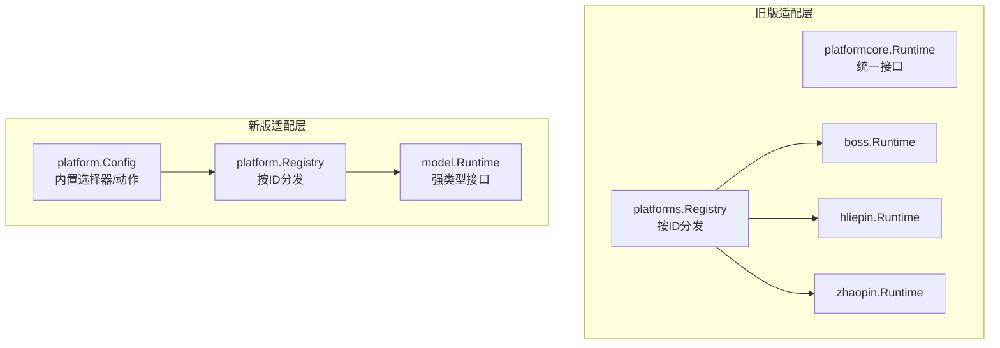
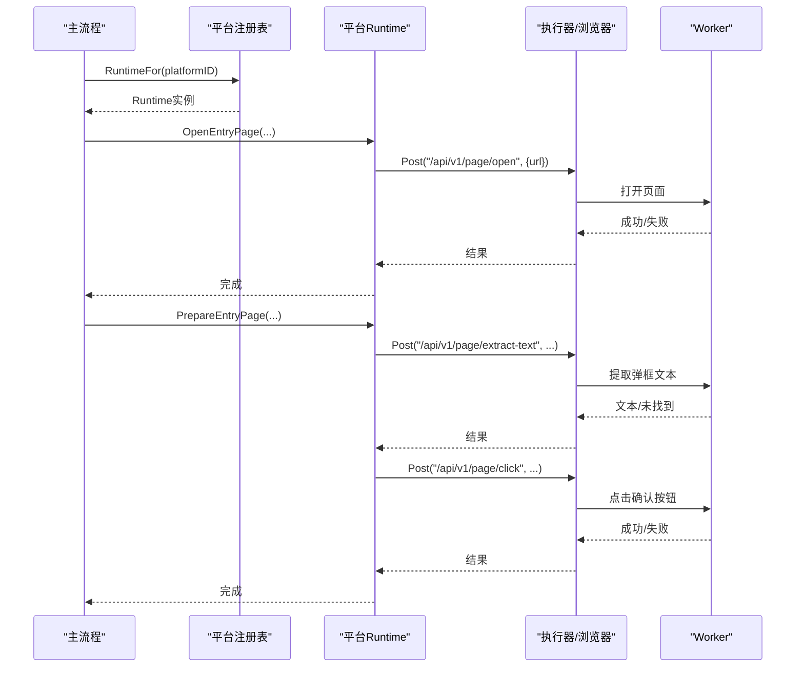
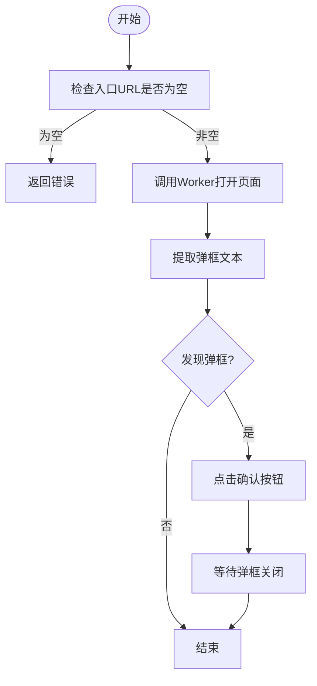
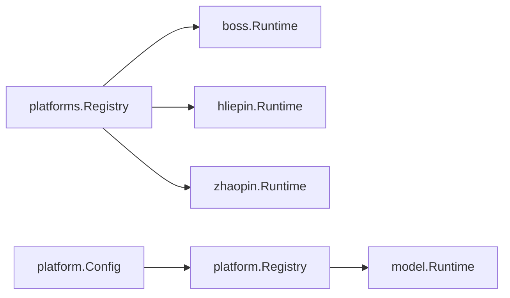

# 平台适配器

<cite>
**本文引用的文件**
- [local-agent-go/internal/platformcore/runtime.go](file://goodhr5/local-agent-go/internal/platformcore/runtime.go)
- [local-agent-go/internal/platforms/registry.go](file://goodhr5/local-agent-go/internal/platforms/registry.go)
- [local-agent-go/internal/platforms/boss/entry.go](file://goodhr5/local-agent-go/internal/platforms/boss/entry.go)
- [local-agent-go/internal/platforms/boss/runtime.go](file://goodhr5/local-agent-go/internal/platforms/boss/runtime.go)
- [local-agent-go/internal/platforms/hliepin/entry.go](file://goodhr5/local-agent-go/internal/platforms/hliepin/entry.go)
- [local-agent-go/internal/platforms/hliepin/runtime.go](file://goodhr5/local-agent-go/internal/platforms/hliepin/runtime.go)
- [local-agent-go/internal/platforms/zhaopin/entry.go](file://goodhr5/local-agent-go/internal/platforms/zhaopin/entry.go)
- [local-agent-go/internal/platforms/zhaopin/runtime.go](file://goodhr5/local-agent-go/internal/platforms/zhaopin/runtime.go)
- [local-agent-go/internal/platform/model/runtime.go](file://goodhr5/local-agent-go/internal/platform/model/runtime.go)
- [local-agent-go/internal/platform/config.go](file://goodhr5/local-agent-go/internal/platform/config.go)
- [local-agent-go/internal/platform/registry.go](file://goodhr5/local-agent-go/internal/platform/registry.go)
</cite>

## 目录
1. [简介](#简介)
2. [项目结构](#项目结构)
3. [核心组件](#核心组件)
4. [架构总览](#架构总览)
5. [详细组件分析](#详细组件分析)
6. [依赖关系分析](#依赖关系分析)
7. [性能与稳定性](#性能与稳定性)
8. [故障排查指南](#故障排查指南)
9. [结论](#结论)
10. [附录：新平台适配开发指南](#附录新平台适配开发指南)

## 简介
本文件面向多平台招聘自动化场景，系统性说明 Boss直聘、猎聘（含猎头端）、智联招聘的平台适配器设计与实现。文档覆盖抽象接口设计、通用操作封装、平台特定逻辑处理、页面元素定位、用户行为模拟、数据提取策略，并提供新平台接入、测试方法、兼容性处理、反爬应对与稳定性保障建议。

## 项目结构
本地代理代码包含两套并行演进的平台适配层：
- local-agent-go：以 platformcore.Runtime 为统一接口，通过 platforms 注册表分发到各平台实现。
- local-agent-go：以 model.Runtime 为强类型接口，配合内置配置加载器与浏览器 Worker 契约，提供更清晰的边界与可配置化能力。

图表来源
- [local-agent-go/internal/platformcore/runtime.go:46-110](file://goodhr5/local-agent-go/internal/platformcore/runtime.go#L46-L110)
- [local-agent-go/internal/platforms/registry.go:15-33](file://goodhr5/local-agent-go/internal/platforms/registry.go#L15-L33)
- [local-agent-go/internal/platform/model/runtime.go:124-152](file://goodhr5/local-agent-go/internal/platform/model/runtime.go#L124-L152)
- [local-agent-go/internal/platform/config.go:25-38](file://goodhr5/local-agent-go/internal/platform/config.go#L25-L38)
- [local-agent-go/internal/platform/registry.go:15-29](file://goodhr5/local-agent-go/internal/platform/registry.go#L15-L29)

章节来源
- [local-agent-go/internal/platformcore/runtime.go:46-110](file://goodhr5/local-agent-go/internal/platformcore/runtime.go#L46-L110)
- [local-agent-go/internal/platforms/registry.go:15-33](file://goodhr5/local-agent-go/internal/platforms/registry.go#L15-L33)
- [local-agent-go/internal/platform/model/runtime.go:124-152](file://goodhr5/local-agent-go/internal/platform/model/runtime.go#L124-L152)
- [local-agent-go/internal/platform/config.go:25-38](file://goodhr5/local-agent-go/internal/platform/config.go#L25-L38)
- [local-agent-go/internal/platform/registry.go:15-29](file://goodhr5/local-agent-go/internal/platform/registry.go#L15-L29)

## 核心组件
- 统一运行时接口
  - 旧版：platformcore.Runtime 定义打开入口页、准备入口页、判断是否仍在入口页、读取当前岗位名、切换岗位、列表候选人、滚动列表、获取详情、关闭详情、打招呼、筛选文本、指纹去重、清理详情文本等能力。
  - 新版：model.Runtime 定义更细粒度的页面、候选人、消息会话能力，并引入 Browser 抽象与 Config 配置驱动的选择器与动作。
- 执行器与浏览器契约
  - 旧版：Executor 封装对浏览器 Worker 的 Post/Log/Delay 调用。
  - 新版：Browser 暴露 OpenPage/ListPages/UsePage/FindAll/Read/Click/Input/Scroll/PressKey/ClosePage 等原子能力，供平台实现组合使用。
- 平台注册与配置
  - 旧版：platforms.Registry 按平台 ID 返回对应 Runtime。
  - 新版：platform.Registry 按平台 ID 返回 Runtime；platform.Config 通过嵌入 JSON 提供选择器、候选字段、对话字段、初始化动作、过滤动作、行为开关等。

章节来源
- [local-agent-go/internal/platformcore/runtime.go:10-110](file://goodhr5/local-agent-go/internal/platformcore/runtime.go#L10-L110)
- [local-agent-go/internal/platform/model/runtime.go:18-152](file://goodhr5/local-agent-go/internal/platform/model/runtime.go#L18-L152)
- [local-agent-go/internal/platforms/registry.go:15-33](file://goodhr5/local-agent-go/internal/platforms/registry.go#L15-L33)
- [local-agent-go/internal/platform/config.go:25-55](file://goodhr5/local-agent-go/internal/platform/config.go#L25-L55)
- [local-agent-go/internal/platform/registry.go:15-29](file://goodhr5/local-agent-go/internal/platform/registry.go#L15-L29)

## 架构总览
整体流程由主流程根据平台 ID 选择具体 Runtime，再借助 Executor/Browser 与 Worker 交互完成页面导航、元素定位、用户行为模拟和数据提取。

图表来源
- [local-agent-go/internal/platforms/boss/entry.go:14-52](file://goodhr5/local-agent-go/internal/platforms/boss/entry.go#L14-L52)
- [local-agent-go/internal/platformcore/runtime.go:46-74](file://goodhr5/local-agent-go/internal/platformcore/runtime.go#L46-L74)

章节来源
- [local-agent-go/internal/platforms/boss/entry.go:14-52](file://goodhr5/local-agent-go/internal/platforms/boss/entry.go#L14-L52)
- [local-agent-go/internal/platformcore/runtime.go:46-74](file://goodhr5/local-agent-go/internal/platformcore/runtime.go#L46-L74)

## 详细组件分析

### Boss直聘适配器
- 入口页打开与准备
  - 打开入口页：校验配置中的入口 URL，调用 Worker 打开页面并记录日志。
  - 准备入口页：尝试提取弹框文本，若存在则点击确认按钮，随后短暂等待弹框关闭。
- 页面状态判断
  - 通过列出当前所有页面，比较当前页 URL 是否与配置的入口页匹配，判断是否仍停留在入口页。
- 候选人可见定位与年龄解析
  - 构造“候选人可见”定位参数，包含平台配置、卡片索引、元素引用、诊断姓名、滚动距离与重试次数等。
  - 年龄解析优先取结构化字段，缺失时从原始文本中用正则提取“xx岁”。
- 去重与标识规范化
  - 提供候选人 ID 组成部分的规范化函数，去除空白与多余字符，提升去重稳定性。

图表来源
- [local-agent-go/internal/platforms/boss/entry.go:14-52](file://goodhr5/local-agent-go/internal/platforms/boss/entry.go#L14-L52)

章节来源
- [local-agent-go/internal/platforms/boss/entry.go:14-52](file://goodhr5/local-agent-go/internal/platforms/boss/entry.go#L14-L52)
- [local-agent-go/internal/platforms/boss/runtime.go:19-61](file://goodhr5/local-agent-go/internal/platforms/boss/runtime.go#L19-L61)

### 猎聘（猎头端）适配器
- 入口页打开与准备
  - 打开入口页：校验并打开配置中的入口 URL。
  - 准备入口页：搜索会刷新候选人条件，岗位选择和隐藏筛选在搜索完成后统一执行，因此此处无需额外动作。
- 页面状态判断
  - 通过列出页面并与入口页 URL 对比，判断是否仍在入口页。
- 候选人信息组装与年龄解析
  - 将姓名、基本信息、教育背景、学校、描述等拼接为原始文本，便于后续匹配或清洗。
  - 年龄解析策略与 Boss 类似，优先结构化字段，其次正则提取。
- 去重与标识规范化
  - 提供候选人 ID 组成部分的规范化函数，保证去重稳定。

章节来源
- [local-agent-go/internal/platforms/hliepin/entry.go:12-44](file://goodhr5/local-agent-go/internal/platforms/hliepin/entry.go#L12-L44)
- [local-agent-go/internal/platforms/hliepin/runtime.go:21-50](file://goodhr5/local-agent-go/internal/platforms/hliepin/runtime.go#L21-L50)

### 智联招聘适配器
- 入口页打开与准备
  - 打开入口页：校验并打开配置中的入口 URL。
  - 准备入口页：无特殊初始化动作。
- 页面状态判断
  - 通过列出页面并与入口页 URL 对比，判断是否仍在入口页。
- 直接切换岗位策略
  - 智联采用“每次直接切换岗位运行岗位”，不读取页面当前岗位，减少冗余步骤。
- 候选人可见定位与匹配文本
  - 构造“候选人可见”定位参数，包含平台 ID、平台配置、候选人名称、匹配文本、卡片索引、元素引用、滚动与重试参数等。
  - 匹配文本用于动态列表重新定位候选人，优先使用原始文本或基础信息。
- 年龄解析与去重
  - 年龄解析策略同上；提供候选人 ID 组成部分的规范化函数。

章节来源
- [local-agent-go/internal/platforms/zhaopin/entry.go:12-43](file://goodhr5/local-agent-go/internal/platforms/zhaopin/entry.go#L12-L43)
- [local-agent-go/internal/platforms/zhaopin/runtime.go:19-68](file://goodhr5/local-agent-go/internal/platforms/zhaopin/runtime.go#L19-L68)

### 新版适配层模型与配置
- 强类型运行时接口
  - model.Runtime 明确定义了登录页、问候页、岗位选择、基础筛选、候选人查找与滚动、详情打开/提取/关闭、打招呼、确保会话、索要信息、发送消息、收藏/拒绝、翻页、消息页扫描/阅读/回复等能力。
- 浏览器契约
  - Browser 抽象了页面管理、元素查找、读取、点击、输入、滚动、按键、关闭等原子操作，屏蔽底层差异。
- 配置驱动
  - Config 内嵌每个平台的 JSON 配置，包含选择器、候选字段、对话字段、登录/问候/消息初始化动作、过滤动作、行为开关（支持分页、跳过岗位选择、直接岗位选择、是否需要详情、拼接详情页截图等）。
- 任务配置校验
  - ValidateTaskConfig 针对自动回复任务校验消息页 URL 与关键选择器是否完整，避免运行时失败。

章节来源
- [local-agent-go/internal/platform/model/runtime.go:18-152](file://goodhr5/local-agent-go/internal/platform/model/runtime.go#L18-L152)
- [local-agent-go/internal/platform/config.go:25-55](file://goodhr5/local-agent-go/internal/platform/config.go#L25-L55)

## 依赖关系分析
- 平台注册表依赖
  - 旧版：platforms.Registry 依赖 boss/hliepin/liepin/zhaopin 四个平台实现。
  - 新版：platform.Registry 依赖 boss/hliepin/liepin/zhaopin 四个平台实现。
- 运行时接口依赖
  - 旧版：platformcore.Runtime 被各平台实现依赖，并通过 Executor 与 Worker 通信。
  - 新版：model.Runtime 被各平台实现依赖，并通过 Browser 与 Worker 通信。
- 配置依赖
  - 新版：platform.Config 通过嵌入 JSON 提供平台选择器与行为参数，降低硬编码耦合。

图表来源
- [local-agent-go/internal/platforms/registry.go:15-33](file://goodhr5/local-agent-go/internal/platforms/registry.go#L15-L33)
- [local-agent-go/internal/platform/registry.go:15-29](file://goodhr5/local-agent-go/internal/platform/registry.go#L15-L29)
- [local-agent-go/internal/platform/config.go:25-38](file://goodhr5/local-agent-go/internal/platform/config.go#L25-L38)

章节来源
- [local-agent-go/internal/platforms/registry.go:15-33](file://goodhr5/local-agent-go/internal/platforms/registry.go#L15-L33)
- [local-agent-go/internal/platform/registry.go:15-29](file://goodhr5/local-agent-go/internal/platform/registry.go#L15-L29)
- [local-agent-go/internal/platform/config.go:25-38](file://goodhr5/local-agent-go/internal/platform/config.go#L25-L38)

## 性能与稳定性
- 页面与元素定位
  - 使用“候选人可见”定位策略，结合滚动距离、等待时间、最大滚动距离与重试次数，提高在动态列表中的定位成功率。
  - 通过元素引用与卡片索引双重锚定，减少因页面刷新导致的定位漂移。
- 用户行为模拟
  - 在关键操作后加入 Delay，模拟人类节奏，降低触发反爬的概率。
  - 点击前进行文本提取与存在性判断，避免误点。
- 数据提取与清洗
  - 年龄等关键字段优先读取结构化字段，缺失时回退到正则提取，兼顾效率与鲁棒性。
  - 提供候选人指纹与筛选文本，支撑去重与快速识别。
- 平台差异处理
  - 智联采用直接切换岗位策略，减少不必要的页面读取与复核。
  - 猎聘猎头端将岗位选择与筛选放在搜索完成后统一执行，避免重复刷新。
- 配置驱动的可维护性
  - 新版通过 Config 集中管理选择器与行为开关，便于平台更新时的最小化改动。

[本节为通用指导，不直接分析具体文件]

## 故障排查指南
- 入口页打开失败
  - 检查云端平台配置是否包含入口 URL；若为空，将返回错误。
  - 参考路径：[入口页打开校验与调用:14-20](file://goodhr5/local-agent-go/internal/platforms/boss/entry.go#L14-L20)、[入口页打开校验与调用:12-20](file://goodhr5/local-agent-go/internal/platforms/hliepin/entry.go#L12-L20)、[入口页打开校验与调用:12-20](file://goodhr5/local-agent-go/internal/platforms/zhaopin/entry.go#L12-L20)。
- 入口页弹框未关闭
  - 检查弹框文本提取是否成功；若未找到弹框则跳过点击；若找到则点击确认后等待关闭。
  - 参考路径：[Boss入口页弹框处理:23-52](file://goodhr5/local-agent-go/internal/platforms/boss/entry.go#L23-L52)。
- 页面状态判断异常
  - 检查页面列表是否为空；若为空则视为不在入口页；否则比较当前页 URL 与配置入口页。
  - 参考路径：[入口页判断逻辑:55-72](file://goodhr5/local-agent-go/internal/platforms/boss/entry.go#L55-L72)、[入口页判断逻辑:28-44](file://goodhr5/local-agent-go/internal/platforms/hliepin/entry.go#L28-L44)、[入口页判断逻辑:27-43](file://goodhr5/local-agent-go/internal/platforms/zhaopin/entry.go#L27-L43)。
- 候选人定位失败
  - 检查“候选人可见”定位参数是否包含必要字段（平台配置、卡片索引、元素引用、滚动与重试参数）。
  - 参考路径：[Boss可见定位参数:19-33](file://goodhr5/local-agent-go/internal/platforms/boss/runtime.go#L19-L33)、[智联可见定位参数:24-41](file://goodhr5/local-agent-go/internal/platforms/zhaopin/runtime.go#L24-L41)。
- 自动回复任务缺少配置
  - 校验消息页 URL 与关键选择器是否完整；缺失将返回错误。
  - 参考路径：[任务配置校验](file://goodhr5/local-agent-go/internal/platform/config.go:41-55)。

章节来源
- [local-agent-go/internal/platforms/boss/entry.go:14-72](file://goodhr5/local-agent-go/internal/platforms/boss/entry.go#L14-L72)
- [local-agent-go/internal/platforms/hliepin/entry.go:12-44](file://goodhr5/local-agent-go/internal/platforms/hliepin/entry.go#L12-L44)
- [local-agent-go/internal/platforms/zhaopin/entry.go:12-43](file://goodhr5/local-agent-go/internal/platforms/zhaopin/entry.go#L12-L43)
- [local-agent-go/internal/platforms/boss/runtime.go:19-33](file://goodhr5/local-agent-go/internal/platforms/boss/runtime.go#L19-L33)
- [local-agent-go/internal/platforms/zhaopin/runtime.go:24-41](file://goodhr5/local-agent-go/internal/platforms/zhaopin/runtime.go#L24-L41)
- [local-agent-go/internal/platform/config.go:41-55](file://goodhr5/local-agent-go/internal/platform/config.go#L41-L55)

## 结论
本项目通过统一的运行时接口与注册表机制，将 Boss直聘、猎聘（含猎头端）、智联招聘等平台适配解耦，既保证了跨平台一致性，又保留了平台特定的灵活性与可维护性。旧版以 Executor 为中心，新版以 Browser 与 Config 为核心，逐步向配置驱动与强类型契约演进。建议在新增平台时优先采用新版模型，利用内置配置与校验降低接入成本，并通过“候选人可见”定位、延迟与重试策略提升稳定性。

[本节为总结，不直接分析具体文件]

## 附录：新平台适配开发指南
- 选择适配层
  - 推荐采用新版 model.Runtime 与 Browser 契约，结合内置 Config 管理选择器与行为开关。
- 实现要点
  - 页面导航：实现 OpenLoginPage/InitializeLoginPage/OpenGreetingPage/InitializeGreetingPage。
  - 岗位与筛选：实现 SelectPosition/ApplyBasicFilters，必要时实现 AdvanceCandidateList 支持分页。
  - 候选人流程：实现 FindCandidates/ScrollToCandidate/OpenCandidateDetail/ExtractCandidateDetail/CleanCandidateDetailText/CloseCandidateDetail。
  - 沟通流程：实现 GreetCandidate/EnsureCandidateConversation/RequestCandidateInfo/SendCandidateMessage/CloseCandidateConversation/FavoriteCandidate/RejectCandidate。
  - 消息会话：实现 OpenMessagesPage/InitializeMessagesPage/ScanUnreadConversations/ReadConversation/ReplyConversation。
- 选择器与动作
  - 在平台目录下添加 config.json，定义 selectors、candidate_fields、conversation_fields、login_init_actions、greeting_init_actions、message_init_actions、filter_actions、behavior 等。
  - 使用 ValidateTaskConfig 校验自动回复所需配置完整性。
- 测试方法
  - 单元测试：针对选择器匹配、年龄解析、指纹生成、规范化函数等进行断言。
  - 集成测试：通过 Browser 契约模拟页面与元素操作，验证端到端流程。
  - 回归测试：平台更新后，重点回归入口页判断、弹框处理、候选人可见定位、详情页提取与关闭。
- 兼容性处理
  - 兼容不同版本页面结构：通过选择器数组与相对定位增强鲁棒性。
  - 兼容网络波动：增加重试与超时控制，合理设置滚动距离与等待时间。
- 反爬虫与稳定性
  - 模拟人类行为：随机延迟、分步操作、避免批量快速点击。
  - 降级策略：当某选择器失效时，回退到其他选择器或文本匹配。
  - 监控与日志：记录关键步骤与错误堆栈，便于快速定位问题。
- 平台特殊功能与限制
  - Boss：入口页可能存在确认弹框，需先提取文本再点击确认。
  - 猎聘猎头端：搜索会刷新候选人条件，岗位选择与筛选在搜索完成后统一执行。
  - 智联：采用直接切换岗位策略，不读取当前岗位，减少冗余步骤。

[本节为通用指导，不直接分析具体文件]