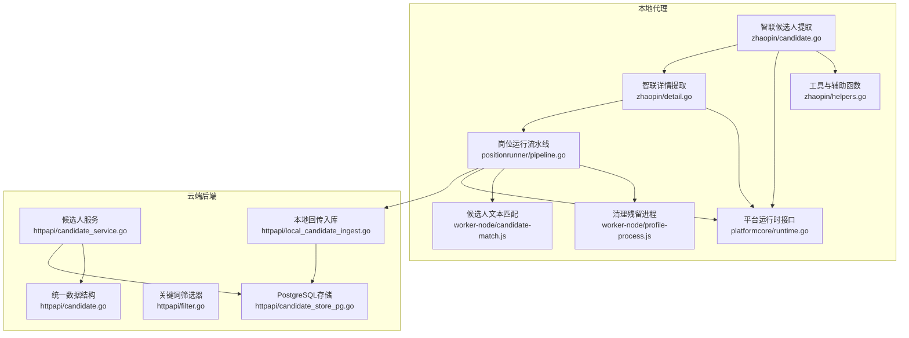
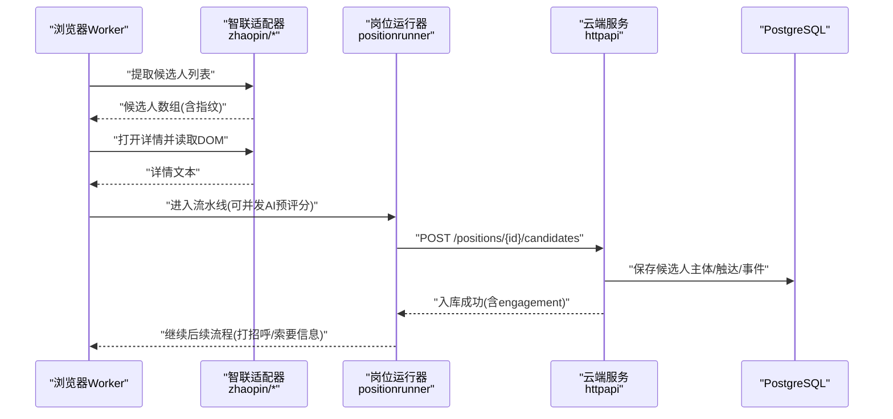
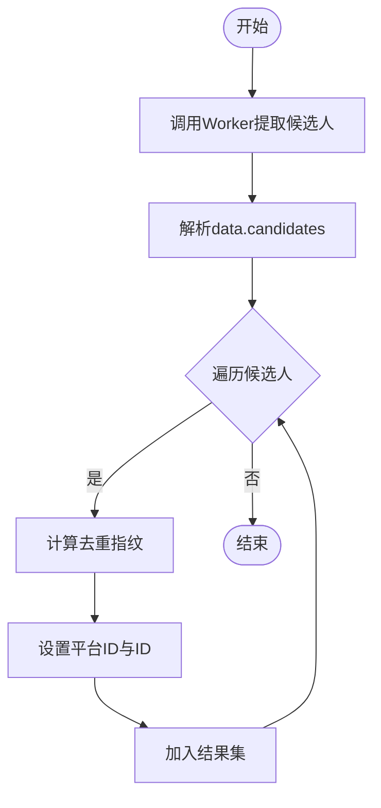
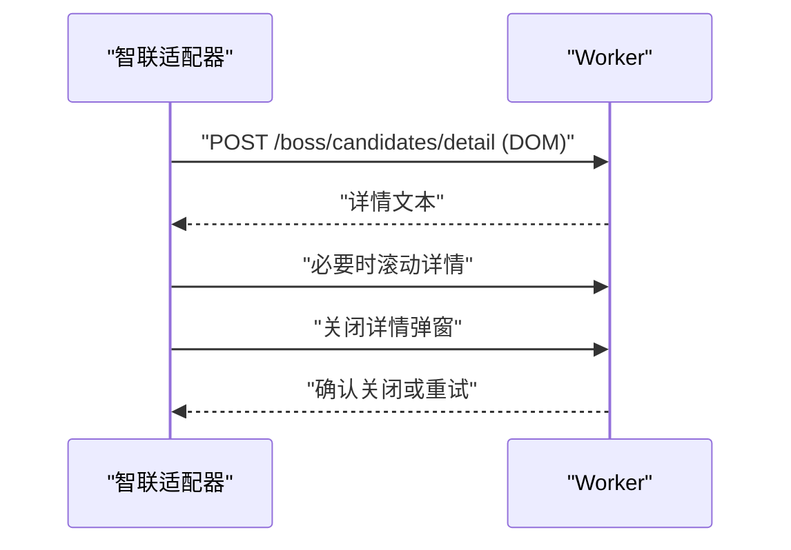
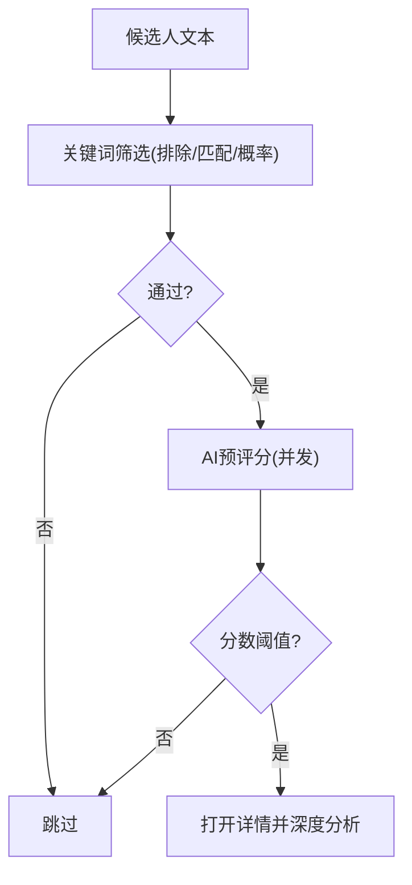
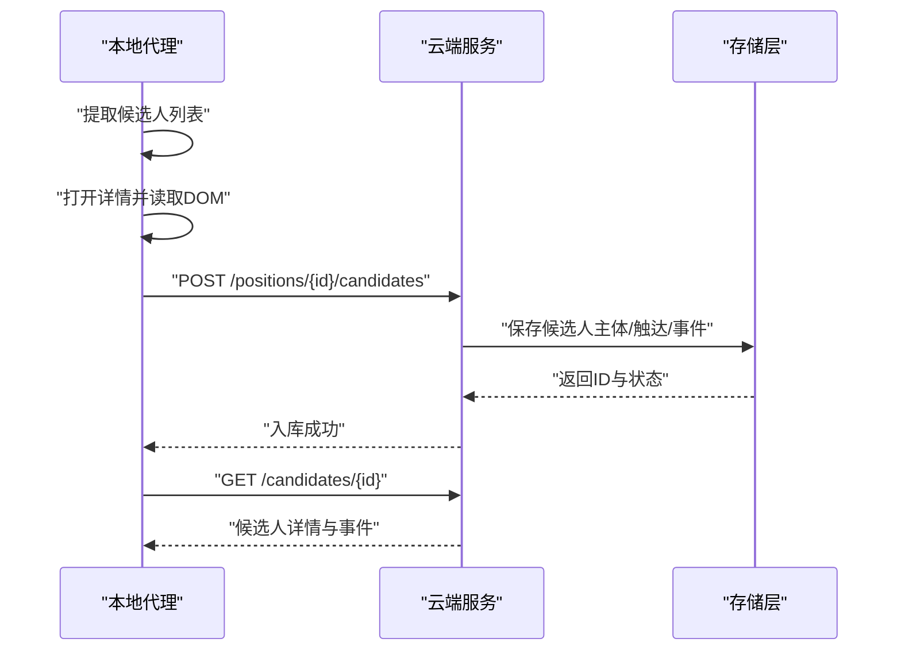
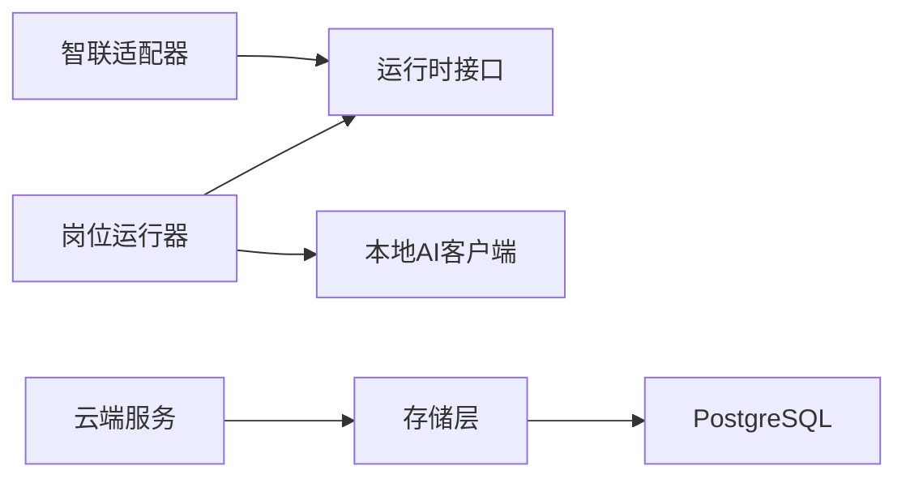

# 候选人处理

<cite>
**本文引用的文件**
- [candidate.go](file://goodhr5/local-agent-go/internal/platforms/zhaopin/candidate.go)
- [detail.go](file://goodhr5/local-agent-go/internal/platforms/zhaopin/detail.go)
- [helpers.go](file://goodhr5/local-agent-go/internal/platforms/zhaopin/helpers.go)
- [runtime.go](file://goodhr5/local-agent-go/internal/platformcore/runtime.go)
- [pipeline.go](file://goodhr5/local-agent-go/internal/positionrunner/pipeline.go)
- [candidate-match.js](file://goodhr5/local-agent-go/worker-node/src/candidate-match.js)
- [profile-process.js](file://goodhr5/local-agent-go/worker-node/src/profile-process.js)
- [candidate.go](file://goodhr5/cloud/backend/internal/httpapi/candidate.go)
- [candidate_service.go](file://goodhr5/cloud/backend/internal/httpapi/candidate_service.go)
- [filter.go](file://goodhr5/cloud/backend/internal/httpapi/filter.go)
- [local_candidate_ingest.go](file://goodhr5/cloud/backend/internal/httpapi/local_candidate_ingest.go)
- [candidate_store_pg.go](file://goodhr5/cloud/backend/internal/httpapi/candidate_store_pg.go)
</cite>

## 目录
1. [简介](#简介)
2. [项目结构](#项目结构)
3. [核心组件](#核心组件)
4. [架构总览](#架构总览)
5. [详细组件分析](#详细组件分析)
6. [依赖关系分析](#依赖关系分析)
7. [性能考量](#性能考量)
8. [故障排查指南](#故障排查指南)
9. [结论](#结论)
10. [附录](#附录)

## 简介
本文件聚焦智联招聘平台候选人的采集、解析与标准化，覆盖从本地浏览器自动化抓取、详情提取、结构化字段抽取、AI评分、状态跟踪、重复检测、数据同步到云端简历库的完整链路。文档同时给出筛选条件配置、批量处理策略、错误恢复机制以及数据流转的具体实现路径，帮助读者快速理解并扩展候选人处理能力。

## 项目结构
系统由“本地代理（浏览器自动化）+ 云端后端（简历库与API）”两部分组成：
- 本地代理负责智联招聘页面的滚动、候选人卡片提取、详情页DOM读取、关闭弹窗、去重指纹生成等。
- 云端后端提供候选人入库、查询、备注、事件流水、岗位统计同步等能力，并通过PostgreSQL持久化。

图表来源
- [candidate.go:14-49](file://goodhr5/local-agent-go/internal/platforms/zhaopin/candidate.go#L14-L49)
- [detail.go:15-39](file://goodhr5/local-agent-go/internal/platforms/zhaopin/detail.go#L15-L39)
- [helpers.go:75-99](file://goodhr5/local-agent-go/internal/platforms/zhaopin/helpers.go#L75-L99)
- [runtime.go:54-82](file://goodhr5/local-agent-go/internal/platformcore/runtime.go#L54-L82)
- [pipeline.go:49-116](file://goodhr5/local-agent-go/internal/positionrunner/pipeline.go#L49-L116)
- [candidate-match.js:27-64](file://goodhr5/local-agent-go/worker-node/src/candidate-match.js#L27-L64)
- [profile-process.js:13-65](file://goodhr5/local-agent-go/worker-node/src/profile-process.js#L13-L65)
- [candidate_service.go:30-79](file://goodhr5/cloud/backend/internal/httpapi/candidate_service.go#L30-L79)
- [candidate.go:126-143](file://goodhr5/cloud/backend/internal/httpapi/candidate.go#L126-L143)
- [filter.go:16-81](file://goodhr5/cloud/backend/internal/httpapi/filter.go#L16-L81)
- [local_candidate_ingest.go:23-127](file://goodhr5/cloud/backend/internal/httpapi/local_candidate_ingest.go#L23-L127)
- [candidate_store_pg.go:24-161](file://goodhr5/cloud/backend/internal/httpapi/candidate_store_pg.go#L24-L161)

章节来源
- [candidate.go:14-49](file://goodhr5/local-agent-go/internal/platforms/zhaopin/candidate.go#L14-L49)
- [detail.go:15-39](file://goodhr5/local-agent-go/internal/platforms/zhaopin/detail.go#L15-L39)
- [runtime.go:54-82](file://goodhr5/local-agent-go/internal/platformcore/runtime.go#L54-L82)
- [pipeline.go:49-116](file://goodhr5/local-agent-go/internal/positionrunner/pipeline.go#L49-L116)
- [candidate_service.go:30-79](file://goodhr5/cloud/backend/internal/httpapi/candidate_service.go#L30-L79)
- [local_candidate_ingest.go:23-127](file://goodhr5/cloud/backend/internal/httpapi/local_candidate_ingest.go#L23-L127)
- [candidate_store_pg.go:24-161](file://goodhr5/cloud/backend/internal/httpapi/candidate_store_pg.go#L24-L161)

## 核心组件
- 智联候选人提取：通过执行器调用Worker接口获取当前可见候选人列表，填充平台标识与指纹，返回统一Candidate对象。
- 智联详情提取：仅支持DOM模式，构造可见性请求参数，读取详情弹框文本，必要时滚动与关闭弹窗。
- 平台运行时接口：定义统一的Executor、Runtime、DetailRequest/Result等抽象，屏蔽平台差异。
- 岗位运行流水线：为候选人开启并发AI预评分工作池，按页面顺序投递任务，控制超时与日志。
- 候选人文本匹配：基于双字符相似度与姓名包含度进行稳定匹配，用于动态列表中重新定位目标候选人。
- 云端候选人服务：提供候选人列表、详情、备注等HTTP API，封装权限与团队隔离。
- 本地回传入库：接收本地程序回传的候选人JSON，写入候选人主体、触达上下文、事件流水，并更新岗位统计。
- PostgreSQL存储：三表模型（候选人主体、触达上下文、事件），支持分页、筛选、级联删除与复杂查询。

章节来源
- [candidate.go:14-49](file://goodhr5/local-agent-go/internal/platforms/zhaopin/candidate.go#L14-L49)
- [detail.go:15-39](file://goodhr5/local-agent-go/internal/platforms/zhaopin/detail.go#L15-L39)
- [runtime.go:54-82](file://goodhr5/local-agent-go/internal/platformcore/runtime.go#L54-L82)
- [pipeline.go:49-116](file://goodhr5/local-agent-go/internal/positionrunner/pipeline.go#L49-L116)
- [candidate-match.js:27-64](file://goodhr5/local-agent-go/worker-node/src/candidate-match.js#L27-L64)
- [candidate_service.go:30-79](file://goodhr5/cloud/backend/internal/httpapi/candidate_service.go#L30-L79)
- [local_candidate_ingest.go:23-127](file://goodhr5/cloud/backend/internal/httpapi/local_candidate_ingest.go#L23-L127)
- [candidate_store_pg.go:24-161](file://goodhr5/cloud/backend/internal/httpapi/candidate_store_pg.go#L24-L161)

## 架构总览
本地代理通过平台适配器（智联）与Worker交互，完成候选人列表提取与详情DOM读取；随后将结构化结果与AI评分回传给云端。云端服务校验权限、落库候选人主体与触达上下文，记录事件流水，并提供查询与备注能力。

图表来源
- [candidate.go:14-49](file://goodhr5/local-agent-go/internal/platforms/zhaopin/candidate.go#L14-L49)
- [detail.go:15-39](file://goodhr5/local-agent-go/internal/platforms/zhaopin/detail.go#L15-L39)
- [pipeline.go:49-116](file://goodhr5/local-agent-go/internal/positionrunner/pipeline.go#L49-L116)
- [local_candidate_ingest.go:23-127](file://goodhr5/cloud/backend/internal/httpapi/local_candidate_ingest.go#L23-L127)
- [candidate_store_pg.go:24-161](file://goodhr5/cloud/backend/internal/httpapi/candidate_store_pg.go#L24-L161)

## 详细组件分析

### 智联候选人提取与去重
- 列表提取：调用Worker接口获取候选人卡片，记录耗时与数量，逐条转换为统一Candidate，注入平台ID与指纹。
- 去重指纹：优先使用平台候选人ID，否则基于姓名与年龄生成稳定指纹，避免重复入库。
- 可见性与滚动：提供滚动列表与确保候选人可见的方法，便于后续操作。

图表来源
- [candidate.go:14-49](file://goodhr5/local-agent-go/internal/platforms/zhaopin/candidate.go#L14-L49)
- [helpers.go:75-99](file://goodhr5/local-agent-go/internal/platforms/zhaopin/helpers.go#L75-L99)

章节来源
- [candidate.go:14-49](file://goodhr5/local-agent-go/internal/platforms/zhaopin/candidate.go#L14-L49)
- [helpers.go:75-99](file://goodhr5/local-agent-go/internal/platforms/zhaopin/helpers.go#L75-L99)

### 智联详情提取与清理
- DOM模式限制：仅支持DOM模式读取详情，确保数据来源一致。
- 可见性参数：构造可见性请求，禁用截图、设置滚动尝试次数与就绪超时。
- 关闭弹窗：发送Escape键并验证弹窗是否关闭，失败时重试。

图表来源
- [detail.go:15-39](file://goodhr5/local-agent-go/internal/platforms/zhaopin/detail.go#L15-L39)
- [detail.go:57-95](file://goodhr5/local-agent-go/internal/platforms/zhaopin/detail.go#L57-L95)

章节来源
- [detail.go:15-39](file://goodhr5/local-agent-go/internal/platforms/zhaopin/detail.go#L15-L39)
- [detail.go:57-95](file://goodhr5/local-agent-go/internal/platforms/zhaopin/detail.go#L57-L95)

### 候选人基本信息提取与简历结构化
- 统一数据结构：云端定义了候选人薪资区间、工作经历、教育经历、证书、荣誉、项目经验、沟通记录等结构化类型。
- 本地回传映射：云端入库时将本地JSON映射到统一结构，保留原始文本与附件信息。
- 时间戳与状态：记录首次看到、详情获取、打招呼、简历索要等关键时间点。

章节来源
- [candidate.go:6-143](file://goodhr5/cloud/backend/internal/httpapi/candidate.go#L6-L143)
- [local_candidate_ingest.go:61-127](file://goodhr5/cloud/backend/internal/httpapi/local_candidate_ingest.go#L61-L127)

### 匹配度评分算法
- AI预评分：岗位运行流水线为每个候选人启动并发工作协程，调用本地AI客户端进行基础预评分，决定是否值得打开详情。
- 关键词筛选：云端提供关键词筛选器，支持排除词、AND/OR模式与概率通过，用于快速过滤。
- 文本相似度：在动态列表中，使用双字符相似度与姓名包含度进行稳定匹配，提高定位准确率。

图表来源
- [pipeline.go:49-116](file://goodhr5/local-agent-go/internal/positionrunner/pipeline.go#L49-L116)
- [filter.go:16-81](file://goodhr5/cloud/backend/internal/httpapi/filter.go#L16-L81)
- [candidate-match.js:27-64](file://goodhr5/local-agent-go/worker-node/src/candidate-match.js#L27-L64)

章节来源
- [pipeline.go:49-116](file://goodhr5/local-agent-go/internal/positionrunner/pipeline.go#L49-L116)
- [filter.go:16-81](file://goodhr5/cloud/backend/internal/httpapi/filter.go#L16-L81)
- [candidate-match.js:27-64](file://goodhr5/local-agent-go/worker-node/src/candidate-match.js#L27-L64)

### 候选人状态跟踪与事件流水
- 触达上下文：记录候选人、岗位与账号的关系，维护状态与关键时间。
- 事件流水：保存AI评分、打招呼、索要信息等事件，支持前端展示与审计。
- 状态更新：根据本地回传的状态与标志位，更新详情获取、打招呼、简历索要时间。

章节来源
- [candidate_store_pg.go:163-230](file://goodhr5/cloud/backend/internal/httpapi/candidate_store_pg.go#L163-L230)
- [candidate_store_pg.go:232-295](file://goodhr5/cloud/backend/internal/httpapi/candidate_store_pg.go#L232-L295)
- [local_candidate_ingest.go:111-127](file://goodhr5/cloud/backend/internal/httpapi/local_candidate_ingest.go#L111-L127)

### 重复检测与唯一性
- 平台ID优先：若存在平台候选人ID，则作为唯一键。
- 文本兜底：若无平台ID，使用姓名、电话、邮箱、地区、工作年限、摘要拼接的稳定键。
- 本地指纹：智联适配器基于姓名与年龄生成指纹，辅助去重。

章节来源
- [candidate_store_pg.go:753-761](file://goodhr5/cloud/backend/internal/httpapi/candidate_store_pg.go#L753-L761)
- [candidate.go:76-85](file://goodhr5/local-agent-go/internal/platforms/zhaopin/candidate.go#L76-L85)

### 数据同步机制
- 本地回传：本地程序将候选人JSON提交至云端，云端保存主体、触达与事件，并更新岗位统计。
- 统计同步：支持累计扫描、跳过、失败计数同步，保障报表一致性。
- 用户流追踪：首次简历处理与打招呼成功触发用户流事件。

章节来源
- [local_candidate_ingest.go:23-127](file://goodhr5/cloud/backend/internal/httpapi/local_candidate_ingest.go#L23-L127)
- [local_candidate_ingest.go:137-232](file://goodhr5/cloud/backend/internal/httpapi/local_candidate_ingest.go#L137-L232)

### 候选人筛选条件配置
- 关键词与排除词：支持空关键词的概率通过、AND/OR模式、命中关键词记录。
- 点击频率：无关键词时可配置概率通过频率，控制随机性。
- 前端筛选：云端列表支持按岗位、关键词、状态分页查询。

章节来源
- [filter.go:16-81](file://goodhr5/cloud/backend/internal/httpapi/filter.go#L16-L81)
- [candidate_service.go:30-79](file://goodhr5/cloud/backend/internal/httpapi/candidate_service.go#L30-L79)

### 批量处理方法
- 并发预评分：流水线为候选人队列创建固定并发的工作协程，提升吞吐。
- 超时保护：单个候选人关键操作带超时与异常捕获，避免阻塞整体流程。
- 分页与范围：云端列表查询支持分页与团队/岗位范围限定。

章节来源
- [pipeline.go:49-116](file://goodhr5/local-agent-go/internal/positionrunner/pipeline.go#L49-L116)
- [pipeline.go:14-47](file://goodhr5/local-agent-go/internal/positionrunner/pipeline.go#L14-L47)
- [candidate_store_pg.go:374-407](file://goodhr5/cloud/backend/internal/httpapi/candidate_store_pg.go#L374-L407)

### 错误恢复策略
- 详情关闭重试：关闭详情弹窗失败时再次按键并等待，直至确认关闭。
- 进程清理：Windows下精确终止占用指定Profile的浏览器进程树，防止资源冲突。
- 超时与日志：所有关键操作记录耗时与错误，便于定位问题。

章节来源
- [detail.go:57-95](file://goodhr5/local-agent-go/internal/platforms/zhaopin/detail.go#L57-L95)
- [profile-process.js:13-65](file://goodhr5/local-agent-go/worker-node/src/profile-process.js#L13-L65)
- [pipeline.go:14-47](file://goodhr5/local-agent-go/internal/positionrunner/pipeline.go#L14-L47)

### 候选人数据流转示例
- 列表提取：本地提取候选人卡片，生成指纹与平台ID。
- 详情读取：打开详情弹框，读取DOM文本，必要时滚动。
- 流水线处理：并发AI预评分，决定是否深入。
- 云端入库：提交JSON，保存主体、触达与事件，更新统计。
- 查询展示：前端通过API获取候选人列表与详情，查看备注与事件。

图表来源
- [candidate.go:14-49](file://goodhr5/local-agent-go/internal/platforms/zhaopin/candidate.go#L14-L49)
- [detail.go:15-39](file://goodhr5/local-agent-go/internal/platforms/zhaopin/detail.go#L15-L39)
- [local_candidate_ingest.go:23-127](file://goodhr5/cloud/backend/internal/httpapi/local_candidate_ingest.go#L23-L127)
- [candidate_service.go:113-149](file://goodhr5/cloud/backend/internal/httpapi/candidate_service.go#L113-L149)

## 依赖关系分析
- 平台适配层依赖运行时接口，屏蔽具体平台差异。
- 岗位运行器依赖本地AI客户端与执行器，管理并发与超时。
- 云端服务依赖存储层与租户服务，保证权限与团队隔离。
- 存储层通过SQL与JSONB字段实现复杂查询与灵活扩展。

图表来源
- [runtime.go:54-82](file://goodhr5/local-agent-go/internal/platformcore/runtime.go#L54-L82)
- [pipeline.go:49-116](file://goodhr5/local-agent-go/internal/positionrunner/pipeline.go#L49-L116)
- [candidate_store_pg.go:24-161](file://goodhr5/cloud/backend/internal/httpapi/candidate_store_pg.go#L24-L161)

章节来源
- [runtime.go:54-82](file://goodhr5/local-agent-go/internal/platformcore/runtime.go#L54-L82)
- [pipeline.go:49-116](file://goodhr5/local-agent-go/internal/positionrunner/pipeline.go#L49-L116)
- [candidate_store_pg.go:24-161](file://goodhr5/cloud/backend/internal/httpapi/candidate_store_pg.go#L24-L161)

## 性能考量
- 并发预评分：通过固定并发工作协程提升吞吐量，避免串行瓶颈。
- 超时控制：关键操作设置超时，防止长时间阻塞影响整体流程。
- 数据库优化：使用JSONB字段与LATERAL JOIN提升查询效率，分页减少响应体积。
- 文本匹配优化：双字符相似度与姓名包含度结合，降低误匹配率。

[本节提供通用指导，无需特定文件引用]

## 故障排查指南
- 详情弹窗未关闭：检查按键与验证逻辑，必要时重试并记录错误。
- 进程占用冲突：使用进程清理脚本终止残留浏览器进程，确保Profile可用。
- 入库失败：检查本地JSON字段映射与云端接收逻辑，核对必填字段与类型。
- 查询为空：确认团队与岗位范围、关键词与状态筛选条件是否正确。

章节来源
- [detail.go:57-95](file://goodhr5/local-agent-go/internal/platforms/zhaopin/detail.go#L57-L95)
- [profile-process.js:13-65](file://goodhr5/local-agent-go/worker-node/src/profile-process.js#L13-L65)
- [local_candidate_ingest.go:23-127](file://goodhr5/cloud/backend/internal/httpapi/local_candidate_ingest.go#L23-L127)
- [candidate_service.go:30-79](file://goodhr5/cloud/backend/internal/httpapi/candidate_service.go#L30-L79)

## 结论
本方案通过本地代理与云端后端的协同，实现了智联招聘候选人从采集、解析、结构化到评分与入库的全链路处理。借助并发流水线、关键词筛选与AI预评分，系统在效率与准确性之间取得平衡；通过事件流水与状态跟踪，提供了完整的可观测性与可追溯性。未来可扩展更多平台适配与更精细的评分模型，进一步提升候选人匹配质量。

[本节总结内容，无需特定文件引用]

## 附录
- 统一数据结构参考：候选人薪资、工作经历、教育经历、证书、荣誉、项目经验、沟通记录等。
- 筛选配置建议：合理设置关键词与排除词，结合概率通过控制探索范围。
- 批量处理建议：根据候选人数量调整并发数，监控超时与错误率。

[本节提供补充信息，无需特定文件引用]