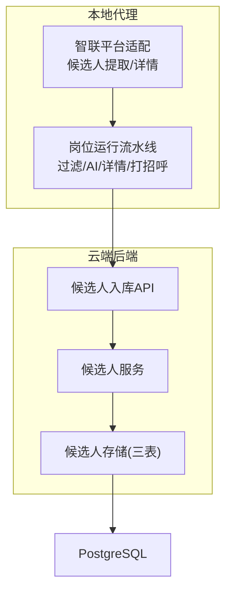
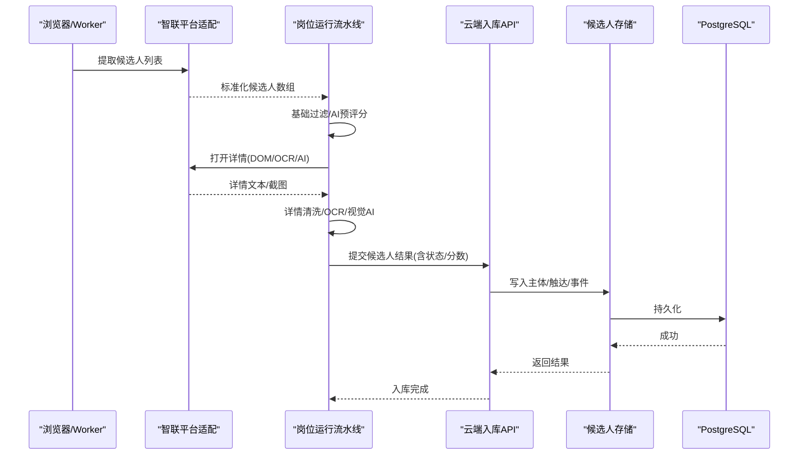
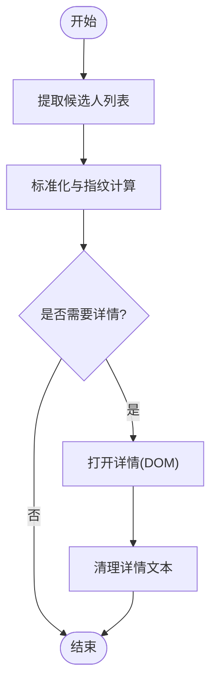
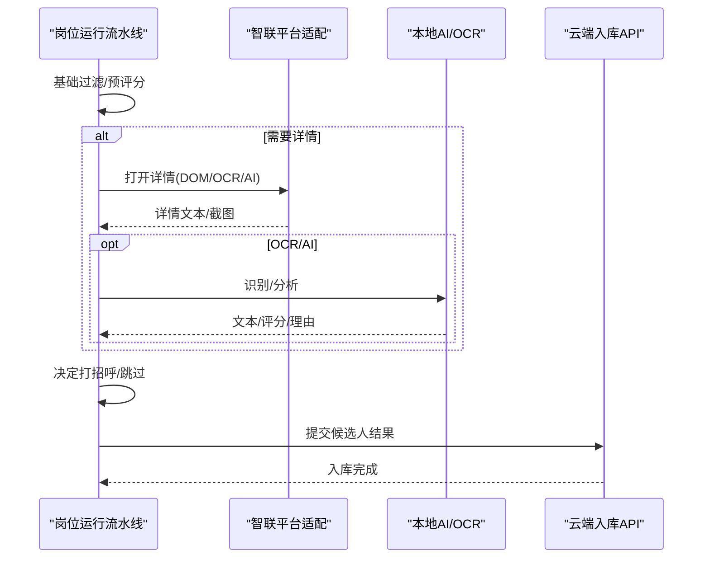
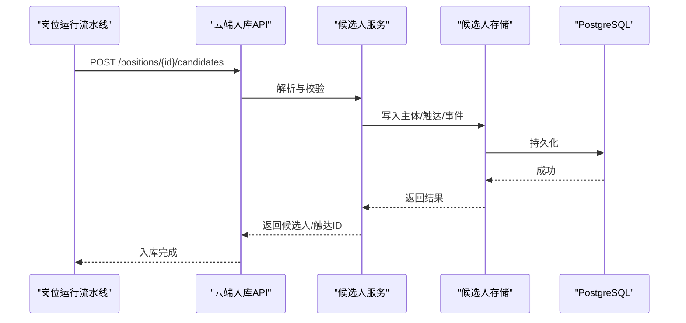
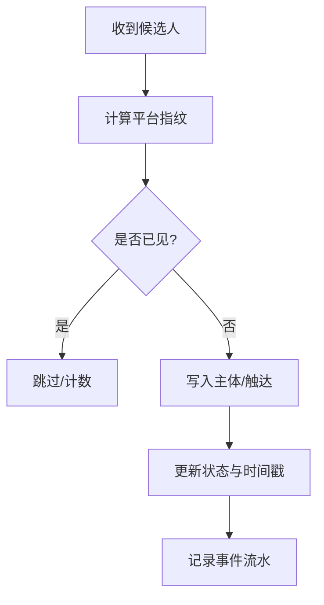
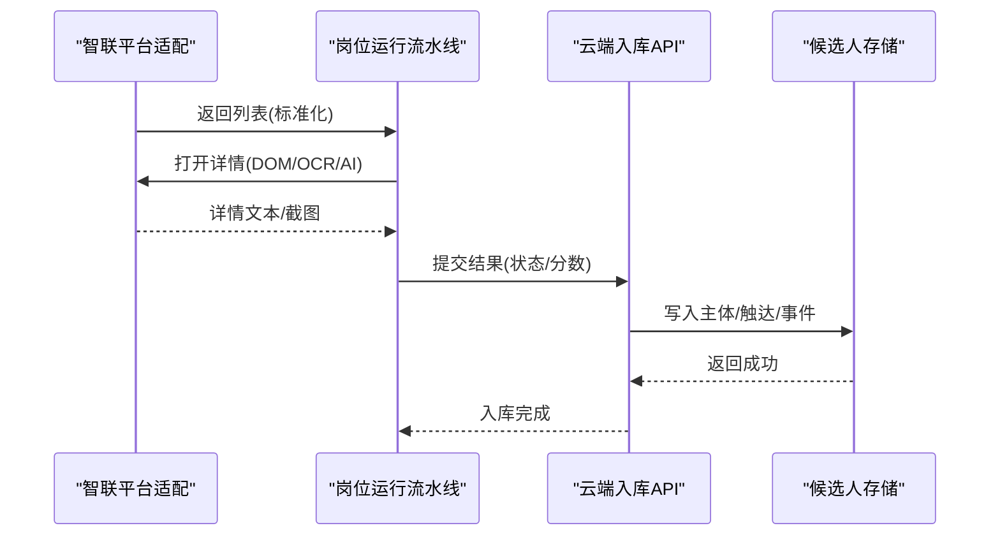
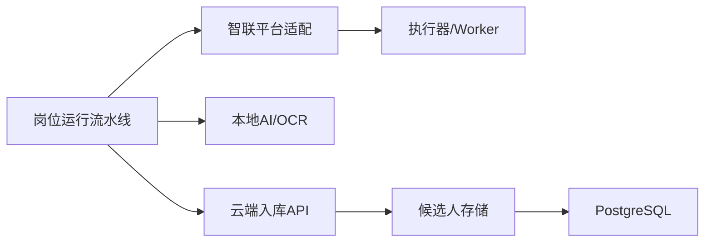

# 候选人处理

<cite>
**本文引用的文件**
- [candidate.go](file://goodhr5/local-agent-go/internal/platforms/zhaopin/candidate.go)
- [detail.go](file://goodhr5/local-agent-go/internal/platforms/zhaopin/detail.go)
- [pipeline.go](file://goodhr5/local-agent-go/internal/positionrunner/pipeline.go)
- [candidate.go](file://goodhr5/local-agent-go/internal/positionrunner/candidate.go)
- [detail.go](file://goodhr5/local-agent-go/internal/positionrunner/detail.go)
- [candidate-match.js](file://goodhr5/local-agent-go/worker-node/src/candidate-match.js)
- [local_candidate_ingest.go](file://goodhr5/cloud/backend/internal/httpapi/local_candidate_ingest.go)
- [candidate_service.go](file://goodhr5/cloud/backend/internal/httpapi/candidate_service.go)
- [candidate_store_pg.go](file://goodhr5/cloud/backend/internal/httpapi/candidate_store_pg.go)
</cite>

## 目录
1. [简介](#简介)
2. [项目结构](#项目结构)
3. [核心组件](#核心组件)
4. [架构总览](#架构总览)
5. [详细组件分析](#详细组件分析)
6. [依赖关系分析](#依赖关系分析)
7. [性能考量](#性能考量)
8. [故障排查指南](#故障排查指南)
9. [结论](#结论)
10. [附录](#附录)

## 简介
本文件聚焦智联招聘平台的候选人处理功能，覆盖从候选人数据采集、解析与标准化，到简历内容结构化、匹配度评分、状态跟踪、重复检测、数据同步、筛选配置、批量处理与错误恢复的全链路实现。文档以代码为依据，提供可视化流程图与时序图，帮助读者快速理解候选人数据在本地代理、云端后端与数据库之间的流转过程。

## 项目结构
围绕智联招聘的候选人处理，主要涉及以下模块：
- 平台适配层（本地代理）：负责从浏览器提取候选人列表、打开详情、滚动详情、关闭详情等页面操作，并输出标准化的候选人数据。
- 岗位运行流水线（本地代理）：对候选人进行基础过滤、AI 预评分、详情读取（DOM/OCR/AI）、打招呼执行、休息模拟、重试与超时控制。
- 云端入库服务（云端后端）：接收本地回传的候选人结果，持久化到三表模型（主体、触达、事件），并提供查询与备注能力。
- 存储层（PostgreSQL）：通过候选人的唯一键去重，维护触达上下文状态与时间戳，记录事件流水。

**图表来源**
- [candidate.go:14-49](file://goodhr5/local-agent-go/internal/platforms/zhaopin/candidate.go#L14-L49)
- [detail.go:15-39](file://goodhr5/local-agent-go/internal/platforms/zhaopin/detail.go#L15-L39)
- [pipeline.go:49-116](file://goodhr5/local-agent-go/internal/positionrunner/pipeline.go#L49-L116)
- [local_candidate_ingest.go:25-124](file://goodhr5/cloud/backend/internal/httpapi/local_candidate_ingest.go#L25-L124)
- [candidate_service.go:31-76](file://goodhr5/cloud/backend/internal/httpapi/candidate_service.go#L31-L76)
- [candidate_store_pg.go:24-160](file://goodhr5/cloud/backend/internal/httpapi/candidate_store_pg.go#L24-L160)

**章节来源**
- [candidate.go:14-49](file://goodhr5/local-agent-go/internal/platforms/zhaopin/candidate.go#L14-L49)
- [detail.go:15-39](file://goodhr5/local-agent-go/internal/platforms/zhaopin/detail.go#L15-L39)
- [pipeline.go:49-116](file://goodhr5/local-agent-go/internal/positionrunner/pipeline.go#L49-L116)
- [local_candidate_ingest.go:25-124](file://goodhr5/cloud/backend/internal/httpapi/local_candidate_ingest.go#L25-L124)
- [candidate_service.go:31-76](file://goodhr5/cloud/backend/internal/httpapi/candidate_service.go#L31-L76)
- [candidate_store_pg.go:24-160](file://goodhr5/cloud/backend/internal/httpapi/candidate_store_pg.go#L24-L160)

## 核心组件
- 智联平台适配层
  - 候选人列表提取：调用 Worker 接口获取卡片数据，补充平台标识与指纹，返回标准化候选人数组。
  - 详情读取：仅支持 DOM 模式，构造可见性负载并请求详情文本；支持滚动与关闭详情弹框。
  - 去重指纹：基于姓名与年龄生成稳定 ID，用于跨批次去重。
- 岗位运行流水线
  - 并发处理池：为详情页 AI 评分启动工作协程，按批投递候选人，限制并发度。
  - 详情增强：根据岗位配置的详情模式（DOM/OCR/AI）读取详情文本或图片，必要时 OCR 识别或调用视觉 AI。
  - 打招呼执行：带重试、随机延时、上限控制、索要信息（电话/微信/简历）与评分阈值判断。
  - 休息模拟：按策略插入模拟休息，提升拟人化。
- 云端入库服务
  - 接收本地回传 JSON，映射为标准字段，写入候选人主体与触达上下文，保存 AI 评分事件，更新岗位统计。
  - 提供候选人列表、详情、备注等查询接口，支持团队隔离与分页搜索。
- 存储层
  - 三表模型：候选人主体、触达上下文、事件流水。
  - 去重与幂等：基于租户+平台+平台候选人ID的唯一键；无平台ID时以多字段拼接兜底。
  - 状态与时间：触达上下文维护状态、首次看到时间、详情获取时间、打招呼时间等。

**章节来源**
- [candidate.go:14-85](file://goodhr5/local-agent-go/internal/platforms/zhaopin/candidate.go#L14-L85)
- [detail.go:15-102](file://goodhr5/local-agent-go/internal/platforms/zhaopin/detail.go#L15-L102)
- [pipeline.go:49-150](file://goodhr5/local-agent-go/internal/positionrunner/pipeline.go#L49-L150)
- [candidate.go:16-350](file://goodhr5/local-agent-go/internal/positionrunner/candidate.go#L16-L350)
- [detail.go:88-279](file://goodhr5/local-agent-go/internal/positionrunner/detail.go#L88-L279)
- [local_candidate_ingest.go:25-124](file://goodhr5/cloud/backend/internal/httpapi/local_candidate_ingest.go#L25-L124)
- [candidate_service.go:31-146](file://goodhr5/cloud/backend/internal/httpapi/candidate_service.go#L31-L146)
- [candidate_store_pg.go:24-160](file://goodhr5/cloud/backend/internal/httpapi/candidate_store_pg.go#L24-L160)

## 架构总览
候选人数据从浏览器采集到云端入库的关键路径如下：

**图表来源**
- [candidate.go:14-49](file://goodhr5/local-agent-go/internal/platforms/zhaopin/candidate.go#L14-L49)
- [detail.go:15-39](file://goodhr5/local-agent-go/internal/platforms/zhaopin/detail.go#L15-L39)
- [detail.go:122-279](file://goodhr5/local-agent-go/internal/positionrunner/detail.go#L122-L279)
- [local_candidate_ingest.go:25-124](file://goodhr5/cloud/backend/internal/httpapi/local_candidate_ingest.go#L25-L124)
- [candidate_store_pg.go:24-160](file://goodhr5/cloud/backend/internal/httpapi/candidate_store_pg.go#L24-L160)

## 详细组件分析

### 智联平台适配层（候选人提取与详情）
- 候选人列表提取
  - 通过执行器 POST 到 Worker 接口，传入平台标识与最大数量，解析返回的候选人卡片集合，补充平台ID与指纹后返回。
  - 日志包含查找耗时、转换耗时与总耗时，便于性能观测。
- 详情读取
  - 仅支持 DOM 模式，构造可见性负载并请求详情文本；若为空则报错。
  - 支持滚动详情弹框与关闭弹框，具备重试与确认机制。
- 去重指纹
  - 基于姓名与年龄生成稳定 ID，避免跨批次重复入库。

**图表来源**
- [candidate.go:14-49](file://goodhr5/local-agent-go/internal/platforms/zhaopin/candidate.go#L14-L49)
- [detail.go:15-39](file://goodhr5/local-agent-go/internal/platforms/zhaopin/detail.go#L15-L39)
- [detail.go:57-96](file://goodhr5/local-agent-go/internal/platforms/zhaopin/detail.go#L57-L96)
- [candidate.go:72-85](file://goodhr5/local-agent-go/internal/platforms/zhaopin/candidate.go#L72-L85)

**章节来源**
- [candidate.go:14-85](file://goodhr5/local-agent-go/internal/platforms/zhaopin/candidate.go#L14-L85)
- [detail.go:15-102](file://goodhr5/local-agent-go/internal/platforms/zhaopin/detail.go#L15-L102)

### 岗位运行流水线（批量处理与AI评分）
- 并发处理池
  - 为详情页 AI 评分启动多个 worker，按页顺序投递候选人，限制并发度以避免资源争用。
  - 每个操作带超时与异常捕获，记录耗时与错误。
- 详情增强
  - 根据岗位配置选择详情模式：DOM、OCR、AI。
  - DOM 直接取文本；OCR 使用本地 OCR 识别截图；AI 使用视觉模型分析长图并输出打分与理由。
  - 失败分支记录错误并决定是否继续或终止运行。
- 打招呼执行
  - 带重试、随机延时、上限控制。
  - 可选“索要信息”动作（电话/微信/简历），需满足最终 AI 评分严格大于阈值。
  - 成功后更新状态为已打招呼，并可触发声音提示。
- 休息模拟
  - 按策略插入模拟休息，提升拟人化体验。

**图表来源**
- [pipeline.go:49-116](file://goodhr5/local-agent-go/internal/positionrunner/pipeline.go#L49-L116)
- [detail.go:88-279](file://goodhr5/local-agent-go/internal/positionrunner/detail.go#L88-L279)
- [candidate.go:16-135](file://goodhr5/local-agent-go/internal/positionrunner/candidate.go#L16-L135)
- [local_candidate_ingest.go:25-124](file://goodhr5/cloud/backend/internal/httpapi/local_candidate_ingest.go#L25-L124)

**章节来源**
- [pipeline.go:49-150](file://goodhr5/local-agent-go/internal/positionrunner/pipeline.go#L49-L150)
- [detail.go:88-279](file://goodhr5/local-agent-go/internal/positionrunner/detail.go#L88-L279)
- [candidate.go:16-217](file://goodhr5/local-agent-go/internal/positionrunner/candidate.go#L16-L217)

### 云端入库与查询（数据同步与状态跟踪）
- 入库流程
  - 接收本地回传 JSON，映射为标准字段，写入候选人主体与触达上下文。
  - 保存 AI 评分事件（详情分析与打招呼分析），更新岗位统计计数。
  - 根据状态设置详情获取时间与打招呼时间。
- 查询与备注
  - 提供候选人列表、详情、备注接口，支持团队隔离、分页与关键词搜索。
  - 备注作为事件类型存储，支持查看与新增。

**图表来源**
- [local_candidate_ingest.go:25-124](file://goodhr5/cloud/backend/internal/httpapi/local_candidate_ingest.go#L25-L124)
- [candidate_service.go:31-146](file://goodhr5/cloud/backend/internal/httpapi/candidate_service.go#L31-L146)
- [candidate_store_pg.go:24-160](file://goodhr5/cloud/backend/internal/httpapi/candidate_store_pg.go#L24-L160)

**章节来源**
- [local_candidate_ingest.go:25-124](file://goodhr5/cloud/backend/internal/httpapi/local_candidate_ingest.go#L25-L124)
- [candidate_service.go:31-146](file://goodhr5/cloud/backend/internal/httpapi/candidate_service.go#L31-L146)
- [candidate_store_pg.go:24-160](file://goodhr5/cloud/backend/internal/httpapi/candidate_store_pg.go#L24-L160)

### 候选人状态跟踪与重复检测
- 状态跟踪
  - 触达上下文维护状态（如扫描、通过、详情获取、已打招呼、失败、跳过）。
  - 关键时间戳：首次看到、详情获取、打招呼、最后事件时间。
- 重复检测
  - 平台级指纹：基于姓名与年龄生成稳定 ID。
  - 云端唯一键：优先使用平台候选人ID，否则以多字段拼接兜底。
  - 列表阶段去重：内存中维护已见 ID 集合，过滤重复项。

**图表来源**
- [candidate.go:72-85](file://goodhr5/local-agent-go/internal/platforms/zhaopin/candidate.go#L72-L85)
- [candidate_store_pg.go:675-683](file://goodhr5/cloud/backend/internal/httpapi/candidate_store_pg.go#L675-L683)
- [candidate.go:269-287](file://goodhr5/local-agent-go/internal/positionrunner/candidate.go#L269-L287)

**章节来源**
- [candidate.go:72-85](file://goodhr5/local-agent-go/internal/platforms/zhaopin/candidate.go#L72-L85)
- [candidate_store_pg.go:675-683](file://goodhr5/cloud/backend/internal/httpapi/candidate_store_pg.go#L675-L683)
- [candidate.go:269-287](file://goodhr5/local-agent-go/internal/positionrunner/candidate.go#L269-L287)

### 候选人筛选条件配置与批量处理方法
- 筛选条件
  - 关键词模式：可在列表阶段进行关键词过滤（当未开启详情阶段时生效）。
  - 详情模式：DOM/OCR/AI，影响是否读取详情及后续评分。
  - 索要信息阈值：最终 AI 评分严格大于阈值才允许索要信息。
- 批量处理
  - 并发工作协程池：按批投递候选人，限制并发度。
  - 超时与重试：单个操作带超时，打招呼带重试次数。
  - 休息模拟：按策略插入休息，提升拟人化。

**章节来源**
- [detail.go:377-399](file://goodhr5/local-agent-go/internal/positionrunner/detail.go#L377-L399)
- [candidate.go:95-109](file://goodhr5/local-agent-go/internal/positionrunner/candidate.go#L95-L109)
- [pipeline.go:49-150](file://goodhr5/local-agent-go/internal/positionrunner/pipeline.go#L49-L150)

### 错误恢复策略
- 超时控制：关键操作统一封装超时与异常捕获，记录耗时与错误。
- 重试机制：打招呼支持多次重试，间隔短延迟。
- 异常分类：区分浏览器关闭、OCR不可用、AI持续不可用等致命错误，决定是否停止运行。
- 收尾保障：岗位运行退出前补关可能仍打开的详情弹框。

**章节来源**
- [pipeline.go:14-47](file://goodhr5/local-agent-go/internal/positionrunner/pipeline.go#L14-L47)
- [candidate.go:111-135](file://goodhr5/local-agent-go/internal/positionrunner/candidate.go#L111-L135)
- [detail.go:150-168](file://goodhr5/local-agent-go/internal/positionrunner/detail.go#L150-L168)
- [detail.go:316-329](file://goodhr5/local-agent-go/internal/positionrunner/detail.go#L316-L329)

### 候选人数据流转的具体实现示例
- 列表提取与标准化
  - 平台适配层调用 Worker 接口，解析返回的候选人卡片，补充平台ID与指纹，返回标准化数组。
- 详情读取与清洗
  - 根据模式读取 DOM 文本或截图，OCR 识别或视觉 AI 分析，清洗后合并到原始文本。
- 入库与状态更新
  - 云端接收结果，写入主体与触达上下文，保存 AI 评分事件，更新统计计数与用户流。

**图表来源**
- [candidate.go:14-49](file://goodhr5/local-agent-go/internal/platforms/zhaopin/candidate.go#L14-L49)
- [detail.go:15-39](file://goodhr5/local-agent-go/internal/platforms/zhaopin/detail.go#L15-L39)
- [detail.go:122-279](file://goodhr5/local-agent-go/internal/positionrunner/detail.go#L122-L279)
- [local_candidate_ingest.go:25-124](file://goodhr5/cloud/backend/internal/httpapi/local_candidate_ingest.go#L25-L124)
- [candidate_store_pg.go:24-160](file://goodhr5/cloud/backend/internal/httpapi/candidate_store_pg.go#L24-L160)

**章节来源**
- [candidate.go:14-49](file://goodhr5/local-agent-go/internal/platforms/zhaopin/candidate.go#L14-L49)
- [detail.go:15-39](file://goodhr5/local-agent-go/internal/platforms/zhaopin/detail.go#L15-L39)
- [detail.go:122-279](file://goodhr5/local-agent-go/internal/positionrunner/detail.go#L122-L279)
- [local_candidate_ingest.go:25-124](file://goodhr5/cloud/backend/internal/httpapi/local_candidate_ingest.go#L25-L124)
- [candidate_store_pg.go:24-160](file://goodhr5/cloud/backend/internal/httpapi/candidate_store_pg.go#L24-L160)

## 依赖关系分析
- 平台适配层依赖执行器（Executor）与云端平台配置，向 Worker 发起请求。
- 岗位运行流水线依赖平台运行时、本地 AI/OCR 客户端与云端入库 API。
- 云端入库服务依赖候选人存储与租户存储，确保团队隔离与权限控制。
- 存储层依赖 PostgreSQL，使用事务与超时控制保证一致性。

**图表来源**
- [candidate.go:14-49](file://goodhr5/local-agent-go/internal/platforms/zhaopin/candidate.go#L14-L49)
- [pipeline.go:49-150](file://goodhr5/local-agent-go/internal/positionrunner/pipeline.go#L49-L150)
- [local_candidate_ingest.go:25-124](file://goodhr5/cloud/backend/internal/httpapi/local_candidate_ingest.go#L25-L124)
- [candidate_store_pg.go:24-160](file://goodhr5/cloud/backend/internal/httpapi/candidate_store_pg.go#L24-L160)

**章节来源**
- [candidate.go:14-49](file://goodhr5/local-agent-go/internal/platforms/zhaopin/candidate.go#L14-L49)
- [pipeline.go:49-150](file://goodhr5/local-agent-go/internal/positionrunner/pipeline.go#L49-L150)
- [local_candidate_ingest.go:25-124](file://goodhr5/cloud/backend/internal/httpapi/local_candidate_ingest.go#L25-L124)
- [candidate_store_pg.go:24-160](file://goodhr5/cloud/backend/internal/httpapi/candidate_store_pg.go#L24-L160)

## 性能考量
- 并发控制：详情页 AI 评分采用工作协程池，限制并发度避免资源争用。
- 超时与重试：关键操作统一超时封装，打招呼支持重试，降低瞬时失败影响。
- 去重优化：平台级指纹与云端唯一键双重去重，减少重复入库。
- 查询优化：列表查询使用 LATERAL JOIN 与索引友好的 WHERE 条件，支持分页与关键词搜索。

[本节为通用指导，不直接分析具体文件]

## 故障排查指南
- 详情读取失败
  - 检查详情模式配置（DOM/OCR/AI），确认 Worker 可用与截图路径有效。
  - 关注错误分类：浏览器关闭、OCR不可用、AI持续不可用等致命错误会停止运行。
- 打招呼失败
  - 检查重试次数与延时配置，确认平台接口可用。
  - 核对索要信息阈值与最终 AI 评分，确保满足严格大于条件。
- 入库失败
  - 检查云端 API 鉴权与参数校验，确认候选人字段完整。
  - 查看事件流水与日志，定位具体失败点。

**章节来源**
- [detail.go:150-168](file://goodhr5/local-agent-go/internal/positionrunner/detail.go#L150-L168)
- [candidate.go:111-135](file://goodhr5/local-agent-go/internal/positionrunner/candidate.go#L111-L135)
- [local_candidate_ingest.go:25-124](file://goodhr5/cloud/backend/internal/httpapi/local_candidate_ingest.go#L25-L124)

## 结论
智联招聘平台的候选人处理功能通过平台适配层、岗位运行流水线与云端入库服务的协同，实现了从采集、解析、标准化到结构化、评分、状态跟踪、去重与同步的全链路自动化。系统具备并发处理、超时重试、休息模拟与错误恢复等特性，保障了高可用与拟人化体验。建议在生产环境中合理配置详情模式、AI 阈值与并发度，并结合日志与事件流水进行监控与调优。

[本节为总结，不直接分析具体文件]

## 附录
- 候选人匹配文本相似度算法
  - 使用双字符相似度计算，结合姓名匹配权重，选出最佳匹配项，用于动态列表中重新定位目标候选人。

**章节来源**
- [candidate-match.js:8-65](file://goodhr5/local-agent-go/worker-node/src/candidate-match.js#L8-L65)