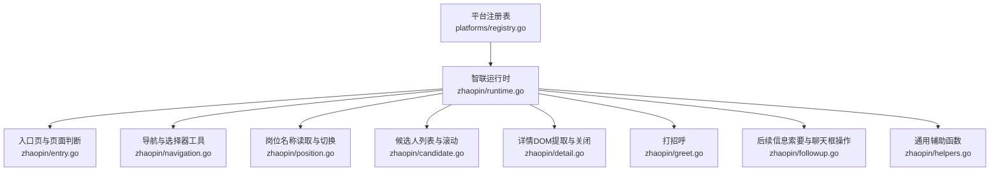
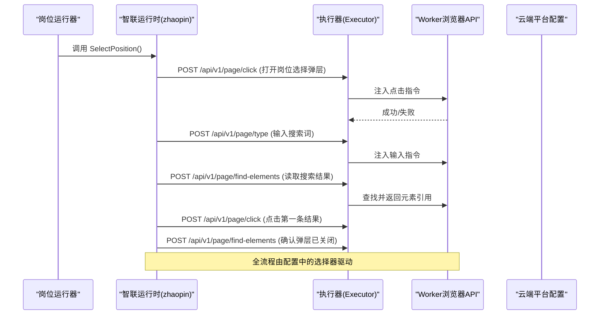
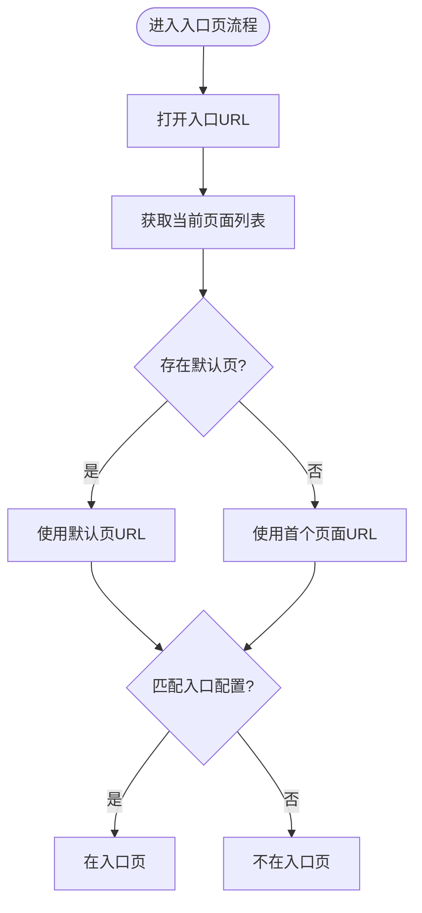
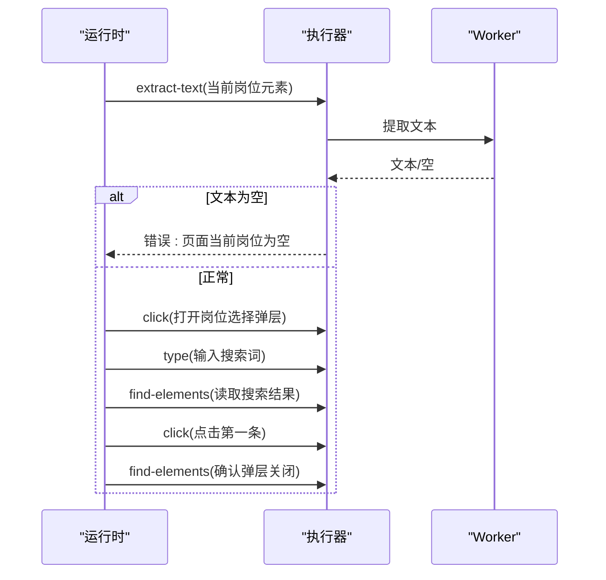
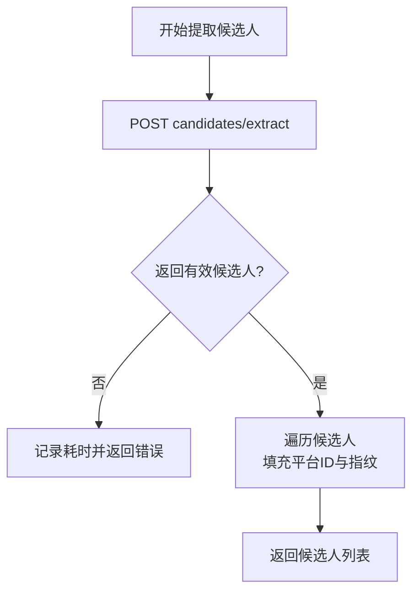
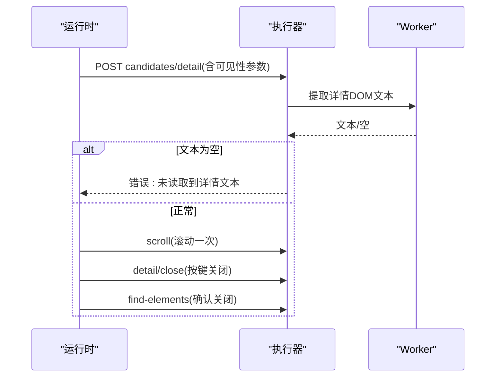
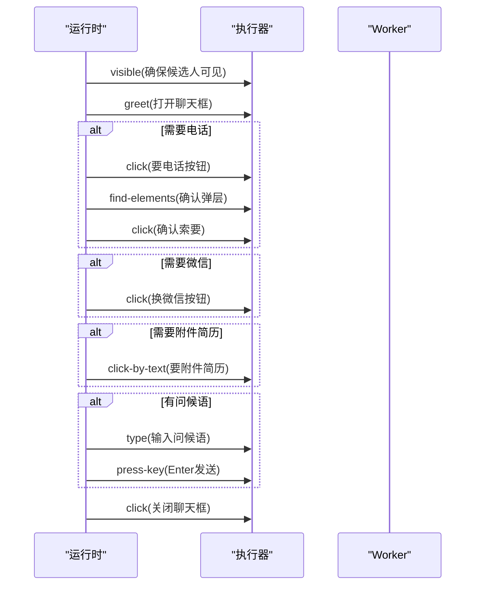
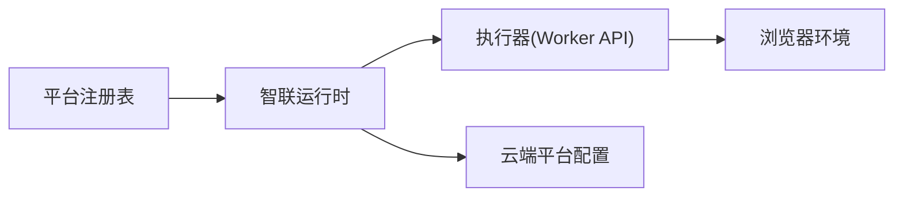

# 智联招聘适配器

<cite>
**本文引用的文件**
- [registry.go](file://goodhr5/local-agent-go/internal/platforms/registry.go)
- [entry.go](file://goodhr5/local-agent-go/internal/platforms/zhaopin/entry.go)
- [runtime.go](file://goodhr5/local-agent-go/internal/platforms/zhaopin/runtime.go)
- [navigation.go](file://goodhr5/local-agent-go/internal/platforms/zhaopin/navigation.go)
- [position.go](file://goodhr5/local-agent-go/internal/platforms/zhaopin/position.go)
- [candidate.go](file://goodhr5/local-agent-go/internal/platforms/zhaopin/candidate.go)
- [detail.go](file://goodhr5/local-agent-go/internal/platforms/zhaopin/detail.go)
- [greet.go](file://goodhr5/local-agent-go/internal/platforms/zhaopin/greet.go)
- [followup.go](file://goodhr5/local-agent-go/internal/platforms/zhaopin/followup.go)
- [helpers.go](file://goodhr5/local-agent-go/internal/platforms/zhaopin/helpers.go)
- [0012_platform_locator_schema.sql](file://goodhr5/cloud/backend/db/migrations/0012_platform_locator_schema.sql)
- [0003_insert_platform_configs.sql](file://goodhr5/cloud/backend/db/migrations/0003_insert_platform_configs.sql)
</cite>

## 目录
1. [简介](#简介)
2. [项目结构](#项目结构)
3. [核心组件](#核心组件)
4. [架构总览](#架构总览)
5. [详细组件分析](#详细组件分析)
6. [依赖关系分析](#依赖关系分析)
7. [性能考虑](#性能考虑)
8. [故障排查指南](#故障排查指南)
9. [结论](#结论)
10. [附录](#附录)

## 简介
本文件为智联招聘平台适配器的技术文档，聚焦于该适配器在本地Agent中的职责边界、页面交互策略、数据提取与处理流程。内容覆盖：
- 页面结构与选择器配置来源
- JavaScript渲染与异步加载的协作方式（通过Worker API）
- 职位浏览、候选人匹配、简历详情解析、消息发送等关键流程
- 表单输入、弹窗操作、关闭策略
- 配置项说明、兼容性处理、错误恢复机制与性能优化建议

## 项目结构
智联招聘适配器位于本地Agent平台的“平台运行时”模块中，按平台维度组织代码。注册表将平台ID映射到具体实现；zhaopin包提供入口页、导航、岗位切换、候选人列表、详情、打招呼与后续信息索要等能力。

图表来源
- [registry.go:15-20](file://goodhr5/local-agent-go/internal/platforms/registry.go#L15-L20)
- [runtime.go:11-22](file://goodhr5/local-agent-go/internal/platforms/zhaopin/runtime.go#L11-L22)
- [entry.go:12-43](file://goodhr5/local-agent-go/internal/platforms/zhaopin/entry.go#L12-L43)
- [navigation.go:12-93](file://goodhr5/local-agent-go/internal/platforms/zhaopin/navigation.go#L12-L93)
- [position.go:11-102](file://goodhr5/local-agent-go/internal/platforms/zhaopin/position.go#L11-L102)
- [candidate.go:13-85](file://goodhr5/local-agent-go/internal/platforms/zhaopin/candidate.go#L13-L85)
- [detail.go:13-102](file://goodhr5/local-agent-go/internal/platforms/zhaopin/detail.go#L13-L102)
- [greet.go:11-22](file://goodhr5/local-agent-go/internal/platforms/zhaopin/greet.go#L11-L22)
- [followup.go:14-168](file://goodhr5/local-agent-go/internal/platforms/zhaopin/followup.go#L14-L168)
- [helpers.go:9-186](file://goodhr5/local-agent-go/internal/platforms/zhaopin/helpers.go#L9-L186)

章节来源
- [registry.go:1-35](file://goodhr5/local-agent-go/internal/platforms/registry.go#L1-L35)

## 核心组件
- 运行时入口与能力声明：定义平台ID、是否直接选择岗位、候选可见性参数模板等。
- 入口页管理：打开入口URL、判断当前页面是否为入口页。
- 导航与选择器：入口页配置解析、默认页选择、URL匹配、岗位搜索关键词规范化、列表容器与项合并策略。
- 岗位切换：读取当前岗位名、打开岗位选择弹层、输入关键词、定位并点击结果、校验弹层关闭。
- 候选人列表：提取可见候选人、滚动列表、确保目标卡片可见、去重指纹生成。
- 详情解析：仅支持DOM模式，调用Worker接口获取详情文本，滚动一次以补充可视区域，关闭详情弹窗。
- 打招呼：先确保候选人可见，再触发打招呼动作。
- 后续信息索要：打开聊天框，按需点击要电话/换微信/要附件简历按钮，发送首次问候语，安全关闭聊天框。
- 辅助工具：Worker响应解析、元素定位载荷转换、日志格式化、字段提取等。

章节来源
- [runtime.go:11-69](file://goodhr5/local-agent-go/internal/platforms/zhaopin/runtime.go#L11-L69)
- [entry.go:12-43](file://goodhr5/local-agent-go/internal/platforms/zhaopin/entry.go#L12-L43)
- [navigation.go:12-162](file://goodhr5/local-agent-go/internal/platforms/zhaopin/navigation.go#L12-L162)
- [position.go:11-102](file://goodhr5/local-agent-go/internal/platforms/zhaopin/position.go#L11-L102)
- [candidate.go:13-85](file://goodhr5/local-agent-go/internal/platforms/zhaopin/candidate.go#L13-L85)
- [detail.go:13-102](file://goodhr5/local-agent-go/internal/platforms/zhaopin/detail.go#L13-L102)
- [greet.go:11-22](file://goodhr5/local-agent-go/internal/platforms/zhaopin/greet.go#L11-L22)
- [followup.go:14-168](file://goodhr5/local-agent-go/internal/platforms/zhaopin/followup.go#L14-L168)
- [helpers.go:9-207](file://goodhr5/local-agent-go/internal/platforms/zhaopin/helpers.go#L9-L207)

## 架构总览
智联招聘适配器采用“Go运行时 + Worker脚本”的协作模式：
- Go运行时负责编排流程、构造请求、解析返回、记录日志与错误。
- Worker侧提供浏览器自动化API（点击、输入、查找元素、滚动、截图等），并通过统一HTTP接口暴露。
- 平台配置（选择器、行为开关、页面集合）来自云端数据库迁移脚本，运行时通过配置驱动页面交互。

图表来源
- [position.go:31-102](file://goodhr5/local-agent-go/internal/platforms/zhaopin/position.go#L31-L102)
- [helpers.go:75-99](file://goodhr5/local-agent-go/internal/platforms/zhaopin/helpers.go#L75-L99)
- [0012_platform_locator_schema.sql:48-88](file://goodhr5/cloud/backend/db/migrations/0012_platform_locator_schema.sql#L48-L88)

章节来源
- [position.go:31-102](file://goodhr5/local-agent-go/internal/platforms/zhaopin/position.go#L31-L102)
- [helpers.go:75-99](file://goodhr5/local-agent-go/internal/platforms/zhaopin/helpers.go#L75-L99)

## 详细组件分析

### 入口页与页面判断
- 打开入口页：通过执行器POST打开配置的入口URL。
- 判断是否在入口页：获取Worker返回的页面列表，取默认页并与配置中的入口URL进行前缀或包含匹配。

图表来源
- [entry.go:12-43](file://goodhr5/local-agent-go/internal/platforms/zhaopin/entry.go#L12-L43)
- [navigation.go:41-71](file://goodhr5/local-agent-go/internal/platforms/zhaopin/navigation.go#L41-L71)

章节来源
- [entry.go:12-43](file://goodhr5/local-agent-go/internal/platforms/zhaopin/entry.go#L12-L43)
- [navigation.go:41-71](file://goodhr5/local-agent-go/internal/platforms/zhaopin/navigation.go#L41-L71)

### 岗位浏览与切换
- 读取当前岗位名：从配置指定的元素中提取文本，若为空则告警并报错。
- 切换岗位：打开岗位选择弹层，输入精简关键词，读取搜索结果，点击第一条，等待并校验弹层关闭。

图表来源
- [position.go:11-102](file://goodhr5/local-agent-go/internal/platforms/zhaopin/position.go#L11-L102)

章节来源
- [position.go:11-102](file://goodhr5/local-agent-go/internal/platforms/zhaopin/position.go#L11-L102)

### 候选人匹配与可见性
- 提取可见候选人：调用Worker批量提取接口，附带平台ID、配置、最大数量等参数，返回结构化候选人列表。
- 滚动列表：通过Worker滚动距离控制加载更多。
- 确保可见：基于候选人卡片索引、元素引用、距离、等待时间等参数，小步滚动定位目标卡片。
- 去重指纹：结合姓名与年龄生成稳定标识，用于跨页面去重。

图表来源
- [candidate.go:13-85](file://goodhr5/local-agent-go/internal/platforms/zhaopin/candidate.go#L13-L85)
- [runtime.go:24-48](file://goodhr5/local-agent-go/internal/platforms/zhaopin/runtime.go#L24-L48)

章节来源
- [candidate.go:13-85](file://goodhr5/local-agent-go/internal/platforms/zhaopin/candidate.go#L13-L85)
- [runtime.go:24-48](file://goodhr5/local-agent-go/internal/platforms/zhaopin/runtime.go#L24-L48)

### 简历详情解析
- 模式限制：仅支持DOM模式。
- 详情提取：构造可见性参数，设置详情页超时、滚动尝试次数、视口边距等，调用Worker获取详情文本。
- 滚动补充：在AI分析期间滚动一次详情弹窗以提升可读性。
- 关闭详情：优先按键关闭，二次检测未关闭时再次按键，最终仍未关闭则报错。

图表来源
- [detail.go:13-102](file://goodhr5/local-agent-go/internal/platforms/zhaopin/detail.go#L13-L102)

章节来源
- [detail.go:13-102](file://goodhr5/local-agent-go/internal/platforms/zhaopin/detail.go#L13-L102)

### 打招呼与后续信息索要
- 打招呼：先确保候选人可见，再调用打招呼接口。
- 后续信息索要：
  - 打开聊天框后，根据配置决定是否需要电话、微信、附件简历。
  - 通过精确选择器或文本点击相应按钮。
  - 如需手机号，检查是否存在确认弹层并点击确认。
  - 可选发送首次问候语（输入并回车）。
  - 使用兜底逻辑关闭聊天框。

图表来源
- [greet.go:11-22](file://goodhr5/local-agent-go/internal/platforms/zhaopin/greet.go#L11-L22)
- [followup.go:30-168](file://goodhr5/local-agent-go/internal/platforms/zhaopin/followup.go#L30-L168)

章节来源
- [greet.go:11-22](file://goodhr5/local-agent-go/internal/platforms/zhaopin/greet.go#L11-L22)
- [followup.go:30-168](file://goodhr5/local-agent-go/internal/platforms/zhaopin/followup.go#L30-L168)

### 配置与选择器
- 云端配置来源：系统配置表中存储各平台的选择器与行为配置，智联招聘的配置包含入口页、卡片容器与字段、动作按钮、详情弹窗、额外字段以及行为开关。
- 运行时解析：通过配置分区读取入口页、岗位相关选择器、候选人卡片字段等；元素定位支持新旧两种键名兼容。
- 本地选择器验证：测试用例验证了岗位选择弹层的打开、输入、结果项、标题与面板选择器。

章节来源
- [0012_platform_locator_schema.sql:48-88](file://goodhr5/cloud/backend/db/migrations/0012_platform_locator_schema.sql#L48-L88)
- [0003_insert_platform_configs.sql:14-22](file://goodhr5/cloud/backend/db/migrations/0003_insert_platform_configs.sql#L14-L22)
- [helpers.go:112-160](file://goodhr5/local-agent-go/internal/platforms/zhaopin/helpers.go#L112-L160)
- [navigation.go:12-93](file://goodhr5/local-agent-go/internal/platforms/zhaopin/navigation.go#L12-L93)

## 依赖关系分析
- 平台注册：运行时通过平台ID注册表分发到智联实现。
- 执行器抽象：所有浏览器操作均通过执行器POST到Worker的统一API，避免直接耦合浏览器细节。
- 配置驱动：选择器与行为开关来自云端配置，运行时动态解析，便于平台升级与A/B测试。
- 外部依赖：Worker提供页面操作、元素查找、滚动、截图等能力；云端配置作为选择器与行为来源。

图表来源
- [registry.go:15-20](file://goodhr5/local-agent-go/internal/platforms/registry.go#L15-L20)
- [helpers.go:75-99](file://goodhr5/local-agent-go/internal/platforms/zhaopin/helpers.go#L75-L99)
- [0012_platform_locator_schema.sql:48-88](file://goodhr5/cloud/backend/db/migrations/0012_platform_locator_schema.sql#L48-L88)

章节来源
- [registry.go:15-20](file://goodhr5/local-agent-go/internal/platforms/registry.go#L15-L20)
- [helpers.go:75-99](file://goodhr5/local-agent-go/internal/platforms/zhaopin/helpers.go#L75-L99)

## 性能考虑
- 减少无效滚动：候选人可见性参数中包含距离、等待时间与滚动尝试次数，避免过度滚动导致卡顿。
- 批量提取：候选人提取一次性返回多张卡片，降低多次网络往返。
- 精准定位：使用元素引用与父级类组合提升查找稳定性，减少重试。
- 超时与延迟：关键步骤设置合理超时与短暂延迟，平衡速度与稳定性。
- 日志与度量：记录各阶段耗时，便于定位瓶颈。

[本节为通用指导，不直接分析具体文件]

## 故障排查指南
- 入口页未命中：检查入口URL配置与当前页面列表，确认匹配规则（前缀/包含/精确）。
- 岗位切换失败：确认岗位选择弹层选择器可用；检查输入关键词是否被清洗过；确认搜索结果至少有一条且包含元素引用。
- 候选人提取为空：核对卡片容器与字段选择器；查看Worker返回的耗时与计数；必要时调整滚动距离与等待时间。
- 详情文本为空：确认仅使用DOM模式；检查详情页打开与滚动尝试次数；如仍为空，检查视口边距与超时设置。
- 聊天框关闭失败：优先按键关闭，二次检测未关闭时再次按键；若仍失败，记录当前页面元素状态以便进一步诊断。
- 配置变更影响：当云端配置更新后，需验证选择器是否仍然有效；可通过本地测试用例快速回归。

章节来源
- [entry.go:27-43](file://goodhr5/local-agent-go/internal/platforms/zhaopin/entry.go#L27-L43)
- [position.go:31-102](file://goodhr5/local-agent-go/internal/platforms/zhaopin/position.go#L31-L102)
- [candidate.go:13-85](file://goodhr5/local-agent-go/internal/platforms/zhaopin/candidate.go#L13-L85)
- [detail.go:13-102](file://goodhr5/local-agent-go/internal/platforms/zhaopin/detail.go#L13-L102)
- [followup.go:158-168](file://goodhr5/local-agent-go/internal/platforms/zhaopin/followup.go#L158-L168)

## 结论
智联招聘适配器通过清晰的运行时分层与Worker协作，实现了稳定的页面交互与数据提取。其优势在于：
- 配置驱动的选择器与行为，便于平台升级与扩展
- 明确的错误恢复与兜底策略，提高鲁棒性
- 合理的性能优化点，兼顾速度与稳定性
建议在后续迭代中持续监控Worker返回指标，完善异常分支的自愈策略，并加强选择器变更的自动化回归测试。

[本节为总结性内容，不直接分析具体文件]

## 附录
- 平台配置示例与字段说明可参考云端迁移脚本中的JSON结构，包括入口页、卡片容器与字段、动作按钮、详情弹窗、额外字段与行为开关。
- 本地选择器验证用例可用于快速回归岗位选择弹层相关选择器。

章节来源
- [0012_platform_locator_schema.sql:48-88](file://goodhr5/cloud/backend/db/migrations/0012_platform_locator_schema.sql#L48-L88)
- [0003_insert_platform_configs.sql:14-22](file://goodhr5/cloud/backend/db/migrations/0003_insert_platform_configs.sql#L14-L22)