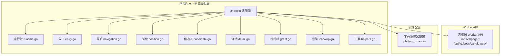
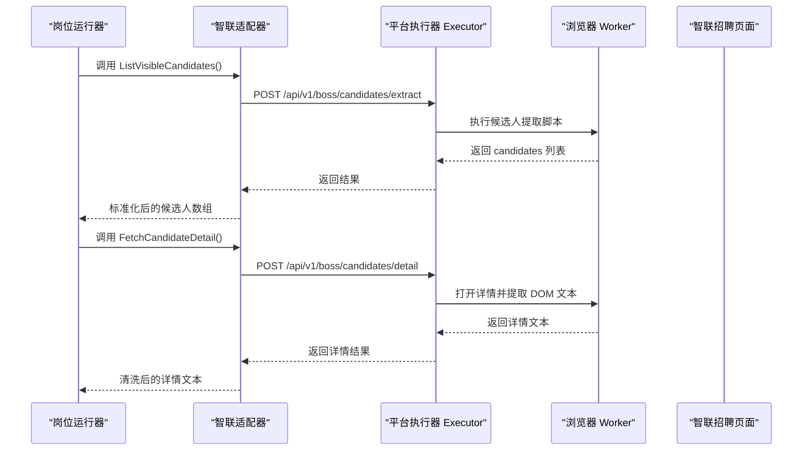
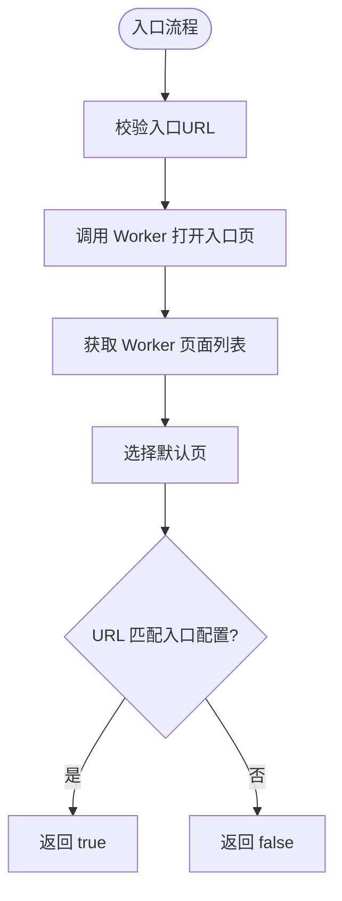
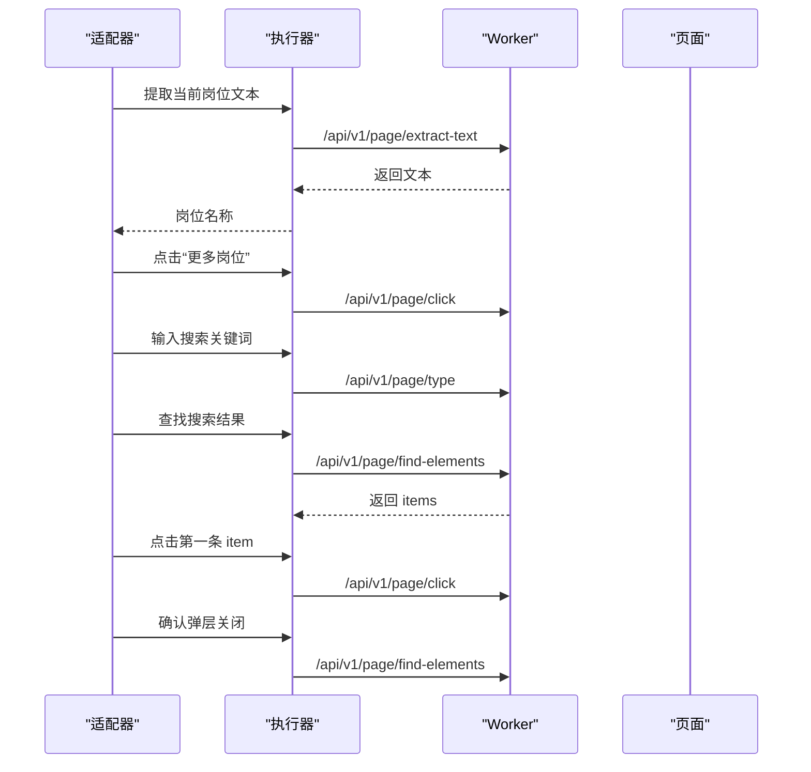
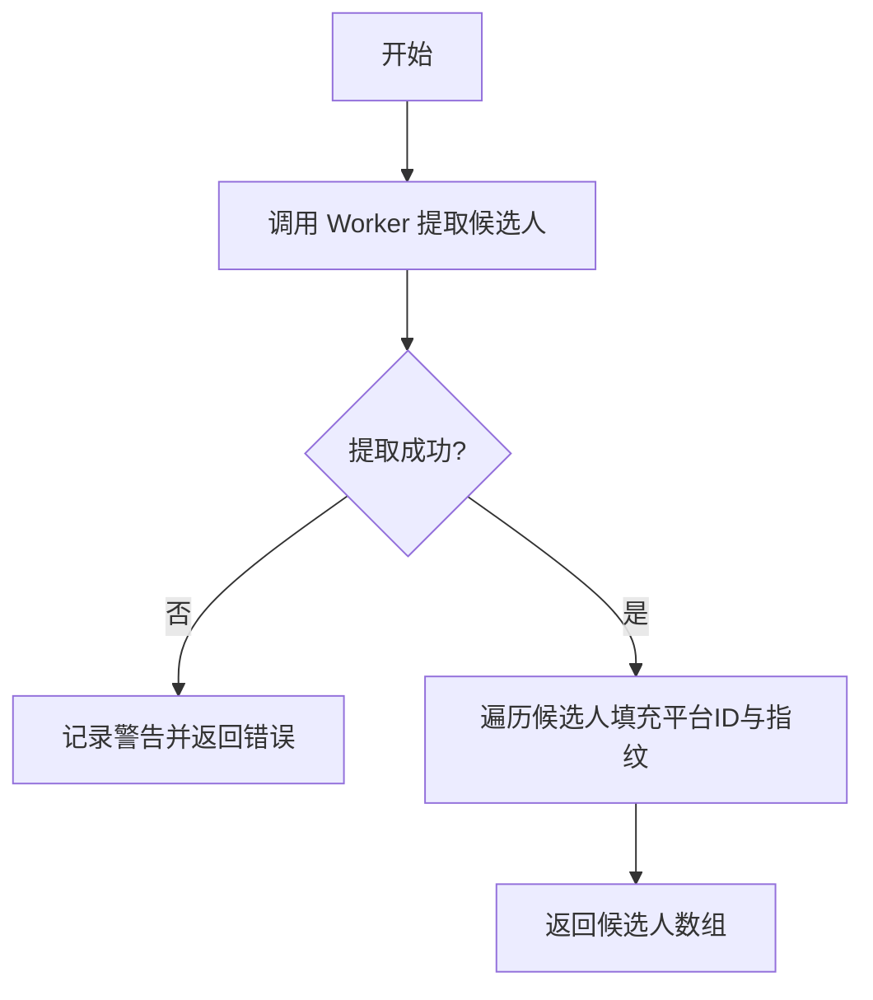
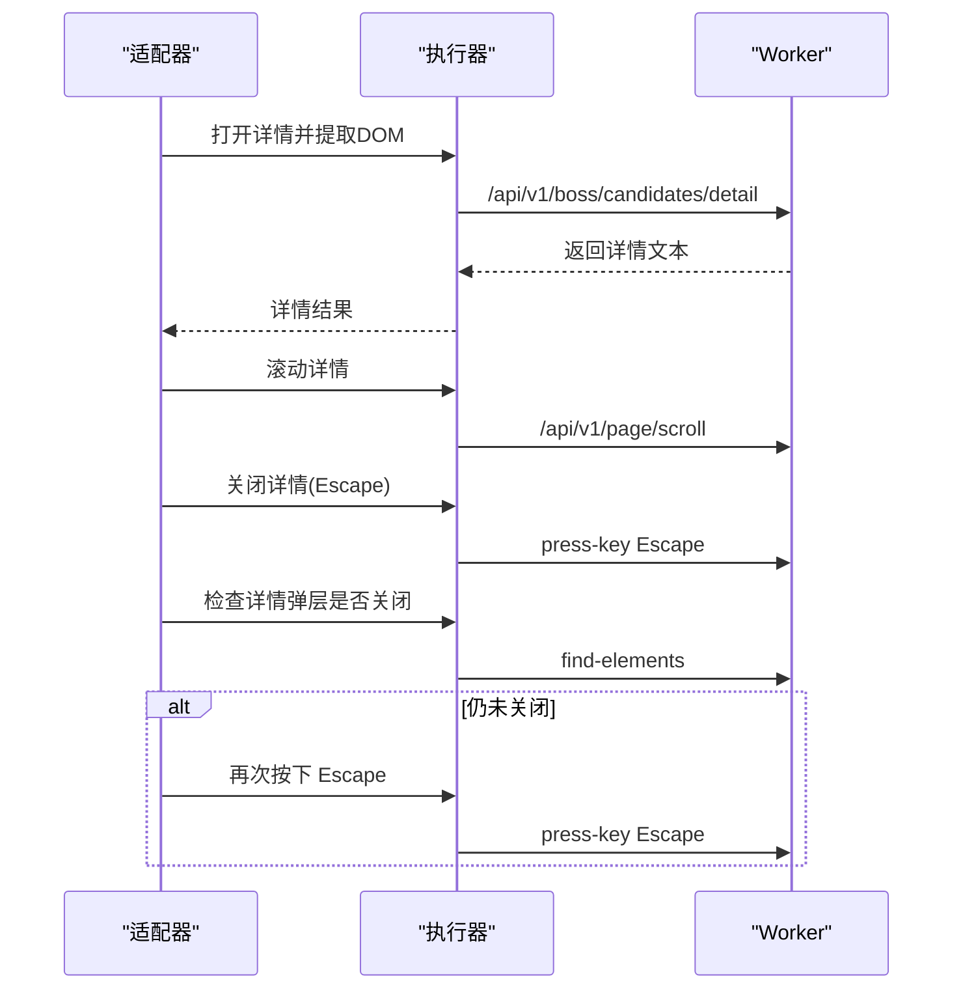
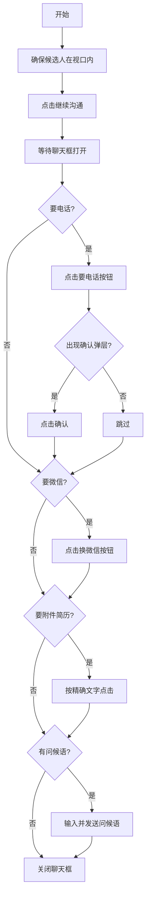
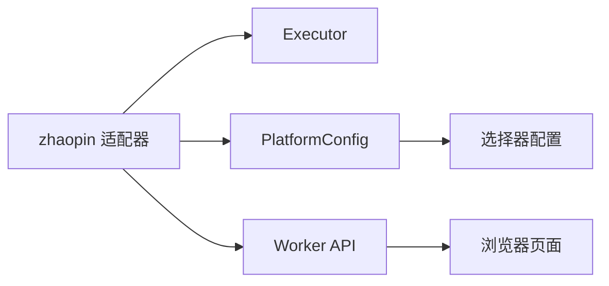

# 智联招聘适配器

<cite>
**本文引用的文件**   
- [entry.go](file://goodhr5/local-agent-go/internal/platforms/zhaopin/entry.go)
- [runtime.go](file://goodhr5/local-agent-go/internal/platforms/zhaopin/runtime.go)
- [navigation.go](file://goodhr5/local-agent-go/internal/platforms/zhaopin/navigation.go)
- [position.go](file://goodhr5/local-agent-go/internal/platforms/zhaopin/position.go)
- [candidate.go](file://goodhr5/local-agent-go/internal/platforms/zhaopin/candidate.go)
- [detail.go](file://goodhr5/local-agent-go/internal/platforms/zhaopin/detail.go)
- [greet.go](file://goodhr5/local-agent-go/internal/platforms/zhaopin/greet.go)
- [followup.go](file://goodhr5/local-agent-go/internal/platforms/zhaopin/followup.go)
- [helpers.go](file://goodhr5/local-agent-go/internal/platforms/zhaopin/helpers.go)
- [0059_refresh_liepin_zhaopin_platform_configs.sql](file://goodhr5/cloud/backend/db/migrations/0059_refresh_liepin_zhaopin_platform_configs.sql)
</cite>

## 目录
1. [简介](#简介)
2. [项目结构](#项目结构)
3. [核心组件](#核心组件)
4. [架构总览](#架构总览)
5. [详细组件分析](#详细组件分析)
6. [依赖关系分析](#依赖关系分析)
7. [性能与兼容性](#性能与兼容性)
8. [故障排查指南](#故障排查指南)
9. [结论](#结论)

## 简介
本文件面向“智联招聘平台适配器”，系统性梳理其页面结构特点、JavaScript 渲染机制、异步数据加载处理，以及职位浏览、候选人匹配、简历解析、消息发送等关键能力的实现方案。文档同时给出平台特定交互模式、表单提交处理、弹窗操作策略、配置项说明、兼容性处理方法、性能优化技巧、数据采集规范与错误恢复机制，帮助开发者快速理解并稳定扩展该适配器。

## 项目结构
智联招聘适配器的核心代码位于本地 Agent 的 platform 层，采用按平台分目录的组织方式：
- 运行时与能力入口：runtime.go、entry.go
- 导航与定位工具：navigation.go、helpers.go
- 岗位切换与当前岗位读取：position.go
- 候选人列表提取、滚动、可见性保证与指纹去重：candidate.go
- 详情 DOM 提取、滚动与关闭：detail.go
- 打招呼与后续信息索要（电话、微信、附件简历）：greet.go、followup.go
- 云端默认平台选择器配置：0059_refresh_liepin_zhaopin_platform_configs.sql

图示来源
- [runtime.go:11-22](file://goodhr5/local-agent-go/internal/platforms/zhaopin/runtime.go#L11-L22)
- [entry.go:12-43](file://goodhr5/local-agent-go/internal/platforms/zhaopin/entry.go#L12-L43)
- [navigation.go:12-77](file://goodhr5/local-agent-go/internal/platforms/zhaopin/navigation.go#L12-L77)
- [position.go:11-102](file://goodhr5/local-agent-go/internal/platforms/zhaopin/position.go#L11-L102)
- [candidate.go:13-85](file://goodhr5/local-agent-go/internal/platforms/zhaopin/candidate.go#L13-L85)
- [detail.go:13-102](file://goodhr5/local-agent-go/internal/platforms/zhaopin/detail.go#L13-L102)
- [greet.go:11-22](file://goodhr5/local-agent-go/internal/platforms/zhaopin/greet.go#L11-L22)
- [followup.go:14-168](file://goodhr5/local-agent-go/internal/platforms/zhaopin/followup.go#L14-L168)
- [helpers.go:112-180](file://goodhr5/local-agent-go/internal/platforms/zhaopin/helpers.go#L112-L180)
- [0059_refresh_liepin_zhaopin_platform_configs.sql:127-182](file://goodhr5/cloud/backend/db/migrations/0059_refresh_liepin_zhaopin_platform_configs.sql#L127-L182)

章节来源
- [runtime.go:11-22](file://goodhr5/local-agent-go/internal/platforms/zhaopin/runtime.go#L11-L22)
- [entry.go:12-43](file://goodhr5/local-agent-go/internal/platforms/zhaopin/entry.go#L12-L43)
- [navigation.go:12-77](file://goodhr5/local-agent-go/internal/platforms/zhaopin/navigation.go#L12-L77)
- [position.go:11-102](file://goodhr5/local-agent-go/internal/platforms/zhaopin/position.go#L11-L102)
- [candidate.go:13-85](file://goodhr5/local-agent-go/internal/platforms/zhaopin/candidate.go#L13-L85)
- [detail.go:13-102](file://goodhr5/local-agent-go/internal/platforms/zhaopin/detail.go#L13-L102)
- [greet.go:11-22](file://goodhr5/local-agent-go/internal/platforms/zhaopin/greet.go#L11-L22)
- [followup.go:14-168](file://goodhr5/local-agent-go/internal/platforms/zhaopin/followup.go#L14-L168)
- [helpers.go:112-180](file://goodhr5/local-agent-go/internal/platforms/zhaopin/helpers.go#L112-L180)
- [0059_refresh_liepin_zhaopin_platform_configs.sql:127-182](file://goodhr5/cloud/backend/db/migrations/0059_refresh_liepin_zhaopin_platform_configs.sql#L127-L182)

## 核心组件
- 运行时 Runtime：提供平台标识、是否直接选择岗位、候选人可见性参数构造、年龄解析与 ID 规范化等通用能力。
- 入口 Entry：打开入口页、准备入口页、判断当前是否为岗位运行入口页。
- 导航 Navigation：入口页匹配、默认页选择、岗位名称规范化、搜索关键词生成、列表容器与项配置合并。
- 岗位 Position：读取当前岗位名、通过弹层切换目标岗位。
- 候选人 Candidate：提取可见候选人、滚动列表、保证候选人在视口内、筛选文本与指纹去重。
- 详情 Detail：DOM 模式详情提取、滚动详情、关闭详情、清理平台附加内容。
- 打招呼 Greet：点击“继续沟通”发起打招呼。
- 后续 Followup：在聊天框中索要电话、微信、附件简历，并发送首次问候语。
- 工具 Helpers：统一 Worker 响应解析、元素定位载荷转换、字段请求构建等。

章节来源
- [runtime.go:11-69](file://goodhr5/local-agent-go/internal/platforms/zhaopin/runtime.go#L11-L69)
- [entry.go:12-43](file://goodhr5/local-agent-go/internal/platforms/zhaopin/entry.go#L12-L43)
- [navigation.go:12-162](file://goodhr5/local-agent-go/internal/platforms/zhaopin/navigation.go#L12-L162)
- [position.go:11-102](file://goodhr5/local-agent-go/internal/platforms/zhaopin/position.go#L11-L102)
- [candidate.go:13-85](file://goodhr5/local-agent-go/internal/platforms/zhaopin/candidate.go#L13-L85)
- [detail.go:13-102](file://goodhr5/local-agent-go/internal/platforms/zhaopin/detail.go#L13-L102)
- [greet.go:11-22](file://goodhr5/local-agent-go/internal/platforms/zhaopin/greet.go#L11-L22)
- [followup.go:14-168](file://goodhr5/local-agent-go/internal/platforms/zhaopin/followup.go#L14-L168)
- [helpers.go:112-180](file://goodhr5/local-agent-go/internal/platforms/zhaopin/helpers.go#L112-L180)

## 架构总览
智联招聘适配器通过统一的 Worker API 与浏览器侧执行器交互，所有页面操作、元素查找、文本输入、按键、滚动、截图等均由 Worker 完成；适配器负责业务编排、选择器拼装、重试与日志记录。

图示来源
- [candidate.go:13-49](file://goodhr5/local-agent-go/internal/platforms/zhaopin/candidate.go#L13-L49)
- [detail.go:13-39](file://goodhr5/local-agent-go/internal/platforms/zhaopin/detail.go#L13-L39)

## 详细组件分析

### 运行时与入口
- 运行时 Runtime
  - 声明平台标识为 zhaopin，强制每次直接切换岗位，不依赖页面当前岗位状态。
  - 构造候选人可见性参数，包含平台、配置、候选人姓名、匹配文本、卡片索引、元素引用、滚动尝试次数、等待时间、视口边距等。
  - 从候选人原始数据或字段中提取年龄，支持正则抽取“xx岁”。
  - 对候选人 ID 组成部分进行规范化，去除空白与多余字符。
- 入口 Entry
  - 打开入口页：校验入口 URL 非空，调用 Worker 打开页面。
  - 判断当前是否为岗位运行入口页：获取 Worker 页面列表，取默认页并与配置中的入口 URL 进行匹配（支持 prefix/contains/exact）。

图示来源
- [entry.go:12-43](file://goodhr5/local-agent-go/internal/platforms/zhaopin/entry.go#L12-L43)
- [navigation.go:12-71](file://goodhr5/local-agent-go/internal/platforms/zhaopin/navigation.go#L12-L71)

章节来源
- [runtime.go:11-69](file://goodhr5/local-agent-go/internal/platforms/zhaopin/runtime.go#L11-L69)
- [entry.go:12-43](file://goodhr5/local-agent-go/internal/platforms/zhaopin/entry.go#L12-L43)
- [navigation.go:12-71](file://goodhr5/local-agent-go/internal/platforms/zhaopin/navigation.go#L12-L71)

### 导航与定位
- 入口页匹配
  - 优先使用 auth.pages 中标记 entry=true 的页面，否则回退到任意带 url 的页面，最后回退到 cfg.url。
  - 支持 match 模式：prefix、contains、exact。
- 岗位名称规范化与搜索关键词生成
  - 去除岗位名称中的中英文括号说明，避免干扰搜索。
- 列表容器与项配置合并
  - 将父级类名与目标类名合并，增强定位鲁棒性。

章节来源
- [navigation.go:12-122](file://goodhr5/local-agent-go/internal/platforms/zhaopin/navigation.go#L12-L122)
- [helpers.go:112-180](file://goodhr5/local-agent-go/internal/platforms/zhaopin/helpers.go#L112-L180)

### 岗位切换与当前岗位读取
- 当前岗位读取
  - 通过配置中的 current 选择器，调用 Worker 提取文本，若为空则告警并返回错误。
- 岗位切换
  - 打开“更多岗位”弹层，输入精简关键词，等待刷新后读取第一条结果，使用 element_ref 精准点击，再次确认弹层已关闭。

图示来源
- [position.go:11-102](file://goodhr5/local-agent-go/internal/platforms/zhaopin/position.go#L11-L102)

章节来源
- [position.go:11-102](file://goodhr5/local-agent-go/internal/platforms/zhaopin/position.go#L11-L102)

### 候选人列表与可见性
- 列表提取
  - 调用 Worker 接口批量提取候选人卡片，附带平台标识、配置、最大数量等参数。
  - 对返回结果进行日志统计与耗时记录，并为每个候选人填充平台标识与去重 ID。
- 滚动与可见性
  - 滚动列表以加载更多。
  - 通过小步滚轮确保目标候选人在视口内，传入距离、等待时间、滚动尝试次数、视口边距等参数。

图示来源
- [candidate.go:13-49](file://goodhr5/local-agent-go/internal/platforms/zhaopin/candidate.go#L13-L49)

章节来源
- [candidate.go:13-85](file://goodhr5/local-agent-go/internal/platforms/zhaopin/candidate.go#L13-L85)

### 详情解析与滚动
- 详情提取
  - 仅支持 DOM 模式，构造可见性参数并调用 Worker 详情接口，返回 DOM 文本。
- 详情滚动
  - 在 AI 分析期间滚动一次详情弹框，提升长内容可读性。
- 详情关闭
  - 先尝试 Escape 键关闭，再检测详情弹层是否存在，必要时再次按下 Escape，最多两次重试。

图示来源
- [detail.go:13-96](file://goodhr5/local-agent-go/internal/platforms/zhaopin/detail.go#L13-L96)

章节来源
- [detail.go:13-102](file://goodhr5/local-agent-go/internal/platforms/zhaopin/detail.go#L13-L102)

### 打招呼与后续信息索要
- 打招呼
  - 先确保候选人在视口内，再点击“继续沟通”发起打招呼。
- 后续信息索要
  - 打开聊天框后，根据配置依次执行：
    - 要电话：点击按钮，若出现确认弹层则点击确认。
    - 换微信：点击按钮。
    - 要附件简历：在限定范围内按精确文字点击。
    - 发送首次问候语：向输入框输入并按 Enter 发送。
  - 使用 defer 确保聊天框最终被关闭，失败时记录警告并可能覆盖结果错误。

图示来源
- [greet.go:11-22](file://goodhr5/local-agent-go/internal/platforms/zhaopin/greet.go#L11-L22)
- [followup.go:30-101](file://goodhr5/local-agent-go/internal/platforms/zhaopin/followup.go#L30-L101)
- [followup.go:128-168](file://goodhr5/local-agent-go/internal/platforms/zhaopin/followup.go#L128-L168)

章节来源
- [greet.go:11-22](file://goodhr5/local-agent-go/internal/platforms/zhaopin/greet.go#L11-L22)
- [followup.go:14-168](file://goodhr5/local-agent-go/internal/platforms/zhaopin/followup.go#L14-L168)

### 工具与辅助函数
- Worker 响应解析：统一从 data 字段取值，兼容旧格式。
- 元素定位载荷转换：支持 target_classes/parent_classes/targetClasses/parentClasses 等多种写法，并透传 attempts/interval 等参数。
- 字段请求构建：从 card.fields 中解析各字段的定位器，供 Worker 批量提取。
- 候选人展示名与文本规范化：用于日志与比较。

章节来源
- [helpers.go:75-180](file://goodhr5/local-agent-go/internal/platforms/zhaopin/helpers.go#L75-L180)

## 依赖关系分析
- 内部依赖
  - 适配器依赖 platformcore.Executor 与 cloudapi.PlatformConfig，通过 Worker API 与浏览器交互。
  - 各模块之间职责清晰：运行时与入口、导航、岗位、候选人、详情、打招呼、后续、工具。
- 外部依赖
  - Worker API：/api/v1/page/* 与 /api/v1/boss/candidates/*。
  - 云端平台选择器配置：platform.zhaopin，定义入口页、卡片字段、动作、详情、岗位、行为等选择器。

图示来源
- [runtime.go:11-22](file://goodhr5/local-agent-go/internal/platforms/zhaopin/runtime.go#L11-L22)
- [entry.go:12-43](file://goodhr5/local-agent-go/internal/platforms/zhaopin/entry.go#L12-L43)
- [0059_refresh_liepin_zhaopin_platform_configs.sql:127-182](file://goodhr5/cloud/backend/db/migrations/0059_refresh_liepin_zhaopin_platform_configs.sql#L127-L182)

章节来源
- [runtime.go:11-22](file://goodhr5/local-agent-go/internal/platforms/zhaopin/runtime.go#L11-L22)
- [entry.go:12-43](file://goodhr5/local-agent-go/internal/platforms/zhaopin/entry.go#L12-L43)
- [0059_refresh_liepin_zhaopin_platform_configs.sql:127-182](file://goodhr5/cloud/backend/db/migrations/0059_refresh_liepin_zhaopin_platform_configs.sql#L127-L182)

## 性能与兼容性
- 性能优化建议
  - 减少不必要的滚动与等待：候选人可见性参数中合理设置 wait_ms、card_scroll_attempts、viewport_margin。
  - 使用 element_ref 精准点击，降低重复查找成本。
  - 批量提取候选人字段，避免多次 Worker 往返。
  - 详情滚动仅在需要时触发，避免频繁 IO。
- 兼容性处理
  - 元素定位载荷兼容新旧两种命名风格（target_classes/targetClasses 等）。
  - Worker 响应兼容 data 包裹与顶层字段两种格式。
  - 入口页匹配支持多种 URL 匹配模式，适应不同部署域名与登录态跳转。
- 数据采集规范
  - 候选人字段通过 card.fields 配置化提取，便于平台 UI 变更时快速调整。
  - 详情仅使用 DOM 模式，避免 OCR/AI 带来的额外开销与不确定性。
- 错误恢复机制
  - 多处调用失败均返回结构化错误，并在关键路径记录日志（如当前岗位为空、弹层未关闭、详情未读取到文本等）。
  - 详情关闭采用“Esc + 检测 + 再次 Esc”的两阶段重试，提高鲁棒性。
  - 后续信息索要流程使用 defer 确保聊天框最终关闭，即使中间步骤失败也能尽量恢复页面状态。

章节来源
- [runtime.go:24-69](file://goodhr5/local-agent-go/internal/platforms/zhaopin/runtime.go#L24-L69)
- [helpers.go:112-180](file://goodhr5/local-agent-go/internal/platforms/zhaopin/helpers.go#L112-L180)
- [detail.go:57-96](file://goodhr5/local-agent-go/internal/platforms/zhaopin/detail.go#L57-L96)
- [followup.go:45-54](file://goodhr5/local-agent-go/internal/platforms/zhaopin/followup.go#L45-L54)

## 故障排查指南
- 入口页无法识别
  - 检查云端配置 platform.zhaopin.auth.pages 中 entry 标记与 URL 匹配模式是否正确。
  - 确认 Worker 返回的页面列表中存在默认页且 URL 与配置匹配。
- 当前岗位为空
  - 检查 position.current 选择器是否能命中页面元素。
  - 查看日志中 found/count/text_len/selector/parent_selector/frame_url 等诊断字段。
- 岗位切换失败
  - 确认“更多岗位”弹层可被点击，搜索关键词是否被正确精简。
  - 检查搜索结果列表是否返回，第一条 item 是否包含 element_ref。
- 候选人提取失败
  - 检查 Worker 接口 /api/v1/boss/candidates/extract 是否返回 candidates 列表。
  - 核对 card.fields 配置是否与页面结构一致。
- 详情未读取到文本
  - 确认仅使用 DOM 模式，且详情弹层已成功打开。
  - 检查 detail.openTarget 与 detail.content 选择器。
- 聊天框未关闭
  - 关注 closeZhaopinChatDialog 的错误日志，必要时手动检查 .im-widget-session__close 是否可点击。

章节来源
- [entry.go:27-43](file://goodhr5/local-agent-go/internal/platforms/zhaopin/entry.go#L27-L43)
- [position.go:13-28](file://goodhr5/local-agent-go/internal/platforms/zhaopin/position.go#L13-L28)
- [position.go:31-102](file://goodhr5/local-agent-go/internal/platforms/zhaopin/position.go#L31-L102)
- [candidate.go:13-49](file://goodhr5/local-agent-go/internal/platforms/zhaopin/candidate.go#L13-L49)
- [detail.go:13-39](file://goodhr5/local-agent-go/internal/platforms/zhaopin/detail.go#L13-L39)
- [detail.go:57-96](file://goodhr5/local-agent-go/internal/platforms/zhaopin/detail.go#L57-L96)
- [followup.go:158-168](file://goodhr5/local-agent-go/internal/platforms/zhaopin/followup.go#L158-L168)

## 结论
智联招聘适配器通过清晰的模块化设计与稳定的 Worker API 抽象，实现了从入口页管理、岗位切换、候选人提取、详情解析到打招呼与信息索要的全链路自动化。其配置驱动的选择器体系与多模式兼容逻辑，有效应对平台 UI 变化与不同部署环境。结合合理的性能优化与错误恢复策略，可在复杂动态页面环境中保持较高的稳定性与可维护性。