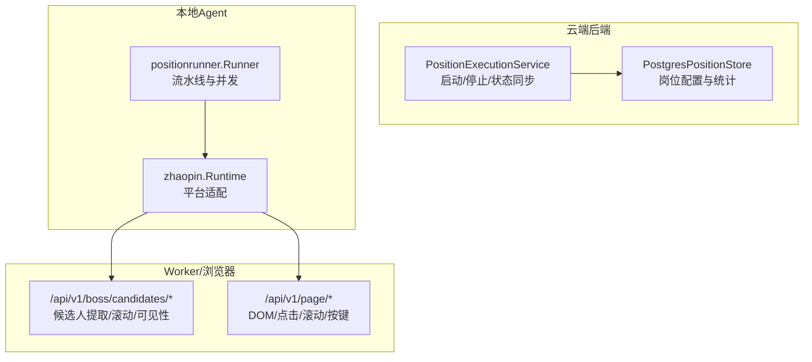
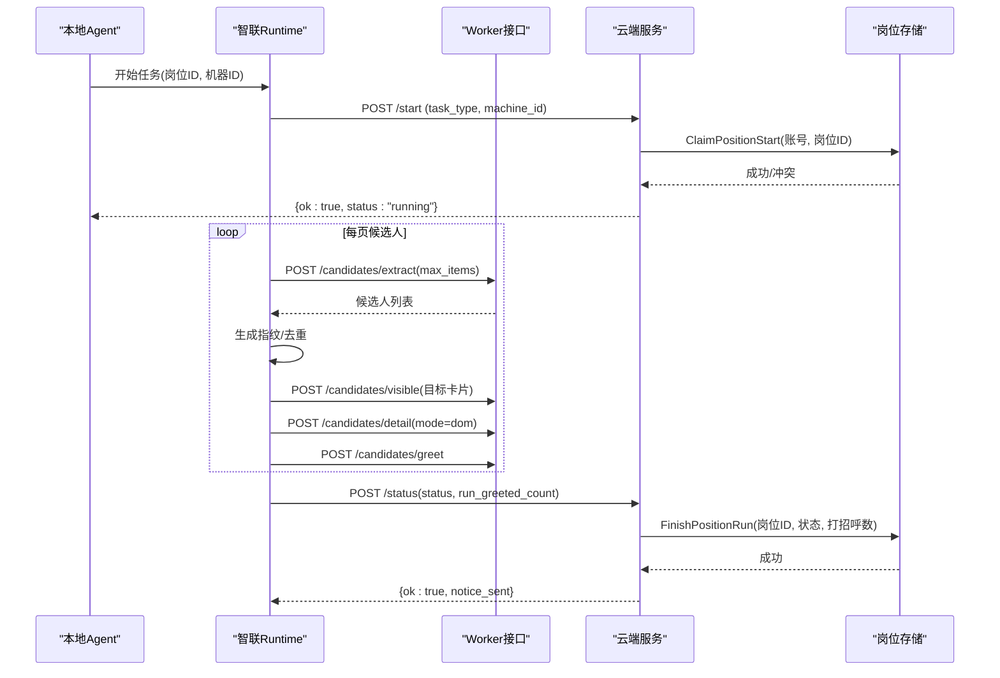
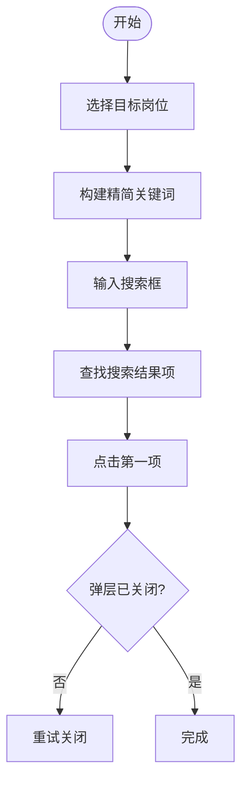
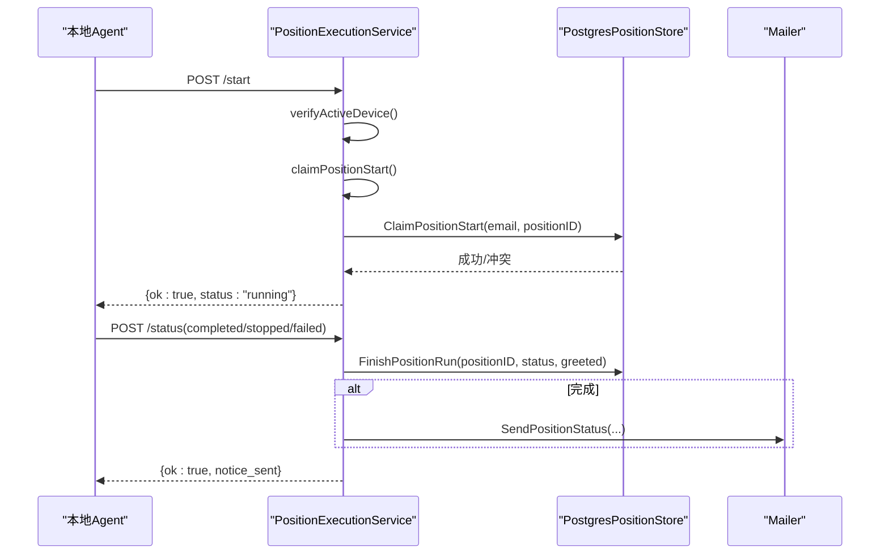
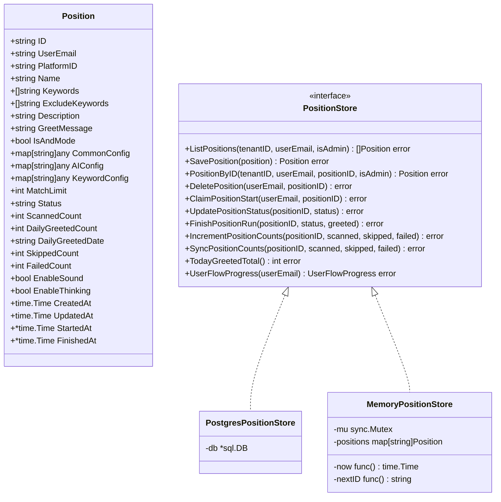
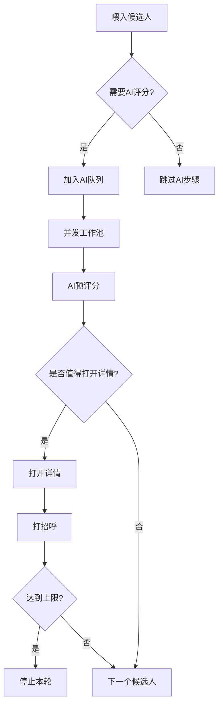
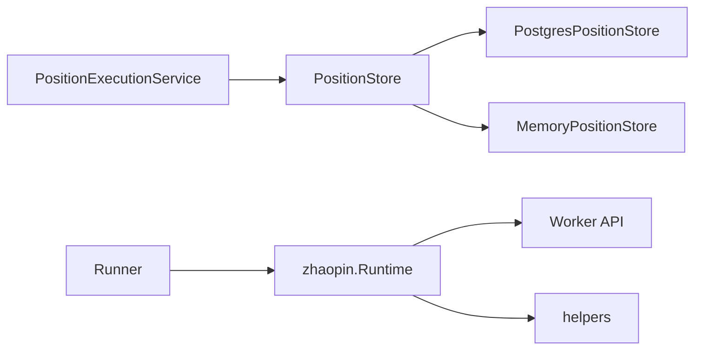

# 职位管理

<cite>
**本文引用的文件**
- [position_store.go](file://goodhr5/cloud/backend/internal/httpapi/position_store.go)
- [position_store_pg.go](file://goodhr5/cloud/backend/internal/httpapi/position_store_pg.go)
- [position_execution.go](file://goodhr5/cloud/backend/internal/httpapi/position_execution.go)
- [runtime.go](file://goodhr5/local-agent-go/internal/platforms/zhaopin/runtime.go)
- [position.go](file://goodhr5/local-agent-go/internal/platforms/zhaopin/position.go)
- [navigation.go](file://goodhr5/local-agent-go/internal/platforms/zhaopin/navigation.go)
- [candidate.go](file://goodhr5/local-agent-go/internal/platforms/zhaopin/candidate.go)
- [detail.go](file://goodhr5/local-agent-go/internal/platforms/zhaopin/detail.go)
- [greet.go](file://goodhr5/local-agent-go/internal/platforms/zhaopin/greet.go)
- [helpers.go](file://goodhr5/local-agent-go/internal/platforms/zhaopin/helpers.go)
- [pipeline.go](file://goodhr5/local-agent-go/internal/positionrunner/pipeline.go)
</cite>

## 目录
1. [简介](#简介)
2. [项目结构](#项目结构)
3. [核心组件](#核心组件)
4. [架构总览](#架构总览)
5. [详细组件分析](#详细组件分析)
6. [依赖关系分析](#依赖关系分析)
7. [性能考量](#性能考量)
8. [故障排查指南](#故障排查指南)
9. [结论](#结论)
10. [附录](#附录)

## 简介
本文件聚焦智联招聘平台的“职位管理”能力，围绕职位数据的获取、解析与存储机制展开，覆盖以下关键点：
- 职位列表抓取策略：通过本地运行时调用 Worker 接口提取候选人卡片，结合平台配置进行定位与滚动。
- 职位信息字段映射：从 Worker 返回的候选对象中抽取姓名、年龄、筛选文本等字段，并生成去重指纹。
- 搜索条件构建：将岗位名称规范化为平台可识别的精简关键词，用于切换目标岗位或构造搜索输入。
- 职位状态管理：云端服务负责启动校验、并发控制、结束同步与统计累计。
- 分页处理：按页滚动加载候选人列表，限制单次提取数量，避免过度请求。
- 数据去重逻辑：基于候选人指纹（姓名+年龄）实现跨页面去重。
- 配置参数说明：岗位公共配置、AI 配置、关键字配置及平台选择器配置。
- 异常处理方案：统一错误码、设备绑定校验、会员与 AI 余额检查、失败通知与邮件提醒。
- 性能优化技巧：并发流水线、超时保护、最小化 DOM 操作、增量统计同步。
- API 调用示例与数据处理流程：从本地 Agent 到云端服务的完整时序。

## 项目结构
本项目采用“云端后端 + 本地 Agent + 平台适配层”的分层设计：
- 云端后端提供岗位配置的持久化、运行状态管理与通知能力。
- 本地 Agent 负责浏览器自动化、候选人提取、详情读取与打招呼动作。
- 平台适配层针对智联招聘实现具体交互细节（选择岗位、提取候选人、打开/关闭详情、打招呼）。

**图表来源**
- [position_execution.go:51-91](file://goodhr5/cloud/backend/internal/httpapi/position_execution.go#L51-L91)
- [position_store_pg.go:24-109](file://goodhr5/cloud/backend/internal/httpapi/position_store_pg.go#L24-L109)
- [candidate.go:14-50](file://goodhr5/local-agent-go/internal/platforms/zhaopin/candidate.go#L14-L50)
- [detail.go:15-40](file://goodhr5/local-agent-go/internal/platforms/zhaopin/detail.go#L15-L40)
- [greet.go:12-22](file://goodhr5/local-agent-go/internal/platforms/zhaopin/greet.go#L12-L22)

**章节来源**
- [position_execution.go:51-91](file://goodhr5/cloud/backend/internal/httpapi/position_execution.go#L51-L91)
- [position_store_pg.go:24-109](file://goodhr5/cloud/backend/internal/httpapi/position_store_pg.go#L24-L109)
- [candidate.go:14-50](file://goodhr5/local-agent-go/internal/platforms/zhaopin/candidate.go#L14-L50)
- [detail.go:15-40](file://goodhr5/local-agent-go/internal/platforms/zhaopin/detail.go#L15-L40)
- [greet.go:12-22](file://goodhr5/local-agent-go/internal/platforms/zhaopin/greet.go#L12-L22)

## 核心组件
- 云端岗位执行服务：负责启动许可、设备绑定校验、会员与 AI 余额检查、并发占用、结束同步与通知。
- 岗位配置存储：内存与 PostgreSQL 两种实现，支持增删改查、状态更新、统计累计与业务日期计算。
- 智联招聘平台运行时：封装平台特定的元素定位、候选人提取、详情页操作、打招呼流程。
- 本地流水线：候选人处理管道、AI 预评分、超时保护、并发控制与上限判断。

**章节来源**
- [position_execution.go:21-47](file://goodhr5/cloud/backend/internal/httpapi/position_execution.go#L21-L47)
- [position_store.go:14-62](file://goodhr5/cloud/backend/internal/httpapi/position_store.go#L14-L62)
- [runtime.go:11-22](file://goodhr5/local-agent-go/internal/platforms/zhaopin/runtime.go#L11-L22)
- [pipeline.go:49-150](file://goodhr5/local-agent-go/internal/positionrunner/pipeline.go#L49-L150)

## 架构总览
本地 Agent 通过平台适配层与 Worker 交互，完成候选人列表抓取、详情读取与打招呼；云端服务负责岗位生命周期管理与统计汇总。

**图表来源**
- [position_execution.go:51-91](file://goodhr5/cloud/backend/internal/httpapi/position_execution.go#L51-L91)
- [position_execution.go:125-213](file://goodhr5/cloud/backend/internal/httpapi/position_execution.go#L125-L213)
- [position_store_pg.go:338-409](file://goodhr5/cloud/backend/internal/httpapi/position_store_pg.go#L338-L409)
- [candidate.go:14-50](file://goodhr5/local-agent-go/internal/platforms/zhaopin/candidate.go#L14-L50)
- [detail.go:15-40](file://goodhr5/local-agent-go/internal/platforms/zhaopin/detail.go#L15-L40)
- [greet.go:12-22](file://goodhr5/local-agent-go/internal/platforms/zhaopin/greet.go#L12-L22)

## 详细组件分析

### 智联招聘平台运行时（zhaopin.Runtime）
- 岗位切换：直接切换岗位，不读取当前岗位；通过搜索弹层输入精简关键词，选择第一条结果并确认弹层关闭。
- 候选人提取：调用 Worker 接口提取可见候选人，附加平台标识与指纹，记录耗时与日志。
- 详情页处理：仅支持 DOM 模式，设置可见性与滚动参数，提取详情文本并清理平台附加内容。
- 打招呼流程：确保候选人可见后执行打招呼动作。
- 辅助工具：通用元素定位转换、字段提取、耗时格式化、文本规范化。

**图表来源**
- [position.go:31-102](file://goodhr5/local-agent-go/internal/platforms/zhaopin/position.go#L31-L102)
- [navigation.go:73-93](file://goodhr5/local-agent-go/internal/platforms/zhaopin/navigation.go#L73-L93)

**章节来源**
- [position.go:11-102](file://goodhr5/local-agent-go/internal/platforms/zhaopin/position.go#L11-L102)
- [candidate.go:14-86](file://goodhr5/local-agent-go/internal/platforms/zhaopin/candidate.go#L14-L86)
- [detail.go:15-103](file://goodhr5/local-agent-go/internal/platforms/zhaopin/detail.go#L15-L103)
- [greet.go:12-22](file://goodhr5/local-agent-go/internal/platforms/zhaopin/greet.go#L12-L22)
- [helpers.go:9-207](file://goodhr5/local-agent-go/internal/platforms/zhaopin/helpers.go#L9-L207)

### 云端岗位执行服务（PositionExecutionService）
- 启动校验：会话验证、设备绑定检查、会员与 AI 余额校验、并发占用控制。
- 状态同步：接收本地状态上报，幂等更新岗位状态与统计，发送完成/停止通知。
- 失败通知：接收失败消息，归因分类，发送邮件提醒并记录用户流程事件。

**图表来源**
- [position_execution.go:51-91](file://goodhr5/cloud/backend/internal/httpapi/position_execution.go#L51-L91)
- [position_execution.go:125-213](file://goodhr5/cloud/backend/internal/httpapi/position_execution.go#L125-L213)
- [position_execution.go:311-371](file://goodhr5/cloud/backend/internal/httpapi/position_execution.go#L311-L371)
- [position_store_pg.go:338-409](file://goodhr5/cloud/backend/internal/httpapi/position_store_pg.go#L338-L409)

**章节来源**
- [position_execution.go:21-47](file://goodhr5/cloud/backend/internal/httpapi/position_execution.go#L21-L47)
- [position_execution.go:51-91](file://goodhr5/cloud/backend/internal/httpapi/position_execution.go#L51-L91)
- [position_execution.go:125-213](file://goodhr5/cloud/backend/internal/httpapi/position_execution.go#L125-L213)
- [position_execution.go:311-371](file://goodhr5/cloud/backend/internal/httpapi/position_execution.go#L311-L371)

### 岗位配置存储（PositionStore）
- 模型定义：包含岗位基本信息、关键字、匹配上限、状态、统计计数、时间戳等。
- 接口抽象：列出、保存、查询、删除、抢占启动、状态更新、结束同步、统计累加与同步、今日打招呼总数、用户流程进度。
- 内存实现：开发期使用，线程安全，模拟数据库行为。
- PostgreSQL 实现：生产环境持久化，事务锁防并发冲突，JSONB 存储复杂配置。

**图表来源**
- [position_store.go:14-62](file://goodhr5/cloud/backend/internal/httpapi/position_store.go#L14-L62)
- [position_store_pg.go:13-21](file://goodhr5/cloud/backend/internal/httpapi/position_store_pg.go#L13-L21)
- [position_store.go:64-83](file://goodhr5/cloud/backend/internal/httpapi/position_store.go#L64-L83)

**章节来源**
- [position_store.go:14-62](file://goodhr5/cloud/backend/internal/httpapi/position_store.go#L14-L62)
- [position_store_pg.go:24-109](file://goodhr5/cloud/backend/internal/httpapi/position_store_pg.go#L24-L109)
- [position_store_pg.go:111-267](file://goodhr5/cloud/backend/internal/httpapi/position_store_pg.go#L111-L267)
- [position_store_pg.go:313-457](file://goodhr5/cloud/backend/internal/httpapi/position_store_pg.go#L313-L457)
- [position_store.go:85-150](file://goodhr5/cloud/backend/internal/httpapi/position_store.go#L85-L150)
- [position_store.go:174-246](file://goodhr5/cloud/backend/internal/httpapi/position_store.go#L174-L246)

### 本地流水线与并发控制（positionrunner）
- 超时保护：为每个候选人关键操作设置超时与异常捕获，记录耗时与错误。
- 并发工作池：根据候选人数量动态调整并发度，批量送入 AI 预评分队列。
- 流水线喂入：按顺序将候选人送入处理队列，必要时跳过不可继续的候选人。
- 运行上限：根据岗位匹配上限判断是否停止打招呼。

**图表来源**
- [pipeline.go:14-47](file://goodhr5/local-agent-go/internal/positionrunner/pipeline.go#L14-L47)
- [pipeline.go:49-116](file://goodhr5/local-agent-go/internal/positionrunner/pipeline.go#L49-L116)
- [pipeline.go:133-150](file://goodhr5/local-agent-go/internal/positionrunner/pipeline.go#L133-L150)

**章节来源**
- [pipeline.go:14-47](file://goodhr5/local-agent-go/internal/positionrunner/pipeline.go#L14-L47)
- [pipeline.go:49-116](file://goodhr5/local-agent-go/internal/positionrunner/pipeline.go#L49-L116)
- [pipeline.go:118-150](file://goodhr5/local-agent-go/internal/positionrunner/pipeline.go#L118-L150)

## 依赖关系分析
- 云端服务依赖岗位存储接口，屏蔽底层实现差异（内存/PostgreSQL）。
- 本地运行时依赖 Worker 提供的候选人提取、滚动、可见性、详情与打招呼接口。
- 平台适配层依赖通用工具函数进行元素定位与数据解析。
- 流水线依赖本地 AI 客户端（可选），仅在 AI 模式或详情 AI 模式下启用。

**图表来源**
- [position_execution.go:21-47](file://goodhr5/cloud/backend/internal/httpapi/position_execution.go#L21-L47)
- [position_store.go:49-62](file://goodhr5/cloud/backend/internal/httpapi/position_store.go#L49-L62)
- [position_store_pg.go:13-21](file://goodhr5/cloud/backend/internal/httpapi/position_store_pg.go#L13-L21)
- [position_store.go:64-83](file://goodhr5/cloud/backend/internal/httpapi/position_store.go#L64-L83)
- [candidate.go:14-50](file://goodhr5/local-agent-go/internal/platforms/zhaopin/candidate.go#L14-L50)
- [helpers.go:9-207](file://goodhr5/local-agent-go/internal/platforms/zhaopin/helpers.go#L9-L207)

**章节来源**
- [position_execution.go:21-47](file://goodhr5/cloud/backend/internal/httpapi/position_execution.go#L21-L47)
- [position_store.go:49-62](file://goodhr5/cloud/backend/internal/httpapi/position_store.go#L49-L62)
- [candidate.go:14-50](file://goodhr5/local-agent-go/internal/platforms/zhaopin/candidate.go#L14-L50)
- [helpers.go:9-207](file://goodhr5/local-agent-go/internal/platforms/zhaopin/helpers.go#L9-L207)

## 性能考量
- 并发流水线：根据候选人数量动态调整并发度，避免资源争用与过载。
- 超时保护：为关键操作设置超时，防止阻塞与长时间等待。
- 最小化 DOM 操作：仅对必要元素进行滚动与点击，减少页面抖动与渲染开销。
- 增量统计：云端与服务端分别维护统计，支持增量累加与最终同步，降低写入压力。
- 去重指纹：基于姓名与年龄生成稳定指纹，避免重复处理同一候选人。
- 配置驱动：通过平台配置与岗位公共配置灵活调整行为，减少代码变更成本。

[本节为通用性能建议，不直接分析具体文件]

## 故障排查指南
- 启动失败：检查会话有效性、设备绑定状态、会员与 AI 余额、并发冲突。
- 候选人提取失败：确认 Worker 接口可用、平台配置中的选择器正确、网络与权限正常。
- 详情页无法关闭：尝试再次按下 Escape 键，确认弹层元素消失。
- 状态不同步：检查云端状态同步接口调用是否成功，统计是否正确累加。
- 失败通知：查看错误消息归类，确认邮件发送是否成功。

**章节来源**
- [position_execution.go:215-275](file://goodhr5/cloud/backend/internal/httpapi/position_execution.go#L215-L275)
- [position_execution.go:311-371](file://goodhr5/cloud/backend/internal/httpapi/position_execution.go#L311-L371)
- [detail.go:57-96](file://goodhr5/local-agent-go/internal/platforms/zhaopin/detail.go#L57-L96)
- [position_store_pg.go:338-409](file://goodhr5/cloud/backend/internal/httpapi/position_store_pg.go#L338-L409)

## 结论
本系统通过云端与本地的协同，实现了智联招聘平台职位管理的完整闭环：从岗位切换、候选人抓取、详情解析到打招呼与状态同步。借助配置驱动、并发流水线与严格的状态管理，系统在稳定性与性能上具备良好表现。未来可进一步优化选择器鲁棒性、提升错误恢复能力与扩展更多平台适配。

[本节为总结性内容，不直接分析具体文件]

## 附录
- 职位配置参数说明：
  - 公共配置（CommonConfig）：包含模式默认值、详情模式、开关等。
  - AI 配置（AIConfig）：模型、API Key、思考模式等。
  - 关键字配置（KeywordConfig）：关键字匹配规则、排除词等。
  - 平台配置：入口页、选择器、字段映射、滚动参数等。
- API 调用示例路径：
  - 启动许可：POST /start
  - 状态同步：POST /status
  - 失败通知：POST /fail_notice
  - 候选人提取：POST /api/v1/boss/candidates/extract
  - 详情读取：POST /api/v1/boss/candidates/detail
  - 打招呼：POST /api/v1/boss/candidates/greet

[本节为补充信息，不直接分析具体文件]